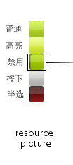
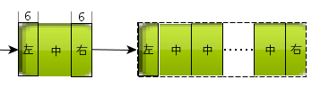
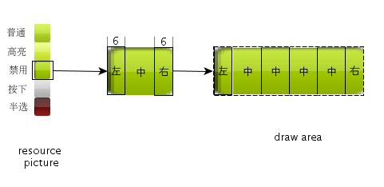
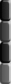

# 新控件集Skin渲染器图片规格

## 1 前言

- `skin` 的所有元素的类型都是文件名，该文件名对应的是加载到系统缓冲池中的图片(通过 L`oadResource`)。两者必须一致
- `skin renderer` 实际不保存文件名，只保存由这些文件名生成的 `RES_KEY`,然后通过 `GetResource` 获取图片
- 由于很多控件有 `normal`、`press`、`highlight`、`diable` 等等状态的区分，对一个控件而言，每一个状态都保存成一幅图片，对资源的保存和图片加载的过程都是很大的浪费，所以 `mgncs` 中 `skin` 渲染器沿用 minigui 中的图片使用方式，就是将相关联的多张图合成一张，绘制时扣取不同的部分使用，例如，对 button 图片,我们设计成五个部分的组合图片，当我们要绘制某一个状态的button时，就取这一部分的子图来使用：

- 图片的绘制方式有两种:
  1. 直接拉伸填充绘制: 这种方式不难理解，就是把资源图片按照绘制区域的大小以一定的比例进行放大来填充。
  2. 分段填充绘制: 这种方式会将取到的图片（或者子图）按照上、中、下或者左、中、右的方式分成三段，然后把两端单独填充，中间部分则循环使用用中间部分来进行填充，我们依然以 button 为例，如图

这种方式能较好得保留“圆角”等边界效果，使用这种方式填充的图片设计时要注意：

1. 左中右、上中下3段的分界线每个图片是不同的，下面会详细说明
2. 中间部分由于要循环使用，注意过渡平滑一些

## 2 公用图片属性

| 属性名 | 类型 | 说明 |
|:------|:----|:-----|
| `NCS_IMAGE_ARROWS` | 文件名 | 箭头图片 |
| `NCS_IMAGE_ARROWSHELL` | 文件名 | 箭头按钮图片 |

- 图片的规格
   - `arrow` 图片用于 `skin` 渲染器中箭头的绘制，由自上而下的 16 部分小图构成,每个小图都是一个正方形，内部的对应关系是
      - 0~3     : 向上的箭头的各个状态（0-普通、1-高亮、2-按下、3-禁止）
      - 4~7     : 向下的箭头的各个状态（4-普通、5-高亮、6-按下、7-禁止）
      - 8~11   : 向左的箭头的各个状态（8-普通、9-高亮、10-按下、11-禁止）
      - 12~15 : 向右的箭头的各个状态（12-普通、13-高亮、14-按下、15-禁止）
   - `arrow_shell` 图 `spin` 和 `scroll` 系列中，用于实现 `arrow` 按钮的效果，由自上而下的 4 部分小图构成,每个小图都是一个正方形，每一部分对应按钮的一种状态：
      - 0-普通
      - 1-高亮
      - 2-按下
      - 3-禁用
   - 另外，`arrow` 图一般是配合 `arrow-shell` 图使用的，使用时有叠加的处理，所以 `arrow` 周围的区域一般做成透明的。
   - 使用该图片采用 直接拉伸填充，注意图片合理设计。

## 3 mButton

| 属性名 | 类型 | 说明 |
|:------|:----|:-----|
| `NCS_IMAGE_PUSHBUTTON` | 文件名 | `push button` 的图片 |

图片的规格

- 用于 `skin` 渲染器中 `pushbutton` 的绘制效果，图片由自上而下的5部分组成，每一部分都是一个长方形的 button，分别对应 `pushbutton` 的五种状态：
   - 0 - 普通
   - 1 - 高亮
   - 2 - 按下
   - 3 - 禁用
   - 4 - 三态按钮中的“半选”状态
- 绘制的时候，使用图片进行分段填充的，左右两端均为 6 个像素宽，中间一段宽度不限，注意图片的合理设计。

## 4 mCheckbutton

| 属性名 | 类型 | 说明 |
|:------|:----|:-----|
| `NCS_IMAGE_CHECKBUTTON` | 文件名 | `check button` 的图片 |

图片的规格

- 用于 `skin` 渲染器的 `checkbutton` 的绘制渲染，图片由自上而下的 8 部分组成，每一部分都是一个长方形，分别对应 `checkbutton` 的 8 种状态：
   - 0~3:未选中时的普通、高亮、按下、禁用状态
   - 4~7:选中时的普通、高亮、按下、禁用状态
- 若图片大于绘制区域，会缩小图片进行绘制，否则采用直接用图片大小来填充，注意图片设计
- 示例

## 5 mRadiobutton

| 属性名 | 类型 | 说明 |
|:------|:----|:-----|
| `NCS_IMAGE_RADIOBUTTON` |  文件名 | `radio button` 的图片 |

__图片的规格与 `checkbutton` 相同__

## 6 mListView

| 属性名 | 类型 | 说明 |
|:------|:----|:-----|
| `NCS_IMAGE_TREE` | 文件名 | `tree` 中折叠/展开开关的图片 |
| `NCS_IMAGE_HEADER` | 文件名 | 表头部分的图片 |

图片的规格

- 用于实现树形控件中的折叠、展开按钮的渲染效果，图片由等份的上下两步分组成，上半部分是折叠的效果，下半部分是展开的效果
- 使用时，会直接以图片的大小来填充，不会拉伸，所以注意图片设计的尺寸，不要过大或过小
- 示例

## 7 mPropSheet

| 属性名 | 类型 | 说明 |
|:------|:----|:-----|
| `NCS_IMAGE_TAB` | 文件名 | `PropSheet Tab` 页的图片 |

图片的规格

- 用于渲染 `propsheet` 页的 `tab` 效果，由自上而下的四部分组成，`mgncs` 中使用到的只有第一、三两部分，分别表示：
   - 0 - `inactive` 页的 `tab` 效果
   - 2 - `active` 页的 `tab` 效果
- 分段绘制，左、中、右分别占 3、x、4 个像素，注意图片的设计
- 示例

## 8 mProgressBar

| 属性名 | 类型 | 说明 |
|:------|:----|:-----|
| `NCS_IMAGE_PB_HCHUNK` | 文件名 | 水平 `ProgressBar` 的 `chunk` 图片 |
| `NCS_IMAGE_PB_VCHUNK` | 文件名 | 垂直 `ProgressBar` 的 `chunk` 图片  |
| `NCS_IMAGE_PB_HSLIDER` | 文件名 |  水平 `ProgressBar` 的 `trackbar` 图片 |
| `NCS_IMAGE_PB_VSLIDER` |  文件名 | 垂直 `ProgressBar` 的 `trackba` 图片 |

图片的规格

- `h_chunk` 
   - 用于水平进度条的进度显示，使用上 `block` 风格的 `progressbar` 分块拉伸填充，`smooth` 风格直接拉伸填充
   - 图片设计上建议不要水平渐变
   - 示例

- `v_chunk` 
   - 用于竖直进度条的进度显示，使用上 `block` 风格的 `progressbar` 分块拉伸填充，`smoot` h风格直接拉伸填充
   - 图片设计上建议不要竖直渐变
   - 示例

- `h_slider`
    未使用
- `h_slider`
    未使用

## 9 mTrackbar

| 属性名 | 类型 | 说明 |
|:------|:----|:-----|
| `NCS_IMAGE_TB_HSLIDER` | 文件名 | 水平 `Trackbar` 的 `Slider` 图片|
| `NCS_IMAGE_TB_VSLIDER` | 文件名 | 垂直 `Trackbar` 的`Slider` 图片|
| `NCS_IMAGE_TB_HTHUMB` | 文件名 | 水平 `Trackbar` 的`Trackbar` 图片|
| `NCS_IMAGE_TB_VTHUMB` | 文件名 | 垂直 `Trackbar` 的 `Trackbar` 图片|

图片的规格

- `h_slider`
   - 用于水平 `trackbar` 的滑轨渲染，图片作为整体来使用，
   - 使用时采用分段填充处理，左右两段各为两个像素宽,中间部分循环使用，图片设计注意。
   - 示例

- `v_slider`
   - 用于竖直 `trackbar` 的滑轨渲染，图片作为整体来使用，
   - 使用时采用分段填充处理，上下两段各为两个像素宽,中间部分循环使用，图片设计注意。
   - 示例

- `h_thumb`
   - 用于水平 `trackbar` 的滑块渲染，图片有自上而下均分的四部分组成，分别对应滑块的普通、高亮、按下、禁用四种状态使用
   - 图片使用时直接拉伸填充，注意图片设计
   - 示例

- `v_thumb`
   - 用于竖直 `trackbar` 的滑块渲染，图片有自上而下均分的四部分组成，分别对应滑块的普通、高亮、按下、禁用四种状态使用
   - 图片使用时直接拉伸填充，注意图片设计
   - 示例

