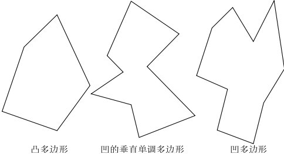
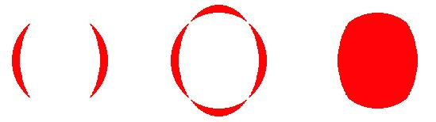
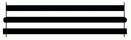
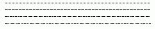
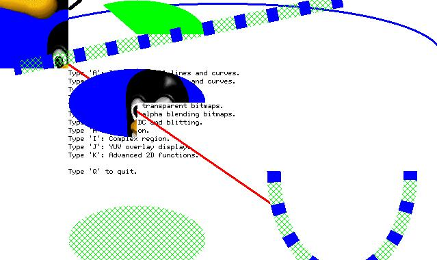

# 渲染器及资源管理

## 1 外观渲染器

<<<<<<< HEAD:programming-guide-zh/MiniGUIProgGuidePart2Chapter03-zh.md
渲染器的全称为“外观渲染器（Look and Feel Renderer）”，它在 MiniGUI 3.0 中发展出来的。
=======
## 1 新的区域算法
>>>>>>> b010f5169ff89c84c1c0fde5ed38651bb12e1208:programming-guide-zh/MiniGUIProgGuidePart03Chapter03-zh.md

渲染器将窗口的管理逻辑和窗口的绘制分离，MiniGUI 只负责管理窗口，而由渲染器完成窗口非客户区的绘制。渲染器的概念，类似于皮肤或者主题的概念。不同的是：

1. MiniGUI 提供了专门的渲染器接口，由具体的渲染器实现
2. 渲染器由一组接口实现和一组属性定义组成
3. 渲染器可以应用到全局，对所有窗口起效; 也可以应用到一个专门的窗口实例上

MiniGUI 本身提供了一组渲染器接口，这些是基于窗口本身的，属于系统渲染器，或者是全局渲染器；NCS 为每个控件提供了渲染器接口，不同的控件接口不一样，属于控件渲染器。

### 1.1 渲染器公共属性

| 属性                          | 类型                  | 说明        |
|:-----------------------------|:---------------------|:------------|
| `RDR_3DBODY_FGCLR`           | `DWORD`(`MakeRGBA`)  | 3D 对象前景色 |
| `RDR_3DBODY_BGCLR`           | `DWORD`(`MakeRGBA`)  | 3D 对象背景色 |
| `RDR_CLIENT_FGCLR`           | `DWORD`(`MakeRGBA`)  | 窗口客户区前景色 |
| `RDR_CLIENT_BGCLR`           | `DWORD`(`MakeRGBA`)  | 窗口客户区背景色 |
| `RDR_SELECTED_FGCLR`         | `DWORD`(`MakeRGBA`)  | 被选择对象的前景色 |
| `RDR_SELECTED_BGCLR`         | `DWORD`(`MakeRGBA`)  | 被选择对象的背景色 |
| `RDR_SELECTED_LOSTFOCUS_CLR` | `DWORD`(`MakeRGBA`)  | 失去焦点对象的颜色 |
| `RDR_DISABLE_FGCLR`          | `DWORD`(`MakeRGBA`)  | 不可用对象的前景色 |
| `RDR_DISABLE_BGCLR`          | `DWORD`(`MakeRGBA`)  | 不可用对象的背景色 |
| `RDR_HIGHLIGHT_FGCLR`        | `DWORD`(`MakeRGBA`)  | 高亮对象的前景色 |
| `RDR_HIGHLIGHT_BGCLR`        | `DWORD`(`MakeRGBA`)  | 高亮对象的背景色 |
| `RDR_METRICS_BORDER`         |  int                 | 边框的大小值 |
| `RDR_FONT`                   | `PLOGFONT`           | 窗口使用的逻辑字体 |
| `RDR_BKIMAGE`                | `PBITMAP`            | 窗口背景图片 |
| `RDR_BKIMAGE_MODE`           | `enum ImageDrawMode` | 窗口绘制模式 |

## 2 资源管理

在新控件集中，资源管理模块作为一个独立的模块，主要负责对资源包进行管理，其中包括资源包的装载、访问和卸载等功能。它在访问资源时是通过指定资源所在的资源包和资源的唯一标识符（ID）等信息来获取所需要的内容 。

其中资源包是为了将各种资源有效地统一管理，统一资源与资源标识符（ID）的映射而提出的概念。一个资源包内可以包含多种资源类型，如图片、字符串、UI 资源等等。资源包为资源的管理带来了诸多如下好处。

在了解资源管理前，需要了解下面两个基础概念：

<<<<<<< HEAD:programming-guide-zh/MiniGUIProgGuidePart2Chapter03-zh.md
- 资源包 : 资源的集合，任意种类和任意个数的资源集合，是资源替换的最小单位。
- 资源 ID : 访问资源包内某一资源的唯一标识。
=======
## 2 光栅操作
>>>>>>> b010f5169ff89c84c1c0fde5ed38651bb12e1208:programming-guide-zh/MiniGUIProgGuidePart03Chapter03-zh.md

mGNCS 提供的资源管理模块，相比较 MiniGUI 固有控件集来讲，具有诸多的优势。如：

- 资源管理与应用代码的分离。 
- 统一了各种资源的管理接口，访问资源更加便捷。
- 通过资源包的简单替换即可实现多语言，多风格，换肤等效果。
- 资源部署更加简单。
- 配合可视化工具 mStudio，方便地生成包含各类资源描述的资源包。

mGNCS 的资源管理主要是围绕资源包来实现对资源的各种管理和访问的。如果要正确的访问某个资源，只需要知道其所在的资源包和对应的资源 ID。整体访问流程通常为：

1. 装载指定资源包。
2. 通过资源 ID 获取资源。
3. 使用资源，某些资源需要在使用后释放资源。
4. 卸载资源包。

当前资源包支持的资源类型有：

<<<<<<< HEAD:programming-guide-zh/MiniGUIProgGuidePart2Chapter03-zh.md
| 资源类型 ID     | 说明        | 备注      |
|:---------------|:-----------|:---------|
| `NCSRT_UI`     | UI 窗口资源 | 对主窗口和控件的描述信息。如窗口风格、大小、标题和属性等。|
| `NCSRT_STRING` | 字符串资源  | 文件名、渲染器名和控件类名等固定的系统常量字符串。 |
| `NCSRT_TEXT`   | 文本资源    | UI 界面上用户指定的文本字符串及 locale 信息。| 
| `NCSRT_IMAGE`  | 图片资源    | 各种 bmp, png 和 jpg 等图片信息。|
| `NCSRT_RDR`    | 渲染器资源   | 对指定的窗口渲染器的窗口元素外观属性的设置信息。|
| `NCSRT_RDRSET` | 渲染器集资源 | 同类渲染器资源的集合。|
| `NCSRT_BINARY` | 自定义资源   | 自定义格式的资源。 |
=======
## 3 内存 `DC` 和 `BitBlt`
>>>>>>> b010f5169ff89c84c1c0fde5ed38651bb12e1208:programming-guide-zh/MiniGUIProgGuidePart03Chapter03-zh.md

### 2.1 资源接口
#### 2.1.1 访问资源包

资源包分为内建格式和外部文件 2 种，无论哪一种都应在系统启动时首先装载资源包，然后访问内部资源，最后系统退出后将资源包正确卸载。在访问非内建资源包时需要使用到如下接口：

```c
HPACKAGE ncsLoadResPackageFromFile (const char* fileName);
#define ncsLoadResPackage  ncsLoadResPackageFromFile
void ncsUnloadResPackage (HPACKAGE package);
```

其中 `ncsLoadResPackage` 负责装载资源包，`ncsUnloadResPackage` 负责卸载资源包。二者需要成对使用。

<<<<<<< HEAD:programming-guide-zh/MiniGUIProgGuidePart2Chapter03-zh.md
如果需要装载的资源包是内建的内存格式，则需要首先通过获取内存资源包信息接口（`ncsGetIncoreResPackInfo`），将内存资源包具体信息返回，然后使用从内存装载资源包的接口（`ncsLoadResPackageFromMem`）装载资源包，最后使用上面提供的同一卸载接口（`ncsUnloadResPackage`）卸载资源包。其中 `ncsGetIncoreResPackInfo` 接口是由内建转换工具所提供，使用内建工具将指定资源包文件转换为内建资源时即已生成，应用无须关心其实现。
=======
`SetMemDCColorKey` 函数用来设定或者取消整个内存 `DC` 对象的 `ColorKey`，即透明象素值。我们还可以通过 `MEMDC_FLAG_RLEACCEL` 标志指定内存 `DC` 采用或者取消 `RLE` 编码方式。

`CreateMemDCFromBitmap` 函数可以创建一个指向设备相关位图并和指定 `DC` 兼容的内存 `DC`，这样可以实现快速的设备位图到屏幕的各种转换绘制。

`CreateMemDCFromMyBitmap` 函数创建指向设备无关位图的内存 `DC`。
`
内存 `DC` 和其他 `DC` 一样，也可以调用 `GDI` 的绘图函数向内存 `DC` 中进行任意的绘图输出，然后再 `BitBlt` 到其他 `DC` 中。清单 1 中的程序来自 `mg-sample` 的 `graphic` 程序，它演示了如何使用内存 `DC` 向窗口 `DC` 进行透明和 Alpha 混合的 `Blitting` 操作。

__清单 1__  增强的 `BITMAP` 操作
>>>>>>> b010f5169ff89c84c1c0fde5ed38651bb12e1208:programming-guide-zh/MiniGUIProgGuidePart03Chapter03-zh.md

```c
extern BOOL ncsGetIncoreResPackInfo(char **addr, int *size);
HPACKAGE ncsLoadResPackageFromMem (const void* mem, int size);
```

<<<<<<< HEAD:programming-guide-zh/MiniGUIProgGuidePart2Chapter03-zh.md
这是装载资源包文件的示例代码：
=======
## 4 增强的 `BITMAP` 操作

新的 `GDI` 函数增强了 `BITMAP` 结构，添加了对透明和 Alpha 通道的支持。通过设置 `bmType`、`bmAlpha`、`bmColorkey` 等成员，就可以使得 `BITMAP` 对象具有某些属性。然后可以利用 `FillBoxWithBitmap/Part` 函数将 `BITMAP` 对象绘制到某个 `DC` 上。你可以将 `BITMAP` 对象看成是在系统内存中建立的内存 `DC` 对象，只是不能向这种内存 `DC` 对象进行绘图输出。清单 2 中的程序从图象文件中装载一个位图对象，然后设置透明和 Alpha 通道值，最后使用 `FillBoxWithBitmap` 函数输出到窗口 `DC` 上。该程序来自 `mg-sample` 的 `graphic` 演示程序。

__清单 2__ 增强的 `BITMAP` 操作
>>>>>>> b010f5169ff89c84c1c0fde5ed38651bb12e1208:programming-guide-zh/MiniGUIProgGuidePart03Chapter03-zh.md

```c
sprintf(f_package, "%s", "resmgr_demo.res");
SetResPath("./");

hPackage = ncsLoadResPackage (f_package);
if (hPackage == HPACKAGE_NULL) {
        printf ("load resource package:%s failure.\n", f_package);
        return 1;
}
```

这是卸载资源包文件的示例代码：

```c
ncsUnloadResPackage(hPackage);
```

#### 2.1.2 获取与设置 Locale

为了方便的进行 locale 的设置与获取，资源管理模块提供了下面两个接口：

```c
const char* ncsSetDefaultLocale (char* language, char* country);
const char* ncsGetDefaultLocale(void);
```

其中设置接口仅对在其设置后通过资源包获取的资源有效，2 个参量分别代表代码语言和国家代码：

<<<<<<< HEAD:programming-guide-zh/MiniGUIProgGuidePart2Chapter03-zh.md
- language 语言代码用2个英文小写字母来表示。
- country 国家代码需要用 2 个或 3 个英文小写字母来表示。
=======
## 5 新的 `GDI` 绘图函数
>>>>>>> b010f5169ff89c84c1c0fde5ed38651bb12e1208:programming-guide-zh/MiniGUIProgGuidePart03Chapter03-zh.md

如设置美式英文为默认 locale，可通过如下语句完成：

```c
ncsSetDefaultLocale("en", "US");
```

<<<<<<< HEAD:programming-guide-zh/MiniGUIProgGuidePart2Chapter03-zh.md
获取接口返回当前使用的 locale 信息，该信息的格式为：`language_country`。
=======
- `FillBox` 函数填充指定矩形，不受当前光栅操作影响。
- `FillCircle` 函数填充指定的圆，受当前光栅操作影响。
- `ScaleBitmap` 函数将源 `BITMAP` 对象进行伸缩处理。
- `GetBitmapFromDC` 函数将指定矩形范围内的象素复制到 `BITMAP` 对象中。
- `GetPixelInBitmap` 函数获得 `BITMAP` 对象中指定位置的象素值。
- `SetPixelInBitmap` 函数设置 `BITMAP` 对象中指定位置的象素值。

## 6 高级 `GDI` 绘图函数

### 6.1 图片缩放函数
>>>>>>> b010f5169ff89c84c1c0fde5ed38651bb12e1208:programming-guide-zh/MiniGUIProgGuidePart03Chapter03-zh.md

`ISO639` 语言代码对照表

```
ISO 639 Codes(Languages)

Two-letter lower-case symbols are used.

<<<<<<< HEAD:programming-guide-zh/MiniGUIProgGuidePart2Chapter03-zh.md
aa Afar
ab Abkhazian
af Afrikaans
am Amharic
ar Arabic
as Assamese
ay Aymara
az Azerbaijani
=======
### 6.2 图片旋转函数
>>>>>>> b010f5169ff89c84c1c0fde5ed38651bb12e1208:programming-guide-zh/MiniGUIProgGuidePart03Chapter03-zh.md

ba Bashkir
be Byelorussian
bg Bulgarian
bh Bihari
bi Bislama
bn Bengali; Bangla
bo Tibetan
br Breton

ca Catalan
co Corsican
cs Czech
cy Welsh

da Danish
de German
dz Bhutani

el Greek
en English
eo Esperanto
es Spanish
et Estonian
eu Basque

fa Persian
fi Finnish
fj Fiji
fo Faroese
fr French
fy Frisian

ga Irish
gd Scots Gaelic
gl Galician
gn Guarani
gu Gujarati

ha Hausa
he Hebrew (formerly iw)
hi Hindi
hr Croatian
hu Hungarian
hy Armenian

ia Interlingua
id Indonesian (formerly in)
ie Interlingue
ik Inupiak
is Icelandic
it Italian
iu Inuktitut

ja Japanese
jw Javanese

ka Georgian
kk Kazakh
kl Greenlandic
km Cambodian
kn Kannada
ko Korean
ks Kashmiri
ku Kurdish
ky Kirghiz

la Latin
ln Lingala
lo Laothian
lt Lithuanian
lv Latvian, Lettish

mg Malagasy
mi Maori
mk Macedonian
ml Malayalam
mn Mongolian
mo Moldavian
mr Marathi
ms Malay
mt Maltese
my Burmese

na Nauru
ne Nepali
nl Dutch
no Norwegian

oc Occitan
om (Afan) Oromo
or Oriya

pa Punjabi
pl Polish
ps Pashto, Pushto
pt Portuguese

qu Quechua

rm Rhaeto-Romance
rn Kirundi
ro Romanian
ru Russian
rw Kinyarwanda

sa Sanskrit
sd Sindhi
sg Sangho
sh Serbo-Croatian
si Sinhalese
sk Slovak
sl Slovenian
sm Samoan
sn Shona
so Somali
sq Albanian
sr Serbian
ss Siswati
st Sesotho
su Sundanese
sv Swedish
sw Swahili

ta Tamil
te Telugu
tg Tajik
th Thai
ti Tigrinya
tk Turkmen
tl Tagalog
tn Setswana
to Tonga
tr Turkish
ts Tsonga
tt Tatar
tw Twi

ug Uighur
uk Ukrainian
ur Urdu
uz Uzbek

vi Vietnamese
vo Volapuk

wo Wolof

xh Xhosa

yi Yiddish (formerly ji)
yo Yoruba

za Zhuang
zh Chinese
zu Zulu
```

`ISO3166` 国家代码对照表

```
ISO 3166 Codes (Countries)

Country                                         A 2     A 3     Number
----------------------------------------------------------------------
AALAND ISLANDS                                  AX      ALA     248
AFGHANISTAN                                     AF      AFG     004
ALBANIA                                         AL      ALB     008
ALGERIA                                         DZ      DZA     012
AMERICAN SAMOA                                  AS      ASM     016
ANDORRA                                         AD      AND     020
ANGOLA                                          AO      AGO     024
ANGUILLA                                        AI      AIA     660
ANTARCTICA                                      AQ      ATA     010
ANTIGUA AND BARBUDA                             AG      ATG     028
ARGENTINA                                       AR      ARG     032
ARMENIA                                         AM      ARM     051  
ARUBA                                           AW      ABW     533
AUSTRALIA                                       AU      AUS     036
AUSTRIA                                         AT      AUT     040
AZERBAIJAN                                      AZ      AZE     031  
BAHAMAS                                         BS      BHS     044
BAHRAIN                                         BH      BHR     048
BANGLADESH                                      BD      BGD     050
BARBADOS                                        BB      BRB     052
BELARUS                                         BY      BLR     112  
BELGIUM                                         BE      BEL     056
BELIZE                                          BZ      BLZ     084
BENIN                                           BJ      BEN     204
BERMUDA                                         BM      BMU     060
BHUTAN                                          BT      BTN     064
BOLIVIA                                         BO      BOL     068
BOSNIA AND HERZEGOWINA                          BA      BIH     070
BOTSWANA                                        BW      BWA     072
BOUVET ISLAND                                   BV      BVT     074
BRAZIL                                          BR      BRA     076
BRITISH INDIAN OCEAN TERRITORY                  IO      IOT     086
BRUNEI DARUSSALAM                               BN      BRN     096
BULGARIA                                        BG      BGR     100
BURKINA FASO                                    BF      BFA     854
BURUNDI                                         BI      BDI     108
CAMBODIA                                        KH      KHM     116
CAMEROON                                        CM      CMR     120
CANADA                                          CA      CAN     124
CAPE VERDE                                      CV      CPV     132
CAYMAN ISLANDS                                  KY      CYM     136
CENTRAL AFRICAN REPUBLIC                        CF      CAF     140
CHAD                                            TD      TCD     148
CHILE                                           CL      CHL     152
CHINA                                           CN      CHN     156
CHRISTMAS ISLAND                                CX      CXR     162
COCOS (KEELING) ISLANDS                         CC      CCK     166
COLOMBIA                                        CO      COL     170
COMOROS                                         KM      COM     174
CONGO, Democratic Republic of (was Zaire)       CD      COD     180
CONGO, Republic of                              CG      COG     178
COOK ISLANDS                                    CK      COK     184
COSTA RICA                                      CR      CRI     188
COTE D'IVOIRE                                   CI      CIV     384
CROATIA (local name: Hrvatska)                  HR      HRV     191      
CUBA                                            CU      CUB     192
CYPRUS                                          CY      CYP     196
CZECH REPUBLIC                                  CZ      CZE     203  
DENMARK                                         DK      DNK     208
DJIBOUTI                                        DJ      DJI     262
DOMINICA                                        DM      DMA     212
DOMINICAN REPUBLIC                              DO      DOM     214
ECUADOR                                         EC      ECU     218
EGYPT                                           EG      EGY     818
EL SALVADOR                                     SV      SLV     222
EQUATORIAL GUINEA                               GQ      GNQ     226
ERITREA                                         ER      ERI     232
ESTONIA                                         EE      EST     233  
ETHIOPIA                                        ET      ETH     231
FALKLAND ISLANDS (MALVINAS)                     FK      FLK     238
FAROE ISLANDS                                   FO      FRO     234
FIJI                                            FJ      FJI     242
FINLAND                                         FI      FIN     246
FRANCE                                          FR      FRA     250
FRENCH GUIANA                                   GF      GUF     254
FRENCH POLYNESIA                                PF      PYF     258
FRENCH SOUTHERN TERRITORIES                     TF      ATF     260
GABON                                           GA      GAB     266
GAMBIA                                          GM      GMB     270
GEORGIA                                         GE      GEO     268  
GERMANY                                         DE      DEU     276
GHANA                                           GH      GHA     288
GIBRALTAR                                       GI      GIB     292
GREECE                                          GR      GRC     300
GREENLAND                                       GL      GRL     304
GRENADA                                         GD      GRD     308
GUADELOUPE                                      GP      GLP     312
GUAM                                            GU      GUM     316
GUATEMALA                                       GT      GTM     320
GUINEA                                          GN      GIN     324
GUINEA-BISSAU                                   GW      GNB     624
GUYANA                                          GY      GUY     328
HAITI                                           HT      HTI     332
HEARD AND MC DONALD ISLANDS                     HM      HMD     334
HONDURAS                                        HN      HND     340
HONG KONG                                       HK      HKG     344
HUNGARY                                         HU      HUN     348
ICELAND                                         IS      ISL     352
INDIA                                           IN      IND     356
INDONESIA                                       ID      IDN     360
IRAN (ISLAMIC REPUBLIC OF)                      IR      IRN     364
IRAQ                                            IQ      IRQ     368
IRELAND                                         IE      IRL     372
ISRAEL                                          IL      ISR     376
ITALY                                           IT      ITA     380
JAMAICA                                         JM      JAM     388
JAPAN                                           JP      JPN     392
JORDAN                                          JO      JOR     400
KAZAKHSTAN                                      KZ      KAZ     398  
KENYA                                           KE      KEN     404
KIRIBATI                                        KI      KIR     296
KOREA, DEMOCRATIC PEOPLE'S REPUBLIC OF          KP      PRK     408
KOREA, REPUBLIC OF                              KR      KOR     410
KUWAIT                                          KW      KWT     414
KYRGYZSTAN                                      KG      KGZ     417  
LAO PEOPLE'S DEMOCRATIC REPUBLIC                LA      LAO     418
LATVIA                                          LV      LVA     428  
LEBANON                                         LB      LBN     422
LESOTHO                                         LS      LSO     426
LIBERIA                                         LR      LBR     430
LIBYAN ARAB JAMAHIRIYA                          LY      LBY     434
LIECHTENSTEIN                                   LI      LIE     438
LITHUANIA                                       LT      LTU     440  
LUXEMBOURG                                      LU      LUX     442
MACAU                                           MO      MAC     446
MACEDONIA, THE FORMER YUGOSLAV REPUBLIC OF      MK      MKD     807 
MADAGASCAR                                      MG      MDG     450
MALAWI                                          MW      MWI     454
MALAYSIA                                        MY      MYS     458
MALDIVES                                        MV      MDV     462
MALI                                            ML      MLI     466
MALTA                                           MT      MLT     470
MARSHALL ISLANDS                                MH      MHL     584
MARTINIQUE                                      MQ      MTQ     474
MAURITANIA                                      MR      MRT     478
MAURITIUS                                       MU      MUS     480
MAYOTTE                                         YT      MYT     175  
MEXICO                                          MX      MEX     484
MICRONESIA, FEDERATED STATES OF                 FM      FSM     583
MOLDOVA, REPUBLIC OF                            MD      MDA     498  
MONACO                                          MC      MCO     492
MONGOLIA                                        MN      MNG     496
MONTSERRAT                                      MS      MSR     500
MOROCCO                                         MA      MAR     504
MOZAMBIQUE                                      MZ      MOZ     508
MYANMAR                                         MM      MMR     104
NAMIBIA                                         NA      NAM     516
NAURU                                           NR      NRU     520
NEPAL                                           NP      NPL     524
NETHERLANDS                                     NL      NLD     528
NETHERLANDS ANTILLES                            AN      ANT     530
NEW CALEDONIA                                   NC      NCL     540
NEW ZEALAND                                     NZ      NZL     554
NICARAGUA                                       NI      NIC     558
NIGER                                           NE      NER     562
NIGERIA                                         NG      NGA     566
NIUE                                            NU      NIU     570
NORFOLK ISLAND                                  NF      NFK     574
NORTHERN MARIANA ISLANDS                        MP      MNP     580
NORWAY                                          NO      NOR     578
OMAN                                            OM      OMN     512
PAKISTAN                                        PK      PAK     586
PALAU                                           PW      PLW     585
PALESTINIAN TERRITORY, Occupied                 PS      PSE     275
PANAMA                                          PA      PAN     591
PAPUA NEW GUINEA                                PG      PNG     598
PARAGUAY                                        PY      PRY     600
PERU                                            PE      PER     604
PHILIPPINES                                     PH      PHL     608
PITCAIRN                                        PN      PCN     612
POLAND                                          PL      POL     616
PORTUGAL                                        PT      PRT     620
PUERTO RICO                                     PR      PRI     630
QATAR                                           QA      QAT     634
REUNION                                         RE      REU     638
ROMANIA                                         RO      ROU     642
RUSSIAN FEDERATION                              RU      RUS     643
RWANDA                                          RW      RWA     646
SAINT HELENA                                    SH      SHN     654
SAINT KITTS AND NEVIS                           KN      KNA     659
SAINT LUCIA                                     LC      LCA     662
SAINT PIERRE AND MIQUELON                       PM      SPM     666
SAINT VINCENT AND THE GRENADINES                VC      VCT     670
SAMOA                                           WS      WSM     882
SAN MARINO                                      SM      SMR     674
SAO TOME AND PRINCIPE                           ST      STP     678
SAUDI ARABIA                                    SA      SAU     682
SENEGAL                                         SN      SEN     686
SERBIA AND MONTENEGRO                           CS      SCG     891
SEYCHELLES                                      SC      SYC     690
SIERRA LEONE                                    SL      SLE     694
SINGAPORE                                       SG      SGP     702
SLOVAKIA                                        SK      SVK     703  
SLOVENIA                                        SI      SVN     705  
SOLOMON ISLANDS                                 SB      SLB     090
SOMALIA                                         SO      SOM     706
SOUTH AFRICA                                    ZA      ZAF     710
SOUTH GEORGIA AND THE SOUTH SANDWICH ISLANDS    GS      SGS     239
SPAIN                                           ES      ESP     724
SRI LANKA                                       LK      LKA     144
SUDAN                                           SD      SDN     736
SURINAME                                        SR      SUR     740
SVALBARD AND JAN MAYEN ISLANDS                  SJ      SJM     744
SWAZILAND                                       SZ      SWZ     748
SWEDEN                                          SE      SWE     752
SWITZERLAND                                     CH      CHE     756
SYRIAN ARAB REPUBLIC                            SY      SYR     760
TAIWAN                                          TW      TWN     158
TAJIKISTAN                                      TJ      TJK     762  
TANZANIA, UNITED REPUBLIC OF                    TZ      TZA     834
THAILAND                                        TH      THA     764
TIMOR-LESTE                                     TL      TLS     626
TOGO                                            TG      TGO     768
TOKELAU                                         TK      TKL     772
TONGA                                           TO      TON     776
TRINIDAD AND TOBAGO                             TT      TTO     780
TUNISIA                                         TN      TUN     788
TURKEY                                          TR      TUR     792
TURKMENISTAN                                    TM      TKM     795  
TURKS AND CAICOS ISLANDS                        TC      TCA     796
TUVALU                                          TV      TUV     798
UGANDA                                          UG      UGA     800
UKRAINE                                         UA      UKR     804
UNITED ARAB EMIRATES                            AE      ARE     784
UNITED KINGDOM                                  GB      GBR     826
UNITED STATES                                   US      USA     840
UNITED STATES MINOR OUTLYING ISLANDS            UM      UMI     581
URUGUAY                                         UY      URY     858
UZBEKISTAN                                      UZ      UZB     860  
VANUATU                                         VU      VUT     548
VATICAN CITY STATE (HOLY SEE)                   VA      VAT     336
VENEZUELA                                       VE      VEN     862
VIET NAM                                        VN      VNM     704
VIRGIN ISLANDS (BRITISH)                        VG      VGB     092
VIRGIN ISLANDS (U.S.)                           VI      VIR     850
WALLIS AND FUTUNA ISLANDS                       WF      WLF     876
WESTERN SAHARA                                  EH      ESH     732
YEMEN                                           YE      YEM     887
ZAMBIA                                          ZM      ZMB     894
ZIMBABWE                                        ZW      ZWE     716
```

#### 2.1.3 创建窗口 UI

<<<<<<< HEAD:programming-guide-zh/MiniGUIProgGuidePart2Chapter03-zh.md
在使用资源包的情况下，mGNCS 所提供的创建主窗口接口相对于 MiniGUI 的创建主窗口来说更加简单，对于主窗口的外观信息描述均已保存于资源包内，接口只需通过窗口资源 ID 即可将界面启动。其中：
=======
### 6.3 圆角矩形
>>>>>>> b010f5169ff89c84c1c0fde5ed38651bb12e1208:programming-guide-zh/MiniGUIProgGuidePart03Chapter03-zh.md

- `owner` 参数指的是窗口的拖管窗口；
- `hIcon`, `hMenu` 默认为 0 即可； 
- `handlers` 和 `connects` 是用户自定义的与该窗口资源 ID 相关联的事件侦听和连接；
- `user_data` 为附加数据，默认为 0 即可。

```c 
mMainWnd* ncsCreateMainWindowIndirectFromID (HPACKAGE package,
                    Uint32 wndId, HWND owner, HICON hIcon,
                    HMENU hMenu, NCS_EVENT_HANDLER_INFO* handlers,
                    NCS_EVENT_CONNECT_INFO *connects,
                    DWORD user_data);
```

<<<<<<< HEAD:programming-guide-zh/MiniGUIProgGuidePart2Chapter03-zh.md
对于通过窗口资源 ID 创建对话框的方法类似于主窗口，通过资源 ID 创建界面，参数含义也与上面创建主窗口的接口类似：
=======
`hdc` 表示绘图用到的图形设备上下文句柄，x0 和 y0 表示矩形的左上角座标，x1 和 y1 表示矩形右下角的坐标。rw 表示圆角的 x 轴方向的长轴（或短轴）的 1/2 长度，rh 表示圆角的 y 轴方向的长轴（或短轴）的 1/2 长度。

## 7 曲线和填充生成器

在一般的图形系统中，通常给用户提供若干用于进行直线或者复杂曲线，比如圆弧、椭圆和样条曲线的绘图函数。用户可以通过这些函数进行绘图，但不能利用这些系统中已有的曲线生成算法完成其他的工作。在 MiniGUI 新的 `GDI` 接口设计当中，我们采用了一种特殊的设计方法来实现曲线和封闭曲线的填充，这种方法非常灵活，而且给用户提供了直接使用系统内部算法的机会：

- 系统中定义了若干用来生成直线和曲线的函数，我们称之为“曲线生成器”。
- 用户在调用生成器之前，需要定义一个回调函数，并将函数地址传递给曲线生成器，曲线生成器在生成了一个曲线上的点或者封闭曲线中的一条水平填充线时，将调用这个回调函数。
- 用户可以在回调函数当中完成针对新的点或者新的水平填充线的操作。对 MiniGUI 绘图函数来说，就是完成绘图工作。
- 因为回调函数在生成器的运行过程中不断调用，为了保持一致的上下文环境，系统允许用户在调用曲线生成器时传递一个表示上下文的指针，生成器将把该指针传递给回调函数。

下面将分小节讲述目前的 MiniGUI 版本所提供的曲线和填充生成器。

### 7.1 直线剪切器和直线生成器

直线剪切器和生成器的原型如下：
>>>>>>> b010f5169ff89c84c1c0fde5ed38651bb12e1208:programming-guide-zh/MiniGUIProgGuidePart03Chapter03-zh.md

```c
int ncsCreateModalDialogFromID (HPACKAGE package, Uint32 dlgId,
                    HWND owner, HICON hIcon, HMENU hMenu,
                    NCS_EVENT_HANDLER_INFO* handlers, NCS_EVENT_CONNECT_INFO *connects);
```

<<<<<<< HEAD:programming-guide-zh/MiniGUIProgGuidePart2Chapter03-zh.md
通过资源包创建 UI 主窗口的示例代码：
=======
直线剪切器并不是生成器，它用于对给定的直线进行剪切操作。`cliprc` 是给定的直线，而 `_x0`、`_y0`、`_x1` 和 `_y1` 传递要剪切的直线起始端点，并通过这些指针返回剪切之后的直线起始端点。MiniGUI 内部使用了 `Cohen-Sutherland` 算法。

`LineGenerator` 是采用 `Breshenham` 算法的生成器。该生成器从给定直线的起始端点开始，每生成一个点调用一次 `cb` 回调函数，并传递上下文 `context`、以及新的点相对于上一个点的步进值或者差量。比如，传递 `stepx =1`，`stepy = 0` 表示新的点比上一个点在 X 轴上前进一步，而在 Y 轴上保持不变。回调函数可以在步进值基础上实现某种程度上的优化。

### 7.2 圆生成器

MiniGUI 定义的圆生成器原型如下：
>>>>>>> b010f5169ff89c84c1c0fde5ed38651bb12e1208:programming-guide-zh/MiniGUIProgGuidePart03Chapter03-zh.md

```c
return ncsCreateMainWindowIndirectFromID(package,
    ID_MAINWND1,
    hParent,
    h_icon,
    h_menu,
    mainwnd_Mainwnd1_handlers,
    NULL,
    user_data);
```

<<<<<<< HEAD:programming-guide-zh/MiniGUIProgGuidePart2Chapter03-zh.md
#### 2.1.4 获取字符串
=======
首先要指定圆心坐标以及半径，并传递上下文信息以及回调函数，每生成一个点，生成器将调用一次 `cb` 回调函数，并传递三个值：x1、x2 和 y。这三个值实际表示了圆上的两个点：(x1, y) 和 (x2, y)。因为圆的对称性，生成器只要计算圆上的四分之一圆弧点即可得出圆上所有的点。

### 7.3 椭圆生成器
>>>>>>> b010f5169ff89c84c1c0fde5ed38651bb12e1208:programming-guide-zh/MiniGUIProgGuidePart03Chapter03-zh.md

通过资源包获取字符串的方法很简单，只需要将资源 ID 传递给接口 `ncsGetString`，管理模块即会根据当前的 locale 信息，将默认 locale 的字符串返回给应用。

```c
const char* ncsGetString (HPACKAGE package, Uint32 resId);
```

<<<<<<< HEAD:programming-guide-zh/MiniGUIProgGuidePart2Chapter03-zh.md
通过资源包获取字符串的示例代码：
=======
首先要指定椭圆心坐标以及 X 轴和 Y 轴半径，并传递上下文信息以及回调函数，每生成一个点，生成器将调用一次 `cb` 回调函数，并传递三个值：x1、x2 和 y。这三个值实际表示了椭圆上的两个点：(x1, y) 和 (x2, y)。因为椭圆的对称性，生成器只要计算椭圆上的二分之一圆弧点即可得出椭圆上所有的点。

### 7.4 圆弧生成器

MiniGUI 定义的圆弧生成器如下所示：
>>>>>>> b010f5169ff89c84c1c0fde5ed38651bb12e1208:programming-guide-zh/MiniGUIProgGuidePart03Chapter03-zh.md

```c
SetDefaultWindowElementRenderer(ncsGetString(hPackage, NCSRM_SYSSTR_DEFRDR));
```

<<<<<<< HEAD:programming-guide-zh/MiniGUIProgGuidePart2Chapter03-zh.md
- 注：mGNCS 保留从 `NCSRM_SYSSTR_BASEID` 到 `NCSRM_SYSSTR_MAXID` 的 ID 值作为系统 ID，可以返回公共的定义，如默认渲染器：`NCSRM_SYSSTR_DEFRDR`

#### 2.1.5 获取位图

资源管理模块提供了通过位图 ID 获取相应文件名的功能，便于上层应用在获取文件名后直接使用 MiniGUI 提供的位图装载相关接口操作位图：
=======
首先要指定圆弧的圆心、半径、起始角度和终止角度。需要注意的是，起始角度和终止角度是以 1/64 度为单位表示的，而不是浮点数。然后传递 `cb` 回调函数。每生成一个圆弧上的点，该函数将调用回调函数，并传递新点的坐标值 (x, y)。

### 7.5 垂直单调多边形生成器

通常而言，多边形有凸多边形和凹多边形之分。这里的垂直单调多边形，是为了优化多边形填充算法而针对计算机图形特点而提出的一种特殊多边形，这种多边形的定义如下：垂直单调多边形是指，多边形的边和计算机屏幕上的所有水平扫描线，只能有一个或者两个交点，不会有更多交点。图 1 给出了凸多边形、凹多边形和垂直单调多边形的几个示例。



__图 1__ 各种多边形

需要注意的是，凸多边形一定是垂直单调多边形，但垂直单调多边形可以是凹多边形。显然，普通的多边形填充算法需要判断多边形边和每条屏幕扫描线之间的交点个数，而垂直单调多边形则可以免去这一判断，所以可以大大提高多边形填充的速度。

MiniGUI 所定义的垂直单调多边形相关函数原型如下：
>>>>>>> b010f5169ff89c84c1c0fde5ed38651bb12e1208:programming-guide-zh/MiniGUIProgGuidePart03Chapter03-zh.md

```c
const char* ncsGetImageFileName (HPACKAGE package, Uint32 resId);
```

<<<<<<< HEAD:programming-guide-zh/MiniGUIProgGuidePart2Chapter03-zh.md
除了使用 MiniGUI 相关接口访问位图外， mGNCS 还提供了直接通过资源 ID 获取位图对象的接口，上层应用使用完该接口提供的位图资源后，需通过相对应的释放接口释放位图对象。这对设置无关和设置相关位图都有效。
=======
`PolygonIsMonotoneVertical` 用来判断给定的多边形是否是垂直单调多边形，而 `MonotoneVerticalPolygonGenerator` 函数是垂直多边形生成器。在 MiniGUI 当中，多边形是由组成多边形的顶点来表示的。`pts` 表示顶点数组，而 `vertices` 表示顶点个数。生成器生成的实际是填充多边形的每一条水平线，端点为 (x1, y) 和 (x2, y)。

### 7.6 一般多边形生成器

MiniGUI 还提供了一般的多边形生成器，该生成器可以处理凸多边形，也可以处理凹多边形。原型如下：
>>>>>>> b010f5169ff89c84c1c0fde5ed38651bb12e1208:programming-guide-zh/MiniGUIProgGuidePart03Chapter03-zh.md

```c
//设置相关位图接口
int ncsGetBitmap(HDC hdc, HPACKAGE package, Uint32 resId,  PBITMAP pBitmap);
void ncsReleaseBitmap (PBITMAP pBitmap);

<<<<<<< HEAD:programming-guide-zh/MiniGUIProgGuidePart2Chapter03-zh.md
//设置无关位图接口
int ncsGetMyBitmap(HPACKAGE package, Uint32 resId,
        PMYBITMAP myBmp, RGB* pal);
void ncsReleaseMyBitmap (PMYBITMAP myBmp);
```

#### 2.1.6 设置渲染器
=======
### 7.7 填注生成器

填注（flood filling）生成器比较复杂。这个函数在 MiniGUI 内部用于 `FloodFill` 函数。我们知道，`FloodFill` 函数从给定的起始位置开始，以给定的颜色向四面八方填充某个区域（像水一样蔓延，因此叫 Flood Filling），一直到遇到与给定起始位置的象素值不同的点为止。因此，在这一过程中，我们需要两个回调函数，一个回调函数用来判断蔓延过程中遇到的点的象素值是否和起始点相同，另外一个回调函数用来生成填充该区域的水平扫描线。在进行绘图时，该函数比较的是象素值，但实际上，该函数也可以比较任何其他值，从而完成特有的蔓延动作。这就是将填注生成器单独出来的初衷。
MiniGUI 如下定义填注生成器：

```c
/* General Flood Filling generator */
typedef BOOL (* CB_EQUAL_PIXEL) (void* context, int x, int y);
typedef void (* CB_FLOOD_FILL) (void* context, int x1, int x2, int y);
BOOL GUIAPI FloodFillGenerator (void* context, const RECT* src_rc, int x, int y, 
CB_EQUAL_PIXEL cb_equal_pixel, CB_FLOOD_FILL cb_flood_fill);
```

`cb_equal_pixel` 被调用，以便判断目标点的象素值是否和起始点一样，起始点的象素值可以通过 `context` 来传递。`cb_flood_fill` 函数用来填充一条扫描线，传递的是水平扫描线的端点，即(x1, y) 和 (x2, y)。

### 7.8 曲线和填充生成器的用法
>>>>>>> b010f5169ff89c84c1c0fde5ed38651bb12e1208:programming-guide-zh/MiniGUIProgGuidePart03Chapter03-zh.md

通过资源包中所包含的渲染器 ID 可以对指定的窗口进行设置，使其具有该渲染器配置下的窗口元素外观属性。但该接口仅在当前窗口所使用的渲染器与新设置的渲染器同名，并且该窗口类是新渲染器所属控件类的子类时方可生效，否则将返回失败，设置不成功。

```c
BOOL ncsSetWinRdr(HWND hWnd, HPACKAGE package, Uint32 rdrId);
```

<<<<<<< HEAD:programming-guide-zh/MiniGUIProgGuidePart2Chapter03-zh.md
另外还可以通过渲染器集合资源设置将某一渲染器集合作为默认系统渲染器配置。
=======
从上面的例子可以看出，曲线和填充生成器的用法极其简单，而且结构清晰明了。读者在自己的开发过程中，也可以学习这种方法。

## 8 绘制复杂曲线

基于 #7 中描述的曲线生成器，MiniGUI 提供了如下基本的曲线绘制函数：
>>>>>>> b010f5169ff89c84c1c0fde5ed38651bb12e1208:programming-guide-zh/MiniGUIProgGuidePart03Chapter03-zh.md

```c
BOOL ncsSetSysRdr(HPACKAGE package, Uint32 rdrSetId);
```

### 2.2 示例程序

本实例为用户演示了如何使用资源管理部分接口获取资源。该部分代码由 mStudio 工具自动生成。


图 1  resmgr 程序的输出

<<<<<<< HEAD:programming-guide-zh/MiniGUIProgGuidePart2Chapter03-zh.md
该程序在屏幕上创建一个包含 2 个按钮的 300x250 的对话框，其中主窗口是 classic 渲染器的外观效果，2 个按钮分别是 skin 和 flat 渲染器的外观效果。
=======
## 9 封闭曲线填充
>>>>>>> b010f5169ff89c84c1c0fde5ed38651bb12e1208:programming-guide-zh/MiniGUIProgGuidePart03Chapter03-zh.md

__清单 1__  resmgr_main.c

```c
/*
** $Id: resmgr_main.c 534 2009-09-22 05:37:46Z xwyan $
**
** Listing P2C2.2
**
** resmgr_main.c: Sample program for mGNCS Programming Guide
**      The application entry of resource managerment.
**
** Copyright (C) 2009 Feynman Software.
*/

#include <stdio.h>
#include <stdlib.h>
#include <string.h>

#include <minigui/common.h>
#include <minigui/minigui.h>
#include <minigui/gdi.h>
#include <minigui/window.h>

#include <mgncs/mgncs.h>

#include "resource.h"
#include "ncs-windows.h"

<<<<<<< HEAD:programming-guide-zh/MiniGUIProgGuidePart2Chapter03-zh.md
HPACKAGE hPackage = HPACKAGE_NULL;

int MiniGUIMain(int argc, const char* argv[])
=======
## 10 建立复杂区域

除了利用填充生成器进行填充绘制以外，我们还可以使用填充生成器建立由封闭曲线包围的复杂区域。我们知道，MiniGUI 当中的区域是由互不相交的矩形组成的，并且满足 x-y-banned 的分布规则。利用上述的多边形或者封闭曲线生成器，可以将每条扫描线看成是组成区域的高度为 1 的一个矩形，这样，我们可以利用这些生成器建立复杂区域。MiniGUI 利用现有的封闭曲线生成器，实现了如下的复杂区域生成函数：

```c
BOOL GUIAPI InitCircleRegion (PCLIPRGN dst, int x, int y, int r);
BOOL GUIAPI InitEllipseRegion (PCLIPRGN dst, int x, int y, int rx, int ry);
BOOL GUIAPI InitPolygonRegion (PCLIPRGN dst, const POINT* pts, int vertices);
```

利用这些函数，我们可以将某个区域分别初始化为圆、椭圆和多边形区域。然后，可以利用这些区域进行点击测试（`PtInRegion` 和 `RectInRegion`），或者选择到 `DC` 当中作为剪切域，从而获得特殊显示效果。图 2 给出的就是 mg-sample 中 graphic 程序给出的特殊区域效果。创建图 2 所示特殊区域的代码如清单 3 所示。

__清单 3__ 创建特殊区域

```c
static BLOCKHEAP my_cliprc_heap;

static void GDIDemo_Region (HWND hWnd, HDC hdc)
>>>>>>> b010f5169ff89c84c1c0fde5ed38651bb12e1208:programming-guide-zh/MiniGUIProgGuidePart03Chapter03-zh.md
{
        #ifdef ntStartWindowEx
        MSG Msg;
        char f_package[MAX_PATH];
        mMainWnd *mWin;
        
        ncsInitialize();
        // START_OF_LOADRESPKG
        sprintf(f_package, "%s", "resmgr_demo.res");
        SetResPath("./");
        
        hPackage = ncsLoadResPackage (f_package);
        if (hPackage == HPACKAGE_NULL) {
                printf ("load resource package:%s failure.\n", f_package);
                return 1;
        }
        // END_OF_LOADRESPKG
        
        // START_OF_GETSTRING
        SetDefaultWindowElementRenderer(ncsGetString(hPackage, NCSRM_SYSSTR_DEFRDR));
        // END_OF_GETSTRING
        
        mWin = ntStartWindowEx(hPackage, HWND_DESKTOP, (HICON)0, (HMENU)0, (DWORD)0);
        
        while(GetMessage(&Msg, mWin->hwnd))
        {
                TranslateMessage(&Msg);
                DispatchMessage(&Msg);
        }
        
        MainWindowThreadCleanup(mWin->hwnd);
        // START_OF_UNLOADPKG
        ncsUnloadResPackage(hPackage);
        // END_OF_UNLOADPKG
        ncsUninitialize();
        #endif
        
        return 0;
}
```

<<<<<<< HEAD:programming-guide-zh/MiniGUIProgGuidePart2Chapter03-zh.md
__清单 1__  resmgr.c
=======


__图 2__  特殊区域输出效果

## 11 直接访问显示缓冲区

在新的 `GDI` 接口中，我们添加了用来直接访问显示缓冲区的函数，原型如下：

```c
Uint8* GUIAPI LockDC (HDC hdc, const RECT* rw_rc, int* width, int* height, int* pitch);
void GUIAPI UnlockDC (HDC hdc);
```

- `LockDC` 函数锁定给定 `HDC` 的指定矩形区域（由矩形 `rw_rc` 指定，设备坐标），然后返回缓冲区头指针。当 `width`、`height`、`pitch` 三个指针不为空时，该函数将返回锁定之后的矩形有效宽度、有效高度和每扫描线所占的字节数。
- `UnlockDC` 函数解开已锁定的 `HDC`。

锁定一个 `HDC` 意味着 MiniGUI 进入以互斥方式访问显示缓冲区的状态。如果被锁定的 `HDC` 是一个屏幕 `DC`（即非内存 `DC`），则该函数将在必要时隐藏鼠标光标，并锁定 `HDC` 对应的全局剪切域。在锁定一个 `HDC` 之后，程序可通过该函数返回的指针对锁定区域进行访问。需要注意的是，不能长时间锁定一个 `HDC`，也不应该在锁定一个 `HDC` 时进行其他额外的系统调用。

假定以锁定矩形左上角为原点建立坐标系，X 轴水平向右，Y 轴垂直向下，则可以通过如下的公式计算该坐标系中（x, y）点对应的缓冲区地址（假定该函数返回的指针值为 `frame_buffer`）：

```c
Uint8* pixel_add = frame_buffer + y * (*pitch) + x * GetGDCapability (hdc, GDCAP_BPP);
```

根据该 `HDC` 的颜色深度，就可以对该象素进行读写操作。作为示例，下面的程序段随机填充锁定区域：

```c
int i, width, height, pitch;
RECT rc = {0, 0, 200, 200};
int bpp = GetGDCapability (hdc, GDCAP_BPP);
Uint8* frame_buffer = LockDC (hdc, &rc, &width, &height, &pitch);
Uint8* row = frame_buffer;

for (i = 0; i < *height; i++) {
        memset (row, rand ()%0x100, *width * bpp);
        row += *pitch;
}

UnlockDC (hdc);
```

## 12 高级二维绘图函数

我们在 MiniGUI 1.6.x 中增加了高级二维绘图函数，以支持高级图形应用程序的开发。通过这些高级的二维绘图函数，我们可以设置线宽、线型以及填充模式等的高级绘图属性。本节将讲述这些高级二维绘图函数的使用。

### 12.1 画笔及其属性

画笔是 MiniGUI 用来描述线段绘制方式的一种逻辑对象。我们通过设置画笔的属性来确定线段的绘制行为，这些属性包括：

- 画笔类型。画笔类型分为如下几种（图 3 给出了几种画笔类型的效果）：
   - `PT_SOLID`：表示实画笔。
   - `PT_ON_OFF_DASH`：开/关虚线。虚实线段中的偶数段会被绘制，而奇数段不会被绘制。每个虚实线段的长度由 `SetPenDashes` 函数指定。
   - `PT_DOUBLE_DASH`：双虚线。虚实线段中的偶数段会被绘制，而奇数段会根据画刷的设置进行绘制。当画刷类型为 `BT_SOLID` 时，奇数段会以画刷颜色绘制，当画刷类型为 `BT_STIPPLED` 时，奇数段会以点刻方式绘制。


__图 3__ 画笔类型

- 画笔宽度。画笔的宽度控制所绘制线段的宽度。画笔的宽度以象素为单位设置。默认的画笔宽度为零，我们通常将零宽度的实画笔称为“零画笔”。MiniGUI 的普通二维绘制函数均是以零画笔绘制的。
- 画笔端点风格。画笔的端点风格确定了线段端点的形状，我们可以通过分为如下几种（图 4 给出了不同画笔端点风格绘制的线段）：
   - `PT_CAP_BUTT`：线段的端点被绘制为矩形，并且扩展到端点的坐标处。这种端点又称为“平端点”。
   - `PT_CAP_ROUND`：线段的端点被绘制为半圆形，端点是圆弧的圆心，直径是线段的宽度。这种端点又称为“圆端点”。
   - `PT_CAP_PROJECTING`：线段的端点被绘制为矩形，并超出端点坐标，超出的部分为线段宽度的一半。这种端点又称为“方端点”。



__图 4__  画笔的端点风格

- 画笔接合风格。画笔的接合风格确定了相连两条线段之间的连接方式，分为如下几种（图 5 给出了不同画笔接合风格绘制的相连线段）：
   - `PT_JOIN_MITER`：相连两条线段的边被扩展为一个斜角，又称“斜接合”。
   - `PT_JOIN_ROUND`：相连两条线段的边被扩展为圆弧，又称“圆接合”。
   - `PT_JOIN_BEVEL`：相连两条线段的接合形成了一个斜面，又称“斜面接合”。


__图 5__  画笔的接合风格

表 1 给出了画笔属性的操作函数。

__表 1__  画笔属性的操作函数

| 函数 | 说明 |
|:----|:-----|
|`GetPenType/SetPenType`           |获取/设置画笔类型|
|`GetPenWidth/SetPenWidth`         |获取/设置画笔宽度,以象素为单位|
|`GetPenCapStyle/SetPenCapStyle`   |获取/设置画笔端点风格|
|`GetPenJoinStyle/SetPenJoinStyle `|获取/设置画笔接合风格|


在使用虚画笔之前，我们通常要通过 `SetPenDashes` 函数设定画笔的虚实方法。该函数的原型如下：

```c
void GUIAPI SetPenDashes (HDC hdc, int dash_offset, const unsigned char *dash_list, int n);
```

该函数通过无符号字符数组中的值来交替表示虚实段的长度。比如，当 `dash_list = “\1\1”` 时，表示实线段（要绘制的）的长度为 1 个象素宽，而虚线段（不绘制的）的长度也为 1 个象素宽，这就是通常的“点线”；如果取 `dash_list=”\4\1”`，则就是通常的“划线”；如果取 `dash_list=”\4\1\1\1”`，则就所谓的“划-点线”；如果取 `dash_list=”\4\1\1\1\1\1”`，就是“划-点-点线”。以上几种虚线模式可见__图 1.6__。需要注意的是，实线段的绘制本身也要受到画笔其它属性的影响，比如画笔端点风格等。


__图 6__ 各种虚线

`etPenDashes` 函数的 `dash_offset` 参数表示虚实线段在实际线条中的起始位置，通常取 0，参数 n 表示 `dash_list` 无符号字符数组的长度。

### 12.2 画刷及其属性

画刷是 MiniGUI 用来描述填充方式的一种逻辑对象。画刷的属性相比画笔要简单的多，MiniGUI 提供如下几种画刷类型：

- `BT_SOLID`：实画刷。以当前的画刷颜色填充。
- `BT_TILED`：位图画刷。以当前设定的位图进行平铺式填充。
- `BT_STIPPLED`：透明点刻画刷。使用当前设定的点刻位图填充，点刻位图中被设置的位将以画刷颜色填充，而未被设置的位将不做绘制（即保留背景）。
- `BT_OPAQUE_STIPPLED`：不透明点刻画刷。使用当前设定的点刻位图填充，点刻位图中被设置的位将以画刷颜色填充，而未被设置的位将用背景色填充。

画笔类型的获取和设置可通过 `GetBrushType/SetBrushType` 函数完成。

如果画刷类型不是实画刷，则我们需要通过 `SetBrushInfo` 函数设定画刷所使用的位图或者点刻位图。该函数的原型如下：

```c
void GUIAPI SetBrushInfo (HDC hdc, const BITMAP *tile, const STIPPLE *stipple);
```

平铺位图就是 MiniGUI 中的 `BITMAP` 对象，而点刻位图则由 `STIPPLE` 结构表示。

我们可以将点刻位图看成是单色位图，其中每个位表示一个象素点。当该位取1时，表示以画刷颜色绘制，取0时以背景颜色绘制（画刷类型为 `BT_OPAQUE_STIPPLED`）或者保留（画刷类型为 `BT_STIPPLED`）。`STIPPLE` 结构定义如下：

```c
typedef struct _STIPPLE
{
    int width;
    int height;
    int pitch;
    size_t size;
    const unsigned char* bits;
} STIPPLE;
```
下面的点刻位图可用来表示斜的网格：

```c
const unsigned char stipple_bits [] = "\x81\x42\x24\x18\x18\x24\x42\x81";

static STIPPLE my_stipple =
{
    8, 8, 1, 8,
    stipple_bits
};
```

在使用画刷时，还有一个重要的概念，即画刷原点。画刷原点确定了画刷位图的起始填充位置，平铺或点刻位图的左上角将和该原点对齐。默认时，位图画刷在 `DC` 设备的原点处。有时，应用程序要重新设定画刷原点，这时就要调用 `SetBrushOrigin` 函数。

### 12.3 高级二维绘图函数

在配置 MiniGUI 时，我们可以通过 `--enable-adv2dapi` 参数来打开 MiniGUI 中的高级二维绘图函数接口。当 MiniGUI 中包含高级二维绘图函数接口时，前面提到的所有填充类函数将受到当前画刷属性的影响，这些函数包括 `FillBox`、`FillCircle`、`FillEllipse`、`FillPolygon`、`FloodFill` 等等，但基本的线段绘制函数却不会受画笔属性的影响，这些函数包括 `MoveTo/LineTo`、`Rectangle`、`PolyLineTo`、`SplineTo`、`Circle`、`Ellipse`、`CircleArc` 等函数。这些基本的线段绘制函数仍将以零画笔绘制。

针对逻辑画笔类型，我们引入了一些高级二维绘图函数，这些函数的行为将受到画笔和画刷属性的影响：
>>>>>>> b010f5169ff89c84c1c0fde5ed38651bb12e1208:programming-guide-zh/MiniGUIProgGuidePart03Chapter03-zh.md

```c
/*
** $Id: resmgr.c 534 2009-09-22 05:37:46Z xwyan $
**
** Listing P2C2.3
**
** resmgr.c: Sample program for mGNCS Programming Guide
**      Create main window by resource managerment.
**
** Copyright (C) 2009 Feynman Software.
*/

#include <stdio.h>
#include <stdlib.h>
#include <string.h>

#include <minigui/common.h>
#include <minigui/minigui.h>
#include <minigui/gdi.h>
#include <minigui/window.h>

#include <mgncs/mgncs.h>

<<<<<<< HEAD:programming-guide-zh/MiniGUIProgGuidePart2Chapter03-zh.md
#include "resource.h"
#include "ncs-windows.h"

static NCS_EVENT_HANDLER_INFO mainwnd_Mainwnd1_handlers[] = {
        
        {-1, NULL}
=======
### 12.4 高级二维绘图函数的使用

__清单 5__ 中的代码利用上述高级二维绘图函数绘制了一些图形对象，__图 7__ 给出了该代码的输出效果。

__清单 5__ 高级二维绘图函数的使用

```c
#ifdef _ADV_2DAPI

/* 定义网格点刻位图 */
const unsigned char stipple_bits [] = "\x81\x42\x24\x18\x18\x24\x42\x81";
static STIPPLE my_stipple =
{
        8, 8, 1, 8,
        stipple_bits
>>>>>>> b010f5169ff89c84c1c0fde5ed38651bb12e1208:programming-guide-zh/MiniGUIProgGuidePart03Chapter03-zh.md
};

NCS_WND_EXPORT mMainWnd* ntCreateMainwnd1Ex(HPACKAGE package, HWND hParent, HICON h_icon, HMENU h_menu, DWORD user_data)
{
        // START_OF_UIWINDOW
        return ncsCreateMainWindowIndirectFromID(package,
        ID_MAINWND1, 
        hParent,
        h_icon,
        h_menu,
        mainwnd_Mainwnd1_handlers,
        NULL,
        user_data);
        // END_OF_UIWINDOW
}
```
<<<<<<< HEAD:programming-guide-zh/MiniGUIProgGuidePart2Chapter03-zh.md
=======



__图 7__ 高级二维绘图函数的输出

## 13 双屏显示

考虑到手持设备普遍支持双屏功能，MiniGUI 提供一组接口可以实现对副屏的支持。MiniGUI 目前实现的副屏仅用来显示信息，不能处理用户的输入。MiniGUI 将副屏抽象成一 `DC` 对象，因此可以使用 `GDI` 绘图函数在副屏上绘制信息。

### 13.1 创建副屏

MiniGUI 使用以下函数来打开副屏：

```c
HDC GUIAPI InitSlaveScreen (const char *name, cnost char *mode);
```

`InitSlaveScreen` 函数可以根据指定的引擎和显示模式构造打开双屏并返回一个图形设备上下文句柄。`name` 指定副屏使用何种图形引擎，`mode` 指定副屏的分辨率和颜色深度。例如下列代码用来打开一个副屏：

```c
HDC hdc;
const char *engine = "qvfb";
const char *mode = "640x480-16bpp";
hdc = InitSlaveScreen (engine, mode);
```

根据 `InitSlaveScreen` 函数返回的图形设备上下文句柄可以调用 MiniGUI 的 `GDI` 函数在副屏设备上进行绘图，这个过程与使用普通的DC对象进行绘图没有任何分别。

### 13.2 销毁副屏

副屏绘图完毕后，应该调用以下函数销毁副屏对象并释放资源。

```c
void GUIAPI TerminateSlaveScreen(HDC hdc);
```

其中，`hdc`参数是 `InitSlaveScreen` 函数返回的表示副屏的图形设备上下文句柄。
>>>>>>> b010f5169ff89c84c1c0fde5ed38651bb12e1208:programming-guide-zh/MiniGUIProgGuidePart03Chapter03-zh.md
