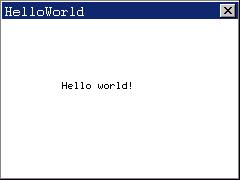

# 开始 MiniGUI 编程

## 1 基本的编程概念

### 1.1 事件驱动编程

MiniGUI 是一个窗口系统及图形用户界面支持系统，通常的 GUI 编程概念均适用于 MiniGUI 编程，如窗口和事件驱动编程等。

在传统的窗口和图形系统模型中，键盘和鼠标动作产生由应用程序不断轮询的事件。这些事件通常被发送到具有焦点的窗口，而应用程序把这些事件交由和该窗口相关联的例程来处理。这些窗口例程通常是由应用程序定义的，或者是某些标准例程中的一个。操作系统、其它窗口的事件处理例程和应用程序代码都可以产生事件。

用于处理事件的窗口例程通常标识了某一个“窗口类”，具有相同窗口例程的窗口实例被认为是属于同一窗口类。

焦点和光标的概念用于管理输入设备和输入事件的传送。鼠标光标是一个绘制在屏幕之上的小位图，指示当前的鼠标位置。以某种非破坏性的方式绘制该位图是窗口系统的责任，不过应用程序可以控制绘制哪一个位图以及是否显示该光标。应用程序还可以捕捉鼠标光标并获取光标事件，即使该光标已经超出该应用程序窗口的显示范围。键盘输入有类似的输入焦点和键盘输入插入符的概念。只有具有输入焦点的窗口才能获取键盘事件。改变窗口的焦点通常由特殊的按键组合或者鼠标光标事件完成。具有输入焦点的窗口通常绘制有一个键盘插入符。该插入符的存在、形式、位置，以及该插入符的控制完全是由窗口的事件处理例程完成的。

应用程序可通过调用一些系统函数来要求重绘窗口或窗口的某一部分，这些事件通常由窗口例程来处理。

### 1.2 MiniGUI 的三种运行模式

在编写第一个 MiniGUI 程序之前，需要了解如下事实：我们可将 MiniGUI 配置编译成三种具有不同体系架构的版本，我们称为运行模式：

- MiniGUI-Threads。运行在 MiniGUI-Threads 上的程序可以在不同的线程中建立多个窗口，但所有的窗口在一个进程或者地址空间中运行。这种运行模式非常适合于大多数传统意义上的嵌入式操作系统，比如 uC/OS-II、eCos、VxWorks、pSOS 等等。当然，在 Linux 和 uClinux 上，MiniGUI 也能以 MiniGUI-Threads 的模式运行。
- MiniGUI-Processes。和 MiniGUI-Threads 相反，MiniGUI-Processes 上的每个程序是独立的进程，每个进程也可以建立多个窗口。MiniGUI-Processes 适合于具有完整 UNIX 特性的嵌入式操作系统，比如嵌入式 Linux。
- MiniGUI-Standalone。这种运行模式下，MiniGUI 可以以独立进程的方式运行，既不需要多线程也不需要多进程的支持，这种运行模式适合功能单一的应用场合。比如在一些使用 uClinux 的嵌入式产品中，因为各种原因而缺少线程库支持，这时，就可以使用 MiniGUI-Standalone 来开发应用软件。

和 Linux 这样的类 UNIX 操作系统相比，一般意义上的嵌入式操作系统具有一些特殊性。举例而言，诸如 `uClinux`、`uC/OS-II`、`eCos`、`VxWorks` 等操作系统，通常运行在没有 MMU（内存管理单元，用于提供虚拟内存支持）的 CPU 上，这时，往往就没有进程的概念，而只有线程或者任务的概念，这样，GUI 系统的运行环境也就大相径庭。因此，为了适合不同的操作系统环境，我们可将 MiniGUI 配置成上述三种运行模式。

一般而言，MiniGUI-Standalone 模式的适应面最广，可以支持几乎所有的操作系统，甚至包括类似 DOS 这样的操作系统；MiniGUI-Threads 模式的适用面次之，可运行在支持多任务的实时嵌入式操作系统，或者具备完整 UNIX 特性的普通操作系统之上；MiniGUI-Processes 模式的适用面较小，它仅适合于具备完整 UNIX 特性的普通操作系统。

MiniGUI 的早期版本（即 MiniGUI-Threads）采用基于 POSIX 线程的消息传递和窗口管理机制，这种实现提供最大程度上的数据共享，但同时造成了 MiniGUI 体系结构上的脆弱。如果某个线程因为非法的数据访问而终止运行，则整个系统都将受到影响。为了解决这个问题，使 MiniGUI 更符合嵌入式 Linux 系统的应用需求，MiniGUI 从 0.9.8 版本开始推出 Lite 运行模式。Lite 运行模式下的 MiniGUI 使用嵌入式 Linux 的进程机制，从而使得 MiniGUI 更稳定。基于有效的客户/服务器结构，在 MiniGUI-Lite 模式下，我们可以运行多个客户进程，并且充分利用类似地址空间保护的高级性能。因此，在 MiniGUI-Lite 运行模式下，基于 MiniGUI 的嵌入式系统的灵活性和稳定性将得到极大的提高。举例来说，我们可以在 MiniGUI-Lite 运行模式下运行多个 MiniGUI 客户进程，并且如果其中一个进程不正常终止，其他进程将不受影响。除此之外，在 MiniGUI-Lite 运行模式下，非常有利于我们集成第三方应用程序。实际上，这就是为什么许多嵌入式设备开发商使用 Linux 作为他们的操作系统的主要原因。

尽管 MiniGUI-Lite 运行模式提供了多进程支持，但是它不能同时管理不同进程创建的窗口。因此，MiniGUI-Lite 运行模式根据层来区分不同进程中的窗口。这种方法适合于大多数具有低端显示设备的嵌入式设备，但是也给应用程序的开发带来了一些问题。

MiniGUI V2.0.x 完全地解决了这一问题。MiniGUI-Lite 运行模式下，客户创建的窗口不是一个全局对象，也就是说，客户不知道其他人创建的窗口。然而，MiniGUI-Processes 模式下创建的窗口都是全局对象，并且由这种模式下创建的窗口可以互相剪切。MiniGUI-Processes 是 MiniGUI-Lite 的继承者，它支持具备完整 UNIX 特性的嵌入式操作系统，如 Linux。

在 MiniGUI-Processes 运行模式中，我们可以同时运行多个 MiniGUI 应用程序。首先我们启动一个服务器程序 mginit，然后我们可以启动其他作为客户端运行的 MiniGUI 应用程序。如果因为某种原因客户终止，服务器不会受任何影响，可以继续运行。

> 【注意】本指南中，我们假定您安装的是 MiniGUI-Processes 运行模式。在运行这些示例程序之前，应该首先运行 mginit 程序，它可以是用户自定义的 `mginit` 程序或是 `mg-samples` 中提供的 `mginit` 程序。我们已经仔细编码以确保每个示例程序都能在 MiniGUI-Processes 及 MiniGUI-Threads 模式下编译并运行。

此外，MiniGUI 提供类 Win32 的 `API`，熟悉 Win32 编程的读者可以很快地掌握 MiniGUI 编程的基本方法和各个 `API`。

## 2 一个简单的 MiniGUI 程序

理解 MiniGUI 基本编程方法的最快途径就是分析一个简单程序的结构。__清单 1.1__ 是一个 MiniGUI 版本的“Hello world!”程序，我们将对其进行详细的解释说明。

__清单 1.1__ `helloworld.c`

```c
#include <stdio.h>

#include <minigui/common.h>
#include <minigui/minigui.h>
#include <minigui/gdi.h>
#include <minigui/window.h>

static int HelloWinProc (HWND hWnd, int message, WPARAM wParam, LPARAM lParam)
{
        HDC hdc;
        switch (message) {
                case MSG_PAINT:
                hdc = BeginPaint (hWnd);
                TextOut (hdc, 60, 60, "Hello world!");
                EndPaint (hWnd, hdc);
                return 0;
                
                case MSG_CLOSE:
                DestroyMainWindow (hWnd);
                PostQuitMessage (hWnd);
                return 0;
        }
        
        return DefaultMainWinProc (hWnd, message, wParam, lParam);
}

int MiniGUIMain (int argc, const char* argv[])
{
        MSG Msg;
        HWND hMainWnd;
        MAINWINCREATE CreateInfo;
        
        #ifdef _MGRM_PROCESSES
        JoinLayer (NAME_DEF_LAYER , "helloworld" , 0 , 0);
        #endif
        
        CreateInfo.dwStyle = WS_VISIBLE | WS_BORDER | WS_CAPTION;
        CreateInfo.dwExStyle = WS_EX_NONE;
        CreateInfo.spCaption = "HelloWorld";
        CreateInfo.hMenu = 0;
        CreateInfo.hCursor = GetSystemCursor (0);
        CreateInfo.hIcon = 0;
        CreateInfo.MainWindowProc = HelloWinProc;
        CreateInfo.lx = 0;
        CreateInfo.ty = 0;
        CreateInfo.rx = 240;
        CreateInfo.by = 180;
        CreateInfo.iBkColor = COLOR_lightwhite;
        CreateInfo.dwAddData = 0;
        CreateInfo.hHosting = HWND_DESKTOP;
        
        hMainWnd = CreateMainWindow (&CreateInfo);
        
        if (hMainWnd == HWND_INVALID)
        return -1;
        
        ShowWindow (hMainWnd, SW_SHOWNORMAL);
        
        while (GetMessage (&Msg, hMainWnd)) {
                TranslateMessage (&Msg);
                DispatchMessage (&Msg);
        }
        
        MainWindowThreadCleanup (hMainWnd);
        
        return 0;
}

#ifndef _MGRM_PROCESSES
#include <minigui/dti.c>
#endif
```

该程序在屏幕上创建一个大小为 240x180 像素的应用程序窗口，并在窗口客户区的中部显示 “Hello, world!”，如图 1 所示。



__图 1__ `helloworld` 程序的输出

### 2.1 头文件

`helloworld.c` 的开始所包括的四个头文件 `<minigui/common.h>`、`<minigui/minigui.h>`、`<minigui/gdi.h>` 和 `<minigui/window.h>` 是所有的 MiniGUI 应用程序都必须包括的头文件：

- `common.h` 包括 MiniGUI 常用的宏以及数据类型的定义。
- `minigui.h` 包含了全局的和通用的接口函数以及某些杂项函数的定义。
- `gdi.h` 包含了 MiniGUI 绘图函数的接口定义。
- `window.h` 包含了窗口有关的宏、数据类型、数据结构定义以及函数接口声明。

使用预定义控件的 MiniGUI 应用程序还必须包括另外一个头文件——`<minigui/control.h>`：

- `control.h` 包含了 `libminigui` 中所有内建控件的接口定义。

所以，一个 MiniGUI 程序的开始通常包括如下的 MiniGUI 相关头文件：

```c
#include <minigui/common.h>
#include <minigui/minigui.h>
#include <minigui/gdi.h>
#include <minigui/window.h>
#include <minigui/control.h>
```

### 2.2 程序入口点

一个 C 程序的入口点为 `main` 函数，而一个 MiniGUI 程序的入口点为 `MiniGUIMain`，该函数原型如下:

```c
int MiniGUIMain (int argc, const char* argv[]);
```

这个函数其实是标准 C 程序入口函数 `main` 的一个封装宏。所以，每个 MiniGUI 应用程序（无论是服务器端程序 `mginit` 还是客户端应用程序）的入口点均为 `MiniGUIMain` 函数。参数 `argc` 和 `argv` 与 C 程序 `main` 函数的参数 `argc` 和 `argv` 的含义是一样的，分别为命令行参数个数和参数字符串数组指针。

### 2.3 MiniGUI-Processes 模式下加入层

```c
#ifdef _MGRM_PROCESSES
JoinLayer(NAME_DEF_LAYER , "helloworld" , 0 , 0);
#endif
```

`JoinLayer` 是 MiniGUI-Processes 模式的专有函数，因此包含在 `_MGRM_PROCESSES` 宏的条件编译中。在 MiniGUI-Processes 运行模式下，每个 MiniGUI 客户端程序在调用其它 MiniGUI 函数之前必须调用该函数将自己添加到一个层中（或创建一个新层）4 。

如果程序是 MiniGUI-Processes 的服务器程序（即 `mginit`），则应该调用 `ServerStartup` 函数：

```c
if (!ServerStartup (0 , 0 , 0)) {
        fprintf (stderr,
        "Can not start the server of MiniGUI-Processes: mginit.\n");
        return 1;
}
```

关于 MiniGUI-Processes 专有接口我们将在第 17 章给出详细的说明。

>【注意】MiniGUI 针对三种运行模式分别定义了不同的宏。
> - MiniGUI-Threads：` _MGRM_THREADS`；
> - MiniGUI-Processes： `_MGRM_PROCESSES` 和 `_LITE_VERSION`。
> - MiniGUI-Standalone：`_MGRM_STANDALONE` 和（`_LITE_VERSION` 以及 `_STAND_ALONE`）。

### 2.4 创建和显示主窗口

```c
hMainWnd = CreateMainWindow (&CreateInfo);
```

每个 MiniGUI 应用程序的初始界面一般都是一个主窗口，你可以通过调用 `CreateMainWindow` 函数来创建一个主窗口，其参数是一个指向 `MAINWINCREATE` 结构的指针，本例中就是`CreateInfo`，返回值为所创建主窗口的句柄。`MAINWINCREATE` 结构描述一个主窗口的属性，在使用 `CreateInfo` 创建主窗口之前，需要设置它的各项属性。

```c
CreateInfo.dwStyle = WS_VISIBLE | WS_BORDER | WS_CAPTION;
```

设置主窗口风格，这里把窗口设为初始可见的，并具有边框和标题栏。

```c
CreateInfo.dwExStyle = WS_EX_NONE;
```

设置主窗口的扩展风格，该窗口没有扩展风格。

```c
CreateInfo.spCaption = "HelloWorld";
```

设置主窗口的标题为“HelloWorld”.

```c
CreateInfo.hMenu = 0;
```

设置主窗口的主菜单，该窗口没有主菜单。

```c
CreateInfo.hCursor = GetSystemCursor(0);
```

设置主窗口的光标为系统缺省光标。

```c
CreateInfo.hIcon = 0;
```

设置主窗口的图标，该窗口没有图标。

```c
CreateInfo.MainWindowProc = HelloWinProc;
```

设置主窗口的窗口过程函数为 `HelloWinProc`，所有发往该窗口的消息由该函数处理。

```c
CreateInfo.lx = 0;
CreateInfo.ty = 0;
CreateInfo.rx = 320;
CreateInfo.by = 240;
```

设置主窗口在屏幕上的位置,该窗口左上角位于(0, 0),右下角位于(320, 240)。

```c
CreateInfo.iBkColor = PIXEL_lightwhite;
```

设置主窗口的背景色为白色；`PIXEL_lightwhite` 是 MiniGUI 预定义的象素值（白色）。

```c
CreateInfo.dwAddData = 0;
```

设置主窗口的附加数据，该窗口没有附加数据。

```c
CreateInfo.hHosting = HWND_DESKTOP;
```

设置主窗口的托管窗口为桌面窗口。

```c
ShowWindow(hMainWnd, SW_SHOWNORMAL);
```

创建完主窗口之后，还需要调用 `ShowWindow` 函数才能把所创建的窗口显示在屏幕上。`ShowWindow` 的第一个参数为所要显示的窗口句柄，第二个参数指明显示窗口的方式（显示还是隐藏），`SW_SHOWNORMAL` 说明要显示主窗口，并把它置为顶层窗口。

### 2.5 进入消息循环

在调用 `ShowWindow` 函数之后，主窗口就会显示在屏幕上。和其它 GUI 一样,现在是进入消息循环的时候了。MiniGUI 为每一个 MiniGUI 程序维护一个消息队列。在发生事件之后，MiniGUI 将事件转换为一个消息，并将消息放入目标程序的消息队列之中。应用程序现在的任务就是执行如下的消息循环代码，不断地从消息队列中取出消息，进行处理：

```c
while (GetMessage(&Msg, hMainWnd)) {
        TranslateMessage(&Msg);
        DispatchMessage(&Msg);
}
```

`Msg` 变量是类型为 `MSG` 的结构，`MSG` 结构在 `window.h` 中定义如下：

```c
typedef struct _MSG
{
        HWND            hwnd;
        int                 message;
        WPARAM         wParam;
        LPARAM          lParam;
        unsigned int     time;
        #ifndef _LITE_VERSION
        void*           pAdd;
        #endif
} MSG;
typedef MSG* PMSG;
```

`GetMessage` 函数调用从应用程序的消息队列中取出一个消息：

```c
GetMessage( &Msg, hMainWnd);
```

该函数调用的第二个参数为要获取消息的主窗口的句柄，第一个参数为一个指向 `MSG` 结构的指针，`GetMessage` 函数将用从消息队列中取出的消息来填充该消息结构的各个域，包括：

- `hwnd`：消息发往的窗口的句柄。在 `helloworld.c` 程序中，该值与 `hMainWnd` 相同。
- `message`：消息标识符。这是一个用于标识消息的整数值。每一个消息均有一个对应的预定义标识符，这些标识符定义在 `window.h` 头文件中，以前缀 `MSG` 开头。
- `wParam`：一个 32 位的消息参数，其含义和取值根据消息的不同而不同。
- `lParam`：一个 32 位的消息参数，其含义和值取决于消息的类型。
- `time`：消息放入消息队列中的时间。

只要从消息队列中取出的消息不为 `MSG_QUIT`，`GetMessage` 就返回一个非 0 值，消息循环将持续下去。`MSG_QUIT` 消息使 `GetMessage` 返回 0，导致消息循环的终止。

```c
TranslateMessage (&Msg);
```

`TranslateMessage` 函数把击键消息转换为 `MSG_CHAR` 消息,然后直接发送到窗口过程函数。

```c
DispatchMessage (&Msg);
```

`DispatchMessage` 函数最终把消息发往消息的目标窗口的窗口过程，让窗口过程进行处理。在本例中，窗口过程就是 `HelloWinProc`。也就是说，MiniGUI 在 `DispatchMessage` 函数 中调用主窗口的窗口过程函数（回调函数）对发往该主窗口的消息进行处理。处理完消息之后，应用程序的窗口过程函数将返回到 `DispatchMessage` 函数中，而 `DispatchMessage` 函数最后又将返回到应用程序代码中，应用程序又从下一个 `GetMessage` 函数调用开始消息循环。

### 2.6 窗口过程函数

窗口过程函数是 MiniGUI 程序的主体部分，应用程序实际所做的工作大部分都发生在窗口过程函数中，因为 GUI 程序的主要任务就是接收和处理窗口收到的各种消息。

在 `helloworld.c` 程序中，窗口过程是名为 `HelloWinProc` 的函数。窗口过程函数可以由程序员任意命名，`CreateMainWindow` 函数根据 `MAINWINCREATE` 结构类型的参数中指定的 窗口过程创建主窗口。

窗口过程函数总是定义为如下形式：

```c
static int HelloWinProc (HWND hWnd, int message, WPARAM wParam, LPARAM lParam);
```

窗口过程的 4 个参数与 MSG 结构的前四个域是相同的。第一个参数 `hWnd` 是接收消息的窗口的句柄，它与 `CreateMainWindow` 函数的返回值相同，该值标识了接收该消息的特定窗口。第二个参数与 `MSG` 结构中的 `message` 域相同，它是一个标识窗口所收到消息的整数值。最后两个参数都是 32 位的消息参数，它提供和消息相关的特定信息。程序通常不直接调用窗口过程函数，而是由 MiniGUI 进行调用；也就是说，它是一个回调函数。

窗口过程函数不予处理的消息应该传给 `DefaultMainWinProc` 函数进行缺省处理，从 `DefaultMainWinProc` 返回的值必须由窗口过程返回。

### 2.7 屏幕输出

程序在响应 `MSG_PAINT` 消息时进行屏幕输出。应用程序应首先通过调用 `BeginPaint` 函数来获得设备上下文句柄，并用它调用 `GDI` 函数来执行绘制操作。这里，程序使用 `TextOut` 文本输出函数在客户区的中部显示了一个“Hello world!”字符串。绘制结束之后，应用程序应调用 `EndPaint` 函数释放设备上下文句柄。

我们将在本指南第 2 篇对 MiniGUI 的图形设备接口进行详细的描述。

### 2.8 程序的退出

用户单击窗口右上角的关闭按钮时窗口过程函数将收到一个 `MSG_CLOSE` 消息。`Helloworld` 程序在收到 `MSG_CLOSE` 消息时调用 `DestroyMainWindow` 函数销毁主窗口，并调用 `PostQuitMessage` 函数在消息队列中投入一个 `MSG_QUIT` 消息。当 `GetMessage` 函数取出 `MSG_QUIT` 消息时将返回0，最终导致程序退出消息循环。

程序最后调用 `MainWindowThreadCleanup` 清除主窗口所使用的消息队列等系统资源并最终由 `MiniGUIMain` 返回。

## 3 编译、链接和运行

### 3.1 编译 MiniGUI 程序

你可以在命令行上输入如下的命令来编译 `helloworld.c`，并链接生成可执行文件 `helloworld`：

```shell
$ gcc –o helloworld helloworld.c –lminigui_procs –ljpeg –lpng –lz
```

如果你将 MiniGUI 配置为 MiniGUI-Threads，则需要使用下面的编译选项：

```shell
$ gcc –o helloworld helloworld.c –lpthread –lminigui_ths –ljpeg –lpng –lz
```

`-o` 选项告诉 gcc 要生成的目标文件名，这里是 `helloworld`；`-l` 选项指定生成 `helloworld` 要链接的库，这里链接的是 `minigui_procs` 函数库（MiniGUI 多进程模式）或者 `minigui_ths` 函数库（MiniGUI 多线程模式）。当 MiniGUI 配置为 MiniGUI-Threads 时，还要链接 `pthread` 库。`pthread` 是提供 POSIX 兼容线程支持的函数库，编译 MiniGUI-Threads 程序时必须连接这个函数库。其它要链接的 `jpeg`、`png`、`z` 等函数库，则是 MiniGUI 内部所依赖的函数库（这里假定您使用的 MiniGUI 打开了对 JPEG 及 PNG 图片格式的支持）。

假定你将 MiniGUI 配置成了 MiniGUI-Processes，在运行 `helloworld` 程序之前，首先要确保已启动了 MiniGUI 的服务器端程序 `mginit`。比如你可以启动 `mg-samples` 中的 `mginit` 程序，然后进入 `helloworld` 文件所在目录，在命令行上输入 `./helloworld` 启动 `helloworld` 程序：

```shell
$ ./helloworld
```

程序的运行结果如__图 1__ 所示。

> 【提示】如果已将 MiniGUI 配置为 MiniGUI-Threads 或 MiniGUI-Standalone 模式，则运行这些示例程序时无须启动 `mginit` 程序——这些程序可直接从控制台上运行。

### 3.2 MiniGUI 组件

除了核心函数库之外，MiniGUI 产品中还包含有 `mGi`、`mGp`、`mG3d`、`mGUtils`、`mGPlus` 等组件。如果你在程序中用到了这些组件提供的接口，那么需要在程序中包括相应的头文件，并在编译应用程序时链接相应的库。具体可参阅这些组件对应的使用说明文档。

## 4 为 MiniGUI 应用程序编写 Automake/Autoconf 脚本

我们已经了解 Autoconf/Automake 是 UNIX 系统下维护一个软件项目的最佳工具。它可以帮助我们从敲击重复的命令行工作中解脱出来，可以帮我们维护一个项目，甚至可以帮我们轻松完成程序的交叉编译。随 MiniGUI 产品一同发布的 `mg-samples` 就是一个利用 Autoconf/Automake 脚本组织起来的软件项目。

下面我们将参照 `mg-samples` 的 Automake/Autoconf 脚本来为 `helloworld` 程序建立项目脚本。本小节不打算详细讲述 Automake/Autoconf 的工作机制，相关信息，可参阅讲述 Linux 编程的书籍，或者查看这两个程序的 Info 页。

考虑到我们在本节中建立的项目还可以用于组织和维护本指南以后章节的示例程序，因此，我们在系统适当的目录下建立 `samples` 目录作为项目的根目录，并为项目取名为 `samples`。比如：

```shell
$ mkdir –p ~/minigui/samples
```

> 【提示】本指南假定你将 `mg-samples` 的源代码置于自己 `HOME` 目录的 `minigui` 目录下：`~/minigui/mg-samples-3.0.x`。

然后在 `samples` 下建立 `src` 目录，用来存放 `helloworld` 程序的源代码。将 `helloworld.c` 保存在 `samples/src/` 目录下，然后从 `mg-samples-3.0.x` 中复制 `configure.in` 文件。

> 【提示】将源代码保存在单独的文件中可以帮助我们更好地管理项目文件，作为惯例，应将项目源代码保存在 `src/` 目录下，将项目的全局性头文件保存在 `include/` 目录下。

下面，我们就在 `mg-samples` 的管理脚本基础上针对 `samples` 项目进行修改。需要注意的是，这些脚本需要 Autoconf 2.53 和 Automake 1.6 及以上版本，使用低版本的（比如 Red Hat 7.x 及以下） Autoconf 和 Automake 会出现错误。

首先，我们修改 `configure.in` 文件。修改后的文件如下所示（注意我们所做的中文注释，我们只修改了通过中文注释注解的那些宏）：

```
dnl Process this file with autoconf to produce a configure script.
AC_PREREQ(2.13)

dnl 在下面的宏中指定一个项目源文件
AC_INIT(src/helloworld.c)

dnl ========================================================================
dnl needed for cross-compiling
AC_CANONICAL_SYSTEM

dnl ========================================================================
dnl Checks for programs.
AC_PROG_MAKE_SET
AC_PROG_CC

dnl 在下面的宏中指定项目名称（samples）和项目版本号（1.0）
AM_INIT_AUTOMAKE(samples,1.0)

dnl ========================================================================
dnl Checks for typedefs, structures, and compiler characteristics.
AC_C_CONST

dnl ========================================================================
dnl Checks for header files.
AC_HEADER_STDC
AC_HEADER_SYS_WAIT
AC_HEADER_TIME
AC_CHECK_HEADERS(sys/time.h unistd.h)

dnl ========================================================================
dnl check for libminigui
have_libminigui="no"
AC_CHECK_HEADERS(minigui/common.h, have_libminigui=yes, foo=bar)

dnl ========================================================================
dnl check for runtime mode of MiniGUI
dnl ==========================================================
threads version=”no”
AC_CHECK_DECLS(_MGRM_THREADS, threads_version="yes", foo=bar, [#include <minigui/common.h>])

procs_version="no"
AC_CHECK_DECLS(_MGRM_PROCESSES, procs_version="yes", foo=bar, [#include <minigu
i/common.h>])

standalone_version="no"
AC_CHECK_DECLS(_MGRM_STANDALONE, standalone_version="yes", foo=bar, [#include <
minigui/common.h>])

dnl ========================================================================
dnl check for newgal or oldgal interface.
use_newgal="no"
AC_CHECK_DECLS(_USE_NEWGAL, use_newgal="yes", foo=bar, [#include <minigui/common.h>])

dnl ========================================================================
dnl Write Output

if test "$ac_cv_prog_gcc" = "yes"; then
CFLAGS="$CFLAGS -Wall -Wstrict-prototypes -pipe"
fi

if test "x$threads_version" = "xyes"; then
CFLAGS="$CFLAGS -D_REENTRANT"
LIBS="$LIBS -lminigui_ths -lpthread"
else
if test "x$standalone_version" = "xyes"; then
LIBS="$LIBS -lminigui_sa"
else
LIBS="$LIBS -lminigui_procs"
fi

AC_CHECK_DECLS(_HAVE_MATH_LIB, LIBS="$LIBS -lm", foo=bar, [#include <minigui/common.h>])
AC_CHECK_DECLS(_MGIMAGE_PNG, LIBS="$LIBS -lpng", foo=bar, [#include <minigui/common.h>])
AC_CHECK_DECLS(_MGIMAGE_JPG, LIBS="$LIBS -ljpeg", foo=bar, [#include <minigui/common.h>])
AC_CHECK_DECLS(_MGFONT_TTF, LIBS="$LIBS -lttf", foo=bar, [#include <minigui/common.h>])
AC_CHECK_DECLS(_MGFONT_FT2, LIBS="$LIBS -lfreetype", foo=bar, [#include <minigui/common.h>])

dnl 先注释下面的宏，将在以后打开这个宏
dnl AM_CONDITIONAL(MGRM_PROCESSES, test "x$procs_version" = "xyes")

dnl 在下面的宏中列出要生成的 Makefile 文件
AC_OUTPUT(
Makefile
src/Makefile
)

if test "x$have_libminigui" != "xyes"; then
AC_MSG_WARN([
MiniGUI is not properly installed on the system. You need MiniGUI Ver 3.0.2
or later for building this package. Please configure and install MiniGUI Ver 3.0.2 first.
])
fi
```

利用这个 `configure.in` 生成的 configure 脚本和 Makefile 文件将帮助我们完成如下工作：

- 生成适于进行交叉编译的 configure 脚本。
- 检查系统中是否安装了 MiniGUI。
- 检查系统中已安装的 MiniGUI 被配置成 MiniGUI-Processes 还是 MiniGUI-Threads，或是 MiniGUI-Standalone，并适当设置程序要连接的函数库。
- 根据 MiniGUI 的配置选项确定其它需要链接的依赖函数库。
- 生成项目根目录下的 Makefile 文件以及 `src/` 子目录中的 Makefile 文件。

接下来，我们建立项目根目录下的 `Makefile.am` 文件。该文件内容如下：

```makefile
SUBDIRS = src
```

上述文件内容告诉 Automake 系统进入 `src/` 目录继续处理。然后，我们建立 `src/` 子目录下的 `Makefile.am` 文件。该文件内容如下：

```makefile
noinst_PROGRAMS=helloworld

helloworld_SOURCES=helloworld.c
```

上述文件内容告诉 Automake 生成一个用来从 `helloworld.c` 建立 helloworld 程序的 Makefile 文件。最后，我们回到项目根目录下建立一个 `autogen.sh` 文件，内容如下：

```shell
#!/bin/sh

aclocal
automake --add-missing
Autoconf
```

该文件是一个 shell 脚本，依次调用了 `aclocal`、`automake` 和 `autoconf` 命令。请注意在建立该文件之后，要运行 `chmod` 命令使之变成可执行文件：

```
$ chmod +x autogen.sh
```

至此，我们就可以运行如下命令生成项目所需的 Makefile 文件了：

```
$ ./autogen.sh
$ ./configure
```

> 【提示】每次修改 `configure.in` 文件之后，应执行 `./autogen.sh` 命令更新 `configure` 脚本以及 `makefile` 文件。

运行完上述命令之后，你会发现项目根目录下多了许多自动生成的文件。我们无需关注这些文件的用途，忽略这些文件，然后执行 `make` 命令：

```
$ make
Making all in src
make[1]: Entering directory `/home/weiym/minigui/samples/src'
source='helloworld.c' object='helloworld.o' libtool=no \
depfile='.deps/helloworld.Po' tmpdepfile='.deps/helloworld.TPo' \
depmode=gcc3 /bin/sh ../depcomp \
gcc -DPACKAGE_NAME=\"\" -DPACKAGE_TARNAME=\"\" -DPACKAGE_VERSION=\"\" -DPACKAGE_STRING=\"\" -DPACKAGE_BUGREPORT=\"\" -DPACKAGE=\"samples\" -DVERSION=\"0.1\" -DSTDC_HEADERS=1 -DHAVE_SYS_WAIT_H=1 -DTIME_WITH_SYS_TIME=1 -DHAVE_SYS_TYPES_H=1 -DHAVE_SYS_STAT_H=1 -DHAVE_STDLIB_H=1 -DHAVE_STRING_H=1 -DHAVE_MEMORY_H=1 -DHAVE_STRINGS_H=1 -DHAVE_INTTYPES_H=1 -DHAVE_STDINT_H=1 -DHAVE_UNISTD_H=1 -DHAVE_SYS_TIME_H=1 -DHAVE_UNISTD_H=1 -DHAVE_MINIGUI_COMMON_H=1 -DHAVE_DECL__MGRM_PROCESSES=1 -DHAVE_DECL__MGRM_THREADS=0 -DHAVE_DECL__MGRM_STANDALONE=0 -DHAVE_DECL__USE_NEWGAL=1  -I. -I.     -g -O2 -Wall -Wstrict-prototypes -pipe -D_REENTRANT -c `test -f 'helloworld.c' || echo './'`helloworld.c
gcc  -g -O2 -Wall -Wstrict-prototypes -pipe -D_REENTRANT   -o helloworld  helloworld.o  -lpthread –lminigui_ths –ljpeg –lpng –lz –lt1 –lttf
make[1]: Leaving directory `/home/weiym/minigui/samples/src'
make[1]: Entering directory `/home/weiym/minigui/samples'
make[1]: Nothing to be done for `all-am'.
make[1]: Leaving directory `/home/weiym/minigui/samples'
```

仔细观察上面的输出，你可以发现 `make` 命令首先进入了 `src/` 子目录，并调用 gcc 将 `helloworld.c` 编译成了 `helloworld.o` 目标文件，然后再次调用 gcc 生成了 `helloworld` 程序。注意，在生成 helloworld 程序时，gcc 连接了 `pthread`、`minigui`、`jpeg`、`png` 等函数（-lpthread -lminigui_ths），这是因为笔者的系统将 MiniGUI 配置成了 MiniGUI-Threads 运行模式，生成 MiniGUI-Threads 应用程序就需要连接 `pthread `库，而且 MiniGUI 通过 `jpeg`、`png` 等库来提供对 JPEG、PNG 图片的支持。

假如你的 `helloworld` 程序规模非常庞大，因此将代码分开放在不同的源文件当中了，这时，你只需修改 `src/` 下的 `Makefile.am`，在 `helloworld_SOURCES` 后面添加这些源文件的名称，然后在项目根目录下重新执行 `make` 命令即可。例如：

```makefile
noinst_PROGRAMS=helloworld

helloworld_SOURCES=helloworld.c helloworld.h module1.c module2.c
```

> 【提示】请将某个程序所依赖的源文件和头文件全部列在 `foo_SOURCES` 之后。

本指南其他章节的示例程序，也可以方便地添加到这个项目中。比如，为了将 `foo` 程序添加进去，我们可以如下修改 `src/` 子目录下的 `Makefile.am` 文件：

```makefile
noinst_PROGRAMS=helloworld foo

helloworld_SOURCES=helloworld.c
foo_SOURCES=foo.c
```

这样，编译时就会在 `src/` 下生成两个程序文件，分别是 `helloworld` 和 `foo`。

> 【提示】`foo` 一般用来指定一个假想的对象或名称，在实际项目中应该用真实名称替换（下同）。本章之后的示例程序均可以以这种方式将程序添加到 `samples` 项目中。

有了这样一个简单的项目框架和 Automake/Autoconf 脚本模板，我们就可以根据自己的需求进一步丰富这些脚本。这些脚本可以帮助我们完成许多工作，其中最重要的就是进行交叉编译选项的配置，以帮助我们将自己的应用程序移植到目标系统中。关于 MiniGUI 的安装和 MiniGUI 应用程序的交叉编译，可参阅《MiniGUI 用户手册》。

本指南完整的示例代码包为 `mg-samples-3.0.x.tar.gz`。该软件包中的包含了本指南的所有示例程序，并含有完整的 Autoconf/Automake 脚本，可供读者参考。
