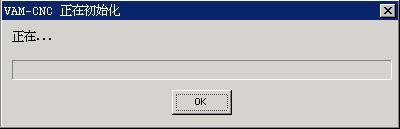

# 对话框编程基础

对话框编程是一种快速构建用户界面的技术。通常，我们编写简单的图形用户界面时，可以通过调用 `CreateWindow` 函数直接创建所有需要的子窗口，即控件。但在图形用户界面比较复杂的情况下，每建立一个控件就调用一次 `CreateWindow` 函数，并传递许多复杂参数的方法很不可取。主要原因之一，就是程序代码和用来建立控件的数据混在一起，不利于维护。为此，一般的 GUI 系统都会提供一种机制，利用这种机制，通过指定一个模板，GUI 系统就可以根据此模板建立相应的主窗口和控件。MiniGUI 也提供这种方法，通过建立对话框模板，就可以建立模态或者非模态的对话框。

本章首先讲解组成对话框的基础，即控件的基本概念，然后讲解对话框模板的定义、对话框回调函数的编程，以及一些较为重要的消息的使用，并说明模态和非模态对话框之间的区别以及编程技术。

## 1 主窗口与对话框

在 MiniGUI 中，对话框是一类特殊的主窗口，这种主窗口只关注与用户的交互――向用户提供输出信息，但更多的是用于用户输入。对话框可以理解为子类化之后的主窗口类。它针对对话框的特殊性（即用户交互）进行了特殊设计。比如用户可以使用 TAB 键遍历控件、可以利用 `ENTER` 键表示默认输入等等。

## 2 对话框模板

在 MiniGUI 中，用两个结构来表示对话框模板 (`minigui/window.h`)，如下所示：

```cpp
typedef struct _CTRLDATA
{
        /** Class name of the control */
        const char* class_name;
        /** Control style */
        DWORD       dwStyle;
        /** Control position in dialog */
        int         x, y, w, h;
        /** Control identifier */
        int         id;
        /** Control caption */
        const char* caption;
        /** Additional data */
        DWORD       dwAddData;
        /** Control extended style */
        DWORD       dwExStyle;
        
        /** window element renderer name */
        const char* werdr_name;
        
        /** table of we_attrs */
        const WINDOW_ELEMENT_ATTR* we_attrs;
} CTRLDATA;
typedef CTRLDATA* PCTRLDATA;

typedef struct _DLGTEMPLATE
{
        /** Dialog box style */
        DWORD       dwStyle;
        /** Dialog box extended style */
        DWORD       dwExStyle;
        /** Dialog box position */
        int         x, y, w, h;
        /** Dialog box caption */
        const char* caption;
        /** Dialog box icon */
        HICON       hIcon;
        /** Dialog box menu */
        HMENU       hMenu;
        /** Number of controls */
        int         controlnr;
        /** Poiter to control array */
        PCTRLDATA   controls;
        /** Addtional data, must be zero */
        DWORD       dwAddData;
} DLGTEMPLATE;
typedef DLGTEMPLATE* PDLGTEMPLATE;
```

结构 `CTRLDATA` 用来定义控件，`DlgTEMPLATE` 用来定义对话框本身。在程序中，应该首先利用 `CTRLDATA` 定义对话框中所有的控件，并用数组表示。控件在该数组中的顺序，也就是对话框中用户按 `TAB` 键时的控件切换顺序。然后定义对话框，指定对话框中的控件数目，并指定 `DlgTEMPLATE` 结构中的 `controls` 指针指向定义控件的数组。如__清单 1__ 所示。

>【注意】MiniGUI 3.0 的 `CTRLDATA` 数据结构新增了两个成员 `werdr_name` 和 `we_attrs`，用于指定控件所使用的渲染器及窗口元素属性。有关渲染器和窗口元素属性的描述，请参阅本指南第 11 章。这两个成员位于该结构的最后，如果使用静态变量或者全局变量定义该结构，则最后两个成员将自动被初始化为零，即使用默认的渲染器及窗口元素属性。为 MiniGUI 1.6/2.0 开发的应用程序，如果使用静态变量或者全局变量的方式定义 `CTRLDATA` 数据结构，则可直接在 MiniGUI 3.0 中编译使用。

__清单 1__ 对话框模板的定义

```cpp
static DLGTEMPLATE DlgInitProgress =
{
        WS_BORDER | WS_CAPTION, 
        WS_EX_NONE,
        120, 150, 400, 130, 
        "VAM-CNC 正在进行初始化",
        0, 0,
        3, NULL,
        0
};

static CTRLDATA CtrlInitProgress [] =
{ 
        {
                "static",
                WS_VISIBLE | SS_SIMPLE,
                10, 10, 380, 16, 
                IDC_PROMPTINFO, 
                "正在...",
                0
        },
        {
                "progressbar",
                WS_VISIBLE,
                10, 40, 380, 20,
                IDC_PROGRESS,
                NULL,
                0
        },
        {
                "button",
                WS_TABSTOP | WS_VISIBLE | BS_DEFPUSHBUTTON, 
                170, 70, 60, 25,
                IDOK, 
                "确定",
                0
        }
};
```

>【注意】应该将程序中定义对话框模板的数据接口定义为 `static` 类型数据，使该数据的定义只在所在文件中有效，以免因为名字空间污染造成潜在的编译或连接错误。

## 3 对话框回调函数

在定义了对话框模板数据之后，需要定义对话框的回调函数，并调用`DialogBoxIndirectParam` 函数建立对话框，如__清单 2__ 所示，所建立的对话框运行效果如__图 1__ 所示。该程序的完整源代码请见本指南示例程序包`mg-samples`中的 `dialogbox.c` 文件。

__清单 2__ 定义对话框回调函数，并建立对话框

```cpp
/* 定义对话框回调函数 */
static int InitDialogBoxProc (HWND hDlg, int message, WPARAM wParam, LPARAM lParam)
{
        switch (message) {
                case MSG_INITDIALOG:
                return 1;
                case MSG_COMMAND:
                switch (wParam) {
                        case IDOK:
                        case IDCANCEL:
                        EndDialog (hDlg, wParam);
                        break;
                }
                break;
        }
        return DefaultDialogProc (hDlg, message, wParam, lParam);
}
static void InitDialogBox (HWND hWnd)
{
        /* 将对话框模板结构和控件结构数组关联起来 */
        DlgInitProgress.controls = CtrlInitProgress;
        DialogBoxIndirectParam (&DlgInitProgress, hWnd, InitDialogBoxProc, 0L);
}
```

__图 1__ __清单 2__ 程序建立的对话框

`DialogBoxIndirectParam` 以及相关函数的原型如下：

```cpp
int GUIAPI DialogBoxIndirectParamEx (PDLGTEMPLATE pDlgTemplate,
HWND hOwner, WNDPROC DlgProc, LPARAM lParam,
const char* werdr_name, WINDOW_ELEMENT_ATTR* we_attrs,
const char* window_name, const char* layer_name);

static inline int GUIAPI DialogBoxIndirectParam (PDLGTEMPLATE pDlgTemplate,
HWND hOwner, WNDPROC DlgProc, LPARAM lParam)
{
        return DialogBoxIndirectParamEx (pDlgTemplate, hOwner, DlgProc, lParam,
        NULL, NULL, NULL, NULL);
}

BOOL GUIAPI EndDialog (HWND hDlg, int endCode);
void GUIAPI DestroyAllControls (HWND hDlg);
```

在 `DialogBoxIndirectParam` 中，需要指定对话框模板（`pDlgTEMPLATE`）、对话框的托管主窗口句柄（`hOwner`）、对话框回调函数地址（`DlgProc`），以及要传递到对话框过程的参数值（`lParam`）。`EndDialog` 用来结束对话框过程。`DestroyAllcontrols` 用来销毁对话框（包括主窗口）中的所有子控件。

在 MiniGUI 3.0 中，`DialogBoxIndirectParam` 被定义为一个内联函数，该函数最终调用 `DialogBoxIndirectParamEx` 完成对话框的创建。`DialogBoxIndirectParamEx` 函数新增加了四个参数：

- `werdr_name`：渲染器名称；
- `we_attrs`：窗口元素属性表；
- `window_name`：窗口的字符串名称，目标保留不使用；应传递 `NULL`；
- `layer_name`：窗口所在的图形层名称，目前保留不使用；应传递 `NULL`。

在__清单 2__ 中，对话框回调函数并没有进行任何实质性的工作，当用户按下“确定”按钮时，调用 `EndDialog` 函数直接返回。

## 4 MSG_INITDIALOG 消息

对话框回调函数是一类特殊的主窗口回调函数。用户在定义自己的对话框回调函数时，需要处理 `MSG_INITDIALOG` 消息。该消息是在 MiniGUI 根据对话框模板建立对话框以及控件之后，发送到对话框回调函数的。该消息的 `lParam` 参数包含了由 `DialogBoxIndirectParam` 函数的第四个参数传递到对话框回调函数的值。用户可以利用该值进行对话框的初始化，或者保存起来以备后用。例如，__清单 3__ 中的程序将 `MSG_INITDIALOG` 消息的 `lParam` 参数保存到了对话框窗口句柄的附加数据中，这样可以确保在任何需要的时候，方便地从对话框窗口的附加数据中获取这一数据。

清单 3 MSG_INITDIALOG 消息的处理入口

```cpp
static int DepInfoBoxProc (HWND hDlg, int message, WPARAM wParam, LPARAM lParam)
{
        struct _DepInfo *info;
        
        switch(message) {
                case MSG_INITDIALOG:
                {
                        /* 将对话框参数 lParam 保存为窗口的附加数据，以备后用*/
                        info = (struct _DepInfo*)lParam;
                        
                        /* 可以使用 info 结构中的数据初始化对话框 */
                        ......
                        
                        SetWindowAdditionalData (hDlg, (DWORD)lParam);
                        break;
                }
                
                case MSG_COMMAND:
                {
                        /*  从窗口的附加数据中取出保存的对话框参数 */
                        info = (struct _DepInfo*) GetWindowAdditionalData (hDlg);
                        
                        switch(wParam) {
                                case IDOK:
                                /* 使用 info 结构中的数据 */
                                ......
                                
                                case IDCANCEL:
                                EndDialog(hDlg,wParam);
                                break;
                        }
                }
        }
        
        return DefaultDialogProc (hDlg, message, wParam, lParam);
}
```

通常而言，传递到对话框回调函数中的参数是一个结构的指针，该结构包含一些初始化对话框的数据，同时也可以将对话框的输入数据保存下来并传递到对话框之外使用。
如果对话框过程在处理 `MSG_INITDIALOG` 消息时返回非零值，则 MiniGUI 会将输入焦点置为第一个具有 `WS_TABSTOP` 风格的控件。

## 5 模态与非模态对话框

简单而言，模态对话框就是显示之后，用户不能再切换到其他主窗口进行工作的对话框，而只能在关闭之后，才能使用其他的主窗口。MiniGUI 中，使用 `DialogBoxIndirectParam` 函数建立的对话框就是模态对话框。实际上，该对话框首先根据模板建立对话框，然后禁止其托管主窗口，并在主窗口的 `MSG_CREATE` 消息中创建控件，之后发送 `MSG_INITDIALOG` 消息给回调函数，最终建立一个新的消息循环，并进入该消息循环，直到程序调用 `EndDialog` 函数为止。

实际上，我们也可以在 MiniGUI 中利用对话框模板建立普通的主窗口，即非模态对话框。这时，我们使用 `CreateMainWindowIndirect` 函数。下面是该函数以及相关函数的原型 (`minigui/window.h`)：

```cpp
MG_EXPORT HWND GUIAPI CreateMainWindowIndirectParamEx (PDLGTEMPLATE pDlgTemplate,
HWND hOwner, WNDPROC WndProc, LPARAM lParam,
const char* werdr_name, WINDOW_ELEMENT_ATTR* we_attrs,
const char* window_name, const char* layer_name);

static inline HWND GUIAPI
CreateMainWindowIndirectParam (PDLGTEMPLATE pDlgTemplate,
HWND hOwner, WNDPROC WndProc, LPARAM lParam)
{
        return CreateMainWindowIndirectParamEx (pDlgTemplate, hOwner,
        WndProc, lParam, NULL, NULL, NULL, NULL);
}

#define CreateMainWindowIndirect(pDlgTemplate, hOwner, WndProc) \
CreateMainWindowIndirectParam(pDlgTemplate, hOwner, WndProc, 0)

BOOL GUIAPI DestroyMainWindowIndirect (HWND hMainWin);
```

在 MiniGUI 3.0 中，`CreateMainWindowIndirect` 和 `CreateMainWindowIndirectParam` 都被定义为内联函数，该函数最终调用 `CreateMainWindowIndirectParamEx` 完成对话框的创建。`CreateMainWindowIndirectParamEx` 函数新增加了四个参数：

- `werdr_name`：渲染器名称；
- `we_attrs`：窗口元素属性表；
- `window_name`：窗口的字符串名称，目标保留不使用；应传递 `NULL`；
- `layer_name`：窗口所在的图形层名称，目前保留不使用；应传递 `NULL`。

使用 `CreateMainWindowIndirect` 根据对话框模板建立的主窗口和其他类型的普通主窗口没有任何区别，但和 `DialogBoxIndirectParam` 函数有如下不同：

- `CreateMainWindowIndirect` 函数在利用对话框模板中的数据建立主窗口之后，会立即返回，而不会像 `DialogBoxIndirectParam` 函数一样建立进入一个新的消息循环。

__清单 4__ 中的程序利用__清单 1__ 中的对话框模板建立了一个主窗口。

__清单 4__ 利用对话框模板建立主窗口

```cpp
/* 定义窗口回调函数 */
static int InitWindowProc (HWND hDlg, int message, WPARAM wParam, LPARAM lParam)
{
        switch (message) {
                case MSG_COMMAND:
                switch (wParam) {
                        case IDOK:
                        case IDCANCEL:
                        DestroyMainWindowIndirect (hWnd);
                        break;
                }
                break;
                
        }
        
        return DefaultWindowProc (hDlg, message, wParam, lParam);
}

...

{
        HWND hwnd;
        MSG  Msg;
        
        /* 将对话框模板和控件数组关联起来 */
        DlgInitProgress.controls = CtrlInitProgress;
        
        /* 建立主窗口 */
        hwnd = CreateMianWindowIndirect (&DlgInitProgress, HWND_DESKTOP, InitWindowProc);
        
        if (hwnd == HWND_INVALID)
        return -1;
        
        while (GetMessage (&Msg, hwnd)) {
                TranslateMessage (&Msg);
                DispatchMessage (&Msg);
        }
}
```

上面的程序将建立一个和__图 1__ 中的对话框完全一样的主窗口。

## 6 对话框相关的控件风格和操作函数

某些通用窗口风格只对对话框中的子控件有效，__表 1__ 汇总了这些风格。对话框的默认窗口过程函数将处理具有这些风格的控件。

__表 1__ 仅用于对话框控件的风格

| 风格标识	| 用途	                               | 备注      |
|:-------------|:------------------------------------|:---------|
| `WS_GROUP`   | 具有该风格的控件将成为同组控件的打头控件。 | 从该控件到下一个 `WS_GROUP` 风格的控件之前的,或者下一个不同种类的控件之前的控件属于同一组。 |
| `WS_TABSTOP` | 具有 `TAB` 键停止功能。	        | 当用户在对话框中使用 `TAB` 键和 `Shift-TAB` 键切换输入焦点时,具有该风格的控件可获得焦点。 |

MiniGUI 提供了一些用于对话框的操作函数，__表 2__ 汇总了这些函数。需要注意的是，虽然这些函数名称中具有 `Dlg` 字样，但并不表明只能在对话框中使用。例如，`GetDlgItemText` 函数，只要知道父窗口的句柄以及子控件的标识符，就可以通过该函数获得子控件的文本。

__表 2__ 对话框操作函数

| 函数名称	         | 用途	                     | 备注 |
|:----------------------|:-------------------------|:-----|
| `DestroyAllcontrols`	| 销毁所有的子窗口	      | |
| `GetDlgCtrlid`	| 根据控件句柄获取控件标识符	| |
| `GetDlgItem`          | 根据控件标识符获取控件句柄	| | 
| `GetDlgItemInt`	| 获取控件文本并转换为整数值	| |
| `SetDlgItemInt`	| 根据整数值设置控件文本	| |
| `GetDlgItemText`	| 获取子控件文本	      | 功能同 `GetWindowText` |
| `GetDlgItemText2`	| 获取子控件文本	      | 根据文本长度自动分配内存,应用程序负责释放该内存 |
| `SetDlgItemText`	| 设置子控件文本	      | 功能同 `SetWindowText` |
| `GetNextDlgGroupItem`	| 获取下一个同组子控件         | 用于遍历同组控件，参阅 `WS_GROUP` 风格 |
| `GetNextDlgTabItem`	| 获取下一个“TAB 键停止”子控件 | 用于 TAB 键游历控件，参阅 `WS_TABSTOP` 风格 |
| `SendDlgItemMessage`	| 向子控件发送消息             | 功能同 `SendMessage` |
| `CheckDlgButton`	| 设置检查框子控件的选中状态	 | |
| `CheckRadioButton`	| 设置单选按钮子控件的选中状态   | |	 
| `IsDlgButtonChecked`	| 检查子按钮是否选中	        | | 
| `GetDlgDefPushButton` | 获取当前默认子按钮	        | |
