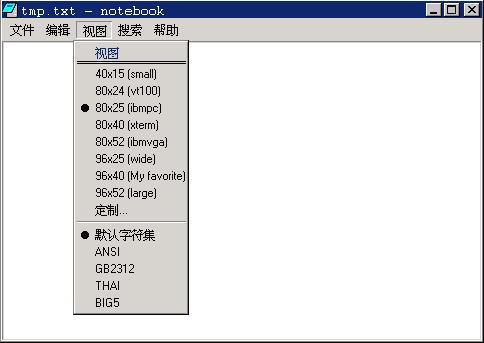
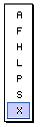

# 菜单

## 1 菜单概念

菜单通常依附于窗口中（称为普通菜单），或者以独立的、可弹出形式出现（称为弹出式菜单）。主要是提供给用户一种快捷选择的方式。

## 2 创建和操作菜单
### 2.1 创建普通菜单

在程序中，我们首先要建立菜单，然后将菜单句柄传递给创建主窗口的函数 `CreateMainWindow`。当主窗口显示出来时，我们创建的菜单就会在标题栏下显示出来。当用户用鼠标或者 `Alt` 键激活菜单并选择了菜单项后，该菜单所依附的窗口会收到 `MSG_COMMAND` 消息。

菜单的创建需要两个过程：

- 建立菜单栏
- 建立菜单栏中各个菜单的子菜单

首先，我们调用 `CreateMenu` 创建一个空的菜单，然后调用 `InsertMenuItem` 函数向这个空菜单中添加菜单项，如下所示：

```c
HMENU hmnu;
MENUITEMINFO mii;

hmnu = CreateMenu();
memset (&mii, 0, sizeof(MENUITEMINFO));
mii.type        = MFT_STRING ;
mii.state       = 0;
mii.id          = IDM_ABOUT_THIS;
mii.typedata    = (DWORD)"文件...";
InsertMenuItem(hmnu, 0, TRUE, &mii);
```

如果这个菜单项有子菜单，则可通过设置菜单项的 `hsubmenu` 变量来指定菜单项的子菜单：

```c
mii.hsubmenu    = create_file_menu();
```

子菜单的创建过程和菜单栏的创建过程类似，但建立空菜单时要调用 `CreatePopupMenu` 函数，如下所示：

```c
HMENU hmnu;
MENUITEMINFO mii;
memset (&mii, 0, sizeof(MENUITEMINFO));
mii.type        = MFT_STRING;
mii.id          = 0;
mii.typedata    = (DWORD)"文件";
hmnu = CreatePopupMenu (&mii);

memset (&mii, 0, sizeof(MENUITEMINFO));
mii.type        = MFT_STRING;
mii.state       = 0;
mii.id          = IDM_NEW;
mii.typedata    = (DWORD)"新建";
InsertMenuItem(hmnu, 0, TRUE, &mii);
```

上述代码段中的 `hmnu` 句柄，就可以做为上一级菜单项的子菜单句柄使用。

### 2.2 创建弹出式菜单

弹出式菜单和菜单栏的用途不同，通常弹出式菜单用来响应用户的鼠标右键点击，通常也称为“上下文菜单”。

创建弹出式菜单和上面创建子菜单的方法一样，需要调用 `CreatePopupMenu` 函数。在显示这个菜单时，调用 `TrackPopupMenu` 函数：

```c
int GUIAPI TrackPopupMenu (HMENU hmnu, UINT uFlags, int x, int y, HWND hwnd);
```

`x` 和 `y` 参数为弹出菜单的屏幕坐标位置，它的具体含义是和 `uFlags` 参数相关的。`uFlags` 参数的取值包括：

- `TPM_LEFTALIGN`：菜单以 (x,y) 点为准水平左对齐，也就是说x参数指定的是菜单的左边位置。
- `TPM_CENTERALIGN`：水平居中对齐。
- `TPM_RIGHTALIGN`：水平右对齐。
- `TPM_TOPALIGN`：垂直顶对齐。
- `TPM_VCENTERALIGN`：垂直居中对齐。
- `TPM_BOTTOMALIGN`：垂直底对齐。

如果我们需要弹出一个下拉菜单，`uFlags` 一般可以用`TPM_LEFTALIGN | TPM_TOPALIGN` 的取值；如果是向上弹出菜单，`uFlags` 可以取 `TPM_LEFTALIGN | TPM_ BOTTOMALIGN`。

下面的代码段中调用了 `StripPopupHead` 函数，该函数用来删除 MiniGUI 弹出式菜单的头部。弹出式菜单的头部和主窗口的标题栏类似，在调用该函数之后，弹出式菜单的头部信息就被销毁了。

```c
HMENU hNewMenu;
MENUITEMINFO mii;
HMENU hMenuFloat;
memset (&mii, 0, sizeof(MENUITEMINFO));
mii.type        = MFT_STRING;
mii.id          = 0;
mii.typedata    = (DWORD)"File";

hNewMenu = CreatePopupMenu (&mii);

hMenuFloat = StripPopupHead(hNewMenu);

TrackPopupMenu (hMenuFloat, TPM_CENTERALIGN, 40, 151, hWnd);
```

### 2.3  `MENUITEMINFO` 结构

`MENUITEMINFO` 结构是用来操作菜单项的核心数据结构，其定义如下：

```c
typedef struct _MENUITEMINFO {
        UINT                mask;
        UINT                type;
        UINT                state;
        int                 id;
        HMENU               hsubmenu;
        PBITMAP             uncheckedbmp;
        PBITMAP             checkedbmp;
        DWORD               itemdata; 
        DWORD               typedata;
        UINT                cch;
} MENUITEMINFO;
typedef MENUITEMINFO* PMENUITEMINFO;
```

对这些成员说明如下：

- `mask`：由 `GetMENUITEMINFO` 和`SetMENUITEMINFO` 函数使用，可由下面的宏组成（可以按位或使用）：
   - `MIIM_STATE`：获取或者设置菜单项的状态
   - `MIIM_id`：获取或者设置菜单项的标识符
   - `MIIM_SUBMENU`：获取或者设置菜单项的子菜单
   - `MIIM_CHECKMARKS`：获取或者设置菜单位图信息
   - `MIIM_TYPE`：获取或者设置菜单项的类型和类型数据
   - `MIIM_DATA`：获取或者设置菜单项的私有数据

这些宏用来定义 `GetMENUITEMINFO` 和 `SetMENUITEMINFO` 函数具体操作菜单项的哪些项目。

- `type`：定义菜单项的类型，可取下面的值之一：
   - `MFT_STRING`：普通的文字菜单项
   - `MFT_BITMAP`：位图菜单项
   - `MFT_BMPSTRING`：含有位图和文字的菜单项
   - `MFT_SEPARATOR`：分割栏
   - `MFT_RADIOCHECK`：含有圆点的普通文字菜单项

- `state`：菜单项的状态，可取下面的值之一：
   - `MFS_GRAYED`：菜单项灰化
   - `MFS_DISABLED`：菜单项被禁止，不可用
   - `MFS_CHECKED`：菜单项含有对勾，即选定状态，当 `type` 使用 `MFT_STRING` 时，显示对勾，当 `type` 使用 `MFT_RADIOCHECK` 时，显示圆点
   - `MFS_ENABLED`：菜单项是可用的
   - `MFS_UNCHECKED`：菜单项不含对勾，没有被选定

- `id`：菜单项的整数标识符。
- `hsubmenu`：如果菜单项含有子菜单，则表示子菜单的句柄。
- `uncheckedbmp`：如果菜单项是位图菜单，则该位图用于显示非选定状态的菜单项。
- `checkedbmp`：如果菜单项是位图菜单，则该位图用于显示选定状态的菜单项。
- `itemdata`：和该菜单项关联的私有数据。
- `typedata`：菜单项的类型数据，用来传递菜单项的文本字符串。
- `cch`：由 `GetMENUITEMINFO` 函数使用，用来表示字符串的最大长度。

当 `type` 为 `MFT_BMPSTRING` 的时候，`checkedbmp` 和`uncheckedbmp` 分别表示菜单项选中时和非选中时的位图。

### 2.4 操作菜单项

应用程序可以通过 `GetMENUITEMINFO` 函数获得感兴趣的菜单项属性，也可以通过 `SetMENUITEMINFO` 函数设置感兴趣的菜单项属性。这两个函数的接口定义如下：

```c
int GUIAPI GetMenuItemInfo (HMENU hmnu, int item, BOOL flag, PMENUITEMINFO pmii);
int GUIAPI SetMenuItemInfo (HMENU hmnu, int item, BOOL flag, PMENUITEMINFO pmii);
```

这两个函数用来获取或者修改 `hmnu` 菜单中某个菜单项的属性。这时，我们需要一种方法来定位菜单中的菜单项，MiniGUI 提供了两种方式：

- `flag` 取 `MF_BYCOMMAND`：通过菜单项的整数标识符。这时，上述两个函数中的 `item` 参数取菜单项的标识符。
- `flag` 取 `MF_BYPOSITION`：通过菜单项在菜单中的位置。这时，上述两个函数中的 `item` 参数取菜单项在菜单中的位置索引值，第一个菜单项取 0 值。

在使用这两个函数获取或设置菜单属性的时候，`MENUITEMINFO` 的`mask` 成员要设置相应的值才能成功获取或设置菜单的属性，有关 `mask` 的值请参照 2.3 对于 `mask` 成员的相关说明。

MiniGUI 还提供了其它一些获取和设置菜单项属性的函数，这些函数均使用上述这种定位菜单项的方法。这些函数包括 `GetSubMenu`、`SetMenuItemBitmaps`、`GetMenuItemid`、`EnableMenuItem` 等等。这些函数的功能其实均可通过上面这两个函数实现，因此，这里不再赘述。

### 2.5 删除和销毁菜单或菜单项

MiniGUI 提供了如下函数用来从菜单中删除菜单项或者销毁菜单：

- `RemoveMenu`：该函数从菜单中删除指定的菜单项。如果菜单项含有子菜单，则会解除子菜单和该菜单项的关联，但并不删除子菜单。
- `DeleteMenu`：该函数从菜单中删除指定的菜单项。如果菜单项含有子菜单，则同时会删除子菜单。
- `DestroyMenu`：删除整个菜单。

### 2.6 `MSG_ACTIVEMENU` 消息

在用户激活菜单栏中的某个弹出式菜单后，MiniGUI 将给菜单栏所在的窗口过程发送 `MSG_ACTIVEMENU` 消息。该消息的第一个参数是被激活的弹出式菜单位置，第二个参数是该弹出式菜单的句柄。应用程序可以利用该消息对菜单进行处理，比如根据程序运行状态修改某些菜单项的选中标志等等。下面的代码段来自 MiniGUI 的 `libvcongui`，这段程序根据用户的设置（虚拟终端的大小以及字符集）相应设置了菜单项的选中状态：

```c
case MSG_ACTIVEMENU:
if (wParam == 2) {
        CheckMenuRadioItem ((HMENU)lParam,
        IDM_40X15, IDM_CUSTOMIZE,
        pConInfo->termType, MF_BYCOMMAND);
        CheckMenuRadioItem ((HMENU)lParam, 
        IDM_DEFAULT, IDM_BIG5,
        pConInfo->termCharset, MF_BYCOMMAND);
}
break;
```

注意在上述代码中，两次调用 `CheckMenuRadioItem` 函数分别设置当前的终端大小和字符集选项。

## 3 编程实例

清单 1 给出了普通菜单的编程实例，该实例是 `mg-samples` 中 `notebook` 的一部分，鉴于篇幅，只给出关于菜单的部分。该程序创建的菜单效果见图 1。

__清单 1__ 普通菜单的编程实例

```c
/* 创建“文件”菜单 */
static HMENU createpmenufile (void)
{
        HMENU hmnu;
        MENUITEMINFO mii;
        memset (&mii, 0, sizeof(MENUITEMINFO));
        mii.type        = MFT_STRING;
        mii.id          = 0;
        mii.typedata    = (DWORD)"文件";
        hmnu = CreatePopupMenu (&mii);
        
        memset (&mii, 0, sizeof(MENUITEMINFO));
        mii.type        = MFT_STRING;
        mii.state       = 0;
        mii.id          = IDM_NEW;
        mii.typedata    = (DWORD)"新建";
        InsertMenuItem(hmnu, 0, TRUE, &mii);
        
        mii.type        = MFT_STRING;
        mii.state       = 0;
        mii.id          = IDM_OPEN;
        mii.typedata    = (DWORD)"打开...";
        InsertMenuItem(hmnu, 1, TRUE, &mii);
        
        mii.type        = MFT_STRING;
        mii.state       = 0;
        mii.id          = IDM_SAVE;
        mii.typedata    = (DWORD)"保存";
        InsertMenuItem(hmnu, 2, TRUE, &mii);
        
        mii.type        = MFT_STRING;
        mii.state       = 0;
        mii.id          = IDM_SAVEAS;
        mii.typedata    = (DWORD)"另存为...";
        InsertMenuItem(hmnu, 3, TRUE, &mii);
        
        mii.type        = MFT_SEPARATOR;
        mii.state       = 0;
        mii.id          = 0;
        mii.typedata    = 0;
        InsertMenuItem(hmnu, 4, TRUE, &mii);
        
        mii.type        = MFT_SEPARATOR;
        mii.state       = 0;
        mii.id          = 0;
        mii.typedata    = 0;
        InsertMenuItem(hmnu, 5, TRUE, &mii);
        
        mii.type        = MFT_STRING;
        mii.state       = 0;
        mii.id          = IDM_EXIT;
        mii.typedata    = (DWORD)"退出";
        InsertMenuItem(hmnu, 6, TRUE, &mii);
        
        return hmnu;
}

/* 创建菜单栏 */
static HMENU createmenu (void)
{
        HMENU hmnu;
        MENUITEMINFO mii;
        
        hmnu = CreateMenu();
        
        memset (&mii, 0, sizeof(MENUITEMINFO));
        mii.type        = MFT_STRING;
        mii.id          = 100;
        mii.typedata    = (DWORD)"文件";
        mii.hsubmenu    = createpmenufile ();
        
        InsertMenuItem(hmnu, 0, TRUE, &mii);
        
        ...
        
        return hmnu;
}

/* 处理 MSG_ACTIVEMENU，以确保正确设定菜单项的选中状态 */
case MSG_ACTIVEMENU:
if (wParam == 2) {
        /* 用 CheckMenuRadioItem 来设定菜单项的选中状态 */
        CheckMenuRadioItem ((HMENU)lParam,
        IDM_40X15, IDM_CUSTOMIZE,
        pNoteInfo->winType, MF_BYCOMMAND);
        CheckMenuRadioItem ((HMENU)lParam,
        IDM_DEFAULT, IDM_BIG5,
        pNoteInfo->editCharset, MF_BYCOMMAND);
}
break;

/* 处理 MSG_COMMAND 消息，处理各个菜单命令 */
case MSG_COMMAND:
switch (wParam) {
        case IDM_NEW:
        break;
        
        case IDM_OPEN:
        break;
        
        case IDM_SAVE:
        break;
        
        case IDM_SAVEAS:
        break;
};
```



__图 1__ 记事本程序创建的菜单

清单 2 给出了弹出式菜单的编程实例。

__清单 2__ 弹出菜单的编程实例

```c
static HMENU CreateQuickMenu (void)
{
        int i;
        HMENU hNewMenu;
        MENUITEMINFO mii;
        HMENU hMenuFloat;
        
        char *msg[] = {
                "A",
                "F",
                "H",
                "L",
                "P",
                "S",
                "X"
        };
        
        memset (&mii, 0, sizeof(MENUITEMINFO));
        mii.type        = MFT_STRING;
        mii.id          = 0;
        mii.typedata    = (DWORD)"File";
        
        hNewMenu = CreatePopupMenu (&mii);
        
        for ( i = 0; i <7; i ++ ) {
                memset ( &mii, 0, sizeof (MENUITEMINFO) );
                mii.type = MFT_STRING;
                mii.id = 100+ i;
                mii.state = 0;
                mii.typedata= (DWORD) msg[i]; 
                InsertMenuItem ( hNewMenu, i, TRUE, &mii );
        }
        
        hMenuFloat = StripPopupHead(hNewMenu);
        
        TrackPopupMenu (hMenuFloat, TPM_CENTERALIGN | TPM_LEFTBUTTON , 40, 151, hWnd);
}
```

清单 2 中的程序创建的弹出式菜单如图 2 所示。



__图 2__ 弹出式菜单
