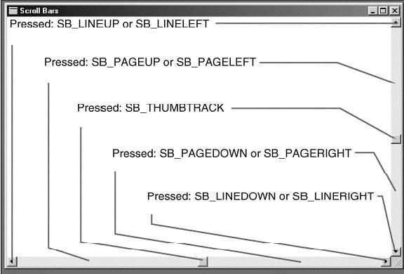

# 滚动条

## 1 滚动条概念

>【注意】：本章讲述的滚动条，是作为 MiniGUI 主窗口和控件的一部分而存在的。MiniGUI 3.0 中也增加了独立的滚动条控件。有关该滚动条控件的使用方法，请参阅本指南“[独立滚动条控件](MiniGUIProgGuidePart6Chapter21-zh.md)”。

滚动条是图形用户界面中最好的功能之一，它很容易使用，而且提供了很好的视觉反馈效果。你可以使用滚动条显示任何东西——无论是文字、图形、表格、数据库记录、图像或是网页，只要它所需的空间超出了窗口的显示区域所能提供的空间，就可以使用滚动条。

滚动条既有垂直方向的（供上下移动），也有水平方向的（供左右移动）。使用者可以使用鼠标在滚动条两端的箭头上或者在箭头之间的区域中点一下，这时，滚动滑块在滚动条内的移动位置与所显示的信息在整个文件中的位置成比例。使用者也可以用鼠标拖动滚动滑块到特定的位置。图8.1显示了垂直滚动条的建议用法。


__图 1__ 垂直滚动条的建议用法

有时，程序编写者对滚动概念很难理解，因为他们的观点与使用者的观点不同：使用者向下滚动是想看到文件较下面的部分；但是，程序实际上是将文件相对于显示窗口向上移动。MiniGUI 是依据使用者的观点：向上滚动意味着朝文件的开头移动；向下滚动意味着朝文件尾部移动。

在应用程序中包含水平或者垂直的滚动条很容易，程序编写者只需要在`CreateWindow` 的第三个参数中包括窗口风格标识号 `WS_VSCROLL`（垂直滚动）和(或) `WS_HSCROLL` （水平滚动）即可。这些滚动条通常放在窗口的右部和底部，伸展为显示区域的整个长度或宽度。显示区域不包含滚动条所占据的空间。另外，默认情况下，垂直滚动条显示在窗口的右侧，如果希望将垂直滚动条显示在窗口的左侧，则应该使用 `WS_EX_LEFTSCROLLBAR` 扩展风格。

在 MiniGUI 中，会自动将鼠标点击转换为相应的消息，但是程序编写者必须自己处理键盘的消息。

## 2 使能、禁止滚动条

```c
EnableScrollBar (hWnd, SB_HORZ, TRUE);
EnableScrollBar (hWnd, SB_VERT, FALSE);
```

`EnableScrollBar` 函数可以用来使能或者禁止滚动条，它的第二个参数指定要操作的是哪个（垂直或者水平）滚动条。

## 3 滚动条的范围和位置

每个滚动条均有一个相关的“范围”（这是一对整数，分别代表最小值和最大值）和“位置”（它是滚动滑块在此范围内的位置）。当滚动滑块在滚动条的顶部（或左部）时，滚动滑块的位置是范围的最小值；在滚动条的底部（或右部）时，滚动滑块的位置是范围的最大值。

在默认情况下，滚动条的范围是从 0（顶部或左部）至 100（底部或右部），但我们也可以将范围改变为更便于程序处理的数值：

```c
SCROLLINFO si;

si.nMax = 100;
si.nMin = 0;
si.nPage = 10;    // 该变量决定了滚动滑块的长度，该长度是由nPage/(nMax-nMin)的大小决定的
si.nPos = 0;      // 滑块的当前位置，它必须在nMin和nMax的范围内
SetScrollInfo (hWnd, Bar, &si, bRedraw);
```

参数 `Bar` 为 `SB_VERT` 或者 `SB_HORZ`，`nMin` 和 `nMax` 分别是范围的最小值和最大值。如果想要窗口根据新范围重画滚动条，则设置 `bRedraw` 为 `TRUE`（如果在调用`SetScrollRange` 后，调用了影响滚动条位置的其他函数，则应该将 `bRedraw` 设定为 `FALSE` 以避免过多地重画）。滚动滑块的位置总是离散的整数值。例如，范围为 0 至 4 的滚动条具有 5 个滚动滑块位置。如图 2。


__图 2__ 范围为 0 至 4 的滚动条具有 5 个滚动滑块位置

在程序内使用滚动条时，程序编写者与窗口系统共同负责维护滚动条以及更新滚动滑块的位置。下面是窗口系统对滚动条的处理：

处理所有滚动条鼠标事件：

- 当使用者在滚动条内拖动滚动滑块时，移动滚动滑块。
- 为包含滚动条窗口的窗口消息处理程序发送滚动条消息。

以下是程序编写者应该完成的工作：

- 初始化滚动条的范围和位置。
- 处理窗口消息处理程序的滚动条消息。
- 更新滚动条内滚动滑块的位置。
- 更改显示区域的内容以回应对滚动条的更改。

## 4 滚动条消息

在用鼠标单击滚动条或者拖动滚动滑块时，窗口系统给窗口消息处理程序发送 `MSG_VSCROLL`（供上下移动）和 `MSG_HSCROLL`（供左右移动）消息。

和所有的消息一样， `MSG_VSCROLL` 和 `MSG_HSCROLL` 也带有 `wParam` 和 `lParam` 消息参数，大部分情况下我们可以忽略 `lParam` 参数。

`wParam` 消息参数被分为一个低字节和一个高字节。`wParam` 是一个数值，它指出了鼠标对滚动条进行的操作。这个数值被看作一个“通知码”。通知码的值由以 `SB`（代表 “scroll bar（滚动条）”）开头进行定义。表 1 是 MiniGUI 中定义的通知码。

__表 1__ MiniGUI 定义的滚动条通知码

| 通知码标识符	| 含义 |
|:-------------|:----|
| `SB_LINEUP`	| 鼠标点击竖直按钮的上箭头 1 次 |
| `SB_LINEDOWN`	| 鼠标点击竖直滚动条的下箭头 1 次 |
| `SB_LINELEFT` |	鼠标点击水平滚动条的左箭头 1 次 |
| `SB_LINERIGHT` |	鼠标点击水平滚动条的右箭头 1 次 |
| `SB_`PageUp`	| 鼠标点击竖直按钮的上箭头与滑块之间的区域 1 次 |
| `SB_`PageDown` |	鼠标点击竖直按钮的下箭头与滑块之间的区域 1 次 |
| `SB_PAGELEFT` |	鼠标点击水平按钮的左箭头与滑块之间的区域 1 次 |
| `SB_PAGERIGHT` |	鼠标点击水平按钮的右箭头与滑块之间的区域 1 次 |
| `SB_THUMBTRACK`	| 鼠标拖动滑块移动时窗口不断地收到的消息，注意，该值表示对鼠标位置经换算后对应的数值（通过 `lParam` 传递的），该值有可能大于设置的最大值，也有可能<小于设置的最小值，在程序中需要作相应的判断。 |
| `SB_THUMBPOSITION` |	用户拖动滑块结束。 |

包含 `LEFT` 和 `RIGHT` 的标识号用于水平滚动条，包含 `UP`、`DOWN`、`TOP` 和 `BOTTOM` 的标识号用于垂直滚动条。鼠标在滚动条的不同区域单击所产生的通知码如图 3 所示。



__图 3__ 鼠标在滚动条的不同区域单击所产生的通知码

如果在滚动条的各个部位按住鼠标键，程序就能收到多个滚动条消息。
当把鼠标的游标放在滚动滑块上并按住鼠标键时，你就可以移动滚动滑块。这样就产生了带有 `SB_THUMBTRACK` 通知码的滚动条消息。在 `wParam` 是 `SB_THUMBTRACK` 时，`lParam` 是使用者在拖动滚动滑块时的目前位置。该位置位于滚动条范围的最小值和最大值之间。对于其他的滚动条操作，`lParam` 应该被忽略。

为了给使用者提供反馈，窗口系统在你用鼠标拖动滚动滑块时移动它，同时你的程序会收到` SB_THUMBTRACK` 消息。然而，如果不通过调用 `SetScrollPos` 来处理 `SB_THUMBTRACK` 或 `SB_THUMBPOSITION` 消息，在使用者释放鼠标键后，滚动滑块会迅速跳回原来的位置。

程序能够处理 `SB_THUMBTRACK` 消息，如果处理`SB_THUMBTRACK` 消息，在使用者拖动滚动滑块时你需要移动显示区域的内容。处理 `SB_THUMBTRACK` 消息时窗口内容的更新要求比较及时，因此，对于某些应用程序，可能因为数据量大，重绘效率低而很难跟上产生的消息，这时，就可以忽略这个消息而只处理 `SB_THUMBPOSITION` 消息。

## 5 编程实例

清单 1 给出了一个简单的滚动条处理程序。该程序的完整源代码可见本指南示例程序包 `mg-samples` 中的 `scrollbar.c` 程序。

__清单 1__ 滚动条及其处理

```c
SCROLLINFO si;

si.nMax = 100;
si.nMin = 0;
si.nPage = 10;    // 该变量决定了滚动滑块的长度，该长度是由nPage/(nMax-nMin)的大小决定的
si.nPos = 0;      // 滑块的当前位置，它必须在nMin和nMax的范围内
SetScrollInfo (hWnd, Bar, &si, bRedraw);
```

图 4 是清单 1 中的程序运行起来的效果。


__图 4__ 滚动条的处理
