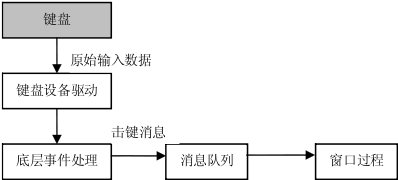
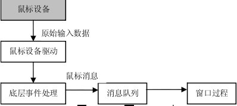
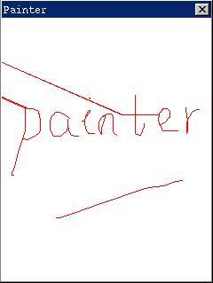

# 键盘和鼠标

应用程序从键盘和鼠标接收用户的输入，MiniGUI 应用程序通过处理发送到窗口的消息而接收键盘和鼠标输入的。这一章讲述 MiniGUI 中键盘和鼠标输入的产生，以及应用程序是如何接收和处理键盘和鼠标消息的。

## 1 键盘
### 1.1 键盘输入

图 1 说明了 MiniGUI 对键盘输入的处理方式。



__图 1.1__ MiniGUI 中的键盘输入

MiniGUI 通过键盘设备驱动程序从键盘接收原始的输入事件或数据，把它转换为 MiniGUI 抽象的键盘事件和数据。相关的底层事件处理例程把这些键盘事件转换为上层的击键消息，放到相应的消息队列中。应用程序通过消息循环获取这些消息，交由窗口过程处理。MiniGUI 可以支持 255 个键，每一个不同的键都对应于一个独一无二的“扫描码”，129 以下的扫描码用于定义 PC 键盘。下面是 `<minigui/common.h>` 中部分扫描码的定义：

```c
#define MGUI_NR_KEYS                    255
#define NR_KEYS                         128
#define SCANCODE_USER                   (NR_KEYS + 1)

#define SCANCODE_ESCAPE                 1

#define SCANCODE_1                      2
#define SCANCODE_2                      3
#define SCANCODE_3                      4
#define SCANCODE_4                      5
#define SCANCODE_5                      6
#define SCANCODE_6                      7
#define SCANCODE_7                      8
#define SCANCODE_8                      9
#define SCANCODE_9                      10
#define SCANCODE_0                      11

#define SCANCODE_MINUS                  12
#define SCANCODE_EQUAL                  13

#define SCANCODE_BACKSPACE              14
#define SCANCODE_TAB                    15
...
```

### 1.2 击键消息

当一个键被按下时，应用程序将收到一个 `MSG_KEYDOWN` 消息或`MGS_SYSKEYDOWN` 消息；释放一个键会产生一个 `MSG_KEYUP` 消息或 `MGS_SYSKEYUP` 消息。

按键和释放键消息通常是成对出现的，但如果用户按住某个键不放手，一段时间以后就会启动键盘的自动重复特性，系统将会产生一系列的 `MSG_KEYDOWN` 或 `MSG_SYSKEYDOWN` 消息；在用户释放该键时，才会产生一条 `MSG_KEYUP` 或 `MSG_SYSKEYUP` 消息。

MiniGUI 中，当 `ALT` 按下时击键，会产生系统击键消息`MSG_SYSKEYDOWN` 和 `MSG_SYSKEYUP`。非系统击键产生非系统击键消息 `MSG_KEYDOWN` 和 `MSG_KEYUP`。系统击键消息在 MiniGUI 中被用来控制菜单的激活，非系统击键消息主要用于应用程序。如果应用程序的窗口过程处理系统击键消息，那么在处理完这条消息后，应该把它传给函数 `DefaultMainWinProc` 处理。否则，系统操作将被禁止。

击键消息的 `wParam` 参数就是代表该键的扫描码，`lParam` 参数含有 `SHIFT`、`ALT`、`CTRL` 等特殊键的状态标志。

# 1.3 字符消息

一个典型的窗口过程通常不直接处理字符键的击键消息，而是处理字符键的字符消息 `MSG_CHAR`，`MSG_CHAR` 消息的 `wParam` 参数就是代表该字符的编码值。

`MSG_CHAR` 消息通常由 `TranslateMessage` 函数产生，该函数在收到击键消息 `MSG_KEYDOWN` 和 `MSG_SYSKEYDOWN` 时检查该键的扫描码和相关键的状态，如果能转换为某个字符的话，就产生相应字符的 `MSG_CHAR` 或 `MSG_SYSCHAR` 消息，直接发送到击键消息的目标窗口。应用程序一般在消息循环中在 `DispatchMessage` 之前调用 `TranslateMessage` 函数，如下：

```c
while (GetMessage(&Msg, hMainWnd)) {
        TranslateMessage(&Msg);
        DispatchMessage(&Msg);
}
```

因为 `TranslateMessage` 函数在分派消息之前对 `MSG_KEYDOWN` 和 `MSG_SYSKEYDOWN` 消息进行处理，产生了字符消息，并且把它直接发送到窗口过程，所以窗口过程会先收到字符键的字符消息而后收到击键消息。

字符消息的 `wParam` 参数含有被按下的字符键的 ASCII 码，`lParam` 参数的内容和产生字符消息的击键消息的参数是一样的。

处理击键消息和字符消息的基本规则是：如果需要读取输入到窗口的键盘字符，那么用户可以处理 `MSG_CHAR` 消息。如果需要读取游标键、功能键、`Delete`、`Insert`、`Shift`、`Ctrl` 以及 `Alt` 键，那么用户可以处理 `MSG_KEYDOWN` 消息。

### 1.4 键状态

在处理键盘消息的同时，应用程序可能需要确定与产生当前消息的键相关的特殊换档键（`Shift`、`Ctrl` 和 `Alt`）或开关键（`Caps Lock`、`Num Lock` 和 `Scroll Lock`）的状态。击键消息的 `lParam` 参数含有特殊键等的状态标志，应用程序可以使用特定的宏与该参数进行“与”操作来确定某个特定键的状态，如：如果 (`lParam & KS_LEFTCTRL`) 为 `TRUE` 的话说明发生击键消息时左边的 `CTRL` 键被按下。MiniGUI 定义的键状态宏包括：

```c

KS_CAPSLOCK          CapsLock 键被锁住
KS_NUMLOCK           NumLock 键被锁住
KS_SCROLLLOCK        ScrollLock 键被锁住
KS_LEFTCTRL          左 Ctrl 键被按下
KS_RIGHTCTRL         右 Ctrl 键被按下
KS_CTRL              任何一个 Ctrl 键被按下
KS_LEFTSHIFT         左 Shift 键被按下
KS_RIGHTSHIFT        右 Shift 键被按下
KS_SHIFT             任何一个 Shift 键被按下
KS_IMEPOST           鼠标消息由 IME 窗口投递
KS_LEFTBUTTON        鼠标左键被按下
KS_RIGHTBUTTON       鼠标右键被按下
KS_MidDLBUTTON       鼠标中键被按下
KS_CAPTURED          鼠标被窗口捕获
```

其中除了 `KS_CAPTURED` 只能用于鼠标消息之外，其它的宏既能用于击键消息，也可以用于鼠标消息。

应用程序可以用 `GetShiftKeyStatus` 函数来获取键状态值：

```c
DWORD GUIAPI GetShiftKeyStatus (void);\
```

该函数的返回值包含所有上述键的状态，同上，应用程序可以使用特定的宏与返回值进行“与”操作来确定某个特定键的状态，如：用 `GetShiftKeyStatus() & KS_CTRL` 来确定左或右 `Ctrl` 键是否被按下，如果是的话则上述表达式值为 `TRUE`。

应用程序还可以调用 `GetKeyStatus` 函数来确定键盘上某个键的状态：

```c
BOOL GUIAPI GetKeyStatus (UINT uKey);
```

参数 `uKey` 是代表所查询键的扫描码。如果该键被按下，`GetKeyStatus` 返回 `TRUE`，否则返回 `FALSE`。

### 1.5 输入焦点

系统把键盘消息发送到具有输入焦点的窗口的程序消息队列中。具有输入焦点的窗口可以接收键盘输入，这样的窗口一般是活动窗口、活动窗口的子窗口或活动窗口的子窗口的子窗口等，子窗口一般通过显示一个闪烁的插入符来表明它具有输入焦点。有关插入符，参见“[图标、光标和插入符](MiniGUIProgGuidePart1Chapter09-zh.md)”。

输入焦点是窗口的一个属性，系统可以通过移动输入焦点让显示在屏幕上的所有窗口共享键盘，用户可以把输入焦点从一个窗口移动另一个窗口。如果输入焦点从一个窗口改变到另一个窗口，系统向将要失去焦点的窗口发送 `MSG_KILLFOCUS` 消息，而把 `MSG_SETFOCUS` 消息发送给将要得到焦点的窗口。

应用程序可以调用 `GetFocusChild` 函数来获得某个窗口中具有输入焦点的子窗口的句柄。

```c
#define GetFocus GetFocusChild
HWND GUIAPI GetFocusChild (HWND hWnd);
```

父窗口可以调用 `SetFocusChild` 函数来把输入焦点赋予它的某个子窗口。

```c
#define SetFocus SetFocusChild
HWND GUIAPI SetFocusChild (HWND hWnd);
```

### 1.6 示例程序

清单 1 中的代码演示了简单的键盘输入概念。该程序的完整源代码可见本指南示例程序包 `mg-samples` 中的 `simplekey.c` 程序。

__清单 1.1__ simplekey.c

```c
#include <minigui/common.h>
#include <minigui/minigui.h>
#include <minigui/gdi.h>
#include <minigui/window.h>

static int SimplekeyWinProc(HWND hWnd, int message, WPARAM wParam, LPARAM lParam)
{
        switch (message) {
                case MSG_KEYDOWN:
                /* 打印被按下的键的扫描码 */
                printf ("MGS_KEYDOWN: key %d\n", LOWORD(wParam));
                break;
                
                case MSG_KEYUP:
                /* 打印被释放的键的扫描码 */
                printf ("MGS_KEYUP: key %d\n", LOWORD(wParam));
                break;
                
                case MSG_CHAR:
                /* 打印转换成字符的编码值 */
                printf ("MGS_CHAR: char %d\n", wParam);
                break;
                
                case MSG_CLOSE:
                DestroyAllControls (hWnd);
                DestroyMainWindow (hWnd);
                PostQuitMessage (hWnd);
                return 0;
        }
        
        return DefaultMainWinProc(hWnd, message, wParam, lParam);
}

/* 以下创建主窗口的代码从略 */
```

上述程序的窗口过程把收到的每一个 `MSG_KEYDOWN`、`MSG_KEYUP` 和 `MGS_CHAR` 消息的 `wParam` 参数打印到控制台上，这个值有可能是击键的扫描码 `MSG_KEYDOWN` 和 `MSG_KEYUP`，也有可能是字符键的编码值 `MSG_CHAR`。

## 2 鼠标
### 2.1 鼠标输入

MiniGUI 中对鼠标的处理和对键盘的处理方式是类似的，如图 2 所示。



__图 2__ MiniGUI 中的鼠标输入

MiniGUI 通过鼠标设备驱动程序从鼠标设备接收原始的输入事件或数据，把它转换为 MiniGUI 抽象的鼠标事件和数据。相关的底层事件处理例程把这些鼠标事件转换为上层的鼠标消息，放到相应的消息队列中。应用程序通过消息循环获取这些消息，交由窗口过程处理。

用户移动鼠标时，系统在屏幕上移动一个称为鼠标光标的小位图。鼠标光标含有一个叫做热点的像素点，系统用它来跟踪和识别光标的位置。如果发生了鼠标事件，热点所在位置下的窗口通常会接收到相关的鼠标消息。能够接收鼠标消息的窗口并不一定是活动窗口或具有键盘输入焦点。有关鼠标光标，参阅“[图标、光标和插入符](MiniGUIProgGuidePart1Chapter09-zh.md)”。

### 2.2 鼠标消息

只要用户移动鼠标、按下或者释放鼠标按钮，都会产生一个鼠标输入事件。MiniGUI 把底层的鼠标输入事件转换为鼠标消息，投递到相应的应用程序消息队列中。当鼠标光标在窗口之内，或是该窗口捕获了鼠标时发生了鼠标事件，窗口就会接收到鼠标消息，不管该窗口是否活动或者是否拥有输入焦点。

鼠标消息分为两组：客户区消息和非客户区消息，通常应用程序只处理客户区鼠标消息而忽略非客户区鼠标消息。

如果鼠标事件发生时鼠标光标位于窗口的客户区内，窗口就会收到一条客户区鼠标消息。当用户在客户区中移动鼠标时，系统向窗口投递一条 `MSG_MOUSEMOVE` 消息。当光标在客户区中时，如果用户按下或释放鼠标按钮，则发送如下的消息：

```c
MSG_LBUTTONDOWN         鼠标左按钮被按下
MSG_LBUTTONUP           鼠标左按钮被释放
MSG_RBUTTONDOWN         鼠标右按钮被按下
MSG_RBUTTONUP           鼠标右按钮被释放
MSG_LBUTTONDBLCLK       鼠标左按钮被双击
MSG_RBUTTONDBLCLK       鼠标右按钮被双击
```

客户区鼠标消息的 `lParam` 参数指示光标热点的位置，其低位字是热点的x坐标，高位字是y坐标。这两个位置坐标都是以客户区坐标给出的，就是相对于客户区左上角（0, 0）的坐标。需要注意的是，当窗口捕获鼠标时，上述消息的位置坐标以屏幕坐标给出。

`lParam` 参数就是上一节中所讨论的键状态值，它指明发生鼠标事件时鼠标的其它按钮以及 `CTRL` 和 `SHIFT` 等键的状态，需要根据其它按钮或 `CTRL` 和 `SHIFT` 键的状态来处理鼠标消息时就必须检查这些标志。例如，如果 `lParam & KS_SHIFT` 为 `TRUE`，则鼠标事件发生于 `SHIFT` 键被按下时。

如果鼠标事件发生在窗口的非客户区，如标题栏、菜单和窗口滚动条，窗口就会收到一条非客户区鼠标消息，包括：

```c
MSG_NCLBUTTONDOWN         鼠标左按钮被按下
MSG_NCLBUTTONUP           鼠标左按钮被释放
MSG_NCRBUTTONDOWN         鼠标右按钮被按下
MSG_NCRBUTTONUP           鼠标右按钮被释放
MSG_NCLBUTTONDBLCLK       鼠标左按钮被双击
MSG_NCRBUTTONDBLCLK       鼠标右按钮被双击
```

应用程序通常不需要处理非客户区鼠标消息，而是把它留给系统进行默认处理，使系统功能能够执行。

非客户区鼠标消息的 `lParam` 参数包含低位字的 x 坐标和高位字的 y 坐标，均为窗口坐标。非客户区鼠标消息的 `wParam` 参数指明移动或单击鼠标按钮时的非客户区位置，它是 `window.h` 中定义的 `HT` 开头的标识符之一：

```c
#define HT_UNKNOWN            0x00
#define HT_OUT                0x01
#define HT_MENUBAR            0x02
#define HT_TRANSPARENT        0x03
#define HT_BORDER_TOP         0x04
#define HT_BORDER_BOTTOM      0x05
#define HT_BORDER_LEFT        0x06
#define HT_BORDER_RIGHT       0x07
#define HT_CORNER_TL          0x08
#define HT_CORNER_TR          0x09
#define HT_CORNER_BL          0x0A
#define HT_CORNER_BR          0x0B
#define HT_CLIENT             0x0C

#define HT_NEEDCAPTURE        0x10
#define HT_BORDER             0x11
#define HT_NCLIENT            0x12
#define HT_CAPTION            0x13
#define HT_ICON               0x14
#define HT_CLOSEBUTTON        0x15
#define HT_MAXBUTTON          0x16
#define HT_MINBUTTON          0x17
#define HT_HSCROLL            0x18
#define HT_VSCROLL            0x19
```

上述标识符称为击中检测码，所标识的热点位置包括标题栏、菜单栏、边框、滚动条和客户区等。

如果发生鼠标事件，系统会向含有光标热点的窗口或捕捉鼠标的窗口发送一条 `MSG_HITTEST`（`MSG_NCHITTEST`）消息，MiniGUI 通过发送这条消息来确定如何向客户区或非客户区发送鼠标消息。

`MSG_HITTEST` 消息的 `wParam` 参数为光标热点的 x 坐标，`lParam` 参数为光标热点的 y 坐标。MiniGUI 中缺省的鼠标消息处理例程对 `MSG_HITTEST` 消息进行处理，检查这对坐标并返回一个标识热点位置的击中检测码。如果光标热点在窗口的客户区，`HT_CLIENT` 击中检测码被返回，MiniGUI 将把光标热点的屏幕坐标转换为客户区坐标，然后向相应的窗口过程发送客户区鼠标消息。如果光标热点在窗口的非客户区，其它的击中检测码被返回，MiniGUI 向窗口过程发送非客户区鼠标消息，把击中检测码放在 `wParam` 参数中，把光标坐标放在 `lParam` 参数中。

### 2.3 鼠标捕获

窗口过程通常只在鼠标光标位于窗口的客户区或非客户区上时才接收鼠标消息，也就是说，系统只向光标热点之下的窗口发送鼠标消息。但是某些时候应用程序可能需要接收鼠标消息，即使光标热点在它的窗口范围之外。这种情况下，我们可以使用 `SetCapture` 函数来使某个窗口捕获鼠标，在应用程序调用 `ReleaseCapture` 恢复正常的鼠标处理方式之前，这个窗口将接收所有的鼠标消息。

MiniGUI 中的鼠标捕获相关函数的定义如下：

```c
HWND GUIAPI SetCapture(HWND hWnd);
void GUIAPI ReleaseCapture(void);
HWND GUIAPI GetCapture(void);
```

在某一时刻只能有一个窗口捕获鼠标，应用程序可以用 `GetCapture` 函数来确定当前哪个窗口捕获了鼠标。

一般来说，只有当鼠标按钮在客户区中被按下时才捕获鼠标，当按钮被释放时，才释放鼠标捕获。

清单 2 中的代码创建了一个简单的类似按钮的控件，虽然它什么都干不了，看起来也并不是很像一个按钮，但它对鼠标动作的响应有点像按钮，可以给我们演示一下鼠标捕获的必要性。该程序的完整源代码见本指南示例程序包 `mg-samples` 中的 `capture.c` 程序。

__清单 2__ capture.c

```c
#include <minigui/common.h>
#include <minigui/minigui.h>
#include <minigui/gdi.h>
#include <minigui/window.h>
#include <minigui/control.h>

#define IDC_MYBUTTON    100

/* 简单按钮控件类的回调函数 */
static int MybuttonWindowProc (HWND hWnd, int message, WPARAM wParam, LPARAM lParam)
{
        HDC hdc;
        /* 
        * 用于保存按钮控件的状态。注意，在实际的控件类中，
        * 不应该使用静态变量来保存控件实例的信息
        */
        static int status = 0;
        
        switch (message) {
                case MSG_LBUTTONDOWN:
                /* 设置按下状态 */
                status = 1;
                /* 捕获鼠标 */
                SetCapture (hWnd);
                /* 使控件无效，导致重绘按钮 */
                InvalidateRect (hWnd, NULL, TRUE);
                break;
                
                case MSG_LBUTTONUP:
                if (GetCapture() != hWnd)
                break;
                /* 设置释放状态 */
                status = 0;
                /* 释放鼠标 */
                ReleaseCapture ();
                /* 使控件无效，导致重绘按钮 */
                InvalidateRect (hWnd, NULL, TRUE);
                break;
                
                case MSG_PAINT:
                hdc = BeginPaint (hWnd);
                /* 根据按下或释放的状态进行不同的绘制 */
                if (status) {
                        SetBkMode(hdc, BM_TRANSPARENT);
                        TextOut(hdc, 0, 0, "pressed");
                }
                EndPaint(hWnd, hdc);
                return 0;
                
                case MSG_DESTROY:
                return 0;
        }
        
        return DefaultControlProc (hWnd, message, wParam, lParam);
}

/* 该函数注册简单按钮控件 */
BOOL RegisterMybutton (void)
{
        WNDCLASS WndClass;
        
        WndClass.spClassName = "mybutton";
        WndClass.dwStyle     = 0;
        WndClass.dwExStyle   = 0;
        WndClass.hCursor     = GetSystemCursor(0);
        WndClass.iBkColor    = PIXEL_lightgray;
        WndClass.WinProc     = MybuttonWindowProc;
        
        return RegisterWindowClass (&WndClass);
}

/* main windoww proc */
static int CaptureWinProc(HWND hWnd, int message, WPARAM wParam, LPARAM lParam)
{
        switch (message) {
                case MSG_CREATE:
                /* 注册简单按钮控件类 */
                RegisterMybutton();
                /* 创建简单按钮控件类的一个实例 */
                CreateWindow ("mybutton", "", WS_VISIBLE | WS_CHILD, IDC_MYBUTTON, 
                30, 50, 60, 20, hWnd, 0);
                break;
                
                case MSG_CLOSE:
                /* 销毁控件及主窗口 */
                DestroyAllControls (hWnd);
                DestroyMainWindow (hWnd);
                PostQuitMessage (hWnd);
                return 0;
        }
        
        return DefaultMainWinProc(hWnd, message, wParam, lParam);
}

/* 以下创建主窗口的代码从略 */
```

### 2.4 跟踪鼠标光标

跟踪鼠标光标的位置是应用程序经常需要完成的任务之一。例如绘画程序进行绘画操作时要跟踪鼠标光标的位置，使得用户可以通过拖动鼠标在窗口的客户区内绘画。

跟踪鼠标光标通常需要处理 `MSG_LBUTTONDOWN`、`MSG_LBUTTONUP` 和 `MSG_MOUSEMOVE` 消息。一般而言，窗口过程在 `MSG_LBUTTONDOWN` 消息发生时开始跟踪鼠标光标，通过处理 `MSG_MOUSEMOVE` 消息来确定光标的当前位置，在 `MSG_LBUTTONUP` 消息发生时结束对鼠标光标的跟踪。

清单 3 中的代码是一个简单的绘图程序，它允许你在窗口的客户区内通过拖动鼠标随手涂鸦，可以通过点击右键来清除屏幕。该程序的完整源代码见本指南示例程序包 `mg-samples` 中的 `painter.c` 程序。

__清单 3__ painter.c

```c
#include <minigui/common.h>
#include <minigui/minigui.h>
#include <minigui/gdi.h>
#include <minigui/window.h>
#include <minigui/control.h>

static int PainterWinProc(HWND hWnd, int message, WPARAM wParam, LPARAM lParam)
{
        HDC hdc;
        /* 设定静态变量保存运行状态以及鼠标按下的位置 */
        static BOOL bdraw = FALSE;
        static int pre_x, pre_y;
        
        switch (message) {
                case MSG_LBUTTONDOWN:
                /* 进入绘制状态；捕获鼠标并记录鼠标按下的位置 */
                bdraw = TRUE;
                SetCapture(hWnd);
                pre_x = LOWORD (lParam);
                pre_y = HIWORD (lParam);
                break;
                
                case MSG_MOUSEMOVE:
                {
                        int x = LOWORD (lParam);
                        int y = HIWORD (lParam);
                        
                        if (bdraw) {
                                /* 如果是绘制状态，则表明鼠标被捕获，
                                * 因此需要将鼠标坐标从屏幕坐标转换为客户区坐标
                                */
                                ScreenToClient(hWnd, &x, &y);
                                
                                /* 获取客户区设备上下文并开始绘制 */
                                hdc = GetClientDC(hWnd);
                                SetPenColor(hdc, PIXEL_red);
                                
                                /* 从先前的位置画直线到当前鼠标位置 */
                                MoveTo(hdc, pre_x, pre_y);
                                LineTo(hdc, x, y);
                                ReleaseDC(hdc);
                                /* 已当前鼠标位置更新先前的位置 */
                                pre_x = x;
                                pre_y = y;
                        }
                        break;
                }
                
                case MSG_LBUTTONUP:
                /* 退出绘图状态，并释放鼠标 */
                bdraw = FALSE;
                ReleaseCapture();
                break;
                
                case MSG_RBUTTONDOWN:
                /* 按鼠标右键将清除窗口 */
                InvalidateRect(hWnd, NULL, TRUE);
                break;
                
                case MSG_CLOSE:
                DestroyAllControls (hWnd);
                DestroyMainWindow (hWnd);
                PostQuitMessage (hWnd);
                return 0;
        }
        
        return DefaultMainWinProc (hWnd, message, wParam, lParam);
}

/* 以下创建窗口的代码从略 */
```



__图 1.3__ 一个简单的绘图程序

`painter` 在处理 `MSG_LBUTTONDOWN` 时把绘制标志 `bdraw` 设为 `TRUE`，使程序在收到 `MSG_MOUSEMOVE` 消息时可以进行绘制。为了防止鼠标在别的窗口释放，使窗口过程收不到`MSG_LBUTTONUP` 消息，`painter` 调用 `SetCapture` 函数在 `MSG_LBUTTONDOWN` 消息发生时捕获了鼠标。

程序在 `MSG_MOUSEMOVE` 消息中进行绘制，在收到`MSG_LBUTTONUP` 消息时终止绘制，调用 `ReleaseCapture` 释放鼠标捕获。

程序在收到 `MSG_RBUTTONDOWN` 时调用`InvalidateRect`函数来清除客户区的内容。

## 1.3 事件钩子

通常情况下，键盘事件和鼠标事件以其正常的途径从底层设备传递到最终的应用程序窗口过程中进行处理。MiniGUI 提供了一种机制，使得我们可以在这些事件转换成相应的消息并传递到具体的窗口之前截获这些事件，然后有两种选择：让事件继续沿着正常的路径传递；或者打断事件的传递。这种机制就是钩子机制。钩子其实是一个回调函数，如果应用程序注册有钩子，系统就会在传递消息的中途调用这个回调函数，然后根据该回调函数的返回值来判断是否继续传递消息。

MiniGUI-Threads 和 MiniGUI-Standalone 模式下定义的钩子回调函数的原型如下所示：

```c
typedef int (* MSGHOOK)(void* context, HWND dst_wnd, int msg, WPARAM wparam, LPARAM lparam);
```

其中，`context` 是注册钩子时传入的一个上下文信息，可以是一个指针；`dst_wnd` 是该消息的目标主窗口；`msg` 是消息标识符；`wParam` 和 `lParam` 是消息的两个参数。钩子函数的返回值决定了系统是否继续传递事件：返回 `HOOK_GOON` 将继续传递事件；返回 `HOOK_STOP` 将停止事件的继续传递。

在 MiniGUI-Threads 和 MiniGUI-Standalone 运行模式下，应用程序可以调用下面两个函数分别注册键盘和鼠标事件的钩子函数：

```c
MSGHOOK GUIAPI RegisterKeyMsgHook (void* context, MSGHOOK hook);
MSGHOOK GUIAPI RegisterMouseMsgHook (void* context, MSGHOOK hook);
```

调用这两个函数时，只需传入上下文信息以及钩子回调函数的指针即可。上述两个函数在成功时会返回先前注册的钩子函数指针。如果想注销先前注册的钩子函数，只需为 `hook` 参数传入 `NULL`。如下所示：

```c
int my_hook (void* context, HWND dst_wnd, int msg, WPARAM wParam, LPARAM lparam)
{
        if (...)
        return HOOK_GOON;
        else
        return HOOK_STOP;
}

MSGHOOK old_hook = RegisterKeyMsgHook (my_context, my_hook);

...

/* Restore old hook */
RegisterKeyMsgHook (0, old_hook);
```

事件钩子机制对某些应用程序非常重要，比如应用程序需要截获一些全局性的按键时，就可以采用键盘钩子。

在 MiniGUI-Threads 中处理键盘钩子时，一定要注意如下一个事实：

>【注意】钩子回调函数是由 MiniGUI 桌面线程调用的，也就是说，钩子回调函数是在桌面线程中执行的，因此，不能在钩子回调函数中向其他线程通过 `SendMessage` 的方式发送消息，这样会导致可能的死锁发生。

除上述 MiniGUI-Threads 和 MiniGUI-Standalone 运行模式下的钩子机制外，MiniGUI 还为 MiniGUI-Processes 运行模式提供了另外一个钩子机制。

对于 MiniGUI-Processes 的一个客户端，可以用下面的函数注册一个钩子窗口：

```c
HWND GUIAPI RegisterKeyHookWindow (HWND hwnd, DWORD flag);
HWND GUIAPI RegisterMouseHookWindow (HWND hwnd, DWORD flag);
```

这里 `hWnd` 是客户端窗口句柄，`flag` 用来控制是否停止处理钩子消息。`HOOK_GOON` 用来继续，`HOOK_STOP` 用来停止。

在注册了一个按键/鼠标钩子窗口之后，MiniGUI-Processes 的服务器将首先发送按键/鼠标消息到客户窗口。通过钩子上的 `flag` 来决定是停止处理消息还是继续正常的处理。

MiniGUI 为 MiniGUI-Processes 服务器提供了另一个钩子机制。在事件被传送到它的桌面窗口或更进一步操作的特定客户之前，在服务器过程中能够获得该事件。关于事件传递路径，该钩子的位置比上述提到的钩子的位置要早。

MiniGUI-Processes 的服务器进程准备的钩子回调函数原型为：

```c
typedef int (* SRVEVTHOOK) (PMSG pMsg);
```

其中，`pMsg` 是要传递的消息结构指针。服务器可以随意修改该指针指向的消息结构中的值。当该回调函数返回 `HOOK_GOON` 时，服务器进程将继续事件的通常处理，返回 `HOOK_STOP` 时将取消处理。

`mginit` 程序可通过下面的函数在系统中注册钩子函数：

```c
SRVEVTHOOK GUIAPI SetServerEventHook (SRVEVTHOOK SrvEvtHook);
```

该函数返回老的钩子函数。

使用钩子函数，我们可以监测系统的空闲时间，并在系统空闲时间到达设定值时启动屏幕保护程序。
