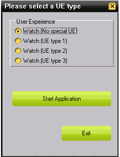
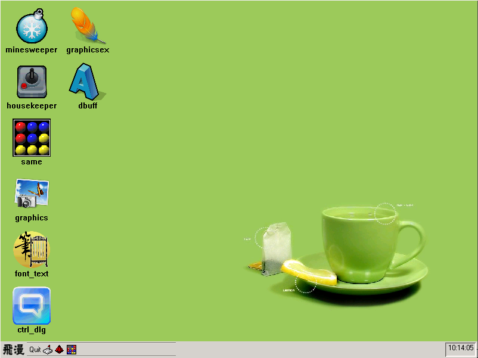

# 界面外观及特效

## 1 外观渲染器及窗口元素属性

MiniGUI 3.0 在窗口以及控件的外观绘制的实现上，采用了与以前的版本完全不同的实现机制。以前的版本在编译前就必须进行编译配置，选定界面风格，而且只能在 `fashion`、`classic` 和 `flat` 三种风格之间选择其一。MiniGUI 3.0 采用外观渲染器技术实现窗口以及控件外观的绘制。MiniGUI 为应用程序准备了四种渲染器，在实际应用时，择其一便可。渲染器技术的优点在于，可以通过 MiniGUI 配置文件来修改界面外观，也可以通过函数接口来控制界面外观。应用程序甚至可以定制自己的渲染器，这就为应用程序根据实际应用环境灵活定制自己的界面提供了极大的方便。渲染器的实现分为以下两个部分：

- 窗口元素的属性，包括窗口元素的颜色、尺寸、字体等信息；
- 窗口元素的渲染方法，定义如何绘制窗口元素。

MiniGUI 渲染器对窗口以及控件的各个部分进行了属性划分，然后使用绘制接口定义如何进行绘制，形成完整的一套外观渲染器机制。MiniGUI 3.0 提供了四种渲染器：`classic`、`flat`、`fashion`、`SKIN`。`classic` 是默认渲染器，即 MiniGUI 初始化时，默认采用 `classic` 渲染器来绘制窗口和控件。`fashion` 渲染器需要组件 `mGPlus` 的支持，MiniGUI 本身不提供对 `fashion` 渲染器的支持。

应用程序可以选择为某个窗口使用特定的渲染器，并定义窗口元素的外观属性信息。 应用程序也可以定义自己的渲染器来绘制界面。

### 1.1 窗口元素属性

参照 Windows XP/Windows 2000， MiniGUI 对窗口元素进行了如下的划分：

__表 1__ 窗口元素划分以及他们在配置文件和代码里的名称

| 在配置文件中的名称	| 代码名称	| 说明 |
|:----------------- |:---------|:----|
|caption   |WE_METRICS_CAPTION     |窗口标题栏大小|
||WE_FONT_CAPTION|窗口标题栏字体|
|fgc_active_caption    |WE_FGC_ACTIVE_CAPTION|焦点状态窗口标题栏前景色|
|bgca_active_caption   |WE_BGCA_ACTIVE_CAPTION|焦点状态窗口标题栏背景色渐变起始色|
|bgcb_active_caption   |WE_BGCB_ACTIVE_CAPTION|焦点状态窗口标题栏背景色渐变终止色|
|fgc_inactive_caption    |WE_FGC_INACTIVE_CAPTION|非焦点状态窗口标题栏前景色|
|bgca_inactive_caption   |WE_BGCA_INACTIVE_CAPTION|非焦点状态窗口标题栏背景色渐变起始色|
|bgcb_inactive_caption   |WE_BGCB_INACTIVE_CAPTION|非焦点状态窗口标题栏背景色渐变终止色|
|menu   |WE_METRICS_MENU|菜单项、菜单栏的高度|
||WE_FONT_MENU|菜单字体|
|fgc_menu   |WE_FGC_MENU|菜单前景色|
|bgc_menu   |WE_BGC_MENU|菜单背景色|
|border   |WE_METRICS_WND_BORDER|窗口边框宽度|
|fgc_active_border  |WE_FGC_ACTIVE_WND_BORDER|焦点状态窗口边框颜色|
|fgc_inactive_border   |WE_FGC_INACTIVE_WND_BORDER|非焦点状态窗口边框颜色|
|scrollbar   |WE_METRICS_SCROLLBAR|滚动条大小|
|fgc_msgbox  |WE_FGC_MESSAGEBOX|消息框前景色|
||WE_FONT_MESSAGEBOX|消息框字体|
|fgc_tip   |WE_FGC_TOOLTIP|提示框前景色|
|bgc_tip   |WE_BGC_TOOLTIP|提示框背景色|
||WE_FONT_TOOLTIP|提示框字体|
|fgc_window   |WE_FGC_WINDOW|窗口前景色|
|bgc_window  |WE_BGC_WINDOW|窗口背景色|
|fgc_3dbox   |WE_FGC_THREED_BODY|三维立体框表面上符号的颜色，如对勾、箭头等的颜色。|
|mainc_3dbox   |WE_MAINC_THREED_BODY|三维立体框边框及表面颜色|
|fgc_selected_item   |WE_FGC_SELECTED_ITEM|选定菜单项（列表项）的前景色|
|bgc_selected_item   |WE_BGC_SELECTED_ITEM|选定菜单项（列表项）的背景色|
|bgc_selected_lostfocus   |WE_BGC_SELECTED_LOSTFOCUS|选定菜单项（列表项）失去焦点后的背景色|
|fgc_disabled_item   |WE_FGC_DISABLED_ITEM|无效菜单项（列表项）的前景色|
|bgc_disabled_item  |WE_BGC_DISABLED_ITEM|无效菜单项（列表项）的背景色|
|fgc_hilight_item  |WE_FGC_HIGHLIGHT_ITEM|高亮菜单项（列表项）的前景色|
|bgc_hilight_item   |WE_BGC_HIGHLIGHT_ITEM|高亮菜单项（列表项）的背景色|
|fgc_significant_item   |WE_FGC_SIGNIFICANT_ITEM|重要菜单项（列表项）的前景色|
|bgc_significant_item  |WE_BGC_SIGNIFICANT_ITEM|重要菜单项（列表项）的背景色|
|bgc_desktop   |WE_BGC_DESKTOP|桌面背景色|


上表对窗口的组成元素都一一进行了介绍。窗口元素在配置文件中的名称，表示是这个元素在 MiniGUI 配置文件 `MiniGUI.cfg` 中的名称。可以在程序运行前修改这个配置文件中的窗口元素的属性值，以改变运行时窗口的外观。窗口元素的代码名称，是在使用函数接口修改窗口元素的属性值时用来指定窗口元素的。

### 1.2 皮肤渲染器的窗口皮肤属性

为了用渲染器替换原先 `MGExt` 库中的 `SKIN` 相关接口，我们使用了皮肤渲染器。皮肤渲染器除了拥有其他渲染器拥有的窗口属性外，它还拥有窗口皮肤属性。下表是对窗口皮肤属性的详细说明：

__表 2__ 窗口皮肤属性以及他们在配置文件和代码里的名称

| 在配置文件中的名称 | 代码名称 | 说明 |
|:----------------|:-------|:----|
|skin_bkgnd   |WE_LFSKIN_WND_BKGND|桌面背景皮肤图片|
|skin_caption   |WE_LFSKIN_CAPTION|窗口标题栏皮肤图片|
|skin_caption_btn   |WE_LFSKIN_CAPTION_BTN|窗口标题栏按钮皮肤图片|
|skin_scrollbar_hshaft   |WE_LFSKIN_SCROLLBAR_HSHAFT|水平滚动条滚槽皮肤图片|
|skin_scrollbar_vshaft  |WE_LFSKIN_SCROLLBAR_VSHAFT|垂直滚动条滚槽皮肤图片|
|skin_scrollbar_hthumb  |WE_LFSKIN_SCROLLBAR_HTHUMB|水平滚动条游标皮肤图片|
|skin_scrollbar_vthumb  |WE_LFSKIN_SCROLLBAR_VTHUMB|垂直滚动条游标皮肤图片|
|skin_scrollbar_arrows   |WE_LFSKIN_SCROLLBAR_ARROWS|滚动条箭头皮肤图片|
|skin_tborder   |WE_LFSKIN_BORDER_TOP|顶部边框皮肤图片|
|skin_bborder  |WE_LFSKIN_BORDER_BOTTOM|底部边框皮肤图片|
|skin_lborder   |WE_LFSKIN_BORDER_LEFT|左边边框皮肤图片|
|skin_rborder   |WE_LFSKIN_BORDER_RIGHT|右边边框皮肤图片|
|skin_arrows   |WE_LFSKIN_ARROWS|箭头皮肤图片|
|skin_arrows_shell   |WE_LFSKIN_ARROWS_SHELL|肩头外围皮肤图片|
|skin_pushbtn  |WE_LFSKIN_PUSHBUTTON|PUSH按钮皮肤图片|
|skin_radiobtn   |WE_LFSKIN_RADIOBUTTON|单选按钮皮肤图片|
|skin_checkbtn   |WE_LFSKIN_CHECKBUTTON|复选按钮皮肤图片|
|skin_tree  |WE_LFSKIN_TREE|树控件皮肤图片|
|skin_header   |WE_LFSKIN_HEADER|表头皮肤图片|
|skin_tab   |WE_LFSKIN_TAB|属性页皮肤图片|
|skin_tbslider_h  |WE_LFSKIN_TBSLIDER_H|水平滑动条皮肤图片|
|skin_tbslider_v  |WE_LFSKIN_TBSLIDER_V|垂直滑动条皮肤图片|
|skin_trackbar_horz   |WE_LFSKIN_TRACKBAR_HORZ|水平轨迹条皮肤图片|
|skin_trackbar_vert   |WE_LFSKIN_TRACKBAR_VERT|垂直轨迹条皮肤图片|
|skin_progressbar_htrack   |WE_LFSKIN_PROGRESS_HTRACKBAR|水平进度条滑轨皮肤图片|
|skin_progressbar_vtrack   |WE_LFSKIN_PROGRESS_VTRACKBAR|垂直进度条滑轨皮肤图片|
|skin_progressbar_hchunk  |WE_LFSKIN_PROGRESS_HCHUNK|水平进度条滑块皮肤图片|
|skin_progressbar_vchunk  |WE_LFSKIN_PROGRESS_VCHUNK|垂直进度条滑块皮肤图片|

### 1.3 窗口属性操作函数

对窗口属性值的修改可以在程序执行前，通过修改 MiniGUI 配置文件来实现对窗口外观的控制。也可以通过函数接口，在程序里面对窗口外观进行定制。 为了方便对窗口属性的操作，MiniGUI 定义了下面的函数接口，来实现对窗口属性的操作。

```c
MG_EXPORT DWORD GUIAPI GetWindowElementAttr (HWND hwnd, int we_attr_id);

MG_EXPORT DWORD GUIAPI SetWindowElementAttr (HWND hwnd, int we_attr_id,
DWORD we_attr);

MG_EXPORT gal_pixel GUIAPI GetWindowElementPixelEx (HWND hwnd,
HDC hdc, int we_attr_id);

MG_EXPORT BOOL GUIAPI SetWindowElementRenderer (HWND hWnd,
const char* werdr_name, const WINDOW_ELEMENT_ATTR* we_attrs);
```

上面所有函数里面的 `we_attr_id` 都是指窗口元素属性 `id`。这个`id`值必须是表 1 和表 2 中的代码名称。
函数 `GetWindowElementAttr` 用于获取指定窗口的某个元素属性的属性值。`hWnd` 是窗口句柄，`we_attr_id` 是窗口元素属性 `id`。 下面的代码是获取三维物体边框及表面颜色。

```c
DWORD main_c;

main_c = GetWindowElementAttr (hwnd, WE_MAINC_THREED_BODY);
```

函数 `SetWindowElementAttr` 用于设置窗口的某个元素属性的属性值。`hWnd` 是窗口句柄，`we_attr_id` 是窗口元素属性 `id`，`we_attr` 是属性值。 下面的代码首先获取菜单的最小高度，然后再与窗口的菜单高度比较，如果大于窗口的菜单高度，则最小高度设置为窗口菜单高度。

```c
int menu_height_min;

/** expect menu size of renderer*/
int menu_height_expect;

font_size = ((PLOGFONT)GetWindowElementAttr (hwnd, WE_FONT_MENU))->size;
menu_height_min = font_size + (LFRDR_MENUITEMOFFY_MIN << 1);
menu_height_expect = GetWindowElementAttr (hwnd, WE_METRICS_MENU);

/** reset menu height */
if (menu_height_expect < menu_height_min) {
        SetWindowElementAttr (hwnd, WE_METRICS_MENU, menu_height_min);
}
```

函数 `GetWindowElementPixelEx` 用于获取窗口元素的颜色值。`hWnd` 是窗口句柄，`hdc` 是DC句柄, `we_attr_id` 是窗口元素属性`id`。 下面的代码获取窗口标题栏背景色渐变起始颜色。

```c
gal_pixel active_color;

active_color = GetWindowElementPixelEx(hWnd, hdc, WE_BGCA_ACTIVE_CAPTION);
```

函数 `SetWindowElementRenderer` 用于设置当前窗口的渲染器，并修改窗口的相关属性。`hWnd` 是窗口句柄，`werdr_name` 为所要设置的渲染器的名字，`we_attrs` 是修改的窗口属性的结构体数组。数组的最后一个元素，其窗口元素 `id` 为 -1，表示结尾。`WINDOW_ELEMENT_ATTR` 结构体构成如下：

```c
typedef struct _WINDOW_ELEMENT_ATTR {
        /** The attribute identifier. */
        int we_attr_id;
        /** The attribute value. */
        DWORD we_attr;
} WINDOW_ELEMENT_ATTR;
```

结构体的第一个成员为需要改变的窗口元素属性 `id`，第二个成员为需要的属性值。

下面的代码是要将当前窗口的渲染器设置成 `flat`，并修改一些窗口的属性。

```c
WINDOW_ELEMENT_ATTR my_we_attrs [] = {
        {FGC_WINDOW, 0x00FFFFFF},
        {MWM_BORDER, 2},
        {SYSLOGFONT_CAPTION, (DWORD)my_caption_font},
        {-1, 0}
        
        SetWindowElementRenderer (hWnd, "flat", my_we_atts);
};
```

### 1.4 渲染器管理

前面说过渲染器是由窗口元素属性和与之配套的渲染方法组成。窗口属性及其相关的函数接口都已经介绍过了，现在来介绍渲染方法以及渲染器的使用。渲染器所使用的结构体名称叫 `WINDOW_ELEMENT_RENDERER` ，它是由渲染器名称、渲染方法接口指针以及相关的窗口属性组成。

```c
typedef struct _WINDOW_ELEMENT_RENDERER {
        const char name[LEN_RENDERER_NAME+1];
        int (*init) (PWERENDERER renderer);
        int (*deinit) (PWERENDERER renderer);
        DWORD (*calc_3dbox_color) (DWORD color, int flag);
        void (*draw_3dbox) (HDC hdc, const RECT* pRect, DWORD color, DWORD flag);
        void (*draw_radio) (HDC hdc, const RECT* pRect, DWORD color, int status);
        void (*draw_checkbox) (HDC hdc, const RECT* pRect, DWORD color,
        int status);
        void (*draw_checkmark) (HDC hdc, const RECT* pRect, DWORD color,
        int status);
        void (*draw_arrow) (HWND hWnd, HDC hdc, const RECT* pRect, DWORD color, int status);
        void (*draw_fold) (HWND hWnd, HDC hdc, const RECT* pRect, DWORD color,
        int status, int next);
        void (*draw_focus_frame) (HDC hdc, const RECT *pRect, DWORD color);
        void (*draw_normal_item) (HWND hWnd, HDC hdc, const RECT* pRect,
        DWORD color);
        void (*draw_hilite_item) (HWND hWnd, HDC hdc, const RECT* pRect,
        DWORD color);
        void (*draw_disabled_item) (HWND hWnd, HDC hdc, const RECT* pRect,
        DWORD color);
        void (*draw_significant_item) (HWND hWnd, HDC hdc, const RECT* pRect,
        DWORD color);
        void (*draw_push_button) (HWND hWnd, HDC hdc, const RECT* pRect,
        DWORD color1, DWORD color2, int status);
        void (*draw_radio_button) (HWND hWnd, HDC hdc, const RECT* pRect, int status);
        void (*draw_check_button) (HWND hWnd, HDC hdc, const RECT* pRect, int status);
        void (*draw_border) (HWND hWnd, HDC hdc, BOOL is_active);
        void (*draw_caption) (HWND hWnd, HDC hdc, BOOL is_active);
        void (*draw_caption_button) (HWND hwnd, HDC hdc, int ht_code, int state);
        void (*draw_scrollbar) (HWND hWnd, HDC hdc, int sb_pos);
        void (*calc_trackbar_rect) (HWND hWnd, LFRDR_TRACKBARINFO *info,
        DWORD dwStyle, const RECT* rcClient, RECT* rcRuler,
        RECT* rcBar, RECT* rcBorder);
        void (*draw_trackbar) (HWND hWnd, HDC hdc, LFRDR_TRACKBARINFO *info);
        int (*calc_we_area) (HWND hWnd, int which, RECT* we_area);
        int (*calc_we_metrics) (HWND hWnd,
        LFRDR_WINSTYLEINFO* style_info, int which);
        int (*hit_test) (HWND hWnd, int x, int y);
        int (*on_click_hotspot) (HWND hWnd, int which);
        void (*draw_custom_hotspot) (HWND hWnd, HDC hdc, int ht_code, int state);
        void (*calc_thumb_area) (HWND hWnd, BOOL vertical,
        LFSCROLLBARINFO* sb_info);
        void (*disabled_text_out) (HWND hWnd, HDC hdc, const char* spText,
        PRECT rc, DWORD dt_fmt);
        void (*draw_tab) (HWND hWnd, HDC hdc, RECT *rect, char *title,
        DWORD color, int flag, HICON icon);
        void (*draw_progress) (HWND hWnd, HDC hdc,
        int nMax, int nMin, int nPos, BOOL fVertical);
        void (*draw_header) (HWND hWnd, HDC hdc, const RECT* pRect, DWORD color);
        DWORD (*on_get_rdr_attr) (int we_attr_id);
        DWORD (*on_set_rdr_attr) (int we_attr_id, DWORD we_attr, BOOL change);
        void (*erase_background) (HWND hWnd, HDC hdc, const RECT *rect);
        void (*draw_normal_menu_item) (HWND hWnd, HDC hdc, const RECT* pRect,
        DWORD color);
        void (*draw_hilite_menu_item) (HWND hWnd, HDC hdc, const RECT* pRect,
        DWORD color);
        void (*draw_disabled_menu_item) (HWND hWnd, HDC hdc, const RECT* pRect,
        DWORD color);
        int we_metrics [WE_METRICS_NUMBER];
        DWORD we_colors [WE_COLORS_NUMBER][3];
        PLOGFONT we_fonts [WE_FONTS_NUMBER];
        HICON  we_icon [2][SYSICO_ITEM_NUMBER];
        unsigned int refcount;
        const void* private_info;
} WINDOW_ELEMENT_RENDERER;
```

下表是对结构体中各成员的一个解释说明。

__表 3__ 渲染器结构体成员说明

| 成员名称 | 说明 |
|:--------|:----|
|name|渲染器名称，长度为 LEN_RENDERER_NAME。宏 LEN_RENDERER_NAME 定义为15|
|init|渲染器初始化函数指针。用来初始化渲染器的基本信息，包括窗口元素的尺寸、字体、颜色等窗口属性信息和渲染器私有信息。|
|deinit|渲染器销毁函数指针。用来释放渲染器所占用的资源。|
|calc_3dbox_color|三维立体颜色计算函数指针。此函数根据三维立体边框和表面颜色 color 和计算标志 flag 获取一个颜色值。|
|draw_3dbox|三维立体框绘制函数指针。|
|draw_radio|单选框绘制函数指针。|
|draw_checkbox|非选中复选框绘制函数指针。|
|draw_checkmark|选中复选框绘制函数指针。|
|draw_arrow|箭头绘制函数指针。|
|draw_fold|打开的或者是关闭的文件夹、树控件的缩进、展开标志的绘制函数指针。|
|draw_focus_frame|焦点方框绘制函数指针。|
|draw_normal_item|正常状态的列表框子项的绘制函数指针。|
|draw_hilite_item|高亮状态的列表框子项的绘制函数指针。|
|draw_disabled_item|无效状态的列表框子项的绘制函数指针。|
|draw_significant_item|需重点标识的列表框子项的绘制函数指针。|
|draw_push_button|PUSH按钮绘制函数指针。|
|draw_radio_button|单选按钮绘制函数指针。|
|draw_check_button|复选框按钮绘制函数指针。|
|draw_border|窗口边框绘制函数指针。|
|draw_caption|窗口标题栏绘制函数指针。|
|draw_caption_button|窗口标题栏按钮绘制函数指针。标题栏按钮包括：最小化按钮、最大化按钮、关闭按钮|
|draw_scrollbar|滚动条绘制函数指针。|
|calc_trackbar_rect|轨迹条外框绘制函数指针。|
|draw_trackbar|轨迹条绘制函数指针。|
|calc_we_area|窗口各元素区域计算函数指针。元素区域包括边框、标题栏、标题栏按钮、工具栏、菜单、客户区、窗口水平滚动条和垂直滚动条。|
|calc_we_metrics|窗口各元素尺寸的计算函数指针。所包含的元素与 calc_we_area 函数所包含的元素相同。|
|hit_test|获取鼠标所点击的窗口元素的函数指针。|
|on_click_hotspot|当鼠标点击到热点区域时，进行相应处理的函数指针。|
|draw_custom_hotspot|热点区域的绘制函数指针。|
|calc_thumb_area|水平滚动条和垂直滚动条游标区域的计算函数指针。|
|disabled_text_out|无效区域文字的输出函数指针。|
|draw_tab|属性页控件标签的绘制函数指针。|
|draw_progress|进度条绘制函数。|
|draw_header|列表框或者网格控件的表头绘制函数指针。|
|on_get_rdr_attr|渲染器私有信息获取函数指针。|
|on_set_rdr_attr|渲染器私有信息设置函数指针。|
|erase_background|窗口背景擦除绘制函数指针。|
|draw_normal_menu_item|正常状态菜单项绘制函数指针。|
|draw_hilite_menu_item|高亮状态菜单项绘制函数指针。|
|draw_disabled_menu_item|无效状态菜单项绘制函数指针。|
|we_metrics|窗口尺寸属性|
|we_colors|窗口颜色属性|
|we_fonts|窗口字体属性|
|we_icon|窗口所使用的图标句柄|
|refcount|渲染器引用计数|
|private_info|渲染器私有信息指针|

MiniGUI 提供了如下的函数接口对渲染器进行管理：

- `GetWindowRendererFromName` 函数： 通过名称获取渲染器。下面是函数原型：

```c
MG_EXPORT const WINDOW_ELEMENT_RENDERER* GUIAPI GetWindowRendererFromName (const char* name);
```

- `AddWindowElementRenderer` 函数： 添加渲染器到 MiniGUI 。下面是函数原型：

```c
MG_EXPORT BOOL GUIAPI AddWindowElementRenderer (const char* name, const WINDOW_ELEMENT_RENDERER* we_rdr);
```

- `ReMoveWindowElementRenderer` 函数：从 MiniGUI 删除渲染器。下面是函数原型：

```c
MG_EXPORT BOOL GUIAPI RemoveWindowElementRenderer (const char* name);
```

- `GetDefaultWindowElementRenderer` 函数： 获取默认渲染器。 下面是函数原型：

```c
MG_EXPORT const WINDOW_ELEMENT_RENDERER* GUIAPI GetDefaultWindowElementRenderer (void);
```

- `SetDefaultWindowElementRenderer` 函数： 设置默认渲染器。 下面是函数原型：

```c
MG_EXPORT const char* GUIAPI SetDefaultWindowElementRenderer (const char* name);
```

- `SetWindowElementRenderer` 函数： 指定窗口渲染器。 下面是函数原型：

```c
MG_EXPORT BOOL GUIAPI SetWindowElementRenderer (HWND hWnd, const char* werdr_name, const WINDOW_ELEMENT_ATTR* we_attrs);
```

### 1.5 主窗口的创建

在采用渲染器对窗口进行绘制之后，主窗口的创建需要传入更多的参数，但是为了保证兼容性，MiniGUI 创建了一个新的主窗口创建函数 `CreateMainWindowEx` 并对老的的创建函数进行了封装。下面是函数原型。

```c
MG_EXPORT HWND GUIAPI CreateMainWindowEx (PMAINWINCREATE pCreateInfo,
const char* werdr_name, const WINDOW_ELEMENT_ATTR* we_attrs,
const char* window_name, const char* layer_name);

static inline HWND GUIAPI CreateMainWindow (PMAINWINCREATE pCreateInfo)
{
        return CreateMainWindowEx (pCreateInfo, NULL, NULL, NULL, NULL);
}
```

- `pCreateInfo` 主窗口结构体，这在“窗口与消息”一章已经有详细介绍了。
- `window_name` 和 `layer_name` 是保留参数给后续版本使用。
- `werdr_name` 表示要使用的窗口元素渲染器名称，为空时使用默认的窗口渲染器。
- `we_attrs` 指向窗口元素的外观属性表，为空时使用默认的窗口元素外观属性表。

### 1.6 控件的创建

和主窗口的创建类似，控件也引入了新的创建函数 `CreateWindowEx2` ，并对原来的创建函数 `CreateWindowEx` 进行了封装。

```c
MG_EXPORT HWND GUIAPI CreateWindowEx2 (const char* spClassName,
const char* spCaption, DWORD dwStyle, DWORD dwExStyle,
int id, int x, int y, int w, int h, HWND hParentWnd,
const char* werdr_name, const WINDOW_ELEMENT_ATTR* we_attrs,
DWORD dwAddData);

static inline HWND GUIAPI CreateWindowEx (const char* spClassName,
const char* spCaption, DWORD dwStyle, DWORD dwExStyle,
int id, int x, int y, int w, int h, HWND hParentWnd,
DWORD dwAddData)
{
        return CreateWindowEx2 (spClassName, spCaption, dwStyle, dwExStyle,
        id, x, y, w, h, hParentWnd, NULL, NULL, dwAddData);
}

#define CreateWindow(class_name, caption, style,        \
id, x, y, w, h, parent, add_data)       \
CreateWindowEx(class_name, caption, style, 0,   \
id, x, y, w, h, parent, add_data)
```

这些函数在“控件编程基础”一章已经有详细的说明，这里就不赘述了。

### 1.7 对话框的创建

- 模态对话框的创建

```c
MG_EXPORT int GUIAPI DialogBoxIndirectParamEx (PDLGTEMPLATE pDlgTemplate,
HWND hOwner, WNDPROC DlgProc, LPARAM lParam,
const char* werdr_name, WINDOW_ELEMENT_ATTR* we_attrs,
const char* window_name, const char* layer_name);

static inline int GUIAPI DialogBoxIndirectParam (PDLGTEMPLATE pDlgTemplate,
HWND hOwner, WNDPROC DlgProc, LPARAM lParam)
{
        return DialogBoxIndirectParamEx (pDlgTemplate, hOwner, DlgProc, lParam,
        NULL, NULL, NULL, NULL);
}
```

- 非模态对话框的创建

```c
MG_EXPORT HWND GUIAPI CreateMainWindowIndirectParamEx (PDLGTEMPLATE pDlgTemplate,
HWND hOwner, WNDPROC DlgProc, LPARAM lParam,
const char* werdr_name, WINDOW_ELEMENT_ATTR* we_attrs,
const char* window_name, const char* layer_name);

static inline HWND GUIAPI CreateMainWindowIndirectParam (PDLGTEMPLATE pDlgTemplate,
HWND hOwner, WNDPROC DlgProc, LPARAM lParam)
{
        return CreateMainWindowIndirectParamEx (pDlgTemplate, hOwner, DlgProc, lParam,
        NULL, NULL, NULL, NULL);
}
```

上面以 `Ex` 结尾的函数都是新增加的函数。这些函数的说明在“[对话框编程基础](MiniGUIProgGuidePart1Chapter03-zh.md)”一章已经有详细说明。

## 2 主窗口双缓冲区

主窗口双缓冲机制是 MiniGUI 提供的一种窗口绘制技术。在双缓冲机制下，主窗口在绘制时，首先是绘制到与主窗口 `DC` 相匹配的内存 `DC` 当中，进而对内存 `DC` 当中的数据运用各种算法进行运算，从而实现各种界面特效，比如：窗口推拉动画效果，卷帘效果，翻页效果等等。主窗口双缓冲机制的另一个作用就是能够提高窗口绘屏时的效率，解决主窗口在绘屏时的闪烁问题。

### 2.1 双缓冲窗口扩展风格

利用双缓冲窗口扩展风格可以在创建主窗口或者对话框时，使它们带有与窗口 `DC` 相匹配的内存 `DC`。双缓冲窗口扩展风格定义如下：

```c
#define WS_EX_AUTOSECONDARYDC     0x00001000L
```

下面的示例代码是在创建带有双缓冲区的主窗口

```c
HWND hMainWnd;
MAINWINCREATE CreateInfo;

CreateInfo.dwStyle = WS_NONE;
CreateInfo.dwExStyle = WS_EX_AUTOSECONDARYDC;
CreateInfo.spCaption = "Watch";
CreateInfo.hMenu = 0;
CreateInfo.hCursor = GetSystemCursor(0);
CreateInfo.hIcon = 0;
CreateInfo.MainWindowProc = WatchWinProc;
CreateInfo.lx = 0;
CreateInfo.ty = 0;
CreateInfo.rx = 240;
CreateInfo.by = 320;
CreateInfo.iBkColor = PIXEL_lightwhite;
CreateInfo.dwAddData = 0;
CreateInfo.hHosting = hosting;

hMainWnd = CreateMainWindow (&CreateInfo);
```

### 2.2 双缓冲区机制的相关函数

- 双缓冲区 DC 创建函数 `CreateSecondaryDC` ， 它将根据传入的窗口大小，创建兼容的内存 `DC` 并返回。

```c
MG_EXPORT HDC GUIAPI CreateSecondaryDC (HWND hwnd);
```
- 函数 `SetSecondaryDC` ，它将已经创建好的内存 DC 设置为目标主窗口的双缓冲区，并设置从双缓冲区的屏幕 DC 数据复制回调函数。

```c
typedef int (* ON_UPDATE_SecondaryDC)(HWND hwnd, HDC secondary_dc, HDC real_dc, cont RECT* update_rc, DWORD area_flags);

MG_EXPORT HDC GUIAPI SetSecondaryDC (HWND hwnd, HDC secondary_dc, ON_UPDATE_SECONDARYDC on_update_secondarydc);
```

在调用 `SetSecondaryDC` 函数时要注意以下几点：

- 如果主窗口具有 `WS_EX_AUTOSecondaryDC` 风格，则会取消该风格，并调用 `DeleteSecondaryDC` 函数删除已有的双缓冲区 ，并返回 `HDC_SCREEN`。
- 如果主窗口没有 `WS_EX_AUTOSecondaryDC` 风格，则返回原先的双缓冲区句柄。原先的双缓冲区由应用程序自行管理。
- 如果传入 `HDC_SCREEN`，将取消窗口的双缓冲机制。
- 如果调用该函数时，传递进入的 `ON_UPDATE_SecondaryDC` 回调函数为 `NULL`，则这时 MiniGUI 不会自动完成屏幕 `DC` 到屏幕的显示的绘制，用户需要使用基本的块拷贝函数完成双缓冲区到屏幕 `DC` 的复制；否则调用该回调函数由应用程序负责从双缓冲区到屏幕 `DC` 的复制，应用程序可在此时完成界面特效。

下面的示例代码，在设置了主窗口双缓冲区之后，将主窗口绘制到了双缓冲区上。

```c
HDC hdc;
hdc = GetSecondaryDC (hWnd);
SetSecondaryDC(hWnd, hdc, DoubleBufferProc);
UpdateAll (hWnd, TRUE);
SetSecondaryDC(hWnd, hdc, NULL);
```

- 双缓冲区句柄获取函数 `GetSecondaryDC` 。

```c
MG_EXPORT HDC GUIAPI GetSecondaryDC (HWND hwnd);
```

- `GetSecondaryClientDC` 函数。该函数用于双缓冲窗体的客户区绘制 `DC`，如果窗体不支持双缓冲，则直接返回一般的客户区 `DC`，相当于调用 `GetClientDC` 。

```c
MG_EXPORT HDC GUIAPI GetSecondaryClientDC (HWND hwnd);
```

- `ReleaseSecondaryDC` 函数。该函数用于释放双缓冲 `DC`, 如果是主窗体本身的双缓冲 `DC`，则什么也不处理；否则释该 `DC`。

```c
MG_EXPORT void GUIAPI ReleaseSecondaryDC (HWND hwnd, HDC hdc);
```
- `DeleteSecondaryDC` 函数。该函数删除由 `CreateSecondaryDC` 创建的内存 `DC`。

```c
static inline void GUIAPI DeleteSecondaryDC (HWND hwnd);
```

- `GetSecondarySubDC` 函数。该函数仅针对双缓冲，在私有窗口 `DC` 基础上创建子 `DC`，使之可以作为主窗口的客户 `DC`，或者控件的 `DC` 使用。具有 `WS_EX_SecondaryDC` 风格的主窗口及其控件，在绘制其非客户区时，或者 `BeginPaint` 函数的返回值，都应该使用 `GetSecondarySubDC` 函数来获取双缓冲区 `DC` 对应的子 `DC`。从而确保在该主窗口中的所有绘制都作用在双缓冲区 `DC` 上。

```c
HDC GUIAPI GetSecondarySubDC (HDC secondary_dc, HWND hwnd_main, HWND hwnd_child, BOOL client);
```

- `ReleaseSecondarySubDC` 函数。该函数释放私有 `DC` 的子 `DC`。

```c
void GUIAPI ReleaseSecondarySubDC (HDC secondary_subdc, HWND hwnd_child);
```

### 2.3 双缓冲区机制特效示例(淡入淡出特效、推拉特效和卷帘特效）

- 创建带有双缓冲区的主窗口，并在窗口创建之后，消息循环之前添加特效的代码

```c
MSG Msg;
HWND hMainWnd;
MAINWINCREATE CreateInfo;

CreateInfo.dwStyle = WS_NONE;
CreateInfo.dwExStyle = WS_EX_AUTOSECONDARYDC;
CreateInfo.spCaption = "Watch";
CreateInfo.hMenu = 0;
CreateInfo.hCursor = GetSystemCursor(0);
CreateInfo.hIcon = 0;
CreateInfo.MainWindowProc = WatchWinProc;
CreateInfo.lx = 0;
CreateInfo.ty = 0;
CreateInfo.rx = 240;
CreateInfo.by = 320;
CreateInfo.iBkColor = PIXEL_lightwhite;
CreateInfo.dwAddData = 0;
CreateInfo.hHosting = hosting;

hMainWnd = CreateMainWindow (&CreateInfo);

if (hMainWnd == HWND_INVALID)
return -1;

switch (ue_type) {
        MSG Msg;
        HWND hMainWnd;
        MAINWINCREATE CreateInfo;
        
        CreateInfo.dwStyle = WS_NONE;
        CreateInfo.dwExStyle = WS_EX_AUTOSECONDARYDC;
        CreateInfo.spCaption = "Watch";
        CreateInfo.hMenu = 0;
        CreateInfo.hCursor = GetSystemCursor(0);
        CreateInfo.hIcon = 0;
        CreateInfo.MainWindowProc = WatchWinProc;
        CreateInfo.lx = 0;
        CreateInfo.ty = 0;
        CreateInfo.rx = 240;
        CreateInfo.by = 320;
        CreateInfo.iBkColor = PIXEL_lightwhite;
        CreateInfo.dwAddData = 0;
        CreateInfo.hHosting = hosting;
        
        hMainWnd = CreateMainWindow (&CreateInfo);
        
        if (hMainWnd == HWND_INVALID)
        return -1;
        
        //添加特效代码
        switch (ue_type) {
                case 1:
                ue_1_start (hMainWnd); //淡入淡出特效
                break;
                case 2:
                ue_2_start (hMainWnd); //推拉特效
                break;
                case 3:
                ue_3_start (hMainWnd); //卷帘效果
                break;
                default:
                ShowWindow (hMainWnd, SW_SHOWNORMAL);
                break;
        }
        
        while (GetMessage (&Msg, hMainWnd)) {
                TranslateMessage (&Msg);
                DispatchMessage (&Msg);
        }
        
        MainWindowThreadCleanup (hMainWnd);
        
        return 0;
```

- 窗口创建时三种特效的代码

```c
//淡入淡出
static void ue_1_start (HWND hwnd)
{
        MSG msg;
        HDC sec_dc;
        
        sec_dc = GetSecondaryDC (hwnd);
        SetSecondaryDC (hwnd, sec_dc, ON_UPDSECDC_DONOTHING);
        ShowWindow (hwnd, SW_SHOWNORMAL);
        
        /* wait for MSG_IDLE */
        while (GetMessage (&msg, hwnd)) {
                if (msg.message == MSG_IDLE)
                break;
                DispatchMessage (&msg);
        }
        
        SetMemDCAlpha (sec_dc, MEMDC_FLAG_SRCALPHA, 64);
        BitBlt (sec_dc, 0, 0, 240, 320, HDC_SCREEN, 0, 0, 0);
        usleep (100000);
        
        SetMemDCAlpha (sec_dc, MEMDC_FLAG_SRCALPHA, 128);
        BitBlt (sec_dc, 0, 0, 240, 320, HDC_SCREEN, 0, 0, 0);
        usleep (100000);
        
        SetMemDCAlpha (sec_dc, 0, 0);
        BitBlt (sec_dc, 0, 0, 240, 320, HDC_SCREEN, 0, 0, 0);
        
        /* restore to default behavior */
        SetSecondaryDC (hwnd, sec_dc, ON_UPDSECDC_DEFAULT);
}

//推拉特效
static void ue_2_start (HWND hwnd)
{
        MSG msg;
        HWND hosting;
        HDC sec_dc_active, sec_dc_hosting;
        
        /* disable output of the hosting and the active main windows */
        hosting = GetHosting (hwnd);
        sec_dc_hosting = GetSecondaryDC (hosting);
        SetSecondaryDC (hosting, sec_dc_hosting, ON_UPDSECDC_DONOTHING);
        
        sec_dc_active = GetSecondaryDC (hwnd);
        SetSecondaryDC (hwnd, sec_dc_active, ON_UPDSECDC_DONOTHING);
        
        /* get the content of the active main window */
        ShowWindow (hwnd, SW_SHOWNORMAL);
        /* wait for MSG_IDLE */
        while (GetMessage (&msg, hwnd)) {
                if (msg.message == MSG_IDLE)
                break;
                DispatchMessage (&msg);
        }
        
        /* push and poll */
        BitBlt (sec_dc_hosting, 0, 0, 240, 320, HDC_SCREEN, -60, 0, 0);
        BitBlt (sec_dc_active, 0, 0, 60, 320, HDC_SCREEN, 240-60, 0, 0);
        usleep (100000);
        
        BitBlt (sec_dc_hosting, 0, 0, 240, 320, HDC_SCREEN, -120, 0, 0);
        BitBlt (sec_dc_active, 0, 0, 120, 320, HDC_SCREEN, 240-120, 0, 0);
        usleep (100000);
        
        BitBlt (sec_dc_active, 0, 0, 240, 320, HDC_SCREEN, 0, 0, 0);
        
        /* restore to default behavior */
        SetSecondaryDC (hwnd, sec_dc_active, ON_UPDSECDC_DEFAULT);
        SetSecondaryDC (hosting, sec_dc_hosting, ON_UPDSECDC_DEFAULT);
}

//卷帘特效
static void ue_3_start (HWND hwnd)
{
        MSG msg;
        HWND hosting;
        HDC sec_dc_active, sec_dc_hosting;
        
        /* disable output of the hosting and the active main windows */
        hosting = GetHosting (hwnd);
        sec_dc_hosting = GetSecondaryDC (hosting);
        SetSecondaryDC (hosting, sec_dc_hosting, ON_UPDSECDC_DONOTHING);
        
        sec_dc_active = GetSecondaryDC (hwnd);
        SetSecondaryDC (hwnd, sec_dc_active, ON_UPDSECDC_DONOTHING);
        
        /* get the content of the active main window */
        ShowWindow (hwnd, SW_SHOWNORMAL);
        /* wait for MSG_IDLE */
        while (GetMessage (&msg, hwnd)) {
                if (msg.message == MSG_IDLE)
                break;
                DispatchMessage (&msg);
        }
        
        BitBlt (sec_dc_hosting, 30, 0, 120-30, 320, HDC_SCREEN, 0, 0, 0);
        BitBlt (sec_dc_hosting, 120, 0, 120-30, 320, HDC_SCREEN, 120+30, 0, 0);
        BitBlt (sec_dc_active, 120-30, 0, 30+30, 320, HDC_SCREEN, 120-30, 0, 0);
        usleep (100000);
        
        BitBlt (sec_dc_hosting, 60, 0, 120-60, 320, HDC_SCREEN, 0, 0, 0);
        BitBlt (sec_dc_hosting, 120, 0, 120-60, 320, HDC_SCREEN, 120+60, 0, 0);
        BitBlt (sec_dc_active, 120-60, 0, 60+60, 320, HDC_SCREEN, 120-60, 0, 0);
        usleep (100000);
        
        BitBlt (sec_dc_active, 0, 0, 240, 320, HDC_SCREEN, 0, 0, 0);
        
        /* restore to default behavior */
        SetSecondaryDC (hwnd, sec_dc_active, ON_UPDSECDC_DEFAULT);
}
```

- 在窗口关闭消息中调关闭的特效的代码

```c
......
case MSG_CLOSE:
......

switch (_ue_type) {
        case 1:
        ue_1_term (hWnd);
        break;
        case 2:
        ue_2_term (hWnd);
        break;
        case 3:
        ue_3_term (hWnd);
        break;
}
DestroyMainWindow (hWnd);
return 0;
......
```

- 窗口关闭时三种特效代码

```c
//淡入淡出
static void ue_1_term (HWND hwnd)
{
        HWND hosting;
        HDC sec_dc_active, sec_dc_hosting;
        
        hosting = GetHosting (hwnd);
        sec_dc_active = GetSecondaryDC (hwnd);
        SetSecondaryDC (hwnd, sec_dc_active, ON_UPDSECDC_DONOTHING);
        
        sec_dc_hosting = GetSecondaryDC (hosting);
        SetSecondaryDC (hosting, sec_dc_hosting, ON_UPDSECDC_DONOTHING);
        
        SetMemDCAlpha (sec_dc_hosting, MEMDC_FLAG_SRCALPHA, 64);
        BitBlt (sec_dc_hosting, 0, 0, 240, 320, HDC_SCREEN, 0, 0, 0);
        usleep (100000);
        
        SetMemDCAlpha (sec_dc_hosting, MEMDC_FLAG_SRCALPHA, 128);
        BitBlt (sec_dc_hosting, 0, 0, 240, 320, HDC_SCREEN, 0, 0, 0);
        usleep (100000);
        
        SetMemDCAlpha (sec_dc_hosting, 0, 0);
        BitBlt (sec_dc_hosting, 0, 0, 240, 320, HDC_SCREEN, 0, 0, 0);
        
        /* restore to default behavior */
        SetSecondaryDC (hosting, sec_dc_hosting, ON_UPDSECDC_DEFAULT);
}

//推拉特效
static void ue_2_term (HWND hwnd)
{
        HWND hosting;
        HDC sec_dc_active, sec_dc_hosting;
        
        sec_dc_active = GetSecondaryDC (hwnd);
        SetSecondaryDC (hwnd, sec_dc_active, ON_UPDSECDC_DONOTHING);
        
        hosting = GetHosting (hwnd);
        sec_dc_hosting = GetSecondaryDC (hosting);
        SetSecondaryDC (hosting, sec_dc_hosting, ON_UPDSECDC_DONOTHING);
        
        /* push and poll */
        BitBlt (sec_dc_hosting, 240-60, 0, 60, 320, HDC_SCREEN, 0, 0, 0);
        BitBlt (sec_dc_active, 0, 0, 240-60, 320, HDC_SCREEN, 60, 0, 0);
        usleep (100000);
        
        BitBlt (sec_dc_hosting, 240-120, 0, 120, 320, HDC_SCREEN, 0, 0, 0);
        BitBlt (sec_dc_active, 0, 0, 120, 320, HDC_SCREEN, 120, 0, 0);
        usleep (100000);
        
        BitBlt (sec_dc_hosting, 0, 0, 240, 320, HDC_SCREEN, 0, 0, 0);
        
        /* restore to default behavior */
        SetSecondaryDC (hosting, sec_dc_hosting, ON_UPDSECDC_DEFAULT);
}

//卷帘特效
static void ue_3_term (HWND hwnd)
{
        HWND hosting;
        HDC sec_dc_active, sec_dc_hosting;
        
        sec_dc_active = GetSecondaryDC (hwnd);
        SetSecondaryDC (hwnd, sec_dc_active, ON_UPDSECDC_DONOTHING);
        
        hosting = GetHosting (hwnd);
        sec_dc_hosting = GetSecondaryDC (hosting);
        SetSecondaryDC (hosting, sec_dc_hosting, ON_UPDSECDC_DONOTHING);
        
        BitBlt (sec_dc_hosting, 60, 0, 120-60, 320, HDC_SCREEN, 0, 0, 0);
        BitBlt (sec_dc_hosting, 120, 0, 120-60, 320, HDC_SCREEN, 120+60, 0, 0);
        BitBlt (sec_dc_active, 120-60, 0, 60+60, 320, HDC_SCREEN, 120-60, 0, 0);
        usleep (100000);
        
        BitBlt (sec_dc_hosting, 30, 0, 120-30, 320, HDC_SCREEN, 0, 0, 0);
        BitBlt (sec_dc_hosting, 120, 0, 120-30, 320, HDC_SCREEN, 120+30, 0, 0);
        BitBlt (sec_dc_active, 120-30, 0, 30+30, 320, HDC_SCREEN, 120-30, 0, 0);
        usleep (100000);
        
        BitBlt (sec_dc_hosting, 0, 0, 240, 320, HDC_SCREEN, 0, 0, 0);
        
        /* restore to default behavior */
        SetSecondaryDC (hosting, sec_dc_hosting, ON_UPDSECDC_DEFAULT);
}
```

- 三种特效的效果图



__图 1__ 主窗口双缓冲的特效图

## 3 桌面定制

MiniGUI 以回调函数的形式提供了一套桌面窗口定制接口。通过这套接口，应用程序可以控制桌面窗口对各种消息的响应，实现一个类似 Windows 桌面这样的桌面窗口。

### 3.1 桌面定制结构体

```c
typedef struct _DESKTOPOPS {
        
        /** called when starting a new session, and return a context */
        void* (*init) (void);
        
        /** called when terminating a seesion */
        void (*deinit) (void* context);
        
        /** called when the desktop should be repainted */
        void (*paint_desktop) (void* context,
        HDC dc_desktop, const RECT* inv_rc);
        
        /** the keyboard event handler for the desktop */
        void (*keyboard_handler) (void* context,
        int message, WPARAM wParam, LPARAM lParam);
        
        /** the mouse event handler for the desktop */
        void (*mouse_handler) (void* context,
        int message, WPARAM wParam, LPARAM lParam);
        
        /** the desktop menu customizer */
        void (*customize_desktop_menu) (void* context,
        HMENU hmenu, int start_pos);
        
        /** the desktop menu command handler */
        void (*desktop_menucmd_handler) (void* context, int id);
} DESKTOPOPS;
```

结构体每个成员的说明如下：

- `init` : 初始化操作集的函数,返回 `context`;
- `deinit` : 销毁操作集的函数;
- `paint_desktop` : `desktop` 的重绘函数;
- `keyboard_handler` : 键盘事件处理函数;能处理的键盘消息有：
   - `MSG_DT_KEYDOWN`
   - `MSG_DT_KEYUP`
   - `MSG_DT_KEYLONGPRESS:`
   - `MSG_DT_KEYALWAYSPRESS:`
   - `MSG_DT_CHAR:`
   - `MSG_DT_SYSKEYDOWN:`
   - `MSG_DT_SYSCHAR:`
   - `MSG_DT_SYSKEYUP`

- `mouse_handler` : 鼠标事件处理函数;能处理的鼠标事件有：

   - `MSG_DT_LBUTTONDOWN`
   - `MSG_DT_LBUTTONUP`
   - `MSG_DT_LBUTTONDBLCLK`
   - `MSG_DT_MOUSEMOVE`
   - `MSG_DT_RBUTTONDOWN`
   - `MSG_DT_RBUTTONDBLCLK`
   - `MSG_DT_RBUTTONUP`

- `customize_desktop_menu` : 用户自定义的弹出式菜单构造函数;
- `desktop_menucmd_handler` : 弹出式菜单的响应函数。

### 3.2 相关函数

- 定制接口设置函数：

```c
/* Set a new desktop operation set, and return the old one */
DESKTOPS* SetCustomDesktopOperationSet (DESKTOPOPS* dsk_ops);
```

此函数用来设置已经赋值好的桌面定制结构体。其后，桌面窗口将调用设置的函数接口对消息进行处理。

- 桌面窗口刷新函数：

```c
void DesktopUpdateAllWindow (void);
```

此函数刷新桌面上的全部窗口。方便应用程序实现对说面上所有窗口的重绘工作。

### 3.3 编程实例

本编程示例摘自本指南示例代码包 `mg-samples` 里面的 `mginit` 目录中的。限于篇幅，此处只摘录关键部分代码。 桌面定制接口回调函数定义在 `desktop.c` 文件里面：

```c
DESKTOPOPS mg_dsk_ops =
{
        this_init,
        this_deinit,
        this_paint_desktop,
        this_keyboard_handler,
        this_mouse_handler, 
        this_customize_desktop_menu,
        this_desktop_menucmd_handler,
};
```

桌面定制接口回调函数具体如下：

```c
static void free_dsp_app (void)
{
        int i;
        DSPITEM* item;
        
        item = icon_info.app_items;
        for (i = 0; i < icon_info.nr_apps; i++, item++) {
                if (item->bmp.bmBits) {
                        UnloadBitmap (&item->bmp);
                        item->bmp.bmBits = NULL;
                }
        }
        
        free (icon_info.app_items);
        icon_info.app_items = NULL;
}

static BOOL get_dsp_app (void)
{
        int i;
        DSPITEM* item;
        char section [10];
        int distance_x = START_X;
        int distance_y = START_Y;
        SIZE size;
        
        if (GetIntValueFromEtcFile (APP_INFO_FILE, "desktop", "app_nr", &icon_info.nr_apps) != ETC_OK)
        return FALSE;
        
        if (icon_info.nr_apps <= 0)
        return FALSE;
        
        if (GetValueFromEtcFile (APP_INFO_FILE, "desktop", "bg_pic", icon_info.bg_path, PATH_MAX) != ETC_OK)
        return FALSE;
        
        if ((icon_info.app_items = (DSPITEM*)calloc (icon_info.nr_apps, sizeof (DSPITEM))) == NULL) {
                return FALSE;
        }
        item = icon_info.app_items;
        for (i = 0; i < icon_info.nr_apps; i++, item++) {
                sprintf (section, "dsp-app%d", i);
                if (GetValueFromEtcFile (APP_INFO_FILE, section, "path", item->path, PATH_MAX) != ETC_OK)
                goto error;
                
                if (GetValueFromEtcFile (APP_INFO_FILE, section, "name", item->name, NAME_MAX) != ETC_OK)
                goto error;
                
                if (GetValueFromEtcFile (APP_INFO_FILE, section, "layer", item->layer, LEN_LAYER_NAME) != ETC_OK)
                goto error;
                
                if (GetValueFromEtcFile (APP_INFO_FILE, section, "pictrue", item->bmp_path, PATH_MAX + NAME_MAX) != ETC_OK
                )
                goto error;
                
                if (LoadBitmap (HDC_SCREEN, &item->bmp, item->bmp_path) != ERR_BMP_OK) {
                        fprintf (stderr, "desktop load resource:%s error. \n", item->bmp_path);
                        goto error;
                }
                
                item->cdpath = TRUE;
                
                item->hot_spot_rc.left   = distance_x;
                item->hot_spot_rc.right  = item->hot_spot_rc.left + DEF_WIDTH;
                item->hot_spot_rc.top    = distance_y;
                item->hot_spot_rc.bottom = item->hot_spot_rc.top + DEF_HEIGHT;
                
                GetTextExtent(HDC_SCREEN, item->name, -1, &size);
                
                item->text_rc.top     = item->hot_spot_rc.bottom;
                item->text_rc.left    = (item->hot_spot_rc.right + item->hot_spot_rc.left - size.cx)/2;
                item->text_rc.bottom  = item->text_rc.top + size.cy;
                item->text_rc.right   = item->text_rc.left + size.cx;
                
                distance_y += SPACE + RECTH(item->hot_spot_rc);
                if(distance_y + DEF_HEIGHT >= g_rcDesktop.bottom)
                {
                        distance_y = START_Y;
                        distance_x += SPACE + DEF_WIDTH;
                }	
        }
        return TRUE;
        error:
        free_dsp_app ();
        return FALSE;
}

static HMENU create_icon_menu (void)
{
        HMENU hmnu;
        MENUITEMINFO mii;
        
        memset (&mii, 0, sizeof(MENUITEMINFO));
        mii.type        = MFT_STRING;
        mii.id          = 0;
        mii.typedata    = (DWORD)MGDT_ST_ICONMENU;
        hmnu = CreatePopupMenu (&mii);
        
        memset (&mii, 0, sizeof(MENUITEMINFO));
        mii.type        = MFT_STRING ;
        mii.state       = 0;
        mii.id          = ID_OP;
        mii.typedata    = (DWORD)MGDT_ST_OPEN;
        InsertMenuItem(hmnu, 2, TRUE, &mii);
        
        memset (&mii, 0, sizeof(MENUITEMINFO));
        mii.type        = MFT_STRING ;
        mii.state       = 0;
        mii.id          = ID_AB;
        mii.typedata    = (DWORD)MGDT_ST_ABOUT;
        InsertMenuItem(hmnu, 3, TRUE, &mii);
        
        return hmnu;
}

//在初始化中读取桌面的相关资源，并创建图片菜单
static void* this_init(void)
{
        Context *con = malloc(sizeof(Context));
        
        get_dsp_app ();
        icon_info.focus = 0xFFFF;
        
        if(0 != strcmp(icon_info.bg_path, ""))
        {
                con->bg = (PBITMAP)malloc(sizeof(BITMAP));
                LoadBitmapFromFile(HDC_SCREEN, con->bg, icon_info.bg_path);
        }
        else
        con->bg = NULL; 
        
        con->icon_menu = create_icon_menu();   
        
        return (void *)con;
        
}

//释放内存空间
static void this_deinit(void* context)
{
        if(((Context *)context)->bg) 
        UnloadBitmap (((Context *)context)->bg);
        
        free_dsp_app ();
        
        if (context != NULL) free(context);
        
        return;
        
}

//进行桌面绘制
static void this_paint_desktop(void* context, HDC dc_desktop, const RECT* inv_rc)
{
        PBITMAP bg_bmp = NULL;
        int i = 0;
        DSPITEM* item;
        
        if(((Context *)context)->bg)
        bg_bmp = ((Context *)context)->bg;
        
        SelectClipRect (dc_desktop, inv_rc);
        if (bg_bmp) {
                FillBoxWithBitmap (dc_desktop, 0, 0,
                g_rcDesktop.right, g_rcDesktop.bottom, bg_bmp);
        }else {
                SetBrushColor (dc_desktop, PIXEL_blue);
                FillBox(dc_desktop, g_rcDesktop.left, g_rcDesktop.top,
                RECTW(g_rcDesktop), RECTH(g_rcDesktop));
        }
        
        item = icon_info.app_items;
        for(i = 0; i < icon_info.nr_apps; i++, item++)
        {
                if(i == icon_info.focus)
                {
                        SetBrushColor (dc_desktop, PIXEL_darkblue);
                        FillBox(dc_desktop, item->hot_spot_rc.left, 
                        item->hot_spot_rc.top,
                        RECTW(item->hot_spot_rc), 
                        RECTH(item->hot_spot_rc));
                }
                FillBoxWithBitmap (dc_desktop,
                item->hot_spot_rc.left,
                item->hot_spot_rc.top,
                RECTW(item->hot_spot_rc),
                RECTH(item->hot_spot_rc), 
                &item->bmp);
                SetBkMode(dc_desktop, BM_TRANSPARENT);
                TextOut(dc_desktop, 
                item->text_rc.left, item->text_rc.top, item->name);
        }
        
}

//桌面按键消息
static void this_keyboard_handler(void* context, int message,
WPARAM wParam, LPARAM lParam)
{
        switch(message)
        {
                case MSG_DT_KEYDOWN:
                break;
                case MSG_DT_KEYUP:
                break;
        }
        
}

//
static void this_customize_desktop_menu (void* context, HMENU hmnu, int start_pos)
{
        
        ((Context *)context)->hmenu = hmnu;
        
        MENUITEMINFO mii;
        
        memset (&mii, 0, sizeof(MENUITEMINFO));
        mii.type        = MFT_STRING;
        mii.id          = ID_UP;
        mii.typedata    = (DWORD)MGDT_ST_REFRESH;
        mii.hsubmenu    = 0;
        InsertMenuItem (hmnu, start_pos , TRUE, &mii);
        #if 0
        mii.type        = MFT_STRING;
        mii.id          = ID_CB;
        mii.typedata    = (DWORD)"Change BkPicture";
        mii.hsubmenu    = 0;
        InsertMenuItem (hmnu, start_pos + 1, TRUE, &mii);
        #endif
        mii.type        = MFT_STRING;
        mii.id          = ID_AB;
        mii.typedata    = (DWORD)MGDT_ST_ABOUTM;
        mii.hsubmenu    = 0;
        InsertMenuItem (hmnu, start_pos + 1, TRUE, &mii);
        
}

pid_t exec_app_name (const char* file_name, const char* app_name, const char * argv)
{
        pid_t pid = 0;
        
        if ((pid = vfork ()) > 0) {
                fprintf (stderr, "new child, pid: %d.\n", pid);
        }
        else if (pid == 0) {
                if (execl (file_name, app_name, argv, NULL) < 0)
                fprintf(stderr, "execl error\n");
                perror ("execl");
                _exit (1);
        }
        else {
                perror ("vfork");
        }
        
        return pid;
}

//桌面鼠标消息
static void this_mouse_handler(void* context, int message,  WPARAM wParam, LPARAM lParam)
{
        
        int x, y;
        int i = 0;
        DSPITEM* item;
        static int old_x = 0, old_y = 0;
        
        x = LOSWORD (lParam);
        y = HISWORD (lParam);
        switch(message)
        {
                case MSG_DT_LBUTTONDOWN:
                {
                        item = icon_info.app_items;
                        for(i = 0; i < icon_info.nr_apps; i++, item++) 
                        {
                                if (PtInRect(&item->hot_spot_rc, x, y)) 
                                {
                                        icon_info.focus = i;
                                        old_x = x;
                                        old_y = y;
                                        SendMessage(HWND_DESKTOP, MSG_ERASEDESKTOP, 
                                        0, (LPARAM)&item->hot_spot_rc);
                                        break;
                                }
                        }
                        break;
                }
                
                case MSG_DT_LBUTTONUP:
                {
                        icon_info.focus = 0xFFFF;
                        SendMessage(HWND_DESKTOP, MSG_ERASEDESKTOP, 0, 0);
                        break;
                }
                case MSG_DT_LBUTTONDBLCLK:
                {
                        char buff [PATH_MAX + NAME_MAX + 1];
                        item = icon_info.app_items;
                        for(i = 0; i < icon_info.nr_apps; i++, item++) 
                        {
                                if (PtInRect(&item->hot_spot_rc, x, y)) 
                                {
                                        if(item->cdpath)
                                        {
                                                chdir(item->path);
                                        }
                                        strcpy (buff, item->path);
                                        strcat (buff, item->name);
                                        exec_app_name(buff, item->name, "-layer");
                                        break;
                                }
                        }
                        
                        break;
                }
                
                case MSG_DT_MOUSEMOVE:
                {
                        RECT rc;
                        if (icon_info.focus == 0xFFFF) break;
                        
                        item = icon_info.app_items;
                        for(i = 0; i < icon_info.nr_apps; i++, item++) 
                        {
                                if (i == icon_info.focus ) 
                                {
                                        GetBoundRect(&rc, &item->text_rc, &item->hot_spot_rc);
                                        
                                        item->hot_spot_rc.left      += x - old_x;
                                        item->hot_spot_rc.right     += x - old_x;
                                        item->hot_spot_rc.top       += y - old_y;
                                        item->hot_spot_rc.bottom    += y - old_y;
                                        
                                        item->text_rc.left      += x - old_x;
                                        item->text_rc.right     += x - old_x;
                                        item->text_rc.top       += y - old_y;
                                        item->text_rc.bottom    += y - old_y;
                                        
                                        old_x = x;
                                        old_y = y;
                                        GetBoundRect(&rc, &rc, &item->hot_spot_rc);
                                        GetBoundRect(&rc, &rc, &item->text_rc);
                                        SendMessage(HWND_DESKTOP, MSG_ERASEDESKTOP, 0, (LPARAM)&rc);
                                }
                        }
                        break;
                }
                
                case MSG_DT_RBUTTONUP:
                {
                        BOOL flag = FALSE;
                        item = icon_info.app_items;
                        for(i = 0; i < icon_info.nr_apps; i++, item++) 
                        {
                                if (PtInRect(&item->hot_spot_rc, x, y)) 
                                {
                                        icon_info.focus = i;
                                        SendMessage(HWND_DESKTOP, MSG_ERASEDESKTOP, 
                                        0, (LPARAM)&item->hot_spot_rc);
                                        TrackPopupMenu (((Context *)context)->icon_menu, 
                                        TPM_DEFAULT, x, y, HWND_DESKTOP);
                                        flag = TRUE;
                                        break;
                                }
                        }
                        if(!flag)
                        TrackPopupMenu (((Context *)context)->hmenu, TPM_DEFAULT, x, y, HWND_DESKTOP);
                        break;
                }
        }
        
}

//
static void this_desktop_menucmd_handler (void* context, int id)
{
        
        if(!context)
        return;
        if(id == ID_UP)
        {
                DesktopUpdateAllWindow();
        }
        #if 0
        else if(id == ID_CB)
        {
                NEWFILEDLGDATA file_data;
                int choise = 0;
                //		file_data.IsSave = FALSE;
                strcpy(file_data.filepath,".");
                choise = ShowOpenDialog(HWND_DESKTOP, 50, 50, 300, 200, &file_data);
                if(choise == IDOK)
                {
                        if(access(file_data.filefullname, F_OK) < 0)
                        {
                                printf("file not exist!\n");
                        }
                        else
                        {
                                printf("ok!\n");
                        }
                }
        }
        #endif
        else if(id == ID_AB)
        {
                
                #ifdef _MGMISC_ABOUTDLG
                #ifdef _MGRM_THREADS
                OpenAboutDialog ();
                #else
                OpenAboutDialog (HWND_DESKTOP);
                #endif
                #endif
        }
        else if(id == ID_OP)
        {
                int i = 0;
                DSPITEM* item;
                char buff [PATH_MAX + NAME_MAX + 1];
                item = icon_info.app_items;
                for(i = 0; i < icon_info.nr_apps; i++, item++) 
                {
                        if (i == icon_info.focus) 
                        {
                                if(item->cdpath)
                                {
                                        chdir(item->path);
                                }
                                strcpy (buff, item->path);
                                strcat (buff, item->name);
                                exec_app_name(buff, item->name, "-layer");
                                icon_info.focus = 0xFFFF;
                                break;
                        }
                }
                
        }
        else if(id == ID_RN)
        {
                icon_info.focus = 0xFFFF;
        }
        
        return;
        
}
```

另外，还有一个配置文件 `mginit.rc`，通过读取该文件，获得桌面的相关资源，配置文件 `mginit.rc` 的内容如下：

```c
[taskbar]
nr=3
autostart=0
logo=res/feynman.png

[app0]
path=../minesweeper/
name=minesweeper
layer=
tip=Game&of&Minesweaper
icon=res/kmines.gif

[app1]
path=../housekeeper/
name=housekeeper
layer=
tip=Sokoban
icon=res/ksokoban.gif

[app2]
path=../same/
name=same
layer=
tip=Game&of&Same
icon=res/ksame.gif


[desktop]
app_nr=8
bg_pic=res/bk.jpg

[dsp-app0]
path=../minesweeper/
name=minesweeper
layer=
pictrue=res/minesweep.png

[dsp-app1]
path=../housekeeper/
name=housekeeper
layer=
pictrue=res/housekeeper.png

[dsp-app2]
path=../same/
name=same
layer=
pictrue=res/same.png

[dsp-app3]
path=../graphics/
name=graphics
layer=
pictrue=res/graphics.png

[dsp-app4]
path=../font_text/
name=font_text
layer=
pictrue=res/font.png

[dsp-app5]
path=../ctrl_dlg/
name=ctrl_dlg
layer=
pictrue=res/dialog.png

[dsp-app6]
path=../graphics/
name=graphicsex
layer=
pictrue=res/graphicsex.png

[dsp-app7]
path=../dbuff/
name=dbuff
layer=
pictrue=res/thaifont.png
```

在主函数里面将初始化好的桌面定制结构体，设置到 MiniGUI 里面。下面的代码在 `mginit.c` （具体的说明请参考《开发定制的 MiniGUI-Processes 服务器程序》一章）里面：

```c
int MiniGUIMain (int args, const char* arg[])
{
        struct sigaction siga;
        MSG msg;
        
        OnNewDelClient = on_new_del_client;
        OnChangeLayer = on_change_layer;
        
        if (!ServerStartup (0, 0, 0)) {
                fprintf (stderr,
                "Can not start the server of MiniGUI-Processes: mginit.\n");
                return 1;
        }
        
        SetCustomDesktopOperationSet(&mg_dsk_ops);
        if ((hTaskBar = create_task_bar ()) == HWND_INVALID) {
                fprintf (stderr, "Can not create task bar.\n");
                return 2;
        }
        
        siga.sa_handler = child_wait;
        siga.sa_flags  = 0;
        memset (&siga.sa_mask, 0, sizeof(sigset_t));
        
        sigaction (SIGCHLD, &siga, NULL);
        
        while (GetMessage (&msg, hTaskBar)) {
                DispatchMessage (&msg);
        }
        
        return 0;
}
```

程序运行的效果如下：



__图 2__ 桌面定制效果图
