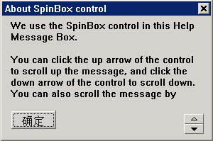
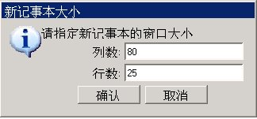
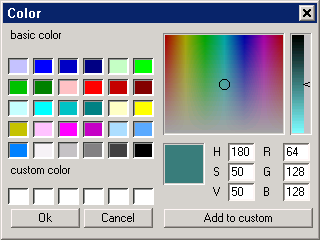
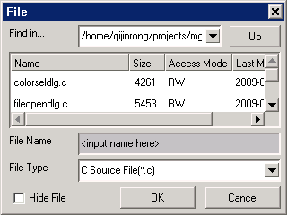
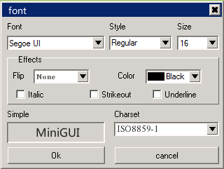
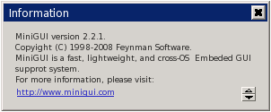
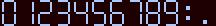
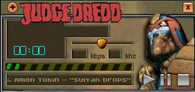

# 使用 mGUtils

mGUtils 为 MiniGUI 3.0 用户提供了多个功能模板，有了这些模板，用户就不用为一些常用的功能而自行开发了。本组件提供的功能模板有：

- 普通文件对话框：此对话框模板具有文件打开，保存以及另存为功能。有两种外观模式：简洁模式和 PC 模式。
- 颜色设置对话框：此对话框模板在你需要为应用层客户提供调色板的时候，绝对派得上用场。颜色对话框也分为简洁模式和PC模式。
- 字体设置对话框：此对话框提供了一个类似 Windows “字体选择对话框” 的 MiniGUI 版本。
- 信息设置对话框：此对话框提供了一个显示特性信息的对话框模板。有了这个模板，用户就不用为了显示一些弹出信息而专门去写一个对话框了。

mGUtils 的最新版本为 V1.0.0。

## 1 mGUtils 组件介绍

mGUtils 组件是在原 MiniGUI 2.0/1.6 的 MiniGUI 扩展库基础上发展而来。这个组件为应用程序提供了一些常见的窗口及对话框框实现，以简化应用程序代码。目前主要包括如下功能：

- 常见界面封装函数
- 皮肤界面支持
- 常用对话框

应用程序在使用 mGUtils 组件中的接口之前，应包含 `<mgutils/mgutlis.h>` 头文件，并链接 libmgutils 库（在使用 GCC 工具链时，传入 `-lmgutils` 参数。）

## 2 界面封装函数

MGUtils 是由 MiniGUI 中的 `MiniGUIExt` 库提取的，而 `MiniGUIExt` 库中的界面封装函数原先由 `mywins` 函数库提供，在 1.2.6 版本开发中，我们将 `mywins` 函数库合并到 `mgext` 函数库中。这些函数接口大部分来源于某个发行版安装程序的开发过程。

大家都知道，像 Red Hat Linux 这样的发行版的（字符模式的）安装程序，都是基于一个称为 newt 的字符界面函数库开发的。newt 试图在字符模式下，为应用程序提供一个类似图形用户界面那样的界面，其中可以包含标签、按钮、列表框、编辑框等等常见的 GUI 元素。Red Hat Linux 上的许多系统管理工具也是在 newt 基础上开发的。

在 2000 年我们为某个发行版开发安装程序的时候，为了方便地将原先用 newt 编写的安装程序界面用 MiniGUI 来实现，我们开发了 mywins 库，并在 1.2.6 版本中将该函数库合并到了 MiniGUIExt库。这些接口大致分为如下几类：

- 对 MGUtils 已有函数的简单封装，大部分可接受可变参数，并能够完成消息文本的格式化。这类接口包括：
   - `createStatusWin/destroyStatusWin`：创建和销毁状态窗口。状态窗口可用于显示“系统正在复制软件包，请稍候...”这样的文本。
   - `createToolTipWin/destroyTooTipWin`：创建和销毁工具提示窗口。工具提示窗口一般是一个小的黄色窗口，其中显示一些提示信息。
   - `createProgressWin/destroyProgressWin`：创建和销毁进度窗口。进度窗口中包含一个进度条，可用来显示进度信息。
   - `myWinHelpMessage`：显示纯文本的帮助对话框，其中含有一个旋钮框，可用来上下滚动帮助信息。

- 综合性的辅助函数，可用来接收和返回复杂的输入信息。这类接口有：
   - `myWinMenu`：该函数创建一个列表框让用户选择其中某一项。类似 Red Hat Linux 的 timeconfig 工具（设置时区）所显示的对话框。
   - `myWinEntries`：该函数创建一组编辑框让用户输入。类似 Red Hat Linux 的 netconfig 工具所显示的填写网络 IP 地址、子网掩码等信息的界面。
   - `OpenFileDialog/OpenFileDialogEx`：文件打开/保存对话框（已废弃，不推荐使用）。
   - `ShowOpenDialog`：新的文件打开/保存对话框（也废弃了，不推荐使用）。
   - `FileOpenSaveDialog`： 最新的文件打开/保存对话框。
   - `ColorSelDialog`：颜色选取对话框（已废弃，不推荐使用）。
   - `ColorSelectDialog`：新颜色选取对话框。

为了更好地理解上述这几类函数的使用，我们举几个例子。
下面的代码调用 `myWinHelpMessage` 建立了一个帮助信息对话框，该函数建立的对话框可见图 1。

```c
myWinHelpMessage (hwnd, 300, 200,
            "About SpinBox control",
            "We use the SpinBox control in this Help Message Box.\n\n"
            "You can click the up arrow of the control to scroll up "
            "the message, and click the down arrow of the control to scroll down. "
            "You can also scroll the message by typing ArrowDown and ArrowUp keys.\n\n"
            "In your application, you can call 'myWinHelpMessage' function "
            "to build a Help Message box like this.\n\n"
            "The Help Message Box is useful for some PDA-like applications.\n\n"
            "The SpinBox control allways have the fixed width and height. "
            "You can read the source of 'ext/control/spinbox.c' to know how to "
            "build such a control.\n\n"
            "If you want to know how to use this control, please read the "
            "source of 'mywindows/helpwin.c' in the MiniGUI source tree.");
```



__图 1__  myWinHelpMessage 函数创建的对话框

清单 1 中的代码调用 `myWinEntries` 函数建立了具有两个编辑框的对话框，用于输入新窗口的行数和列数。该函数建立的对话框见图 2。

__清单 1__  `myWinEntries` 函数的使用

```c
char cols [10];
        char rows [10];
        char* newcols = cols;
        char* newrows = rows;

        /* 指定两个编辑框属性，包括标签及初始内容。该结构数组以 NULL 结束。 */
        myWINENTRY entries [] = {
            { "列数:", &newcols, 0, 0 },
            { "行数:", &newrows, 0, 0 },
            { NULL, NULL, 0, 0 }
        };

        /* 指定两个按钮的属性，包括标签及其标识符。该结构数组以 NULL 结束。 */
        myWINBUTTON buttons[] = {
            { "确认", IDOK, BS_DEFPUSHBUTTON },
            { "取消", IDCANCEL, 0 },
            { NULL, 0, 0}
        };
        int result;

        sprintf (cols, "%d", 80);
        sprintf (rows, "%d", 25);

        /* 调用 myWinEntries 显示界面并返回用户输入。 */
        result = myWinEntries (HWND_DESKTOP,
                "新记事本大小",
                "请指定新记事本的窗口大小",
                240, 150, FALSE, entries, buttons);

        /* 用户在两个编辑框中输入的内容，将通过 newcols 和 newrows 返回。 */
        col = atoi (newcols);
        row = atoi (newrows);

        /* 因为 newcols 和 newrows 是由 myWinEntries 函数分配的，因此不能忘记释放。*/
        free (newcols);
        free (newrows);

        if (result == IDOK) {
             /* 其它处理工作 */
        }
        else
            return;
```



__图 2__  利用 myWinEntries 函数创建的对话框

## 3 常用对话框
### 3.1 颜色选择对话框

颜色选择对话框提供了一种直观的方式使用户可以在 RGB 颜色空间中选择一个想要的颜色值，如图 3 所示。



__图 3__  颜色选择对话框

```c
ColorSelectDialog (PDLGTEMPLATE dlg_template,HWND hwnd, WNDPROC proc, PCOLORDLGDATA pcdd);
```

`dlg_template` 指向一个 `DLGTEMPLATE` 的类型结构，用于保存用户自定义界面，如果传入 `NULL` 会自动设置为默认的界面，`hWnd` 为颜色选择对话框的属主窗口句柄，WNDPROC 窗口程序的通用对话框,`pcdd` 指向 `FILEDLGDATA` 的类型结构，用于指定初始化数据及用户选择的文件信息。

`DLGTEMPLATE` 类型结构

```c
typedef struct _DLGTEMPLATE
{
    /** Dialog box style */
    DWORD       dwStyle;                
    /** Dialog box extended style */
    DWORD       dwExStyle;              
    /** Dialog box position */
    int         x, y, w, h;             
    /** Dialog box caption */
    const char* caption;                
    /** Dialog box icon */
    HICON       hIcon;                  
    /** Dialog box menu */
    HMENU       hMenu;                  
    /** Number of controls */
    int         controlnr;              
    /** Poiter to control array */
    PCTRLDATA   controls;               
    /** Addtional data, must be zero */
    DWORD       dwAddData;              
} DLGTEMPLATE;
```

`COLORDLGDATA` 类型结构

```c
typedef struct _COLORDLGDATA {
        /** The value of the color  returned. */
        gal_pixel       pixel;
        
        /** The R, G, B value of the color returned. */
        Uint8           r, g, b;
        
        /** The H value of the color returned. */
        Uint16          h;
        
        /** The S, V value of the color returned. */
        Uint8           s, v;

        /** Indicates the controls is transparent or no?*/
        BOOL            is_trans;
        
        WNDPROC         hook;
} COLORDLGDATA, *PCOLORDLGDATA;
```

>【注意】颜色选取对话框只在将 MiniGUI 配置为使用 NEWGAL 引擎时才提供。

### 3.2 文件(打开/保存)对话框
#### 3.2.1 文件打开对话框

该对话框提供了更加丰富的功能用来管理文件。

is_save = FALSE，创建的对话框为文件打开对话框,该对话框的效果如图 4 所示。



__图 4__  新的文件打开对话框

```c
BOOL FileOpenSaveDialog  (PDLGTEMPLATE dlg_template,  HWND hwnd, WNDPROC proc, PFILEDLGDATA pfdd)；
```

`dlg_template` 指向一个 `DLGTEMPLATE` 的类型结构，用于保存用户自定义界面，如果传入 `NULL` 会自动设置为默认的界面，`hWnd` 为颜色选择对话框的属主窗口句柄，WNDPROC 窗口程序的通用对话框,`pfdd` 指向 `FILEDLGDATA` 的类型结构，用于指定初始化数据及用户选择的文件信息。

`FILEDLGDATA` 类型结构

```c
typedef struct _FILEDLGDATA
{
        /** Indicates to create a Save File or an Open File dialog box. */
        BOOL        is_save;
        
        /** Indicates the controls is transparent or no? */
        BOOL        is_trans;
        
        /** The full path name of the file returned. */
        char        filefullname[MY_NAMEMAX + MY_PATHMAX + 1];
        
        /** The name of the file to be opened. */
        char        filename[MY_NAMEMAX + 1];
        
        /** The initial path of the dialog box. */
        char        filepath[MY_PATHMAX + 1];
        
        /**
        * The filter string, for example: 
        * All file (*.*)|Text file (*.txt;*.TXT)
        */     
        char        filter[MAX_FILTER_LEN + 1];
        
        /** The initial index of the filter*/
        int         filterindex;
        
        WNDPROC     hook;
} FILEDLGDATA, *PFILEDLGDATA;
```

>【注意】文件打开对话框只有当 MiniGUI 运行在类 UNIX 操作系统（Linux/uClinux）之上时才提供。

#### 3.2.2 文件保存对话框

`is_save = TRUE`，创建的对话框为文件保存对话框,该对话框的效果如图 5 所示。


__图 5__  新的文件打开对话框

```c
BOOL FileOpenSaveDialog  (PDLGTEMPLATE dlg_template,  HWND hwnd, WNDPROC proc, PFILEDLGDATA pfdd)；
```

`dlg_template` 指向一个 `DLGTEMPLATE` 的类型结构，用于保存用户自定义界面，如果传入 `NULL` 会自动设置为默认的界面，`hWnd` 为颜色选择对话框的属主窗口句柄，WNDPROC 窗口程序的通用对话框，`pfdd` 指向 `FILEDLGDATA` 的类型结构，用于指定初始化数据及用户选择的文件信息。

### 3.3 字体选择对话框

字体选择对话框，可以方便快捷的定制一种字体，如图 6 所示。



__图 6__  字体选择对话框

```c
BOOL FontSelectDialog  (PDLGTEMPLATE dlg_template, HWND hwnd, WNDPROC proc, PFONTDLGDATA pfdd)；
```

`dlg_template` 指向一个 `DLGTEMPLATE` 的类型结构，用于保存用户自定义界面，如果传入 `NULL` 会自动设置为默认的界面，`hWnd` 为颜色选择对话框的属主窗口句柄，WNDPROC 窗口程序的通用对话框，`pfdd` 指向 `FONTDLGDATA` 的类型结构，用于指定初始化数据及用户选择的文件信息。

`FONTDLGDATA` 类型结构

```c
typedef struct _FONTDLGDATA {
        /* The font minimize size. */
        int             min_size;
        /* The font maximize size. */
        int             max_size;
        /* Indicates the controls is transparent or no?*/
        BOOL            is_trans;       
        
        /* The font color. */
        RGB             color;
        PLOGFONT        logfont;
        
        WNDPROC         hook;
} FONTDLGDATA, *PFONTDLGDATA;
```

### 3.4 信息提示对话框

信息对话框可以很方便的显示各种文字。



__图 7__  信息提示对话框

```c
BOOL InfoShowDialog  (PDLGTEMPLATE dlg_template, HWND hwnd, WNDPROC proc, PINFODLGDATA pidd);
```

`dlg_template` 指向一个 `DLGTEMPLATE` 的类型结构，用于保存用户自定义界面，如果传入 `NULL` 会自动设置为默认的界面，`hWnd` 为颜色选择对话框的属主窗口句柄，WNDPROC 窗口程序的通用对话框，`pidd` 指向 `INFODLGDATA` 的类型结构，用于指定初始化数据及用户选择的文件信息。

`INFODLGDATA` 类型结构

```c
typedef struct _INFODLGDATA {
        const char*     msg;
        WNDPROC         hook;
        
        /* for internal usage.*/
        int             nr_lines;
        int             vis_lines;
        int             start_line;
        RECT            rc;
} INFODLGDATA, *PINFODLGDATA;
```

## 4 皮肤界面

皮肤界面（Skin）是一种通过一系列图片来构成和变换程序界面的机制。皮肤技术使应用程序可以制作出非常漂亮的软件界面。并且应用程序可以通过变换多种皮肤，而拥有不同的外观风格。

MiniGUI 1.3.1 版本中新增了对皮肤界面的支持，使应用程序可以方便地利用皮肤技术制作出比较自由的软件界面。本节讲述如何使用 MGUtils 库所提供的皮肤界面接口来实现应用程序中的皮肤功能。

### 4.1 皮肤的构成

MiniGUI 中的皮肤界面主要由包含在皮肤窗口中的皮肤主界面和各种皮肤元素组成。皮肤窗口是皮肤所依附的窗口，皮肤必须依附在某个窗口上才能显示出来。皮肤主界面又是皮肤元素的依附所在。而皮肤元素是指构成皮肤界面的各种界面元素，包括按钮（button）、标签（label）和滑条（slider）等，当然，它们基本上都是用图片来显示的。

下面的数据结构 `skin_head_t` 用来定义一个皮肤。

```c
/** Skin header information structure */
struct skin_head_s
{
        /** 皮肤的名称 */
        char* name;
        
        /** 皮肤的风格 */
        DWORD style;
        
        /** 皮肤及皮肤元素所使用的位图对象数组 */
        const BITMAP* bmps;
        /** 皮肤所使用的逻辑字体数组 */
        const LOGFONT* fonts;
        
        /** 皮肤背景位图对象在位图数组中的索引 */
        int bk_bmp_index;
        
        /** 皮肤中皮肤元素的个数 */
        int nr_items;
        /** 皮肤元素数组 */
        skin_item_t* items;
        
        /** 应用程序附加数据 */
        DWORD attached;
        
        //……
};
typedef struct skin_head_s skin_head_t;
```

应用程序在创建一个皮肤窗口之前，应该使用该数据结构定义皮肤窗口所包含皮肤的属性，包括位图资源、逻辑字体、皮肤元素和回调函数等。

name项用来定义皮肤的名字，style 项为皮肤的风格，目前只有 `SKIN_STYLE_TOOLTIP` 一种，该风格表示皮肤窗口具有显示提示信息的功能。

`bmps` 指向一个位图对象数组，该数组包含了皮肤所使用的所有的位图资源，`fonts` 指向一个逻辑字体数组，该数组包含了皮肤所使用的逻辑字体资源。在使用 `skin_head_t` 结构之前，应该先初始化这两个数组中的位图和字体资源，例如从文件中装载。`bk_bmp_index` 定义了皮肤主界面的背景位图对象，它是 `bmps` 数组中的索引值。

`nr_items` 和 `items` 分别表示皮肤中元素的个数和元素数组，`items` 指向一个 `skin_item_t` 类型的数组，该数组定义了皮肤上的所有皮肤元素。皮肤所包含的皮肤元素是应该和 `skin_head_t` 结构同时定义好的。

我们使用 `skin_head_t` 结构和 `skin_item_t` 结构定义了一个皮肤的相关属性之后，该皮肤对象还不是完整的，我们还需要调用 `skin_init` 函数对该皮肤对象进行初始化，使该对象包含完整的外部信息和内部数据，之后就可以在窗口中使用该皮肤了。

```c
BOOL skin_init (skin_head_t* skin, skin_event_cb_t event_cb, skin_msg_cb_t msg_cb);
```

其中 `event_cb和msg_cb` 参数指定该皮肤的事件回调函数和消息回调函数。

如果不再需要一个皮肤对象，我们可以使用 `skin_deinit` 函数来销毁它。

```c
void skin_deinit (skin_head_t* skin);
```

皮肤元素是一个皮肤对象的主要组成部分，下面的数据结构 `skin_item_t` 定义了一个皮肤元素的属性。

```c
/** Skin item information structure */
typedef struct skin_item_s
{
        /** 用来标识皮肤元素*/
        int id;
        
        /* 皮肤元素的风格 */
        DWORD style;
        
        /** 皮肤元素在皮肤界面中的 X 坐标 */
        int x;
        /**皮肤元素在皮肤界面中的 Y 坐标 */
        int y;
        
        /** 皮肤元素的热点矩形 */
        RECT rc_hittest;
        
        /** 皮肤元素位图在皮肤位图数组中的索引 */
        int bmp_index;
        
        /** 提示信息文字 */
        char* tip;
        
        /** 应用程序附加数据 */
        DWORD attached;
        
        /* 定义皮肤元素特定属性的数据 */
        void* type_data;
        
        // ……
} skin_item_t;
```

id 项是一个用来标志皮肤元素的整数，该 id 值将在事件回调函数中用来判断皮肤事件的元素对象；x 和 y 项为皮肤元素在皮肤界面中的位置；`rc_hittest` 为皮肤元素的热点矩形，如果一个鼠标事件发生在某皮肤元素的热点矩形内，系统将触发一个对应于该皮肤元素的皮肤事件。

几乎每个皮肤及其包含的皮肤界面元素都是通过图片来显示它的外观的，`bmp_index` 指定了皮肤元素所用到的位图对象在皮肤的位图对象数组（`skin_head_t` 结构中的 `bmps` 项）中的索引值，皮肤和皮肤界面元素所用到的图片资源应该由应用程序统一装载到皮肤的位图对象数组中。

`type_data` 项定义了皮肤元素特定属性的数据，该指针通常指向一个皮肤元素的属性数据结构，它也是在定义一个皮肤和皮肤元素时应该同时定义好的。例如，对于图片标签元素来说，`type_data` 就是指向一个 `si_bmplabel_t` 类型结构的指针，该结构给出了图片标签的标签文字和可选的文字集合等必需的信息。如果皮肤元素是一个 MiniGUI 控件，那么 `type_data` 应该指向一个 `CTRLDATA` 类型的结构。

`attached` 为应用程序附加数据项，应用程序可以在该项中存储和某个皮肤元素相关的应用程序附加数据，该数据是应用相关的，由应用程序解释和使用。

style 项指定皮肤元素的风格，包括皮肤元素的种类、特定皮肤元素的风格和热点区域的形状等诸多信息，这些不同用途的风格应该使用“|”运算符或上。

皮肤元素的种类是在 style 项中通过包括相应的元素风格来指定的，MiniGUI 有如下几个预定义的皮肤元素：

- `SI_TYPE_NRMLABEL`：普通标签
- `SI_TYPE_BMPLABEL`：图片标签
- `SI_TYPE_CMDBUTTON`：命令按钮
- `SI_TYPE_CHKBUTTON`：选择按钮
- `SI_TYPE_NRMSLIDER`：普通滑条
- `SI_TYPE_ROTSLIDER`：旋转滑条
- `SI_TYPE_CONTROL`：MiniGUI 控件

我们将在本节的稍后部分详细讲述这些皮肤元素的使用。

当皮肤元素的种类为 `SI_TYPE_CONTROL` 时，它将是一个 MiniGUI 控件，例如按钮、静态框等，或者是皮肤子窗口。

皮肤元素的热点区域的形状由如下风格指定：

- `SI_TEST_SHAPE_RECT`：矩形
- `SI_TEST_SHAPE_ELLIPSE`：椭圆形
- `SI_TEST_SHAPE_LOZENGE`：菱形
- `SI_TEST_SHAPE_LTRIANGLE`：顶点在左边的等腰三角形
- `SI_TEST_SHAPE_RTRIANGLE`：顶点在右边的等腰三角形
- `SI_TEST_SHAPE_UTRIANGLE`：顶点在上边的等腰三角形
- `SI_TEST_SHAPE_DTRIANGLE`：顶点在下边的等腰三角形

皮肤元素的状态由以下风格指定：

- `SI_STATUS_VISIBLE`：可见
- `SI_STATUS_DISABLED`：禁用
- `SI_STATUS_HILIGHTED`：高亮

我们在定义一个皮肤元素时应该指定它的初始状态。此外，特定的皮肤元素还可能有自己特定的状态定义，我们将在下面的皮肤元素中说明。

### 4.2 皮肤窗口

皮肤窗口是指包含皮肤的 MiniGUI 窗口，可以是非模态主窗口、模态主窗口和子窗口（控件）。

皮肤主窗口和普通的 MiniGUI 主窗口的主要区别是外观（皮肤主窗口没有标题栏、边框和系统菜单），皮肤主窗口的事件及消息回调函数和普通主窗口的窗口回调函数的概念类似，用法上有点区别。皮肤子窗口也是一个 MiniGUI 子窗口（控件），和皮肤主窗口一样，皮肤子窗口可以提供皮肤事件回调函数和 MiniGUI 消息回调函数。

MiniGUI 中皮肤窗口的使用是比较灵活的，普通 MiniGUI 窗口中可以包含皮肤子窗口，皮肤窗口中也可以包含普通 MiniGUI 子窗口或者皮肤子窗口。也就是说，皮肤窗口是可以嵌套使用的。

MiniGUI 提供了如下用于创建和销毁皮肤窗口的函数：

```c
HWND create_skin_main_window (skin_head_t* skin, HWND hosting, int x, int y, int w, int h, BOOL modal);
HWND create_skin_control (skin_head_t* skin, HWND parent, int id, int x, int y, int w, int h);
void destroy_skin_window (HWND hwnd);
```

`create_skin_main_window` 函数用于创建具有皮肤界面的主窗口，该主窗口没有标题栏、边框和系统菜单。`create_skin_main_window` 函数的 `hosting` 参数指定了皮肤窗口的宿主窗口；x，y，w，和 h 参数指定皮肤主窗口的位置和大小；`skin` 参数指定主窗口所包含的皮肤，它是一个指向 `skin_head_t` 类型结构的指针，`skin_head_t` 结构定义了一个皮肤对象的相关数据，该皮肤对象应该是使用 `skin_init` 函数初始化好的；如果 `modal` 参数为 `TRUE` 则创建一个模态主窗口，否则创建一个非模态主窗口。

`create_skin_control` 函数用于创建具有皮肤界面的子窗口，或者说，皮肤控件。`parent` 参数指定了皮肤控件的父窗口；id 为控件标志符；x，y，w，h 参数指定皮肤控件在其父窗口中的位置和大小。

`destroy_skin_window` 函数用来销毁由 `create_skin_main_window` 或 `create_skin_control` 创建的皮肤主窗口或子窗口。需要注意的是，销毁一个皮肤窗口并不会销毁它所包含的皮肤对象。 

### 4.3 回调函数的使用

和窗口过程函数的作用类似，回调函数用来处理皮肤及皮肤窗口的皮肤事件和窗口消息。当用户在皮肤窗口上移动或点击鼠标时，例如点击一个按钮皮肤元素，系统将把相应的皮肤事件发送到事件回调函数，把窗口消息发送到消息回调函数。

皮肤的事件回调函数和消息回调函数是在调用 `skin_create_main_window` 和 `skin_create_control` 函数创建皮肤窗口时通过 `event_cb` 和 `msg_cb` 参数指定的。皮肤的这两个回调函数还可以通过 `skin_set_event_cb` 和 `skin_set_msg_cb` 函数来重新设置。

```c
skin_event_cb_t skin_set_event_cb (skin_head_t* skin, skin_event_cb_t event_cb);
skin_msg_cb_t skin_set_msg_cb (skin_head_t* skin, skin_msg_cb_t msg_cb);
```

`skin_event_cb_t` 为事件回调函数类型，定义如下：

```c
typedef int (* skin_event_cb_t) (HWND hwnd, skin_item_t* item, int event, void* data);
```

`hwnd` 参数为发生事件的皮肤窗口句柄；item为发生事件的皮肤元素；`event` 为事件类型，`data` 为事件相关数据。一般情况下，我们可以在事件回调函数中通过 `item` 所指皮肤元素的 `id` 和 `event` 的值来判断哪个皮肤元素发生了什么类型的事件。

目前定义的事件类型有：

- `SIE_BUTTON_CLICKED`：点击按钮
- `SIE_SLIDER_CHANGED`：滑条的滑块位置变化
- `SIE_GAIN_FOCUS`：皮肤元素获取焦点（鼠标移动到其上）
- `SIE_LOST_FOCUS`：皮肤元素失去焦点（鼠标移走）

`skin_msg_cb_t` 为消息回调函数类型，定义如下：

```c
typedef int (* skin_msg_cb_t) (HWND hwnd, int message, WPARAM wparam, LPARAM lparam, int* result);
```

`hwnd` 参数为发生消息的皮肤窗口句柄，`message` 为消息定义，`wparam` 和 `lparam` 为消息参数，`result` 用来返回消息相关的结果。

如果应用程序定义了皮肤窗口的消息回调函数的话，皮肤窗口的窗口过程函数将在处理消息之前先调用皮肤的消息回调函数对该消息进行处理，然后根据消息回调函数的返回值判断是否继续处理该消息。

消息回调函数的返回值包括：

- `MSG_CB_GOON`：皮肤窗口过程函数将继续处理该消息，`result` 值被忽略
- `MSG_CB_DEF_GOON`：消息将由 MiniGUI 缺省窗口过程函数进行处理，`result` 值被忽略
- `MSG_CB_STOP`：消息的处理将停止，皮肤窗口过程函数返回 `result` 所指向的值。

### 4.4 皮肤操作函数

我们可以通过皮肤操作函数对皮肤或皮肤元素进行一系列通用的操作。

`set_window_skin` 函数可以改变皮肤窗口所包含的皮肤，我们可以通过该函数实现应用程序窗口的换肤功能。

```c
skin_head_t* set_window_skin (HWND hwnd, skin_head_t *new_skin);
```

`hwnd` 为皮肤窗口的窗口句柄，普通窗口不适用。`new_skin` 为新的皮肤对象，该皮肤必须是已经使用 `skin_init` 函数初始化好的。`set_window_skin` 函数返回老的皮肤对象，需要注意的是，该函数并不销毁老的皮肤对象。

`get_window_skin` 函数用来获取皮肤窗口所包含的皮肤。

```c
skin_head_t* get_window_skin (HWND hwnd);
```

`skin_get_item` 函数可以由皮肤元素的 id 来获取它的皮肤元素对象。

```c
skin_item_t* skin_get_item (skin_head_t* skin, int id);
```

`skin_get_item_status` 函数获取皮肤元素的通用状态。通用状态包括可见、禁用和高亮。

```c
DWORD skin_get_item_status (skin_head_t* skin, int id);
```

`skin_get_hilited_item` 函数用来获取当前高亮的皮肤元素。

```c
skin_item_t* skin_get_hilited_item (skin_head_t* skin);
```

`skin_set_hilited_item` 函数用来设置当前高亮的皮肤元素。

```c
skin_item_t* skin_set_hilited_item (skin_head_t* skin, int id);
```
`skin_show_item` 函数用来显示或隐藏一个皮肤元素。

```c
DWORD skin_show_item (skin_head_t* skin, int id, BOOL show);
```

`skin_enable_item` 函数用来禁用或启用一个皮肤元素。

```c
DWORD skin_enable_item (skin_head_t* skin, int id, BOOL enable);
```

### 4.5 普通标签

普通标签是指使用指定逻辑字体显示文字的标签。我们使用 `skin_item_t` 结构定义一个普通标签元素时，style 项应具有 `SI_TYPE_NRMLABEL` 风格；`type_data` 项指向一个 `si_nrmlabel_t` 类型的结构，该结构定义了一个普通标签的属性：

```c
/** Normal label item info structure */
typedef struct si_nrmlabel_s
{
        /** 标签文字 */
        char* label;        
        
        /** 正常状态下的标签文字颜色 */
        DWORD color;        
        /** 焦点状态下的标签文字颜色 */
        DWORD color_focus;  
        /** 点击状态下的标签文字颜色*/
        DWORD color_click;  
        /** 标签文字的逻辑字体索引 */
        int font_index;
} si_nrmlabel_t;
```

可以通过 `skin_get_item_label` 和 `skin_set_item_label` 函数对普通标签进行获取标签名和设置标签名操作。

```c
const char* skin_get_item_label (skin_head_t* skin, int id);
BOOL skin_set_item_label (skin_head_t* skin, int id, const char* label);
```

这两个函数对图片标签也适用。

### 4.6 图片标签

图片标签是指使用图片来显示文字或其它字符内容的标签。我们使用 `skin_item_t` 结构定义一个图片标签元素时，style 项应具有 `SI_TYPE_BMPLABEL` 风格；`type_data` 项指向一个 `si_bmplabel_t` 类型的结构，该结构定义了一个图片标签的属性：

```c
/** Bitmap label item info structure */
typedef struct si_bmplabel_s
{
        /** 标签文字 */
        char* label;
        /** 标签预定义文字集 */
        const char* label_chars;
} si_bmplabel_t;
```

label 字符串为该图片标签所要显示的文字内容； `label_chars` 字符串中包含了图片标签的所有可选文字。

图片标签的文字都是用图片来表示的，这些文字的图片都存储在 `skin_item_t` 结构的 `bmp_index` 项所指的位图对象中。该位图对象所代表的文字图片需符合如下的要求：

- 文字图片中的文字等距离水平排列，可有多行，但每行不能超过20个字符
- 文字图片中的文字要和 `label_chars` 所规定的可选文字完全相符

我们举一个简单的例子。如果要使用一个内容为“21:30”的数码管风格的数字图片标签，图片来自于一个数码管风格的数字及字符图片，如图 8 所示。



__图 8__  图片标签的文字图片

那么该图片标签应该定义如下：

```c
si_bmplabel_t timelabel;

timelabel.label = “21:30”;
label_chars = “0123456789:.”;
```

可以通过 `skin_get_item_label` 和 `skin_set_item_label` 函数对图片标签进行获取标签名和设置标签名操作。

### 4.7 命令按钮

命令按钮是一个和普通的按钮控件作用类似的皮肤元素，它具有正常、按下、高亮和禁用四种状态。我们使用 `skin_item_t` 结构定义一个命令按钮时，style 项应具有 `SI_TYPE_CMDBUTTON` 风格；`bmp_index` 项所表示的图片应包括从左到右依次排列的四个大小相同，分别表示正常、按下、高亮和禁用四种状态的按钮图片，如图 9 所示。


__图 9__  包含四种状态的命令按钮图片

命令按钮有一种特定的状态 `SI_BTNSTATUS_CLICKED`，表示按钮被按下。

### 4.8 选择按钮

选择按钮和命令按钮稍有不同，它在点击时会被选中或取消选中，它也具有正常、按下、高亮和禁用四种状态。我们使用 `skin_item_t` 结构定义一个选择按钮时，style 项应具有 `SI_TYPE_CHKBUTTON` 风格；`bmp_index` 项所表示的图片格式和命令按钮是一样的。

选择按钮有一种特定的状态－`SI_BTNSTATUS_CHECKED`，表示被选中。

我们可以使用 `skin_get_check_status` 函数和 `skin_set_check_status` 函数来获取和设置选择按钮的当前选中状态。

```c
BOOL skin_get_check_status (skin_head_t* skin, int id);
DWORD skin_set_check_status (skin_head_t* skin, int id, BOOL check);
```

### 4.9 普通滑条

普通滑条可以用来表示进度信息。我们使用 `skin_item_t` 结构定义一个普通滑条元素时，style 项应具有 `SI_TYPE_NRMSLIDER` 风格；`type_data` 项指向一个 `si_nrmslider_t` 类型的结构，该结构定义了一个普通滑条的属性：

```c
/** Normal slider item info structure */
typedef struct si_nrmslider_s
{
        /** The 滑块信息 */
        sie_slider_t    slider_info;
        
        /** 滑块位图索引 */
        int thumb_bmp_index;
} si_nrmslider_t, si_progressbar_t;
```

`sie_slider_t` 结构用来表示滑块的信息，在定义一个普通滑条时，我们应该同时定义好滑块的最小位置值、最大位置值和当前位置值。

```c
/** Slider information structure */
typedef struct sie_slider_s
{
        /** 滑块位置最小值 */
        int min_pos;
        /* 滑块位置最大值 */
        int max_pos;
        /* 滑块当前位置值 */
        int cur_pos;
} sie_slider_t;
```

滑条的位图通过 `skin_item_t` 结构的 `bmp_indx` 项指定，滑块的位图通过 `si_nrmslider_t` 结构的 `thumb_bmp_index` 项指定，均为皮肤位图数组索引值。

普通滑条具有三种风格：

- `SI_NRMSLIDER_HORZ`：水平滑条
- `SI_NRMSLIDER_VERT`：垂直滑条
- `SI_NRMSLIDER_STATIC`：进度条风格

如果我们需要一个水平方向的进度条，那么定义普通滑条元素的 `skin_item_t` 结构的 style 项需要或上（`SI_NRMSLIDER_HORZ | SI_NRMSLIDER_STATIC`）。

我们可以通过 `skin_get_slider_info`、`skin_set_slider_info` 和 `skin_scale_slide_pos` 等函数获取和设置普通滑条的信息。

```c
BOOL skin_get_slider_info (skin_head_t* skin, int id, sie_slider_t* sie);
BOOL skin_set_slider_info (skin_head_t* skin, int id, const sie_slider_t* sie);
int skin_get_thumb_pos (skin_head_t* skin, int id);
BOOL skin_set_thumb_pos (skin_head_t* skin, int id, int pos);
int skin_scale_slider_pos (const sie_slider_t* org, int new_min, int new_max);
```

`skin_get_slider_info`函数用来获取滑块的最小位置值、最大位置值和当前位置值信息，结果存放在一个 `sie_slider_t` 类型的结构中；`skin_set_slider_info` 函数重新设置滑条的位置信息；`skin_get_thumb_pos` 和 `skin_set_thumb_pos` 函数获取和设置滑块的位置；`skin_scale_slider_pos` 函数用来计算滑条范围缩放后的新位置。

### 4.10 旋转滑条

旋转滑条和普通滑条类似，不过它的滑块是沿圆弧滑动的。我们使用 `skin_item_t` 结构定义一个旋转滑条元素时，style 项应具有 `SI_TYPE_ROTSLIDER` 风格；`type_data` 项指向一个 `si_rotslider_t` 类型的结构，该结构定义了一个旋转滑条的属性：

```c
/** Rotation slider item info structure */
typedef struct si_rotslider_s
{
        /** 旋转半径 */
        int radius;
        /** 开始角度 */
        int start_deg;
        /** 终止角度 */
        int end_deg;
        /** 当前角度 */
        int cur_pos;
        
        /** 滑块位图索引 */
        int thumb_bmp_index;
} si_rotslider_t;
```

旋转滑块具有三种风格：

- `SI_ROTSLIDER_CW`：顺时针旋转
- `SI_ROTSLIDER_ANTICW`：逆时针旋转
- `SI_ROTSLIDER_STATIC`：进度条风格

和普通滑条一样，我们可以通过 `skin_get_slider_info`、`skin_set_slider_info` 和 `skin_scale_slide_pos` 等函数获取和设置旋转滑条的信息。

### 4.11 MiniGUI 控件

MiniGUI 控件元素表示的就是一个普通的 MiniGUI 控件。我们使用 `skin_item_t` 结构定义一个 MiniGUI 控件元素时，style 项应具有 `SI_TYPE_CONTROL` 风格；`type_data` 项指向一个 `CTRLDATA` 类型的结构。该元素类型是为了方便用户在皮肤窗口上创建普通 MiniGUI 控件而设计。

可以使用下面的函数通过皮肤元素的 id 来获取 MiniGUI 控件元素的窗口句柄。

```c
HWND skin_get_control_hwnd (skin_head_t* skin, int id);
```

### 4.12 编程实例

清单 1 所示的程序代码，创建了一个播放器的皮肤界面，它可以响应用户的基本操作。该程序的完整源代码和图片资源可见本指南示例程序包 samples 中的 `skindemo.c` 文件。

__清单 1__  皮肤界面示例程序

```c
#include <stdio.h>
#include <stdlib.h>
#include <string.h>


#include <minigui/common.h>
#include <minigui/minigui.h>
#include <minigui/gdi.h>
#include <minigui/window.h>
#include <minigui/control.h>

#include <mgutils/mgutils.h>

#define SIID_TITLE        1
#define SIID_PLAY         2
#define SIID_PAUSE        3
#define SIID_STOP         4
#define SIID_PROGRESS    5
#define SIID_SYSMENU      6
#define SIID_CLOSE        7
#define SIID_VOLUME       8
#define SIID_TIMER        9

#define DEF_WIDTH          284
#define DEF_HEIGHT         135
#define ID_TIME            100    

/* 定义皮肤元素特定属性 */
static si_nrmslider_t progress     = { {0, 180, 0 }, 5 };
static si_nrmslider_t volume         = { {1, 100, 50}, 9 };
static si_bmplabel_t timer         = { "00:00", "0123456789:-" };

/* 定义皮肤元素数组 */
static skin_item_t skin_main_items [] =
{
        {SIID_PLAY, SI_TYPE_CHKBUTTON    | SI_TEST_SHAPE_RECT | SI_STATUS_VISIBLE,
                205, 106, {}, 1, "播放"},
        {SIID_PAUSE, SI_TYPE_CHKBUTTON   | SI_TEST_SHAPE_RECT | SI_STATUS_VISIBLE,
                230, 106, {}, 2, "暂停"},    
        {SIID_STOP,  SI_TYPE_CHKBUTTON   | SI_TEST_SHAPE_RECT | SI_STATUS_VISIBLE,
                254, 106, {}, 3, "停止"},
        {SIID_PROGRESS, SI_TYPE_NRMSLIDER| SI_TEST_SHAPE_RECT | SI_STATUS_VISIBLE 
                | SI_NRMSLIDER_HORZ, 8, 91, {}, 4, "播放进度" , 0, &progress},
        {SIID_SYSMENU, SI_TYPE_CMDBUTTON | SI_TEST_SHAPE_RECT | SI_STATUS_VISIBLE,
                9, 2, {}, 6},
        {SIID_CLOSE, SI_TYPE_CMDBUTTON   | SI_TEST_SHAPE_RECT | SI_STATUS_VISIBLE,
                263, 2, {}, 7, "关闭"},
        {SIID_VOLUME, SI_TYPE_NRMSLIDER  | SI_TEST_SHAPE_RECT | SI_STATUS_VISIBLE 
                | SI_NRMSLIDER_HORZ, 102, 55, {}, 8, "调节音量" , 0, &volume},
        {SIID_TIMER,   SI_TYPE_BMPLABEL  | SI_TEST_SHAPE_RECT | SI_STATUS_VISIBLE,
                20, 67, {}, 10, "播放时间", 0, &timer}
};

/* 定义皮肤 */
skin_head_t main_skin =
{
        "播放器皮肤窗口",
        SKIN_STYLE_TOOLTIP, NULL, NULL, 
        0, 8, skin_main_items, FALSE
};

/* 位图数组 */
const char *bmp_name[] = {
        "main.png", "play.png", "pause.png", "stop.png", "progress-bk.png", "progress.png",
        "sysmenu.png", "close.png", "volume-bk.png", "volume.png", "timer.png"
};

static int cur_pos = 0;

/* 位图资源装/卸载函数 */
void load_skin_bmps ( skin_head_t *skin, BOOL load )
{
        int i, bmp_num = sizeof(bmp_name)/sizeof(char *);
        
        /* 如果load为真，则将位图装载到skin的bmps数组，否则卸载bmps数组中的位图 */
        /* 代码从略... */
}

/* 皮肤事件回调函数 */
static int main_event_cb (HWND hwnd, skin_item_t* item, int event, void* data)
{
        if (event == SIE_BUTTON_CLICKED) {
                switch (item->id) {
                        case SIID_PLAY:    
                        /* 皮肤元素SIID_PLAY的SIE_BUTTON_CLICKED事件在这里进行处理 */
                        ...
                        break;
                }
                ...
                
        }
        else if (event == SIE_SLIDER_CHANGED) {
                ...
        }
        
        return 1;
}

/* 皮肤窗口消息回调函数 */
static int msg_event_cb (HWND hwnd, int message, WPARAM wparam, LPARAM lparam, int* result)
{
        switch (message) {
                case MSG_TIMER:
                ...
                hostskin = get_window_skin (hwnd);
                skin_set_thumb_pos (hostskin, SIID_PROGRESS, cur_pos);
                skin_set_item_label (hostskin, SIID_TIMER, buf);
                break;
        }
        return 1;
}

int MiniGUIMain (int argc, const char *argv[])
{
        MSG msg;
        HWND hWndMain;
        
        #ifdef _MGRM_PROCESSES
        JoinLayer(NAME_DEF_LAYER, “skindemo”, 0, 0);
        #endif
        
        if (!InitMiniGUIExt()) {
                return 2;
        }
        
        load_skin_bmps (&main_skin, TRUE);    /* 装载位图资源 */
        
        if ( !skin_init (&main_skin, main_event_cb, msg_event_cb) ){    /* 初始化皮肤 */
                printf ("skin init fail !\n");
        }
        else{
                hWndMain = create_skin_main_window (&main_skin,
                HWND_DESKTOP, 100, 100, 100 + 10.DEF_WIDTH, 100 + 10.DEF_HEIGHT, FALSE);
                
                while (GetMessage (&msg, hWndMain)) {
                        TranslateMessage (&msg);
                        DispatchMessage (&msg);
                }
                
                MainWindowCleanup (hWndMain);
                skin_deinit (&main_skin);        /* 撤销皮肤 */
        }
        
        load_skin_bmps (&main_skin, FALSE);    /* 卸载位图资源 */
        MiniGUIExtCleanUp ();
        
        return 0;
}

#ifndef _MGRM_PROCESSES
#include <minigui/dti.c>
#endif
```

程序定义了一个皮肤窗口 `main_skin`，它包含了八个皮肤元素，包括五个命令按钮，两个普通滑条和一个图片标签。程序首先将皮肤窗口需要的位图资源载入，然后调用 `skin_init()` 函数对皮肤进行初始化。如果皮肤初始化成功，则调用 `create_skin_main_window()` 函数创建皮肤窗口，并进入皮肤窗口的消息循环。当程序结束时，需要调用 `skin_deinit()` 函数将皮肤撤销。

程序运行界面如图 10。



__图 10__  皮肤界面示例


