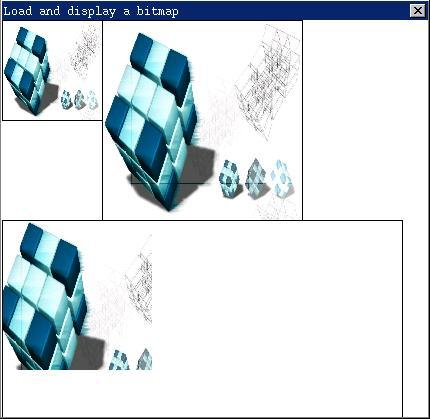
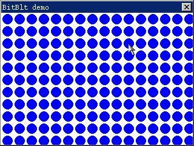
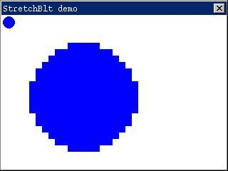

# 图形设备接口

图形设备接口（GDI：Graphics Device Interface）是 GUI 系统的一个重要组成部分。通过 GDI，GUI 程序就可以在计算机屏幕上，或者其他的显示设备上进行图形输出，包括基本绘图和文本输出。本章以及其后的两章中，我们将详细描述 MiniGUI 中图形设备接口的重要概念，图形编程的方法和主要的 GDI 函数，并举例说明重要函数的用法。

## 1.1 MiniGUI 图形系统的架构

### 1.1.1 `GAL` 和 `GDI`

为了把底层图形设备和上层图形接口分离开来，提高 MiniGUI 图形系统的可移植性，MiniGUI 中引入了图形抽象层（Graphics Abstract Layer，GAL）的概念。图形抽象层定义了一组不依赖于任何特殊硬件的抽象接口，所有顶层的图形操作都建立在这些抽象接口之上。而用于实现这一抽象接口的底层代码称为“图形引擎”，类似操作系统中的驱动程序。利用 `GAL`，MiniGUI 可以在许多已有的图形函数库上运行，比如 SVGALib 和 LibGGI。并且可以非常方便地将 MiniGUI 移植到其他 POSIX 系统上，只需要根据我们的抽象层接口实现新的图形引擎即可。比如，在基于 Linux 的系统上，我们可以在Linux `FrameBuffer` 驱动程序的基础上建立通用的 MiniGUI 图形引擎。实际上，包含在 MiniGUI 1.0.00 版本中的私有图形引擎（Native Engine）就是建立在 `FrameBuffer` 之上的图形引擎。一般而言，基于 Linux 的嵌入式系统均会提供 `FrameBuffer` 支持，这样私有图形引擎可以运行在一般的 `PC` 上，也可以运行在特定的嵌入式系统上。

### 1.1.2 新的 `GAL`
MiniGUI 1.1.0 版本对GAL和GDI进行了大规模的改进，引入了新的 `GAL` 和新的 `GDI` 接口和功能。

在老的 `GAL` 和 `GDI` 的设计中，`GAL` 可以看成是 `GDI` 的图形驱动程序，许多图形操作函数，比如点、线、矩形填充、位图操作等等，均通过 `GAL` 的相应函数完成。这种设计的最大问题是无法对 `GDI` 进行扩展。比如要增加椭圆绘制函数，就需要在每个引擎当中实现椭圆的绘制函数。并且 `GDI` 管理的是剪切域，而 `GAL` 引擎却基于剪切矩形进行操作。这种方法也导致了 `GDI` 函数无法进行绘制优化。因此，在新的 `GAL` 和 `GDI` 接口设计中，我们将 `GAL` 的接口进行了限制，而将原有许多由 `GAL` 引擎完成的图形输出函数，提高到上层 `GDI` 函数中完成。新 `GAL`（`NEWGAL`）和新 `GDI`（`NEWGDI`）的功能划分如下：

- `NEWGAL` 负责对显示设备进行初始化，并管理显示内存的使用；
- `NEWGAL` 负责为上层 `GDI` 提供映射到进程地址空间的线性显示内存，以及诸如调色板等其他相关信息；
- `NEWGAL` 负责实现快速的位块操作，包括矩形填充和 Blitting 操作等，并且在可能的情况下，充分利用硬件加速功能；
- `NEWGDI` 函数实现高级图形功能，包括点、线、圆、椭圆、圆弧、样条曲线，以及更加高级的逻辑画笔和逻辑画刷，必要时调用 `NEWGAL` 接口完成加速功能；
- 尽管某些显示卡也提供有对上述高级绘图功能的硬件支持，但考虑到其他因素，这些硬件加速功能不由NEWGAL接口提供，而统统通过软件实现。

这样，`NEWGAL` 主要实现的绘图功能限制在位块操作上，比如矩形填充和 Blitting 操作；而其他的高级图形功能，则全部由 `NEWGDI` 函数实现。

新的 `NEWGAL` 接口能够有效利用显示卡上的显示内存，并充分利用硬件加速功能。我们知道，现在显示卡一般具有 4M 以上的显示内存，而一般的显示模式下，不会占用所有的显示内存。比如在显示模式为 1024x768x32bpp 时，一屏象素所占用的内存为 3M，还有 1M 的内存可供应用程序使用。因此，`NEWGAL` 引擎能够管理这部分未被使用的显示内存，并分配给应用程序使用。这样，一方面可以节省系统内存的使用，另一方面，可以充分利用显示卡提供的加速功能，在显示内存的两个不同内存区域之间进行快速的位块操作，也就是常说的 Blitting。

上层 `NEWGDI` 接口在建立内存 `DC` 设备时，将首先在显示内存上分配内存，如果失败，才会考虑使用系统内存。这样，如果NEWGAL 引擎提供了硬件加速功能，两个不同 `DC` 设备之间的 Blitting 操作（即 `GDI` 函数 `BitBlt`），将以最快的速度运行。更进一步，如果硬件支持透明或 Alpha 混合功能，则透明的或者 Alpha 混合的 Blitting 操作也将以最快的速度运行。`NEWGAL` 接口能够根据底层引擎的加速能力自动利用这些硬件加速功能。目前支持的硬件加速能力主要有：矩形填充，普通的 Blitting 操作，透明、Alpha 混合的 Blitting 操作等。当然，如果硬件不支持这些加速功能，`NEWGAL` 接口也能够通过软件实现这些功能。目前通过`NEWGAL` 的 `FrameBuffer` 引擎提供上述硬件加速功能的显卡有：Matrox、3dfx 等。

需要注意的是，`NEWGAL` 结构支持线性显示内存，同时也支持 8 位色以上的显示模式，对低于 8 位色的显示模式，或者不能直接访问显示帧缓冲区的显示设备，可以通过 `NEWGAL` 的 `Shadow` 引擎来提供相应的支持，而且 `Shadow` 引擎还可以支持屏幕坐标的旋转。在 `NEWGAL` 基础上提供了一些高级功能，我们将在第 15 章讲述基于 `NEWGAL` 的高级 `GDI` 接口。

## 1.2 窗口绘制和刷新

### 1.2.1 何时进行绘制
应用程序使用窗口来作为主要的输出设备，也就是说，MiniGUI应用程序在它的窗口之内进行绘制。

MiniGUI 对整个屏幕上的显示输出进行管理。如果窗口移动之类的动作引起窗口内容的改变，MiniGUI 对窗口内应该被更新的区域打上标志，然后给相应的应用程序窗口发送一个 `MSG_PAINT` 消息，应用程序收到该消息后就进行必要的绘制，以刷新窗口的显示。如果窗口内容的改变是由应用程序自己引起的，应用程序可以把受影响而需更新的窗口区域打上标志，并产生一个 `MSG_PAINT` 消息。

如果需要在一个窗口内绘制，应用程序首先要获得该窗口的设备上下文句柄。应用程序的大部分绘制操作是在处理 `MSG_PAINT` 消息的过程中执行的，这时，应用程序应调用 `BeginPaint` 函数来获得设备上下文句柄。如果应用程序的某个操作要求立即的反馈，例如处理键盘和鼠标消息时，它可以立刻进行绘制而不用等待 `MSG_PAINT` 消息。应用程序在其它时候绘制时可以调用 `GetDC` 或 `GetClientDC` 来获得设备上下文句柄。

### 1.2.2 `MSG_PAINT` 消息
通常应用程序在响应 `MSG_PAINT` 消息时执行窗口绘制。如果窗口的改变影响到客户区的内容，或者窗口的无效区域不为空，MiniGUI 就给相应的窗口过程函数发送 `MSG_PAINT` 消息。

接收到 `MSG_PAINT` 消息时，应用程序应调用 `BeginPaint` 函数来获得设备上下文句柄，并用它调用GDI函数来执行更新客户区所必需的绘制操作。绘制结束之后，应用程序应调用 `EndPaint` 函数释放设备上下文句柄。

`BeginPaint` 函数用来完成绘制窗口之前的准备工作。它首先通过 `GetClientDC` 函数获得窗口客户区的设备上下文，把设备上下文的剪切域设置为窗口的无效区域。窗口内只有那些改变了的区域才重新绘制，对剪切域以外的任何绘制尝试都被裁减掉，不会出现在屏幕上。为了不影响绘制操作，`BeginPaint` 函数隐藏了插入符。最后，`BeginPaint` 将窗口的无效区域清除，避免不断产生 `MSG_PAINT` 消息，然后返回所获取的设备上下文句柄。

`MSG_PAINT` 消息的 `lParam` 参数为窗口的无效区域指针，应用程序可以用窗口的无效区域信息来优化绘制。例如把绘制限制在窗口的无效区域之内。如果应用程序的输出很简单，就可以忽略更新区域而在整个窗口内绘制，由 MiniGUI 来裁剪剪切域外的不必要的绘制，只有无效区域内的绘制才是可见的。

应用程序绘制完成之后应调用 `EndPaint` 函数终结整个绘制过程。 `EndPaint 函数的主要工作是调用 `ReleaseDC` 函数释放由 `GetClientDC` 函数获取的设备上下文，此外，它还要显示被 `BeginPaint` 函数隐藏的插入符。

### 1.2.3 有效区域和无效区域

更新区域（无效区域）指的是窗口内过时的或无效的需要重新绘制的区域。MiniGUI 根据需要更新的区域为应用程序产生 `MSG_PAINT` 消息，应用程序也可以通过设置无效区域来产生 `MSG_PAINT` 消息。

应用程序可以使用 `InvalidateRect` 函数来使窗口的某一区域无效。该函数原型如下：

```c
BOOL GUIAPI InvalidateRect (HWND hWnd, const RECT* prc, BOOL bEraseBkgnd)
```

各参数含义如下：

```c
hWnd        需要更新的窗口句柄
prc          指向无效矩形的指针
bEraseBkgnd  是否擦除窗口背景
```

`InvalidateRect` 函数把给定的矩形区域添加到指定窗口的更新区域中。该函数把给定的矩形和应用程序窗口先前的更新区域合并，然后投递一个 `MSG_PAINT` 消息到该窗口的消息队列中。

如果 `bEraseBkgnd` 为 `TRUE`，应用程序窗口将收到一个 `MSG_ERASEBKGND` 消息，窗口过程可以处理该消息，自行擦除窗口背景。如果应用程序不处理 `MSG_ERASEBKGND` 消息而将它传给 `DefaultMainWinProc`，MiniGUI 对 `MSG_ERASEBKGND` 消息的默认处理方式是以窗口的背景色为画刷擦除背景。

窗口背景是指绘制窗口之前用于填充客户区的颜色和风格。窗口背景可以覆盖屏幕上窗口客户区所在区域的原有内容，使得应用程序的输出显示不受屏幕已有内容的干扰。

`MSG_ERASEBKGND` 消息的 `lParam` 参数包含了一个 `RECT` 结构指针，指明应该擦除的矩形区域，应用程序可以使用该参数来绘制窗口背景。绘制完成之后，应用程序可以直接返回零，无需调用 `DefaultMainWinProc` 进行缺省的消息处理。有关处理 `MSG_ERASEBKGND` 消息的示例，可参阅本指南第 3 章中的相关章节。

## 1.3 图形设备上下文

### 1.3.1 图形设备的抽象

应用程序一般在一个图形上下文（graphics context）上调用图形系统提供的绘制原语进行绘制。上下文是一个记录了绘制原语所使用的图形属性的对象。这些属性通常包括：

- 前景色（画笔），绘制时所使用的颜色值或图像。
- 背景色或填充位图（画刷），绘制原语在填充时所使用的颜色或图像。
- 绘制模式，描述前景色与已有的屏幕颜色如何组合。常见的选项是覆盖已有的屏幕内容或把绘制颜色和屏幕颜色进行“XOR”位逻辑运算。`XOR` 模式使得绘制对象可以通过重绘进行擦除。
- 填充模式，描述背景色或图像与屏幕颜色如何组合。常见的选项是覆盖或透明，也就是忽略背景和已有的屏幕内容。
- 颜色掩蔽，它是一个位图，用于决定绘制操作对屏幕象素影响的风格。
- 线形，它的宽度、端型和角型。
- 字体，字体通常是对应于某个字符集的一组位图。字体一般通过指定其大小、磅值、类别和字符集等属性进行选择。
- 绘制区域，在概念上是一个大小和位置可以为任意值的、映射到窗口之上的视口。可以通过改变视口的原点来移动视口。有时候系统允许视口的缩放。
- 剪切域，在该区域内绘制原语才有实效。剪切域之外的输出将不被绘制出来。剪切域主要用于重绘，由各个窗口的有变化的区域相交而成。应用程序可以调整剪切域，增加需要改变的区域。
- 当前位置，例如可以通过 `MoveTo` 和 `LineTo` 等绘制原语来画线。

MiniGUI 采用了在 Windows 和 X Window 等 GUI 系统中普遍采用的图形设备上下文（Device Context，DC，也称作“图形设备环境”）的概念。每个图形设备上下文定义了图形输出设备或内存中的一个矩形的显示输出区域，以及相关的图形属性。在调用图形输出函数时，均要求指定经初始化的图形设备上下文。也就是说，所有的绘制操作都必须在某个图形设备上下文之内起作用。

从程序员的角度看，一个经过初始化的图形设备上下文定义了一个图形设备环境，确定了之后在其上进行图形操作的一些基本属性，并一直保持这些属性，直到被改变为止。这些属性包括：输出的线条颜色、填充颜色、字体颜色、字体形状等等。而从 GUI 系统角度来讲，一个图形设备上下文所代表的含义就要复杂得多，它起码应该包含如下内容：

- 该设备上下文所在设备信息（显示模式、色彩深度、显存布局等等）；
- 该设备上下文所代表的窗口以及该窗口被其他窗口剪切的信息（在 MiniGUI 中，称作“全局剪切域”）；
- 该设备上下文的基本操作函数（点、直线、多边形、填充、块操作等），及其上下文信息；
- 由程序设定的局部信息（绘图属性、映射关系和局部剪切域等）。

当你想在一个图形输出设备（如显示器屏幕）上绘图时，你首先必须获得一个设备上下文的句柄。然后在 `GDI` 函数中将该句柄作为一个参数，标识你在绘图时所要使用的图形设备上下文。

设备上下文中包含许多确定 `GDI` 函数如何在设备上工作的当前属性，这些属性使得传递给 `GDI` 函数的参数可以只包含起始坐标或者尺寸信息，而不必包含在设备上显示对象时需要的其它信息，因为这些信息是设备上下文的一部分。当你想改变这些属性之一时，你可以调用一个可以改变设备上下文属性的函数，以后针对该设备上下文的 `GDI` 函数调用将使用改变后的属性。

设备上下文实际上是 `GDI` 内部保存的数据结构。设备上下文与特定的显示设备相关。设备上下文中的有些值是图形化的属性，这些属性定义了一些 `GDI` 绘图函数工作情况的特殊内容。例如，对于 `TextOut` 函数，设备上下文的属性确定了文本的颜色、背景色、x 坐标和 y 坐标映射到窗口客户区的方式，以及显示文本时使用的字体。

当程序需要绘图时，它必须首先获取设备上下文句柄。设备上下文句柄是一个代表设备上下文的数值，程序使用该句柄。

### 1.3.2 设备上下文句柄的获取和释放

在 MiniGUI 中，所有绘图相关的函数均需要有一个设备上下文。当程序需要绘图时，它必须首先获取设备上下文句柄。程序绘制完毕之后，它必须释放设备上下文句柄。程序必须在处理单个消息期间获取和释放设备上下文句柄，也就是说，如果程序在处理一条消息时获取了设备上下文句柄，它必须在处理完该消息退出窗口过程函数之前释放该设备上下文句柄。

获取和释放设备上下文的常用方法之一是通过 `BeginPaint` 和 `EndPaint` 函数。这两个函数的原型如下（`minigui/window.h`）：

```c
HDC GUIAPI BeginPaint(HWND hWnd);
void GUIAPI EndPaint(HWND hWnd, HDC hdc);
```

但需要注意的是，这两个函数只能在处理 `MSG_PAINT` 的消息中调用。一般地，`MSG_PAINT` 消息的处理通常有如下的形式：

```c
MSG_PAINT:
    HDC hdc = BeginPaint (hWnd);
    /* 使用GDI函数进行图形绘制 */
    EndPaint (hWnd, hdc);
    return 0;
}
```

`BeginPaint` 以和窗口过程函数相对应的窗口句柄 `hWnd` 为参数，返回一个设备上下文句柄。然后 `GDI` 函数就可以使用该设备上下文句柄进行图形操作。

在典型的图形用户界面环境（包括 `MiniGUI`）中，应用程序一般只能在窗口的客户区绘制文本和图形，但是图形系统并不确保客户区的绘制内容会一直保留下去。如果该程序窗口的客户区被另一个窗口覆盖，图形系统不会保存程序窗口被覆盖区域的内容，图形系统把这个任务留给应用程序自己完成。在需要恢复程序窗口某部分的内容时，图形系统通常会通知程序刷新该部分客户区。MiniGUI 通过向应用程序发送 `MSG_PAINT` 消息来通知应用程序进行窗口客户区的绘制操作。也就是说，由于 MiniGUI 是消息驱动的系统，MiniGUI 的应用程序只有在需要的情况下（一般是程序收到 `MSG_PAINT` 消息）才进行绘制。如果程序觉得有必要更新客户区的内容，它可以主动产生一个 `MSG_PAINT` 消息，从而使客户区重绘。

一般来说，在以下情况下，MiniGUI 程序的窗口过程会接收到一个 `MSG_PAINT` 消息：

- 用户移动窗口或显示窗口时，MiniGUI 向先前被隐藏的窗口发送 `MSG_PAINT` 消息；
- 程序使用 `InvalidateRect` 函数来更新窗口的无效区域，这将产生一个 `MSG_PAINT` 消息；
- 程序调用 `UpdateWindow` 函数来重绘窗口；
- 覆盖程序窗口的对话框或消息框被消除；
- 下拉或弹出菜单被消除。

在某些情况下，MiniGUI 保存某些被覆盖掉的显示区域，然后在需要的时候恢复，例如鼠标光标的移动。

一般情况下，窗口过程函数只需要更新客户区的一部分。例如，显示对话框覆盖了客户区的一部分；在擦除了对话框之后，只需要重新绘制之前被对话框覆盖的客户区部分。这个区域称为“无效区域”。
MiniGUI 在 `BeginPaint` 函数中通过 `GetClientDC` 获取客户区设备上下文，然后将窗口当前的无效区域选择到窗口的剪切区域中；而 `EndPaint` 函数则清空窗口的无效区域，并释放设备上下文。

因为 `BeginPaint` 函数将窗口的无效区域选择到了设备上下文中，所以，可以通过一些必要的优化来提高 `MSG_PAINT` 消息的处理效率。比如，某个程序要在窗口客户区中填充若干矩形，就可以在 `MSG_PAINT` 函数中如下处理：

```c
MSG_PAINT:
{
    HDC hdc = BeginPaint (hWnd);

    for (j = 0; j < 10; j ++) {
        if (RectVisible  (hdc, rcs + j)) {
            FillBox (hdc, rcs[j].left, rcs[j].top, rcs [j].right, rcs [j].bottom);
        }
    }

    EndPaint (hWnd, hdc);
    return 0;
}
```

这样可以避免不必要的重绘操作，从而提高绘图效率。
设备上下文可通过 `GetClientDC` 和 `ReleaseDC` 获取和释放。由 `GetDC` 所获取的设备上下文是针对整个窗口的，而 `GetClientDC` 所获取的设备上下文是针对窗口客户区，也就是说，前一个函数获得的设备上下文，其坐标原点位于窗口左上角，输出被限定在窗口范围之内；后一个函数获得的设备上下文，其坐标原点位于窗口客户区左上角，输出被限定在窗口客户区范围之内。函数 `GetSubDC` 能够获取指定 `DC` 的兼容子 `DC`，子 `DC` 所包含的只是指定 `DC` 的某一个限定区域。 下面是这四个函数的原型说明（`minigui/gdi.h`）：

```c
HDC GUIAPI GetDC (HWND hwnd);
HDC GUIAPI GetSubDC (HDC hdc, int off_x, int off_y, int width, int height);
 HDC GUIAPI GetClientDC (HWND hwnd);
 void GUIAPI ReleaseDC (HDC hdc);
```

`GetDC`、`GetSubDC` 和 `GetClientDC` 是从系统预留的若干个 `DC` 当中获得一个目前尚未使用的设备上下文。所以，应该注意如下两点：

- 在使用完成一个由 `GetDC`、`GetSubDC` 或 `GetClientDC` 返回的设备上下文之后，应该尽快调用 `ReleaseDC` 释放。
- 避免同时使用多个设备上下文，并避免在递归函数中调用 `GetDC`、`GetSubDC` 和 `GetClientDC` 。

为了方便程序编写，提高绘图效率，MiniGUI 还提供了建立私有设备上下文的函数，所建立的设备上下文在整个窗口生存期内有效，从而免除了获取和释放的过程。这些函数的原型如下：

```c
 HDC GUIAPI CreatePrivateDC (HWND hwnd);
 HDC GUIAPI CreatePrivateSubDC(HDC hdc, int off_x, int off_y, int width, int height);
 HDC GUIAPI CreatePrivateClientDC (HWND hwnd);
 HDC GUIAPI GetPrivateClientDC (HWND hwnd);
 void GUIAPI DeletePrivateDC (HDC hdc);
```

在建立主窗口时，如果主窗口的扩展风格中指定了 `WS_EX_USEPRIVATECDC` 风格，则 `CreateMainWindow` 函数会自动为该窗口的客户区建立私有设备上下文。通过 `GetPrivateClientDC` 函数，可以获得该设备上下文。对控件而言，如果控件类具有 `CS_OWNDC` 属性，则所有属于该控件类的控件将自动建立私有设备上下文。`DeletePrivateDC` 函数用来删除私有设备上下文。对上述两种情况，系统将在销毁窗口时自动调用 `DeletePrivateDC` 函数。

### 1.3.3 设备上下文句柄的保存和恢复

设备上下文可通过 `SaveDC` 和 `RestoreDC` 保存和恢复。下面是这二个函数的原型说明（`minigui/gdi.h`）：

```c
int GUIAPI SaveDC (HDC hdc);
BOOL GUIAPI RestoreDC (HDC hdc, int saved_dc);
```

### 1.3.4 系统内存中的设备上下文

MiniGUI 也提供了内存设备上下文的创建和销毁函数。利用内存设备上下文，可以在系统内存中建立一个类似显示内存的区域，然后在该区域中进行绘图操作，结束后再复制到显示内存中。这种绘图方法有许多好处，比如速度很快，减少直接操作显存造成的闪烁现象等等。用来建立和销毁内存设备上下文的函数原型如下(`minigui/gdi.h`)：

```c
HDC GUIAPI CreateCompatibleDCEx (HDC hdc, int width, int height);
#define CreateCompatibleDC(hdc) CreateCompatibleDCEx(hdc, 0, 0)

void GUIAPI DeleteMemDC (HDC mem_dc);
#define DeleteCompatibleDC(hdc) DeleteMemDC(hdc)
```

MiniGUI 3.0 为了实现类似苹果的界面特效，增加了一种主窗口双缓冲技术。在建立主窗口时，如果主窗口的扩展风格中指定了 `WS_EX_AUTOSECONDARYDC` 风格，MiniGUI 将会调用 `CreateSecondaryDC` 函数，创建与主窗口 `DC` 相兼容的内存 `DC` ，并将创建的内存 `DC` 通过 `SetSecondaryDC` 函数设置到主窗口，以实现各种界面特效。拥有 `WS_EX_AUTOSECONDARYDC` 风格的主窗口在窗口销毁时，会调用 `DeleteSecondaryDC` 函数释放内存 `DC`。下面是相关函数的原型：

```c
HDC GUIAPI CreateSecondaryDC (HWND hwnd);
HDC GUIAPI SetSecondaryDC (HWND hwnd, HDC secondary_dc, ON_UPDATE_SECONDARYDC on_update_secondarydc);
HDC GUIAPI GetSecondaryDC (HWND hwnd);
HDC GUIAPI GetSecondaryClientDC (HWND hwnd);
void GUIAPI ReleaseSecondaryDC (HWND hwnd, HDC hdc);
void GUIAPI DeleteSecondaryDC (HWND hwnd);
```

上面这些函数在“界面外观及特效”有详细的介绍，这里就不再赘述了。

### 1.3.5 屏幕设备上下文

MiniGUI 在启动之后，就建立了一个全局的屏幕设备上下文。该 `DC` 是针对整个屏幕的，并且没有任何预先定义的剪切域。在某些应用程序中，可以直接使用该设备上下文进行绘图，将大大提高绘图效率。在 MiniGUI 中，屏幕设备上下文用 `HDC_SCREEN` 标识，不需要进行任何获取和释放操作。

## 1.4 映射模式和坐标空间

### 1.4.1 映射模式

一个设备上下文被初始化之后，其坐标系原点通常是输出矩形的左上角，而 x 轴水平向右，y 轴垂直向下，并以象素为单位。MiniGUI 中默认情况下是以像素为单位进行图形绘制的，但是我们可以通过改变 `GDI` 的映射模式来选择别的绘制方式。映射模式定义了用来把页面空间（逻辑坐标）转换为设备空间（设备坐标）的度量单位，还定义了设备的 x 和 y 坐标的方向。

`GDI` 的映射模式是一个几乎影响任何客户区绘图效果的设备上下文属性，另外还有 4 种设备上下文属性与映射模式密切相关：窗口原点、窗口范围、视口原点和视口范围。

大部分的 `GDI` 函数需要以坐标值大小作为参数，这些坐标值称为“逻辑坐标”。在绘制之前，MiniGUI 首先要把逻辑坐标转化成“设备坐标”，即像素。这种转换是由映射模式、窗口和视口的原点、以及窗口和视口的范围所控制的。映射模式还给出了 x 坐标轴和 y 坐标轴的指向；也就是说，它确定了当你在向显示器的左或右移动时x的值是增大还是减小，以及在上下移动时 y 的值是增大还是减小。

目前 MiniGUI 只支持两种映射模式：

- `MM_TEXT`
   - 每个逻辑单位被映射为一个设备像素。x 坐标向右递增，y 坐标向下递增。 
- `MM_ANISOTROPIC`
   - 逻辑单位被映射为设备空间任意的单位，坐标轴的比例也是任意的；使用 `SetWindowExt` 和 `SetViewPortExt` 函数来指定单位，方向，和比例（scale）。

默认的映射模式为 `MM_TEXT`。在这种映射模式下，逻辑坐标和设备坐标是等价的。也就是说，我们缺省情况下以像素为单位进行图形操作。

改变映射模式使我们可以避免自己进行缩放，在某些时候是很方便的。你可以使用下面的语句来设置映射模式：

```c
Uint32 GUIAPI SetDCAttr (HDC hdc, int attr, Uint32 value);

#define SetMapMode(hdc, mapmode)        \
                SetDCAttr (hdc, DC_ATTR_MAP_MODE, (DWORD)mapmode)
```

其中 `mapmode` 为上述两种映射模式之一。你也可以使用下面的语句来获取当前的映射模式：

```c
mapmode = GetMapMode (hdc);
```

### 1.4.2 视口和窗口

映射模式用于定义从“窗口”（逻辑坐标）到“视口”（设备坐标）的映射。窗口是页面坐标空间中的一个矩形区域，而视口是设备坐标空间中的一个矩形区域。窗口决定页面空间中的几何模型的哪一部分应该被显示，视口决定应该绘制在设备表面的何处，它们之间的比例决定坐标的缩放。视口是基于设备坐标（像素）的，窗口是基于逻辑坐标的。
下面的公式可以用来对页面空间（窗口）的逻辑坐标和设备空间（视口）坐标进行转换：

```c
xViewport = ((xWindow - xWinOrg) * xViewExt / xWinExt) + xViewOrg
      yViewport = ((yWindow - yWinOrg) * yViewExt / yWinExt) + yViewOrg
```

- `xViewport`, `yViewPort`     设备单位的 x 值、y 值
- `xWindow`, `yWindow`      逻辑单位（页面空间单位）的 x 值、y 值
- `xWinOrg`, `yWinOrg`       窗口 x 原点、y 原点
- `xViewOrg`, `yViewOrg`     视口 x 原点、y 原点
- `xWinExt,` `yWinExt`       窗口 x 范围、y 范围
- `xViewExt`, `yViewExt`      视口 x 范围、y 范围

上述公式所根据的转换原理在于：设备空间中某段距离值和坐标范围值的比例与页面空间中的比例应该是一样的，或者说，逻辑原点 (`xWinOrg`, `yWinOrg`) 总是被映射为设备原点 (`xViewOrg`, `yViewOrg`) 。

这两个公式使用了窗口和视口的原点和范围。我们可以看到，视口范围与窗口范围的比是逻辑单位转换为设备单位的换算因子。

MiniGUI提供了两个函数来进行设备坐标和逻辑坐标的转换。`LPtoDP` 函数用来完成逻辑坐标到设备坐标的转换，`DPtoLP` 函数用来完成从设备坐标到逻辑坐标的转换。

```c
void GUIAPI DPtoLP (HDC hdc, POINT* pPt);
void GUIAPI LPtoDP (HDC hdc, POINT* pPt);
```

这个转换依赖于设备上下文 `hdc` 的映射模式以及窗口和视口的原点和范围。包含在 `POINT` 结构 `pPt` 中的 x 和 y 坐标将被转换为另一个坐标系的坐标。

MiniGUI 的源代码中（`src/newgdi/coor.c`）`LPtoDP` 和 `DPtoLP` 的实现如下。我们可以看到，它进行坐标转换所依据的公式正是我们上面所讨论的。

```c
void GUIAPI LPtoDP(HDC hdc, POINT* pPt)
{
    PDC pdc;

    pdc = dc_HDC2PDC(hdc);

    if (pdc->mapmode != MM_TEXT) {
        pPt->x = (pPt->x - pdc->WindowOrig.x)
          - pdc->ViewExtent.x / pdc->WindowExtent.x
             + pdc->ViewOrig.x;

        pPt->y = (pPt->y - pdc->WindowOrig.y)
          - pdc->ViewExtent.y / pdc->WindowExtent.y
             + pdc->ViewOrig.y;
    }
}

void GUIAPI DPtoLP (HDC hdc, POINT* pPt)
{
    PDC pdc;

    pdc = dc_HDC2PDC (hdc);

    if (pdc->mapmode != MM_TEXT) {
        pPt->x = (pPt->x - pdc->ViewOrig.x)
          - pdc->WindowExtent.x / pdc->ViewExtent.x
             + pdc->WindowOrig.x;

        pPt->y = (pPt->y - pdc->ViewOrig.y)
          - pdc->WindowExtent.y / pdc->ViewExtent.y
             + pdc->WindowOrig.y;
    }
}
```

另外，`LPtoSP` 函数和 `SPtoLP` 函数完成逻辑坐标和屏幕坐标之间的转换。

```c
void GUIAPI SPtoLP(HDC hdc, POINT* pPt);
void GUIAPI LPtoSP(HDC hdc, POINT* pPt);
```

### 1.4.3 设备坐标的转换

映射模式决定了 MiniGUI 如何将逻辑坐标映射为设备坐标。设备坐标系以像素为单位，x 轴的值从左向右递增，y 轴的值从上到下递增。MiniGUI 中一共有三种设备坐标系：屏幕坐标系、窗口坐标系和客户区坐标系。设备坐标的选择通常取决于所获取的设备上下文的类型。

屏幕坐标系的 (0, 0) 点为整个屏幕的左上角。当我们需要使用整个屏幕时，就根据屏幕坐标进行操作。屏幕坐标通常用于与窗口无关或者和屏幕密切相关的函数，如获取和设置光标位置的 `GetCursorPos` 和 `SetCursorPos` 函数。如果 `GDI` 函数中所使用的设备上下文为屏幕设备上下文 `HDC_SCREEN`，则逻辑坐标将被映射为屏幕坐标。

窗口坐标系的坐标是相对于整个窗口的，窗口边框、标题栏、菜单和滚动条都包括在内。窗口坐标系的原点为窗口的左上角。如果使用 `GetWindowDC` 获取设备上下文句柄，`GDI` 函数调用中的逻辑坐标将会转换为窗口坐标。

客户区坐标系的 (0, 0) 点在窗口客户区的左上角，该坐标系使用最多。当我们使用 `GetClientDC` 或 `BeginPaint` 获取设备上下文时，`GDI` 函数中的逻辑坐标就会转换为客户区坐标。

我们在编程时要注意坐标或位置是相对于哪一个设备坐标系的，不同的情况下位置的含义可能有所不同。有的时候我们需要根据某种坐标系的坐标来获得另一种坐标系的坐标。MiniGUI 中提供了这三种设备坐标间进行转换的函数：

```c
void GUIAPI WindowToScreen (HWND hWnd, int* x, int* y);
void GUIAPI ScreenToWindow (HWND hWnd, int* x, int* y);
void GUIAPI ClientToScreen (HWND hWnd, int* x, int* y);
void GUIAPI ScreenToClient (HWND hWnd, int* x, int* y);
```

`WindowToScreen` 把窗口坐标转换为屏幕坐标，`ScreenToWindow` 把屏幕坐标转换为窗口坐标，转换后的值存储在原来的位置。`ClientToScreen` 把客户区坐标转换为屏幕坐标，`ScreenToClient` 把屏幕坐标转换为客户区坐标。

### 1.4.4 坐标系的偏移和缩放

MiniGUI 提供了一套函数，可以对坐标系进行偏移、缩放等操作。这些函数的原型如下：

```c
void GUIAPI GetViewportExt(HDC hdc, POINT* pPt);
void GUIAPI GetViewportOrg(HDC hdc, POINT* pPt);
void GUIAPI GetWindowExt(HDC hdc, POINT* pPt);
void GUIAPI GetWindowOrg(HDC hdc, POINT* pPt);
void GUIAPI SetViewportExt(HDC hdc, POINT* pPt);
void GUIAPI SetViewportOrg(HDC hdc, POINT* pPt);
void GUIAPI SetWindowExt(HDC hdc, POINT* pPt);
void GUIAPI SetWindowOrg(HDC hdc, POINT* pPt);
```

`Get` 函数组用来获取窗口和视口的原点和范围，所获得的坐标值存储在 `POINT `结构 `pPt` 中；`Set` 函数组用 `POINT` 结构 `pPt` 中的值来设置窗口和视口的原点或范围。

## 1.5 矩形操作和区域操作

### 1.5.1 矩形操作

矩形通常是指窗口或屏幕之上的一个矩形区域。在 MiniGUI 中，矩形是如下定义的：

```c
typedef struct _RECT
{
    int left;
    int top;
    int right;
    int bottom;
} RECT;
```

简而言之，矩形就是用来表示屏幕上一个矩形区域的数据结构，定义了矩形左上角的 x, y 坐标（left 和 top）以及右下角的 x, y 坐标（right 和 bottom）。需要注意的是，MiniGUI 中的矩形，其右侧的边和下面的边是不属于该矩形的。例如，要表示屏幕上的一条扫描线，应该用

```c
RECT rc = {x, y, x + w , y + 1};
```

表示。其中 x 是扫描线的起点，y 是扫描线的垂直位置，w 是扫描线宽度。

MiniGUI 提供了一组函数，可对 `RECT` 对象进行操作：

- `SetRect` 对 `RECT` 对象的各个分量进行赋值；
- `SetRectEmpty` 将 `RECT` 对象设置为空。MiniGUI 中的空矩形定义为高度或宽度为零的矩形；
- `IsRectEmpty` 判断给定 `RECT` 对象是否为空。
- `NormalizeRect`  对给定矩形进行正规化处理。MiniGUI 中的矩形，应该满足（right > left 并且 bottom > top）的条件。满足这一条件的矩形又称“正规化矩形”，该函数可以对任意矩形进行正规化处理。
- `CopyRect` 复制矩形；
- `EqualRect` 判断两个 `RECT` 对象是否相等，即两个 `RECT` 对象的各个分量相等；
- `IntersectRect` 该函数求两个 `RECT` 对象之交集。若两个矩形根本不相交，则函数返回 `FALSE`，且结果矩形未定义；否则返回交矩形。
- `DoesIntersect` 该函数仅仅判断两个矩形是否相交。
- `IsCovered` 该函数判断 `RECT` 对象 A 是否全部覆盖 `RECT` 对象 B，即 `RECT` B 是 `RECT` A 的真子集。
- `UnionRect`  该函数求两个矩形之并。如果两个矩形根本无法相并，则返回 `FALSE`。两个相并之后的矩形，其中所包含的任意点，应该属于两个相并矩形之一。
- `GetBoundRect` 该函数求两个矩形的外包最小矩形。
- `SubtractRect` 该函数从一个矩形中减去另外一个矩形。注意，两个矩形相减的结果可能生成 4 个不相交的矩形。该函数将返回结果矩形的个数以及差矩形。
- `OffsetRect` 该函数对给定的 `RECT` 对象进行平移处理。
- `InflateRect` 该函数对给定的 `RECT` 对象进行膨胀处理。注意膨胀之后的矩形宽度和高度是给定膨胀值的两倍。
- `InflateRectToPt` 该函数将给定的 `RECT` 对象膨胀到指定的点。
- `PtInRect` 该函数判断给定的点是否位于指定的 `RECT` 对象中。

MiniGUI 也提供了两组宏，用来获取 `RECT` 对象的宽和高。一组宏是传入 `RECT` 指针， 另一组宏是传入 `RECT` 变量。

```c
- #define RECTWP(prc)   ((prc)->right - (prc)->left)
- #define RECTHP(prc)   ((prc)->bottom - (prc)->top)
- #define RECTW(rc)   ((rc).right - (rc).left)
- #define RECTH(rc)   ((rc).bottom - (rc).top)
```

### 1.5.2 区域操作

区域是显示器上的一个范围。在 MiniGUI 中，区域定义为互不相交矩形的集合，在内部用链表形式表示。MiniGUI 的区域可以用来表示窗口的剪切域、无效区域、可见区域等等。在 MiniGUI 中，区域和剪切域的定义是一样的，剪切域定义如下（`minigui/gdi.h`）：

```c
typedef struct _CLIPRECT
{
    RECT rc;
    struct _CLIPRECT* next;
#ifdef _USE_NEWGAL
    struct _CLIPRECT* prev;
#endif
} CLIPRECT;
typedef CLIPRECT* PCLIPRECT;

typedef struct _CLIPRGN
{
#ifdef _USE_NEWGAL
    BYTE            type;        /* type of region */
    BYTE            reserved[3];
#endif
    RECT            rcBound;
    PCLIPRECT       head;
    PCLIPRECT       tail;
    PBLOCKHEAP      heap;
} CLIPRGN;
```

每个剪切域对象有一个 `BLOCKHEAP` 成员。该成员是剪切域分配 `RECT` 对象的私有堆。在使用一个剪切域对象之前，首先应该建立一个 `BLOCKHEAP` 对象，并对剪切域对象进行初始化。如下所示：

```c
static BLOCKHEAP sg_MyFreeClipRectList;

...

    CLIPRGN my_region

    InitFreeClipRectList (&sg_MyFreeClipRectList, 20);
    InitClipRgn (&my_regioni, &sg_MyFreeClipRectList);
```

在实际使用当中，多个剪切域可以共享同一个 `BLOCKHEAP` 对象。

在初始化剪切域对象之后，可以对剪切域进行如下操作：

- `SetClipRgn` 该函数将剪切域设置为仅包含一个矩形的剪切域；
- `ClipRgnCopy` 该函数复制剪切域；
- `ClipRgnIntersect` 该函数求两个剪切域的交集；
- `GetClipRgnBoundRect` 该函数求剪切域的外包最小矩形；
- `IsEmptyClipRgn` 该函数判断剪切域是否为空，即是否包含剪切矩形；
- `EmptyClipRgn` 该函数释放剪切域中的剪切矩形，并清空剪切域；
- `AddClipRect` 该函数将一个剪切矩形追加到剪切域中。注意该操作并不判断该剪切域是否和剪切矩形相交。
- `IntersectClipRect` 该函数求剪切区域和给定矩形相交的剪切区域。
- `SubtractClipRect` 该函数从剪切区域中减去指定的矩形。
- `CreateClipRgn` 该函数创建一个剪切区域。
- `DestroyClipRgn` 该函数清空并且销毁一个剪切区域。

矩形和区域的运算构成了窗口管理的主要算法，也是高级 `GDI` 函数的基本算法之一，在 GUI 编程中占有非常重要的地位。

## 1.6 基本的图形绘制
### 1.6.1 基本绘图属性
在了解基本绘图函数之前，我们首先了解一下基本绘图属性。在 MiniGUI 的目前版本中，绘图属性比较少，大体包括线条颜色、填充颜色、文本背景模式、文本颜色、`TAB` 键宽度等等。__表 1.1__ 给出了这些属性的操作函数。

__表 1.1__  基本绘图属性及其操作函数

| 绘图属性 | 操作函数 | 受影响的 `GDI` 函数 |
|:--------|:--------|:-----------------|
| 线条颜色 | `GetPenColor/SetPenColor` | `LineTo`、`Circle`、`Rectangle` |
| 填充颜色  | `GetBrushColor/SetBrushColor` | `FillBox` |
| 文本背景模式 | `GetBkMode/SetBkMode` | `TextOut`、`DrawText` |
| 文本颜色 | `GetTextColor/SetTextColor` | 同上 | 
|` TAB` 键宽度 | `GetTabStop/SetTabStop` | 同上 |

MiniGUI 目前版本中还定义了刷子和笔的若干函数，这些函数是为将来兼容性而定义的，目前无用。

### 1.6.2 基本绘图函数

MiniGUI 中的基本绘图函数为点、线、圆、矩形、调色板操作等基本函数，原型定义如下：

```c
void GUIAPI SetPixel (HDC hdc, int x, int y, gal_pixel c);
  void GUIAPI SetPixelRGB (HDC hdc, int x, int y, int r, int g, int b);
  gal_pixel GUIAPI GetPixel (HDC hdc, int x, int y);
  void GUIAPI GetPixelRGB (HDC hdc, int x, int y, int* r, int* g, int* b);
  gal_pixel GUIAPI RGB2Pixel (HDC hdc, int r, int g, int b);
  
  void GUIAPI LineTo (HDC hdc, int x, int y);
  void GUIAPI MoveTo (HDC hdc, int x, int y);
  
  void GUIAPI Circle (HDC hdc, int x, int y, int r);
  void GUIAPI Rectangle (HDC hdc, int x0, int y0, int x1, int y1);
```

这里有两个基本的概念需要明确区分，即象素值和 `RGB` 值。`RGB` 是计算机中通过三原色的不同比例表示某种颜色的方法。通常，`RGB` 中的红、绿、蓝可取 0 ~ 255 当中的任意值，从而可以表示 255x255x255 种不同的颜色。而在显示内存当中，要显示在屏幕上的颜色并不是用 `RGB` 这种方式表示的，显存当中保存的其实是所有象素的象素值。象素值的范围根据显示模式的不同而变化。在 16 色显示模式下，象素值范围为 [0, 15]；而在 256 色模式下，象素值范围为 [0, 255]；在 16 位色模式下，象素值范围为 [0, 2^16 - 1]。通常我们所说显示模式是多少位色，就是指象素的位数。

在 MiniGUI 中，设置某个象素点的颜色，既可以直接使用象素值（`SetPixel`），也可以间接通过 `RGB` 值来设置（`SetPixelRGB`），并且通过 `RGB2Pixel` 函数，可以将 `RGB` 值转换为象素值。

### 1.6.3 剪切域操作函数

在利用设备上下文进行绘图时，还可以进行剪切处理。MiniGUI 提供了如下函数完成对指定设备上下文的剪切处理（`minigui/gdi.h`）：

```c
 // Clipping support
  void GUIAPI ExcludeClipRect (HDC hdc, int left, int top, 
                              int right, int bottom);
  void GUIAPI IncludeClipRect (HDC hdc, int left, int top, 
                                int right, int bottom);
  void GUIAPI ClipRectIntersect (HDC hdc, const RECT* prc);
  void GUIAPI SelectClipRect (HDC hdc, const RECT* prc);
  void GUIAPI SelectClipRegion (HDC hdc, const CLIPRGN* pRgn);
  void GUIAPI GetBoundsRect (HDC hdc, RECT* pRect);
  BOOL GUIAPI PtVisible (HDC hdc, const POINT* pPt);
  BOOL GUIAPI RectVisible (HDC hdc, const RECT* pRect);
```

`ExcludeClipRect` 从设备上下文的当前可见区域中排除给定的矩形区域,设备上下文的可见区域将缩小；`IncludeClipRect` 向当前设备上下文的可见区域中添加一个矩形区域，设备上下文的可见区域将扩大；`ClipRectIntersect` 将设备上下文的可见区域设置为已有区域和给定矩形区域的交集；`SelectClipRect` 将设备上下文的可见区域重置为一个矩形区域；`SelectClipRegion` 将设备上下文的可见区域设置为一个指定的区域；`GetBoundsRect` 获取当前可见区域的外包最小矩形；`PtVisible` 和 `RectVisible` 用来判断给定的点或者矩形是否可见，即是否全部或部分落在可见区域当中。

## 1.7 文本和字体

字体和字符集的支持，对任何一个 GUI 系统来讲都是不可缺少的。不过，各种 GUI 在实现多字体和多字符集的支持时，采用不同的策略。比如，对多字符集的支持，`QT/Embedded` 采用 `UNICODE` 为基础实现，这种方法是目前比较常用的方法，是一种适合于通用系统的解决方案。然而，这种方法带来许多问题，其中最主要就是 `UNICODE` 和其他字符集之间的转换码表会大大增加 GUI 系统的尺寸。这对某些嵌入式系统来讲是不能接受的。

MiniGUI 在内部并没有采用 `UNICODE` 为基础实现多字符集的支持。MiniGUI 的策略是，对某个特定的字符集，在内部使用和该字符集完全一致的内码表示。然后，通过一系列抽象的接口，提供对某个特定字符集文本的一致分析接口。该接口既可以用于对字体模块，也可以用来实现多字节字符串的分析功能。如果要增加对某个字符集的支持，只需要实现该字符集的接口即可。到目前为止，MiniGUI 已经实现了 `ISO8859-x` 的单字节字符集支持，以及 `GB2312`、`GBK`、`GB18030`、`BIG5`、`EUCKR`、`Shift-JIS`、`EUCJP` 等多字节字符集的支持。

和字符集类似，MiniGUI 也针对字体定义了一系列抽象接口，如果要增加对某种字体的支持，只需实现该字体类型的接口即可。到目前为止，MiniGUI 已经实现了对 `RBF` 和 `VBF` 字体（这是 MiniGUI 定义的两种光栅字体格式）、`QPF`（`Qt/Embedded` 定义的 `UNICODE` 编码点阵字体）、`TrueType` 和 `Adobe Type 1` 字体等的支持。

在多字体和多字符集的抽象接口之上，MiniGUI 通过逻辑字体为应用程序提供了一致的接口。

鉴于文本处理和字体显示在 GUI 系统中的重要性，我们将在第 14 章专门讨论 MiniGUI 的文本和字体相关接口。

## 1.8 位图操作

在 MiniGUI 的 `GDI` 函数中，位图操作函数占有非常重要的地位。实际上，许多高级绘图操作函数均建立在位图操作函数之上，比如文本输出函数。

MiniGUI的主要位图操作函数如下所示（`minigui/gdi.h`）：

```c
void GUIAPI FillBox (HDC hdc, int x, int y, int w, int h);
    void GUIAPI FillBoxWithBitmap (HDC hdc, int x, int y, int w, int h,
                                PBITMAP pBitmap);
    void GUIAPI FillBoxWithBitmapPart (HDC hdc, int x, int y, int w, int h,
                                int bw, int bh, PBITMAP pBitmap, int xo, int yo);
  
    void GUIAPI BitBlt (HDC hsdc, int sx, int sy, int sw, int sh, 
                     HDC hddc, int dx, int dy, DWORD dwRop);
    void GUIAPI StretchBlt (HDC hsdc, int sx, int sy, int sw, int sh, 
                         HDC hddc, int dx, int dy, int dw, int dh, DWORD dwRop);
```

### 1.8.1 位图的概念

大多数的图形输出设备是光栅设备，如视频显示器和打印机。光栅设备用离散的像素点来表示所要输出的图像。和光栅图像类似，位图是一个二维的数组，记录了图像的每一个像素点的像素值。在位图中，每一个像素值指明了该点的颜色。单色位图每个像素只需要一位，灰色或彩色位图每个像素需要多个位来记录该像素的颜色值。位图经常用来表示来自真实世界的复杂图像。

位图有两个主要的缺点。位图容易受设备依赖性的影响，例如颜色。在单色设备上显示彩色的位图总是不能令人满意的。而且，位图经常暗示了特定的显示分辨率和图像纵横比。尽管位图能被拉伸和压缩，但是此过程通常包括复制或删除像素的某些行和列，这样会导致图像的失真。位图的第二个主要缺点是需要的存储空间很大。位图的存储空间由位图的大小及其颜色数决定。例如，表示一个 320x240 像素，16 位色的屏幕的位图需要至少 320x240x2=150KB 的存储空间；而存储一个 1024x768 像素，24 位色的位图则需要大于2MB的空间。

位图呈矩形，图像的高度和宽度以像素为单位。位图是矩形的，但是计算机内存是线性的。通常位图按行存储在内存中，且从顶行像素开始到底行结束。每一行，像素都从最左边的像素开始，依次向右存储。

### 1.8.2 位图的颜色

位图的颜色通常使用记录位图中的每一个像素的颜色值所需要的位数来衡量，该值称为位图的颜色深度（color depth）、位数（bit-count），或位/每像素（bpp: bits per pixel）。位图中的每个像素都有相同的颜色位数。

每个像素的颜色值用1位来存储的位图称为单色（monochrome）位图。单色位图中每个像素的颜色值为 0 或 1，一般表示黑色和白色。每个像素的颜色值用4位来存储的位图可以表示 16 种颜色，用8位可以表示 256 种颜色，16 位可以表示 65536 种颜色。

在 `PC` 上，显示硬件中最重要的是显示卡和显示器。显示卡(display adapter)是一块插在 `PC` 主机的电路版。一般显示卡由寄存器、存储器（显示 `RAM` 和 `ROM BIOS`）、控制电路三大部分组成。大部分的图形显示卡都以兼容标准的 `VGA` 模式为基础。而在许多嵌入式设备上，你面对的显示硬件通常是屏幕较小的 `LCD` 和它的控制器（`LCD` controller）。

不管是 `PC` 的显示卡还是嵌入式设备的 `LCD` controller，都将有一个显示 `RAM`（`video RAM`，`VRAM`）区域，代表了要在屏幕上显示的图像。`VRAM` 必须足够大，以处理显示屏幕上所有的象素。程序员通过直接或间接地存取 `VRAM` 中的数据来进行进行图形操作，改变屏幕的显示。许多显示硬件提供从 `CPU` 的地址和数据总线直接访问 `VRAM` 的能力，这相当于把 `VRAM` 映射到了 `CPU` 的地址空间，从而允许更快的 `VRAM` 访问速度。

`PC` 显示器和 `LCD` 都是光栅设备，屏幕上的每一点是一个像素，整个显示屏幕就是一个像素矩阵。`VRAM` 存储器中的数据按照显示器的显示模式进行存储，记录了显示屏幕上每一个像素点的颜色值。我们知道，计算机以二进制方式存储数据，每位有两种状态（0 与 1）。对于单色显示模式，屏幕上一个像素点的颜色值只需用 `VRAM` 中的一位表示，该位为 1 则表示该点是亮点。而在彩色显示模式下，要表示屏幕上像素点的颜色信息，需要更多的位或字节。对于 16 色显示模式，就需 4 位来存储一个颜色值。在 256 色显示模式下，一个像素点占 8 位即一个字节。在16位真彩色显示模式下，则需要两个字节来存储一个像素点的颜色值。

在使用 16 色和 256 色模式显示时，需要一张颜色表，用来把所要显示的颜色数据“翻译”为显示设备的颜色值。所谓颜色表，就是我们通常所指的“调色板”。当显示器要显示屏幕上的一个点时，先由显示卡将显存中的数据读出，然后对照颜色表，得到一组 `RGB` 颜色信息，然后调整显示器的射线管，在屏幕相应位置显示一个点。当显存中所有的点都显示后，就得到我们所看到的图像。用户还可以根据自己显示的需要，更改颜色表的 `RGB` 对应值，得到我们自定义的颜色。在显示模式到了真彩色级别时，由于显示内存中存储的已经是像素点的 `RGB` 信息，因此调色板就变得没有意义。因此，在真彩色模式中，不再需要调色板。

用于屏幕显示的颜色通常使用 `RGB` 颜色体系，一个颜色值由红、绿和蓝三色的值确定。不同的显示设备所能显示的颜色范围是不同的，一个特定的颜色不是在所有的设备上都能显示的。许多图形系统都定义了自己的设备无关的颜色规范。

颜色的显示是很复杂的，通常取决于显示设备的实际显示能力和应用程序的需求。应用程序有可能使用单色、固定的调色板、可调的调色板或真彩色，而显示系统试图尽可能地满足应用程序的要求，显示和所要求的颜色最贴近的颜色。真彩色的显示设备可以通过在绘制时映射所有的颜色来模拟一个调色板。调色板设备也可以通过设置调色板来模拟真彩色，它提供一个分散颜色范围的颜色表，然后把所需的颜色映射到最贴近的颜色。在小调色板显示设备上，通常可以通过“抖动”的方法来增加显示的颜色范围。可修改的调色板需要硬件的支持。

真彩色的视频适配器每像素使用 16 位或 24 位。每像素使用 16 位时，一般情况下，6 位分配给绿色，红和蓝均为 5 位，这样可以表示 65536 种颜色；有时其中有 1 位不用，其它 15 位平均分配给红、绿和蓝三原色，这样可以表示 32768 种颜色。16 位颜色通常称为“高彩色”，有时也称为“真彩色”，24 位能表示数以百万计的颜色，称为“真彩色”，因为它基本上已达到人类肉眼能识别的极限。

### 1.8.3 设备相关位图和设备无关位图

设备相关的位图指的是，位图当中包含的是与指定设备上下文的显示模式相匹配的象素值，而不是设备无关的位图信息。在 MiniGUI 中，设备相关的位图对象和设备无关的位图对象分别用 `BITMAP` 和 `MYBITMAP` 两种数据结构表示，如下（`minigui/gdi.h`）：

```c
#ifdef _USE_NEWGAL

#define BMP_TYPE_NORMAL         0x00
#define BMP_TYPE_RLE            0x01
#define BMP_TYPE_ALPHA          0x02
#define BMP_TYPE_ALPHACHANNEL   0x04
#define BMP_TYPE_COLORKEY       0x10
#define BMP_TYPE_PRIV_PIXEL     0x20

/** Expanded device-dependent bitmap structure. */
struct _BITMAP
{
    /**
  - Bitmap types, can be OR'ed by the following values:
  -  - BMP_TYPE_NORMAL\n
  -    A nomal bitmap, without alpha and color key.
  -  - BMP_TYPE_RLE\n
  -    A RLE encoded bitmap, not used so far.
  -  - BMP_TYPE_ALPHA\n
  -    Per-pixel alpha in the bitmap.
  -  - BMP_TYPE_ALPHACHANNEL\n
  -    The \a bmAlpha is a valid alpha channel value.
  -  - BMP_TYPE_COLORKEY\n
  -    The \a bmColorKey is a valid color key value.
  -  - BMP_TYPE_PRIV_PIXEL\n
  -    The bitmap have a private pixel format.
     */
    Uint8   bmType;
    /** The bits per piexel. */
    Uint8   bmBitsPerPixel;
    /** The bytes per piexel. */
    Uint8   bmBytesPerPixel;
    /** The alpha channel value. */
    Uint8   bmAlpha;
    /** The color key value. */
    Uint32  bmColorKey;

    /** The width of the bitmap */
    Uint32  bmWidth;
    /** The height of the bitmap */
    Uint32  bmHeight;
    /** The pitch of the bitmap */
    Uint32  bmPitch;
    /** The bits of the bitmap */
    Uint8*  bmBits;

    /** The private pixel format */
    void*   bmAlphaPixelFormat;
};

#else

/* expanded bitmap struct */
struct _BITMAP
{
    Uint8   bmType;
    Uint8   bmBitsPerPixel;
    Uint8   bmBytesPerPixel;
    Uint8   bmReserved;

    Uint32  bmColorKey;

    Uint32  bmWidth;
    Uint32  bmHeight;
    Uint32  bmPitch;

    void*   bmBits;
};

#endif /* _USE_NEWGAL */

#define MYBMP_TYPE_NORMAL       0x00000000
#define MYBMP_TYPE_RLE4         0x00000001
#define MYBMP_TYPE_RLE8         0x00000002
#define MYBMP_TYPE_RGB          0x00000003
#define MYBMP_TYPE_BGR          0x00000004
#define MYBMP_TYPE_RGBA         0x00000005
#define MYBMP_TYPE_MASK         0x0000000F

#define MYBMP_FLOW_DOWN         0x00000010
#define MYBMP_FLOW_UP           0x00000020
#define MYBMP_FLOW_MASK         0x000000F0

#define MYBMP_TRANSPARENT       0x00000100
#define MYBMP_ALPHACHANNEL      0x00000200
#define MYBMP_ALPHA             0x00000400

#define MYBMP_RGBSIZE_3         0x00001000
#define MYBMP_RGBSIZE_4         0x00002000

#define MYBMP_LOAD_GRAYSCALE    0x00010000
#define MYBMP_LOAD_NONE         0x00000000

/** Device-independent bitmap structure. */
struct _MYBITMAP
{
    /**
  - Flags of the bitmap, can be OR'ed by the following values:
  -  - MYBMP_TYPE_NORMAL\n
  -    A normal palette bitmap.
  -  - MYBMP_TYPE_RGB\n
  -    A RGB bitmap.
  -  - MYBMP_TYPE_BGR\n
  -    A BGR bitmap.
  -  - MYBMP_TYPE_RGBA\n
  -    A RGBA bitmap.
  -  - MYBMP_FLOW_DOWN\n
  -    The scanline flows from top to bottom.
  -  - MYBMP_FLOW_UP\n
  -    The scanline flows from bottom to top.
  -  - MYBMP_TRANSPARENT\n
  -    Have a trasparent value.
  -  - MYBMP_ALPHACHANNEL\n
  -    Have a alpha channel.
  -  - MYBMP_ALPHA\n
  -    Have a per-pixel alpha value.
  -  - MYBMP_RGBSIZE_3\n
  -    Size of each RGB triple is 3 bytes.
  -  - MYBMP_RGBSIZE_4\n
  -    Size of each RGB triple is 4 bytes.
  -  - MYBMP_LOAD_GRAYSCALE\n
  -    Tell bitmap loader to load a grayscale bitmap.
     */
    DWORD flags;
    /** The number of the frames. */
    int   frames;
    /** The pixel depth. */
    Uint8 depth;
    /** The alpha channel value. */
    Uint8 alpha;
    Uint8 reserved [2];
    /** The transparent pixel. */
    Uint32 transparent;

    /** The width of the bitmap. */
    Uint32 w;
    /** The height of the bitmap. */
    Uint32 h;
    /** The pitch of the bitmap. */
    Uint32 pitch;
    /** The size of the bits of the bitmap. */
    Uint32 size;

    /** The pointer to the bits of the bitmap. */
    BYTE* bits;
};
```

### 1.8.4 位图文件的装载
通过 MiniGUI 的 `LoadBitmap` 函数组，可以将某种位图文件装载为 MiniGUI 设备相关的位图对象，即 `BITMAP` 对象。MiniGUI 目前可以用来装载 BMP 文件、JPG 文件、GIF 文件以及 PCX、TGA 等格式的位图文件，而 `LoadMyBitmap` 函数组则用来将位图文件装载成设备无关的位图对象。相关函数的原型如下（`minigui/gdi.h`）：

```c
int GUIAPI LoadBitmapEx (HDC hdc, PBITMAP pBitmap, MG_RWops* area, const char* ext);
int GUIAPI LoadBitmapFromFile (HDC hdc, PBITMAP pBitmap, const char* spFileName);
int GUIAPI LoadBitmapFromMemory (HDC hdc, PBITMAP pBitmap, 
                      void* mem, int size, const char* ext);

#define LoadBitmap  LoadBitmapFromFile

void GUIAPI UnloadBitmap (PBITMAP pBitmap);

int GUIAPI LoadMyBitmapEx (PMYBITMAP my_bmp, RGB* pal, MG_RWops* area, const char* ext);
int GUIAPI LoadMyBitmapFromFile (PMYBITMAP my_bmp, RGB* pal, const char* file_name);
int GUIAPI LoadMyBitmapFromMemory (PMYBITMAP my_bmp, RGB* pal, 
                      void* mem, int size, const char* ext);

void* GUIAPI InitMyBitmapSL (MG_RWops* area, const char* ext, MYBITMAP* my_bmp, RGB* pal);
int   GUIAPI LoadMyBitmapSL (MG_RWops* area, void* load_info, MYBITMAP* my_bmp,CB_ONE_SCANLINE cb, void* context);
int   GUIAPI CleanupMyBitmapSL (MYBITMAP* my_bmp, void* load_info);

BOOL  GUIAPI PaintImageEx (HDC hdc, int x, int y, MG_RWops* area, const char *ext);
int   GUIAPI PaintImageFromFile (HDC hdc, int x, int y, const char *file_name);
int   GUIAPI PaintImageFromMem (HDC hdc, int x, int y, const void* mem, int size, const char *ext);

void GUIAPI UnloadMyBitmap (PMYBITMAP my_bmp);

int GUIAPI ExpandMyBitmap (HDC hdc, PBITMAP bmp, const MYBITMAP* my_bmp, 
                     const RGB* pal, int frame);
```

为了减少对内存资源的占用，`LoadBitmapE` 可将位图对象的逐个扫描行装载成设备无关的位图对象，从而可以减少对内存资源的占用。在这一过程中，`InitMyBitmapSL` 函数为 `LoadMyBitmapSL` 函数的装载进行初始化；在 `LoadMyBitmapSL` 每加载完一行后，将调用传入该函数的用户定义回调函数 `cb`，这样，应用程序就可以对装载后的一条扫描线进行处理，比如转换为 `BITMAP` 结构中的一条扫描线，或者直接输出到窗口客户区中。最后，当 `LoadMyBitmapSL` 返回后，用户应调用 `CleanupMyBitmapSL`  函数释放资源。

`LoadMyBitmapSL` 函数组的设计思路和 MiniGUI 曲线生成器的设计思路有些类似，MiniGUI 内部的 `LoadBitmapEx` 函数组及下面要讲到的 `PaintImageEx` 函数组，均基于 `LoadMyBItmapSL` 函数组实现。有关 MiniGUI 曲线生成器可参阅本指南 15.6 小节的描述。

在 `NEWGAL` 中新添加了 `PaintImageEx`、`PaintImageFromFile`、`PaintImageFromMem` 一组函数，该组绘图操作用于将参数指定的图形直接绘制到屏幕上而无需装载为 `BITMAP` 对象，从而减少图片装载和绘制中的内存消耗。需要注意的是，该组绘图操作不具备图片缩放功能。

`ExpandMyBitmap` 可将设备无关位图转换为和特定设备上下文相关的位图。应用程序获得设备相关位图对象之后，就可以调用下一小节中提到的函数将位图填充到 `DC` 的某个位置上。

需要注意的是，在从文件中装载位图时，MiniGUI 通过文件的后缀名判断位图文件的类型。MiniGUI 库中内建有对 Windows BMP 和 GIF 格式的支持，而对 JPEG 以及 PNG 等位图格式的支持，是通过 libjpeg 和 libpng 库实现的。

### 1.8.5 位块填充

MiniGUI 中用于位块填充的函数为 `FillBoxWithBitmap` 和 `FillBoxWithBitmapPart`。`FillBoxWithBitmap` 用设备相关位图对象填充矩形框，可以用来扩大或者缩小位图；`FillBoxWithBitmapPart` 用设备相关位图对象的部分填充矩形框，也可以扩大或缩小位图。

```c
 void GUIAPI FillBoxWithBitmap (HDC hdc, int x, int y, int w, int h,
                                 PBITMAP pBitmap);
    void GUIAPI FillBoxWithBitmapPart (HDC hdc, int x, int y, int w, int h,
                                 int bw, int bh, PBITMAP pBitmap, int xo, int yo);
```
__清单 1.1__ 中的程序段从文件中装载了一个位图，并显示在屏幕上，其效果见__图 1.1__。注意其中 `FillBoxWithBitmapPart` 函数的使用。该程序的完整源代码可见本指南示例程序包 `mg-samples` 中的 `loadbmp.c`。

__清单 1.1__  装载并显示位图

```c
 case MSG_CREATE:
            if (LoadBitmap (HDC_SCREEN, &bmp, "bkgnd.jpg"))
                return -1;
            return 0;

        case MSG_PAINT:
            hdc = BeginPaint (hWnd);

            /* 将位图缩放显示在窗口 (0,0,100,100) 的位置上。*/
            FillBoxWithBitmap (hdc, 0, 0, 100, 100, &bmp);
            Rectangle (hdc, 0, 0, 100, 100);

            /* 
          - 将位图缩放显示在窗口 (100,0,200,200) 的位置上。
          - 这次显示的位图是上一个位图的两倍大小。
             */
            FillBoxWithBitmap (hdc, 100, 0, 200, 200, &bmp);
            Rectangle (hdc, 100, 0, 300, 200);

            /* 
          - 以位图的实际大小显示，但取位图中 (10, 10, 410, 210) 处的部分位图
          - 显示在屏幕 (0, 200, 400, 200) 的位置上。
             */
            FillBoxWithBitmapPart (hdc, 0, 200, 400, 200, 0, 0, &bmp, 10, 10);
            Rectangle (hdc, 0, 200, 400, 400);

            EndPaint (hWnd, hdc);
            return 0;

        case MSG_CLOSE:
            UnloadBitmap (&bmp);
            DestroyMainWindow (hWnd);
            PostQuitMessage (hWnd);
            return 0;
```


__图 1.1__  装载并显示位图

### 13.8.6 位块传送
“位块传送（bit block transfer）”操作指的是把内存或显示 `RAM` 中的某块矩形区域的颜色数据复制到另一个内存或显示区域。位块传送通常是一个高速的图像传送操作。

MiniGUI 中执行位块传送操作的函数为 `BitBlt` 和 `StretchBlt`。`BitBlt` 函数用来实现两个相同或不同的设备上下文之间的显示内存复制，`StretchBlt` 则在 `BitBlt` 的基础上进行缩放操作。

`BitBlt` 函数的原型如下：

```c
 void GUIAPI BitBlt (HDC hsdc, int sx, int sy, int sw, int sh, 
                     HDC hddc, int dx, int dy, DWORD dwRop);
```

`BitBlt` 函数用来把一个设备上下文中的某个矩形区域图像（颜色数据）传送到另一个设备上下文中相同大小的矩形区。在基于老 `GAL` 的 `GDI` 接口中，`BitBlt` 函数操作的两个设备上下文必须是兼容的，也就是说，这两个设备上下文具有相同的颜色位数（基于 `NEWGAL` 的 `GDI` 接口没有这个限制）。源设备上下文和目标设备上下文可以相同。`BitBlt` 函数的各参数含义如下：

- `hsdc`：源设备上下文
- `sx,sy`：源设备上下文中所选矩形的左上角坐标
- `sw,sh`：所选矩形的宽度和高度
- `hddc`：目标设备上下文
- `dx,dy`：目标设备上下文中目标矩形的左上角坐标
- `dwRop`：光栅操作，目前被忽略

__清单 1.2__ 中的程序先填充一个圆形，然后用 `BitBlt` 复制它，填满整个客户区。该程序的完整源代码见本指南示例程序包 `mg-samples` 中的 `bitblt.c` 程序。

__清单 1.2__  `BitBlt` 函数的使用

```c
#include <minigui/common.h>
#include <minigui/minigui.h>
#include <minigui/gdi.h>
#include <minigui/window.h>

static int BitbltWinProc (HWND hWnd, int message, WPARAM wParam, LPARAM lParam)
{
    HDC hdc;
    int x, y;

    switch (message) {
    case MSG_PAINT:
        hdc = BeginPaint (hWnd);
        SetBrushColor (hdc, PIXEL_blue);
        /* 在窗口客户区绘制圆 */
        FillCircle (hdc, 10, 10, 8);
        for (y = 0; y < 240; y += 20) {
            for (x = 0; x < 320; x += 20) {
              /* 通过 BitBlt 函数在客户区其他位置复制圆 */
              BitBlt (hdc, 0, 0, 20, 20, hdc, x, y, 0);
            }
        }
        EndPaint (hWnd, hdc);
        return 0;

    case MSG_CLOSE:
        DestroyMainWindow (hWnd);
        PostQuitMessage (hWnd);
        return 0;
    }

    return DefaultMainWinProc (hWnd, message, wParam, lParam);
}

/* 以下创建主窗口的代码从略 */
```

程序的输出如__图 1.2__ 所示。


__图 1.2__  `BitBlt` 操作的演示

在 `bitblt.c` 程序中，`BitBlt` 操作的源设备上下文和目标设备上下文均为窗口的客户区，其设备上下文句柄由 `BeginPaint` 函数获得。

该程序首先在窗口客户区的左上角绘制了一个填充的圆形，圆心坐标为（10, 10），包围该圆的矩形的左上角坐标为（0, 0），矩形宽度和高度均为 20。程序然后进入一个循环，不断使用 `BitBlt` 函数把该矩形范围内的图像复制到窗口客户区的其它地方。

在该程序中，`BitBlt` 函数把实际视频显示内存中（或者说显示屏幕上）的某一矩形区域的像素颜色数据复制到了视频显示内存的另一处。

MiniGUI 中另外一个用于位块传送的函数 `StretchBlt` 与 `BitBlt` 的不同之处在于它可以在复制时拉伸或者压缩图像的尺寸。`StretchBlt` 函数的原型如下：

```c
void GUIAPI StretchBlt (HDC hsdc, int sx, int sy, int sw, int sh, 
                         HDC hddc, int dx, int dy, int dw, int dh, DWORD dwRop);
```

与 `BitBlt` 函数相比，`StretchBlt` 函数多了两个参数，指明了目标矩形的宽度和高度。__清单 1.3__ 中的程序演示了 `StretchBlt` 函数的使用。该程序的完整源代码见本指南示例程序包 `mg-samples` 中的 `stretchblt.c` 程序。

__清单 1.3__  `StretchBlt` 函数的使用

```c
#include <minigui/common.h>
#include <minigui/minigui.h>
#include <minigui/gdi.h>
#include <minigui/window.h>
#include <minigui/control.h>

static int StretchbltWinProc(HWND hWnd, int message, WPARAM wParam, LPARAM lParam)
{
    HDC hdc;

    switch (message) {
    case MSG_PAINT:
        hdc = BeginPaint(hWnd);
        SetBrushColor(hdc, PIXEL_blue);
        /* 在窗口客户区绘制一个圆 */
        FillCircle(hdc, 10, 10, 8);
        /* 将上述圆通过 StretchBlt 函数放大复制到另一个位置 */
        StretchBlt(hdc, 0, 0, 20, 20, hdc, 20, 20, 180, 180, 0);
        EndPaint(hWnd, hdc);
        return 0;

    case MSG_CLOSE:
        DestroyMainWindow (hWnd);
        PostQuitMessage (hWnd);
        return 0;
    }

    return DefaultMainWinProc(hWnd, message, wParam, lParam);
}

/* 以下窗口主窗口的代码从略 */
```
程序的输出如__图 1.3__ 所示。


__图 1.3__  `StretchBlt` 操作的演示

`StretchBlt` 操作涉及像素的复制或合并，因此会出现图像失真的情况。

## 1.9 调色板

调色板是 `GDI` 和显示硬件用来把基于调色板的帧缓冲中的颜色索引值映射到 `RGB` 颜色值的工具。

### 1.9.1 为什么需要调色板

为什么需要颜色调色板（palette）？让我们先看一下 16 色（4 位每象素）和 256 色（8 位每像素）颜色模式是如何工作的。我们将从硬件层次开始，然后是软件接口。阴极射线管（CRT）有 3 个电子枪，每一枝电子枪分别负责红、绿和蓝三原色。每一枝电子枪都可以被调整到不同的亮度，不同亮度的三原色的组合使我们在屏幕上得到各种各样的颜色变化。图形卡之上的物理内存（显示 `RAM`）通常称为帧缓冲（`FrameBuffer`）。所有针对显示屏幕的绘制操作都通过读或写帧缓冲来完成。这块显示内存在不同的颜色模式下可能会有不同的组织形式。例如，在单色模式下每一位表示一个像素；在 256 色模式下每个字节表示一个像素；而在 16 色模式使用4位来表示一个像素，或者说每个字节表示两个像素。我们将帧缓冲区中用来表示象素的值称为“象素值”，比如，对 16 色来讲，可能的象素值是 0 到 15 之间的整数值。

在 256 色显示模式之下，计算机通过调色板来确定每个象素值对应的实际 `RGB` 值。通常，调色板是一个线性表结构，其中的每个入口表示对应象素值的 `RGB` 值。比如，在 4 色模式下（每象素用两位表示），可以设定调色板为：

```c
struct palette {
    unsigned char r, g, b;
} [4] =
{
    {0, 0, 0},
    {128, 128, 128},
    {192, 192, 192},
    {255, 255, 255}
};
```

这时，0、1、2、3 这四个可能的象素值分别对应黑、深灰、灰和白这四种颜色；而下面的调色板则可以使这四个可能的象素值分别对应红、绿、蓝和白这四种颜色：

```c
struct palette {
    unsigned char r, g, b;
} [4] =
{
    {255, 0, 0},
    {0, 255, 0},
    {0, 0, 255},
    {255, 255, 255}
};
```

对其它低于 256 色的显示模式，调色板的结构基本上是一致的，只是其中的入口项不同而已。

### 1.9.2 调色板的使用

我们知道，调色板是低颜色位数的模式下（比如 256 色或者更少的颜色模式），用来建立有限的象素值和 `RGB` 对应关系的一个线性表。

在 MiniGUI 当中，可以通过 `SetPalette` 和 `GetPalette` 进行调色板的操作，而 `SetColorfulPalette` 将调色板设置为默认的包含最大颜色范围的调色板。

新的 `GDI` 增加了如下接口，可用于对调色板的操作：

```c
HPALETTE GUIAPI CreatePalette (GAL_Palette* pal);
HPALETTE GUIAPI GetDefaultPalette (void);
int GUIAPI GetPaletteEntries (HPALETTE hpal, int start, int len, GAL_Color* cmap);
int GUIAPI SetPaletteEntries (HPALETTE hpal, int start, int len, GAL_Color* cmap);
BOOL GUIAPI ResizePalette (HPALETTE hpal, int len);
UINT GUIAPI GetNearestPaletteIndex(HPALETTE hpal, Uint8 red, Uint8 green, Uint8 blue);
RGBCOLOR GUIAPI GetNearestColor (HDC hdc, Uint8 red, Uint8 green, Uint8 blue);
```

`CreatePalette` 函数可以创建一个新的调色板，`GetDefaultPalette` 函数可以得到默认的调色板，可以用 `SetPaletteEntries` 函数和 `GetPaletteEntries` 函数调整或得到调色板的入口项，`ResizePalette` 函数可以重设调色板的大小。通过 `GetNearestPaletteIndex` 和 `GetNearestColor` 函数可以得到调色板的最接近的索引值和颜色。

一般而言，在更高的颜色位数，比如 15 位色以上，因为象素值范围能够表达的颜色已经非常丰富了，加上存储的关系，就不再使用调色板建立象素值和 `RGB` 的对应关系，而使用更简单的方法建立 `RGB` 和实际象素之间的关系。比如在 16 位色的显示模式下，通常用 16 位中的高 5 位表示 R、中间 6 位表示 G，而低 5 位表示 B。这种模式下的象素值和RGB之间就是直接的对应关系，无需通过调色板来确定，因此，这种模式又被称为“DirectColor”模式。

在 MiniGUI 中，我们可以调用 `RGB2Pixel` 函数或者 `Pixel2RGB` 函数在 `RGB` 值和象素值之间进行转换。
