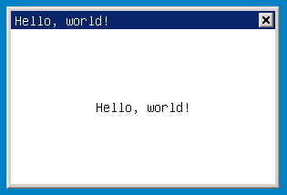
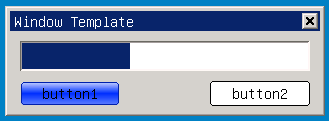
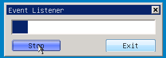
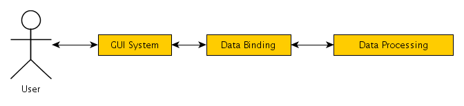
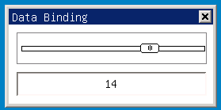
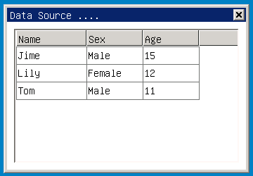

# 快速入门

## 1 mGNCS 的 helloworld 程序

mGNCS 对 MiniGUI 的主窗口进行了包装，把它纳入到控件体系之内，所以，整个编程将变得非常的简单和易学。请看下面基于 mGNCS 的 helloworld 程序源代码：

__清单 1__  `helloworld.c`

```c
/*
** helloworld.c: Sample program for mGNCS Programming Guide
**      The first mGNCS application.
**
** Copyright (C) 2009 ~ 2019 FMSoft Technologies.
*/

#include <stdio.h>
#include <stdlib.h>
#include <string.h>

// START_OF_INCS
#include <minigui/common.h>
#include <minigui/minigui.h>
#include <minigui/gdi.h>
#include <minigui/window.h>

#include <mgncs/mgncs.h>
// END_OF_INCS

// START_OF_HANDLERS
static void mymain_onPaint (mWidget *_this, HDC hdc, const CLIPRGN* inv)
{
    RECT rt;
    GetClientRect (_this->hwnd, &rt);
    DrawText (hdc, "Hello, world!", -1, &rt, DT_SINGLELINE|DT_CENTER|DT_VCENTER);
}

static BOOL mymain_onClose (mWidget* _this, int message)
{
    DestroyMainWindow (_this->hwnd);
    return TRUE;
}

static NCS_EVENT_HANDLER mymain_handlers [] = {
    {MSG_PAINT, mymain_onPaint},
    {MSG_CLOSE, mymain_onClose},
    {0, NULL}
};
// END_OF_HANDLERS

int MiniGUIMain (int argc, const char* argv[])
{
    MSG Msg;

    ncsInitialize ();

    mWidget* mymain = ncsCreateMainWindow (
        NCSCTRL_MAINWND, "Hello, world!",
        WS_CAPTION | WS_BORDER | WS_VISIBLE,
        WS_EX_NONE,
        1,
        0, 0, 300,200,
        HWND_DESKTOP,
        0, 0,
        NULL,
        NULL,
        mymain_handlers,
        0);

// START_OF_MSGLOOP
    while (GetMessage (&Msg, mymain->hwnd)) {
        TranslateMessage (&Msg);
        DispatchMessage (&Msg);
    }
// END_OF_MSGLOOP

    MainWindowThreadCleanup (mymain->hwnd);

    ncsUninitialize ();

    return 0;
}
```

该程序在屏幕上创建一个 300x200 的主窗口并显示“Hello, world!”：



__图 1__  helloworld 程序的输出

### 1.1 头文件

helloworld.c 除了要包含 MiniGUI 的四个头文件（`<minigui/common.h>`、`<minigui/minigui.h>`、`<minigui/gdi.h>` 和 `<minigui/window.h>`）外，还要包含自己特有的文件：

- `<mgncs/mgncs.h>`：mGNCS 头文件

所以，通常的情况下一个 mGNCS 程序的头文件为：

```c
#include <minigui/common.h>
#include <minigui/minigui.h>
#include <minigui/gdi.h>
#include <minigui/window.h>

#include <mgncs/mgncs.h>
```

### 1.2 创建主窗口

和普通的 MiniGUI 程序一样，mGNCS 程序的入口点也是 `MiniGUIMain`，但是，在使用 mGNCS 之前，必须先调用 `ncsInitialize` 来向 MiniGUI 注册 NCS 的控件：

```c
    ncsInitialize ();
```

之后，就可以通过调用 `ncsCreateMainWindow` 函数直接创建一个主窗口。该函数的参数比较多，但是创建默认窗口可以使用大量默认参数：

```c
    mWidget* mymain = ncsCreateMainWindow (
        NCSCTRL_MAINWND,    // 主窗口的类名，NCS 控件类名宏以 NCSCTRL_ 开头
         "Hello World!",     // 指定主窗口的标题文本
         WS_CAPTION | WS_BORDER | WS_VISIBLE, // 指定窗口风格，创建一个有标题栏和边框的、且可见的窗口
         WS_EX_NONE,         // 指定主窗口的扩展风格，用 0 或者 WS_EX_NONE 表示没有扩展风格
         1,                  // 指定主窗口的标识值, 任意 >0 的整数值
         0, 0, 300, 200,     // 指定主窗口的位置和大小，依次是 x, y, width, height
        HWND_DESKTOP,       // 指定主窗口的宿主，一般为 HWND_DESKTOP
        0, 0,               // 主窗口的图标和菜单栏句柄，默认为空
         NULL,               // 指定主窗口的初始属性信息，默认为空
         NULL,               // 指定主窗口的初始渲染器信息，默认为空
         mymain_handlers,    // 指定主窗口的事件处理器，见下节
         0);                 // 指定主窗口的附加数据，这里为 0
```

上文中最重要的参数是事件处理器。

`ncsCreateMainWindow` 函数返回的是一个窗口对象指针（`mWidget*`），该对象被设置为控件基类的指针，以便用户使用。

`mWidget` 结构提供了一个 hwnd 数据成员，是和窗口对象关联的窗口句柄，用户可以直接使用该句柄调用对应的 MiniGUI API。

### 1.3 事件处理器

使窗口操作，就必须响应窗口的消息。NCS 提供了一个映射机制，将一个事件（消息或者通知码）和一个回调函数关联起来。不同事件的回调函数格式是不一样的，NCS 已经为每种事件事先定义好了接口，以方便使用。

多个映射可以放到一个 `NCS_EVENT_HANDLER` 数组中（该数组以 {0,NULL} 为结束），在创建窗口时传递给控件。

在该例子中，我们主要关注两个消息事件：

- `MSG_PAINT`
- `MSG_CLOSE`

这两个消息分别对应的事件处理器原型是：

```c
 /**
 * \typedef void (*NCS_CB_ONPAINT)(mWidget*, HDC hdc, const PCLIPRGN clip_rgn);
 * \brief the callback of event MSG_PAINT
 *
 * \param mWidget * sender pointer
 * \param hdc the DC for painting
 * \param clip_rgn invlidate region
 *
 */
typedef void (*NCS_CB_ONPAINT)(mWidget*, HDC hdc, const PCLIPRGN clip_rgn);

/**
 * \typedef  BOOL (*NCS_CB_ONCLOSE)(mWidget*);
 * \brief the callback of event MSG_CLOSE
 *
 * \param mWidget* the sender pointer
 *
 * \return TRUE - about the message process, FALSE - continue default processing
 */
typedef BOOL (*NCS_CB_ONCLOSE)(mWidget*);
```

所以，我们定义这两个函数，并建立事件和事件处理器的映射数组：

```c
// START_OF_HANDLERS
static void mymain_onPaint (mWidget *_this, HDC hdc, const CLIPRGN* inv)
{
        RECT rt;
        GetClientRect (_this->hwnd, &rt);
        DrawText (hdc, "Hello, world!", -1, &rt, DT_SINGLELINE|DT_CENTER|DT_VCENTER);
}

static BOOL mymain_onClose (mWidget* _this, int message)
{
        DestroyMainWindow (_this->hwnd);
        return TRUE;
}

static NCS_EVENT_HANDLER mymain_handlers [] = {
        {MSG_PAINT, mymain_onPaint},
        {MSG_CLOSE, mymain_onClose},
        {0, NULL}
};
// END_OF_HANDLERS
```

可以看到，同 MiniGUI 普通程序相比，mGNCS 避免了多层的 switch-case 嵌套语句的使用，让开发者免于记忆复杂的 `WPARAM` 和 `LPARAM` 含义和事件处理过程返回值的含义。

如果使用 mStudio，上述代码可被自动生成，用户要做的，就是实现对应事件处理器（回调函数）。

### 1.4 消息循环

最后，要让程序运行起来，需要一个消息循环，同普通的 MiniGUI 编程一样：

```c
// START_OF_MSGLOOP
while (GetMessage (&Msg, mymain->hwnd)) {
        TranslateMessage (&Msg);
        DispatchMessage (&Msg);
}
// END_OF_MSGLOOP
```

### 1.5 创建模态主窗口

我们知道，主窗口有模态和非模态之分，上面的示例程序建立了一个标准的非模态主窗口，如果我们希望创建模态主窗口，只需用 doModal 方创替代现有的消息循环即可，如下所示：

```c
// START_OF_MINIGUIMAIN
int MiniGUIMain (int argc, const char* argv[])
{
        ncsInitialize ();
        
        mMainWnd* mymain = (mMainWnd*) ncsCreateMainWindow (
        NCSCTRL_MAINWND, "Hello, world!",
        WS_CAPTION | WS_BORDER | WS_VISIBLE,
        WS_EX_NONE,
        1, 
        0, 0, 300, 200,
        HWND_DESKTOP,
        0, 0,
        NULL,
        NULL,
        mymain_handlers,
        0);
        
        _c(mymain)->doModal (mymain, TRUE);
        
        ncsUninitialize ();
        
        return 0;
}
// END_OF_MINIGUIMAIN
```

上述代码中，

- `_c` 宏的作用是取出 `mymain` 保存的类结构体（`mMainWndClass`）指针，因为 `doModal `是 `mMainWnd` 类的一个虚函数，保存在虚函数表（`mMainWndClass` 的实例）中。
- `doModal` 方法第一个参数为 `mMainWnd* self`，和 C++ 中的 this 指针类似；第二个参数 `BOOL autoDestroy`，告诉 `doModal` 方法，是否自动删除对话框对象。当该参数 `TRUE` 时。调用完 `doModal` 后，`mymain` 就会被释放，不能使用了。

## 2 更进一步使用模板创建主窗口和控件

我们知道 MiniGUI 提供对话框模版的功能，使用模版，可以将控件和主窗口用数据结构的形式定义出来，从而帮助简化应用程序的编写。NCS 在 MiniGUI 基础上定义了包含更多信息的窗口模板结构，相对于 MiniGUI 的 `DLGTEMPLATE` 来说，要复杂一些，但更方便编程。需要注意的是，NCS 的窗口模版通常是由 mStudio 根据用户设计的 UI 而自动生成的。更加复杂的窗口模版结构将帮助 NCS 更好地从 mStudio 生成的资源文件中加载窗口。尽管模板不是针对开发者的，但我们也需要了解窗口模板的定义和使用方法。

清单 3 中的代码展示了如何用模板创建一个如下图所示的对话框，并展示了如何使用属性和渲染器。



__图 2__  使用窗口模版创建的对话框

__清单 3__ `wnd_template.c`

```c
/*
** $Id$
**
** Listing P2C1.3
**
** wnd_template.c: Sample program for mGNCS Programming Guide
**      Using window template.
**
** Copyright (C) 2009 Feynman Software.
*/

#include <stdio.h>
#include <stdlib.h>
#include <string.h>

#include <minigui/common.h>
#include <minigui/minigui.h>
#include <minigui/gdi.h>
#include <minigui/window.h>
#include <minigui/control.h>

#include <mgncs/mgncs.h>

#define ID_BTN  101
#define ID_PROG 200

// START_OF_HANDLERS
static BOOL mymain_onCreate (mWidget* _this, DWORD add_data)
{
        SetTimer (_this->hwnd, 100, 20);
        return TRUE;
}

// START_OF_ONTIMER
static void mymain_onTimer (mWidget *_this, int id, DWORD count)
{
        static int pb_pos = 0;
        mProgressBar *pb = (mProgressBar*)ncsGetChildObj (_this->hwnd, ID_PROG);
        if (pb)
        _c(pb)->setProperty(pb, NCSP_PROG_CURPOS, pb_pos++);
}
// END_OF_ONTIMER

static void mymain_onClose (mWidget* _this, int message)
{
        DestroyMainWindow (_this->hwnd);
        PostQuitMessage (_this->hwnd);
}

static NCS_EVENT_HANDLER mymain_handlers[] = {
        {MSG_CREATE, mymain_onCreate},
        {MSG_CLOSE, mymain_onClose},
        {MSG_TIMER, mymain_onTimer},
        {0, NULL}
};
// END_OF_HANDLERS

// START_OF_RDRINFO
static NCS_RDR_ELEMENT btn_rdr_elements[] = 
{
        { NCS_MODE_USEFLAT, 1},
        { -1, 0 }
};

static NCS_RDR_INFO btn1_rdr_info[] =
{
        {"fashion","fashion", btn_rdr_elements}
};

static NCS_RDR_INFO btn2_rdr_info[] =
{
        {"flat", "flat", NULL}
};
// END_OF_RDRINFO

// START_OF_PROPERTIES
static NCS_PROP_ENTRY progress_props [] = {
        {NCSP_PROG_MAXPOS, 100},
        {NCSP_PROG_MINPOS, 0 },
        {NCSP_PROG_LINESTEP, 1},
        {NCSP_PROG_CURPOS, 0 },
        { 0, 0 }
};
// END_OF_PROPERTIES

// START_OF_TEMPLATE
static NCS_WND_TEMPLATE _ctrl_templ[] = {
        {
                NCSCTRL_PROGRESSBAR, 
                ID_PROG,
                10, 10, 290, 30,
                WS_BORDER | WS_VISIBLE,
                WS_EX_NONE,
                "",
                progress_props,
                NULL,
                NULL, NULL, 0, 0
        },
        {
                NCSCTRL_BUTTON, 
                ID_BTN,
                10, 50, 100, 25,
                WS_BORDER | WS_VISIBLE,
                WS_EX_NONE,
                "button1",
                NULL,
                btn1_rdr_info,
                NULL, NULL, 0, 0
        },
        {
                NCSCTRL_BUTTON, 
                ID_BTN,
                200, 50, 100, 25,
                WS_VISIBLE,
                WS_EX_NONE,
                "button2",
                NULL,
                btn2_rdr_info,
                NULL, NULL, 0, 0
        },
        
};

static NCS_MNWND_TEMPLATE mymain_templ = {
        NCSCTRL_DIALOGBOX, 
        1,
        0, 0, 320, 110,
        WS_CAPTION | WS_BORDER | WS_VISIBLE,
        WS_EX_NONE,
        "Window Template",
        NULL,
        NULL,
        mymain_handlers,
        _ctrl_templ,
        sizeof(_ctrl_templ)/sizeof(NCS_WND_TEMPLATE),
        0,
        0, 0,
};
// END_OF_TEMPLATE

int MiniGUIMain (int argc, const char* argv[])
{
        ncsInitialize ();
        
        mDialogBox* mydlg = (mDialogBox *)ncsCreateMainWindowIndirect 
        (&mymain_templ, HWND_DESKTOP);
        
        _c(mydlg)->doModal (mydlg, TRUE);
        
        ncsUninitialize ();
        
        return 0;
}
```

这个程序定义了含有三个控件的一个对话框：

- 上边的进度条，其最大、最小值是在初始化时设置；其当前位置会被定时刷新；
- 左边的按钮，使用了 Fashion 渲染器，以默认属性绘制；
- 右边的按钮，使用了 Flat 渲染器，以默认属性绘制。

### 2.1 模板

函数 `ncsCreateMainWindowIndirect` 根据模版创建对应的主窗口，在上面的程序中，这个模板是 `mymain_templ`。`mymain_templ` 的类型是 `NCS_MAINWND_TEMPLATE`，其中有个一个指针指向子控件的模板结构数组（`NCS_WND_TEMPLAT*`）。`NCS_WND_TEMPLATE` 和 `NCS_MAINWND_TEMPLATE` 的差别在于前者没有 `HICON` 和 `HMENU` 这种专门用于主窗口的数据成员。

`mymain_templ` 的声明如下：

```c
static NCS_MAINWND_TEMPLATE mymain_templ = {
    NCSCTRL_DIALOGBOX,              // 窗口类名，这里取 NCSCTRL_DIALOGBOX
    1,                              // 窗口标示符
    0, 0, 320, 110,                 // 窗口位置和尺寸
    WS_CAPTION | WS_BORDER | WS_VISIBLE,   // 窗口风格
    WS_EX_NONE,                     // 窗口的扩展风格
    "Window Template",              // 窗口标题
    NULL,                           // 初始化属性
    NULL,                           // 渲染器信息
    mymain_handlers,                // 窗口事件处理器
    _ctrl_templ,                    // 子窗口模版结构数组指针
    sizeof(_ctrl_templ)/sizeof(NCS_WND_TEMPLATE),   // 子窗口个数
    0, 0, 0                         // 窗口附加数据、图标句柄及菜单栏句柄
};
```

需要注意的是：`NCS_WND_TEMPLATE` 也包含一个指向子控件模版结构数组的指针成员，这样可以形成多级的嵌套模版。

### 2.2 设置窗口属性

在这个示例中，我们通过 `NCS_PROP_ENTRY` 结构数组定义了进度条控件的初始属性值，这包括：

- 进度条的最大值；
- 进度条的最小值；
- 进度条的步进值；
- 进度条的初始位置。

具体代码如下：

```c
static NCS_PROP_ENTRY progress_props [] = {
        {NCSP_PROG_MAXPOS, 100},
        {NCSP_PROG_MINPOS, 0 },
        {NCSP_PROG_LINESTEP, 1},
        {NCSP_PROG_CURPOS, 0 },
        { 0, 0 }
};
```

注意上述结构数组中的最后一个成员 {0, 0}，NCS 通过定义一个全零的结构来表示属性信息的结束。

在定义控件时，将上述属性结构数组的指针赋予对应的窗口模版属性成员即可，如下所示：

```c
static NCS_WND_TEMPLATE _ctrl_templ[] = {
    {
        NCSCTRL_PROGRESSBAR, 
        ID_PROG,
        10, 10, 290, 30,
        WS_BORDER | WS_VISIBLE,
        WS_EX_NONE,
        "",
        progress_props,
        NULL,
        NULL, NULL, 0, 0
    },
    ...
};
```

如果使用 MiniGUI 固有控件集，要实现这种功能，必须在对话框的 `MSG_INITDIALOG` 消息中调用 `SendMessage` 来实现。而在新控件集中，只需要设置一个 `NCS_PROP_ENTRY` 数组，既可自动实现该功能。它不仅仅为了减少代码量，简化编程，更重要的是，提供了一个统一的接口。用户可以通过这种接口，把初始信息统一存放在外部文件中；NCS 的资源管理模块就可以完成类似的功能，且 mStudio 即利用了这种便利性。

### 2.3 动态设置属性

属性的设置也可以在程序运行过程中动态设置。通过 `mComponentClass`（这是可见组件，即控件和不可见组件的基类）的 `setProperty` （被其子类继承并实现）就可实现。类似地，还有 `getProperty` 方法，用于获取给定属性的值。这两个方法的原型如下：

```c
    BOOL (*setProperty) (clss *self, int id, DWORD value);
    DWORD (*getProperty) (clss *self, int id);
```

需要注意的是，所有的属性值都被定义成了 `DWORD` 类型，这个类型是个 32 位的值，可用来存储句柄、指针、整数值等等。

这整个示例程序中，我们创建了一个定时器来周期性地设置进度条的当前位置属性。在定时器的处理函数中做如下代码调用：

```c
static void mymain_onTimer (mWidget *_this, int id, DWORD count)
{
        static int pb_pos = 0;
        mProgressBar *pb = (mProgressBar*)ncsGetChildObj (_this->hwnd, ID_PROG);
        if (pb)
        _c(pb)->setProperty(pb, NCSP_PROG_CURPOS, pb_pos++);
}
```

## 3 使用渲染器

渲染器是新控件集的一大特色。它的主要功能有

   1. 在不更改控件的内部逻辑实现的基础上，对控件的外观做定制
   2. 渲染器随控件的种类变化而变化，新增、删除一种控件不会对其他控件造成影响，这一点和老控件集的渲染器不同

作为控件的使用者，开发者不需要实现一个完整的渲染器，而只需要使用应有的渲染器。上面的例子使用了和窗口模版类似的方法来定义一个控件所使用的渲染器信息：

```c
static NCS_RDR_ELEMENT btn_rdr_elements[] = 
{
        { NCS_MODE_USEFLAT, 1},
        { -1, 0 }
};

static NCS_RDR_INFO btn1_rdr_info[] =
{
        {"fashion","fashion", btn_rdr_elements}
};

static NCS_RDR_INFO btn2_rdr_info[] =
{
        {"flat", "flat", NULL}
};
```

- `btn_rdr_elements` 定义了渲染器的属性数组。渲染器属性和控件的属性类似，其机制是完全一样的。它以 {-1,0} 为数组的结束，其中 `NCS_MODE_USEFLAT` 属性指出 Fashion 渲染器使用平坦风格（相对的，3D 风格下有明显的立体感）绘制一个对象。

- `btn1_rdr_info` 的 `NCS_RDR_INFO`，指出控件使用的渲染器类型及其属性列表。`NCS_RDR_INFO` 的定义如下：

```c
/**
 * A renderer element struct
 *
 * \note This struct is used by \ref NCS_RDR_INFO when create a NCS widget
 *
 * \sa NCS_RDR_INFO
 */
typedef struct _NCS_RDR_ELEMENT {
    /**
  - The renderer element id
  -/
    int id;
    /**
  - The remderer element value
  -/
    DWORD value;
}NCS_RDR_ELEMENT;

/**
 * A struct used to include all the renderer info when create a widget
 * 
 * \sa NCS_CREATE_INFO, NCS_MAIN_CREATE_INFO, NCS_WND_TEMPLATE, 
 *     NCS_MAINWND_TEMPLATE
 */
typedef struct _NCS_RDR_INFO {
    /**  
  - The global renderer, the minigui 3.0 defined renderer
  -/
    const char* glb_rdr;
    /**  
  - The control renderer, defined by NCS
  -/
    const char* ctl_rdr;
    /**  
  - The Renderer element array, end by  { -1, 0} 
  -/
    NCS_RDR_ELEMENT* elements;
}NCS_RDR_INFO; 
```

其中，
- `glb_rdr` 指全局渲染器，主要用于非客户区的绘制风格，这些区域由 MiniGUI 负责绘制。
- `ctrl_rdr` 指控件渲染器，则主要用于控件本身的绘制。

`NCS_RDR_INFO` 可以在模板中给出，从而可以直接创建出使用给定渲染器的控件来。

## 4 事件监听和连接

mGNCS 提供了一种类似 QT 的 signal 和 slot 的机制，能够把一个对象的事件链接到任意一个对象上。

### 4.1 基本原理

mGNCS 的事件监听链接机制提供了一种将事件发送者和事件关心者解耦的方式。它通过全局数据表，把发送者和接收者的关系对应起来。如下图所示： 



__图 3__  事件监听和连接

当一个对象被删除时：

- 所有监听该对象的连接将被删除
- 该对象所监听的连接也将被删除

### 4.2 主要接口函数

下面给出了添加事件监听器的接口：

```c
/**
 * \typedef typedef BOOL (*NCS_CB_ONOBJEVENT) (mObject* self, mObject *sender, 
                          int event_id, DWORD param);
 * \brief The callback of connection
 *
 * \note For widgets, only support notification
 *
 * \param self  The listener pointer
 * \param sender The sender of event
 * \param event_id the id of event
 * \param param the param of event
 *
 * \return TRUE - continue dispatch the event; FALSE - stop the event.
 */
typedef BOOL (*NCS_CB_ONOBJEVENT)(mObject* self, mObject *sender, 
                                  int event_id, DWORD param);

#define NCS_CB_ONPIECEEVENT NCS_CB_ONOBJEVENT

/**
 * \fn BOOL ncsAddEventListener(mObject *sender, \
 * 					mObject* listener, \
 * 					NCS_CB_ONOBJEVENT event_proc, \
 * 					int event_id);
 * \brief connect sender object to listener object
 * 
 * \param sender The sender of event
 * \param listener The listener of event
 * \param event_proc The processing callback of event
 * \param event_id The id of event
 *
 * \return TRUE - Sucessed, FALSE - Failed
 * 
 * \sa ncsAddEventListener, ncsAddEventListeners, NCS_CB_ONOBJEVENT
 */
BOOL ncsAddEventListener(mObject *sender,
	mObject* listener,
	NCS_CB_ONOBJEVENT event_proc,
	int event_id);

/**
 * BOOL ncsAddEventListeners(mObject *sender,\
 * 					mObject* listener,\
 * 					NCS_CB_ONOBJEVENT event_proc,\
 * 					int* event_ids);
 * \brief connect a group of events from sender to listener
 *
 * \param sender The sender of events
 * \param listener The listener of events
 * \param event_proc The processing callback of events
 * \param event_ids The id array of events, end by 0
 *
 * \return TRUE - Sucessed, FALSE - Failed
 * 
 * \sa ncsAddEventListener, ncsAddEventListeners, NCS_CB_ONOBJEVENT
 */
BOOL ncsAddEventListeners(mObject *sender,
	mObject* listener,
	NCS_CB_ONOBJEVENT event_proc,
	int* event_ids);
```

其中，
- 回调 `NCS_CB_ONOBJEVENT` 定义了事件的处理函数，该回调能够同时获取发送者和接收者的对象指针，避免用户去查找
- `ncsAddEventListeners` 增加一个对像对另外一个对象的一组事件的监听
- `ncsAddEventListener` 增加一个对象对另外一个对象的单个事件的监听

下面给出了删除事件监听器的接口：

```c
/**
 * \fn BOOL ncsRemoveEventListener(mObject * listener);
 * \brief remove the connections which are listened by the object
 *
 * \note this function is called when a listener is destroied
 *
 * \param listener the object pointer of listener
 *
 * \return TRUE - sucessed; FALSE - failed
 */
BOOL ncsRemoveEventListener(mObject * listener);

/**
 * \fn BOOL ncsRemoveEventSource(mObject *sender);
 * \brief remove the connections when a sender is destroied
 *
 * \note this function is called when a sender is destroied
 *
 * \param sender the sender of events
 *
 * \return TRUE - sucessed; FALSE - failed
 */
BOOL ncsRemoveEventSource(mObject *sender);
```

其中，
- 删除一个监听者或者事件发送者。因为只要监听者或者发送者有一个不存在，整个连接就没有存在的意义，都会被删除。
- 这两个函数由 `mObject` 自动调用，一般情况下不需要主动调用


下面给出了激发一个事件连接的接口：

```c
/**
 * \fn void ncsRaiseEvent (mObject *sender, int event_id, DWORD param);
 * \biref Raise an event to listeners
 *
 * \note It will call the callback of \ref NCS_CB_ONOBJEVENT 
 *       added by \ref ncsAddEventListeners, or \ref ncsAddEventListener
 *
 * \param sender event sender
 * \param event_id the id of event
 * \param param the event param
 *
 * \sa NCS_CB_ONOBJEVENT, ncsAddEventListener, ncsAddEventListeners
 */
void ncsRaiseEvent(mObject *sender, int event_id, DWORD param);
```

该函数主要为内部使用，用于激发一个事件连接。该接口仅在用户希望手动强制引发事件，或者编写 NCS 控件时使用。

### 4.3 用法及示例

我们将在窗口模版示例程序的基础上，增加如下两个事件监听器：

- 单击 Stop 按钮时，将通过关闭定时器来停止进度条的自动更新；
- 单击 Exit 按钮时，将关闭整个对话框。

该程序创建的窗口效果如下图所示：


__图 4__  监听事件示例

以下代码定义了两个监听器，分别用于 Stop 按钮和 Exit 按钮：

```c
static BOOL mymain_onExit (mMainWnd *self, mButton *sender, int id, DWORD param)
{
        mymain_onClose ((mWidget*)self, MSG_CLOSE);
        return TRUE;
}

static BOOL mymain_onStop (mMainWnd *self, mButton *sender, int id, DWORD param)
{
        KillTimer (self->hwnd, 100);
        return TRUE;
}
```

这两个事件监听器在初始化窗口时，被连接到上述两个控件的单击事件上：

```c
static BOOL mymain_onCreate (mWidget* self, DWORD addData)
{
        mButton *btn;
        
        btn = (mButton*)_c(self)->getChild (self, IDC_EXIT);
        ncsAddEventListener ((mObject*)btn, (mObject*)self, 
        (NCS_CB_ONOBJEVENT)mymain_onExit, NCSN_WIDGET_CLICKED); 
        
        btn = (mButton*)_c(self)->getChild (self, IDC_STOP);
        ncsAddEventListener ((mObject*)btn, (mObject*)self, 
        (NCS_CB_ONOBJEVENT)mymain_onStop, NCSN_WIDGET_CLICKED); 
        
        SetTimer (self->hwnd, 100, 20);
        return TRUE;
}

static void mymain_onTimer (mWidget *self, int id, DWORD count)
{
        static int pb_pos = 0;
        mProgressBar *pb = (mProgressBar*)ncsGetChildObj (self->hwnd, IDC_PROG);
        if (pb)
        _c(pb)->setProperty (pb, NCSP_PROG_CURPOS, pb_pos++);
}

static void mymain_onClose (mWidget* self, int message)
{
        DestroyMainWindow (self->hwnd);
        PostQuitMessage (self->hwnd);
}

static NCS_EVENT_HANDLER mymain_handlers[] = {
        {MSG_CREATE, mymain_onCreate},
        {MSG_CLOSE, mymain_onClose},
        {MSG_TIMER, mymain_onTimer},
        {0, NULL}
};
```

显然，事件监听器机制为新控件集的编程带来了更多方便，也方便 mStudio 工具实现可视化编程。

## 5 数据绑定和数据源

数据绑定和数据源是 mGNCS 提供给应用程序的两个非常重要的机制，这两个机制均有助于实现程序逻辑和它所处理的数据之间的分离，且便于类似 mStudio 这样的可视化 GUI 设计工具来设计界面。本章将简单说明数据绑定和数据源的基本概念，后面的章节将详细讲述相关的接口及使用方法。

如果读者曾经使用 Visual Studio 开发过基于 MFC 的 C++ 应用程序的话，则一定记得这个工具提供一种机制，可以将对话框中的控件内容和给定的类成员变量绑定起来。在 VC 中，对话框控件的初始化值，可以从绑定的对话框成员变量中自动获得并设置好，而当对话框退出时，控件中的值又可以自动赋值给对应的对话框类成员变量。这就是 mGNCS 提供的数据源和数据绑定功能的思想来源。但是，mGNCS 提供的数据源和数据绑定功能更加强大。利用 mGNCS 的数据绑定功能，当 mGNCS 控件的值发生变化时，我们可以自动更新其他控件，或者将数据再次保存到期望的数据源中；通过 mGNCS 的数据源，我们可以定义不同格式的数据来源，如程序定义的字符串数组、文本文件、配置文件，甚至数据库等等，并使用这些数据自动填充到 mGNCS 控件中。

下边我们分别介绍 mGNCS 的数据绑定和数据源功能。

### 5.1 数据绑定

如果我们试图寻找图形用户界面和字符用户界面的相同点，我们会发现，它们都属于人机交互范畴，而人机交互的本质就是数据以人能够理解的方式和计算机能够理解的方式之间进行转换。注意以上的表述有三个关键词： 

- 数据
- 人能够理解的方式
- 计算机能够理解的方式
 
我们知道，计算的本质是对数据的计算，数据是一切计算的核心；所谓方式，对计算机来讲就是数据的格式。人机界面通过显示特定格式的数据和人交互，而计算机在进行内部运算时，却希望以它能够理解的格式计算。当这两种格式不匹配时，我们该怎么办？其答案就是数据绑定。下图给出了 NCS 数据绑定的模型：



__图 5__  mGNCS 的数据绑定模型

数据绑定在图形用户界面和内部逻辑之间传递数据，其优点是： 

- 解耦图形用户界面和内部逻辑的处理，使开发人员更易于更换界面 
- 规范化和模块化应用程序，提高程序的可扩展性 
- 简化编程，把程序员从繁琐的 Get/Set 操作中解脱出来 
- 统一接口，有利于 mStudio 等工具进行可视化的操作，也有利于用户抽象
 
其缺点是需要额外的开销，不过，操作界面的代码本身也会带来开销，两者相抵，使用数据绑定是十分合算的。

清单 5 给出了一个简单的数据绑定示例程序，这个程序的界面如下图所示：



__图 6__  数据绑定示例程序

该程序将编辑框中的内容和拖动条的位置绑定在了一起：

- 拖动拖动条，编辑框中的内容将自动改变，以反映当前的拖动条位置；
- 在编辑框中键入一个整数值（0~20），则拖动条的当前位置也将发生对应的变化。

__清单 5__ `data_binding.c`

```c
/*
** $Id$
**
** Listing P2C1.5
**
** data_binding.c: Sample program for mGNCS Programming Guide
**      Using data binding.
**
** Copyright (C) 2009 Feynman Software.
*/

#include <stdio.h>
#include <stdlib.h>
#include <string.h>

#include <minigui/common.h>
#include <minigui/minigui.h>
#include <minigui/gdi.h>
#include <minigui/window.h>

#include <mgncs/mgncs.h>

#define IDC_TRACKBAR     101
#define IDC_SLEDIT       102

// START_OF_BINDING
static BOOL mymain_onCreate (mWidget* self, DWORD add_data)
{
        mTrackBar * tb = (mTrackBar*)_c(self)->getChild (self, IDC_TRACKBAR);
        mSlEdit   * se = (mSlEdit*) _c(self)->getChild (self, IDC_SLEDIT);
        
        ncsConnectBindProps (NCS_CMPT_PROP (tb, NCSN_TRKBAR_CHANGED, 
        NCSP_TRKBAR_CURPOS, NCS_BT_INT, 
        NCS_PROP_FLAG_READ|NCS_PROP_FLAG_WRITE),
        NCS_CMPT_PROP (se, NCSN_EDIT_CHANGE, 
        NCSP_WIDGET_TEXT, NCS_BT_STR, 
        NCS_PROP_FLAG_READ|NCS_PROP_FLAG_WRITE),
        NCS_BPT_DBL);
        
        ncsAutoReflectObjectBindProps ((mObject*)se);
        return TRUE;
}
// END_OF_BINDING

static void mymain_onClose (mWidget* self, int message)
{
        DestroyMainWindow (self->hwnd);
        PostQuitMessage (self->hwnd);
}

static NCS_EVENT_HANDLER mymain_handlers[] = {
        {MSG_CREATE, mymain_onCreate },
        {MSG_CLOSE, mymain_onClose },
        {0, NULL }
};

static NCS_PROP_ENTRY trackbar_props [] = {
        {NCSP_TRKBAR_MINPOS, 0},
        {NCSP_TRKBAR_MAXPOS, 20},
        {NCSP_TRKBAR_CURPOS, 10},
        {NCSP_TRKBAR_LINESTEP, 2},
        {NCSP_TRKBAR_PAGESTEP, 5},
        {0, 0}
};

static NCS_RDR_INFO trackbar_rdr_info[] =
{
        {"flat", "flat", NULL},
};

static NCS_WND_TEMPLATE _ctrl_templ[] = {
        {
                NCSCTRL_TRACKBAR, 
                IDC_TRACKBAR,
                10, 10, 240, 40,
                WS_BORDER | WS_VISIBLE | NCSS_TRKBAR_NOTICK | NCSS_NOTIFY,
                WS_EX_TRANSPARENT,
                "",
                trackbar_props,
                trackbar_rdr_info,
                NULL, NULL, 0, 0,
                MakeRGBA(255,0,0,255)
        },
        {
                NCSCTRL_SLEDIT, 
                IDC_SLEDIT,
                10, 60, 240, 30,
                WS_BORDER | WS_VISIBLE | NCSS_EDIT_CENTER | NCSS_NOTIFY,
                WS_EX_NONE,
                "edit",
                NULL, NULL, NULL, NULL, 0, 0
        },
};

static NCS_MNWND_TEMPLATE mymain_templ = {
        NCSCTRL_DIALOGBOX, 
        1,
        0, 0, 268, 130,
        WS_CAPTION | WS_BORDER | WS_VISIBLE,
        WS_EX_NONE,
        "Data Binding",
        NULL,
        NULL,
        mymain_handlers,
        _ctrl_templ,
        sizeof(_ctrl_templ)/sizeof(NCS_WND_TEMPLATE),
        0,
        MakeRGBA(255,255,255,255)
};

int MiniGUIMain(int argc, const char* argv[])
{
        mDialogBox* mydlg;
        
        if (argc > 1) {
                trackbar_rdr_info[0].glb_rdr = argv[1];
                trackbar_rdr_info[0].ctl_rdr = argv[1];
        }
        
        ncsInitialize ();
        
        mydlg = (mDialogBox *)ncsCreateMainWindowIndirect 
        (&mymain_templ, HWND_DESKTOP);
        
        _c(mydlg)->doModal (mydlg, TRUE);
        
        MainWindowThreadCleanup (mydlg->hwnd);
        
        ncsUninitialize ();
        
        return 0;
}
```

完成上述的数据绑定，该程序仅仅在创建对话框时，做了如下所示的设置工作：

```c
static BOOL mymain_onCreate (mWidget* self, DWORD add_data)
{
        mTrackBar * tb = (mTrackBar*)_c(self)->getChild (self, IDC_TRACKBAR);
        mSlEdit   * se = (mSlEdit*) _c(self)->getChild (self, IDC_SLEDIT);
        
        ncsConnectBindProps (NCS_CMPT_PROP (tb, NCSN_TRKBAR_CHANGED, 
        NCSP_TRKBAR_CURPOS, NCS_BT_INT, 
        NCS_PROP_FLAG_READ|NCS_PROP_FLAG_WRITE),
        NCS_CMPT_PROP (se, NCSN_EDIT_CHANGE, 
        NCSP_WIDGET_TEXT, NCS_BT_STR, 
        NCS_PROP_FLAG_READ|NCS_PROP_FLAG_WRITE),
        NCS_BPT_DBL);
        
        ncsAutoReflectObjectBindProps ((mObject*)se);
        return TRUE;
}
```

上面的代码段完成了两件事情：

- 调用 `ncsConnectBindProps` 函数，将拖动条的当前位置值属性（`NCSP_TRKBAR_CURPOS`）和编辑框的文本属性（`NCSP_WIDGET_TEXT`）绑定在了一起，并且当拖动条产生位置改变事件（`NCSN_TRKBAR_CHANGED`），或者编辑框产生内容改变事件（`NCSN_EDIT_CHANGE`）时触发绑定。
- 调用 `ncsAutoReflectObjectBindProps` 函数，使得编辑框可以自动响应数据绑定带来的内容改变。

假设没有数据绑定功能，我们就需要编写两个事件处理器分别响应两个控件的两个事件，而现在，一切都变得非常简单。

需要注意的是，拖动条的位置值属性是整数类型，而编辑框的内容属性是字符串类型，这两者之间的数据类型转换，将由 mGNCS 自动完成。

### 5.2 数据源

数据源就是数据的集合，通过抽象的数据源接口，我们可以为一些大型控件，如列表框、列表型等控件提供良好的数据交换机制。定义抽象的数据源接口之意义在于： 

- 统一管理数据，是界面和数据分离 
- 统一数据访问接口，便于程序的开发和维护，也便于 mStudio 工具进行可视化处理 

目前，mGNCS 实现了对如下几类数据源的支持：

- 应用程序定义的 C 语言数据，mGNCS 称为 Static Data Source（静态数据源）；
- 来自 MiniGUI 配置文件格式的文本数据；
- 来自类似 UNIX passwd 文件的以行为单位的文本域数据。

清单 6 中的代码使用 C 程序定义的静态数据初始化了一个列表项控件，如下图所示：



__图 7__  数据源示例程序

__清单 6__ `data_source.c`

```c
/*
** $Id$
**
** Listing P2C1.6
**
** data_source.c: Sample program for mGNCS Programming Guide
**      Using static data source.
**
** Copyright (C) 2009 Feynman Software.
*/

#include <stdio.h>
#include <stdlib.h>
#include <string.h>

#include <minigui/common.h>
#include <minigui/minigui.h>
#include <minigui/gdi.h>
#include <minigui/window.h>

#include <mgncs/mgncs.h>

#define IDC_LISTVIEW 100

// START_OF_DEFINEDS
static const NCS_LISTV_CLMRD _header[] = {
        {"Name", "", 100, NCSF_LSTCLM_LEFTALIGN},
        {"Sex", "", 80, NCSF_LSTCLM_LEFTALIGN},
        {"Age", "", 80, NCSF_LSTCLM_LEFTALIGN}
};

static const char* _content[][3] = {
        {"Jime", "Male", "15"},
        {"Lily", "Female", "12"},
        {"Tom", "Male", "11"}
};
// END_OF_DEFINEDS

// START_OF_SETDATA
static BOOL mymain_onCreate (mWidget* self, DWORD add_data)
{
        mListView *lv = (mListView*)_c(self)->getChild (self, IDC_LISTVIEW);
        
        if (lv) {
                mRecordSet *rs;
                rs = _c(g_pStaticDS)->selectRecordSet (g_pStaticDS, 
                "/listview/header", NCS_DS_SELECT_READ);
                _c(lv)->setSpecial (lv, NCSID_LISTV_HDR, (DWORD)rs, NULL);
                rs = _c(g_pStaticDS)->selectRecordSet (g_pStaticDS, 
                "/listview/content", NCS_DS_SELECT_READ);
                _c(lv)->setSpecial (lv, NCS_CONTENT, (DWORD)rs, NULL);
        }
        
        return TRUE;
}
// END_OF_SETDATA

static void mymain_onClose (mWidget* self, int message)
{
        DestroyMainWindow (self->hwnd);
        PostQuitMessage (self->hwnd);
}

static NCS_EVENT_HANDLER mymain_handlers[] = {
        {MSG_CREATE, mymain_onCreate},
        {MSG_CLOSE, mymain_onClose},
        {0, NULL}
};

static NCS_WND_TEMPLATE _ctrl_templ[] = {
        {
                NCSCTRL_LISTVIEW, 
                IDC_LISTVIEW,
                10, 10, 320, 190,
                WS_BORDER | WS_VISIBLE | NCSS_LISTV_SORT 
                | NCSS_LISTV_LOOP,
                WS_EX_NONE,
                "",
                NULL, NULL, NULL, NULL, 0, 0
        }
};

static NCS_MNWND_TEMPLATE mymain_templ = {
        NCSCTRL_MAINWND, 
        1,
        0, 0, 350, 240,
        WS_CAPTION | WS_BORDER | WS_VISIBLE,
        WS_EX_NONE,
        "Data Source ....",
        NULL,
        NULL,
        mymain_handlers,
        _ctrl_templ,
        sizeof(_ctrl_templ)/sizeof(NCS_WND_TEMPLATE),
        0, 0, 0,
};

int MiniGUIMain (int argc, const  char* argv[])
{
        mDialogBox* mydlg;
        
        ncsInitialize ();
        
        // START_OF_REGDS
        ncsRegisterStaticData ("/listview/header", (void*)_header, 3, 
        sizeof(NCS_LISTV_CLMRD)/sizeof(DWORD), sizeof(DWORD), 
        gListVColumnRecordTypes);
        ncsRegisterStaticData ("/listview/content", (void*)_content, 3,  
        3, sizeof(char*), NULL);
        // END_OF_REGDS
        
        mydlg = (mDialogBox *)ncsCreateMainWindowIndirect 
        (&mymain_templ, HWND_DESKTOP);
        
        _c(mydlg)->doModal (mydlg, TRUE);
        
        MainWindowThreadCleanup (mydlg->hwnd);
        
        ncsUninitialize ();
        
        return 0;
}
```

要实现上面的数据源功能，该程序完成了如下三个方面的工作：

第一步，定义数据源：

```c
static const NCS_LISTV_CLMRD _header[] = {
        {"Name", "", 100, NCSF_LSTCLM_LEFTALIGN},
        {"Sex", "", 80, NCSF_LSTCLM_LEFTALIGN},
        {"Age", "", 80, NCSF_LSTCLM_LEFTALIGN}
};

static const char* _content[][3] = {
        {"Jime", "Male", "15"},
        {"Lily", "Female", "12"},
        {"Tom", "Male", "11"}
};
```

上述代码分别定义了列表型控件的表头信息以及内容数据。

第二步，注册数据源：

```c
ncsRegisterStaticData ("/listview/header", (void*)_header, 3, 
sizeof(NCS_LISTV_CLMRD)/sizeof(DWORD), sizeof(DWORD), 
gListVColumnRecordTypes);
ncsRegisterStaticData ("/listview/content", (void*)_content, 3,  
3, sizeof(char*), NULL);
```

上述代码将上述两种数据分别定义成了 “listview/header” 和 “listview/content”，在需要引用这两种数据时，使用这里给出的名称即可。

第三步，使用数据源：

```c
static BOOL mymain_onCreate (mWidget* self, DWORD add_data)
{
        mListView *lv = (mListView*)_c(self)->getChild (self, IDC_LISTVIEW);
        
        if (lv) {
                mRecordSet *rs;
                rs = _c(g_pStaticDS)->selectRecordSet (g_pStaticDS, 
                "/listview/header", NCS_DS_SELECT_READ);
                _c(lv)->setSpecial (lv, NCSID_LISTV_HDR, (DWORD)rs, NULL);
                rs = _c(g_pStaticDS)->selectRecordSet (g_pStaticDS, 
                "/listview/content", NCS_DS_SELECT_READ);
                _c(lv)->setSpecial (lv, NCS_CONTENT, (DWORD)rs, NULL);
        }
        
        return TRUE;
}
```

上述代码从数据源中获取对应的数据，然后调用列表型控件的 `setSpecificData` 方法进行设置。

## 6 小结

通过本章的学习，我们可以对 mGNCS 有一个整体的了解。相比 MiniGUI 的固有控件系统，mGNCS 重新构架了 MiniGUI 的控件体系，使之更加规范，且易于定制，另外，这种设计和针对 MiniGUI 应用开发的 mStudio 集成开发环境是相适应的，两者之间是相辅相成的关系。

相比 MiniGUI 的固有控件体系，mGNCS 引入了面向对象的设计思想，大大提高了 MiniGUI 的可定制性和可扩展性，且便于可视化设计。当然，这对应用程序开发人员来讲带来了更长的学习路径，但相信通过本编程指南的讲解，任何已经掌握 MiniGUI 应用开发的开发人员都能够快速掌握 mGNCS。当然，设计和引入 mGNCS 的初衷，是为了开发更好的设计工具，即 mStudio，而大部分功能，都可以在 mStudio 中通过可视化设计来获得。毋庸置疑，配合 mStudio 使用 mGNCS，将大大提高嵌入式图形界面应用程序的开发效率。
