# 静态框系列控件类

## 1 静态框系列简介

静态框是用来在窗口的特定位置显示数字、文字和图片等信息，比如公司简介、公司产品商标等等，是最常见的控件之一。一般来说，静态框系列的控件行是不需要对用户的输入进行动态的响应，也就是说不需要接收任何输入（如键盘鼠标等），也就没有自己的事件。

| 控件中文名称 | 控件名称（mStudio 显示名）| 用途 | NCS 类名 | 控件窗口类 ID |
|:-----------|:-----------------------|:----|:---------|:------------|
| 静态框 | Label | 显示单行或多行文本 | `mStatic` | `NCSCTRL_STATIC` |
| 图片框 | Image | 显示图片 | `mImage` | `NCSCTRL_IMAGE` |
| 矩形框 | Rectangle | 绘制矩形 | `mRect` | `NCSCTRL_RECTANGLE` |
| 分组框 | Group Box| 可包含其他控件的区域控件 | `mGroupbox` | `NCSCTRL_GROUPBOX` |
| 按钮组 | Button Group| 管理 `RadioButton`，实现单选功能 | `mButtonGroup` | `NCSCTRL_BUTTONGROUP` |
| 发光二极管标签 | `LEDLabel` | 显示类 `LED` 字符 | `mLEDLabel` | `NCSCTRL_LEDLABEL` |
| 分隔栏 | Horz/Vert Separator | 分隔线，视觉上实现区域划分 | `mSeparator` | `NCSCTRL_SEPARATOR` |

静态框系列控件的继承关系如下：

* `mStatic` 
   * `mImage`
   * `mRect`
   * `mGroupbox`
      * `mButtonGroup`
   * `mLEDLabel`
   * `mSeparator`

每种类型的静态框均继承父类的属性、事件、方法，因此在下面的介绍中将自动忽略继承的部分。

## 2 `mStatic`


* 功能：`mStatic` 是用来绘制包含文本，图片等内容的静态区域控件。
* 父类：`mWidget`
* 直接子类： 
   * `mImage`
   * `mRect`
   * `mGroupbox`
   * `mLEDLabel`
   * `mSeparator`

### 2.1 `mStatic` 风格

无

### 2.2 `mStatic`属性

| 属性名 | 类型 | 权限 | 属性说明 | 模式取值 |
|:------|:----|:-----|:-------|:--------|
| `NCSP_STATIC_ALIGN` | int | `RW` | 控件内容水平对齐模式 | `NCS_ALIGN_LEFT`, `NCS_ALIGN_RIGHT`, `NCS_ALIGN_CENTER` |
| `NCSP_STATIC_VALIGN` | int | `RW` | 控件内容垂直对齐模式 | `NCS_VALIGN_TOP`, `NCS_VALIGN_BOTTOM`, `NCS_VALIGN_CENTER` |
| `NCSP_STATIC_AUTOWRAP` | int | `RW` | 控件内容自动换行 | 1, 0 |

* `NCSP_STATIC_ALIGN`：设置控件内容为水平对齐模式，共有 3 种取值
   * `NCS_ALIGN_LEFT`：左对齐，水平对齐模式的默认取值 - 0
   * `NCS_ALIGN_RIGHT`：右对齐 - 1
   * `NCS_ALIGN_CENTER`：居中对齐 - 2
* `NCSP_STATIC_VALIGN`：设置控件内容为垂直对齐模式，共有 3 种取值
   * `NCS_VALIGN_TOP`：顶端对齐 - 0
   * `NCS_VALIGN_BOTTOM`：底端对齐，垂直对齐模式的默认取值 - 1
   * `NCS_VALIGN_CENTER`：居中对齐 - 2 
* `NCSP_STATIC_AUTOWRAP`：设置静态框内容是否为自动换行模式，0 为单行模式即关闭自动换行模式，1 为自动换行模式

开发者可以通过以下方法设置 `mStatic` 的属性

```c
//static控件属性配置
static NCS_PROP_ENTRY static1_props [] = {
    { NCSP_STATIC_ALIGN, NCS_ALIGN_CENTER },    //对齐方式
    {0, 0}
};
    ...
static NCS_PROP_ENTRY static4_props [] = {
    { NCSP_STATIC_VALIGN, NCS_VALIGN_TOP },
    {0, 0}
};
    ...
static NCS_WND_TEMPLATE _ctrl_templ[] = {
    {
        NCSCTRL_STATIC,                      //控件名称
        IDC_STATIC1+0,
        10, 10, 160, 30,                      //控件位置, 大小
        WS_BORDER | WS_VISIBLE,
        WS_EX_NONE,
        "Default Text",                  //控件内文本内容
        NULL, //props,
        NULL, //rdr_info
        NULL, //handlers,
        NULL, //controls
        0,
        0 //add data
    },
    {
        NCSCTRL_STATIC, 
        IDC_STATIC1+1,
        10, 50, 160, 30,
        WS_BORDER | WS_VISIBLE,
        WS_EX_NONE,
        "Center Text",
        static1_props, //props, 设置属性
        NULL, //rdr_info
        NULL, //handlers,
        NULL, //controls
        0,
        0 //add data
    },
    ...
```

### 2.3 `mStatic` 事件

目前静态框系列控件不响应任何事件。

### 2.4 `mStatic` 方法

无

### 2.5 `mStatic` 渲染器

无

### 2.6 `mStatic` 实例

本实例为用户演示了如何创建不同模式的静态框。

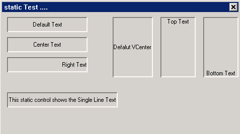

__清单 1__ static.c

```c
/*
* ** $Id$
* **
* ** Listing P2C4.1
* **
* ** static.c: Sample program for mGNCS Programming Guide
* **      A mGNCS application for mStatic.
* **
* ** Copyright (C) 2009 Feynman Software.
* */

#include <stdio.h>
#include <stdlib.h>
#include <string.h>

#include <minigui/common.h>
#include <minigui/minigui.h>
#include <minigui/gdi.h>
#include <minigui/window.h>
#include <minigui/control.h>
#include <mgncs/mgncs.h>

#define IDC_STATIC1 100
#define IDC_SATAICN 107

static BOOL mymain_onCreate(mWidget* self, DWORD add_data)
{
        //TODO : initialize
        return TRUE;
}

static void mymain_onClose(mWidget* self, int message)
{
        DestroyMainWindow(self->hwnd);
        PostQuitMessage(0);
}


//Propties for
static NCS_PROP_ENTRY static1_props [] = {
        { NCSP_STATIC_ALIGN, NCS_ALIGN_CENTER },
        {0, 0}
};
static NCS_PROP_ENTRY static2_props [] = {
        { NCSP_STATIC_ALIGN, NCS_ALIGN_RIGHT },
        {0, 0}
};
static NCS_PROP_ENTRY static4_props [] = {
        { NCSP_STATIC_VALIGN, NCS_VALIGN_TOP },
        {0, 0}
};

static NCS_PROP_ENTRY static5_props [] = {
        { NCSP_STATIC_VALIGN, NCS_VALIGN_BOTTOM },
        {0, 0}
};

static NCS_PROP_ENTRY static6_props [] = {
        { NCSP_STATIC_AUTOWRAP, 0 },
        {0, 0}
};


//Controls
static NCS_WND_TEMPLATE _ctrl_templ[] = {
        {
                NCSCTRL_STATIC , 
                IDC_STATIC1+0,
                10, 10, 160, 30,
                WS_BORDER | WS_VISIBLE,
                WS_EX_NONE,
                "Default Text",
                NULL, //props,
                NULL, //rdr_info
                NULL, //handlers,
                NULL, //controls
                0,
                0 //add data
        },
        {
                NCSCTRL_STATIC , 
                IDC_STATIC1+1,
                10, 50, 160, 30,
                WS_BORDER | WS_VISIBLE,
                WS_EX_NONE,
                "Center Text",
                static1_props, //props,
                NULL, //rdr_info
                NULL, //handlers,
                NULL, //controls
                0,
                0 //add data
        },
        {
                NCSCTRL_STATIC , 
                IDC_STATIC1+2,
                10, 90, 160, 30,
                WS_BORDER | WS_VISIBLE,
                WS_EX_NONE,
                "Right Text",
                static2_props, //props,
                NULL, //rdr_info
                NULL, //handlers,
                NULL, //controls
                0,
                0 //add data
        },
        {
                NCSCTRL_STATIC , 
                IDC_STATIC1+3,
                220, 10, 80, 120,
                WS_BORDER | WS_VISIBLE,
                WS_EX_NONE,
                "Defalut VCenter ",
                NULL, //props,
                NULL, //rdr_info
                NULL, //handlers,
                NULL, //controls
                0,
                0 //add data
        },
        {
                NCSCTRL_STATIC , 
                IDC_STATIC1+4,
                315, 10, 70, 120,
                WS_BORDER | WS_VISIBLE,
                WS_EX_NONE,
                "Top Text",
                static4_props, //props,
                NULL, //rdr_info
                NULL, //handlers,
                NULL, //controls
                0,
                0 //add data
        },
        {
                NCSCTRL_STATIC , 
                IDC_STATIC1+5,
                400, 10, 70, 120,
                WS_BORDER | WS_VISIBLE,
                WS_EX_NONE,
                "Bottom Text",
                static5_props, //props,
                NULL, //rdr_info
                NULL, //handlers,
                NULL, //controls
                0,
                0 //add data
        },
        {
                NCSCTRL_STATIC , 
                IDC_STATIC1+6,
                10, 160, 220, 30,
                WS_BORDER | WS_VISIBLE,
                WS_EX_NONE,
                "This static control shows the Single Line Text",
                static6_props, //props,
                NULL, //rdr_info
                NULL, //handlers,
                NULL, //controls
                0,
                0 //add data
        },
        
};


static NCS_EVENT_HANDLER mymain_handlers[] = {
        {MSG_CREATE, mymain_onCreate},
        {MSG_CLOSE, mymain_onClose},
        {0, NULL}
};

//define the main window template
static NCS_MNWND_TEMPLATE mymain_templ = {
        NCSCTRL_DIALOGBOX, 
        1,
        0, 0, 480, 270,
        WS_CAPTION | WS_BORDER | WS_VISIBLE,
        WS_EX_NONE,
        "static Test ....",
        NULL,
        NULL,
        mymain_handlers,
        _ctrl_templ,
        sizeof(_ctrl_templ)/sizeof(NCS_WND_TEMPLATE),
        0,
        0, 0,
};

int MiniGUIMain(int argc, const char* argv[])
{
        ncsInitialize();
        mDialogBox* mydlg = (mDialogBox *)ncsCreateMainWindowIndirect 
        (&mymain_templ, HWND_DESKTOP);
        
        _c(mydlg)->doModal(mydlg, TRUE);
        
        
        MainWindowThreadCleanup(mydlg->hwnd);
        
        ncsUninitialize ();
        return 0;
}

#ifdef _MGRM_THREADS
#include <minigui/dti.c>
#endif
```

## 3 `mImage`

 
 
* 功能: 在一区域内加载显示图片控件
* 继承自: `mStatic`
* 直接子类: 无

### 3.1 `mImage` 属性

| 属性名 | 类型 | 权限 | 属性说明 | 取值 |
|:------|:-----|:----|:-------|:-----|
| `NCSP_IMAGE_IMAGE` | `PBITMAP` | `RW` | image 控件内容图片 id，对应 mimage 中的 pbmp 图片文件指针 | 无 | 
| `NCSP_IMAGE_IMAGEFILE` | `char*` | `RW` | image 控件内容图片名字 id，对应 pbmp 图片的名字指针 | 无 |
| `NCSP_IMAGE_DRAWMODE` | enum | `RW` | image 控件绘制模式 id，对应 `mImageDrawMode` | `NCS_DM_NORMAL`, `NCS_DM_SCALED`, `NCS_DM_TILED` |
| `NCSP_STATIC_ALIGN` | int | `RW` | 设置 image 控件内容水平对齐模式 | `NCS_ALIGN_LEFT`, `NCS_ALIGN_RIGHT`, `NCS_ALIGN_CENTER` |
| `NCSP_STATIC_VALIGN` | int | `RW` | 设置 image 控件内容垂直对齐模式 | `NCS_VALIGN_TOP`, `NCS_VALIGN_BOTTOM`, `NCS_VALIGN_CENTER` |

   * `NCSP_IMAGE_DRAWMODE`：设置图片绘制模式，共有三种方式。
      * `NCS_DM_NORMAL`：按原始情况显示图片，绘制模式的默认取值 - 0
      * `NCS_DM_SCALED`： 拉伸，将图片拉伸成和以覆盖整个静态框 - 1
      * `NCS_DM_TILED`：平铺，将图片重复显示在整个静态框中 - 2
   * `NCSP_STATIC_ALIGN`：参见 `mStatic`
   * `NCSP_STATIC_VALIGN`：参见 `mStatic`

以下代码演示了如何设置绘制模式等属性

```c
static BITMAP icon;
static BITMAP bitmap;

static void set_icon_info(mWidget* self, int id, PBITMAP pbmp, int align_id, int align)
{
    mImage *img;
    img = (mImage *)ncsGetChildObj(self->hwnd, id);

    if(img){
        _c(img)->setProperty(img, NCSP_IMAGE_IMAGE, (DWORD)pbmp);
        _c(img)->setProperty(img, align_id, align);
    }
}


static BOOL mymain_onCreate(mWidget* self, DWORD add_data)
{
    //TODO : initialize
    mImage *img;
    LoadBitmapFromFile(HDC_SCREEN, &bitmap, "image_test.jpg");

    LoadBitmapFromFile(HDC_SCREEN, &icon, "icon.png");

    set_icon_info(self, IDC_IMAGE1, &icon, NCSP_STATIC_ALIGN, NCS_ALIGN_LEFT);
    set_icon_info(self, IDC_IMAGE2, &icon, NCSP_STATIC_ALIGN, NCS_ALIGN_CENTER);
    set_icon_info(self, IDC_IMAGE3, &icon, NCSP_STATIC_ALIGN, NCS_ALIGN_RIGHT);
    set_icon_info(self, IDC_IMAGE4, &icon, NCSP_STATIC_VALIGN, NCS_VALIGN_TOP);
    set_icon_info(self, IDC_IMAGE5, &icon, NCSP_STATIC_VALIGN, NCS_VALIGN_CENTER);
    set_icon_info(self, IDC_IMAGE6, &icon, NCSP_STATIC_VALIGN, NCS_VALIGN_BOTTOM);

    img = (mImage *)ncsGetChildObj(self->hwnd, IDC_IMAGE7);
    if(img){
        _c(img)->setProperty(img, NCSP_IMAGE_IMAGE, (DWORD)&bitmap);
        _c(img)->setProperty(img, NCSP_IMAGE_DRAWMODE, NCS_DM_SCALED);
    }

    img = (mImage *)ncsGetChildObj(self->hwnd, IDC_IMAGE8);
    if(img){
        _c(img)->setProperty(img, NCSP_IMAGE_IMAGE, (DWORD)&bitmap);
        _c(img)->setProperty(img, NCSP_IMAGE_DRAWMODE, NCS_DM_TILED);
    }

    return TRUE;
}
```

### 3.2 `mImage` 事件

无

### 3.3 `mImage` 方法

无

### 3.4 `mImage` 实例

本实例为用户演示了如何显示并创建不同绘制模式的图片静态框

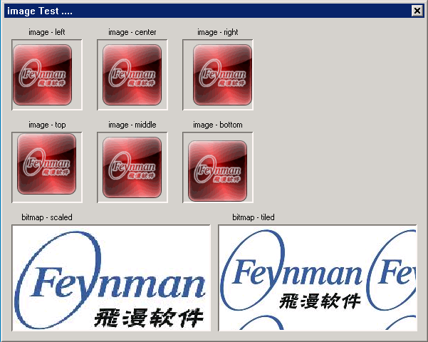

__清单 2__ image.c

```c
/*
* ** $Id$
* **
* ** Listing P2C4.2
* **
* ** image.c: Sample program for mGNCS Programming Guide
* **      A mGNCS application for mImage.
* **
* ** Copyright (C) 2009 Feynman Software.
* */

#include <stdio.h>
#include <stdlib.h>
#include <string.h>

#include <minigui/common.h>
#include <minigui/minigui.h>
#include <minigui/gdi.h>
#include <minigui/window.h>
#include <minigui/control.h>
#include <mgncs/mgncs.h>

#define IDC_IMAGE1 100
#define IDC_IMAGE2 101
#define IDC_IMAGE3 102
#define IDC_IMAGE4 103
#define IDC_IMAGE5 104
#define IDC_IMAGE6 105
#define IDC_IMAGE7 106
#define IDC_IMAGE8 107

static BITMAP icon;
static BITMAP bitmap;

static void set_icon_info(mWidget* self, int id, PBITMAP pbmp, int align_id, int align)
{
        mImage *img;
        img = (mImage *)ncsGetChildObj(self->hwnd, id);
        
        if(img){
                _c(img)->setProperty(img, NCSP_IMAGE_IMAGE, (DWORD)pbmp);
                _c(img)->setProperty(img, align_id, align);
        }
}


static BOOL mymain_onCreate(mWidget* self, DWORD add_data)
{
        //TODO : initialize
        mImage *img;
        LoadBitmapFromFile(HDC_SCREEN, &bitmap, "image_test.jpg");
        
        LoadBitmapFromFile(HDC_SCREEN, &icon, "icon.png");
        
        set_icon_info(self, IDC_IMAGE1, &icon, NCSP_STATIC_ALIGN, NCS_ALIGN_LEFT);
        set_icon_info(self, IDC_IMAGE2, &icon, NCSP_STATIC_ALIGN, NCS_ALIGN_CENTER);
        set_icon_info(self, IDC_IMAGE3, &icon, NCSP_STATIC_ALIGN, NCS_ALIGN_RIGHT);
        set_icon_info(self, IDC_IMAGE4, &icon, NCSP_STATIC_VALIGN, NCS_VALIGN_TOP);
        set_icon_info(self, IDC_IMAGE5, &icon, NCSP_STATIC_VALIGN, NCS_VALIGN_CENTER);
        set_icon_info(self, IDC_IMAGE6, &icon, NCSP_STATIC_VALIGN, NCS_VALIGN_BOTTOM);
        
        img = (mImage *)ncsGetChildObj(self->hwnd, IDC_IMAGE7);
        if(img){
                _c(img)->setProperty(img, NCSP_IMAGE_IMAGE, (DWORD)&bitmap);
                _c(img)->setProperty(img, NCSP_IMAGE_DRAWMODE, NCS_DM_SCALED);
        }
        
        img = (mImage *)ncsGetChildObj(self->hwnd, IDC_IMAGE8);
        if(img){
                _c(img)->setProperty(img, NCSP_IMAGE_IMAGE, (DWORD)&bitmap);
                _c(img)->setProperty(img, NCSP_IMAGE_DRAWMODE, NCS_DM_TILED);
        }
        
        return TRUE;
}

static void mymain_onClose(mWidget* self, int message)
{
        DestroyMainWindow(self->hwnd);
        PostQuitMessage(0);
        UnloadBitmap(&bitmap);
}


//Propties for

//Controls
static NCS_WND_TEMPLATE _ctrl_templ[] = {
        {
                NCSCTRL_STATIC, 
                0,
                10, 10, 100, 20,
                WS_VISIBLE,
                WS_EX_NONE,
                "image - left",
                NULL,
                NULL, //rdr_info
                NULL, //handlers,
                NULL, //controls
                0,
                0 //add data
        },
        {
                NCSCTRL_IMAGE, 
                IDC_IMAGE1,
                10, 30, 100, 100,
                WS_BORDER | WS_VISIBLE,
                WS_EX_NONE,
                "",
                NULL,
                NULL, //rdr_info
                NULL, //handlers,
                NULL, //controls
                0,
                0 //add data
        },
        {
                NCSCTRL_STATIC, 
                0,
                130, 10, 100, 20,
                WS_VISIBLE,
                WS_EX_NONE,
                "image - center",
                NULL,
                NULL, //rdr_info
                NULL, //handlers,
                NULL, //controls
                0,
                0 //add data
        },
        {
                NCSCTRL_IMAGE, 
                IDC_IMAGE2,
                130, 30, 100, 100,
                WS_BORDER | WS_VISIBLE,
                WS_EX_NONE,
                "",
                NULL,
                NULL, //rdr_info
                NULL, //handlers,
                NULL, //controls
                0,
                0 //add data
        },
        {
                NCSCTRL_STATIC, 
                0,
                250, 10, 100, 20,
                WS_VISIBLE,
                WS_EX_NONE,
                "image - right",
                NULL,
                NULL, //rdr_info
                NULL, //handlers,
                NULL, //controls
                0,
                0 //add data
        },
        {
                NCSCTRL_IMAGE, 
                IDC_IMAGE3,
                250, 30, 100, 100,
                WS_BORDER | WS_VISIBLE,
                WS_EX_NONE,
                "",
                NULL,
                NULL, //rdr_info
                NULL, //handlers,
                NULL, //controls
                0,
                0 //add data
        },
        {
                NCSCTRL_STATIC, 
                0,
                10, 140, 100, 20,
                WS_VISIBLE,
                WS_EX_NONE,
                "image - top",
                NULL,
                NULL, //rdr_info
                NULL, //handlers,
                NULL, //controls
                0,
                0 //add data
        },
        {
                NCSCTRL_IMAGE, 
                IDC_IMAGE4,
                10, 160, 100, 100,
                WS_BORDER | WS_VISIBLE,
                WS_EX_NONE,
                "",
                NULL,
                NULL, //rdr_info
                NULL, //handlers,
                NULL, //controls
                0,
                0 //add data
        },
        {
                NCSCTRL_STATIC, 
                0,
                130, 140, 100, 20,
                WS_VISIBLE,
                WS_EX_NONE,
                "image - middle",
                NULL,
                NULL, //rdr_info
                NULL, //handlers,
                NULL, //controls
                0,
                0 //add data
        },
        {
                NCSCTRL_IMAGE, 
                IDC_IMAGE5,
                130, 160, 100, 100,
                WS_BORDER | WS_VISIBLE,
                WS_EX_NONE,
                "",
                NULL,
                NULL, //rdr_info
                NULL, //handlers,
                NULL, //controls
                0,
                0 //add data
        },
        {
                NCSCTRL_STATIC, 
                0,
                250, 140, 100, 20,
                WS_VISIBLE,
                WS_EX_NONE,
                "image - bottom",
                NULL,
                NULL, //rdr_info
                NULL, //handlers,
                NULL, //controls
                0,
                0 //add data
        },
        {
                NCSCTRL_IMAGE, 
                IDC_IMAGE6,
                250, 160, 100, 100,
                WS_BORDER | WS_VISIBLE,
                WS_EX_NONE,
                "",
                NULL,
                NULL, //rdr_info
                NULL, //handlers,
                NULL, //controls
                0,
                0 //add data
        },
        {
                NCSCTRL_STATIC, 
                0,
                10, 270, 100, 20,
                WS_VISIBLE,
                WS_EX_NONE,
                "bitmap - scaled",
                NULL,
                NULL, //rdr_info
                NULL, //handlers,
                NULL, //controls
                0,
                0 //add data
        },
        {
                NCSCTRL_IMAGE, 
                IDC_IMAGE7,
                10, 290, 280, 150,
                WS_BORDER | WS_VISIBLE,
                WS_EX_NONE,
                "",
                NULL,
                NULL, //rdr_info
                NULL, //handlers,
                NULL, //controls
                0,
                0 //add data
        },
        {
                NCSCTRL_STATIC, 
                0,
                300, 270, 100, 20,
                WS_VISIBLE,
                WS_EX_NONE,
                "bitmap - tiled",
                NULL,
                NULL, //rdr_info
                NULL, //handlers,
                NULL, //controls
                0,
                0 //add data
        },
        {
                NCSCTRL_IMAGE, 
                IDC_IMAGE8,
                300, 290, 280, 150,
                WS_BORDER | WS_VISIBLE,
                WS_EX_NONE,
                "",
                NULL,
                NULL, //rdr_info
                NULL, //handlers,
                NULL, //controls
                0,
                0 //add data
        },
        
};


static NCS_EVENT_HANDLER mymain_handlers[] = {
        {MSG_CREATE, mymain_onCreate },
        {MSG_CLOSE, mymain_onClose },
        {0, NULL }
};

//define the main window template
static NCS_MNWND_TEMPLATE mymain_templ = {
        NCSCTRL_DIALOGBOX, 
        1,
        0, 0, 600, 480,
        WS_CAPTION | WS_BORDER | WS_VISIBLE,
        WS_EX_NONE,
        "image Test ....",
        NULL,
        NULL,
        mymain_handlers,
        _ctrl_templ,
        sizeof(_ctrl_templ)/sizeof(NCS_WND_TEMPLATE),
        0,
        0, 0,
};

int MiniGUIMain(int argc, const char* argv[])
{
        ncsInitialize();
        mDialogBox* mydlg = (mDialogBox *)ncsCreateMainWindowIndirect 
        (&mymain_templ, HWND_DESKTOP);
        
        _c(mydlg)->doModal(mydlg, TRUE);
        
        
        MainWindowThreadCleanup(mydlg->hwnd);
        
        ncsUninitialize ();
        return 0;
}

#ifdef _MGRM_THREADS
#include <minigui/dti.c>
#endif
```

## 4 `mRect`

 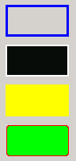

* 功能: 本控件为用户提供了绘制矩形的功能，可以通过设置属性的方法，方便快捷的绘制出具有填充色、圆角、边框等各种特色的矩形
* 继承自: `mStatic`
* 直接子类: 无

### 4.1 `mRect` 属性
| 属性名 | 类型 | 权限 | 说明 |
|:------|:-----|:---|:-----|
| `NCSP_RECT_BORDERSIZE` | int | `RW` | rect 控件边框的粗细度，对应矩形控件的边框粗细，类型为 int |
| `NCSP_RECT_BORDERCOLOR` | dword | `RW` | rect 控件边框的颜色, 对应矩形控件的边框颜色，类型为 dword |
| `NCSP_RECT_FILLCOLOR` | dword | `RW` | rect 控件填充色，对应矩形控件的填充色，类型为 dword |
| `NCSP_RECT_XRADIUS` | int | `RW` | rect 控件圆角横向x半径，对应矩形控件的圆角半径，类型为 int |
| `NCSP_RECT_YRADIUS` | int | `RW` | rect 控件圆角竖向y半径，对应矩形控件的圆角半径，类型为 int |
| `NCSP_RECT_FILLCLR_RED` |  |  |  |
| `NCSP_RECT_FILLCLR_GREEN` |  |  |  |
| `NCSP_RECT_FILLCLR_BLUE` |  |  |  |
| `NCSP_RECT_FILLCLR_ALPHA` |  |  |  |
| `NCSP_RECT_BRDCLR_RED` |  |  |  |
| `NCSP_RECT_BRDCLR_GREEN` |  |  |  |
| `NCSP_RECT_BRDCLR_BLUE` |  |  |  |
| `NCSP_RECT_BRDCLR_ALPHA` |  |  |  |

以下代码演示了如何设置矩形的属性

```c
//Propties for
static NCS_PROP_ENTRY rect1_props [] = {
    {NCSP_RECTANGLE_BORDERSIZE, 3},
    {NCSP_RECTANGLE_BORDERCOLOR, 0xFFFF0000},
    {NCSP_RECTANGLE_FILLCOLOR, 0x00000000},
    {0, 0}
};

static NCS_PROP_ENTRY rect2_props [] = {
    {NCSP_RECTANGLE_BORDERSIZE, 2},
    {NCSP_RECTANGLE_BORDERCOLOR, 0xFFFFFFF},
    {NCSP_RECTANGLE_FILLCOLOR, 0xFF0F0F0F},
    {0, 0}
};

static NCS_PROP_ENTRY rect3_props [] = {
    {NCSP_RECTANGLE_BORDERSIZE, 0},
    {NCSP_RECTANGLE_BORDERCOLOR, 0xFF0C0000},
    {NCSP_RECTANGLE_FILLCOLOR, 0xFF00FFFF},
    {0, 0}
};

static NCS_PROP_ENTRY rect4_props [] = {
    {NCSP_RECTANGLE_BORDERSIZE, 5},
    {NCSP_RECTANGLE_BORDERCOLOR, 0xFF0000FF},
    {NCSP_RECTANGLE_FILLCOLOR, 0xFF00FF00},
    {NCSP_RECTANGLE_XRADIUS, 4},
    {NCSP_RECTANGLE_YRADIUS, 4},
    {0, 0}
};
//Controls
static NCS_WND_TEMPLATE _ctrl_templ[] = {
    ...
    {
        NCSCTRL_RECTANGLE,
        ID_RECT1,
        110, 10, 80, 40,
        WS_VISIBLE,
        WS_EX_NONE,
        "",
        rect1_props, //props,
        NULL, //rdr_info
        NULL, //handlers,
        NULL, //controls
        0,
        0 //add data
    },
    ...
    {
        NCSCTRL_RECTANGLE,
        ID_RECT2,
        110, 60, 80, 40,
        WS_VISIBLE,
        WS_EX_NONE,
        "",
        rect2_props, //props,
        NULL, //rdr_info
        NULL, //handlers,
        NULL, //controls
        0,
        0 //add data
    },
    ...
    {
        NCSCTRL_RECTANGLE,
        ID_RECT3,
        110, 110, 80, 40,
        WS_VISIBLE,
        WS_EX_NONE,
        "",
        rect3_props, //props,
        NULL, //rdr_info
        NULL, //handlers,
        NULL, //controls
        0,
        0 //add data
    },
    ...
    {
        NCSCTRL_RECTANGLE,
        ID_RECT4,
        110, 160, 80, 40,
        WS_VISIBLE,
        WS_EX_NONE,
        "",
        rect4_props, //props,
        NULL, //rdr_info
        NULL, //handlers,
        NULL, //controls
        0,
        0 //add data
    },
};
```

### 4.2 `mRect` 事件

无

### 4.3 `mRect` 方法

无

### 4.4 `mRect` 实例

本实例为用户演示了如何绘制各种矩形

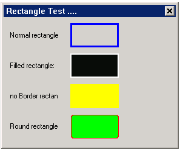

__清单 3__ rectangle.c

```c
/*
* ** $Id$
* **
* ** Listing P2C4.3
* **
* ** rectangle.c: Sample program for mGNCS Programming Guide
* **      A mGNCS application for mRect.
* **
* ** Copyright (C) 2009 Feynman Software.
* */

#include <stdio.h>
#include <stdlib.h>
#include <string.h>

#include <minigui/common.h>
#include <minigui/minigui.h>
#include <minigui/gdi.h>
#include <minigui/window.h>
#include <minigui/control.h>
#include <mgncs/mgncs.h>

#define ID_RECT1  101
#define ID_RECT2  102
#define ID_RECT3  103
#define ID_RECT4  104

static BOOL mymain_onCreate(mWidget* self, DWORD add_data)
{
        //TODO : initialize
        return TRUE;
}

static void mymain_onClose(mWidget* self, int message)
{
        DestroyMainWindow(self->hwnd);
        PostQuitMessage(0);
}


//Propties for
static NCS_PROP_ENTRY rect1_props [] = {
        {NCSP_RECTANGLE_BORDERSIZE, 3},
        {NCSP_RECTANGLE_BORDERCOLOR, 0xFFFF0000},
        {NCSP_RECTANGLE_FILLCOLOR, 0x00000000},
        {0, 0}
};

static NCS_PROP_ENTRY rect2_props [] = {
        {NCSP_RECTANGLE_BORDERSIZE, 2},
        {NCSP_RECTANGLE_BORDERCOLOR, 0xFFFFFFF},
        {NCSP_RECTANGLE_FILLCOLOR, 0xFF0F0F0F},
        {0, 0}
};

static NCS_PROP_ENTRY rect3_props [] = {
        {NCSP_RECTANGLE_BORDERSIZE, 0},
        {NCSP_RECTANGLE_BORDERCOLOR, 0xFF0C0000},
        {NCSP_RECTANGLE_FILLCOLOR, 0xFF00FFFF},
        {0, 0}
};

static NCS_PROP_ENTRY rect4_props [] = {
        {NCSP_RECTANGLE_BORDERSIZE, 5},
        {NCSP_RECTANGLE_BORDERCOLOR, 0xFF0000FF},
        {NCSP_RECTANGLE_FILLCOLOR, 0xFF00FF00},
        {NCSP_RECTANGLE_XRADIUS, 4},
        {NCSP_RECTANGLE_YRADIUS, 4},
        {0, 0}
};

//Controls
static NCS_WND_TEMPLATE _ctrl_templ[] = {
        {
                NCSCTRL_STATIC, 
                0,
                10, 10, 80, 40,
                WS_VISIBLE, WS_EX_NONE,
                "Normal rectangle:",
                NULL, NULL, NULL, NULL, 
                0, 0 
        },
        {
                NCSCTRL_RECTANGLE, 
                ID_RECT1,
                110, 10, 80, 40,
                WS_VISIBLE,
                WS_EX_NONE,
                "",
                rect1_props, //props,
                NULL, //rdr_info
                NULL, //handlers,
                NULL, //controls
                0,
                0 //add data
        },
        {
                NCSCTRL_STATIC, 
                0,
                10, 60, 80, 40,
                WS_VISIBLE, WS_EX_NONE,
                "Filled rectangle:",
                NULL, NULL, NULL, NULL, 
                0, 0 
        },
        {
                NCSCTRL_RECTANGLE, 
                ID_RECT2,
                110, 60, 80, 40,
                WS_VISIBLE,
                WS_EX_NONE,
                "",
                rect2_props, //props,
                NULL, //rdr_info
                NULL, //handlers,
                NULL, //controls
                0,
                0 //add data
        },
        {
                NCSCTRL_STATIC, 
                0,
                10, 110, 80, 40,
                WS_VISIBLE, WS_EX_NONE,
                "no Border rectangle:",
                NULL, NULL, NULL, NULL, 
                0, 0 
        },
        {
                NCSCTRL_RECTANGLE, 
                ID_RECT3,
                110, 110, 80, 40,
                WS_VISIBLE,
                WS_EX_NONE,
                "",
                rect3_props, //props,
                NULL, //rdr_info
                NULL, //handlers,
                NULL, //controls
                0,
                0 //add data
        },
        {
                NCSCTRL_STATIC, 
                0,
                10, 160, 80, 40,
                WS_VISIBLE, WS_EX_NONE,
                "Round rectangle:",
                NULL, NULL, NULL, NULL, 
                0, 0 
        },
        {
                NCSCTRL_RECTANGLE, 
                ID_RECT4,
                110, 160, 80, 40,
                WS_VISIBLE,
                WS_EX_NONE,
                "",
                rect4_props, //props,
                NULL, //rdr_info
                NULL, //handlers,
                NULL, //controls
                0,
                0 //add data
        },
};


static NCS_EVENT_HANDLER mymain_handlers[] = {
        {MSG_CREATE, mymain_onCreate },
        {MSG_CLOSE, mymain_onClose },
        {0, NULL }
};

//define the main window template
static NCS_MNWND_TEMPLATE mymain_templ = {
        NCSCTRL_DIALOGBOX, 
        1,
        0, 0, 320, 320,
        WS_CAPTION | WS_BORDER | WS_VISIBLE,
        WS_EX_NONE,
        "Rectangle Test ....",
        NULL,
        NULL,
        mymain_handlers,
        _ctrl_templ,
        sizeof(_ctrl_templ)/sizeof(NCS_WND_TEMPLATE),
        0,
        0, 0,
};

int MiniGUIMain(int argc, const char* argv[])
{
        ncsInitialize();
        mDialogBox* mydlg = (mDialogBox *)ncsCreateMainWindowIndirect 
        (&mymain_templ, HWND_DESKTOP);
        
        printf("NCSP_RECTANGLE_BORDERSIZE=%d\n",NCSP_RECTANGLE_BORDERSIZE);
        
        _c(mydlg)->doModal(mydlg, TRUE);
        
        
        MainWindowThreadCleanup(mydlg->hwnd);
        
        ncsUninitialize ();
        return 0;
}

#ifdef _MGRM_THREADS
#include <minigui/dti.c>
#endif
```

## 5 `mGroupbox`


* 功能: 分组框，本控件用于为其他控件提供可识别的分组。通常，使用分组框按功能细分窗体，在分组框中对所有选项分组能为用户提供逻辑化的可视提示。
* 继承自: `mStatic`
* 直接子类: 
   * `mButtongroup`

### 5.1 `mGroupbox` 属性

无

### 5.2 `mGroupbox` 事件

无

### 5.3 `mGroupbox` 方法

无

### 5.4 `mGroupbox` 渲染器

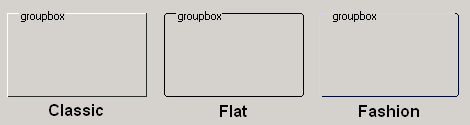

用户可以方便的为分组框设置如上图所示的 classic、flat、fashion 渲染器，具体方法见如下代码:

```c
...
static NCS_RDR_INFO grp_rdr_info[] = {
    {"fashion", "fashion", NULL}
//    {"flat", "flat", NULL}
//    {"classic", "classic", NULL}
};

//Controls
static NCS_WND_TEMPLATE _ctrl_templ[] = {
    {
        NCSCTRL_GROUPBOX ,
        ID_GROUP,
        10, 10, 280, 180,
        WS_VISIBLE,
        WS_EX_NONE,
        "groupbox",
        NULL, //props,
        grp_rdr_info, //rdr_info
        NULL, //handlers,
        NULL, //controls
        0,
        0 //add data
    },
};
...
```

### 5.5 `mGroupbox` 实例

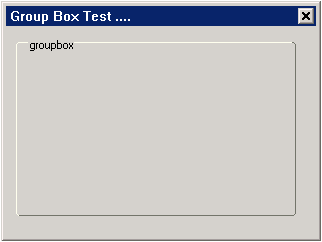

本实例为用户演示了如何生成带有渲染器的分组框

__清单 4__ groupbox.c

```c
/*
* ** $Id$
* **
* ** Listing P2C4.4
* **
* ** groupbox.c: Sample program for mGNCS Programming Guide
* **      A mGNCS application for mGroupbox.
* **
* ** Copyright (C) 2009 Feynman Software.
* */

#include <stdio.h>
#include <stdlib.h>
#include <string.h>

#include <minigui/common.h>
#include <minigui/minigui.h>
#include <minigui/gdi.h>
#include <minigui/window.h>
#include <minigui/control.h>
#include <mgncs/mgncs.h>

#define ID_GROUP  101

static BOOL mymain_onCreate(mWidget* self, DWORD add_data)
{
        //TODO : initialize
        return TRUE;
}

static void mymain_onClose(mWidget* self, int message)
{
        DestroyMainWindow(self->hwnd);
        PostQuitMessage(0);
}

static NCS_RDR_INFO grp_rdr_info[] = {
        //    {"fashion", "fashion", NULL}
        //    {"flat", "flat", NULL}
        //    {"classic", "classic", NULL}
        {"skin", "skin", NULL}
};

//Controls
static NCS_WND_TEMPLATE _ctrl_templ[] = {
        {
                NCSCTRL_GROUPBOX , 
                ID_GROUP,
                //        10, 10, 280, 180,
                10, 10, 140, 90,
                WS_VISIBLE,
                WS_EX_NONE,
                "groupbox",
                NULL, //props,
                grp_rdr_info, //rdr_info
                NULL, //handlers,
                NULL, //controls
                0,
                0 //add data
        },
};


static NCS_EVENT_HANDLER mymain_handlers[] = {
        {MSG_CREATE, mymain_onCreate },
        {MSG_CLOSE, mymain_onClose },
        {0, NULL }
};

//define the main window template
static NCS_MNWND_TEMPLATE mymain_templ = {
        NCSCTRL_DIALOGBOX, 
        1,
        0, 0, 320, 240,
        WS_CAPTION | WS_BORDER | WS_VISIBLE,
        WS_EX_NONE,
        "Group Box Test ....",
        NULL,
        NULL,
        mymain_handlers,
        _ctrl_templ,
        sizeof(_ctrl_templ)/sizeof(NCS_WND_TEMPLATE),
        0,
        0, 0,
};

int MiniGUIMain(int argc, const char* argv[])
{
        if(argc > 1)
        {
                grp_rdr_info[0].glb_rdr = argv[1];
                grp_rdr_info[0].ctl_rdr = argv[1];
        }
        
        ncsInitialize();
        mDialogBox* mydlg = (mDialogBox *)ncsCreateMainWindowIndirect 
        (&mymain_templ, HWND_DESKTOP);
        
        _c(mydlg)->doModal(mydlg, TRUE);
        
        
        MainWindowThreadCleanup(mydlg->hwnd);
        
        ncsUninitialize ();
        return 0;
}

#ifdef _MGRM_THREADS
#include <minigui/dti.c>
#endif
```

## 6 `mButtonGroup`

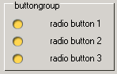

* 功能: 本控件用于管理一组 `RadioButton`，使该组 `RadioButton` 能够互斥，从而实现单选功能。
* 继承自: `mGroupbox`
* 直接子类: 无

### 6.1 `mButtonGroup` 属性

| 属性名 | 类型 | 权限 | 属性说明 |
|:------|:----|:-----|:-------|
| `NCSP_BTNGRP_SELID` | int | `RW` | 当前选中的 `radioButton` ID 号|
| `NCSP_BTNGRP_SELIDX` | idx | `RW` | 当前选中的 `radioButton` index 号|
| `NCSP_BTNGRP_SELOBJ` | `mWidget*` | `RW` | 当前选中的 `radioButton` 的指针|

### 6.2 `mButtonGroup` 方法

```c
BOOL (*addButton)(clsName *group, mWidget *radio);
```

* 功能：添加一个 `radioButton`
* 返回值：`BOOL`      

```c
BOOL (*checkBtn)(clsName *group, mWidget *btn_to_check);
```

* 功能：选中一个 `radioButton`
* 返回值：`BOOL`      

### 6.3 `mButtonGroup` 实例

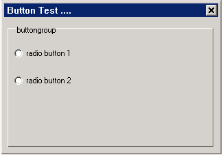

请参见[按钮系列控件类中的 `mRadioButton`](programming-guide/MiniGUIProgGuidePart2Chapter06-zh.md#5-mradiobutton)

## 7 `mLEDLabel`

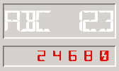
   * 功能: `mLEDLabel` 类是模仿 `LED` 数码管的静态框，用于显示 `LED` 字符，可用于工控等多种领域
   * 继承自: `mStatic`
   * 直接子类: 无

### 7.1 `mLEDLabel` 属性

| 属性名 | 类型 | 权限 | 属性说明 |
|:------|:-----|:----|:-------|
| `NCSP_LEDLBL_COLOR` | `DWORD` | `RW` | 设置 `LED` 字体的颜色，如红色为 0xFF0000FF |
| `NCSP_LEDLBL_WIDTH` | int | `RW` | 设置 `LED` 字体的宽度 |
| `NCSP_LEDLBL_HEIGHT` | int | `RW` | 设置 `LED` 字体的高度 |

用户可以使用以下方法对属性进行设置：

```c
//Propties for
static NCS_PROP_ENTRY static1_props [] = {
    { NCSP_LEDLBL_COLOR, 0xFF0000FF},
    { NCSP_LEDLBL_WIDTH, 10},
    { NCSP_LEDLBL_HEIGHT, 15},
    { NCSP_STATIC_ALIGN, NCS_ALIGN_RIGHT },
    { NCSP_STATIC_AUTOWRAP, 0 },
    {0, 0}
};

static NCS_PROP_ENTRY static2_props [] = {
    { NCSP_LEDLBL_COLOR, 0xFF0000FF},
    { NCSP_LEDLBL_WIDTH, 60},
    { NCSP_LEDLBL_HEIGHT, 90},
    { NCSP_STATIC_VALIGN, NCS_VALIGN_CENTER },
    { NCSP_STATIC_ALIGN, NCS_ALIGN_CENTER },
    {0, 0}
};

//Controls
static NCS_WND_TEMPLATE _ctrl_templ[] = {
    {
        NCSCTRL_LEDLABEL , 
        IDC_LEDLBL1+0,
        10, 10, 160, 50,
        WS_BORDER | WS_VISIBLE,
        WS_EX_NONE,
        "ABC 123",
        NULL, //props, 取默认属性
        NULL, //rdr_info
        NULL, //handlers,
        NULL, //controls
        0,
        0 //add data
    },
    {
        NCSCTRL_LEDLABEL , 
        IDC_LEDLBL1+2,
        10, 70, 160, 30,
        WS_BORDER | WS_VISIBLE,
        WS_EX_NONE,
        "2 4 6 8 0 ",
        static1_props, //props,
        NULL, //rdr_info
        NULL, //handlers,
        NULL, //controls
        0,
        0 //add data
    },
    {
        NCSCTRL_LEDLABEL , 
        IDC_LEDLBL1+5,
        180, 10, 100, 100,
        WS_BORDER | WS_VISIBLE,
        WS_EX_NONE,
        "4",
        static2_props, //props,
        NULL, //rdr_info
        NULL, //handlers,
        NULL, //controls
        0,
        0 //add data
    },

};
```

### 7.2 `mLEDLabel` 风格

无

### 7.3 `mLEDLabel` 方法

无

### 7.4 `mLEDLabel` 渲染器

无

### 7.5 `mLEDLabel` 实例

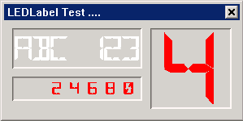

本实例为用户演示了如何显示 `LED` 字符

```c
/*
* ** $Id$
* **
* ** Listing P2C4.6
* **
* ** ledlabel.c: Sample program for mGNCS Programming Guide
* **      A mGNCS application for mLEDLabel.
* **
* ** Copyright (C) 2009 Feynman Software.
* */

#include <stdio.h>
#include <stdlib.h>
#include <string.h>

#include <minigui/common.h>
#include <minigui/minigui.h>
#include <minigui/gdi.h>
#include <minigui/window.h>
#include <minigui/control.h>
#include <mgncs/mgncs.h>

#define IDC_LEDLBL1 100
#define IDC_SATAICN 107

static BOOL mymain_onCreate(mWidget* self, DWORD add_data)
{
        //TODO : initialize
        return TRUE;
}

static void mymain_onClose(mWidget* self, int message)
{
        DestroyMainWindow(self->hwnd);
        PostQuitMessage(0);
}


//Propties for
static NCS_PROP_ENTRY static1_props [] = {
        { NCSP_LEDLBL_COLOR, 0xFF0000FF},
        { NCSP_LEDLBL_WIDTH, 10},
        { NCSP_LEDLBL_HEIGHT, 15},
        { NCSP_STATIC_ALIGN, NCS_ALIGN_RIGHT },
        { NCSP_STATIC_AUTOWRAP, 0 },
        {0, 0}
};

static NCS_PROP_ENTRY static2_props [] = {
        { NCSP_LEDLBL_COLOR, 0xFF0000FF},
        { NCSP_LEDLBL_WIDTH, 60},
        { NCSP_LEDLBL_HEIGHT, 90},
        { NCSP_STATIC_VALIGN, NCS_VALIGN_CENTER },
        { NCSP_STATIC_ALIGN, NCS_ALIGN_CENTER },
        {0, 0}
};

//Controls
static NCS_WND_TEMPLATE _ctrl_templ[] = {
        {
                NCSCTRL_LEDLABEL , 
                IDC_LEDLBL1+0,
                10, 10, 160, 50,
                WS_BORDER | WS_VISIBLE,
                WS_EX_NONE,
                "ABC 123",
                NULL, //props,
                NULL, //rdr_info
                NULL, //handlers,
                NULL, //controls
                0,
                0 //add data
        },
        {
                NCSCTRL_LEDLABEL , 
                IDC_LEDLBL1+2,
                10, 70, 160, 30,
                WS_BORDER | WS_VISIBLE,
                WS_EX_NONE,
                "2 4 6 8 0 ",
                static1_props, //props,
                NULL, //rdr_info
                NULL, //handlers,
                NULL, //controls
                0,
                0 //add data
        },
        {
                NCSCTRL_LEDLABEL , 
                IDC_LEDLBL1+5,
                180, 10, 100, 100,
                WS_BORDER | WS_VISIBLE,
                WS_EX_NONE,
                "4",
                static2_props, //props,
                NULL, //rdr_info
                NULL, //handlers,
                NULL, //controls
                0,
                0 //add data
        },
        
};


static NCS_EVENT_HANDLER mymain_handlers[] = {
        {MSG_CREATE, mymain_onCreate},
        {MSG_CLOSE, mymain_onClose},
        {0, NULL}
};

//define the main window template
static NCS_MNWND_TEMPLATE mymain_templ = {
        NCSCTRL_DIALOGBOX, 
        1,
        0, 0, 300, 150,
        WS_CAPTION | WS_BORDER | WS_VISIBLE,
        WS_EX_NONE,
        "LEDLabel Test ....",
        NULL,
        NULL,
        mymain_handlers,
        _ctrl_templ,
        sizeof(_ctrl_templ)/sizeof(NCS_WND_TEMPLATE),
        0,
        0, 0,
};

int MiniGUIMain(int argc, const char* argv[])
{
        ncsInitialize();
        mDialogBox* mydlg = (mDialogBox *)ncsCreateMainWindowIndirect 
        (&mymain_templ, HWND_DESKTOP);
        
        _c(mydlg)->doModal(mydlg, TRUE);
        
        
        MainWindowThreadCleanup(mydlg->hwnd);
        
        ncsUninitialize ();
        return 0;
}

#ifdef _MGRM_THREADS
#include <minigui/dti.c>
#endif
```

## 8 `mSeparator`


* 功能: 用于分隔各个项控件并进行区域划分的水平或垂直分隔线
* 继承自: `mStatic`
* 直接子类: 无

### 8.1 `mSeparator` 属性

无

### 8.2 `mSeparator` 风格

| 属性名 | 说明 |
|:------|:----|
| `NCSS_SPRTR_VERT` | 设置为竖向分割线，默认为横向 |

用户可使用以下方法对风格进行设置：

```c
...
static NCS_WND_TEMPLATE _ctrl_templ[] = {
        ...,
        {
                NCSCTRL_SEPARATOR , 
                ID_GROUP,
                100, 20, 5, 200,
                WS_VISIBLE|NCSS_SPRTR_VERT,   //设置垂直风格
                WS_EX_NONE,
                "groupbox",
                NULL, //props,
                NULL, //rdr_info
                NULL, //handlers,
                NULL, //controls
                0,
                0 //add data
        },
};
```

### 8.3 `mSeparator` 事件

无

### 8.4 `mSeparator` 方法

无

### 8.5 `mSeparator` 渲染器

无

### 8.6 `mSeparator` 实例

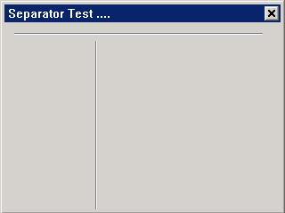

本实例为用户演示了如何生成水平和垂直分隔线

```c
/*
* ** $Id$
* **
* ** Listing P2C4.7
* **
* ** separator.c: Sample program for mGNCS Programming Guide
* **      A mGNCS application for mSeparator.
* **
* ** Copyright (C) 2009 Feynman Software.
* */

#include <stdio.h>
#include <stdlib.h>
#include <string.h>

#include <minigui/common.h>
#include <minigui/minigui.h>
#include <minigui/gdi.h>
#include <minigui/window.h>
#include <minigui/control.h>
#include <mgncs/mgncs.h>

#define ID_GROUP  101

static BOOL mymain_onCreate(mWidget* self, DWORD add_data)
{
        //TODO : initialize
        return TRUE;
}

static void mymain_onClose(mWidget* self, int message)
{
        DestroyMainWindow(self->hwnd);
        PostQuitMessage(0);
}

//Controls
static NCS_WND_TEMPLATE _ctrl_templ[] = {
        {
                NCSCTRL_SEPARATOR , 
                ID_GROUP,
                10, 10, 280, 5,
                WS_VISIBLE,
                WS_EX_NONE,
                "groupbox",
                NULL, //props,
                NULL, //rdr_info
                NULL, //handlers,
                NULL, //controls
                0,
                0 //add data
        },
        {
                NCSCTRL_SEPARATOR , 
                ID_GROUP,
                100, 20, 5, 200,
                WS_VISIBLE|NCSS_SPRTR_VERT,
                WS_EX_NONE,
                "groupbox",
                NULL, //props,
                NULL, //rdr_info
                NULL, //handlers,
                NULL, //controls
                0,
                0 //add data
        },
};


static NCS_EVENT_HANDLER mymain_handlers[] = {
        {MSG_CREATE, mymain_onCreate },
        {MSG_CLOSE, mymain_onClose },
        {0, NULL }
};

//define the main window template
static NCS_MNWND_TEMPLATE mymain_templ = {
        NCSCTRL_DIALOGBOX, 
        1,
        0, 0, 320, 240,
        WS_CAPTION | WS_BORDER | WS_VISIBLE,
        WS_EX_NONE,
        "Separator Test ....",
        NULL,
        NULL,
        mymain_handlers,
        _ctrl_templ,
        sizeof(_ctrl_templ)/sizeof(NCS_WND_TEMPLATE),
        0,
        0, 0,
};

int MiniGUIMain(int argc, const char* argv[])
{
        ncsInitialize();
        mDialogBox* mydlg = (mDialogBox *)ncsCreateMainWindowIndirect 
        (&mymain_templ, HWND_DESKTOP);
        
        _c(mydlg)->doModal(mydlg, TRUE);
        
        
        MainWindowThreadCleanup(mydlg->hwnd);
        
        ncsUninitialize ();
        return 0;
}

#ifdef _MGRM_THREADS
#include <minigui/dti.c>
#endif
```
