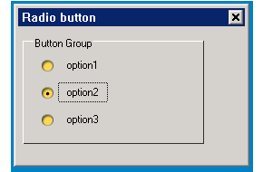

# 按钮系列控件类

## 1 按钮系列控件简介

按钮作为用户界面中人机交互的不可或缺的控件，所有人机交互界面中都包括了按钮。在 mGNCS 的设计中，充分考虑了不同使用环境下的按钮使用情况，提供了不同的属性、接口等，方便用户组件化开发。mGNCS 中的按钮重构了 MiniGUI 3.0 中内置的按钮控件，并进行了较大的调整，增加了两个按钮类型，大大增强了按钮控件。mGNCS 中的按钮包括普通按钮、复选框、单选钮、菜单按钮、颜色选择按钮这 5 种类型。用户可以通过键盘或者鼠标来选择或者切换按钮的状态。用户的输入将使按钮产生通知消息，应用程序也可以向按钮发送消息以改变按钮的状态。 每种按钮类型对应一个类，里面包含了风格、属性、事件、方法、渲染器。mGNCS 中提供的控件，比通常 PC 上使用的控件功能更强大，提供了更多可配置信息，增加了渲染器编辑。

在本文档中，将对按钮类及其里面的这些属性等进行详细介绍，方便用户进一步了解按钮的细节，从而可以更灵活的使用按钮。

- 按钮相关的类层次关系
   - [`mWidget`](MiniGUIProgGuidePart2Chapter04-zh#3-mwidget)
      - [`mButton`](3-mbutton) 
         - [`mCheckButton`](#4-mcheckbutton)
         - [`mRadioButton`](#5-mradiobutton)
         - [`mMenuButton`](#6-mmenubutton)(使用了 `mPopMenuMgr`)
         - [`mColorButton`](#7-mcolorbutton)

- 控件创建方法
   - 自动创建：通过 mStudio 中的界面设计器，拖拽对应的按钮控件，mStudio 将自动创建控件，并提供可视化的控件配置，同时自动生成创建代码。
   - 手动生成：按照 mGNCS 控件创建过程，通过编程，传入对应控件窗口类 ID，生成控件，手动编程设置控件属性、事件处理。

## 2 按钮类渲染器

mGNCS 提供了 4 种类型的渲染器，定义了渲染器属性设置集合，4 种类型渲染器对应了 4 种渲染器属性设置集合。对于按钮类控件，4 种渲染器定义了按钮控件中那些渲染器属性可以设置，可以设置成什么效果，mGNCS 提供了默认的渲染器属性，当然，用户可以更改这些属性，从而可以设置不同的效果，也就是用户可以基于这4种类型渲染器，变更不同渲染器属性，创建无数渲染器实例。

## 3 `mButton`

- 控件窗口类: `NCSCTRL_BUTTON`
- 控件英文名: Push Button
- 简介: 是按下方式的按钮。按钮上，简单的可以用文字表示，也可以用图片标示，还可以用图片和文字混合显示。

__示意图__:

 

理解按钮的编程，首先要理解按钮的状态，在 mGNCS 中，按钮的状态分为四种，参见附录定义及注释：[`ButtonState`](#82-buttonState)

### 3.1 `mButton` 风格

按钮的风格包括两大类：

- 一个是定义按钮 `CHECK` 状态，也就是按下状态，通过属性中 Checkable/Autocheck/ThreeDCheck 进行设置；
- 另外一个是设置按钮面板是显示文本或者图片，或者图文并存，主要通过属性中的 Label Type 中的选项设置，默认为文本 Text，而图片和文本的布局则通过其他属性进行设置。

`mButton` 是所有 button 的基础类，它默认实现了 `PushButton`。其他的各种类型的 button 都是由它派生的。

继承自 [`mWidget`](MiniGUIProgGuidePart2Chapter04-zh#3-mwidget) 的风格

| 风格 ID                       | mStudio 属性名 | 说明 |
|:-----------------------------|:--------------|:-----|
| `NCSS_BUTTON_CHECKABLE`      | Checkable     | 设置按钮能否进行 `CHECKED` 状态转换，如果 `FALSE`，不进行 `CHECK` 状态转换，且 autocheck 和 `ThreeDCheck` 无效 |
| `NCSS_BUTTON_AUTOCHECK`      | Autocheck     | 在可进行 `CHECKED` 状态转换下，设置是否可以单击进行自动切换CHECK状态 |
| `NCSS_BUTTON_3DCHECK`        | `ThreeDCheck`    | 设定按钮 `CHECK` 的状态是三态(unchecked-halfchecked-checked)还是两态(unchecked-checked)切换 |
| `NCSS_BUTTON_IMAGE`          | `LabelType->Image` | 图片按钮风格， 按钮默认为 `LabelType` 中的 `Label` 文字模式 |
| `NCSS_BUTTON_IMAGELABEL`     | `LabelType->ImageLabel` | 水平排列图片文本按钮 |
| `NCSS_BUTTON_VERTIMAGELABEL` | `LabelType->VertImageLabel` | 垂直排列图片文本按钮 |

### 3.2 `mButton` 属性

继承自 [`mWidget`](MiniGUIProgGuidePart2Chapter04-zh#3-mwidget) 的属性 

| 属性 ID 名 | mStudio 属性名 |  类型 | 权限 | 说明 |
|:----------|:--------------|:-----|:-----|:----|
| `NCSP_BUTTON_ALIGN` | Align | [对齐枚举值](MiniGUIProgGuideAppendixC.md) | `RW` | 按钮上的内容（图片或者文字）在水平方向按照设置的方式与按钮进行对齐 |
| `NCSP_BUTTON_VALIGN` | VAlign | [对齐枚举值](MiniGUIProgGuideAppendixC.md) | `RW` | 按钮上的内容（图片或者文字）在垂直方向按照设置的方式与按钮进行对齐, 对齐值为 top - 0, bottom - 1, center - 2 |
| `NCSP_BUTTON_WORDWRAP` | Wordwrap | int | `RW` | 按钮上文字自动换行属性, 当文字内容单行长度大于控件宽度时, 可以选择自动换行。<br>`TRUE`: 自动换行<br>`FALSE`: 为单行，超过的部分不显示 |
| `NCSP_BUTTON_IMAGE` | Image | `PBITMAP` | `RW` | 图片, 对应 button 属性 pbmp, 即图片指针,  必须在 `NCSS_BUTTON_IMAGE` 或 `NCSS_BUTTON_IMAGELABEL` 或 `NCSS_BUTTON_VERTIMAGELABEL` 被设置时有效 |
| `NCSP_BUTTON_CHECKSTATE` | 无 | [mButtonCheckState](#83-mbuttoncheckstate) | `RW` | 设置或获取 check 状态。 当 `NCSS_BUTTON_CHECKABLE` 设置时有效. 当 `NCSS_BUTTON_3DCHECK` 设置时 `NCS_BUTTON_HALFCHECKED` 被认为是有效值 |
| `NCSP_BUTTON_IMAGE_SIZE_PERCENT` | `ImageSizePercent` | int | `RW` | 在图文并存的风格下,设置图片在控件上的所占百分比（取值 15~85, 表示从 15% 到 85%），剩下的为文本所占用 |
| `NCSP_BUTTON_GROUPID` | `GroupID` | int | `RW` | 在有 `NCSS_BUTTON_CHECKABLE` 风格时,可以设置一个 `mButtonGroup` 对象的 ID 给窗口. 它将自动获取对应的 `mButtonGroup` 对象, 并设置 |
| `NCSP_BUTTON_GROUP` | 无 | `mButtonGroup *` | `RW` | 在有 `NCSS_BUTTON_CHECKABLE` 风格时, 设置一个 `mButtonGroup` 对象指针,所有被加入到该 group 中的 button 都具有 Radio 风格的自动切换能力 |

### 3.3 `mButton` 事件

继承自 [`mWidget`](MiniGUIProgGuidePart2Chapter04-zh#3-mwidget) 的事件

| 事件通知码                    | 说明      | 参数  |
|:----------------------------|:----------|:-----|
| `NCSN_BUTTON_PUSHED`        | 按键按下   |      |
| `NCSN_BUTTON_STATE_CHANGED` | 状态变化后 | 新状态 |

注意,该控件继承了父类的 `NCSN_WIDGET_CLICKED` 事件。

### 3.4 `mButton` 渲染器

渲染器使用方法见“[外观渲染器](MiniGUIProgGuidePart2Chapter03-zh)”

#### 3.4.1 `mButton` Classic 渲染器

Classic 渲染器下的基本风格如下图：

`mButton` Classic 渲染器的绘制如下：

非客户区的绘制请查阅 [`mWidget`](MiniGUIProgGuidePart2Chapter04-zh#3-mwidget) 的渲染器

| 属性 ID | 含义 | mStudio 属性名 | 值类型 | 生效区域示意图 | 值域 |
|:-------|:-----|:--------------|:------|:-------------|:----|
| `NCS_FGC_3DBODY` | 文本前景色 | `FgColor3DBody` | `DWORD`(`ARGB`) |  | |
| `NCS_BGC_3DBODY` | 背景颜色 | `BgColor3DBody` | `DWORD`(`ARGB`) |  | |
| `NCS_FGC_DISABLED_ITEM` | 窗口无效时文本前景色 | `TextDisableColor` | `DWORD`(`ARGB`) |  | |
| `NCS_BGC_DISABLED_ITEM` | 窗口无效时文本背景色 | `BgColorDisable` | `DWORD`(`ARGB`) | | |

- 高亮效果：通过对背景色（`NCS_BGC_3DBODY`）的亮度提高，作为高亮色
- check 效果：通过绘制内陷边框实现
- 3 态 Check 效果: 通过在内陷边框内绘制高亮色来实现半选中

示意图: 


#### 3.4.2 `mButton` Skin 渲染器

参阅 [附录B : Skin 渲染器使用的图片资源规范](MiniGUIProgGuideAppendixB-zh)

#### 3.4.3 mButton Fashion渲染器

[`mWidget`](MiniGUIProgGuidePart2Chapter04-zh#3-mwidget)

非客户区绘制请参阅 [`mWidget`](MiniGUIProgGuidePart2Chapter04-zh#3-mwidget) 的 Fashion 渲染器绘制

| 属性 ID | 含义 | mStudio 属性名 | 值类型 | 生效区域示意图 | 值域 |
|:-------|:-----|:--------------|:------|:------------|:-----|
| `NCS_FGC_3DBODY` | 文本前景色 | `FgColor3DBody` | `DWORD`(`ARGB`) | 同 Classic 渲染器 | |
| `NCS_FGC_DISABLED_ITEM` | 窗口无效时文本前景色| `TextDisableColor` | `DWORD`(`ARGB`) | 同 Classic 渲染器 | |
| `NCS_BGC_3DBODY` | 背景颜色 | `BgColor3DBody` | `DWORD`(`ARGB`) |  | |
| `NCS_BGC_DISABLED_ITEM` | 窗口无效时文本背景色 | `BgColorDisable` | `DWORD`(`ARGB`) |  | |
| `NCS_MODE_BGC` | 渐变填充方式 | `GradientMode` | int |  | [GrandientMode](#81-GradientMode) |
| `NCS_METRICS_3DBODY_ROUNDX` | 窗口矩形圆角 X 半径 | `RoundX` | int | | 0 ~ 窗口宽度的 1/2 |
| `NCS_METRICS_3DBODY_ROUNDY` | 窗口矩形圆角 Y 半径 | `RoundY` | int| | 0 ~ 窗口高度的 1/2 |

- 渐变色：渐变色由底色（`NCS_BGC_3DBODY` 或 `NCS_BGC_DISABLED_ITEM`）给出不同的亮度因子，计算出两个目标色，分别从中心（底色）向两边或者上下（计算得出的加亮色）渐变
- 高亮色：由底色经过加亮后，渐变色再在此基础上计算获取
- check 状态的表示方法：由底色经过变暗处理后，再计算渐变色
- 3 态 check 的表示方法：除了在 check 状态方法同上，在半选状态，用窗口底色（`NCS_BGC_WINDOW`）来作为整个底色来绘制

示意图：


#### 3.4.4 `mButton` Flat 渲染器

非客户区绘制请参阅 [`mWidget`](MiniGUIProgGuidePart2Chapter04-zh#3-mwidget) 的 Flat 渲染器绘制

| 属性 ID | 含义 | mStudio 属性名 | 值类型 | 生效区域示意图 | 值域 |
|:-------|:-----|:--------------|:------|:------------|:-----|
| `NCS_FGC_3DBODY` | 文本前景色 | `FgColor3DBody` | `DWORD`(`ARGB`) | 同Classic渲染器 | |
| `NCS_FGC_DISABLED_ITEM` | 窗口无效时文本前景色| `TextDisableColor` | DWORD(ARGB) | 同 Classic 渲染器 | |
| `NCS_BGC_3DBODY` | 背景颜色 | `BgColor3DBody` | `DWORD`(`ARGB`) | 同 Classic 渲染器 |
| `NCS_METRICS_3DBODY_ROUNDX` | 窗口矩形圆角 X 半径 | `RoundX` | int | | 0 ~ 窗口宽度的 1/2 |
| `NCS_METRICS_3DBODY_ROUNDY` | 窗口矩形圆角 Y 半径 | `RoundY` | int | | 0 ~ 窗口高度的 1/2 |

- 高亮：在控件四周绘制小的提示符号实现
- check 状态：在右-底编辑分别绘制线条，组成倒'L'型实现
- 3 态的 check 表示方法：在半选状态时，在左-上分别绘制线条，形成卧倒的'L'型

示意图: 
     


### 3.5 `mButton` 编程示例

- 运行截图: 


- 本程序使用了 Fashion 渲染器创建了 4 个不同风格的按钮，分别是普通按钮，图片按钮，Autocheck 风格按钮，3 态按钮。
- 普通按钮完整示例代码：[button.c](samples/button.c)


__清单 1__  button.c

```c
/*
** $Id$
**
** Listing P2C5.1
**
** button.c: Sample program for mGNCS Programming Guide
**      The first mGNCS application.
**
** Copyright (C) 2009 Feynman Software.
*/

#include <stdio.h>
#include <stdlib.h>
#include <string.h>

// START_OF_INCS
#include <minigui/common.h>
#include <minigui/minigui.h>
#include <minigui/gdi.h>
#include <minigui/window.h>

#include <mgncs/mgncs.h>
// END_OF_INCS

#define ID_BTN  101
#define ID_BTN1 102
#define ID_BTN5 106
#define ID_BTN6 107
#define ID_BTN7 108
#define ID_BTN8 109

// START_OF_HANDLERS
static BITMAP bmp;
static BOOL mymain_onCreate(mWidget* self, DWORD add_data)
{
    //set image
//START_SET_IMAGE
    if(LoadBitmapFromFile(HDC_SCREEN, &bmp, "icon_button.png")!=0)
    {
        printf("cannot load image file \"icon_button.png\"\n");
    }
    
    mButton *mb1 = (mButton*)ncsGetChildObj(self->hwnd, ID_BTN1);

    if(mb1)
        _c(mb1)->setProperty(mb1, NCSP_BUTTON_IMAGE, (DWORD)&bmp);
//END_STE_IMAGE
    return TRUE;
}

static void mymain_onClose(mWidget* self, int message)
{
    DestroyMainWindow(self->hwnd);
    PostQuitMessage(0);
}

static NCS_EVENT_HANDLER mymain_handlers[] = {
    {MSG_CREATE, mymain_onCreate},
    {MSG_CLOSE, mymain_onClose},
    {0, NULL}
};
// END_OF_HANDLERS

// START_OF_RDRINFO
NCS_RDR_ELEMENT btn_rdr_elements[] = 
{
    { NCS_MODE_USEFLAT, 1},
    { -1, 0 }
};
static NCS_RDR_INFO btn_rdr_info[] =
{
    {"fashion","fashion", btn_rdr_elements}
};
// END_OF_RDRINFO

// START_OF_TEMPLATE
static NCS_WND_TEMPLATE _ctrl_templ[] = {
//START_DCL_DEF_PUSHBUTTON
    {
        NCSCTRL_BUTTON, 
        ID_BTN,
        30, 30, 80, 25,
        WS_BORDER | WS_VISIBLE,
        WS_EX_NONE,
        "button",
        NULL,         //props,
        btn_rdr_info, //rdr_info
        NULL,         //handlers,
        NULL,         //controls
        0,
        0             //add data
    },
//END_DCL_DEF_PUSHBUTTON
//START_DCL_IMAGEBUTTON
    {
        NCSCTRL_BUTTON, 
        ID_BTN1,
        150, 30, 80, 25,
        WS_VISIBLE | NCSS_BUTTON_IMAGE,
        WS_EX_NONE,
        "Image",
        NULL,         //props,
        btn_rdr_info, //rdr_info
        NULL,         //handlers,
        NULL,         //controls
        0,
        0             //add data
    },
//END_DCL_IMAGEBUTTON
//START_DCL_AUTOCHECKBTN
    {
        NCSCTRL_BUTTON, 
        ID_BTN1,
        30, 80, 80, 25,
        WS_VISIBLE  | NCSS_BUTTON_AUTOCHECK | NCSS_BUTTON_CHECKABLE,
        WS_EX_NONE,
        "Auto button",
        NULL,         //props,
        btn_rdr_info, //rdr_info
        NULL,         //handlers,
        NULL,         //controls
        0,
        0             //add data
    },
//END_DCL_AUTOCHECKBTN
//START_DCL_3DAUTOCHECKBTN
    {
        NCSCTRL_BUTTON, 
        ID_BTN1,
        150, 80, 80, 25,
        WS_VISIBLE | NCSS_BUTTON_AUTOCHECK | NCSS_BUTTON_CHECKABLE \
            | NCSS_BUTTON_3DCHECK,
        WS_EX_NONE,
        "3D button",
        NULL,         //props,
        btn_rdr_info, //rdr_info
        NULL,         //handlers,
        NULL,         //controls
        0,
        0             //add data
    },
//END_DCL_3DAUTOCHECKBTN
};

static NCS_MNWND_TEMPLATE mymain_templ = {
    NCSCTRL_MAINWND, 
    1,
    0, 0, 260, 180,
    WS_CAPTION | WS_BORDER | WS_VISIBLE,
    WS_EX_NONE,
    "Push Button",
    NULL,
    NULL,
    mymain_handlers,
    _ctrl_templ,
    sizeof(_ctrl_templ)/sizeof(NCS_WND_TEMPLATE),
    0,
    0, 0,
};
// END_OF_TEMPLATE

int MiniGUIMain(int argc, const char* argv[])
{
    ncsInitialize();

    mDialogBox* mydlg = (mDialogBox *)ncsCreateMainWindowIndirect 
                (&mymain_templ, HWND_DESKTOP);

    _c(mydlg)->doModal(mydlg, TRUE);

    MainWindowThreadCleanup(mydlg->hwnd);

    ncsUninitialize ();
    
    return 0;
}

```

- 定义普通按钮

```c
{
        NCSCTRL_BUTTON, 
        ID_BTN,
        30, 30, 80, 25,
        WS_BORDER | WS_VISIBLE,
        WS_EX_NONE,
        "button",
        NULL,         //props,
        btn_rdr_info, //rdr_info
        NULL,         //handlers,
        NULL,         //controls
        0,
        0             //add data
},
```

- 定义 Image 按钮，一般情况下都是在主窗口的 `onCreate` 事件中处理

```c
{
        NCSCTRL_BUTTON, 
        ID_BTN1,
        150, 30, 80, 25,
        WS_VISIBLE | NCSS_BUTTON_IMAGE,
        WS_EX_NONE,
        "Image",
        NULL,         //props,
        btn_rdr_info, //rdr_info
        NULL,         //handlers,
        NULL,         //controls
        0,
        0             //add data
},
```

- 加载并设置 Image

```c
if(LoadBitmapFromFile(HDC_SCREEN, &bmp, "icon_button.png")!=0)
{
        printf("cannot load image file \"icon_button.png\"\n");
}

mButton *mb1 = (mButton*)ncsGetChildObj(self->hwnd, ID_BTN1);

if(mb1)
_c(mb1)->setProperty(mb1, NCSP_BUTTON_IMAGE, (DWORD)&bmp);
```

- 定义 Autocheck 风格的按钮

```c
{
        NCSCTRL_BUTTON, 
        ID_BTN1,
        30, 80, 80, 25,
        WS_VISIBLE  | NCSS_BUTTON_AUTOCHECK | NCSS_BUTTON_CHECKABLE,
        WS_EX_NONE,
        "Auto button",
        NULL,         //props,
        btn_rdr_info, //rdr_info
        NULL,         //handlers,
        NULL,         //controls
        0,
        0             //add data
},
```

- 定义 3 态 check 风格的按钮

```c
{
        NCSCTRL_BUTTON, 
        ID_BTN1,
        150, 80, 80, 25,
        WS_VISIBLE | NCSS_BUTTON_AUTOCHECK | NCSS_BUTTON_CHECKABLE \
        | NCSS_BUTTON_3DCHECK,
        WS_EX_NONE,
        "3D button",
        NULL,         //props,
        btn_rdr_info, //rdr_info
        NULL,         //handlers,
        NULL,         //controls
        0,
        0             //add data
},
```

## 4 `mCheckButton`

- 控件窗口类: `NCSCTRL_CHECKBUTTON`
- 控件英文名: `CheckButton`
- 简介: 复选框按钮， 主要用于多选场合，常用的样式是一个方框，用户在方框中选中或不选中。

示意图: 


### 4.1 `mCheckButton` 属性

继承自 [`mButton`](#32-mbutton) 的属性。

### 4.2 `mCheckButton` 事件

继承自 [`mButton`](#33-mbutton) 的事件。

### 4.3 `mCheckButton` 渲染器

- 渲染器使用方法见“[外观渲染器](MiniGUIProgGuidePart2Chapter03-zh)”

#### 4.3.1 `mCheckButton` Classic 渲染器

- `mCheckButton` Classic 文本区域渲染器绘制如下: 非客户区的绘制请查阅 [`mWidget`](MiniGUIProgGuidePart2Chapter04-zh#3-mwidget) 的渲染器

| 属性 ID | 含义 | mStudio 属性名 | 值类型 | 生效区域示意图 | 值域 |
| `NCS_FGC_3DBODY` | 文本前景色 | `FgColor3DBody` | `DWORD`(`ARGB`) |  | |
| `NCS_FGC_DISABLED_ITEM` | 窗口无效时文本前景色| `TextDisableColor` | `DWORD`(`ARGB`) |  | |

- 选择框 Check Box 的 Classic 渲染器是通过加载图片资源 来填充绘制的。（图片资源默认为 minigui-res, 默认安装在 `/usr/local/share/minigui/res/bmp/classic_check_button.bmp`）
   - 图片的规格：图片由自左到右的 8 部分组成，每一部分都是一个正方形(13x13)，分别对应 checkbutton 的 8 种状态：
      - 0~3：未选中时的普通、高亮、按下、禁用状态
      - 4~7：选中时的普通、高亮、按下、禁用状态
   - 若图片大于绘制区域，会缩小图片进行绘制，小于或等于时采用图片实际大小绘制
   - 示例


#### 4.3.2 mCheckButton Skin渲染器

参阅 [附录 B : Skin 渲染器使用的图片资源规范](MiniGUIProgGuideAppendixB-zh)

#### 4.3.3 `mCheckButton` Fashion 渲染器

- mCheckButton Fashion 文本区域渲染器绘制如下: 非客户区的绘制请查阅 [`mWidget`](MiniGUIProgGuidePart2Chapter04-zh#3-mwidget) 的渲染器

| 属性 ID | 含义 | mStudio 属性名 | 值类型 | 生效区域示意图 | 值域 |
|:-------|:-----|:--------------|:------|:-------------|:----|
| `NCS_FGC_3DBODY` | 文本前景色 | `FgColor3DBody` | `DWORD`(`ARGB`) |   | |
| `NCS_FGC_DISABLED_ITEM` | 窗口无效时文本前景色| `TextDisableColor` | `DWORD`(`ARGB`) |  | |

- 选择框 Check Box 的 Fashion 渲染器是通过加载图片资源来填充绘制的。（注: 图片资源默认为 minigui-res, 默认安装在 `/usr/local/share/minigui/res/bmp/fashion_check_btn.bmp`）
   - 图片的规格：图片由自上到下的8部分组成，每一部分都是一个正方形(13x13)，分别对应 checkbutton 的 8 种状态：
      - 0~3：未选中时的普通、高亮、按下、禁用状态
      - 4~7：选中时的普通、高亮、按下、禁用状态
   - 若图片大于绘制区域，会缩小图片进行绘制，小于或等于时采用图片实际大小绘制
   - 示例


#### 4.3.4 `mCheckButton` Flat 渲染器

- `mCheckButton` Flat 渲染器的文本区域和选择框绘制如下: 非客户区的绘制请查阅 [`mWidget`](MiniGUIProgGuidePart2Chapter04-zh#3-mwidget) 的渲染器

| 属性 ID | 含义 | mStudio 属性名 | 值类型 | 生效区域示意图 | 值域 |
|:-------|:-----|:--------------|:------|:------------|:-----|
| `NCS_FGC_3DBODY` | 文本前景色 | `FgColor3DBody` | `DWORD`(`ARGB`) |   | |
| `NCS_BGC_3DBODY` | 背景色 | `BgColor3DBody` | `DWORD`(`ARGB`) |  | |

### 4.4 `mCheckbutton` 编程示例

- 运行截图: 


- 复选框示例代码：

__清单 2__ checkbutton.c

```c
/*
** $Id$
**
** Listing P2C5.2
**
** checkbutton.c: Sample program for mGNCS Programming Guide
**      The first mGNCS application.
**
** Copyright (C) 2009 Feynman Software.
*/

#include <stdio.h>
#include <stdlib.h>
#include <string.h>

// START_OF_INCS
#include <minigui/common.h>
#include <minigui/minigui.h>
#include <minigui/gdi.h>
#include <minigui/window.h>

#include <mgncs/mgncs.h>
// END_OF_INCS

// START_OF_HANDLERS
static BOOL mymain_onCreate(mWidget* _this, DWORD add_data)
{
    return TRUE;
}

static void mymain_onClose(mWidget* _this, int message)
{
    DestroyMainWindow(_this->hwnd);
    PostQuitMessage(0);
}

static NCS_EVENT_HANDLER mymain_handlers[] = {
    {MSG_CREATE, mymain_onCreate},
    {MSG_CLOSE, mymain_onClose},
    {0, NULL}
};
// END_OF_HANDLERS

// START_OF_RDRINFO
NCS_RDR_ELEMENT btn_rdr_elements[] = 
{
    { NCS_MODE_USEFLAT, 1},
    { -1, 0 }
};

static NCS_RDR_INFO btn_rdr_info[] =
{
    {"flat","flat", btn_rdr_elements}
};
// END_OF_RDRINFO

// START_OF_TEMPLATE
#define ID_BTN  101
#define ID_BTN1 102
#define ID_BTN2 103
static NCS_WND_TEMPLATE _ctrl_templ[] = {
    {
        NCSCTRL_CHECKBUTTON, 
        ID_BTN,
        20, 30, 120, 25,
        WS_BORDER | WS_VISIBLE,
        WS_EX_NONE,
        "option1",
        NULL,         //props,
        btn_rdr_info, //rdr_info
        NULL,         //handlers,
        NULL,         //controls
        0,
        0             //add data
    },
    {
        NCSCTRL_CHECKBUTTON, 
        ID_BTN1,
        20, 60, 120, 25,
        WS_BORDER | WS_VISIBLE | NCSS_BUTTON_AUTOCHECK,
        WS_EX_NONE,
        "option2",
        NULL,         //props,
        btn_rdr_info, //rdr_info
        NULL,         //handlers,
        NULL,         //controls
        0,
        0             //add data
    },
    {
        NCSCTRL_CHECKBUTTON, 
        ID_BTN2,
        20, 90, 120, 25,
        WS_BORDER | WS_VISIBLE |NCSS_BUTTON_AUTOCHECK | NCSS_BUTTON_3DCHECK,
        WS_EX_NONE,
        "option3",
        NULL,         //props,
        btn_rdr_info, //rdr_info
        NULL,         //handlers,
        NULL,         //controls
        0,
        0             //add data
    }
};

static NCS_MNWND_TEMPLATE mymain_templ = {
    NCSCTRL_DIALOGBOX, 
    1,
    0, 0, 260, 180,
    WS_CAPTION | WS_BORDER | WS_VISIBLE,
    WS_EX_NONE,
    "Check button",
    NULL,
    NULL,
    mymain_handlers,
    _ctrl_templ,
    sizeof(_ctrl_templ)/sizeof(NCS_WND_TEMPLATE),
    0,
    0, 0,
};
// END_OF_TEMPLATE

int MiniGUIMain(int argc, const char* argv[])
{
    ncsInitialize();

    mDialogBox* mydlg = (mDialogBox *)ncsCreateMainWindowIndirect 
                (&mymain_templ, HWND_DESKTOP);
    
    _c(mydlg)->doModal(mydlg, TRUE);

    ncsUninitialize ();

    return 0;
}
```

```c
#define ID_BTN  101
#define ID_BTN1 102
#define ID_BTN2 103
static NCS_WND_TEMPLATE _ctrl_templ[] = {
        {
                NCSCTRL_CHECKBUTTON, 
                ID_BTN,
                20, 30, 120, 25,
                WS_BORDER | WS_VISIBLE,
                WS_EX_NONE,
                "option1",
                NULL,         //props,
                btn_rdr_info, //rdr_info
                NULL,         //handlers,
                NULL,         //controls
                0,
                0             //add data
        },
        {
                NCSCTRL_CHECKBUTTON, 
                ID_BTN1,
                20, 60, 120, 25,
                WS_BORDER | WS_VISIBLE | NCSS_BUTTON_AUTOCHECK,
                WS_EX_NONE,
                "option2",
                NULL,         //props,
                btn_rdr_info, //rdr_info
                NULL,         //handlers,
                NULL,         //controls
                0,
                0             //add data
        },
        {
                NCSCTRL_CHECKBUTTON, 
                ID_BTN2,
                20, 90, 120, 25,
                WS_BORDER | WS_VISIBLE |NCSS_BUTTON_AUTOCHECK | NCSS_BUTTON_3DCHECK,
                WS_EX_NONE,
                "option3",
                NULL,         //props,
                btn_rdr_info, //rdr_info
                NULL,         //handlers,
                NULL,         //controls
                0,
                0             //add data
        }
};

static NCS_MNWND_TEMPLATE mymain_templ = {
        NCSCTRL_DIALOGBOX, 
        1,
        0, 0, 260, 180,
        WS_CAPTION | WS_BORDER | WS_VISIBLE,
        WS_EX_NONE,
        "Check button",
        NULL,
        NULL,
        mymain_handlers,
        _ctrl_templ,
        sizeof(_ctrl_templ)/sizeof(NCS_WND_TEMPLATE),
        0,
        0, 0,
};
```

## 5 `mRadioButton`

- 控件窗口类: `NCSCTRL_RADIOBUTTON`
- 控件英文名: `RadioButton`
- 简介: 单选按钮，和 `mButtonGroup` 配合使用。`mButtonGroup` 将多个单选按钮归纳为一组，组内的按钮只有一个处于选中状态，一个按钮被选中后，原选中按钮就会取消选中。 当单选按钮独立使用是，其行为和一个 [`mCheckbutton`](#4-mcheckbutton) 类似。

示意图:


### 5.1 `mRadiobutton` 属性

继承自 [`mButton`](#32-mbutton-属性) 的属性。

### 5.2 `mRadiobutton`事件

继承自 [`mButton`](#33-mbutton-事件) 的事件。

### 5.3 `mRadiobutton` 渲染器

- 渲染器使用方法见“[外观渲染器](MiniGUIProgGuidePart2Chapter03-zh)”

#### 5.3.1 `mRadiobutton` Classic 渲染器

- `mRadiobutton` Classic 非客户区的绘制请查阅 [`mWidget`](MiniGUIProgGuidePart2Chapter04-zh#3-mwidget) 的渲染器

| 属性 ID | 含义 | mStudio 属性名 | 值类型 | 生效区域示意图 | 值域 |
|:-------|:-----|:--------------|:------|:-------------|:----|
| `NCS_FGC_3DBODY` | 文本前景色 | `FgColor3DBody` | `DWORD`(`ARGB`) |  | |
| `NCS_FGC_DISABLED_ITEM` | 窗口无效时文本前景色 | `TextDisableColor` | `DWORD`(`ARGB`) |  | |

- Radiobutton 选择框 Check Box 的 Classic 渲染器是通过加载图片资源 来填充绘制的。（图片资源默认为 minigui-res, 默认安装在 `/usr/local/share/minigui/res/bmp/classic_radio_button.bmp`）
   - 图片的规格：图片由自左到右的8部分组成，每一部分都是一个正方形(13x13)，分别对应 checkbutton 的 8 种状态：
      - 0~3：未选中时的普通、高亮、按下、禁用状态
      - 4~7：选中时的普通、高亮、按下、禁用状态
   - 若图片大于绘制区域，会缩小图片进行绘制，小于或等于时采用图片实际大小绘制
   - 示例:


#### 5.3.2 `mRadiobutton` Skin 渲染器

参阅 [附录B : Skin 渲染器使用的图片资源规范](MiniGUIProgGuideAppendixB-zh)

#### 5.3.3 `mRadiobutton` Fashion 渲染器

- `mRadiobutton` Fashion 非客户区的绘制请查阅 [`mWidget`](MiniGUIProgGuidePart2Chapter04-zh#3-mwidget) 的渲染器

| 属性 ID | 含义 | mStudio 属性名 | 值类型 | 生效区域示意图 | 值域 |
|:-------|:-----|:--------------|:------|:-------------|:----|
| `NCS_FGC_3DBODY` | 文本前景色 | `FgColor3DBody` | `DWORD`(`ARGB`) |   | |
| `NCS_FGC_DISABLED_ITEM` | 窗口无效时文本前景色| `TextDisableColor` | `DWORD`(`ARGB`) |  | |

- Radiobutton 选择框 Check Box 的 Fashion 渲染器是通过加载图片资源 来填充绘制的。（图片资源默认为 minigui-res, 默认安装在 `/usr/local/share/minigui/res/bmp/fashion_radio_btn.bmp`）
   - 图片的规格：图片由自上到下的8部分组成，每一部分都是一个正方形(13x13)，分别对应 checkbutton 的 8 种状态：
      - 0~3：未选中时的普通、高亮、按下、禁用状态
      - 4~7：选中时的普通、高亮、按下、禁用状态
   - 若图片大于绘制区域，会缩小图片进行绘制，小于或等于时采用图片实际大小绘制
   - 示例


#### 5.3.4 `mRadiobutton` Flat 渲染器

- `mRadiobutton` Flat 非客户区的绘制请查阅 [`mWidget`](MiniGUIProgGuidePart2Chapter04-zh#3-mwidget) 的渲染器

| 属性 ID | 含义 | mStudio 属性名 | 值类型 | 生效区域示意图 | 值域 |
|:-------|:-----|:--------------|:------|:-------------|:----|
| `NCS_FGC_3DBODY` | 文本前景色 | `FgColor3DBody` | `DWORD`(`ARGB`) |   | |
| `NCS_BGC_3DBODY` | 背景色| `BgColor3DBody` | `DWORD`(`ARGB`) |  | |

### 5.4 `mRadiobutton` 编程示例

- 运行截图: 



- 单选钮示例代码：[radiogroup.c] (samples/radiogroup.c)

```c
static NCS_PROP_ENTRY radioGroup_props [] = {
        {NCSP_BUTTON_GROUPID, 200},
        {0, 0}
};

static NCS_WND_TEMPLATE _ctrl_templ[] = {
        {
                NCSCTRL_BUTTONGROUP , 
                ID_GROUP,
                5, 10, 200, 120,
                WS_VISIBLE|NCSS_NOTIFY,
                WS_EX_NONE,
                "Button Group",
                NULL,          //props,
                btn_rdr_info,  //rdr_info
                NULL,          //handlers,
                NULL,          //controls
                0,
                0              //add data
        },
        {
                NCSCTRL_RADIOBUTTON, 
                ID_BTN1,
                20, 30, 80, 25,
                WS_VISIBLE,
                WS_EX_NONE,
                "option1",
                radioGroup_props, //props,
                btn_rdr_info,     //rdr_info
                NULL,             //handlers,
                NULL,             //controls
                0,
                0                 //add data
        },
        {
                NCSCTRL_RADIOBUTTON, 
                ID_BTN2,
                20, 60, 80, 25,
                WS_VISIBLE,
                WS_EX_NONE,
                "option2",
                radioGroup_props, //props,
                btn_rdr_info,     //rdr_info
                NULL,             //handlers,
                NULL,             //controls
                0,
                0                 //add data
        },
        {
                NCSCTRL_RADIOBUTTON, 
                ID_BTN2,
                20, 90, 80, 25,
                WS_VISIBLE,
                WS_EX_NONE,
                "option3",
                radioGroup_props, //props,
                btn_rdr_info,     //rdr_info
                NULL,             //handlers,
                NULL,             //controls
                0,
                0                 //add data
        },
};

static NCS_MNWND_TEMPLATE mymain_templ = {
        NCSCTRL_DIALOGBOX, 
        1,
        0, 0, 260, 180,
        WS_CAPTION | WS_BORDER | WS_VISIBLE,
        WS_EX_NONE,
        "Radio button",
        NULL,
        NULL,
        mymain_handlers,
        _ctrl_templ,
        sizeof(_ctrl_templ)/sizeof(NCS_WND_TEMPLATE),
        0,
        0, 0,
};
```

## 6 `mMenuButton`

- 控件窗口类: `NCSCTRL_MENUBUTTON`
- 控件英文名: `MenuButton`
- 简介: 菜单按钮。点击该按钮，将弹出菜单，通过键盘或者鼠标，选择菜单项，选中的菜单项将在按钮上显示。
- 示意图: 


`mMenuButton` 继承自 [mPopMenuMgr](MiniGUIProgGuidePart2Chapter17-zh.md#2-mpopmenumgr) 类。

### 6.1 `mMenuButton` 属性

继承自 [mButton 的属性](#32-mButton-属性)。

| 属性名 | 类型 | 权限 | 说明 |
|:------|:----|:-----|:----|
| `NCSP_MNUBTN_POPMENU` | `mPopMenuMgr*` | `RW` | 设置 `PopMenu` 对象指针 |
| `NCSP_MNUBTN_CURITEM` | `int` | `RW` | 获取或设置当前选中 `Menu Item` 的 id |


### 6.2 `mMenuButton` 事件

继承自 [mButton 的事件](#33-mButton-事件)

| 事件通知码 | 说明 | 参数 |
|:---------|:----|:-----|
| `NCSN_MNUBTN_ITEMCHANGED` | 当 `MenuItem` 改变时 | 新 `Item` 的 id 值 |


### 6.3 `mMenuButton` 编程示例

`mMenuButton` 的主要是通过创建 `mPopMenuMgr` 对象来实现的

- 运行截图:


按下后


- 菜单按钮示例代码：

```c
/*
** $Id$
**
** Listing P2C5.4
**
** menubutton.c: Sample program for mGNCS Programming Guide
**      The first mGNCS application.
**
** Copyright (C) 2009 Feynman Software.
*/

#include <stdio.h>
#include <stdlib.h>
#include <string.h>

// START_OF_INCS
#include <minigui/common.h>
#include <minigui/minigui.h>
#include <minigui/gdi.h>
#include <minigui/window.h>

#include <mgncs/mgncs.h>
// END_OF_INCS

#define ID_BTN  101

// START_OF_HANDLERS
static void menubutton_onitemchanged(mMenuButton *self, int id, int nc, 
                                     DWORD add_data)
{
    char szText[100];
    sprintf(szText,"id=%d",id);
    MessageBox(self->hwnd, szText,"Menu ID",0);
}

static NCS_EVENT_HANDLER menubutton_handlers[] = {
    NCS_MAP_NOTIFY(NCSN_MNUBTN_ITEMCHANGED, menubutton_onitemchanged),
    {0, NULL}
};

static BOOL mymain_onCreate(mWidget* self, DWORD add_data)
{
    mPopMenuMgr * popmenu = NEW(mPopMenuMgr);

    _c(popmenu)->addItem(popmenu,0, "menuitem 1", NULL, 200, 0, NULL, 0);
    _c(popmenu)->addItem(popmenu,0, "menuitem 2", NULL, 201, 0, NULL, 0);
    _c(popmenu)->addItem(popmenu,0, "menuitem 3", NULL, 202, 0, NULL, 0);

    mButton *mb1 = (mButton*)ncsGetChildObj(self->hwnd, ID_BTN);
    if(mb1)
    {
        _c(mb1)->setProperty(mb1, NCSP_MNUBTN_POPMENU, (DWORD)popmenu);
    }
    
    return TRUE;
}

static void mymain_onClose(mWidget* self, int message)
{
    DestroyMainWindow(self->hwnd);
    PostQuitMessage(0);
}

static NCS_EVENT_HANDLER mymain_handlers[] = {
    {MSG_CREATE, mymain_onCreate},
    {MSG_CLOSE, mymain_onClose},
    {0, NULL}
};
// END_OF_HANDLERS

// START_OF_RDRINFO
NCS_RDR_ELEMENT btn_rdr_elements[] = 
{
    { NCS_MODE_USEFLAT, 1},
    { -1, 0 }
};
static NCS_RDR_INFO btn_rdr_info[] =
{
    {"skin", "skin", NULL},
};
// END_OF_RDRINFO

// START_OF_TEMPLATE
static NCS_WND_TEMPLATE _ctrl_templ[] = {
    {
        NCSCTRL_MENUBUTTON, 
        ID_BTN,
        40, 40, 100, 30,
        WS_BORDER | WS_VISIBLE,
        WS_EX_NONE,
        "menu button",
        NULL,                //props,
        btn_rdr_info,        //rdr_info
        menubutton_handlers, //handlers,
        NULL,                //controls
        0,
        0                    //add data
    },
};

static NCS_MNWND_TEMPLATE mymain_templ = {
    NCSCTRL_DIALOGBOX, 
    1,
    0, 0, 260, 180,
    WS_CAPTION | WS_BORDER | WS_VISIBLE,
    WS_EX_NONE,
    "Menu button",
    NULL,
    NULL,
    mymain_handlers,
    _ctrl_templ,
    sizeof(_ctrl_templ)/sizeof(NCS_WND_TEMPLATE),
    0,
    0, 0,
};
// END_OF_TEMPLATE

int MiniGUIMain(int argc, const char* argv[])
{
    ncsInitialize();

    mDialogBox* mydlg = (mDialogBox *)ncsCreateMainWindowIndirect 
                (&mymain_templ, HWND_DESKTOP);

    _c(mydlg)->doModal(mydlg, TRUE);

    MainWindowThreadCleanup(mydlg->hwnd);

    ncsUninitialize ();

    return 0;
}
```

## 7 `mColorButton`

- 控件窗口类: `NCSCTRL_COLORBUTTON`
- 控件英文名: `ColorButton`
- 简介: 颜色选择按钮，该按钮用于选择颜色。点击该按钮时，弹出颜色选择框，用户选择颜色，确定后，选中的颜色在按钮面板上显示效果。
- 示意图: 


`mColorButton` 使用 `mgutils` 的 `ColorSelectDialog` 来选择颜色， 被选中的颜色显示在中间的框内。

### 7.1 `mColorButton` 属性

继承自 [mButton 的属性](#32-mButton-属性)。

| 属性名 | 类型 | 权限 | 说明 |
|:------|:----|:-----|:----|
| `NCSP_CLRBTN_CURCOLOR` | `DWORD`(`ARGB`) | `RW` |设置或者获取 Color 值|

### 7.2 `mColorButton`事件

继承自 [mButton 的事件](#33-mButton-事件)。

| 事件通知码 | 说明 | 参数 |
|:---------|:-----|:----|
| `NCSN_CLRBTN_COLORCHANGED` | 当被用户选择后更新 | `DWORD`(`ARGB`)|

### 7.3 `mColorButton` 编程示例

- 运行截图


- 颜色按钮示例代码 ：

```c
/*
** $Id$
**
** Listing P2C5.5
**
** colorbutton.c: Sample program for mGNCS Programming Guide
**      The first mGNCS application.
**
** Copyright (C) 2009 Feynman Software.
*/

#include <stdio.h>
#include <stdlib.h>
#include <string.h>

// START_OF_INCS
#include <minigui/common.h>
#include <minigui/minigui.h>
#include <minigui/gdi.h>
#include <minigui/window.h>

#include <mgncs/mgncs.h>
// END_OF_INCS

#define ID_BTN  101

// START_OF_HANDLERS
static BOOL mymain_oncolorchanged(mMainWnd* self, mColorButton *sender, 
        int id, DWORD param)
{
    SetWindowBkColor(self->hwnd, DWORD2PIXEL(HDC_SCREEN, param));
    InvalidateRect(self->hwnd, NULL, TRUE);

    return FALSE;
}

static BOOL mymain_onCreate(mWidget* self, DWORD add_data)
{
    mColorButton *btn = (mColorButton*)_c(self)->getChild(self, ID_BTN);
    if(btn)
    {
        _c(btn)->setProperty(btn, NCSP_CLRBTN_CURCOLOR, PIXEL2DWORD(HDC_SCREEN,
            GetWindowBkColor(self->hwnd)));
        ncsAddEventListener((mObject*)btn, (mObject*)self, 
            (NCS_CB_ONPIECEEVENT)mymain_oncolorchanged, 
            NCSN_CLRBTN_COLORCHANGED);
    }
    
    return TRUE;
}

static void mymain_onClose(mWidget* self, int message)
{
    DestroyMainWindow(self->hwnd);
    PostQuitMessage(0);
}

static NCS_EVENT_HANDLER mymain_handlers[] = {
    {MSG_CREATE, mymain_onCreate},
    {MSG_CLOSE, mymain_onClose},
    {0, NULL}
};
// END_OF_HANDLERS

// START_OF_RDRINFO
static NCS_RDR_INFO btn_rdr_info[] =
{
      {"fashion", "fashion", NULL},
};
// END_OF_RDRINFO

// START_OF_TEMPLATE
static NCS_WND_TEMPLATE _ctrl_templ[] = {
    {
        NCSCTRL_COLORBUTTON, 
        ID_BTN,
        40, 40, 80, 30,
        WS_VISIBLE|NCSS_NOTIFY,
        WS_EX_NONE,
        "button",
        NULL,         //props,
        btn_rdr_info, //rdr_info
        NULL,         //handlers,
        NULL,         //controls
        0,
        0             //add data
    }
};

static NCS_MNWND_TEMPLATE mymain_templ = {
    NCSCTRL_MAINWND, 
    1,
    0, 0, 180, 140,
    WS_CAPTION | WS_BORDER | WS_VISIBLE,
    WS_EX_NONE,
    "Color button",
    NULL,
    NULL,
    mymain_handlers,
    _ctrl_templ,
    sizeof(_ctrl_templ)/sizeof(NCS_WND_TEMPLATE),
    0,
    0, 0,
};
// END_OF_TEMPLATE

int MiniGUIMain(int argc, const char* argv[])
{
    ncsInitialize();

    mDialogBox* mydlg = (mDialogBox *)ncsCreateMainWindowIndirect 
                (&mymain_templ, HWND_DESKTOP);

    _c(mydlg)->doModal(mydlg, TRUE);

    MainWindowThreadCleanup(mydlg->hwnd);

    ncsUninitialize ();
 
    return 0;
}
```

- 定义处理函数

```c
static BOOL mymain_oncolorchanged(mMainWnd* self, mColorButton *sender, 
int id, DWORD param)
{
        SetWindowBkColor(self->hwnd, DWORD2PIXEL(HDC_SCREEN, param));
        InvalidateRect(self->hwnd, NULL, TRUE);
        
        return FALSE;
}

static BOOL mymain_onCreate(mWidget* self, DWORD add_data)
{
        mColorButton *btn = (mColorButton*)_c(self)->getChild(self, ID_BTN);
        if(btn)
        {
                _c(btn)->setProperty(btn, NCSP_CLRBTN_CURCOLOR, PIXEL2DWORD(HDC_SCREEN,
                GetWindowBkColor(self->hwnd)));
                ncsAddEventListener((mObject*)btn, (mObject*)self, 
                (NCS_CB_ONPIECEEVENT)mymain_oncolorchanged, 
                NCSN_CLRBTN_COLORCHANGED);
        }
        
        return TRUE;
}

static void mymain_onClose(mWidget* self, int message)
{
        DestroyMainWindow(self->hwnd);
        PostQuitMessage(0);
}

static NCS_EVENT_HANDLER mymain_handlers[] = {
        {MSG_CREATE, mymain_onCreate},
        {MSG_CLOSE, mymain_onClose},
        {0, NULL}
};
```

- 定义窗口模板

```c
static NCS_WND_TEMPLATE _ctrl_templ[] = {
        {
                NCSCTRL_COLORBUTTON, 
                ID_BTN,
                40, 40, 80, 30,
                WS_VISIBLE|NCSS_NOTIFY,
                WS_EX_NONE,
                "button",
                NULL,         //props,
                btn_rdr_info, //rdr_info
                NULL,         //handlers,
                NULL,         //controls
                0,
                0             //add data
        }
};

static NCS_MNWND_TEMPLATE mymain_templ = {
        NCSCTRL_MAINWND, 
        1,
        0, 0, 180, 140,
        WS_CAPTION | WS_BORDER | WS_VISIBLE,
        WS_EX_NONE,
        "Color button",
        NULL,
        NULL,
        mymain_handlers,
        _ctrl_templ,
        sizeof(_ctrl_templ)/sizeof(NCS_WND_TEMPLATE),
        0,
        0, 0,
};
```

## 8 Appendix:A

### 8.1 `GrandientMode`

必须为以下值之一:

- `MP_LINEAR_GRADIENT_MODE_HORIZONTAL`: 水平渐变， 从中心向左右渐变
- `MP_LINEAR_GRADIENT_MODE_VERTICAL`: 垂直渐变，从中心向上下渐变

这两个值在 mGPlus 中定义（`<mgplus/mgplus.h>`）。虽然 mGPlus 也定义了其他渐变模式，但是在 NCS 中不被支持

### 8.2 `ButtonState`

以下四种状态之一:

- `Normal`: 正常状态。
- `Hilight`: 鼠标移动到按钮上，未点击时的状态，也称为高亮状态。
- `Checked`: 按钮处于被点击状态，也称为checked状态，这个状态下，又细分不同的状态，参见下面B `uttonCheckState` 状态的定义。
- `Disabled`: 按钮处于无效状态。

### 8.3 `ButtonCheckState`

```c
/* 按钮CHECK状态细分定义 */
enum mButtonCheckState{
        /* 表示没有按下情况 */
        NCS_BUTTON_UNCHECKED = 0,  

        /* 在3态情况下，这个状态有效，可以理解为中间的过渡状态 */
        NCS_BUTTON_HALFCHECKED,      

        /* 表示按下状态 */
        NCS_BUTTON_CHECKED               
};
```
