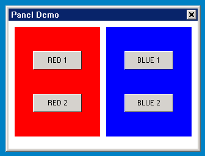
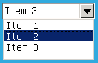
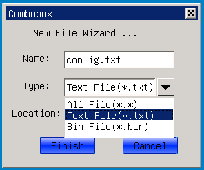

# 面板及其派生类

## 1 面板类控件简介

该类控件是容纳其它各类控件的容器类控件，一般为组合控件类和主窗口类。

面板及其派生类的类继承关系如下：

- [`mWidget`](MiniGUIProgGuidePart2Chapter04-zh.md#3-mwidget)
   - [`mPanel`](#2-mpanel)
      - [`mComboBox`](#3-mcombobox)
      - `mMainWnd`
         - `mDialogBox`

## 2 `mPanel`

- 控件名称: `NCSCTRL_PANEL`
- 英文名: Panel
- 简要介绍: 其他控件的容器，多用于对控件进行分组操作。通过将控件分组到 panel 控件中，可以方便地显示或隐藏一组控件。
- 示意图:
 
 的风格

### 2.2 `mPanel` 属性

继承自 [mWidget](MiniGUIProgGuidePart2Chapter04-zh.md#3-mwidget) 的属性

### 2.3 `mPanel` 事件

继承自 [mWidget](MiniGUIProgGuidePart2Chapter04-zh.md#3-mwidget) 的事件

### 2.4 `mPanel` 方法

继承自 [`mWidget`](MiniGUIProgGuidePart2Chapter04-zh.md#3-mwidget) 的方法

该类没有新增方法。

### 2.5 `mPanel` 渲染器

继承自 [mWidget](MiniGUIProgGuidePart2Chapter04-zh#3-mwidget) 渲染器

`mPanel` 无新增加渲染器方法。

### 2.6 `mPanel` 实例

本实例为用户演示了如何使用 panel 对多个控件进行分组。



图 1  panel 程序的输出

__清单 1__  panel.c

```c
/*
** $Id: panel.c 594 2009-10-10 05:59:06Z xwyan $
**
** Listing P2C6.1
**
** panel.c: Sample program for mGNCS Programming Guide
**      The demo application for Panel.
**
** Copyright (C) 2009 Feynman Software.
*/
#include <stdio.h>
#include <stdlib.h>
#include <string.h>

// START_OF_INCS
#include <minigui/common.h>
#include <minigui/minigui.h>
#include <minigui/gdi.h>
#include <minigui/window.h>

#include <mgncs/mgncs.h>
// END_OF_INCS

#define     ID_PANEL_GROUP1     101
#define     ID_PANEL_GROUP2     102

#define     ID_RED1             201
#define     ID_RED2             202
#define     ID_BLUE1            301
#define     ID_BLUE2            302

// START_OF_REDGROUP
static NCS_WND_TEMPLATE _ctrl_group1[] = {
        {
                NCSCTRL_BUTTON, 
                ID_RED1,
                30, 40, 80, 30,
                WS_VISIBLE,
                WS_EX_NONE,
                "RED 1",
                NULL,
                NULL,
                NULL,
                NULL,
                0,
        },
        {
                NCSCTRL_BUTTON, 
                ID_RED2,
                30, 110, 80, 30,
                WS_VISIBLE,
                WS_EX_NONE,
                "RED 2",
                NULL,
                NULL,
                NULL,
                NULL,
                0,
        },
};
// END_OF_REDGROUP

// START_OF_BLUEGROUP
static NCS_WND_TEMPLATE _ctrl_group2[] = {
        {
                NCSCTRL_BUTTON, 
                ID_BLUE1,
                30, 40, 80, 30,
                WS_VISIBLE,
                WS_EX_NONE,
                "BLUE 1",
                NULL,
                NULL,
                NULL,
                NULL,
                0,
        },
        {
                NCSCTRL_BUTTON, 
                ID_BLUE2,
                30, 110, 80, 30,
                WS_VISIBLE,
                WS_EX_NONE,
                "BLUE 2",
                NULL,
                NULL,
                NULL,
                NULL,
                0,
        },
};
// END_OF_BLUEGROUP

// START_OF_PANEL
static NCS_WND_TEMPLATE panel_tmpl[] = {
        {
                NCSCTRL_PANEL, 
                ID_PANEL_GROUP1,
                10, 10, 140, 180,
                WS_VISIBLE,
                WS_EX_NONE,
                "Red Group",
                NULL,
                NULL,
                NULL,
                _ctrl_group1, 
                sizeof(_ctrl_group1)/sizeof(NCS_WND_TEMPLATE),
                0,
                0xFF0000FF,
        },
        {
                NCSCTRL_PANEL, 
                ID_PANEL_GROUP2,
                160, 10, 140, 180,
                WS_VISIBLE,
                WS_EX_NONE,
                "Blue Group",
                NULL,
                NULL,
                NULL,
                _ctrl_group2,
                sizeof(_ctrl_group2)/sizeof(NCS_WND_TEMPLATE), 
                0,
                0xFFFF0000,
        },
};
// END_OF_PANEL

// START_OF_HANDLERS
static BOOL mainwnd_onCreate(mWidget* self, DWORD add_data)
{
        _c(self)->addChildren(self, panel_tmpl, \
        sizeof(panel_tmpl)/sizeof(NCS_WND_TEMPLATE));
        return TRUE;
}

static void mainwnd_onClose(mWidget* self, int message)
{
        DestroyMainWindow(self->hwnd);
        PostQuitMessage(0);
}


static NCS_EVENT_HANDLER mainwnd_handlers[] = {
        {MSG_CREATE, mainwnd_onCreate},
        {MSG_CLOSE, mainwnd_onClose},
        {0, NULL}
};
// END_OF_HANDLERS

int MiniGUIMain(int argc, const char* argv[])
{
        MSG Msg;
        
        ncsInitialize ();
        
        mWidget* mainwnd = ncsCreateMainWindow (
        NCSCTRL_MAINWND, "Panel Demo",
        WS_CAPTION | WS_BORDER | WS_VISIBLE,
        WS_EX_NONE,
        1, 
        0, 0, 320,240,
        HWND_DESKTOP,
        0, 0,
        NULL,
        NULL,
        mainwnd_handlers,
        0);
        
        // START_OF_MSGLOOP
        while (GetMessage (&Msg, mainwnd->hwnd)) {
                TranslateMessage (&Msg);
                DispatchMessage (&Msg);
        }
        // END_OF_MSGLOOP
        
        MainWindowThreadCleanup (mainwnd->hwnd);
        ncsUninitialize ();
        
        return 0;
}
```

## 3 `mCombobox`

- 控件名称: `NCSCTRL_COMBOBOX`
- 英文名: Combobox
- 简要介绍: 融合了一个编辑框和一个列表框，用户可以直接在编辑框中键入文本，也可以从列表框列出的可选项中选择一个已有的条目。可以很好的完成用户的输入和选择功能。一般浏览器中的地址栏就是一个很好的应用。
- 示意图:



### 3.1 `mCombobox` 风格

继承自 [mPanel](#21-mpanel-风格) 的风格

| 风格名 | mStudio 属性名 | 说明 |
|:------|:--------------|:----|
| `NCSS_CMBOX_SIMPLE` | `Type->Simple` | 简单组合框 |
| `NCSS_CMBOX_DROPDOWNLIST` | `Type->DropDownList` | 下拉组合框 |
| `NCSS_CMBOX_SORT` | `Sort->TRUE` | 字符串自动排序 |
| `NCSS_CMBOX_EDITNOBORDER` | `EditHasBorder->FALSE` | 编辑框没有边框 |
| `NCSS_CMBOX_EDITBASELINE` | `EditHasBaseLine->TRUE` | 编辑框显示带下划线字符 |
| `NCSS_CMBOX_READONLY` | `ReadOnly` | 编辑框显示的内容只读 |
| `NCSS_CMBOX_UPPERCASE` | `Case->Upper` | 编辑框显示内容全部转成大写字母显示 |
| `NCSS_CMBOX_LOWERCASE` | `Case->Lower` | 编辑框显示内容全部转成小写字母显示 |
| `NCSS_CMBOX_AUTOFOCUS` | `AutoFocus->TRUE`  | 控件获取焦点自动转给编辑框 |

### 3.2 `mCombobox` 属性

继承自 [mPanel](#22-mpanel-属性) 的属性

| 属性名 | mStudio 属性名 | 类型 | RW | 说明 |
|:------|:--------------|:----|:----|:----|
| `NCSP_COMB_DROPDOWNHEIGHT` | `DropDownHeight` | int | `RW` | 下拉列表的高度 |
| `NCSP_COMB_ITEMHEIGHT` | `ItemHeight` | int | `RW` | 列表项的高度 |
| `NCSP_COMB_ITEMCOUNT` | `ItemCount` | int | `RO` | 列表项数目 |
| `NCSP_COMB_TEXTLIMIT` | `TextLimit` | int | `RW` | 编辑框限定 |
| `NCSP_COMB_SELECT` | -- | int | `RW` | 选择项索引 |

### 3.3 `mCombobox` 事件

继承自 [mPanel](#23-mpanel-事件) 的事件

| 事件 ID | 参数 | 说明 |
|:-------|:-----|:----|
| `NCSN_CMBOX_SELCHANGE` | -- | 选中项改变 |
| `NCSN_CMBOX_SETFOCUS` | -- | 获得焦点 |
| `NCSN_CMBOX_KILLFOCUS` | -- | 失去焦点 |
| `NCSN_CMBOX_EDITCHANGE` | -- | 编辑框内容改变 |
| `NCSN_CMBOX_DROPDOWN` | -- | 下拉列表弹出 |
| `NCSN_CMBOX_CLOSEUP` | -- | 下拉列表关闭 |
| `NCSN_CMBOX_SELECTOK` | -- | 下拉列表关闭时选择一项 |
| `NCSN_CMBOX_SELECTCANCEL` | -- | 下拉列表关闭时没有选择 |

### 3.4 `mCombobox` 方法

继承自 [mPanel](#24-mpanel-方法) 的方法

#### 3.4.1 `addItem`

```c
BOOL addItem(mCombobox *self, const char *item, DWORD addData);
```

- 参数：
   - item -- 添加选择项的内容
   - `addData` -- 该项的附加数据
- 说明：<BR>
      给 combobox 的下拉列表添加选择项
- 示例：

```c
char *items = {
    "first item --- Chinese",
    "second item --- German",
    "third item -- English"
};
//向下拉列表添加三项
for (i = 0; i < 3; i++)
{
    _c(combo)->addItem(combo, items[i]， 0);
}
```

#### 3.4.2 `removeItem`

```c
 BOOL removeItem(mCombobox *self, int index);
```

- 参数：
   - index -- 要删除项的索引
- 说明：<BR>
      从 combobox 的下拉列表删除某个选择项
- 示例：

```c
//删除掉下拉列表的第一项
_c(combo)->removeItem(combo, 0);
```

#### 3.4.3 `setItem`

```c
BOOL setItem(mCombobox *self, int index, const char *item); 
```

- 参数：
   - index -- 要修改项的索引
- 说明：<BR>
      修改 combobox 的下拉列表某个选择项的内容
- 示例：

```c
//修改下拉列表的第一项的内容为“new content”
_c(combo)->setItem(combo, 0, "new content");
```

#### 3.4.4 `getItem`

```c
const char* getItem(mCombobox *self, int index); 
```

- 参数：
   - index -- 要获取项的索引
- 说明：<BR>
      获取 combobox 的下拉列表某个选择项的内容
- 示例：

```c
const char *item_1 = _c(combo)->getItem(combo, 0);
```

#### 3.4.5 `setAddData`

```c
void* setAddData(mCombobox *self, int index, DWORD addData); 
```

- 参数：
   - index -- 要设置附加数据的项的索引
   - `addData` -- 附加数据信息
- 说明： <BR>
      设置 combobox 的下拉列表某个选择项的附加数据
- 示例：

```c
PBITMAP pbmp;
LoadBitmap (......);
_c(combo)->setAddData(combo, 0, (DWORD)pbmp);
```

#### 3.4.6 `getAddData`

```c
DWORD getAddData(mCombobox *self, int index); 
```

- 参数：
   - index -- 要获取附加数据的项的索引
- 说明：<BR>
      获取 combobox 的下拉列表某个选择项的附加数据
- 示例：

```c
DWORD add = _c(combo)->getAddData(combo, 0);
```

### 3.5 `mCombobox` 渲染器

继承自 [mPanel](#25-mpanel-渲染器) 渲染器

#### 3.5.1 `mCombobox` Classic 渲染器

| 属性名 | mStudio 属性名 | 类型 | 示意图 | 说明 |
|:------|:--------------|:----|:------|:-----|
| `NCS_BGC_3DBODY` | `ColorBg3DBody` | `DWORD`(`ARGB`) |  | 绘制下拉按钮的颜色 |
| `NCS_FGC_WINDOW` | `ColorFgWindow` | `DWORD`(`ARGB`) |  | 绘制下拉按钮的箭头的颜色 |

#### 3.5.2 `mCombobox` Fashion 渲染器

| 属性名 | mStudio 属性名 | 类型 | 示意图 | 说明 |
|:------|:--------------|:----|:------|:-----|
| `NCS_BGC_3DBODY` | `ColorBg3DBody` | `DWORD`(`ARGB`) |  | 绘制下拉按钮的颜色 |
| `NCS_FGC_WINDOW` | `ColorFgWindow` | `DWORD`(`ARGB`) |  | 绘制下拉按钮的箭头的颜色 |
| `NCS_METRICS_3DBODY_ROUNDX` | `RoundX` | int | | 下拉按钮的圆角 x 向半径 |
| `NCS_METRICS_3DBODY_ROUNDY` | `RoundY` | int | | 下拉按钮的圆角 y 向半径 |
| `NCS_MODE_BGC` | `GradientMode` | int |  | 渐变效果的绘制模式（水平渐变 or 竖直渐变） |

#### 3.5.3 `mCombobox` Skin 渲染器

参阅“[Skin 渲染器使用的图片资源规范]()”中“[图片规范]()”

#### 3.5.4 `mCombobox` Flat 渲染器

| 属性名 | mStudio 属性名 | 类型 | 示意图 | 说明 |
|:------|:--------------|:----|:------|:-----|
| `NCS_BGC_3DBODY` | `ColorBg3DBody` | `DWORD`(`ARGB`) |  | 绘制下拉按钮的颜色 |
| `NCS_FGC_WINDOW` | `ColorFgWindow` | `DWORD`(`ARGB`) |  | 绘制下拉按钮的箭头的颜色 |

### 3.6 `mCombobox` 实例



__清单 2__  combobox.c

```c
/*
** $Id$
**
** Listing P2C1.4
**
** combobox.c: Sample program for mGNCS Programming Guide
**      Using Combobox.
**
** Copyright (C) 2009 Feynman Software.
*/

#include <stdio.h>
#include <stdlib.h>
#include <string.h>

#include <minigui/common.h>
#include <minigui/minigui.h>
#include <minigui/gdi.h>
#include <minigui/window.h>
#include <minigui/control.h>

#include <mgncs/mgncs.h>


#define ID_BTN  201
#define ID_NAME 202
#define ID_TYPE 203
#define ID_LOCA 204

static const char *file_type[] = 
{
        "All File(*.*)",
        "Text File(*.txt)",
        "Bin File(*.bin)",
};

static BOOL mymain_onCreate (mWidget* _this, DWORD add_data)
{
        int i;
        
        // get combobox
        mCombobox *com = (mCombobox *)ncsGetChildObj(_this->hwnd, ID_TYPE);
        
        // add items 
        for (i = 0; i < sizeof(file_type)/sizeof(file_type[0]); i++)     {         _c(com)->addItem(com, file_type[i], 0);
        }
        
        // set the selected item
        _c(com)->setProperty(com, NCSP_COMB_SELECT, 1);
        
        return TRUE;
}

static void mymain_onClose (mWidget* _this, int message)
{
        DestroyMainWindow (_this->hwnd);
        PostQuitMessage (_this->hwnd);
}

static void mymain_onPaint(mWidget *self, HDC hdc, const CLIPRGN* inv)
{
        SetBkMode (hdc, BM_TRANSPARENT);
        TextOut (hdc, 40, 10, "New File Wizard ...");
}

static NCS_EVENT_HANDLER mymain_handlers[] = {
        {MSG_CREATE, mymain_onCreate},
        {MSG_CLOSE,  mymain_onClose},
        {MSG_PAINT,  mymain_onPaint},
        {0, NULL}
};

static void btn_onClicked(mWidget* _this, int id, int nc, HWND hCtrl)
{
        if(nc == NCSN_WIDGET_CLICKED)
        {
                PostMessage(GetParent(_this->hwnd), MSG_CLOSE, 0, 0);
        }
};

static NCS_EVENT_HANDLER btn_handlers[] = 
{
        {NCS_NOTIFY_CODE(NCSN_WIDGET_CLICKED), btn_onClicked},
        {0, NULL}
};

static NCS_RDR_INFO btn_rdr_info[] =
{
        {"fashion","fashion", NULL}
};

//START_OF_INITIAL_PROPS
static NCS_PROP_ENTRY combo_props[] = 
{
        { 0, 0 }
};
//END_OF_INITIAL_PROPS

//START_OF_TEMPLATE
static NCS_WND_TEMPLATE _ctrl_templ[] = 
{    
        {
                NCSCTRL_STATIC, 
                0,
                10, 40, 70, 30,
                WS_VISIBLE,
                WS_EX_NONE,
                "Name:",
                NULL,
                NULL,
                NULL, NULL, 0, 0
        },
        {
                NCSCTRL_SLEDIT, 
                ID_NAME,
                85, 45, 160, 25,
                WS_VISIBLE | WS_BORDER,
                WS_EX_NONE,
                "",
                combo_props,
                NULL,
                NULL, NULL, 0, 0
        },
        {
                NCSCTRL_STATIC, 
                0,
                10, 80, 70, 30,
                WS_VISIBLE,
                WS_EX_NONE,
                "Type:",
                NULL,
                NULL,
                NULL, NULL, 0, 0
        },
        {
                NCSCTRL_COMBOBOX, 
                ID_TYPE,
                85, 85, 160, 25,
                WS_VISIBLE | NCSS_CMBOX_DROPDOWNLIST,
                WS_EX_NONE,
                "",
                combo_props,
                NULL,
                NULL, NULL, 0, 0
        },
        {
                NCSCTRL_STATIC, 
                0,
                10, 120, 70, 30,
                WS_VISIBLE,
                WS_EX_NONE,
                "Location:",
                NULL,
                NULL,
                NULL, NULL, 0, 0
        },
        {
                NCSCTRL_SLEDIT, 
                ID_LOCA,
                85, 125, 160, 25,
                WS_VISIBLE | WS_BORDER,
                WS_EX_NONE,
                "",
                combo_props,
                NULL,
                NULL, NULL, 0, 0
        },
        {
                NCSCTRL_BUTTON, 
                ID_BTN,
                50, 170, 80, 25,
                WS_VISIBLE | NCSS_NOTIFY,
                WS_EX_NONE,
                "Finish",
                NULL,
                btn_rdr_info,
                btn_handlers, NULL, 0, 0
        },
        {
                NCSCTRL_BUTTON, 
                ID_BTN,
                170, 170, 80, 25,
                WS_VISIBLE | NCSS_NOTIFY,
                WS_EX_NONE,
                "Cancel",
                NULL,
                btn_rdr_info,
                btn_handlers, NULL, 0, 0
        },
        
};
//END_OF_TEMPLATE

static NCS_MNWND_TEMPLATE mymain_templ =
{
        NCSCTRL_DIALOGBOX, 
        1,
        0, 0, 320, 240,
        WS_CAPTION | WS_BORDER | WS_VISIBLE,
        WS_EX_NONE,
        "Combobox",
        NULL,
        NULL,
        mymain_handlers,
        _ctrl_templ,
        sizeof(_ctrl_templ)/sizeof(NCS_WND_TEMPLATE),
        0,
        0, 0,
};

int MiniGUIMain (int argc, const char* argv[])
{
        ncsInitialize ();
        
        mDialogBox* mydlg = (mDialogBox *)ncsCreateMainWindowIndirect 
        (&mymain_templ, HWND_DESKTOP);
        
        _c(mydlg)->doModal (mydlg, TRUE);
        
        ncsUninitialize ();
        
        return 0;
}
```
