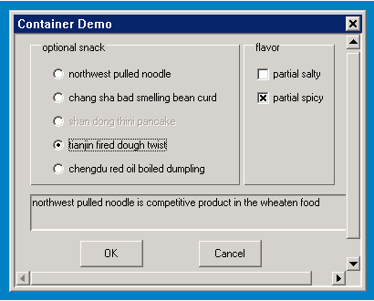

# 容器及其派生类

## 1 容器类控件简介

该类控件是容纳其它各类控件的容器类控件，与面板类控件不同的是，该类控件提供默认的窗口滚动处理。

窗口及其派生类的类继承关系如下：

- [mWidget](MiniGUIProgGuidePart2Chapter04-zh#3-mwidget)
   - [mScrollWidget](#2-mscrollwidget)
      - [mContainer](#3-mcontainer)
         - [mPage](#4-mpage)

## 2 `mScrollWidget`

- 控件名称: `NCSCTRL_SCROLLWIDGET`
- 英文名: `ScrollWidget`
- 简要介绍: 所有包括滚动功能控件类的抽象基类。
- 示意图:

<font color='red'>抽象类,不能直接使用</font>

### 2.1 `mScrollWidget` 风格

继承自 [mWidget](MiniGUIProgGuidePart2Chapter04-zh#3-mwidget) 的风格

### 2.2 `mScrollWidget` 属性

继承自 [mWidget](MiniGUIProgGuidePart2Chapter04-zh#3-mwidget) 的属性

| 属性 ID | mStudio 名 | 类型 | 权限 | 说明 |
|:-------|:-----------|:----|:-----|:----|
| `NCSP_SWGT_CONTWIDTH` |   -   | unsigned int | `RW` | 内容宽度 |
| `NCSP_SWGT_CONTHEIGHT` |   -   | unsigned int | `RW` | 内容高度 |
| `NCSP_SWGT_CONTX` | `ContentX` | int | `RW` | 内容在水平方向的偏移值 |
| `NCSP_SWGT_CONTY` | `ContentY` | int | `RW` | 内容在垂直方向的偏移值 |
| `NCSP_SWGT_HSTEPVALUE` | `HStepValue` | unsigned int | `RW` | 滚动内容时的水平步进值 | 
| `NCSP_SWGT_VSTEPVALUE` | `VStepValue` | unsigned int | `RW` | 滚动内容时的垂直步进值 | 
| `NCSP_SWGT_VISWIDTH` |   -   | unsigned int | `RW` | 可视区宽度 |
| `NCSP_SWGT_VISHEIGHT` |   -   | unsigned int | `RW` | 可视区高度 |
| `NCSP_SWGT_MARGINRECT` |   -   | unsigned int | `RW` | 边界矩形 |
| `NCSP_SWGT_DRAWMODE` | `ScrollBarMode` | `ncsSwgtDrawMode` | `RW` | 滚动条显示模式 |

### 2.3 `mScrollWidget` 事件

继承自 [mWidget](MiniGUIProgGuidePart2Chapter04-zh#3-mwidget) 的事件

### 2.4 `mScrollWidget` 方法

继承自 [mWidget](MiniGUIProgGuidePart2Chapter04-zh#3-mwidget) 的方法

`ScrollWidget` 的所有方法均是提供给子类使用的，请避免在具体的控件应用中使用该类接口。

#### 2.4.1 坐标转换相关方法

在处理滚动的窗口内容时涉及到三类坐标：

-  content：指定内容在全部内容中的坐标。
-  viewport：指定内容在可视区域中的坐标。受内容滚动的影响。
-  window：指定内容在窗口中的显示坐标。受 margin 区域影响。

其中 content 为显示内容的原始坐标，window 为在 MiniGUI 窗口中的坐标。若要将一个原始内容的 content 坐标转换为显示用的 window 坐标，二者间需要经过转换，即首先需要将 content 坐标转换到 viewport 坐标，就好比一共几页的内容，把某一页的内容作为当前内容显示的话，该页某一部分的坐标将从相对于整体内容的开始位置到相对于该页起始位置。在最终将内容显示到窗口上时，还需要进行一步 viewport 到 window 的转换，这是因为在窗口的客户区经常会添加一部分 margin，以调整显示效果。相反，将 MiniGUI 窗口中显示的内容位置转换为其在所有内容中的位置也需要相反的两步工作。

三类坐标的关系示意图：


三类坐标之间转换的相应接口为：

```c
void contentToViewport(mScrollWidget *self, int *x, int *y); 
void viewportToWindow(mScrollWidget *self, int *x, int *y);
void contentToWindow(mScrollWidget *self, int *x, int *y);

void windowToViewport(mScrollWidget *self, int *x, int *y);
void viewportToContent(mScrollWidget *self, int *x, int *y);
void windowToContent(mScrollWidget *self, int *x, int *y);
```

#### 2.4.2 初始化相关方法

`ScrollWidget` 控件类默认将 margin 配置为全 0 值，当基于该控件类的子类控件需要与父类不同的 margin 配置时，可通过在构造函数中使用 `initMargins` 方法重新配置。 

```c
void initMargins(mScrollWidget *self, int l, int t, int r, int b);
```

如 iconview 控件类在 construct 方法中使用下面的代码初始化上下左右的 margin 值均为 5。

```c
    _c(self)->initMargins(self, 5, 5, 5, 5);
```

#### 2.4.3 刷新相关方法

`ScrollWidget` 在自动调整滚动条区域和对显示区域相关的配置设置时需要对屏幕进行刷新，为了满足不同控件的处理需要，提供了两个回调方便上层控件处理，同时 `ScrollWidget` 也提供了默认处理实现：

```c
void moveContent(mScrollWidget *self);
void refreshRect(mScrollWidget *self, const RECT *rc);
```

-  `moveContent` 多用于滚动内容后的更新，如滚动窗口后的全屏刷新。
-  `refreshRect` 用于刷新指定区域的内容。


#### 2.4.4 获取信息方法

`ScrollWidget` 提供 `isVisible` 方法供子类在判断某一内容位置在当前显示区域是否可见，以让子类判断是否需要滚屏等操作。同时在子类进行内容绘制时，需要要内容绘制在指定的可视区，`getVisRect` 方法为获取允许绘制的最大范围提供了便利。

```c
BOOL (*isVisible)(mScrollWidget *self, int x, int y);
void (*getVisRect)(mScrollWidget *self, RECT *rcVis);
```

-  `isVisible` 用来判断指定内容位置当前是否在可视区域内。
-  `getVisRect` 用于获取当前可视区域。

#### 2.4.5 设置相关方法

`ScrollWidget` 及其派生类在窗口大小改变或内容改动时均需要对不同信息进行相应的设置，因此 `ScrollWidget` 提供了下面几个方法：

```c
void resetViewPort(mScrollWidget *self, unsigned int visW,unsigned int visH);
void setScrollInfo(mScrollWidget *self, BOOL reDraw);
BOOL makePosVisible(mScrollWidget *self, int x, int y);
```

- `resetViewport` 用于重新调整可视区域的大小。如窗口大小改变时，需要使用该接口调整可视区。
- `setScrollInfo` 方法提供给子类控件使用，当可视区域或内容区域的大小变化时进行相应的滚动条信息设置。
- `makePosVisible` 用于自动将指定的内容位置显示在可视区内。

### 2.5 `mScrollWidget` 渲染器

继承自 [mWidget](MiniGUIProgGuidePart2Chapter04-zh#3-mwidget) 渲染器

`mScrollWidget` 无新增加渲染器方法。

## 3 `mContainer`

- 控件名称: `NCSCTRL_CONTAINER`
- 英文名: Container
- 简要介绍: 具有滚动支持的容器类控件。

### 3.1 `mContainer` 风格

继承自 [mScrollWidget 的风格](#21-mscrollwidget-风格)

### 3.2 `mContainer` 属性

继承自 [mScrollWidget 的属性](#22-mscrollwidget-属性)

### 3.3 `mContainer` 事件

继承自 [mScrollWidget 的事件](#23-mscrollwidget-事件)

### 3.4 `mContainer` 方法

继承自 [mScrollWidget 的事件](#24-mscrollwidget-属性)

#### 3.4.1 添加控件方法

Container 对 mGNCS 控件和 MiniGUI 固有控件都提供支持。如果需要向 Container 中添加一组 mGNCS 控件，可使用从 `mWidget` 类继承下来的 `addChildren` 方法。

```c
BOOL addChildren(mContainer *self, NCS_WND_TEMPLATE* children, int count); 
```

```c
static NCS_PROP_ENTRY radioGroup_props [] = {
        {NCSP_BUTTON_GROUPID, IDC_RDOGROUP},
        {0, 0}
};

static NCS_WND_TEMPLATE ncsCtrlYourTaste[] = {
        {
                NCSCTRL_BUTTONGROUP, 
                IDC_RDOGROUP,
                16, 10, 230, 160,
                WS_VISIBLE,
                WS_EX_TRANSPARENT,
                "optional snack",
                NULL,
                NULL, 
                NULL,
                NULL,
                0,
                0 
        },
        {
                NCSCTRL_RADIOBUTTON, 
                IDC_LAMIAN,
                36, 38, 200, 20,
                WS_VISIBLE | WS_TABSTOP | NCSS_BUTTON_AUTOCHECK,
                WS_EX_NONE,
                "northwest pulled noodle",
                radioGroup_props, 
                NULL, 
                NULL,
                NULL,
                0,
                0 
        },
        {
                NCSCTRL_RADIOBUTTON, 
                IDC_CHOUDOUFU, 
                36, 64, 200, 20, 
                WS_VISIBLE | WS_TABSTOP | NCSS_BUTTON_AUTOCHECK,
                WS_EX_NONE,
                "chang sha bad smelling bean curd",
                radioGroup_props, 
                NULL, 
                NULL,
                NULL,
                0,
                0 
        },
        {
                NCSCTRL_RADIOBUTTON, 
                IDC_JIANBING,
                36, 90, 200, 20,
                WS_VISIBLE | WS_TABSTOP | WS_DISABLED,
                WS_EX_NONE,
                "shan dong thini pancake",
                radioGroup_props, 
                NULL, 
                NULL,
                NULL,
                0,
                0 
        },
        {
                NCSCTRL_RADIOBUTTON, 
                IDC_MAHUA,
                36, 116, 200, 20,
                WS_VISIBLE | WS_TABSTOP | NCSS_BUTTON_AUTOCHECK,
                WS_EX_NONE,
                "tianjin fired dough twist",
                radioGroup_props, 
                NULL, 
                NULL,
                NULL,
                0,
                0 
        },
        {
                NCSCTRL_RADIOBUTTON, 
                IDC_SHUIJIAO,
                36, 142, 200, 20,
                WS_VISIBLE | WS_TABSTOP | NCSS_BUTTON_AUTOCHECK,
                WS_EX_NONE,
                "chengdu red oil boiled dumpling",
                radioGroup_props, 
                NULL, 
                NULL,
                NULL,
                0,
                0 
        },
        {
                NCSCTRL_BUTTONGROUP, 
                IDC_CKGROUP,
                250, 10, 100, 160,
                WS_VISIBLE,
                WS_EX_TRANSPARENT,
                "flavor",
                NULL, 
                NULL,
                NULL,
                NULL,
                0,
                0 
        },
        {
                NCSCTRL_CHECKBUTTON, 
                IDC_XIAN,
                260, 38, 80, 20,
                WS_VISIBLE | NCSS_BUTTON_AUTOCHECK,
                WS_EX_NONE,
                "partial salty",
                //checkGroup_props, 
                NULL,
                NULL, 
                NULL,
                NULL,
                0,
                0 
        },
        {
                NCSCTRL_CHECKBUTTON, 
                IDC_LA,
                260, 64, 80, 20, 
                WS_VISIBLE | NCSS_BUTTON_AUTOCHECK,
                WS_EX_NONE,
                "partial spicy",
                //checkGroup_props, 
                NULL,
                NULL, 
                NULL,
                NULL,
                0,
                0 
        },
        {
                NCSCTRL_STATIC, 
                IDC_PROMPT,
                16, 180, 360, 40,
                WS_VISIBLE,
                WS_EX_NONE,
                "northwest pulled noodle is competitive product in the wheaten food",
                NULL,
                NULL, 
                NULL,
                NULL,
                0,
                0 
        },
        {
                NCSCTRL_BUTTON, 
                IDOK,
                70, 230, 70, 30,
                WS_VISIBLE | WS_TABSTOP | NCSS_NOTIFY,
                WS_EX_NONE,
                "Ok",
                NULL, 
                NULL, 
                NULL,
                NULL,
                0,
                0 
        },
        {
                NCSCTRL_BUTTON, 
                IDCANCEL,
                200, 230, 70, 30,
                WS_VISIBLE | WS_TABSTOP | NCSS_NOTIFY,
                WS_EX_NONE,
                "Cancel",
                NULL, 
                NULL, 
                NULL,
                NULL,
                0,
                0 
        },
};
```

向 Container 中添加一组 MiniGUI 固有控件，可使用 `addIntrinsicControls` 方法：

```c
BOOL addIntrinsicControls(mContainer *self, const PCTRLDATA pCtrl, int nCount);
```


```c
static CTRLDATA CtrlYourTaste[] =
{ 
        {
                "static",
                WS_VISIBLE | SS_GROUPBOX, 
                16, 10, 230, 160,
                IDC_STATIC,
                "optional snack",
                0,
                WS_EX_TRANSPARENT
        },
        {
                "button",
                WS_VISIBLE | BS_AUTORADIOBUTTON | BS_CHECKED | WS_TABSTOP | WS_GROUP,
                36, 38, 200, 20,
                IDC_LAMIAN,
                "northwest pulled noodle",
                0
        },
        {
                "button",
                WS_VISIBLE | BS_AUTORADIOBUTTON, 
                36, 64, 200, 20, 
                IDC_CHOUDOUFU, 
                "chang sha bad smelling bean curd",
                0
        },
        {
                "button",
                WS_VISIBLE | BS_AUTORADIOBUTTON | WS_DISABLED,
                36, 90, 200, 20,
                IDC_JIANBING,
                "shan dong thini pancake",
                0
        },
        {
                "button",
                WS_VISIBLE | BS_AUTORADIOBUTTON,
                36, 116, 200, 20,
                IDC_MAHUA,
                "tianjin fired dough twist",
                0
        },
        {
                "button",
                WS_VISIBLE | BS_AUTORADIOBUTTON,
                36, 142, 200, 20,
                IDC_SHUIJIAO,
                "chengdu red oil boiled dumpling",
                0
        },
        {
                "static",
                WS_VISIBLE | SS_GROUPBOX | WS_GROUP, 
                250, 10, 100, 160,
                IDC_STATIC,
                "flavor",
                0,
                WS_EX_TRANSPARENT
        },
        {
                "button",
                WS_VISIBLE | BS_AUTOCHECKBOX,
                260, 38, 80, 20,
                IDC_XIAN,
                "partial salty",
                0
        },
        {
                "button",
                WS_VISIBLE | BS_AUTOCHECKBOX | BS_CHECKED, 
                260, 64, 80, 20, 
                IDC_LA, 
                "partial spicy",
                0
        },
        {
                "static",
                WS_VISIBLE | SS_LEFT | WS_GROUP | WS_BORDER,
                16, 180, 360, 40,
                IDC_PROMPT,
                "northwest pulled noodle is competitive product in the wheaten food",
                0
        },
        {
                "button",
                WS_VISIBLE | BS_DEFPUSHBUTTON | WS_TABSTOP | WS_GROUP | WS_BORDER ,
                70, 230, 70, 30,
                IDOK, 
                "OK",
                0
        },
        {
                "button",
                WS_VISIBLE | BS_PUSHBUTTON | WS_TABSTOP,
                200, 230, 70, 30,
                IDCANCEL,
                "Cancel",
                0
        },
};
```

#### 3.4.2 焦点相关方法

在 Container 中经常需要设置和获取当前焦点控件，对此提供了下面 2 个方法：

```c
HWND setFocus(mContainer *self, int id);
HWND getFocus(mContainer *self);
```

- `setFocus` 通过控件 ID 设置焦点控件。
- `getFocus` 获取当前焦点控件的句柄。

#### 3.4.3 其它方法

Container 提供 `adjustContent` 方法允许应用通过其内容进行自身大小的调整功能，而不是通过 Container 控制控件显示范围。`getPanel` 方法可以获取当前 Container 内容的 hosting 窗口句柄。

```c
HWND getPanel(mContainer *self);
void adjustContent(mContainer *self);
```

### 3.5 `mContainer` 渲染器

继承自 [mScrollWidget 渲染器](#25-mscrollwidget-渲染器)

`mContainer` 无新增加渲染器方法。

### 3.6 `mContainer` 实例

本实例为用户演示了如何使用 Container 实现在超出窗口大小的多个控件间跳转。



图 1  Container 程序的输出

__清单 1__  container.c

```c
/*
** $Id: container.c 596 2009-10-10 08:49:44Z xwyan $
**
** Listing P2C7.1
**
** container.c: Sample program for mGNCS Programming Guide
**      The demo application for Container.
**
** Copyright (C) 2009 Feynman Software.
*/
#include <stdio.h>
#include <stdlib.h>
#include <string.h>

// START_OF_INCS
#include <minigui/common.h>
#include <minigui/minigui.h>
#include <minigui/gdi.h>
#include <minigui/window.h>
#include <minigui/control.h>

#include <mgncs/mgncs.h>
// END_OF_INCS

#define IDC_CONTAINER   100

#define IDC_RDOGROUP    151
#define IDC_CKGROUP     152

#define IDC_LAMIAN      101
#define IDC_CHOUDOUFU   102
#define IDC_JIANBING    103
#define IDC_MAHUA       104
#define IDC_SHUIJIAO    105
#define IDC_XIAN        110
#define IDC_LA          111
#define IDC_PROMPT      200

// START_OF_NCSCTRLS
static NCS_PROP_ENTRY radioGroup_props [] = {
        {NCSP_BUTTON_GROUPID, IDC_RDOGROUP},
        {0, 0}
};

static NCS_WND_TEMPLATE ncsCtrlYourTaste[] = {
        {
                NCSCTRL_BUTTONGROUP, 
                IDC_RDOGROUP,
                16, 10, 230, 160,
                WS_VISIBLE,
                WS_EX_TRANSPARENT,
                "optional snack",
                NULL,
                NULL, 
                NULL,
                NULL,
                0,
                0 
        },
        {
                NCSCTRL_RADIOBUTTON, 
                IDC_LAMIAN,
                36, 38, 200, 20,
                WS_VISIBLE | WS_TABSTOP | NCSS_BUTTON_AUTOCHECK,
                WS_EX_NONE,
                "northwest pulled noodle",
                radioGroup_props, 
                NULL, 
                NULL,
                NULL,
                0,
                0 
        },
        {
                NCSCTRL_RADIOBUTTON, 
                IDC_CHOUDOUFU, 
                36, 64, 200, 20, 
                WS_VISIBLE | WS_TABSTOP | NCSS_BUTTON_AUTOCHECK,
                WS_EX_NONE,
                "chang sha bad smelling bean curd",
                radioGroup_props, 
                NULL, 
                NULL,
                NULL,
                0,
                0 
        },
        {
                NCSCTRL_RADIOBUTTON, 
                IDC_JIANBING,
                36, 90, 200, 20,
                WS_VISIBLE | WS_TABSTOP | WS_DISABLED,
                WS_EX_NONE,
                "shan dong thini pancake",
                radioGroup_props, 
                NULL, 
                NULL,
                NULL,
                0,
                0 
        },
        {
                NCSCTRL_RADIOBUTTON, 
                IDC_MAHUA,
                36, 116, 200, 20,
                WS_VISIBLE | WS_TABSTOP | NCSS_BUTTON_AUTOCHECK,
                WS_EX_NONE,
                "tianjin fired dough twist",
                radioGroup_props, 
                NULL, 
                NULL,
                NULL,
                0,
                0 
        },
        {
                NCSCTRL_RADIOBUTTON, 
                IDC_SHUIJIAO,
                36, 142, 200, 20,
                WS_VISIBLE | WS_TABSTOP | NCSS_BUTTON_AUTOCHECK,
                WS_EX_NONE,
                "chengdu red oil boiled dumpling",
                radioGroup_props, 
                NULL, 
                NULL,
                NULL,
                0,
                0 
        },
        {
                NCSCTRL_BUTTONGROUP, 
                IDC_CKGROUP,
                250, 10, 100, 160,
                WS_VISIBLE,
                WS_EX_TRANSPARENT,
                "flavor",
                NULL, 
                NULL,
                NULL,
                NULL,
                0,
                0 
        },
        {
                NCSCTRL_CHECKBUTTON, 
                IDC_XIAN,
                260, 38, 80, 20,
                WS_VISIBLE | NCSS_BUTTON_AUTOCHECK,
                WS_EX_NONE,
                "partial salty",
                //checkGroup_props, 
                NULL,
                NULL, 
                NULL,
                NULL,
                0,
                0 
        },
        {
                NCSCTRL_CHECKBUTTON, 
                IDC_LA,
                260, 64, 80, 20, 
                WS_VISIBLE | NCSS_BUTTON_AUTOCHECK,
                WS_EX_NONE,
                "partial spicy",
                //checkGroup_props, 
                NULL,
                NULL, 
                NULL,
                NULL,
                0,
                0 
        },
        {
                NCSCTRL_STATIC, 
                IDC_PROMPT,
                16, 180, 360, 40,
                WS_VISIBLE,
                WS_EX_NONE,
                "northwest pulled noodle is competitive product in the wheaten food",
                NULL,
                NULL, 
                NULL,
                NULL,
                0,
                0 
        },
        {
                NCSCTRL_BUTTON, 
                IDOK,
                70, 230, 70, 30,
                WS_VISIBLE | WS_TABSTOP | NCSS_NOTIFY,
                WS_EX_NONE,
                "Ok",
                NULL, 
                NULL, 
                NULL,
                NULL,
                0,
                0 
        },
        {
                NCSCTRL_BUTTON, 
                IDCANCEL,
                200, 230, 70, 30,
                WS_VISIBLE | WS_TABSTOP | NCSS_NOTIFY,
                WS_EX_NONE,
                "Cancel",
                NULL, 
                NULL, 
                NULL,
                NULL,
                0,
                0 
        },
};
// END_OF_NCSCTRLS

// START_OF_INTRINSICCTRLS
static CTRLDATA CtrlYourTaste[] =
{ 
        {
                "static",
                WS_VISIBLE | SS_GROUPBOX, 
                16, 10, 230, 160,
                IDC_STATIC,
                "optional snack",
                0,
                WS_EX_TRANSPARENT
        },
        {
                "button",
                WS_VISIBLE | BS_AUTORADIOBUTTON | BS_CHECKED | WS_TABSTOP | WS_GROUP,
                36, 38, 200, 20,
                IDC_LAMIAN,
                "northwest pulled noodle",
                0
        },
        {
                "button",
                WS_VISIBLE | BS_AUTORADIOBUTTON, 
                36, 64, 200, 20, 
                IDC_CHOUDOUFU, 
                "chang sha bad smelling bean curd",
                0
        },
        {
                "button",
                WS_VISIBLE | BS_AUTORADIOBUTTON | WS_DISABLED,
                36, 90, 200, 20,
                IDC_JIANBING,
                "shan dong thini pancake",
                0
        },
        {
                "button",
                WS_VISIBLE | BS_AUTORADIOBUTTON,
                36, 116, 200, 20,
                IDC_MAHUA,
                "tianjin fired dough twist",
                0
        },
        {
                "button",
                WS_VISIBLE | BS_AUTORADIOBUTTON,
                36, 142, 200, 20,
                IDC_SHUIJIAO,
                "chengdu red oil boiled dumpling",
                0
        },
        {
                "static",
                WS_VISIBLE | SS_GROUPBOX | WS_GROUP, 
                250, 10, 100, 160,
                IDC_STATIC,
                "flavor",
                0,
                WS_EX_TRANSPARENT
        },
        {
                "button",
                WS_VISIBLE | BS_AUTOCHECKBOX,
                260, 38, 80, 20,
                IDC_XIAN,
                "partial salty",
                0
        },
        {
                "button",
                WS_VISIBLE | BS_AUTOCHECKBOX | BS_CHECKED, 
                260, 64, 80, 20, 
                IDC_LA, 
                "partial spicy",
                0
        },
        {
                "static",
                WS_VISIBLE | SS_LEFT | WS_GROUP | WS_BORDER,
                16, 180, 360, 40,
                IDC_PROMPT,
                "northwest pulled noodle is competitive product in the wheaten food",
                0
        },
        {
                "button",
                WS_VISIBLE | BS_DEFPUSHBUTTON | WS_TABSTOP | WS_GROUP | WS_BORDER ,
                70, 230, 70, 30,
                IDOK, 
                "OK",
                0
        },
        {
                "button",
                WS_VISIBLE | BS_PUSHBUTTON | WS_TABSTOP,
                200, 230, 70, 30,
                IDCANCEL,
                "Cancel",
                0
        },
};
// END_OF_INTRINSICCTRLS

// START_OF_HANDLERS
static void dialog_onCSizeChanged(mWidget* self, int clientWidth, int clientHeight)
{
        HWND hContainer = GetDlgItem(self->hwnd, IDC_CONTAINER);
        if (hContainer != HWND_NULL || hContainer != HWND_INVALID)
        MoveWindow(hContainer, 0, 0, clientWidth, clientHeight, TRUE);
}

static BOOL container_onCommand(mWidget* self, int id, int nc, HWND hCtrl)
{
        if (id == IDOK || id == IDCANCEL) {
                
                if (nc == NCSN_BUTTON_PUSHED) {
                        //close dialog
                        HWND hParent = GetParent(self->hwnd);
                        SendNotifyMessage(hParent, 
                        MSG_COMMAND, (WPARAM)MAKELONG(id, nc), (LPARAM)hCtrl);
                }
                
                return FALSE;
        }
        
        return FALSE;
}

static NCS_EVENT_HANDLER container_handlers[] = {
        {MSG_COMMAND, container_onCommand},
        {0, NULL}
};
// END_OF_HANDLERS

int MiniGUIMain(int argc, const char* argv[])
{
        ncsInitialize ();
        
        mDialogBox* dialog = (mDialogBox*)ncsCreateMainWindow (
        NCSCTRL_DIALOGBOX, "Container Demo",
        WS_CAPTION | WS_BORDER | WS_VISIBLE | NCSS_MNWND_MODE,
        WS_EX_NONE,
        1, 
        0, 0, 400, 320,
        HWND_DESKTOP,
        0, 0,
        NULL,
        NULL,
        NULL,
        0);
        
        ncsSetComponentHandler((mComponent*)dialog, 
        MSG_CSIZECHANGED, dialog_onCSizeChanged);
        
        mContainer *container = 
        (mContainer*)ncsCreateWindow (NCSCTRL_CONTAINER, 
        "", 
        WS_BORDER | WS_VISIBLE,
        WS_EX_NONE,
        IDC_CONTAINER, 
        0, 0, 300, 200, dialog->hwnd,
        NULL, NULL, container_handlers, 0);
        
        if (argc > 1 && strcmp(argv[1], "intrinsic") == 0) {
                _c(container)->addIntrinsicControls (container, CtrlYourTaste, 
                sizeof(CtrlYourTaste)/sizeof(CTRLDATA));
        }
        else {
                _c(container)->addChildren(container, ncsCtrlYourTaste, 
                sizeof(ncsCtrlYourTaste)/sizeof(NCS_WND_TEMPLATE));
        }
        
        _c(dialog)->doModal(dialog, TRUE);
        
        MainWindowThreadCleanup (dialog->hwnd);
        ncsUninitialize ();
        
        return 0;
}
```

## 4 `mPage`

- 控件名称: `NCSCTRL_PAGE`
- 英文名: Page
- 简要介绍: 属性页控件，用于显示同类信息及窗口内容。

### 4.1 `mPage` 风格

继承自 [mContainer 风格](#31-mcontainer-风格)

### 4.2 mPage 属性

继承自 [mContainer 属性](#32-mcontainer-属性)

### 4.3 mPage 事件

继承自 [mContainer 事件](#33-mcontainer-事件)

### 4.4 mPage 方法

继承自 [mContainer 方法](#34-mcontainer-方法)

### 4.5 mPage 渲染器

继承自 [mContainer 渲染器](#35-mcontainer-渲染器)

`mPage` 无新增加渲染器方法。

### 4.6 `mPage` 实例
