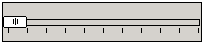

# 滑动控件类

## 1 滑动控件简介

滑动控件主要是对一个值的调节逻辑的可视化实现， 通过拖拽滑动控件，使用户对调节亮度、音量等场合， 以及需要对某一范围的量值进行调节的操作更加直观， 免去了键盘输入的麻烦。

- 滑动控件类层次关系
   - [mWidget](MiniGUIProgGuidePart2Chapter04-zh#3-mwidget)
      - [mSlider](#2-mslider)
         - [mTrackBar](#3-mtrackbar)
         - [mScrollBar](#4-mscrollbar)

- 控件创建方法
   - 自动创建：通过 mStudio 中的界面设计器，拖拽对应的滑动控件，mStudio 将自动创建控件，并提供可视化的控件配置，同时自动生成创建代码。
   - 手动生成：按照 mGNCS 控件创建过程，通过编程，传入对应控件窗口类 ID，生成控件，手动编程设置控件属性、事件处理。

## 2 `mSlider`

- 控件窗口类: `NCSCTRL_SLIDER`
- 控件英文名: Slider
- 简介: Slider 系列控件的基本类。
- 示意图:

	<font color='red'>该控件为抽象控件， 不能直接使用</font> 

### 2.1 `mSlider` 风格

继承自 [`mWidget`](MiniGUIProgGuidePart2Chapter04-zh#3-mwidget) 的风格

| 风格名 | mStudio 属性名 | 说明 |
|:------|:--------------|:-----|
| `NCSS_SLD_HORIZONTAL` | -- | 创建水平的 Slider 控件（默认） |
| `NCSS_SLD_VERTICAL` | -- | 创建竖直的 Slider 控件 |

### 2.2 `mSlider` 属性

继承自 [`mWidget`](MiniGUIProgGuidePart2Chapter04-zh#3-mwidget) 的属性

| 属性 | mStudio 属性名 | 类型 | RW | 说明 | 注释 |
|:----|:--------------|:-----|:---|:----|:----|
| `NCSP_SLD_MAXPOS` | -- | int | `RW` | 设置 Slider 的滑动范围最大值 | 最值的设定一般在初始化的时候做 |
| `NCSP_SLD_MINPOS` | -- | int | `RW` | 设置 Slider 的滑动范围最小值 | 同上 |
| `NCSP_SLD_CURPOS` | -- | int | `RW` | 设置滑动块的当前位置 ||
| `NCSP_SLD_LINESTEP` | -- | int | `RW` | 设置步长（方向键） ||
| `NCSP_SLD_PAGESTEP` | -- | int | `RW` | 设置步长（pageUp/pageDown） ||

### 2.3 `mSlider` 事件

继承自 [`mWidget`](MiniGUIProgGuidePart2Chapter04-zh#3-mwidget) 的事件

| 事件 ID | 参数 | 说明 |
|:-------|:----|:-----|
| `NCSN_SLD_CHANGED` | -- | 滑块位置变化 |
| `NCSN_SLD_REACHMAX` | -- | 滑块到达最大值 |
| `NCSN_SLD_REACHMIN` | -- | 滑块到达最小值 |

### 2.4 `mSlider` 方法

继承自 [`mWidget`](MiniGUIProgGuidePart2Chapter04-zh#3-mwidget) 的方法

### 2.5 `mSlider` 示例

<font color='red'>该控件为抽象控件， 不能直接使用</font> 

## 3 `mTrackBar`

- 控件窗口类: `NCSCTRL_TRACKBAR`
- 控件英文名: Trackbar
- 简介: 滑块控件对范围内量值进行调节。
- 示意图: 



### 3.1 `mTrackBar` 风格

继承自 [mSlider](#2-mslider) 的风格

| 风格名 | mStudio 属性名 | 说明 |
|:------|:--------------|:-----|
| `NCSS_TRKBAR_HORIZONTAL` | -- | 创建水平的 Trackbar 控件（默认） |
| `NCSS_TRKBAR_VERTICAL` | -- | 创建竖直的 Trackbar 控件 |
| `NCSS_TRKBAR_NOTICK` | Ruler -> False | 不显示刻度 |
| `NCSS_TRKBAR_NOTICK` | Ruler -> True | 显示刻度 |

### 3.2 `mTrackBar` 属性

继承自 [mSlider](#2-mslider) 的属性

| 属性 | mStudio 属性名 | 类型 | RW | 说明 | 注释 |
|:----|:--------------|:-----|:---|:----|:----|
| `NCSP_TRKBAR_MAXPOS` | `MaxPos` | int | `RW` | 设置 Trackbar 的滑动范围最大值 | 最值的设定一般在初始化的时候做 |
| `NCSP_TRKBAR_MINPOS` | `MinPos` | int | `RW` | 设置 Trackbar 的滑动范围最小值 | 同上 |
| `NCSP_TRKBAR_CURPOS` | `CurPos` | int | `RW` | 设置滑动块的当前位置 ||
| `NCSP_TRKBAR_LINESTEP` | `LineStep` | int | `RW` | 设置步长（方向键） ||
| `NCSP_TRKBAR_PAGESTEP` | `PageStep` | int | `RW` | 设置步长（pageUp/pageDown） ||

### 3.3 `mTrackBar` 事件

继承自 [mSlider](#2-mslider) 的事件

| 事件 ID | 参数 | 说明 |
|:-------|:----|:-----|
| `NCSN_TRKBAR_CHANGED` | -- | 滑块位置变化 |
| `NCSN_TRKBAR_REACHMAX` | -- | 滑块到达最大值 |
| `NCSN_TRKBAR_REACHMIN` | -- | 滑块到达最小值 |

### 3.4 `mTrackBar` 方法

继承自 [mSlider](#2-mslider) 的方法

### 3.5 `mTrackBar` 渲染器
#### 3.5.1 `mTrackBar` Classic 渲染器

非客户区的绘制请查阅 [mWidget](MiniGUIProgGuidePart2Chapter04-zh#3-mwidget) 的渲染器

| 属性 ID | 含义 | mStudio 属性名 | 值类型 | 生效区域示意图 | 值域 |
|:-------|:-----|:--------------|:------|:------------|:-----|
| `NCS_BGC_3DBODY` | 滑块和滑轨颜色 | `ColorBg3DBody` | `DWORD`(`ARGB`) |  | |
| `NCS_BGC_DISABLED_ITEM` | 控件无效时滑块颜色 | `ColorBgDisable` | `DWORD`(`ARGB`) |  | |

#### 3.5.2 `mTrackBar` Skin渲 染器

参阅 [附录B : Skin 渲染器使用的图片资源规范]()

#### 3.5.3 `mTrackBar` Fashion 渲染器

非客户区绘制请参阅 [`mWidget`](MiniGUIProgGuidePart2Chapter04-zh#3-mwidget) 的 Fashion 渲染器绘制

| 属性 ID | 含义 | mStudio 属性名 | 值类型 | 生效区域示意图 | 值域 |
|:-------|:-----|:--------------|:------|:------------|:-----|
| `NCS_BGC_3DBODY` | 滑块颜色 | `ColorBg3DBody` | `DWORD`(`ARGB`) |  |  | |
| `NCS_BGC_TRKBAR_SLIDER` | 滑轨颜色 | `SliderColor` | `DWORD`(`ARGB`) |  | |
| `NCS_METRICS_3DBODY_ROUNDX` | 滑块圆角 X 半径 | `ThumbRoundX` | int | | 0 ~ 窗口宽度的 1/2 |
| `NCS_METRICS_3DBODY_ROUNDY` | 滑块圆角 Y 半径 | `ThumbRoundY` | int | | 0 ~窗口高度的 1/2 |

#### 3.5.4 `mTrackBar` Flat 渲染器

非客户区绘制请参阅 [`mWidget`](MiniGUIProgGuidePart2Chapter04-zh#3-mwidget) 的 Flat 渲染器绘制

| 属性 ID | 含义 | mStudio 属性名 | 值类型 | 生效区域示意图 | 值域 |
|:-------|:-----|:--------------|:------|:------------|:-----|
| `NCS_FGC_3DBODY` | 滑块边颜色 | `ColorFg3DBody` | `DWORD`(`ARGB`) |  | |
| `NCS_BGC_3DBODY` | 滑块颜色 | `ColorBg3DBody` | `DWORD`(`ARGB`) | 同 Classic 渲染器 | |

### 3.6 `mTrackBar` 示例


图 1  trackbar 示例

__清单 1__ trackbar.c

```c
#include <stdio.h>
#include <stdlib.h>
#include <string.h>

#include <minigui/common.h>
#include <minigui/minigui.h>
#include <minigui/gdi.h>
#include <minigui/window.h>
#include <minigui/control.h>

#include <mgncs/mgncs.h>

#define ID_TRB1     101
#define ID_TRB2     102
#define ID_RECT		200

static BOOL mymain_onCreate(mWidget* self, DWORD add_data)
{
        return TRUE;
}

static void mymain_onClose(mWidget* self, int message)
{
        DestroyMainWindow(self->hwnd);
        PostQuitMessage(0);
}

static NCS_PROP_ENTRY trk_props [] = {
        {NCSP_TRKBAR_MINPOS, 0},
        {NCSP_TRKBAR_MAXPOS, 25},
        {NCSP_TRKBAR_CURPOS, 0},
        {NCSP_TRKBAR_LINESTEP, 5},
        {NCSP_TRKBAR_PAGESTEP, 5},
        {0, 0}
};

static void trackbar_notify(mTrackBar* self, int id, int code, DWORD add_data)
{
        mRectangle *rect = (mRectangle*)ncsGetChildObj(GetParent(self->hwnd), ID_RECT);
        
        if(rect)
        {
                DWORD fill_color = _c(rect)->getProperty(rect, NCSP_RECTANGLE_FILLCOLOR);
                int r = GetRValue(fill_color);
                int g = GetGValue(fill_color);
                int b = GetBValue(fill_color);
                int v = _c(self)->getProperty(self, NCSP_TRKBAR_CURPOS);
                switch(id)
                {
                        case ID_TRB1:
                        r = 10 * v;
                        break;
                        case ID_TRB2:
                        g = 10 * v;
                        break;
                }
                
                fill_color = MakeRGBA(r, g, b,255);
                
                const RECT rc = {10, 10, 230, 230};
                
                _c(rect)->setProperty(rect, NCSP_RECTANGLE_FILLCOLOR, fill_color);
                InvalidateRect(rect->hwnd, &rc, TRUE);
        }
}
static NCS_RDR_INFO track_rdr_info[] =
{
        {"flat", "flat", NULL},
        //{"skin", "skin", NULL},
        //{"classic", "classic", NULL},
        //{"fashion","fashion",NULL}
};


static NCS_EVENT_HANDLER trk1_handlers[] = {
        NCS_MAP_NOTIFY(NCSN_TRKBAR_CHANGED, trackbar_notify),
        {0, NULL}
};

static NCS_EVENT_HANDLER trk2_handlers[] = {
        NCS_MAP_NOTIFY(NCSN_TRKBAR_CHANGED, trackbar_notify),
        {0, NULL}
};


//Controls
static NCS_WND_TEMPLATE _ctrl_templ[] = {
        {
                NCSCTRL_RECTANGLE,
                ID_RECT,
                10, 10, 230, 230,
                WS_VISIBLE,
                WS_EX_NONE,
                "",
                NULL, //props,
                NULL,//btn2_rdr_info, //rdr_info
                NULL, //handlers,
                NULL, //controls
                0,
                0 //add data
        },
        
        {
                NCSCTRL_TRACKBAR, 
                ID_TRB1,
                10, 260, 240, 40,
                WS_BORDER | WS_VISIBLE | NCSS_TRKBAR_NOTICK | NCSS_NOTIFY ,
                WS_EX_TRANSPARENT,
                "",
                trk_props, //props,
                track_rdr_info, //rdr_info
                trk1_handlers, //handlers,
                NULL, //controls
                0,
                0, //add data
                MakeRGBA(255,0,0,255)
        },
        {
                NCSCTRL_TRACKBAR, 
                ID_TRB2,
                260, 10, 40, 240,
                WS_BORDER | WS_VISIBLE | NCSS_NOTIFY | NCSS_TRKBAR_VERTICAL,
                WS_EX_NONE,
                "",
                trk_props, //props,
                track_rdr_info, //rdr_info
                trk2_handlers, //handlers,
                NULL, //controls
                0,
                0 //add data
        },
};


static NCS_EVENT_HANDLER mymain_handlers[] = {
        {MSG_CREATE, mymain_onCreate },
        {MSG_CLOSE, mymain_onClose },
        {0, NULL }
};

//define the main window template
static NCS_MNWND_TEMPLATE mymain_templ = {
        NCSCTRL_DIALOGBOX, 
        1,
        0, 0, 320, 330,
        WS_CAPTION | WS_BORDER | WS_VISIBLE,
        WS_EX_NONE,
        "Trackbar Test ....",
        NULL,
        NULL,
        mymain_handlers,
        _ctrl_templ,
        sizeof(_ctrl_templ)/sizeof(NCS_WND_TEMPLATE),
        0,
        MakeRGBA(255,255,255,255)
};

int MiniGUIMain(int argc, const char* argv[])
{
        if(argc>1)
        {
                track_rdr_info[0].glb_rdr = argv[1];
                track_rdr_info[0].ctl_rdr = argv[1];
        }
        
        
        ncsInitialize();
        mDialogBox* mydlg = (mDialogBox *)ncsCreateMainWindowIndirect 
        (&mymain_templ, HWND_DESKTOP);
        
        _c(mydlg)->doModal(mydlg, TRUE);
        
        MainWindowThreadCleanup(mydlg->hwnd);
        return 0;
}
```

## 4 `mScrollBar`

- 控件窗口类: `NCSCTRL_SCROLLBAR`
- 控件英文名: Scrollbar
- 简介: 可拖动滑块，常用于窗口内容显示调节。
- 示意图: 


### 4.1 `mScrollBar` 风格

继承自 [mSlider](#2-mslider) 的风格

| 风格名 | mStudio 属性名 | 说明 |
|:------|:--------------|:-----|
| `NCSS_SCRLBR_HORIZONTAL` | -- | 创建水平的 scrollbar 控件（默认） |
| `NCSS_SCRLBR_VERTICAL` | -- | 创建竖直的 scrollbar 控件 |
| `NCSS_SCRLBR_ARROWS` | `HaveArrows` | 标记一个滚动条是否有箭头 |
| `NCSS_SCRLBR_LEFTDBLARROWS` | `DoubleArrows -> Left` | 标记一个滚动条是否有左双箭头 (和 `NCSS_SCROLLBAR_RIGHTDBLARROWS` 互斥) |
| `NCSS_SCRLBR_RIGHTDBLARROWS` | `DoubleArrows -> Right` | 标记一个滚动条是否有右双箭头(和 `NCSS_SCROLLBAR_LEFTDBLARROWS` 互斥) |
| `NCSS_SCRLBR_UPDBLARROWS` | `DoubleArrows -> Up` | 标记一个滚动条是否有上箭头(和 `NCSS_SCROLLBAR_DOWNDBLAROWS` 互斥) |
| `NCSS_SCRLBR_DOWNDBLAROWS` | `DoubleArrows -> Down` | 标记一个滚动条是否有下箭头(和 `NCSS_SCROLLBAR_DUPDBLAROWS` 互斥) |

### 4.2 `mScrollBar` 属性

继承自 [mSlider](#2-mslider) 的属性

| 属性 | mStudio 属性名 | 类型 | RW | 说明 | 注释 |
|:----|:--------------|:-----|:---|:----|:----|
| `NCSP_SCRLBR_MAXPOS` | `MaxPos` | int | `RW` | 设置 scrollbar 的滑动范围最大值 | 最值的设定一般在初始化的时候做 |
| `NCSP_SCRLBR_MINPOS` | `MinPos` | int | `RW` | 设置 scrollbar 的滑动范围最小值 | ^ |
| `NCSP_SCRLBR_CURPOS` | `CurPos` | int | `RW` | 设置滑动块的当前位置 ||
| `NCSP_SCRLBR_LINESTEP` | `LineStep` | int | `RW` | 设置步长（方向键） ||
| `NCSP_SCRLBR_PAGESTEP` | `PageStep` | int | `RW` | 设置步长（pageUp/pageDown） ||

### 4.3 `mScrollBar` 事件

继承自 [mSlider](#2-mslider) 的事件

| 事件 ID | 参数 | 说明 |
|:-------|:----|:-----|
| `NCSN_SCRLBR_CHANGED` | -- | 滑块位置变化 |
| `NCSN_SCRLBR_REACHMAX` | -- | 滑块到达最大值 |
| `NCSN_SCRLBR_REACHMIN` | -- | 滑块到达最小值 |

### 4.4 `mScrollBar` 方法

继承自 [mSlider](#2-mslider) 的方法

### 4.5 `mScrollBar` 渲染器
#### 4.5.1 `mScrollBar` Classic 渲染器

非客户区的绘制请查阅 [mWidget](MiniGUIProgGuidePart2Chapter04-zh#3-mwidget) 的渲染器

| 属性 ID | 含义 | mStudio 属性名 | 值类型 | 生效区域示意图 | 值域 |
|:-------|:-----|:--------------|:------|:------------|:-----|
| `NCS_BGC_3DBODY` | 控件背景色 | `BgColor` | `DWORD`(`ARGB`) |  | |
| `NCS_BGC_DISABLED_ITEM` | 控件无效时滑块和箭头按钮颜色 | `ColorBgDisable` | `DWORD`(`ARGB`) | | |
| `NCS_FGC_3DBODY` | 按钮上箭头颜色 | `ArrowColor` | `DWORD`(`ARGB`) |  | |
| `NCS_FGC_DISABLED_ITEM` | 按钮无效时箭头颜色 | `ArrowColorDisable` | `DWORD`(`ARGB`) |  | |

#### 4.5.2 `mScrollBar` Skin 渲染器

参阅 [附录B : Skin 渲染器使用的图片资源规范]()

#### 4.5.3 `mScrollBar` Fashion 渲染器

非客户区绘制请参阅 [mWidget](MiniGUIProgGuidePart2Chapter04-zh#3-mwidget) 的 Fashion 渲染器绘制

| 属性 ID | 含义 | mStudio 属性名 | 值类型 | 生效区域示意图 | 值域 |
|:-------|:-----|:--------------|:------|:------------|:-----|
| `NCS_BGC_3DBODY` | 滑块和按钮颜色 | `ColorBg3DBody` | `DWORD`(`ARGB`) |  | |
| `NCS_BGC_DISABLED_ITEM` | 控件无效时滑块和箭头按钮颜色 | `ColorBgDisable` | `DWORD`(`ARGB`) | 同 Classic 渲染器 | |
| `NCS_BGC_WINDOW` | 滑轨颜色 | `ColorBgWindow` | `DWORD`(`ARGB`) |  | |
| `NCS_FGC_DISABLED_ITEM` | 按钮无效时箭头颜色 | `ArrowColorDisable` | `DWORD`(`ARGB`) | 同 Classic 渲染器 | |
| `NCS_METRICS_3DBODY_ROUNDX` | 滑块圆角X半径 | `RoundX` | int | | 0 ~ 窗口宽度的 1/2 |
| `NCS_METRICS_3DBODY_ROUNDY` | 滑块圆角Y半径 | `RoundY` | int| | 0 ~窗口高度的1/2 |
| `NCS_MODE_BGC` | 渐变填充方式 | `GradientMode` | int | | [GradientMode](MiniGUIProgGuidePart2Chapter06-zh#83-GrandientMode) |
| | | | |  | |

#### 4.5.4 mScrollBar Flat渲染器
非客户区绘制请参阅[[MStudioMGNCSV1dot0PGP2C3#mWidget][mWidget]]的Flat渲染器绘制

| 属性 ID | 含义 | mStudio 属性名 | 值类型 | 生效区域示意图 | 值域 |
|:-------|:-----|:--------------|:------|:------------|:-----|
| `NCS_FGC_3DBODY` | 滑块和按钮边颜色 | `ColorFg3DBody` | `DWORD`(`ARGB`) |  | |
| `NCS_BGC_3DBODY` | 控件背景色 | `ColorBg3DBody` | `DWORD`(`ARGB`) |  | |

### 4.6 `mScrollbar` 示例


__图 2__  scrollbar 示例

__清单 2__ scrollbar.c

```c
#include <stdio.h>
#include <stdlib.h>
#include <string.h>

#include <minigui/common.h>
#include <minigui/minigui.h>
#include <minigui/gdi.h>
#include <minigui/window.h>
#include <minigui/control.h>

#include <mgncs/mgncs.h>

#define ID_SB1  100
#define ID_SB2  101

static RECT rcCircle = {0, 0, 400, 400};
static int radius_x = 0;
static int radius_y = 0;

static BOOL mymain_onCreate(mWidget* self, DWORD add_data)
{
        return TRUE;
}
static void mymain_onClose(mWidget* self, int message)
{
        DestroyMainWindow(self->hwnd);
        PostQuitMessage(0);
}

static void mymain_onPaint(mWidget* self, HDC hdc, const PCLIPRGN clip_rgn)
{
        ClipRectIntersect(hdc, &rcCircle);
        Ellipse(hdc, 130, 200, radius_x, radius_y);
}

//define the progress properites
static NCS_PROP_ENTRY scrollbar_props [] = {
        {NCSP_SCRLBR_MAXPOS, 255},
        {NCSP_SCRLBR_MINPOS, 0 },
        {NCSP_SCRLBR_LINESTEP, 5},
        {NCSP_SCRLBR_CURPOS, 10 },
        { 0, 0 }
};


static void scrollbar_notify(mScrollBar* self, int id, int code, DWORD add_data)
{
        HWND hWnd = GetParent(self->hwnd);
        
        if(id == ID_SB1)	
        radius_x = _c(self)->getProperty(self, NCSP_SCRLBR_CURPOS);
        
        if(id == ID_SB2)	
        radius_y = _c(self)->getProperty(self, NCSP_SCRLBR_CURPOS);
        
        InvalidateRect(hWnd, &rcCircle, TRUE);
}

static NCS_EVENT_HANDLER scrollbar_notifies[] = {
        NCS_MAP_NOTIFY(NCSN_SCRLBR_CHANGED, scrollbar_notify),
        {0, NULL}
};

static NCS_RDR_INFO sb_rdr_info[] =
{
        {"flat", "flat", NULL},
        //{"skin", "skin", NULL},
        //{"fashion","fashion", NULL}
};

//Controls
static NCS_WND_TEMPLATE _ctrl_templ[] = {
        {
                NCSCTRL_SCROLLBAR, 
                ID_SB1,
                0, 440, 270, 25,
                WS_BORDER | NCSS_NOTIFY | WS_VISIBLE | NCSS_SCRLBR_ARROWS,
                WS_EX_NONE,
                "",
                scrollbar_props, //props,
                sb_rdr_info, //rdr_info
                scrollbar_notifies,
                NULL, //controls
                0,
                0 //add data
        },
        {
                NCSCTRL_SCROLLBAR, 
                ID_SB2,
                270, 10, 20, 430,
                WS_BORDER | NCSS_NOTIFY | WS_VISIBLE \
                | NCSS_SCRLBR_ARROWS | NCSS_SCRLBR_VERTICAL,
                WS_EX_NONE,
                "",
                scrollbar_props, //props,
                sb_rdr_info, //rdr_info
                scrollbar_notifies,
                NULL, //controls
                0,
                0 //add data
        },
};


static NCS_EVENT_HANDLER mymain_handlers[] = {
        {MSG_CREATE, mymain_onCreate},
        {MSG_CLOSE, mymain_onClose},
        {MSG_PAINT, mymain_onPaint},
        {0, NULL}
};

//define the main window template
static NCS_MNWND_TEMPLATE mymain_templ = {
        NCSCTRL_DIALOGBOX, 
        1,
        0, 0, 300, 500,
        WS_CAPTION | WS_BORDER | WS_VISIBLE,
        WS_EX_NONE,
        "scrollbar Test ....",
        NULL,
        NULL,
        mymain_handlers,
        _ctrl_templ,
        sizeof(_ctrl_templ)/sizeof(NCS_WND_TEMPLATE),
        0,
        0, 0,
};

int MiniGUIMain(int argc, const char* argv[])
{
        if(argc>1)
        {
                sb_rdr_info[0].glb_rdr = argv[1];
                sb_rdr_info[0].ctl_rdr = argv[1];
        }
        
        ncsInitialize();
        mDialogBox* mydlg = (mDialogBox *)ncsCreateMainWindowIndirect 
        (&mymain_templ, HWND_DESKTOP);
        
        _c(mydlg)->doModal(mydlg, TRUE);
        
        MainWindowThreadCleanup(mydlg->hwnd);
        return 0;
}
```

