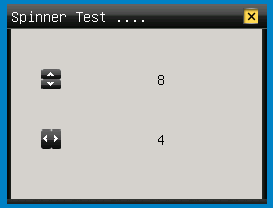
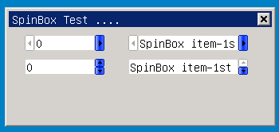

# 旋钮类控件

## 1 旋钮类控件简介

旋钮类控件通常由一组箭头按钮（上下或者左右），通常表示一个范围，通过箭头控制，可以一步一步的改变值。

mGNCS提供两种按钮，mSpinner和mSpinbox，他们的继承关系如下
   
- [mWidget](MiniGUIProgGuidePart2Chapter04-zh#3-mwidget)
   - [mSpinner](#2-mSpinner)
      - [mSpinbox](#3-mSpinbox)

## 2 `mSpinner`

- 控件名称: `NCSCTRL_SPINNER`
- 英文名: Spinner
- 简要介绍: 由两个箭头按钮（上下或者左右）组成的能够控制在一个范围内变化的值的控件
- 示意图: 


   
### 2.1 `mSpinner` 风格

继承自 [mWidget](MiniGUIProgGuidePart2Chapter04-zh#3-mwidget) 的风格

| 风格 ID | mStudio 名 | 说明 |
|:-------|:-----------|:----|
| `NCSS_SPNR_VERTICAL` | `Direction->Vert` | 垂直风格，上下箭头，当点击上下箭头的时候，会向目标窗口发送上下方向键的键盘消息 |
| `NCSS_SPNR_HORIZONTAL` | `Direction->Horz` | 水平风格，左右箭头,当点击左右箭头的时候，会向目标窗口发送左右方向键的键盘消息 |
| `NCSS_SPNR_AUTOLOOP` | `AutoLoop` | 当到达最大或者最小值时，自动跳转到最小或者最大值处 |

### 2.2 `mSpinner` 属性

继承自 [mWidget](MiniGUIProgGuidePart2Chapter04-zh#3-mwidget) 的属性

| 属性 ID | mStudio 名 | 类型 | 权限 | 说明 |
|:-------|:-----------|:-----|:----|:----|
| `NCSP_SPNR_MAXPOS` | `MaxPos` | int | `RW` | 变化范围的最大值 |
| `NCSP_SPNR_MINPOS` | `MinPos` | int | `RW` | 变化范围的最小值 |
| `NCSP_SPNR_CURPOS` | `CurPos` | int | `RW` | 当前值 |
| `NCSP_SPNR_LINESTEP` | `LineStep` | int | `RW` | 步进步长 |
| `NCSP_SPNR_TARGET` | - | `HWND` | `RW` | 目标窗口句柄 | 

### 2.3 `mSpinner` 事件

继承自 [mWidget](MiniGUIProgGuidePart2Chapter04-zh#3-mwidget) 的事件

| 事件 ID | 参数 | 说明 |
|:-------|:-----|:----|
| `NCSN_SPNR_CHANGED` | int 当前属性值 | 当前值变化 |
| `NCSN_SPNR_REACHMAX` | int 当前属性值 | 当前值到达最大值 |
| `NCSN_SPNR_REACHMIN` | int 当前属性值 | 当前值到达最小值 |

### 2.4 `mSpinner` 方法

继承自 [mWidget](MiniGUIProgGuidePart2Chapter04-zh#3-mwidget) 的方法

该类没有新增方法

### 2.5 `mSpinner` 渲染器
#### 2.5.1 `mSpinner` classic 渲染器

非客户区查看 [mWidget](MiniGUIProgGuidePart2Chapter04-zh#3-mwidget) 的 classic 渲染器

| 属性名 | 说明 | mStudio 属性名 | 类型 | 示意图 |
|:------|:----|:--------------|:-----|:------|
| `NCS_BGC_3DBODY` | 背景颜色 | `ColorBg3DBody` | `DWORD`(`ARGB`) |  | | 
| `NCS_FGC_3DBODY` | 前景箭头的颜色 | `ColorFg3DBody` | `DWORD`(`ARGB`) |  | |
| `NCS_BGC_DISABLED_ITEM` | 无效时的背景颜色 | `ColorBgDisable` | `DWORD`(`ARGB`) |  |
| `NCS_FGC_DISABLED_ITEM` | 无效时的箭头颜色 | `ColorFgDisable` | `DWORD`(`ARGB`) |  |

#### 2.5.2 `mSpinner` Skin 渲染器

参阅[附录B : Skin 渲染器使用的图片资源规范]()

#### 2.5.3 `mSpinner` Fashion 渲染器

| 属性名 | 说明 | mStudio 属性名 | 类型 | 示意图 |
|:------|:----|:--------------|:-----|:------|
| `NCS_FGC_3DBODY` | 按钮前景色 | `ColorFg3DBody` | `DWORD`(`ARGB`) | 同 Classic 渲染器 |
| `NCS_FGC_DISABLED_ITEM` | 窗口无效时按钮前景色 |  `ColorFgDisable` | `DWORD`(`ARGB`) | 同 Classic 渲染器 |
| `NCS_BGC_3DBODY` | 背景颜色 | `ColorBg3DBody` |  `DWORD`(`ARGB`) | 同 Classic 渲染器 |
| `NCS_BGC_DISABLED_ITEM` | 窗口无效时文本背景色 | `ColorBgDisable` | `DWORD`(`ARGB`) | 同 Classic 渲染器 |
| `NCS_MODE_BGC` | 渐变填充方式 | `GradientMode` | [GradientMode](MiniGUIProgGuidePart2Chapter06-zh#81-GrandientMode) |  |

#### 2.5.4 `mSpinner` Flat 渲染器

| 属性名 | 说明 | mStudio 属性名 | 类型 | 示意图 |
|:------|:----|:--------------|:-----|:------|
| `NCS_FGC_3DBODY` | 按钮前景色 | `ColorFg3DBody` | `DWORD`(`ARGB`) |  |
| `NCS_BGC_3DBODY` | 背景颜色 | `ColorBg3DBody` | `DWORD`(`ARGB`) |  |

### 2.6 `mSpinner` 示例 

下面的示例（截图见 `mSpinner` 的示意图）演示了 Spinner 和一个 Static 控件关联。当 Spinner 的 pos 改变后，Static 会响应的变化。

- 主要涉及的属性有
   - `NCSP_SPN_MAXPOS`
   - `NCSP_SPN_MINPOS`
   - `NCSP_SPN_CURPOS`
- 主要涉及的事件:
   - `NCSN_SPN_CHANGED`

为了方便我们主要数据绑定的方法来实现

- 示例 [spinner.c](samples/spinner.c)

```c
#include <stdio.h>
#include <stdlib.h>
#include <string.h>

#include <minigui/common.h>
#include <minigui/minigui.h>
#include <minigui/gdi.h>
#include <minigui/window.h>
#include <minigui/control.h>

#include <mgncs/mgncs.h>

#define ID_SPINNER1      101
#define ID_SHOWSPINNER1  201
#define ID_SPINNER2      102
#define ID_SHOWSPINNER2  202

#define MINVALUE        0
#define MAXVALUE        10
#define CURVALUE        5

static BOOL mymain_onCreate(mWidget* self, DWORD add_data)
{
	//START_GET_CTRLS
	mSpinner * spn1, *spn2;
	mStatic  * show1, * show2;
	spn1 = (mSpinner*)_c(self)->getChild(self, ID_SPINNER1);
	spn2 = (mSpinner*)_c(self)->getChild(self, ID_SPINNER2);
	show1 = (mStatic*)_c(self)->getChild(self, ID_SHOWSPINNER1);
	show2 = (mStatic*)_c(self)->getChild(self, ID_SHOWSPINNER2);
	//END_GET_CTRLS
	
	//START_CONNECT_PROPS
	ncsConnectBindProps(
		NCS_CMPT_PROP(spn1, NCSN_SPNR_CHANGED, NCSP_SPNR_CURPOS, NCS_BT_INT, NCS_PROP_FLAG_READ),
		NCS_CMPT_PROP(show1, 0, NCSP_WIDGET_TEXT, NCS_BT_STR, NCS_PROP_FLAG_WRITE),
		NCS_BPT_SINGLE);

	ncsConnectBindProps(
		NCS_CMPT_PROP(spn2, NCSN_SPNR_CHANGED, NCSP_SPNR_CURPOS, NCS_BT_INT, NCS_PROP_FLAG_READ),
		NCS_CMPT_PROP(show2, 0, NCSP_WIDGET_TEXT, NCS_BT_STR, NCS_PROP_FLAG_WRITE),
		NCS_BPT_SINGLE);
	//END_CONNECT_PROPS
	
	//START_UPDATE_CTRLS
	ncsRaiseComponentBindProps((mComponent*)spn1, NCSN_SPNR_CHANGED);
	ncsRaiseComponentBindProps((mComponent*)spn2, NCSN_SPNR_CHANGED);
	//END_UPDATE_CTRLS


	return TRUE;
}

static void mymain_onClose (mWidget* self, int message)
{
	DestroyMainWindow(self->hwnd);
	PostQuitMessage(0);
}

//START_SET_PROPS
//Propties for
static NCS_PROP_ENTRY spinbox_props [] = {
    {NCSP_SPNR_MINPOS, MINVALUE},
    {NCSP_SPNR_MAXPOS, MAXVALUE},
    {NCSP_SPNR_CURPOS, CURVALUE},
    {NCSP_SPNR_LINESTEP, 1},
	{0, 0}
};
//END_SET_PROPS

static NCS_RDR_INFO spin_rdr_info[] =
{
    {"skin", "skin", NULL},
    //{"fashion", "fashion", NULL},
    //{"flat", "flat", NULL},
};

//Controls
static NCS_WND_TEMPLATE _ctrl_templ[] = {
	{
		NCSCTRL_STATIC,
		ID_SHOWSPINNER1,
		100,40, 100,20,
		WS_VISIBLE,
		WS_EX_NONE,
		"",
		NULL,
		NULL,
		0,
		0
	},
	{
		NCSCTRL_SPINNER , 
		ID_SPINNER1,
		30, 40, 20, 20,
		WS_VISIBLE | NCSS_SPNBOX_VERTICAL | NCSS_NOTIFY,
		WS_EX_NONE,
		"spinbox",
		spinbox_props, //props,
		spin_rdr_info, //NULL, //rdr_info
		NULL, //handlers,
		NULL, //controls
		0,
		0 //add data
	},
	{
		NCSCTRL_STATIC,
		ID_SHOWSPINNER2,
		100, 100, 100, 20,
		WS_VISIBLE,
		WS_EX_NONE,
		"",
		NULL,
		NULL,
		0,
		0
	},

    {
		NCSCTRL_SPINNER , 
		ID_SPINNER2,
		30, 100, 20, 20,
		WS_VISIBLE | NCSS_SPNBOX_HORIZONTAL | NCSS_NOTIFY,
		WS_EX_NONE,
		"spinbox",
		spinbox_props, //props,
		spin_rdr_info, //NULL, //rdr_info
		NULL, //handlers,
		NULL, //controls
		0,
		0 //add data
	}
};


static NCS_EVENT_HANDLER mymain_handlers[] = {
	{MSG_CREATE,mymain_onCreate},
	{MSG_CLOSE,mymain_onClose},
	{0, NULL}
};

static NCS_RDR_INFO mymain_rdr_info[] =
{
    {"skin", "skin", NULL},
};


//define the main window template
static NCS_MNWND_TEMPLATE mymain_templ = {
	NCSCTRL_DIALOGBOX, 
	1,
	0, 0, 260, 200,
	WS_CAPTION | WS_BORDER | WS_VISIBLE,
	WS_EX_NONE,
    "Spinner Test ....",
	NULL,
	mymain_rdr_info,
	mymain_handlers,
	_ctrl_templ,
	sizeof(_ctrl_templ)/sizeof(NCS_WND_TEMPLATE),
	0,
	0, 0,
};

int MiniGUIMain(int argc, const char* argv[])
{
	if(argc>1)
	{
		spin_rdr_info[0].glb_rdr = argv[1];
		spin_rdr_info[0].ctl_rdr = argv[1];
	}


	ncsInitialize();
	mDialogBox* mydlg = (mDialogBox *)ncsCreateMainWindowIndirect 
                                (&mymain_templ, HWND_DESKTOP);

	_c(mydlg)->doModal(mydlg, TRUE);

	MainWindowThreadCleanup(mydlg->hwnd);
	return 0;
}

#ifdef _MGRM_THREADS
#include <minigui/dti.c>
#endif
```

- 在窗口的模板定义文件中设置 spinner 的属性

```c
//Propties for
static NCS_PROP_ENTRY spinbox_props [] = {
        {NCSP_SPNR_MINPOS, MINVALUE},
        {NCSP_SPNR_MAXPOS, MAXVALUE},
        {NCSP_SPNR_CURPOS, CURVALUE},
        {NCSP_SPNR_LINESTEP, 1},
        {0, 0}
};
```

- 在主窗口的 `MSG_CREATE` 消息中，建立和 static 的连接
   - 获取窗口对象
```c
mSpinner * spn1, *spn2;
mStatic  * show1, * show2;
spn1 = (mSpinner*)_c(self)->getChild(self, ID_SPINNER1);
spn2 = (mSpinner*)_c(self)->getChild(self, ID_SPINNER2);
show1 = (mStatic*)_c(self)->getChild(self, ID_SHOWSPINNER1);
show2 = (mStatic*)_c(self)->getChild(self, ID_SHOWSPINNER2);
```
-  - 连接窗口属性

```c
ncsConnectBindProps(
NCS_CMPT_PROP(spn1, NCSN_SPNR_CHANGED, NCSP_SPNR_CURPOS, NCS_BT_INT, NCS_PROP_FLAG_READ),
NCS_CMPT_PROP(show1, 0, NCSP_WIDGET_TEXT, NCS_BT_STR, NCS_PROP_FLAG_WRITE),
NCS_BPT_SINGLE);

ncsConnectBindProps(
NCS_CMPT_PROP(spn2, NCSN_SPNR_CHANGED, NCSP_SPNR_CURPOS, NCS_BT_INT, NCS_PROP_FLAG_READ),
NCS_CMPT_PROP(show2, 0, NCSP_WIDGET_TEXT, NCS_BT_STR, NCS_PROP_FLAG_WRITE),
NCS_BPT_SINGLE);
```
-  - 更新当前的信息到 Static 中

```c
ncsRaiseComponentBindProps((mComponent*)spn1, NCSN_SPNR_CHANGED);
ncsRaiseComponentBindProps((mComponent*)spn2, NCSN_SPNR_CHANGED);
```

## 3 `mSpinbox`

- 控件窗口类名:` NCSCTRL_SPINBOX`
- 控件英文名:  Spinbox
- 简要介绍: 把箭头按钮和编辑框组合起来，通过箭头按钮控制编辑框内的内容 
- 示意图: 


### 3.1 `mSpinbox` 风格

继承自 [mSpinner 的风格](#21-mspinner-风格)

| 风格 ID | mStudio 名 | 说明 |
|:-------|:-----------|:----|
| `NCSS_SPNBOX_NUMBER` | `ContentType->Number` |显示数值，可以通过相应的属性指定显示格式 |
| `NCSS_SPNBOX_STRING` | `ContentType->String` | 显示字符串 |
| `NCSS_SPNBOX_SORT` | `Sort` | 字符串自动排序 |
| `NCSS_SPNBOX_EDITNOBORDER` | `EditBorder` | 编辑框没有边框 |
| `NCSS_SPNBOX_EDITBASELINE` | `EditBaseLine` | 编辑框显示带下划线字符 |
| `NCSS_SPNBOX_READONLY` | `ReadOnly` | 编辑框显示的内容只读 |
| `NCSS_SPNBOX_UPPERCASE` | `Case->Upper` | 编辑框显示内容全部转成大写字母显示 |
| `NCSS_SPNBOX_LOWERCASE` | `Case->Lower` | 编辑框显示内容全部转成小写字母显示 |
| `NCSS_SPNBOX_AUTOFOCUS` | `AutoFocus` | 控件获取焦点自动转给编辑框 |

### 3.2 `mSpinbox` 属性

继承自 [mSpinner 的属性](#22-mspinner-属性)

### 3.3 `mSpinbox` 事件

继承自 [mSpinner 的事件](#23-mspinner-事件)

### 3.4 `mSpinbox` 方法

继承自 [mSpinner 的方法](#24-mspinner-方法)

__以下的函数只有在 spinbox 包含 `NCSS_SPNBOX_STRING` 风格时有效__

- `addItem` 增加一个新的项

```c
BOOL (*addItem)(clsName *self, char *item);
```

-  - 增加一个字符串到 spinbox 中
   - 参数：
      - item : 添加的字符串
   - 返回值： 成功 - `TRUE`; 失败 - `FALSE`;

- remove Item

```c
BOOL (*removeItem)(clsName *self, int index);
```

-  - 删除一个 item
   - 参数：
      - index 要删除 item 的索引
   - 返回值：成功 - `TRUE`; 失败 - `FALSE`;

- `setItem`

```c
BOOL (*setItem)(clsName *self, int index, char *item);
```

-  - 设置一个 item 的字符串内容
   - 参数：
      - index 要设置的索引
      - item   新的 item 内容
   - 返回值：成功 - `TRUE`; 失败 - `FALSE`;

- `getItem`

```c
char* (*getItem)(clsName *self, int index);
```

-  - 获取 item 的字符串内容
   - 参数：
      - index item 的索引
   - 返回值：`NULL` - 失败；有效的字符串指针

### 3.5 `mSpinbox` 渲染器

`mSpinbox` 渲染的效果由 [mSpinner](#2-spinner) 和 [mSlEdit](MiniGUIProgGuidePart2Chapter13-zh#3-msledit) 的效果组成，该类本身没有新增的属性

### 3.6 `mSpinbox` 示例

该示例分别说明了水平风格下和垂直风格下，数字型和列表型两种形态下的 spinbox。

示意图：



- 源代码 [spinbox.c](samples/spinbox.c)

- 主要代码如下:

```c
#define ID_SPINBOX1      101
#define ID_SPINBOX2      102
#define ID_SPINBOX3      103
#define ID_SPINBOX4      104

static char * item [] =
{
        "SpinBox item-1st",
        "SpinBox item-2nd",
        "SpinBox item-3rd",
        "SpinBox item-4th"
};

static BOOL mymain_onCreate(mWidget* self, DWORD add_data)
{ 
        int i;
        mSpinBox *spinner3, *spinner4;
        
        spinner3 = (mSpinBox *)_c(self)->getChild(self, ID_SPINBOX3);
        spinner4 = (mSpinBox *)_c(self)->getChild(self, ID_SPINBOX4);
        
        for (i = 0; i < sizeof(item)/sizeof(char*); i++) 	{         _c(spinner3)->addItem (spinner3, item[i]);
                
                _c(spinner4)->addItem (spinner4, item[i]);
                
        }
        
        return TRUE;
}


//Propties for
static NCS_PROP_ENTRY spinner_props [] = {
        
        {NCSP_SPNBOX_MAXPOS, 12},
        {NCSP_SPNBOX_MINPOS, 0},
        {NCSP_SPNBOX_CURPOS, 0},
        {NCSP_SPNBOX_LINESTEP, 1},
        {0, 0}
};
```
