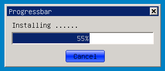

# 进度条控件

## 1 进度条控件简介

进度条控件（ProgressBar）是GUI系统中不可或缺的重要控件之一，可以直观的表示出某项的进度，在进行文件复制、软件安装、文件传输时经常用到。mGNCS中的进度条控件基于MiniGUI 3.0中内置的进度条控件进行了增强和重构，增加了渲染器的设置，使其更加易用，更加绚丽。

- 进度条类层次关系
   - [mWidget](MiniGUIProgGuidePart2Chapter04-zh#3-mwidget)
      - [mProgressBar](#2-mProgressBar)

## 2 `mProgressBar`

- 控件窗口类: `NCSCTRL_PROGRESSBAR`
- 控件英文名: `ProgressBar`
- 简介: 用于表示进度，在进行文件复制、软件安装、文件传输时经常用到。
- 示意图:



### 2.1 `mProgressBar` 风格

继承自 [mWidget](MiniGUIProgGuidePart2Chapter04-zh#3-mwidget) 的风格

| 风格 ID | mStudio 属性名 | 说明 | 注释 |
|:--------|:---------------|:-----|:-----|
| `NCSS_PRGBAR_HORIZONTAL` | -- | mStudio 中将这两种风格分成了两个控件来使用 分别对应为| Horz ProgressBar |
| `NCSS_PRGBAR_VERTICAL` | -- | 同上 | Vert ProgressBar |
| `NCSS_PRGBAR_BLOCKS` | `BlockChunk->TRUE` | 块状进度 |  |
| `NCSS_PRGBAR_SMOOTH` | `BlockChunk->FALSE` | 平滑进度，与上面的块状进度相对 |  |
| `NCSS_PRGBAR_SHOWPERCENT` | `ShowPercent` | 显示当前进度值（百分比)|  |

### 2.2 `mProgressBar` 属性

继承自 [mWidget](MiniGUIProgGuidePart2Chapter04-zh#3-mwidget) 的属性

| 属性名 | mStudio 属性名 | 类型 | RW | 说明 |
|:-------|:---------------|:-----|:---|:-----|
| `NCSP_PROG_MAXPOS` | `MaxPos` | int | `RW` | 进度范围最大值 |
| `NCSP_PROG_MINPOS` | `MinPos` | int | `RW` | 进度范围最小值 |
| `NCSP_PROG_CURPOS` | `CurPos` | int | `RW` | 当前进度值 |
| `NCSP_PROG_LINESTEP` | `LineStep` | int | `RW` | 步长 |

### 2.3 `mProgressBar` 事件

继承自 [mWidget](MiniGUIProgGuidePart2Chapter04-zh#3-mwidget) 的事件

<font color='red'>该控件类没有新增事件</font>

### 2.4 `mProgressBar` 方法

继承自 [mWidget](MiniGUIProgGuidePart2Chapter04-zh#3-mwidget) 的方法

#### 2.4.1 increase

```c
int increase (mProgressBar *self, int delta);
```

- 参数：
   - self ：控件对象指针
   - delta ：增加幅度
- 说明 ： 用户可以使用该函数控制进度值的增加，delta 用来指定增加的量，一般用来控制非匀速的增长效果
-  示例 ：

```c
_c(pb)->increase (pb, 5);    //进度值增加5
```

#### 2.4.2 `stepIncrease`

```c
int stepIncrease (mProgressBar *_this);
```

- 参数：
   - self ：控件对象指针
- 说明：该函数可以步进增加进度值，每调用一次增加一个步长值，可以实现匀速的增长效果，步长值的设定通过相应的属性来完成
- 示例 ：

```c
//设置ProgressBar的步进长度
_c(pb)->setProperty(pb, NCSP_PROG_LINESTEP, 5);
......
_c(pb)->stepIncrease (pb);
```

### 2.5 `mProgressBar` 渲染器
#### 2.5.1 classic 渲染器

继承自 [mWidget](MiniGUIProgGuidePart2Chapter04-zh#3-mwidget) 的 classic 渲染器

| 属性名 | mStudio 属性名 | 类型 | 示意图 | 说明 |
|:-------|:---------------|:-----|:-------|:-----|
| `NCS_BGC_HILIGHT_ITEM` | `ChunkColor` | `DWORD`（`ARGB`） |   | 进度条的 chunk 部分的颜色，本渲染器使用高亮 item 的颜色绘制 |

#### 2.5.2 fashion 渲染器

继承自 [mWidget](MiniGUIProgGuidePart2Chapter04-zh#3-mwidget) 的 fashion 渲染器

| 属性名 | mStudio 属性名 | 类型 | 示意图 | 说明 |
|:------|:--------------|:----|:------|:-----|
| `NCS_BGC_PRGBAR_CHUNK` | `ChunkColor` | `DWORD`（`ARGB`） |   | 进度条的 chunk 部分的基础颜色，渲染器会根据这个颜色进行减淡、加深，来绘制渐变效果的进度条 |

#### 2.5.3 flat 渲染器

继承自 [mWidget](MiniGUIProgGuidePart2Chapter04-zh#3-mwidget) 的 flat 渲染器

| 属性名 | mStudio 属性名 | 类型 | 示意图 | 说明 |
|:------|:--------------|:----|:------|:-----|
| `NCS_FGC_WINDOW` | `ChunkColor` | `DWORD`（`ARGB`） |  | 进度条的chunk部分的颜色,这里使用窗口前景色 |

#### 2.5.4 skin 渲染器

参阅 [附录 B : Skin 渲染器使用的图片资源规范]()中 [ProgressBar 图片规范]()

### 2.6 `mProgressBar` 编程示例

- `ProgressBar` 示例代码 ：[progressbar.c](samples/progressbar.c)

```c
#include <stdio.h>
#include <stdlib.h>
#include <string.h>

#include <minigui/common.h>
#include <minigui/minigui.h>
#include <minigui/gdi.h>
#include <minigui/window.h>
#include <minigui/control.h>

#include <mgncs/mgncs.h>

#define ID_BTN  101
#define ID_PROG 200

static BOOL mymain_onCreate (mWidget* _this, DWORD add_data)
{
    SetTimer (_this->hwnd, 100, 20);
    return TRUE;
}

static void mymain_onClose (mWidget* _this, int message)
{
    DestroyMainWindow (_this->hwnd);
    PostQuitMessage (_this->hwnd);
}

static void mymain_onTimer (mWidget *_this, int id, DWORD count)
{
//START_OF_SET_PROPERTY    
    static int pb_pos = 0;

    mProgressBar *pb = (mProgressBar*)ncsGetChildObj (_this->hwnd, ID_PROG);
    if (pb)
    {
        pb_pos++;
        _c(pb)->setProperty(pb, NCSP_PROG_CURPOS, pb_pos);
    
        if (pb_pos == _c(pb)->getProperty(pb, NCSP_PROG_MAXPOS))
        {
            DestroyMainWindow (_this->hwnd);
            PostQuitMessage (_this->hwnd);
        }
    }
//END_OF_SET_PROPERTY    
}

static void mymain_onPaint(mWidget *self, HDC hdc, const CLIPRGN* inv)
{
    SetBkMode (hdc, BM_TRANSPARENT);
	TextOut (hdc, 10, 10, "Installing ......");
}

static NCS_EVENT_HANDLER mymain_handlers[] = {
    {MSG_CREATE, mymain_onCreate},
    {MSG_CLOSE,  mymain_onClose},
    {MSG_PAINT,  mymain_onPaint},
    {MSG_TIMER,  mymain_onTimer},
    {0, NULL}
};

static void btn_onClicked(mWidget* _this, int id, int nc, HWND hCtrl)
{
    if(nc == NCSN_WIDGET_CLICKED)
    {
        PostMessage(GetParent(_this->hwnd), MSG_CLOSE, 0, 0);
    }
};

static NCS_EVENT_HANDLER btn_handlers[] = 
{
    {NCS_NOTIFY_CODE(NCSN_WIDGET_CLICKED), btn_onClicked},
    {0, NULL}
};

static NCS_RDR_INFO btn_rdr_info[] =
{
    {"fashion","fashion", NULL}
};

//START_OF_INITIAL_PROPS
static NCS_PROP_ENTRY progress_props[] = 
{
    {NCSP_PROG_MAXPOS, 100}, 
    {NCSP_PROG_MINPOS, 0  },
    {NCSP_PROG_LINESTEP, 1},
    {NCSP_PROG_CURPOS, 0  },
    { 0, 0 }
};
//END_OF_INITIAL_PROPS

//START_OF_TEMPLATE
static NCS_WND_TEMPLATE _ctrl_templ[] = 
{
    {
        NCSCTRL_PROGRESSBAR, 
        ID_PROG,
        10, 33, 290, 25,
        WS_BORDER | WS_VISIBLE | NCSS_PRGBAR_SHOWPERCENT,
        WS_EX_NONE,
        "",
        progress_props,
        NULL,
        NULL, NULL, 0, 0
    },
    {
        NCSCTRL_BUTTON, 
        ID_BTN,
        120, 70, 80, 25,
        WS_VISIBLE | NCSS_NOTIFY,
        WS_EX_NONE,
        "Cancel",
        NULL,
        btn_rdr_info,
        btn_handlers, NULL, 0, 0
    },
};
//END_OF_TEMPLATE

static NCS_MNWND_TEMPLATE mymain_templ =
{
    NCSCTRL_DIALOGBOX, 
    1,
    0, 0, 320, 130,
    WS_CAPTION | WS_BORDER | WS_VISIBLE,
    WS_EX_NONE,
    "Progressbar",
    NULL,
    NULL,
    mymain_handlers,
    _ctrl_templ,
    sizeof(_ctrl_templ)/sizeof(NCS_WND_TEMPLATE),
    0,
    0, 0,
};

int MiniGUIMain (int argc, const char* argv[])
{
    ncsInitialize ();

    mDialogBox* mydlg = (mDialogBox *)ncsCreateMainWindowIndirect 
                (&mymain_templ, HWND_DESKTOP);

    _c(mydlg)->doModal (mydlg, TRUE);
 
    ncsUninitialize ();

    return 0;
}
```

- `ProgressBar` 模板

```c
static NCS_WND_TEMPLATE _ctrl_templ[] = 
{
        {
                NCSCTRL_PROGRESSBAR, 
                ID_PROG,
                10, 33, 290, 25,
                WS_BORDER | WS_VISIBLE | NCSS_PRGBAR_SHOWPERCENT,
                WS_EX_NONE,
                "",
                progress_props,
                NULL,
                NULL, NULL, 0, 0
        },
        {
                NCSCTRL_BUTTON, 
                ID_BTN,
                120, 70, 80, 25,
                WS_VISIBLE | NCSS_NOTIFY,
                WS_EX_NONE,
                "Cancel",
                NULL,
                btn_rdr_info,
                btn_handlers, NULL, 0, 0
        },
};
```

- 初始化 `ProgressBar` 属性

```c
static NCS_PROP_ENTRY progress_props[] = 
{
        {NCSP_PROG_MAXPOS, 100}, 
        {NCSP_PROG_MINPOS, 0  },
        {NCSP_PROG_LINESTEP, 1},
        {NCSP_PROG_CURPOS, 0  },
        { 0, 0 }
};
```

- 在 Timer 消息中，改变 `ProgressBar` 的属性值

```c
static int pb_pos = 0;

mProgressBar *pb = (mProgressBar*)ncsGetChildObj (_this->hwnd, ID_PROG);
if (pb)
{
        pb_pos++;
        _c(pb)->setProperty(pb, NCSP_PROG_CURPOS, pb_pos);
        
        if (pb_pos == _c(pb)->getProperty(pb, NCSP_PROG_MAXPOS))
        {
                DestroyMainWindow (_this->hwnd);
                PostQuitMessage (_this->hwnd);
        }
}
```

