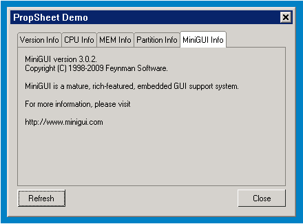

# 属性表控件类

## 1 属性表控件类简介

属性表控件类由一个个的独立的属性页组成，每个属性页有一个凸舌，我们可以单击凸舌，在不同的属性页之间切换，这里的属性页就是可以容纳其他控件的页控件（Page 控件）。我们通常使用类似建立对话框的方法，即定义对话框模板的方法向属性表中添加属性页。

属性表控件类最常见的用途就是将不同类别的交互内容分门别类的放在同一对话框中，通过类别切换显示不同内容。这一方面节省了对话框空间，另一方面也使得交互界面更加容易使用。

窗口及其派生类的类继承关系如下：

- [mWidget](MiniGUIProgGuidePart2Chapter04-zh#3-mwidget)
   - [mPropSheet](#2-mpropsheet)
  
## 2 `mPropSheet`

- 控件名称: `NCSCTRL_PROPSHEET`
- 英文名: `PropSheet`
- 简要介绍: 由多个独立的属性页组成，每个属性页有一个凸舌，通过凸舌进行属性页间的切换。
- 示意图: 


### 2.1 `mPropSheet` 风格

继承自 [mWidget](MiniGUIProgGuidePart2Chapter04-zh#3-mwidget) 的风格

| 风格名 | mStudio 属性名 | 说明 |
|:------|:--------------|:-----|
| `NCSS_PRPSHT_SIMPLE` | `style->Simple` | 控制属性页凸舌宽度的风格：所有的属性页凸舌具有相同的宽度。|
| `NCSS_PRPSHT_COMPACTTAB` | `style->Compact` | 控制属性页凸舌宽度的风格：属性页凸舌的宽度取决于属性页标题文本的长度。|
| `NCSS_PRPSHT_SCROLLABLE` | `style->Scrollable` | 控制属性页凸舌宽度的风格：属性页凸舌的宽度取决于属性页标题文本的长度，当属性页凸舌的数目过多时，将自动出现左右箭头用来调节当前可见的属性页凸舌。|
| `NCSS_PRPSHT_TOP` | `TabPos->Top` | 控制属性页凸舌在属性表中显示方向的风格：属性页凸舌显示在属性表的上方。|
| `NCSS_PRPSHT_BOTTOM` | `TabPos->Bottom` | 控制属性页凸舌在属性表中显示方向的风格：属性页凸舌显示在属性表的下方。|
 
### 2.2 `mPropSheet` 属性

继承自 [mWidget](MiniGUIProgGuidePart2Chapter04-zh#3-mwidget) 的属性

| 属性 ID | mStudio 名 | 类型 | 权限 | 说明 |
|:-------|:-----------|:----|:-----|:----|
| `NCSP_PRPSHT_MINTABWIDTH` | `TabMinWidth` | int | `RW` | 凸舌最小宽度 |
| `NCSP_PRPSHT_TABMARGIN` | `TabMargin` | int | `RW` | 凸舌边界值，通常情况下，该值加上文字所占宽度为凸舌宽度 |
| `NCSP_PRPSHT_ACTIVEPAGE` |  - | `mPage*` | `RW` | 当前活动页指针 |
| `NCSP_PRPSHT_ACTIVEPAGEIDX` | `ActivePageIndex` | int | `RW` | 当前活动页索引 |
| `NCSP_PRPSHT_FIRSTVIEWPAGE` |  - | `mPage*` | `RO` | 当前第一个可见页指针 |
| `NCSP_PRPSHT_FIRSTVIEWPAGEIDX` |  - | int | `RO` | 当前第一个可见页索引 |
| `NCSP_PRPSHT_PAGECOUNT` |  - | int | `RO` | 当前属性页数 |

### 2.3 `mPropSheet` 事件

继承自 [mWidget](MiniGUIProgGuidePart2Chapter04-zh#3-mwidget) 的事件

| 事件 ID | 参数 | 说明 |
|:-------|:-----|:-----|
| `NCSN_PRPSHT_ACTIVECHANGED` | -- | 活动属性页已改变 |

### 2.4 `mPropSheet` 方法

继承自 [mWidget](MiniGUIProgGuidePart2Chapter04-zh#3-mwidget) 的方法

#### 2.4.1 添加属性页 

在创建了属性表控件后，可以通过 `addPage` 方法向属性表中添加属性页。该方法的 `dlgTemplate` 用来传递对话框模板，`handlers` 用来传递属性页的事件回调处理函数。函数原型如下：

```c
mPage* addPage(mPropSheet *self, \
                              PDLGTEMPLATE dlgTemplate,  \
                              const NCS_EVENT_HANDLER* handlers);
```

如示例程序利用下面代码向属性表控件中添加了多个属性页：

```c
PageSysInfo.controls = CtrlSysInfo;
PageSysInfo.caption = "Version Info";
PageSysInfo.dwAddData = PAGE_VERSION;
_c(propsheet)->addPage(propsheet, &PageSysInfo, mypage_handlers);

PageSysInfo.caption = "CPU Info";
PageSysInfo.dwAddData = PAGE_CPU;
_c(propsheet)->addPage(propsheet, &PageSysInfo, mypage_handlers);

PageSysInfo.caption = "MEM Info";
PageSysInfo.dwAddData = PAGE_MEMINFO;
_c(propsheet)->addPage(propsheet, &PageSysInfo, mypage_handlers);

PageSysInfo.caption = "Partition Info";
PageSysInfo.dwAddData = PAGE_PARTITION;
_c(propsheet)->addPage(propsheet, &PageSysInfo, mypage_handlers);

PageSysInfo.caption = "MiniGUI Info";
PageSysInfo.dwAddData = PAGE_MINIGUI;
_c(propsheet)->addPage(propsheet, &PageSysInfo, mypage_handlers);
```

其中各属性页的事件处理为：

```c
static void mypage_onInitPage(mWidget* self, DWORD add_data)
{
        get_systeminfo ((mPage*)self);
}

static int mypage_onShowPage(mWidget* self, HWND hwnd, int show_cmd)
{
        return 1;
}

static int mypage_onSheetCmd(mWidget* self, DWORD wParam, DWORD lParam)
{
        if (wParam == IDC_REFRESH) {
                get_systeminfo ((mPage*)self);
        }
        
        return 0;
}

static NCS_EVENT_HANDLER mypage_handlers[] = {
        {MSG_INITPAGE, mypage_onInitPage},
        {MSG_SHOWPAGE, mypage_onShowPage},
        {MSG_SHEETCMD, mypage_onSheetCmd},
        {0 , NULL }
};
```

#### 2.4.2 删除属性页 

要删除某个属性页，只需调用属性表控件的 `removePage` 或 `removePageByIndex` 方法，需要注意的是在删除了一个属性页后会有可能改变其他属性页的索引值。其中  `removePage` 是通过属性页的类指针来删除指定页，`removePageByIndex` 通过属性页索引删除指定页。

函数原型如下：

```c
BOOL removePageByIndex(mPropSheet *self, int pageIndex);
BOOL removePage(mPropSheet *self, mPage* page);
```

如要删除属性表中的第一个属性页可执行如下操作：

```c
_c(propsheet)->removePageByIndex(propsheet, 0);
```

#### 2.4.3 索引属性页

要获取指定索引的索引页类指针，需调用属性表控件的 `getPageByIndex` 方法；而要获取某个指定属性页的索引则只需调用属性表控件的 `getPageIndex` 方法。函数原型如下：

```c
int getPageIndex(mPropSheet *self, mPage* page);
mPage* getPageByIndex(mPropSheet *self, int pageIndex);
```

如获取指定属性页的索引：

```c
mPage *page;
... ...
_c(propsheet)->getPageIndex(propsheet, page);
```

或者是获取第一个属性页的类指针，再通过 [mPage](MiniGUIProgGuidePart2Chapter08-zh#4-page) 控件的方法来操作属性页：

```c
mPage *page = _c(propsheet)->getPageByIndex(propsheet, 0);
HWND hPanel = _c(page)->getPanel(page);
... ...
```

#### 2.4.4 遍历属性页

在属性表控件中可以通过 `getNextPage` 和 `getPrevPage` 方法实现对所有属性页的遍历查找功能。其中 `getNextPage` 用于从指定属性页向后遍历属性页；`getPrevPage` 用于从指定属性页向前遍历属性页。

```c
mPage* getNextPage(mPropSheet *self, mPage* page);
mPage* getPrevPage(mPropSheet *self, mPage* page);
``` 

如：

```c
mPage *page = _c(propsheet)->getNextPage(propsheet, NULL);

while (page) {
        ... ...
        page = _c(propsheet)->getNextPage(propsheet, page);
}
``` 

#### 2.4.5 广播消息

属性表控件可以通过 `broadCastMsg` 方法向所有的属性页广播消息。消息内容通过 `param1` 和 `param2` 来传送。当属性表控件接收到任意一个属性页对广播消息处理后返回的非零值后，属性表的返回值将为中断消息广播的属性页索引值加 1。通过此方法，可以实现无效输入处理等功能操作。

```c
int broadCastMsg(mPropSheet *self, DWORD param1, DWORD param2);
```

### 2.5 `mPropSheet` 渲染器

继承自 [mWidget](MiniGUIProgGuidePart2Chapter04-zh#3-mwidget) 渲染器

### 2.6 `mPropSheet` 实例

本实例为用户演示了如何使用 propsheet 显示本机的一些系统信息，比如 CPU 类型、内存大小等等。



__图 1__  propsheet 程序的输出

__清单 1__  propsheet.c

```c
/*
** $Id: propsheet.c 589 2009-10-09 06:19:44Z xwyan $
**
** Listing P2C11.1
**
** propsheet.c: Sample program for mGNCS Programming Guide
**      The demo application for PropSheet.
**
** Copyright (C) 2009 Feynman Software.
*/
#include <stdio.h>
#include <stdlib.h>
#include <string.h>

// START_OF_INCS
#include <minigui/common.h>
#include <minigui/minigui.h>
#include <minigui/gdi.h>
#include <minigui/window.h>
#include <minigui/control.h>

#include <mgncs/mgncs.h>
// END_OF_INCS

#define PAGE_VERSION	1
#define PAGE_CPU        2
#define PAGE_MEMINFO	3
#define PAGE_PARTITION  4
#define PAGE_MINIGUI    5

#define BUF_LEN         10240
#define IDC_PROPSHEET	100
#define IDC_SYSINFO     101
#define IDC_REFRESH     102

static size_t read_sysinfo (const char* file, char* buff, size_t buf_len)
{
        size_t size;
        FILE   *fp = fopen (file, "r");
        
        if (fp == NULL) return 0;
        
        size = fread (buff, 1, buf_len, fp);
        
        fclose (fp);
        return size;
}

static void get_systeminfo (mPage* page)
{
        int     type;
        HWND    hwnd;
        char    buff [BUF_LEN + 1];
        size_t  size = 0;
        
        type = (int)GetWindowAdditionalData (page->hwnd);
        hwnd = GetDlgItem(_c(page)->getPanel(page), IDC_SYSINFO);
        buff [BUF_LEN] = 0;
        
        switch (type) {
                case PAGE_VERSION:
                size = read_sysinfo ("/proc/version", buff, BUF_LEN);
                buff [size] = 0;
                break;
                
                case PAGE_CPU:
                size = read_sysinfo ("/proc/cpuinfo", buff, BUF_LEN);
                buff [size] = 0;
                break;
                
                case PAGE_MEMINFO:
                size = read_sysinfo ("/proc/meminfo", buff, BUF_LEN);
                buff [size] = 0;
                break;
                
                case PAGE_PARTITION:
                size = read_sysinfo ("/proc/partitions", buff, BUF_LEN);
                buff [size] = 0;
                break;
                
                case PAGE_MINIGUI:
                size = snprintf (buff, BUF_LEN,
                "MiniGUI version %d.%d.%d.\n"
                "Copyright (C) 1998-2009 Feynman Software.\n\n"
                "MiniGUI is a mature, rich-featured, embedded "
                "GUI support system.\n\n"
                "For more information, please visit\n\n"
                "http://www.minigui.com\n",
                MINIGUI_MAJOR_VERSION, MINIGUI_MINOR_VERSION, MINIGUI_MICRO_VERSION);
                break;
        }
        
        if (size) {
                SetWindowText (hwnd, buff);
        }
        GetWindowText(hwnd, buff, BUF_LEN+1);
}

// START_OF_PAGEHANDLERS
static void mypage_onInitPage(mWidget* self, DWORD add_data)
{
        get_systeminfo ((mPage*)self);
}

static int mypage_onShowPage(mWidget* self, HWND hwnd, int show_cmd)
{
        return 1;
}

static int mypage_onSheetCmd(mWidget* self, DWORD wParam, DWORD lParam)
{
        if (wParam == IDC_REFRESH) {
                get_systeminfo ((mPage*)self);
        }
        
        return 0;
}

static NCS_EVENT_HANDLER mypage_handlers[] = {
        {MSG_INITPAGE, mypage_onInitPage},
        {MSG_SHOWPAGE, mypage_onShowPage},
        {MSG_SHEETCMD, mypage_onSheetCmd},
        {0 , NULL }
};
// END_OF_PAGEHANDLERS

static void btn_notify(mWidget *self, int id, int nc, DWORD add_data)
{
        mPropSheet *obj = 
        (mPropSheet *)ncsGetChildObj(GetParent(self->hwnd), IDC_PROPSHEET);
        
        if (obj) {
                _c(obj)->broadCastMsg(obj, IDC_REFRESH, 0);
        }
}

static NCS_EVENT_HANDLER btn_handlers [] = {
        NCS_MAP_NOTIFY(NCSN_BUTTON_PUSHED, btn_notify),
        {0, NULL}	
};

static NCS_RDR_INFO btn_rdr_info[] =
{
        {"classic","classic", NULL}
};

static NCS_WND_TEMPLATE _ctrl_tmpl[] = {
        {
                NCSCTRL_BUTTON, 
                IDC_REFRESH, 
                10, 240, 70, 25,
                WS_VISIBLE | WS_TABSTOP,
                WS_EX_NONE,
                "Refresh",
                NULL, 
                btn_rdr_info,
                btn_handlers,
                NULL,
                0,
                0 
        },
        {
                NCSCTRL_BUTTON, 
                IDCANCEL,
                330, 240, 70, 25,
                WS_VISIBLE | WS_TABSTOP,
                WS_EX_NONE,
                "Close",
                NULL, 
                NULL, 
                NULL,
                NULL,
                0,
                0 
        },
};

static DLGTEMPLATE PageSysInfo =
{
        WS_BORDER | WS_CAPTION,
        WS_EX_NONE,
        0, 0, 0, 0,
        "",
        0, 0,
        1, NULL,
        0
};

static CTRLDATA CtrlSysInfo [] =
{ 
        {
                CTRL_STATIC,
                WS_VISIBLE | SS_LEFT, 
                10, 10, 370, 180,
                IDC_SYSINFO,
                "test",
                0
        }
};

static NCS_RDR_INFO prop_rdr_info[] =
{
        {"classic", "classic", NULL},
};

static int init_propsheet (mDialogBox* self)
{
        // START_OF_CREATEPRPSHT
        mPropSheet *propsheet =  
        (mPropSheet*) ncsCreateWindow (NCSCTRL_PROPSHEET,
        "", WS_VISIBLE | NCSS_PRPSHT_SCROLLABLE, WS_EX_NONE, 
        IDC_PROPSHEET, 
        10, 10, 390, 225, self->hwnd, 
        NULL, prop_rdr_info, NULL, 0);
        // END_OF_CREATEPRPSHT
        
        if (!propsheet) {
                fprintf (stderr, "Error> Create propsheet failure.\n");
                return 1;
        }
        
        // START_OF_ADDPAGES
        PageSysInfo.controls = CtrlSysInfo;
        PageSysInfo.caption = "Version Info";
        PageSysInfo.dwAddData = PAGE_VERSION;
        _c(propsheet)->addPage(propsheet, &PageSysInfo, mypage_handlers);
        
        PageSysInfo.caption = "CPU Info";
        PageSysInfo.dwAddData = PAGE_CPU;
        _c(propsheet)->addPage(propsheet, &PageSysInfo, mypage_handlers);
        
        PageSysInfo.caption = "MEM Info";
        PageSysInfo.dwAddData = PAGE_MEMINFO;
        _c(propsheet)->addPage(propsheet, &PageSysInfo, mypage_handlers);
        
        PageSysInfo.caption = "Partition Info";
        PageSysInfo.dwAddData = PAGE_PARTITION;
        _c(propsheet)->addPage(propsheet, &PageSysInfo, mypage_handlers);
        
        PageSysInfo.caption = "MiniGUI Info";
        PageSysInfo.dwAddData = PAGE_MINIGUI;
        _c(propsheet)->addPage(propsheet, &PageSysInfo, mypage_handlers);
        // END_OF_ADDPAGES
        
        return 0;
}

static NCS_MNWND_TEMPLATE mymain_tmpl = {
        NCSCTRL_DIALOGBOX, 
        1,
        0, 0, 420, 305,
        WS_CAPTION | WS_BORDER | WS_VISIBLE,
        WS_EX_NONE,
        "PropSheet Demo",
        NULL,
        NULL,
        NULL,
        _ctrl_tmpl,
        sizeof(_ctrl_tmpl)/sizeof(NCS_WND_TEMPLATE),
        0,
        0, 0,
};

int MiniGUIMain(int argc, const char* argv[])
{
        ncsInitialize();
        mDialogBox* mydlg = (mDialogBox *)ncsCreateMainWindowIndirect 
        (&mymain_tmpl, HWND_DESKTOP);
        
        init_propsheet(mydlg);
        _c(mydlg)->doModal(mydlg, TRUE);
        
        MainWindowThreadCleanup(mydlg->hwnd);
        ncsUninitialize();
        return 0;
}
```
