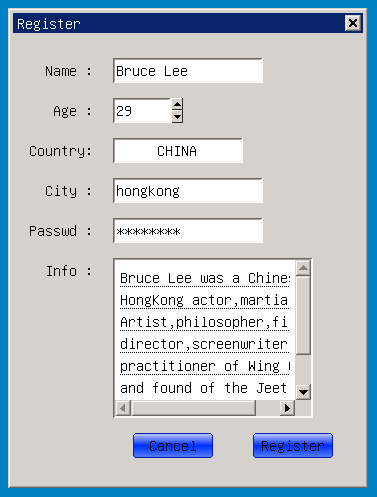
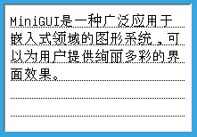

# 编辑框系列控件

## 1 编辑框控件简介
编辑框控件（Edit）是GUI系统中不可或缺的的重要控件之一，主要用于接受用户的字符输入，实现用户交互和文本编辑的功能。实现上分为单行编辑框（Single Line Edit）和多行编辑框（Multiline Edit），单行编辑框用来接受用户内容相对简单的单行文本输入，与之相对，多行文本用来接受复杂的、大量的文本的输入。

- 编辑框类层次关系
   - [mWidget](MiniGUIProgGuidePart2Chapter04-zh#3-mwidget)
      - [mScrollWidget](MiniGUIProgGuidePart2Chapter08-zh#2-mscrollwidget)
         - [mItemView](MiniGUIProgGuidePart2Chapter15#5-mItemView)
            - [mScrollView](MiniGUIProgGuidePart2Chapter15#6-mscrollview)
               - [mEdit](#2-medit)
                  - [mSlEdit](#3-msledit)
                  - [mMlEdit](#4-mmledit)
-  示例图:



## 2 `mEdit`

- 控件窗口类: `NCSCTRL_EDIT`
- 控件英文名: `Edit`
- 简介: 编辑框系列控件的基础类，是单行编辑框和多行编辑框的抽象父类，定义了两者共同的使用接口。
- 示意图: 

<font color='red'>抽象类,不能直接使用</font>

### 2.1 `mEdit` 风格

继承自 [mScrollView](MiniGUIProgGuidePart2Chapter15#6-mscrollview) 的风格

| 风格名 | mstudio 属性名 | 说明 |
|:------|:--------------|:-----|
| `NCSS_EDIT_LEFT` | `Align->Left` | 左对齐 |                  
| `NCSS_EDIT_CENTER` | `Align->Center` | 水平居中 |      
| `NCSS_EDIT_RIGHT` | `Align->Right` | 右对齐 | 
| `NCSS_EDIT_UPPERCASE` | `Case->Upper` | 输入内容自动转成大写 |    
| `NCSS_EDIT_LOWERCASE` | `Case->Lower` | 输入内容自动转成小写 |    
| `NCSS_EDIT_NOHIDESEL` | `HideSel->FALSE` | 当编辑框失去焦点的时候，选中的内容依然保持选中状态 |    
| `NCSS_EDIT_READONLY` | `ReadOnly->TRUE` | 内容只读 |    
| `NCSS_EDIT_BASELINE` | `BaseLine->TRUE` | 内容带下划线显示 |    

### 2.2 `mEdit` 属性

继承自  [mScrollView](MiniGUIProgGuidePart2Chapter15#6-mscrollview) 的属性

| 属性 | mstudio 属性名 | 类型 | 权限 | 说明 |
|:----|:--------------|:-----|:----|:-----|
| `NCSP_EDIT_LIMITTEXT` | `MaxLength` | int | `RW` | 字符数目限定值 |
| `NCSP_EDIT_CARETPOS` | -- | int | `RW` | 光标位置 |

### 2.3 `mEdit` 事件

继承自 [mScrollView](MiniGUIProgGuidePart2Chapter15#6-mscrollview) 的事件

| 事件 ID | 参数 | 说明 |
|:-------|:-----|:----|
| `NCSN_EDIT_CHANGE` | -- | 内容变化 |
| `NCSN_EDIT_CONTCHANGED` | -- | 当 edit 失去焦点时，内容发生变化了 |
| `NCSN_EDIT_UPDATE` | -- | 内容被刷新，当通过 `setText`, `resetContent`, 方法改变时，或改变属性时 |
| `NCSN_EDIT_SELCHANGED` | -- | 选中部分改变 |
| `NCSN_EDIT_MAXTEXT` | -- | 字符数量饱和 |
| `NCSN_EDIT_SETFOCUS` | -- | 获得焦点 |
| `NCSN_EDIT_KILLFOCUS` | -- | 失去焦点 |

### 2.4 `mEdit` 方法

继承自  [mScrollView](MiniGUIProgGuidePart2Chapter15#6-mscrollview) 的方法

#### 2.4.1 `setContent`

```c
void setContent(mEdit *self, const char* str, int start, int len)
```

- 参数：
   - str -- 显示在 edit 中的文字内容
   - start -- 显示开始位置(相对 str 的起始位置)，0 表示从头开始
   - len -- 显示字符数目，-1 表示一直到 str 的结束为止
- 说明：<BR>
   设置编辑框的显示内容，该方法会从str字符串中获取从第 start 个字符位置开始的一共 len 个字符，替换掉 edit 中现有的内容。
-  示例：

```c
//edit中会显示字符串"dddd Show Me"从第6个字符开始一直到结尾的字符串，这里就是“Show Me”
_c(edit)->setContent(edit, "dddd Show Me", 6, -1);
```

#### 2.4.2 `replaceText`

```c
void replaceText(mEdit *self, const char* str, 
    int start, int len, int replace_start, int replace_end)
```

- 参数：
   - str -- 用于替换的源字符串
   - start -- 用于替换的源文本相对于 str 的的偏移，0表示从头开始
   - len -- 用到的源文本的长度，-1 表示从 start 开始，直到 str 结束
   - `replace_start` -- 替换开始的位置（相对于 edit 中的现有内容）
   - `replace_end` -- 替换结束的位置（相对于 edit 中的现有内容）
-  说明：<BR>
   字符串的替换，该方法会从 str 字符串中获取从第 start 个字符位置开始的一共 len 个字符，替换掉 edit 中现有的从 `replace_start` 到 `repalce_end` 的内容。str 是要替换成的字符串，start 是相对 str 的起始位置，0 表示从头开始，len 是长度，-1 表示一直到 str 的结束为止，`replace_start`、`replace_end` 分别是要替换的位置的起点和终点，是相对于 edit 中现有的文本内容的位置偏移。
-  示例：

```c
//edit中会用字符串"dddd Show Me"从第6个字符开始一直到结尾的字符串（这里就是“Show Me”），
//来替换掉edit中现有文本的从第二个到第十个的字符
_c(edit)->replaceText(edit, "dddd Show Me", 6, -1, 2, 10);
```

#### 2.4.3 insert

```c
void insert(mEdit *self, const char* str, int start, int len, int at)
```

- 参数：
   - str -- 要插入的源字符串
   - start -- 使用到的源文本的起始位置，0 表示从头开始
   - len -- 使用到的源文本的长度，-1 表示从 start 开始，直到 str 结束
   - at -- 插入点的位置（相对于 edit 中的现有内容）,-1 表示结尾处
-  说明：<BR>
   字符串的插入，该方法会从 str 字符串中获取从第 start 个字符位置开始的一共 len 个字符，插入到edit中现有的内容的第 at 个字符的位置。str 是要插入的字符串，start 是相对 str 的起始位置，0 表示从头开始，len 是长度，-1 表示一直到 str 的结束为止, at 参数是要插入的位置，是相对于 edit 中现有的文本内容的位置偏移。
-  示例：

```c
//edit中会用字符串"dddd Show Me"从第6个字符开始一直到结尾的字符串（这里就是“Show Me”），
//来插入到edit中现有文本的从第二个字符之后
_c(edit)->insert(edit, "dddd Show Me", 6, -1,  2);
```

#### 2.4.4 append

```c
void append(mEdit *self, const char* str, int start, int len)
```

- 参数：
   - str -- 要追加的源字符串
   - start -- 使用到的源文本的起始位置，0 表示从头开始
   - len -- 使用到的源文本的长度，-1 表示从 start 开始，直到 str 结束
-  说明：<BR>
   字符串的追加，该方法会从 str 字符串中获取从第 start 个字符位置开始的一共 len 个字符，追加到 edit 中现有的内容的后面。str 是要追加的字符串，start 是相对 str 的起始位置，0 表示从头开始，len 是长度，-1 表示一直到 str 的结束为止。
-  示例：

```c
//edit中会用字符串"dddd Show Me"从第6个字符开始一直到结尾的字符串（这里就是“Show Me”），
//来追加到edit中现有文本的末尾
_c(edit)->append(edit, "dddd Show Me", 6, -1);
```

#### 2.4.5 `getTextLength`

```c
int getTextLength(mEdit *self)                                      
```

-  说明：<BR>
   获取 Edit 中字符串内容的长度
-  示例：

```c
int text_len = _c(edit)->getTextLength(edit);
```

#### 2.4.6 `getContent`

```c
int getContent(mEdit *self, char *strbuff, int buf_len, int start, int end)
```

- 参数：
   - strbuff -- 获取到字符串的存放位置（应该提前分配好存放空间）
   - `buff_len` -- strbuff 的大小
   - start -- 获取内容的起始位置
   - end -- 获取内容的终止位置
-  说明：<BR>
   获取 Edit 中字符串内容，从现有的内容中获取从 start 到 end 位置的内容写入到 strbuff 中，写入的最大数目限定为 `buff_len`。
-  示例：

```c
char buff[128];
_c(edit)->getContent(edit, buff, 127, 0, -1);//取出edit中的全部内容，buff最多存127个字符
```

#### 2.4.7 `setSel`、`getSel`

```c
int setSel(mEdit *self, int start, int end)
int getSel(mEdit *self, int *pstart, int *pend)
```

- 参数：
   - start\end -- 选中区域的起点、终点
   - pstart\pend -- 选中区域的起点、终点，用于函数返回
- 说明：<BR>
  设置、获取选中文本的区域，后两个参数分别对应选中区域的起点和终点。
- 示例：

```c
_c(edit)->setSel(edit, 2, 10);//设置edit的第2~10个字符为选中状态

int ps,pe;
_c(edit)->getSel(edit, &ps, &pe);//获取选中区域
```

#### 2.4.8 `setMargin`

```c
void setMargin(mEdit *self, int left, int top, int right, int bottom)
```

- 参数：
   - left, top, right, bottom -- 上下左右的留白，这个参数不是矩形的概念，只是沿用了矩形的数据结构方便参数传递
- 说明：<BR>
  设置编辑区的上下左右留白
- 示例：

```c
//设置留白
_c(edit)- >setMargin(edit, 10,10,10,10);
```

#### 2.4.9 copy、paste、cut

```c
void copy(mEdit *self)
void cut(mEdit *self)
void paste(mEdit *self)
TextCopyPaste * setCopyPaste(mEdit *self, TextCopyPaste* cp)
```

剪切、复制、粘贴都是针对选中区域的操作，edit 中默认实现了一组使用 minigui 剪切板的操作集,用户还可以通过 `setCopyPaste` 设置自己实现的操作集。

#### 2.4.10 makevisible

```c
BOOL makevisible(mEdit *self, int pos)
```

- 参数：
   - pos -- 需要可见的位置
- 说明：<BR>
  控制编辑区的滚动，使<pos>位置的字符变为可见。
- 示例：

```c
//是第201个字符处可见
_c(edit)- >makevisible(edit, 201);
```

## 3 `mSlEdit`

- 控件窗口类: `NCSCTRL_SLEDIT`
- 控件英文名: Single Line Edit 或者 SlEdit
- 简介: 单行文本编辑框
- 示意图: 


### 3.1 `mSlEdit` 风格

继承自 [mEdit 的风格](#21-medit-风格)

| 风格名 | mstudio 属性名 | 说明 |
|:------|:--------------|:-----|
| `NCSS_SLEDIT_PASSWORD` | `Password->TRUE` | 编辑框的内容以密码输入的方式屏蔽显示 |
| `NCSS_SLEDIT_AUTOSELECT` | `AutoSelect->TRUE` | 自动选中风格，获得焦点后文本自动成选中状态 |

### 3.2 `mSlEdit` 属性

继承自 [mEdit 的属性](#22-medit-属性)

| 属性 | mstudio 属性名 | 类型 | 权限 | 说明 |
|:----|:--------------|:-----|:----|:-----|
| `NCSP_SLEDIT_TIPTEXT` | `ToolTip` | `char *` | `RW` | 提示信息字符串，当没有输入时，用来提示用户的信息  |
| `NCSP_SLEDIT_PWDCHAR` | `PasswordChar` | char | `RW` | pass word 显示的字符，只有 `NCSS_SLEDIT_PASSWORD` 风格的有效，默认是‘*’ |

### 3.3 `mSlEdit` 事件

继承自 [mEdit 的事件](#23-medit-事件)

| 事件 ID | 参数 | 说明 |
|:-------|:-----|:----|
| `NCSN_SLEDIT_ENTER` | -- | 捕获到 enter 键消息 | 

### 3.4 `mSlEdit` 方法

继承自 [mEdit 的方法](#24-medit-方法)

<font color='red'>没有新引入的方法</font>

### 3.5 `mSlEdit` 编程示例

- `SlEdit` 示例代码 ：[edit.c](samples/edit.c)

```c
/*
** edit.c: Sample program for mGNCS Programming Guide
**      Using edit.
**
** Copyright (C) 2009 Feynman Software.
*/

#include <stdio.h>
#include <stdlib.h>
#include <string.h>

#include <minigui/common.h>
#include <minigui/minigui.h>
#include <minigui/gdi.h>
#include <minigui/window.h>
#include <minigui/control.h>

#include <mgncs/mgncs.h>

#define ID_NAME     104
#define ID_COUN     105
#define ID_CITY     106
#define ID_PSWD     107
#define ID_SPIN     108
#define ID_INFO     109

#define ID_REG      155
#define ID_CAN      156


static BOOL mymain_onCreate (mWidget* _this, DWORD add_data)
{
    return TRUE;
}

static void mymain_onClose (mWidget* _this, int message)
{
    DestroyMainWindow (_this->hwnd);
    PostQuitMessage (_this->hwnd);
}

static NCS_EVENT_HANDLER mymain_handlers[] = {
    {MSG_CREATE, mymain_onCreate},
    {MSG_CLOSE,  mymain_onClose},
    {0, NULL}
};

static void btn_onClicked(mWidget* _this, int id, int nc, HWND hCtrl)
{
    if(nc == NCSN_WIDGET_CLICKED)
    {
        if (id == ID_CAN){
            PostMessage(GetParent(_this->hwnd), MSG_CLOSE, 0, 0);
        } else if (id == ID_REG){
            //TODO
        }

    }
};

static NCS_EVENT_HANDLER btn_handlers[] = 
{
    {NCS_NOTIFY_CODE(NCSN_WIDGET_CLICKED), btn_onClicked},
    {0, NULL}
};

static NCS_RDR_INFO btn_rdr_info[] =
{
    {"fashion","fashion", NULL}
};

static NCS_PROP_ENTRY static_props[] =
{
    {NCSP_STATIC_ALIGN, NCS_ALIGN_RIGHT},
    {0, 0}
};

static NCS_PROP_ENTRY spin_props [] = 
{
	{NCSP_SPNBOX_MAXPOS, 99},
	{NCSP_SPNBOX_MINPOS, 0},
	{NCSP_SPNBOX_CURPOS, 25},
	{NCSP_SPNBOX_LINESTEP, 1},
	{0, 0}
};

#define HSTART  25
#define HSPACE  40

static NCS_WND_TEMPLATE _ctrl_templ[] = 
{
//START_OF_SLEDIT_TEMPLATE
    {
        NCSCTRL_STATIC, 
        0,
        10, HSTART, 70, 25,
        WS_VISIBLE,
        WS_EX_NONE,
        "Name :",
        static_props,
        NULL,
        NULL, NULL, 0, 0
    },
    {   //左对齐
        NCSCTRL_SLEDIT, 
        ID_NAME,
        100, HSTART, 150, 25,
        WS_BORDER | WS_VISIBLE | NCSS_EDIT_LEFT,
        WS_EX_NONE,
        "",
        NULL,
        NULL,
        NULL, NULL, 0, 0
    },
    {
        NCSCTRL_STATIC, 
        0,
        10, HSTART + HSPACE, 70, 25,
        WS_VISIBLE,
        WS_EX_NONE,
        "Age :",
        static_props,
        NULL,
        NULL, NULL, 0, 0
    },
    {
        NCSCTRL_SPINBOX, 
        ID_SPIN,
        100, HSTART + HSPACE, 70, 25,
        WS_VISIBLE | NCSS_SPNBOX_NUMBER | NCSS_SPNBOX_AUTOLOOP,
        WS_EX_NONE,
        "",
        spin_props,
        NULL,
        NULL, NULL, 0, 0
    },
    {
        NCSCTRL_STATIC, 
        0,
        10, HSTART + 2 * HSPACE, 70, 25,
        WS_VISIBLE,
        WS_EX_NONE,
        "Country:",
        static_props,
        NULL,
        NULL, NULL, 0, 0
    },
    {   //居中对齐， 大写字母
        NCSCTRL_SLEDIT, 
        ID_COUN,
        100, HSTART + 2 * HSPACE, 130, 25,
        WS_BORDER | WS_VISIBLE | NCSS_EDIT_CENTER | NCSS_EDIT_UPPERCASE,
        WS_EX_NONE,
        "",
        NULL,
        NULL,
        NULL, NULL, 0, 0
    },
    {
        NCSCTRL_STATIC, 
        0,
        10, HSTART + 3 * HSPACE, 70, 25,
        WS_VISIBLE,
        WS_EX_NONE,
        "City :",
        static_props,
        NULL,
        NULL, NULL, 0, 0
    },
    {   //小写字母
        NCSCTRL_SLEDIT, 
        ID_CITY,
        100, HSTART + 3 * HSPACE, 150, 25,
        WS_BORDER | WS_VISIBLE | NCSS_EDIT_LOWERCASE,
        WS_EX_NONE,
        "",
        NULL,
        NULL,
        NULL, NULL, 0, 0
    },
    {
        NCSCTRL_STATIC, 
        0,
        10, HSTART + 4 * HSPACE, 70, 25,
        WS_VISIBLE,
        WS_EX_NONE,
        "Passwd :",
        static_props,
        NULL,
        NULL, NULL, 0, 0
    },
    {   //密码输入形式的edit
        NCSCTRL_SLEDIT, 
        ID_PSWD,
        100, HSTART + 4 * HSPACE, 150, 25,
        WS_BORDER | WS_VISIBLE | NCSS_SLEDIT_PASSWORD,
        WS_EX_NONE,
        "",
        NULL,
        NULL,
        NULL, NULL, 0, 0
    },
//END_OF_SLEDIT_TEMPLATE
//START_OF_MLEDIT_TEMPLATE
    {
        NCSCTRL_STATIC, 
        0,
        10, HSTART + 5 * HSPACE, 70, 25,
        WS_VISIBLE,
        WS_EX_NONE,
        "Info :",
        static_props,
        NULL,
        NULL, NULL, 0, 0
    },
    {   //多行编辑框
        NCSCTRL_MLEDIT, 
        ID_INFO,
        100, HSTART + 5 * HSPACE, 200, 160,
        WS_BORDER | WS_VISIBLE | WS_VSCROLL | NCSS_EDIT_BASELINE, 
        WS_EX_NONE,
        "",
        NULL,
        NULL,
        NULL, NULL, 0, 0
    },
//END_OF_MLEDIT_TEMPLATE

    {
        NCSCTRL_BUTTON, 
        ID_REG,
        240, 400, 80, 25,
        WS_VISIBLE | NCSS_NOTIFY,
        WS_EX_NONE,
        "Register",
        NULL,
        btn_rdr_info,
        btn_handlers, NULL, 0, 0
    },
    {
        NCSCTRL_BUTTON, 
        ID_CAN,
        120, 400, 80, 25,
        WS_VISIBLE | NCSS_NOTIFY,
        WS_EX_NONE,
        "Cancel",
        NULL,
        btn_rdr_info,
        btn_handlers, NULL, 0, 0
    },
};

static NCS_MNWND_TEMPLATE mymain_templ =
{
    NCSCTRL_DIALOGBOX, 
    1,
    0, 0, 360, 480,
    WS_CAPTION | WS_BORDER | WS_VISIBLE,
    WS_EX_NONE,
    "Register",
    NULL,
    NULL,
    mymain_handlers,
    _ctrl_templ,
    sizeof(_ctrl_templ)/sizeof(NCS_WND_TEMPLATE),
    0,
    0, 0,
};

int MiniGUIMain (int argc, const char* argv[])
{
    ncsInitialize ();

    mDialogBox* mydlg = (mDialogBox *)ncsCreateMainWindowIndirect 
                (&mymain_templ, HWND_DESKTOP);

    _c(mydlg)->doModal (mydlg, TRUE);
 
    ncsUninitialize ();

    return 0;
}
```

- 我们这样来定义 `SlEdit` 的使用模板

```c
{
        NCSCTRL_STATIC, 
        0,
        10, HSTART, 70, 25,
        WS_VISIBLE,
        WS_EX_NONE,
        "Name :",
        static_props,
        NULL,
        NULL, NULL, 0, 0
},
{   //左对齐
        NCSCTRL_SLEDIT, 
        ID_NAME,
        100, HSTART, 150, 25,
        WS_BORDER | WS_VISIBLE | NCSS_EDIT_LEFT,
        WS_EX_NONE,
        "",
        NULL,
        NULL,
        NULL, NULL, 0, 0
},
{
        NCSCTRL_STATIC, 
        0,
        10, HSTART + HSPACE, 70, 25,
        WS_VISIBLE,
        WS_EX_NONE,
        "Age :",
        static_props,
        NULL,
        NULL, NULL, 0, 0
},
{
        NCSCTRL_SPINBOX, 
        ID_SPIN,
        100, HSTART + HSPACE, 70, 25,
        WS_VISIBLE | NCSS_SPNBOX_NUMBER | NCSS_SPNBOX_AUTOLOOP,
        WS_EX_NONE,
        "",
        spin_props,
        NULL,
        NULL, NULL, 0, 0
},
{
        NCSCTRL_STATIC, 
        0,
        10, HSTART + 2 * HSPACE, 70, 25,
        WS_VISIBLE,
        WS_EX_NONE,
        "Country:",
        static_props,
        NULL,
        NULL, NULL, 0, 0
},
{   //居中对齐， 大写字母
        NCSCTRL_SLEDIT, 
        ID_COUN,
        100, HSTART + 2 * HSPACE, 130, 25,
        WS_BORDER | WS_VISIBLE | NCSS_EDIT_CENTER | NCSS_EDIT_UPPERCASE,
        WS_EX_NONE,
        "",
        NULL,
        NULL,
        NULL, NULL, 0, 0
},
{
        NCSCTRL_STATIC, 
        0,
        10, HSTART + 3 * HSPACE, 70, 25,
        WS_VISIBLE,
        WS_EX_NONE,
        "City :",
        static_props,
        NULL,
        NULL, NULL, 0, 0
},
{   //小写字母
        NCSCTRL_SLEDIT, 
        ID_CITY,
        100, HSTART + 3 * HSPACE, 150, 25,
        WS_BORDER | WS_VISIBLE | NCSS_EDIT_LOWERCASE,
        WS_EX_NONE,
        "",
        NULL,
        NULL,
        NULL, NULL, 0, 0
},
{
        NCSCTRL_STATIC, 
        0,
        10, HSTART + 4 * HSPACE, 70, 25,
        WS_VISIBLE,
        WS_EX_NONE,
        "Passwd :",
        static_props,
        NULL,
        NULL, NULL, 0, 0
},
{   //密码输入形式的edit
        NCSCTRL_SLEDIT, 
        ID_PSWD,
        100, HSTART + 4 * HSPACE, 150, 25,
        WS_BORDER | WS_VISIBLE | NCSS_SLEDIT_PASSWORD,
        WS_EX_NONE,
        "",
        NULL,
        NULL,
        NULL, NULL, 0, 0
},
```

## 4` mMlEdit`

- 控件窗口类: `NCSCTRL_MLEDIT`
- 控件英文名: Multiline Edit 或者 MlEdit
- 简介: 多行文本编辑框
- 示意图: 



### 4.1 `mMlEdit` 风格

继承自 [mEdit 的风格](#21-medit-风格)

| 风格名 | mstudio 属性名 | 说明 |
|:------|:--------------|:-----|
| `NCSS_MLEDIT_AUTOWRAP` | `AutoWrap->TRUE` | 自动换行 |

### 4.2 `mMlEdit` 属性

继承自 [mEdit 的属性](#22-medit-属性)

| 属性 | mstudio 属性名 | 类型 | 权限 | 说明 |
|:----|:--------------|:-----|:----|:-----|
| `NCSP_MLEDIT_LINECOUNT` | -- | int | `RO` | 行数 |
| `NCSP_MLEDIT_LINEHEIGHT` | `LineHeight` | int | `RW` | 行高 |
| `NCSP_MLEDIT_LINEFEEDISPCHAR` | -- | char |` WO` | 换行符改用该字符显示出来 |
| `NCSP_MLEDIT_LINESEP` | `LineSeperator` | char | `RW`| 换行符标记，默认是‘\n’ |
| `NCSP_MLEDIT_CARETSHAPE` | `CaretShap` | int | `RW` | 光标形状`ED_CARETSHAPE_LINE` 或者 `ED_CARETSHAPE_BLOCK` |
| `NCSP_MLEDIT_NUMOFPARAGRAPHS` | -- | int | `RO` | 段落的数目 |

### 4.3 `mMlEdit` 事件

继承自 [mEdit 的事件](#23-medit-事件)

<font color='red'>没有新引入的事件</font>

### 4.4 `mMlEdit` 方法

继承自 [mEdit 的方法](#24-medit-方法)

### 4.5 `mMlEdit` 编程示例

- `MlEdit` 示例代码 ：[edit.c](samples/edit.c)

```c
/*
** edit.c: Sample program for mGNCS Programming Guide
**      Using edit.
**
** Copyright (C) 2009 Feynman Software.
*/

#include <stdio.h>
#include <stdlib.h>
#include <string.h>

#include <minigui/common.h>
#include <minigui/minigui.h>
#include <minigui/gdi.h>
#include <minigui/window.h>
#include <minigui/control.h>

#include <mgncs/mgncs.h>

#define ID_NAME     104
#define ID_COUN     105
#define ID_CITY     106
#define ID_PSWD     107
#define ID_SPIN     108
#define ID_INFO     109

#define ID_REG      155
#define ID_CAN      156


static BOOL mymain_onCreate (mWidget* _this, DWORD add_data)
{
    return TRUE;
}

static void mymain_onClose (mWidget* _this, int message)
{
    DestroyMainWindow (_this->hwnd);
    PostQuitMessage (_this->hwnd);
}

static NCS_EVENT_HANDLER mymain_handlers[] = {
    {MSG_CREATE, mymain_onCreate},
    {MSG_CLOSE,  mymain_onClose},
    {0, NULL}
};

static void btn_onClicked(mWidget* _this, int id, int nc, HWND hCtrl)
{
    if(nc == NCSN_WIDGET_CLICKED)
    {
        if (id == ID_CAN){
            PostMessage(GetParent(_this->hwnd), MSG_CLOSE, 0, 0);
        } else if (id == ID_REG){
            //TODO
        }

    }
};

static NCS_EVENT_HANDLER btn_handlers[] = 
{
    {NCS_NOTIFY_CODE(NCSN_WIDGET_CLICKED), btn_onClicked},
    {0, NULL}
};

static NCS_RDR_INFO btn_rdr_info[] =
{
    {"fashion","fashion", NULL}
};

static NCS_PROP_ENTRY static_props[] =
{
    {NCSP_STATIC_ALIGN, NCS_ALIGN_RIGHT},
    {0, 0}
};

static NCS_PROP_ENTRY spin_props [] = 
{
	{NCSP_SPNBOX_MAXPOS, 99},
	{NCSP_SPNBOX_MINPOS, 0},
	{NCSP_SPNBOX_CURPOS, 25},
	{NCSP_SPNBOX_LINESTEP, 1},
	{0, 0}
};

#define HSTART  25
#define HSPACE  40

static NCS_WND_TEMPLATE _ctrl_templ[] = 
{
//START_OF_SLEDIT_TEMPLATE
    {
        NCSCTRL_STATIC, 
        0,
        10, HSTART, 70, 25,
        WS_VISIBLE,
        WS_EX_NONE,
        "Name :",
        static_props,
        NULL,
        NULL, NULL, 0, 0
    },
    {   //左对齐
        NCSCTRL_SLEDIT, 
        ID_NAME,
        100, HSTART, 150, 25,
        WS_BORDER | WS_VISIBLE | NCSS_EDIT_LEFT,
        WS_EX_NONE,
        "",
        NULL,
        NULL,
        NULL, NULL, 0, 0
    },
    {
        NCSCTRL_STATIC, 
        0,
        10, HSTART + HSPACE, 70, 25,
        WS_VISIBLE,
        WS_EX_NONE,
        "Age :",
        static_props,
        NULL,
        NULL, NULL, 0, 0
    },
    {
        NCSCTRL_SPINBOX, 
        ID_SPIN,
        100, HSTART + HSPACE, 70, 25,
        WS_VISIBLE | NCSS_SPNBOX_NUMBER | NCSS_SPNBOX_AUTOLOOP,
        WS_EX_NONE,
        "",
        spin_props,
        NULL,
        NULL, NULL, 0, 0
    },
    {
        NCSCTRL_STATIC, 
        0,
        10, HSTART + 2 * HSPACE, 70, 25,
        WS_VISIBLE,
        WS_EX_NONE,
        "Country:",
        static_props,
        NULL,
        NULL, NULL, 0, 0
    },
    {   //居中对齐， 大写字母
        NCSCTRL_SLEDIT, 
        ID_COUN,
        100, HSTART + 2 * HSPACE, 130, 25,
        WS_BORDER | WS_VISIBLE | NCSS_EDIT_CENTER | NCSS_EDIT_UPPERCASE,
        WS_EX_NONE,
        "",
        NULL,
        NULL,
        NULL, NULL, 0, 0
    },
    {
        NCSCTRL_STATIC, 
        0,
        10, HSTART + 3 * HSPACE, 70, 25,
        WS_VISIBLE,
        WS_EX_NONE,
        "City :",
        static_props,
        NULL,
        NULL, NULL, 0, 0
    },
    {   //小写字母
        NCSCTRL_SLEDIT, 
        ID_CITY,
        100, HSTART + 3 * HSPACE, 150, 25,
        WS_BORDER | WS_VISIBLE | NCSS_EDIT_LOWERCASE,
        WS_EX_NONE,
        "",
        NULL,
        NULL,
        NULL, NULL, 0, 0
    },
    {
        NCSCTRL_STATIC, 
        0,
        10, HSTART + 4 * HSPACE, 70, 25,
        WS_VISIBLE,
        WS_EX_NONE,
        "Passwd :",
        static_props,
        NULL,
        NULL, NULL, 0, 0
    },
    {   //密码输入形式的edit
        NCSCTRL_SLEDIT, 
        ID_PSWD,
        100, HSTART + 4 * HSPACE, 150, 25,
        WS_BORDER | WS_VISIBLE | NCSS_SLEDIT_PASSWORD,
        WS_EX_NONE,
        "",
        NULL,
        NULL,
        NULL, NULL, 0, 0
    },
//END_OF_SLEDIT_TEMPLATE
//START_OF_MLEDIT_TEMPLATE
    {
        NCSCTRL_STATIC, 
        0,
        10, HSTART + 5 * HSPACE, 70, 25,
        WS_VISIBLE,
        WS_EX_NONE,
        "Info :",
        static_props,
        NULL,
        NULL, NULL, 0, 0
    },
    {   //多行编辑框
        NCSCTRL_MLEDIT, 
        ID_INFO,
        100, HSTART + 5 * HSPACE, 200, 160,
        WS_BORDER | WS_VISIBLE | WS_VSCROLL | NCSS_EDIT_BASELINE, 
        WS_EX_NONE,
        "",
        NULL,
        NULL,
        NULL, NULL, 0, 0
    },
//END_OF_MLEDIT_TEMPLATE

    {
        NCSCTRL_BUTTON, 
        ID_REG,
        240, 400, 80, 25,
        WS_VISIBLE | NCSS_NOTIFY,
        WS_EX_NONE,
        "Register",
        NULL,
        btn_rdr_info,
        btn_handlers, NULL, 0, 0
    },
    {
        NCSCTRL_BUTTON, 
        ID_CAN,
        120, 400, 80, 25,
        WS_VISIBLE | NCSS_NOTIFY,
        WS_EX_NONE,
        "Cancel",
        NULL,
        btn_rdr_info,
        btn_handlers, NULL, 0, 0
    },
};

static NCS_MNWND_TEMPLATE mymain_templ =
{
    NCSCTRL_DIALOGBOX, 
    1,
    0, 0, 360, 480,
    WS_CAPTION | WS_BORDER | WS_VISIBLE,
    WS_EX_NONE,
    "Register",
    NULL,
    NULL,
    mymain_handlers,
    _ctrl_templ,
    sizeof(_ctrl_templ)/sizeof(NCS_WND_TEMPLATE),
    0,
    0, 0,
};

int MiniGUIMain (int argc, const char* argv[])
{
    ncsInitialize ();

    mDialogBox* mydlg = (mDialogBox *)ncsCreateMainWindowIndirect 
                (&mymain_templ, HWND_DESKTOP);

    _c(mydlg)->doModal (mydlg, TRUE);
 
    ncsUninitialize ();

    return 0;
}
```

- 我们这样来定义 `MlEdit` 的使用模板

```c
{
        NCSCTRL_STATIC, 
        0,
        10, HSTART + 5 * HSPACE, 70, 25,
        WS_VISIBLE,
        WS_EX_NONE,
        "Info :",
        static_props,
        NULL,
        NULL, NULL, 0, 0
},
{   //多行编辑框
        NCSCTRL_MLEDIT, 
        ID_INFO,
        100, HSTART + 5 * HSPACE, 200, 160,
        WS_BORDER | WS_VISIBLE | WS_VSCROLL | NCSS_EDIT_BASELINE, 
        WS_EX_NONE,
        "",
        NULL,
        NULL,
        NULL, NULL, 0, 0
},
```

