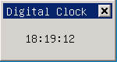

# 不可见控件

## 1 不可见控件简介

不可见控件是指那些不能在窗口上显示，但是却具有一定功能的组件。

这些组件是对一些功能模块的封装，保证它们能够像控件一样在mStudio中被编辑

- [mObject]()
   - [mComponent]()
      - mInvsbComp

## 2 `mInvsbComp`

- 控件名称: 无
- 英文名: Invisble Component
- 简要介绍: 不可见组件的基类
- 示意图: 

	<font color='red'>基础类，不能直接使用</font>

### 2.1 `mInvsbComp` 风格

继承自 [mComponent]() 的风格

### 2.2 `mInvsbComp` 属性

继承自 [mComponent]() 的属性

### 2.3 `mInvsbComp` 方法

`mInvsbComp` 提供了以下方法的实现：

- `setId`
- `getId`
- `setReleated`
- `getReleated`
- `getChild`

另外，为方便 `mInvsbComp` 的使用，提供了如下函数

- 创建不可见组件

```c
/**
 * \fn mInvsbComp * ncsCreateInvsbComp(const char* class_name, \
                         mComponent* parent, \
                         int id, NCS_PROP_ENTRY *props, \
                         NCS_EVENT_HANDLER * handlers, \
                         DWORD user_data);
 * \brief create an Invisible Component
 *
 * \param class_name  the class name of Invisible Component
 * \param parent the parent of creating Invisible Component
 * \param id  the id of Invisible Component
 * \param props the properties array of Invisible Component 
 * \param handlers the event handler array of Invisible Component
 * \param user_data user data
 *
 * \return mInvsbComp * - the new created Invisible Component pointer, NULL or failed
 *
 * \sa NCS_INVSB_CREATE_INFO, ncsCreateInvsbCompIndirect
 */
mInvsbComp * ncsCreateInvsbComp(const char* class_name, \
                                     mComponent* parent, \
                                     int id, \
                                     NCS_PROP_ENTRY *props, \
                                     NCS_EVENT_HANDLER * handlers, \
                                     DWORD user_data);

/**
 * \fn mInvsbComp * ncsCreateInvsbCompIndirect(const char* class_name, \
                                                                                     NCS_INVSB_CREATE_INFO *create_info);
 * \brief create an Invisible Component from creating info
 *
 * \param class_name the class name of Invisible Component
 * \param create_info the creating information pointer
 *
 * \return mInvsbComp * - the Invisible Component pointer if success, NULL or failed
 *
 * \sa NCS_INVSB_CREATE_INFO, ncsCreateInvsbComp
 */
mInvsbComp * ncsCreateInvsbCompIndirect(const char* class_name, \
                                                                            NCS_INVSB_CREATE_INFO *create_info);
```

其中，函数 `ncsCreateInvsbCompIndirect` 用到的 `NCS_INVSB_CREATE_INFO` 结构定义如下

```c
/**
 * A struct include Invisible Component Create info
 *
 * \sa ncsCreateInvsbCompIndirect
 */
typedef struct _NCS_INVSB_CREATE_INFO {
    /**
  -  The parent Component
  - /
    mComponent     -  parent;
    /**
  -  The id of component
  - /
    int                 id;
    /**
  -  The property of Component
  -  
  -  \sa NCS_PROP_ENTRY
  - /
    NCS_PROP_ENTRY -  props;
    /**
  -  The event handlers array
  -  
  -  \sa NCS_EVENT_HANDLER
  - /
    NCS_EVENT_HANDLER * handlers;

    /**
  -  Use defined data
  - /
    DWORD               user_data;
}NCS_INVSB_CREATE_INFO;
```

- 注： __不鼓励直接使用该函数创建不可见组件__ ，它们在手写代码中没有优势，优势在于，可以利用 mStudio 提供的资源来加载。

故省略例子

### 2.4 `mInvsbComp` 事件

 继承自 [mComponent]() 的事件

## 3 `mTimer`

- 控件名称: `NCSCTRL_TIMER`
- 英文名: Timer
- 简要介绍: 对 MiniGUI `SetTimerEx` 和 `KillTimer` 的封装
- 示意图: 

	无示意图，在 mStudio 中的图标是 

继承关系

- [mObject]()
   - [mComponent]()
      - [mInvsbComp]()
         - mTimer

### 3.1 `mTimer` 风格

继承自 [mInvsbComp]() 的风格

### 3.2 `mTimer` 属性

继承自[ mInvsbComp] 的属性

| 属性 ID | mStudio 名 | 类型 | 权限 | 说明 |
|:-------|:-----------|:----|:-----|:----|
| `NCSP_TIMER_INTERVAL` | interval | `DWORD` | `RW` | 设置Timer的时间间隔，以 10ms 为单位， 如果 Timer 正在运行，它会重启 Timer |

### 3.3 `mTimer` 方法

继承自 [mInvsbComp] 的方法

- start

```c
BOOL (*start)(clss *_this);
```
-  - 启动 Timer
   - Return `TRUE` -- 启动成功, `FALSE` -- 启动失败

- stop

```c
void (*stop)(clss *_this);
```
-  - 停止正在运行的 Timer

- `getParent`

```c
HWND (*getParent)(clss *_this);
```
-  - 获取拥有 Timer 的窗口

### 3.4 `mTimer` 事件

继承自 [mInvsbComp] 的事件

| 事件通知码 | 说明 | 参数 |
|:----------|:----|:----|
| `MSG_TIMER` | 直接利用 MiniGUI 的定义 | timer 走过的总时间数，即 `MSG_TIMER` 的 `lParam` 值 |

- 注：该事件的回调为：

```c
BOOL (*NCS_CB_ONTIMER)(mTimer* timer, DWORD total_count);
```
-  - Return : `TRUE` -- continue Timer, `FALSE` -- stop Timer
   - Params
      - `DWORD total_count` - Timer 启动以来总时间数

### 3.5 `mTimer` 示例

下面示例展示的是用 timer 显示一个数字钟表，运行效果图如下：



-  声明 Timer，使用和控件一样的结构

```c
static NCS_WND_TEMPLATE _ctrl_templ[] = {
        {
                NCSCTRL_TIMER, 
                100,
                10, 10, 0, 0,
                WS_BORDER | WS_VISIBLE,
                WS_EX_NONE,
                "",
                NULL, //props,
                NULL, //rdr_info
                NULL, //timer_props, //handlers,
                NULL, //controls
                0,
                0 //add data
        },
```

-  初始化 Timer，建立和一个 Static 控件的连接，并开始 Timer

```c
static BOOL mymain_onCreate(mWidget* self, DWORD add_data)
{
        //TODO : initialize
        mTimer * timer = SAFE_CAST(mTimer, 
        _c(self)->getChild(self, 100));
        if(timer)
        {
                ncsAddEventListener((mObject*)timer, 
                (mObject*)ncsGetChildObj(self->hwnd, 101), 
                (NCS_CB_ONPIECEEVENT)update_time, 
                MSG_TIMER);
                _c(timer)->start(timer);
        }
        return TRUE;
}
```

-  当 `MSG_TIMER` 事件发生时，更新时间

```c
static BOOL update_time(mStatic *listener,
mTimer* sender,
int id, 
DWORD total_count)
{
        char szText[100];
        time_t tim;
        struct tm *ptm;
        static int old_count = 0;
        
        time(&tim);
        ptm = localtime(&tim);
        
        sprintf(szText, 
        "%02d:%02d:%d",
        ptm->tm_hour, 
        ptm->tm_min, 
        ptm->tm_sec);
        old_count = total_count;
        
        SetWindowText(listener->hwnd, szText);
        InvalidateRect(listener->hwnd, NULL, TRUE);
        
        return FALSE;
}
```

完整的代码参考 [timer.c](samples/timer.c)
