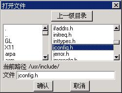
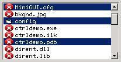
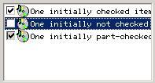
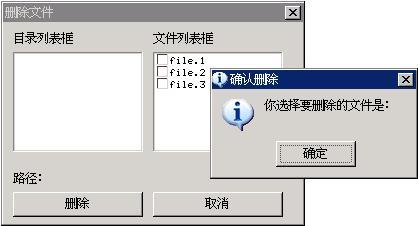

# 列表框

列表框通常为用户提供一系列的可选项，这些可选项显示在可滚动的子窗口中，用户可通过键盘及鼠标操作来选中某一项或者多个项，选中的列表项通常高亮显示。列表框的最典型用法就是文件打开对话框，见__图 1.1__。


__图 1.1__  列表框的典型应用场合：“打开文件”对话框


以 `CTRL_LISTBOX` 为控件类名调用 `CreateWindow` 函数，即可创建列表框控件。

## 1.1 列表框的类型和风格

MiniGUI 的列表框控件可划分为三种类型：单选列表框、多选列表框和位图列表框。默认情况下，列表框是单项选择的，用户只能从中选择一个列表项。如果要建立一个可选择多个列表项的列表框，则应使用 `LBS_MULTIPLESEL` 风格。使用该风格时，用户可通过单击某个项的方法选中这个项，再次单击将取消对其的选中。当列表框拥有输入焦点时，也可以使用空格键选择某个项或者取消某个项的选择。多选列表框的运行效果如__图 1.2__ 所示。


__图 1.2__ 多选列表框

除上述两种列表框的基本形态之外，MiniGUI 还提供有一种高级列表框类型。这种列表框中的列表项不仅仅是字符串，还可以用来附带位图或者图标，还可以在列表项旁边显示一个检查框，代表选中或者未选中。要建立这种高级列表框，需用指定 `LBS_USEICON` 或者 `LBS_CHECKBOX` 风格。__图 1.3__ 是这种高级列表框的运行效果。如果希望在用户单击检查框时自动切换选中状态，则可以使用 `LBS_AUTOCHECK` 风格。高级列表框也可以具有 `LBS_MULTIPLESEL` 风格。


__图 1.3__ 高级列表框

除上述用来区别列表框类型的风格之外，还可以在创建列表框时指定其他通用风格。

默认状态下，列表框窗口消息处理程序只显示列表条目，它的周围没有任何边界。你可以使用窗口风格 `WS_BORDER` 来加上边框。另外，你可以使用窗口风格 `WS_VSCROLL` 来增加垂直滚动条，以便用鼠标来滚动列表框条目，也可以使用 `WS_HSCROLL` 来增加水平滚动条，可以用来显示超出列表框宽度的条目。

缺省的列表框风格不会在用户选中某个列表项时产生通知消息，这样一来，程序必须向列表框发送消息以便了解其中条目的选择状态。所以，列表框控件通常都包括列表框风格 `LBS_NOTIFY`，它可以使列表框控件在用户进行操作时，将一些状态信息及时反馈给应用程序。

另外，如果希望列表框控件对列表框中的条目进行排序，那么可以使用另一种常用的风格 `LBS_SORT`。

一般情况下，创建列表框控件最常用的风格组合如下：

```c
(LBS_NOTIFY | LBS_SORT | WS_VSCROLL | WS_BORDER)
```

## 1.2 列表框消息

### 1.2.1 将字符串加入列表框

建立列表框之后，下一步是将字符串放入其中，你可以通过调用 `SendMessage` 为列表框窗口消息处理程序发送消息来做到这一点。字符串通常通过以0开始计数的索引数来引用，其中 0 对应于最顶上的条目。在下面的例子中，`hwndList` 是子窗口列表框控件的句柄，而 `index` 是索引值。在使用 `SendMessage` 传递字符串的情况下，`lParam` 参数是指向以 `NULL` 字符结尾的字符串指针。

在大多数例子中，当列表框控件所能存储的内容超过了可用内存空间时，`SendMessage` 将传回 `LB_ERRSPACE`。如果是因为其他原因而出错，那么 `SendMessage` 将传回 `LB_ERR`。如果操作成功，那么 `SendMessage` 将传回 `LB_OKAY`。我们可以通过测试 `SendMessage` 的非零值来判断出这两种错误。

如果你采用 `LBS_SORT` 风格，或者仅仅希望将新的字符串追加为列表框的最后一项，那么填入列表框最简单的方法是借助 `LB_ADDSTRING` 消息：

```c
SendMessage (hwndList, LB_ADDSTRING, 0, (LPARAM)string) ;
```

我们也可以使用 `LB_INSERTSTRING` 指定一个索引值，将字符串插入到列表框中的指定位置：

```c
SendMessage (hwndList, LB_INSERTSTRING, index, (LPARAM)string) ;
```

例如，如果 `index` 等于 4，那么 `string` 将变为索引值为 4 的字符串――从顶头开始算起的第 5 个字符串（因为是从 0 开始计数的），位于这个点后面的所有字符串都将向后推移。索引值为 -1 时，将字符串增加在最后。我们也可以对具有 `LBS_SORT` 风格的列表框使用 `LB_INSERTSTRING`，但是这时列表框将会忽略 `index` 的值，而根据排序的结果插入新的项。

需要注意的是，在指定了 `LBS_CHECKBOX` 或者 `LBS_USEICON` 风格之后，在向列表框添加条目时，必须使用 `LISTBOXITEMINFO` 结构，而不能直接使用字符串地址，例如：

```c
HICON hIcon1;           /* 声明图标句柄 */
LISTBOXITEMINFO lbii;   /* 声明列表框条目结构体变量 */

hIcon1 = LoadIconFromFile (HDC_SCREEN, "res/audio.ico", 1);  /* 加载图标 */

/* 设定结构信息，并添加条目 */
lbii.hIcon = hIcon1;
lbii.cmFlag = CMFLAG_CHECKED;
lbii.string = "abcdefg";
SendMessage (hChildWnd3, LB_ADDSTRING, 0, (LPARAM)&lbii);
```

其中，`cmFlag` 的值可以设置为 `CMFLAG_CHECKED`、`CMFLAG_BLANK` 以及 `CMFLAG_PARTCHECKED` 三种，分别表示：选中、未选中和部分选中。

我们也可以在高级列表框中显示位图，而不是默认的图标。如果你希望列表项显示的是位图而不是图标，则可以在该标志中包含 `IMGFLAG_BITMAP`，并在 `hIcon` 成员中指定位图对象的指针，如下所示：

```c
/* 设定结构信息，并添加条目 */
lbii.hIcon = (DWORD) GetSystemBitmap (SYSBMP_MAXIMIZE);
lbii.cmFlag = CMFLAG_CHECKED | IMGFLAG_BITMAP;
lbii.string = "abcdefg";
SendMessage (hChildWnd3, LB_ADDSTRING, 0, (LPARAM)&lbii);
```

### 1.2.2 删除列表框条目

发送 `LB_DELETESTRING` 消息并指定索引值就可以从列表框中删除指定的条目：

```c
SendMessage (hwndList, LB_DELETESTRING, index, 0) ;
```

我们甚至可以使用 `LB_RESETCONTENT` 消息清空列表框中的所有内容：

```c
SendMessage (hwndList, LB_RESETCONTENT, 0, 0) ;
```

### 1.2.3 选择和取得条目

发送 `LB_GETCOUNT` 消息可获得列表框中的条目个数：

```c
count = SendMessage (hwndList, LB_GETCOUNT, 0, 0) ;
```

在需要获得某个条目的字符串时，可发送 `LB_GETTEXTLEN` 消息确定列表框中指定条目的字符串长度：

```c
length = SendMessage (hwndList, LB_GETTEXTLEN, index, 0) ;
```

并将该条目复制到文字缓冲区中：

```c
length = SendMessage (hwndList, LB_GETTEXT, index, (LPARAM)buffer) ;
```

在这两种情况下，上述消息返回的 `length` 值是字符串的长度。对以 `NULL` 字符终结的字符串长度来说，`buffer` 必须足够大才行。你可以用 `LB_GETTEXTLEN` 消息返回的字符串长度来分配一些局部内存来存放字符串。

如果我们要设置列表框条目的字符串，可发送 `LB_SETTEXT` 消息：

```c
SendMessage (hwndList, LB_SETTEXT, index, buffer) ;
```

对于高级列表框来讲，我们必须使用 `LB_GETITEMDATA` 和 `LB_SETITEMDATA` 才能获得列表框条目的其他信息，比如位图对象或图标句柄、检查框状态等，这些消息也可以用来获取或设置条目的字符串：

```c
HICON hIcon1;           /* 声明图标句柄 */
LISTBOXITEMINFO lbii;   /* 声明列表框条目结构体变量 */

hIcon1 = LoadIconFromFile (HDC_SCREEN, "res/audio.ico", 1);  /* 加载图标 */

/* 设定结构信息，并添加条目 */
lbii.hIcon = hIcon1;
lbii.cmFlag = CMFLAG_CHECKED;
lbii.string = "new item";
SendMessage (hChildWnd3, LB_SETITEMDATA, index, (LPARAM)&lbii);
```

下面的消息用来检索列表框条目的选中状态，这些消息对单项选择列表框和多项选择列表框具有不同的调用方法。让我们先来看看单项选择列表框。

通常，用户会通过鼠标和键盘在列表框中选择条目。但是我们也可以通过程序来控制当前的选中项，这时，需要发送 `LB_SETCURSEL` 消息：

```c
SendMessage (hwndList, LB_SETCURSEL, index, 0) ;
```

反之，我们可以使用 `LB_GETCURSEL` 获得当前选定的索引项：

```c
index = SendMessage (hwndList, LB_GETCURSEL, 0, 0) ;
```

如果没有条目被选中，那么这个消息将返回 `LB_ERR`。

对于多项选择列表框来说，使用 `LB_SETCURSEL`、`LB_GETCURSEL` 只能用来设置和获取当前高亮项，无法获得所有具有选中状态的条目。但我们可以使用 `LB_SETSEL` 来设定某特定条目的选择状态，而不影响其他项：

```c
SendMessage (hwndList, LB_SETSEL, wParam, (LPARAM)index) ;
```

`wParam` 参数不为 0 时，选择并加亮某一条目；`wParam` 为 0 时，取消选择。反之，我们可以用 `LB_GETSEL` 消息确定某特定条目的选择状态：

```c
select = SendMessage (hwndList, LB_GETSEL, index, 0) ;
```

其中，如果由 `index` 指定的条目被选中，`select` 为非 0，否则为 0。

另外，你还可以使用 `LB_GETSELCOUNT` 消息获得多选列表框中当前被选中的条目个数。然后发送 `LB_GETSELITEMS` 消息获得所有被选中条目的索引值。示例如下：

```c
int i, sel_count;
int* sel_items;

sel_count = SendMessage (hwndList, LB_GETSELCOUNT, 0, 0L) ;
if (sel_count == 0)
return;

sel_items = alloca (sizeof(int)*sel_count);
SendMessage (hwndList, LB_GETSELITEMS, sel_count, sel_items);
for (i = 0; i < sel_count; i++) {
        /* sel_items [i] 为选中条目的索引值 */
}
```

### 1.2.4 查找含有字符串的条目

```c
index = SendMessage (hwndList, LB_FINDSTRING, (LPARAM)string) ;
```

其中，`string` 为希望查找的字符串的指针，该消息返回模糊匹配字符串 `string` 的条目索引值，`LB_ERR` 表示查找失败。如果使用消息 `LB_FINDSTRINGEXACT` 将进行严格精确匹配查找。

### 1.2.5 设置和获取某条目的检查框的当前状态

```c
status = SendMessage (hwndList, LB_GETCHECKMARK, index, 0) ;
```

返回由 `index` 指定索引处条目的检查框的状态。如果没有找到相应条目，则返回 `LB_ERR`。`CMFLAG_CHECKED` 表示该条目的检查框处于选择状态。`CMFLAG_PARTCHECKED` 表示该条目的检查框处于部分选择状态。`CMFLAG_BLANK` 表示该条目的检查框处于未选择状态。

```c
ret = SendMessage (hwndList, LB_SETCHECKMARK, index, (LPARAM)status) ;
```

设置由 `index` 指定索引处条目的检查框的状态为 `status` 中指定的值。当没有找到 `index` 指定的条目时，返回 `LB_ERR` 表示失败，否则返回 `LB_OKAY` 表示成功。

### 1.2.6 设置某列表框条目加粗显示状态

```c
ret = SendMessage (hwndList, LB_SETITEMBOLD, index, (LPARAM)status) ;
```

设置由 `index` 指定索引处条目的检查框的状态为加粗显示状态。当没有找到 `index` 指定的条目时，返回 `LB_ERR` 表示失败，否则根据 `lParam` 的值判断是否进行加粗设置，如果为 1 则加粗显示，为 0 则正常显示。

### 1.2.7 设置和获取某列表框条目的选择状态

```c
status = SendMessage (hwndList, LB_GETITEMDISABLE, index, 0) ;
```

返回由 `index` 指定索引处条目的检查框是否处于禁止选中状态。如果没有找到相应条目，则返回 `LB_ERR`。1 表示该条目的检查框处于禁止选中状态。0 表示该条目的检查框处于可选择状态。

```c
ret = SendMessage (hwndList, LB_SETITEMDISABLE, index, (LPARAM)status) ;
```

设置由 `index` 指定索引处条目的检查框的状态为禁止选中状态。当没有找到 `index` 指定的条目时，返回 `LB_ERR` 表示失败，否则根据 `lParam` 的值判断是否进行禁止选中状态设置，如果为 1 则设置为禁止选中状态，为 0 则为可选择状态。

### 1.2.8 添加多个列表框条目

`LB_MULTIADDITEM` 消息用于向列表框一次添加多个条目。当列表框控件所能存储的内容超过了可用内存空间时，`SendMessage` 将传回 `LB_ERRSPACE`。如果是因为其他原因而出错，那么`SendMessage` 将传回 `LB_ERR`。如果操作成功，那么 `SendMessage` 将传回 `LB_OKAY`。我们可以通过测试 `SendMessage` 的非零值来判断出这两种错误。

如果你采用 `LBS_SORT` 风格，或者仅仅希望将新的字符串数组追加到列表框条目中，方法如下：

```c
int num = 2;
const char text[num][] = {“item1”, “item2”};

SendMessage (hwndList, LB_MULTIADDITEM, num, (LPARAM)text);
```

其中 `hwndList` 是列表框控件的句柄，`num` 是添加的条目数，`text` 是字符串数组。

需要注意的是，在指定了 `LBS_CHECKBOX` 或者 `LBS_USEICON` 风格之后，在向列表框添加多个条目时，必须使用 `LISTBOXITEMINFO` 结构，而不能直接使用字符串数组地址，例如：

```c
int num = 2;
HICON hIcon1;           /* 声明图标句柄 */
LISTBOXITEMINFO lbii[num];   /* 声明列表框条目结构体变量数组 */

hIcon1 = LoadIconFromFile (HDC_SCREEN, "res/audio.ico", 1);  /* 加载图标 */

/* 设定结构信息，并添加条目 */
lbii[0].hIcon = hIcon1;
lbii[0].cmFlag = CMFLAG_CHECKED;
lbii[0].string = "item1";

lbii[1].hIcon = hIcon1;
lbii[1].cmFlag = CMFLAG_CHECKED;
lbii[1].string = "item2";

SendMessage (hwndList, LB_MULTIADDITEM, num, (LPARAM)lbii);
```

### 1.2.9 其他消息

默认情况下，具有 `LBS_SORT` 风格的列表框在排序时使用标准 C 函数的 `strncmp` 函数排序。但我们可以通过 `LB_SETSTRCMPFUNC` 来重载默认的排序方式，而以自己希望的方式排序。比如：

```c
static int my_strcmp (const char* s1, const char* s2, size_t n)
{
        int i1 = atoi (s1);
        int i2 = atoi (s2);
        return (i1 – i2);
}

SendMessage (hwndList, LB_SETSTRCMPFUNC, 0, (LPARAM)my_strcmp);
```

这样，列表框将使用我们自己定义的函数对条目进行排序。上述排序函数可用来对诸如 1、2、3、4、10、20 等条目进行正常的以数值为大小的排序，而默认的排序规则会将上述 6 个数字排序为 1、10、2、20、3、4。一般而言，应用程序要在添加条目之前使用该消息设定新的字符串比较函数。

我们还可以为每个列表框条目追加一个附加的 32 位数据，并在适当的时候将这个值取出，这时，我们可以使用 `LB_SETITEMADDDATA` 和 `LB_GETITEMADDDATA` 消息。这两个消息所操作的值对列表框控件来说没有任何意义，它只是负责存储这个值，并在需要时返回这个值。

另外，我们还可以使用 `LB_SETITEMHEIGHT` 来消息来设定条目所占的高度，`LB_GETITEMHEIGHT` 返回这个高度。通常情况下，条目的高度取决于控件字体的大小，当控件字体发生变化时（调用 `SetWindowFont` 而改变），条目的高度将发生变化。用户也可以设定一个自己的条目高度。实际的高度将是设定高度和控件字体大小的最大值。

## 1.3 列表框通知码

具有 `LBS_NOTIFY` 风格的列表框可能产生的通知消息及其含义如__表 1.1__ 所示。

__表 1.1__ 列表框通知码
| 通知码标识符          | 含义 |
|:--------------------|:----|
|`LBN_ERRSPACE`       |内存分配失败。|
|`LBN_SELCHANGE`      |单项选择列表框的当前选择项发生变化。|
|`LBN_CLICKED`        |用户在列表框某条目上单击了鼠标左键。|
|`LBN_DBLCLK`         |用户在列表框某条目上双击了鼠标左键。|
|`LBN_SELCANCEL`      |用户取消了某个条目的选择。|
|`LBN_SETFOCUS`       |列表框获得了输入焦点。|
|`LBN_KILLFOCUS`      |列表框失去了输入焦点。|
|`LBN_CLICKCHECKMARK` |用户单击了条目的检查框。|
|`LBN_ENTER`          |用户在列表框中按下 `ENTER` 键|


只有列表框窗口风格包括 `LBS_NOTIFY` 时，列表框控件才会向父窗口发送上述通知消息。当然，如果你调用 `SetNotificationCallback` 函数设定了列表框控件的通知回调函数，则控件不会向父窗口发送 `MSG_COMMAND` 通知消息，而是会直接调用设定的通知回调函数。

`LBN_ERRSPACE` 表示内存分配失败。`LBN_SELCHANGE` 表示目前选中条目已经被改变，这个消息出现在下列情况下：用户在列表框中使用键盘或鼠标改变加亮的条目时，或者用户使用空格键或鼠标切换选择状态时。`LBN_CLICKED` 表示列表框被鼠标点击了。该消息出现在使用鼠标单击某项时。`LBN_DBLCLK` 说明某条目已经被鼠标双击。如果设置了 `LBS_CHECKBOX` 风格，`LBN_CLICKCHECKMARK` 表示鼠标击中了检查方框，如果同时设置了 `LBS_AUTOCHECK` 风格，则检查框会自动在勾选或者空白间切换。

根据应用程序的需要，也许要使用 `LBN_SELCHANGE` 或 `LBN_DBLCLK`，也许二者都要使用。程序会收到许多 `LBN_SELCHANGE` 消息，但是 `LBN_DBLCLK` 消息只有当使用者双击鼠标时才会出现。

## 1.4 编程实例

__清单 1.1__ 所示的程序代码，给出了列表框控件的使用范例。该程序仿照“打开文件”对话框，实现了文件删除功能。初始时，程序列出了当前目录下的所有文件，用户也可以通过目录列表框切换到其他路径。用户可在文件列表框中通过检查框选择多个要删除的文件，当用户按“删除”按钮时，该程序将提示用户。当然，为了保护用户的文件，该程序并未实现真正的删除功能。该程序创建的对话框效果如__图 1.4__ 所示，完整源代码见本指南示例程序包 `mg-samples` 中的 `listbox.c` 文件。

__清单 1.1__ 列表框控件的使用范例

```c
#include <stdio.h>
#include <stdlib.h>
#include <stdarg.h>
#include <string.h>
#include <sys/stat.h>
#include <sys/time.h>
#include <sys/types.h>
#include <unistd.h>
#include <pwd.h>
#include <errno.h>

#include <minigui/common.h>
#include <minigui/minigui.h>
#include <minigui/gdi.h>
#include <minigui/window.h>
#include <minigui/control.h>

#define IDL_DIR    100
#define IDL_FILE   110
#define IDC_PATH   120

/* 定义对话框模板 */
static DLGTEMPLATE DlgDelFiles =
{
        WS_BORDER | WS_CAPTION,
        WS_EX_NONE,
        100, 100, 304, 225,
        "删除文件",
        0, 0,
        7, NULL,
        0
};

static CTRLDATA CtrlDelFiles[] =
{ 
        {
                CTRL_STATIC,
                WS_VISIBLE | SS_SIMPLE, 
                10, 10, 130, 15,
                IDC_STATIC,
                "目录列表框",
                0
        },
        /* 这个列表框中显示目录项 */
        {
                CTRL_LISTBOX,
                WS_VISIBLE | WS_VSCROLL | WS_BORDER | LBS_SORT | LBS_NOTIFY,
                10, 30, 130, 100,
                IDL_DIR,
                "",
                0
        },
        {
                CTRL_STATIC,
                WS_VISIBLE | SS_SIMPLE, 
                150, 10, 130, 15, 
                IDC_STATIC, 
                "文件列表框",
                0
        },
        /* 这个列表框中显示文件，前面带一个检查框 */
        {
                CTRL_LISTBOX,
                WS_VISIBLE | WS_VSCROLL | WS_BORDER | LBS_SORT | LBS_AUTOCHECKBOX,
                150, 30, 130, 100,
                IDL_FILE,
                "",
                0
        },
        /* 这个静态框用来显示当前路径信息 */
        {
                CTRL_STATIC,
                WS_VISIBLE | SS_SIMPLE, 
                10, 150, 290, 15, 
                IDC_PATH, 
                "路径：",
                0
        },
        {
                "button",
                WS_VISIBLE | BS_DEFPUSHBUTTON | WS_TABSTOP | WS_GROUP,
                10, 170, 130, 25,
                IDOK, 
                "删除",
                0
        },
        {
                "button",
                WS_VISIBLE | BS_PUSHBUTTON | WS_TABSTOP,
                150, 170, 130, 25,
                IDCANCEL,
                "取消",
                0
        },
};

/* 这个函数获取当前目录下的所有目录项，分别填到目录列表框和文件列表框中 */
static void fill_boxes (HWND hDlg, const char* path)
{
        struct dirent* dir_ent;
        DIR*   dir;
        struct stat ftype;
        char   fullpath [PATH_MAX + 1];
        
        SendDlgItemMessage (hDlg, IDL_DIR, LB_RESETCONTENT, 0, (LPARAM)0);
        SendDlgItemMessage (hDlg, IDL_FILE, LB_RESETCONTENT, 0, (LPARAM)0);
        SetWindowText (GetDlgItem (hDlg, IDC_PATH), path);
        
        if ((dir = opendir (path)) == NULL)
        return;
        
        while ( (dir_ent = readdir ( dir )) != NULL ) {
                
                /* Assemble full path name. */
                strncpy (fullpath, path, PATH_MAX);
                strcat (fullpath, "/");
                strcat (fullpath, dir_ent->d_name);
                
                if (stat (fullpath, &ftype) < 0 ) {
                        continue;
                }
                
                if (S_ISDIR (ftype.st_mode))
                SendDlgItemMessage (hDlg, IDL_DIR, LB_ADDSTRING, 0, (LPARAM)dir_ent->d_name);
                else if (S_ISREG (ftype.st_mode)) {
                        /* 使用检查框的列表框，需要使用下面的结构 */
                        LISTBOXITEMINFO lbii;
                        
                        lbii.string = dir_ent->d_name;
                        lbii.cmFlag = CMFLAG_BLANK;
                        lbii.hIcon = 0;
                        SendDlgItemMessage (hDlg, IDL_FILE, LB_ADDSTRING, 0, (LPARAM)&lbii);
                }
        }
        
        closedir (dir);
}

static void dir_notif_proc (HWND hwnd, int id, int nc, DWORD add_data)
{
        /* 用户双击目录名或者按下 ENTER 键时，进入对应的目录 */
        if (nc == LBN_DBLCLK || nc == LBN_ENTER) {
                int cur_sel = SendMessage (hwnd, LB_GETCURSEL, 0, 0L);
                if (cur_sel >= 0) {
                        char cwd [MAX_PATH + 1];
                        char dir [MAX_NAME + 1];
                        GetWindowText (GetDlgItem (GetParent (hwnd), IDC_PATH), cwd, MAX_PATH);
                        SendMessage (hwnd, LB_GETTEXT, cur_sel, (LPARAM)dir);
                        
                        if (strcmp (dir, ".") == 0)
                        return;
                        strcat (cwd, "/");
                        strcat (cwd, dir);
                        /* 重新填充两个列表框 */
                        fill_boxes (GetParent (hwnd), cwd);
                }
        }
}

static void file_notif_proc (HWND hwnd, int id, int nc, DWORD add_data)
{
        /* Do nothing */
}

static void prompt (HWND hDlg)
{
        int i;
        char files [1024] = "你选择要删除的文件是：\n";
        
        /* 获取所有勾选的文件 */
        for (i = 0; i < SendDlgItemMessage (hDlg, IDL_FILE, LB_GETCOUNT, 0, 0L); i++) {
                char file [MAX_NAME + 1];
                int status = SendDlgItemMessage (hDlg, IDL_FILE, LB_GETCHECKMARK, i, 0);
                if (status == CMFLAG_CHECKED) {
                        SendDlgItemMessage (hDlg, IDL_FILE, LB_GETTEXT, i, (LPARAM)file);
                        strcat (files, file);
                        strcat (files, "\n");
                }
        }
        
        /* 提示用户 */
        MessageBox (hDlg, files, "确认删除", MB_OK | MB_ICONINFORMATION);
        
        /* 在这里把那些文件真正删除！ */
}

static int DelFilesBoxProc (HWND hDlg, int message, WPARAM wParam, LPARAM lParam)
{
        switch (message) {
                case MSG_INITDIALOG:
                {
                        char cwd [MAX_PATH + 1];
                        SetNotificationCallback (GetDlgItem (hDlg, IDL_DIR), dir_notif_proc);
                        SetNotificationCallback (GetDlgItem (hDlg, IDL_FILE), file_notif_proc);
                        fill_boxes (hDlg, getcwd (cwd, MAX_PATH));
                        return 1;
                }
                
                case MSG_COMMAND:
                switch (wParam) {
                        case IDOK:
                        prompt (hDlg);
                        case IDCANCEL:
                        EndDialog (hDlg, wParam);
                        break;
                }
                break;
                
        }
        
        return DefaultDialogProc (hDlg, message, wParam, lParam);
}

int MiniGUIMain (int argc, const char* argv[])
{
        #ifdef _MGRM_PROCESSES
        JoinLayer(NAME_DEF_LAYER , "listbox" , 0 , 0);
        
        #endif
        
        DlgDelFiles.controls = CtrlDelFiles;
        
        DialogBoxIndirectParam (&DlgDelFiles, HWND_DESKTOP, DelFilesBoxProc, 0L);
        
        return 0;
}

#ifndef _MGRM_PROCESSES
#include <minigui/dti.c>
#endif
```


__图 1.4__  “删除文件”对话框
