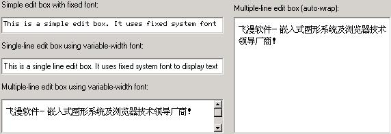
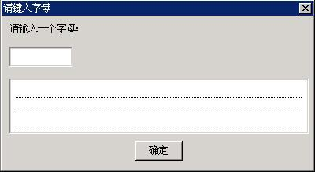

# 编辑框

编辑框为应用程序提供了接收用户输入和编辑文字的重要途径。相对前面提到的静态框、按钮和列表框等控件来讲，编辑框的用途和行为方式比较单一。它在得到输入焦点时显示一个闪动的插入符，以表明当前的编辑位置；用户键入的字符将插入到插入符所在位置。除此之外，编辑框还提供了诸如删除、移动插入位置和选择文本等编辑功能。

MiniGUI 中提供了三种类型的编辑框，分别对应于三种控件类，它们是：

- 单行编辑框：类名  "sledit"、"edit"，标识符 `CTRL_SLEDIT`、`CTRL_EDIT`。它只能处理单行文本，但在 MiniGUI 逻辑字体的帮助下，可以处理任意的多字节字符输入，包括变长字符集。该控件提供了选中、复制和粘贴等编辑功能。
- 多行编辑框：类名 "textedit"、"mledit"、"medit"，标识符 `CTRL_TEXTEDIT`、`CTRL_MLEDIT` 或者 `CTRL_MEDIT`。它用来处理多行文本，亦可处理任意的多字节字符输入，包括变长字符集。该控件提供了选中、复制和粘贴等编辑功能。
- 单行双向文本编辑框： 类名 "bidisledit"，标识符 `CTRL_BIDISLEDIT`。 它只能处理单行文本，该控件除了拥有单行编辑框的功能外，还能够显示和输入双向文本，包括阿拉伯文和希伯来文。该控件提供了选中、复制和粘贴等编辑功能。

除上述控件类差别之外，上述三种编辑框控件类的风格、消息以及通知码大体相似，只有少量不同。__图 1.1__ 给出了编辑框的运行效果。


__图 1.1__ MiniGUI 编辑框


## 1.1 编辑框风格

通常，我们在创建编辑框时使用下面的风格组合：

```c
WS_CHILD | WS_VISIBLE | WS_BORDER
```

显然，上述风格定义中没有使用任何编辑框特有的风格。也就是说，我们无需指定编辑框特有的风格就能正常使用编辑框。但编辑框也有一些自己的特有风格，主要包括：
- `ES_UPPERCASE`：可以使编辑框只显示大写字母。
- `ES_LOWERCASE`：可以使编辑框只显示小写字母。
- `ES_PASSWORD`：编辑框用来输入密码，但用星号 (`*`) 显示输入的字符。
- `ES_READONLY`：建立只读编辑框，用户不能修改编辑框中的内容，但插入符仍然可见。
- `ES_BASELINE`：在编辑框文本下显示虚线。
- `ES_AUTOWRAP`：用于多行编辑框，当文本超过控件边界时，将自动换行。
- `ES_LEFT`：指定非多行编辑框的对齐风格，实现文本的左对齐风格。
- `ES_NOHIDESEL`：编辑框在失去焦点时保持被选择文本的选中状态。
- `ES_AUTOSELECT`：编辑框在得到焦点时自动选中所有的文本内容（仅针对单行编辑框）。
- `ES_TITLE`：在编辑框的第一行显示指定的标题，只适用于多行编辑框控件。
- `ES_TIP`：当编辑框的内容为空时，在其中显示相关的提示信息；只适用于 `SLEDIT` 控件。
- `ES_CENTER`：指定非多行编辑框的对齐风格，实现文本的居中对齐风格。
- `ES_RIGHT`：指定非多行编辑框的对齐风格，实现文本的右对齐风格。

对多行编辑框，如果希望使用滚动条，则可以指定窗口风格 `WS_HSCROLL` 和 `WS_VSCROLL`。

其中适用于多行编辑框的风格有：`ES_UPPERCASE`，`ES_LOWERCASE`，`ES_READONLY`，`ES_BASELINE`，`ES_AUTOWRAP`，`ES_NOHIDESEL`，`ES_TITLE`。

其中适用于单行编辑框的风格有：`ES_UPPERCASE`，`ES_LOWERCASE`，`ES_READONLY`，`ES_BASELINE`，`ES_LEFT`，`ES_CENTER`，`ES_RIGHT`，`ES_PASSWORD`，`ES_NOHIDESEL`，`ES_AUTOSELECT`，`ES_TIP`。

## 1.2 编辑框消息

使用下面的消息，可获得编辑框中的当前文本信息。这些消息可用于上述两种编辑框类型：

- `MSG_GETTEXTLENGTH`：获取文本的长度，以字节为单位。
- `MSG_GETTEXT`：获取编辑框中的文本。
- `MSG_SETTEXT`：设置编辑框中的文本内容。

应用程序也可以直接调用下面三个函数来完成相应的工作：

- `GetWindowTextLength`
- `GetWindowText`
- `SetWindowText`

实际上，上述三个函数就是对前三个消息的简单封装。我们在前面几章也看到，相同的消息和函数也可以用在静态框及按钮等控件身上。

接下来要介绍的几个消息是编辑框特有的。

### 1.2.1 获取和设置插入符位置

向编辑框发送 `EM_GETCARETPOS` 消息将获得当前的插入符位置：

```c
int line_pos;
int char_pos;

SendMessage (hwndEdit, EM_GETCARETPOS, (WPARAM) &line_pos, (LPARAM) &char_pos);
```

该消息返回之后，`line_pos` 和 `char_pos` 分别含有插入符所在的行索引值以及在该行的字符位置。对单行编辑框来讲，`line_pos` 永远为零，所以，该消息的 `wParam` 可传零值。

注意：对应多行编辑框来说，一行指的是以行结束符（回车换行符）结束的一个字符串行，而不是以 `ES_AUTOWRAP` 绕行风格显示时的一个段落内的一行。MiniGUI 中编辑框的字符位置在显示多字节文本时是以多字节字符（比如说汉字）为单位，而不是以字节为单位。这个定义对于编辑框的其它消息是相同的。

应用程序也可通过 `EM_SETCARETPOS` 消息设置插入符的位置：

```c
int line_pos;
int char_pos;

SendMessage (hwndEdit, EM_SETCARETPOS, line_pos, char_pos);
```

`wParam` 和 `lParam` 参数分别指定行位置和字符位置。

### 1.2.2 设置和获取选中的文本

`EM_GETSEL` 消息用来获取当前被选中的文本。

```c
char buffer[buf_len];

SendMessage (hwndEdit, EM_GETSEL, buf_len, (LPARAM) buffer);
```

其中 `lParam` 参数指定用来保存所获取文本的字符缓冲区，`wParam` 参数指定该缓冲区的大小。如果指定的缓冲区较小，多余的文本将被截去。

`EM_SETSEL` 消息用来设置当前被选中的文本。

```c
int line_pos, char_pos;

SendMessage (hwndEdit, EM_SETSEL, line_pos, char_pos);
```

其中 `lParam` 参数指定选择点的行索引值，`wParam` 指定选择点的行内字符位置。发送该消息之后，当前插入点和选择点之间的文本将被选中。

`EM_GETSELPOS` 消息用来获取当前的选择点位置。

```c
int line_pos;
int char_pos;

SendMessage (hwndEdit, EM_GETCARETPOS, (WPARAM) &line_pos, (LPARAM) &char_pos);
```

`EM_GETSELPOS` 消息的用法和 `EM_GETCARETPOS` 消息类似。

`EM_SELECTALL` 消息用来使编辑框所有的文本都被选中，相当于“CTRL+A”操作：

```c
SendMessage (hwndEdit, EM_SELECTALL, 0, 0);
```

### 1.2.3 复制、剪切和粘贴

可以通过键盘操作或者发相应消息的方式来对编辑框控件进行复制、剪切和粘贴等编辑操作。编辑框控件的复制等键盘操作：
- `CTRL+C`：把文本从编辑框复制到剪贴板
- `CTRL+V`：从剪贴板粘贴文本到编辑框
- `CTRL+X`：把编辑框文本剪切到剪贴板

`EM_COPYTOCB` 消息用来把编辑框控件当前选中的文本复制到剪贴板，相当于“CTRL+C”操作：

```c
SendMessage (hwndEdit, EM_COPYTOCB, 0, 0);
```

`EM_CUTTOCB` 消息用来把编辑框中选中的内容剪切到剪贴板中，相当于“CTRL+X”操作：

CODE{"cpp"}%
SendMessage (hwndEdit, EM_CUTTOCB, 0, 0);
```

`EM_INSERTCBTEXT` 消息用来把剪贴板的文本内容复制到编辑框，相当于“CTRL+V”操作：

```c
SendMessage (hwndEdit, EM_INSERTCBTEXT, 0, 0);
```

### 1.2.4 获取和设置行高等属性

这里的行高表示回绕显示方式下的一个单行的高度。

`EM_GETLINEHEIGHT` 消息用来获取行的高度：

```c
int line_height;
line_height = SendMessage (hwndEdit, EM_GETLINEHEIGHT, 0, 0);
```

`EM_SETLINEHEIGHT` 消息用来设置行的高度，设置成功返回原行高值，失败返回-1：

```c
int line_height;
SendMessage (hwndEdit, EM_SETLINEHEIGHT, line_height, 0);
```

> 注意：最好在设置编辑框的文本前使用EM_SETLINEHEIGHT消息，因为重新设置行高将把编辑框的内容清空。

`EM_GETLINECOUNT` 消息用来获取行的数量：

```c
int line_count;
line_count = SendMessage (hwndEdit, EM_GETLINECOUNT, 0, 0);
```

这里的行表示回绕显示方式下的一个单行。

### 1.2.5 设置文本上限

向编辑框发送 `EM_LIMITTEXT` 可设置编辑框控件的文本上限，以字节为单位：

```c
SendMessage (hwndEdit, EM_LIMITTEXT, 10, 0L);
```

上面的消息将使编辑框只能输入总长为 10 字节的字符。

### 1.2.6 设置和取消只读状态

使用 `EM_SETREADONLY` 消息，并在为 `wParam` 参数传递 `TRUE`，将使编辑框置于只读状态，而为 `wParam` 参数传递 `FALSE`，将使编辑框置于正常编辑状态。

### 1.2.7 设置和获取密码字符

默认情况下，MiniGUI 使用星号（`*`）来显示密码编辑框中键入的文字，但我们也可以使用 `EM_SETPASSWORDCHAR` 消息来修改密码字符：

```c
SendMessage (hwndEdit, EM_SETPASSWORDCHAR, ‘%’, 0L);
```

上面的消息调用将把密码字符修改为百分号（`%`）。

使用 `EM_GETPASSWORDCHAR` 消息将获得当前的密码字符。

>【提示】密码字符仅可设置为可显示的ASCII码。

`TEXTEDIT` 控件目前没有实现 `EM_SETPASSWORDCHAR` 和 `EM_GETPASSWORDCHAR` 消息。

### 1.2.8 设置标题文字和提示文字

当 `SLEDIT` 控件具有 `ES_TIP` 风格时，可以使用 `EM_SETTIPTEXT` 消息来设置编辑框的提示文字，使用 `EM_GETTIPTEXT` 消息来获取编辑框的提示文字：

```c
int len;
char *tip_text;
SendMessage (hwndEdit, EM_SETTIPTEXT, len, (LPARAM)tip_text);
```

`lParam` 参数指定提示文字字符串，`wParam` 参数指定字符串的长度；如果 `tip_text` 是以’\0’结束的话，`wParam` 可以设为 -1；如果 `wParam` 为 0，提示文字将为空。`EM_GETTIPTEXT` 消息将返回当前提示文字的字符串：

```c
int len;
char tip_text[len+1];
SendMessage (hwndEdit, EM_GETTIPTEXT, len, (LPARAM)tip_text);
```

`lParam` 参数指定存储提示文字的字符串缓冲区，`wParam` 参数指定缓冲区能够存放字符串的长度（不包括’\0’）。

当 `TEXTEDIT` 控件具有 `ES_TITLE` 风格时，可以使用 `EM_SETTITLETEXT` 消息来设置编辑框的标题文字，使用 `EM_GETTITLETEXT` 消息来获取编辑框的标题文字：

```c
int len;
char *title_text;
SendMessage (hwndEdit, EM_SETTITLETEXT, len, (LPARAM)title_text);
```

`lParam` 参数指定标题文字字符串，`wParam` 参数指定字符串的长度；如果 `title_text` 是以’\0’结束的话，`wParam` 可以设为 -1；如果 `wParam` 为0，标题文字将为空。 `EM_GETTITLETEXT` 消息将返回当前标题文字的字符串：

```c
int len;
char title_text[len+1];
SendMessage (hwndEdit, EM_GETTITLETEXT, len, (LPARAM)title_text);
```

`lParam` 参数指定存储标题文字的字符串缓冲区，`wParam` 参数指定缓冲区能够存放字符串的长度（不包括’\0’）。

### 1.2.9 设置行结束符的显示符号

正常情况下，`TEXTEDIT` 编辑框是不把换行符号显示出来的。如果使用 `EM_SETLFDISPCHAR` 消息设置了用于行结束符的显示符号，编辑框将把行结束符显示为所设的显示符号。

```c
char disp_char;
SendMessage (hwndEdit, EM_SETLFDISPCHAR, 0, disp_char);
```

`lParam` 参数为所要设的行结束符的显示符号。

例如，如果要用“*”星号来显示行结束符，可以这样设置：

```c
SendMessage (hwndEdit, EM_SETLFDISPCHAR, 0, ‘*’);
```

### 1.2.10 设置行结束符

默认情况下，`TEXTEDIT` 编辑框的换行符号为’\n’。可以使用 `EM_SETLINESEP` 消息改变编辑框使用的换行符号：

```c
char sep_char;
SendMessage (hwndEdit, EM_SETLINESEP, 0, sep_char);
```

`lParam` 参数为所要设的行结束符。

例如，如果要用 `TAB` 来标志行的结束，可以这样设置：

```c
SendMessage (hwndEdit, EM_SETLINESEP, 0, ‘\t’);
```

### 1.2.11 获取段落数、指定段落长度和文本

`EM_GETNUMOFPARAGRAPHS` 消息用来获取文本的段落数目：

```c
int num;
num = SendMessage (hwnd, EM_GETNUMOFPARAGRAPHS, 0, 0);
```

`EM_GETPARAGRAPHLENGTH` 消息用来获取某个特定段落的长度。获取成功返回指定段落的长度，失败返回 -1：

```c
int len;
len = SendMessage (hwnd, EM_GETPARAGRAPHLENGTH, idx, 0);
```

其中 `wParam` 参数指定要获取文本的段落索引。 

`EM_GETPARAGRAPHTEXT` 消息用来获取特定段落的文本。为了保证获取文本的字符完整性，会对要拷贝的字节长度进行适当调整：

```c
TEXTPOSINFO info;
unsigned char buff [32];

info.start_pos = 5;
info.copy_len = 10;
info.buff = buff;
info.paragraph_index = -1;

SendMessage (hwnd, EM_GETPARAGRAPHTEXT, &info, 0);
```

`info` 为一个 `TEXTPOSINFO` 类型的结构，指定了与要获取的文本相关的信息。结构定义如下：

```c
typedef struct _TEXTPOSINFO {
        /*The index of paragraph, if value is -1, 
        *it will take effect on the whole text.*/
        int paragraph_index;
        /*The beginning byte position can be copied to the buffer.*/
        int start_pos;
        /*The maximal number of bytes can be copied to the buffer.*/
        int copy_len;
        /*The pointer to a buffer receives the text. 
        *Please make sure buffer size is more than the value of copy_len.*/
        char *buff;
}TEXTPOSINFO;
```

其中 `start_pos` 成员为获取文本的起始位置；`copy_len` 为获取文本的字节数；`paragraph_index` 为获取文本所在的段落索引（若设置为 －1，将以所有段落为准拷贝所需的字符长度）；`buff` 为保存所获取文本的字符缓冲区。

## 1.3 编辑框通知码

编辑框没有 `ES_NOTIFY` 风格，因此，任意一个编辑框控件均可能产生通知消息，通知码如下所列：

- `EN_SETFOCUS`：编辑控件已经获得输入焦点
- `EN_KILLFOCUS`：编辑控件已经失去输入焦点
- `EN_CHANGE`：编辑控件的内容已经改变
- `EN_UPDATE`: 编辑控件在接收到 `MSG_SETTEXT`， `EM_RESETCONTENT` 或 `EM_SETLINEHEIGHT` 消息后，内容已经改变
- `EN_ENTER`：用户在编辑框中按下了 `Enter` 键
- `EN_MAXTEXT`：编辑控件在插入时超出了限定长度
- `EN_DBLCLK`：编辑控件被鼠标左键双击
- `EN_CLICKED`：编辑控件被鼠标左键点击

## 1.4 编程实例

在前面的章节中，我们已经看到了编辑框的用法。__清单 1.1__ 给出了编辑框的另一个使用实例，该程序将用户在单行编辑框中的输入随用户的编辑复制到自动换行的多行编辑框中。该程序的完整源代码可见本指南示例程序包 `mg-samples` 中的 `edit.c` 文件。该程序的运行效果见__图 1.2__。

__清单 1.1__ 编辑框使用实例

```c
#include <stdio.h>
#include <stdlib.h>

#include <minigui/common.h>
#include <minigui/minigui.h>
#include <minigui/gdi.h>
#include <minigui/window.h>
#include <minigui/control.h>

/* 定义对话框模板 */
static DLGTEMPLATE DlgBoxInputChar =
{
        WS_BORDER | WS_CAPTION, 
        WS_EX_NONE,
        0, 0, 400, 220, 
        #ifdef _LANG_ZHCN
        "请键入字母",
        #else
        "Please input letters",
        #endif
        0, 0,
        4, NULL,
        0
};

#define IDC_CHAR        100
#define IDC_CHARS       110

static CTRLDATA CtrlInputChar [] =
{ 
        {
                CTRL_STATIC,
                WS_VISIBLE ,
                10, 10, 380, 18, 
                IDC_STATIC, 
                #ifdef _LANG_ZHCN
                "请输入一个字母:",
                #else
                "Please input a letter:",
                #endif
                0
        },
        {
                CTRL_SLEDIT,
                WS_VISIBLE | WS_TABSTOP | WS_BORDER | ES_CENTER,
                10, 40, 80, 25,
                IDC_CHAR,
                NULL,
                0
        },
        {
                CTRL_MLEDIT,
                WS_VISIBLE | WS_BORDER | WS_VSCROLL | ES_BASELINE | ES_AUTOWRAP,
                10, 80, 380, 70, 
                IDC_CHARS, 
                NULL,
                0
        },
        {
                CTRL_BUTTON,
                WS_TABSTOP | WS_VISIBLE | BS_DEFPUSHBUTTON, 
                170, 160, 60, 25,
                IDOK, 
                #ifdef _LANG_ZHCN
                "确定",
                #else
                "OK",
                #endif
                0
        }
};

static void my_notif_proc (HWND hwnd, int id, int nc, DWORD add_data)
{
        unsigned char buff [256] = {0};
        if (id == IDC_CHAR && nc == EN_CHANGE) {
                /* 将用户在单行编辑框中的输入取出（第一个字母），然后插入到多行编辑框中 */
                GetWindowText (hwnd, buff, 4);
                /* 将单行编辑框的插入符置于头部，以便覆盖老的字母 */
                SendMessage (hwnd, EM_SETCARETPOS, 0, 0);
                SendMessage (GetDlgItem (GetParent (hwnd), IDC_CHARS), MSG_CHAR, buff[0], 0L);
        }
        else if (id == IDC_CHARS && nc == EN_CHANGE) {
                GetWindowText (hwnd, buff, 255);
                printf ("String: %s\n", buff);
        }
}       

static int InputCharDialogBoxProc (HWND hDlg, int message, WPARAM wParam, LPARAM lParam)
{
        static PLOGFONT my_font;
        HWND hwnd;
        
        switch (message) {
                case MSG_INITDIALOG:
                my_font = CreateLogFont (NULL, "fmhei", "ISO8859-1", 
                FONT_WEIGHT_REGULAR, FONT_SLANT_ROMAN, FONT_FLIP_NIL,
                FONT_OTHER_NIL, FONT_UNDERLINE_NONE, FONT_STRUCKOUT_NONE, 
                20, 0);
                hwnd = GetDlgItem (hDlg, IDC_CHAR);
                /* 将单行编辑框的字体设置为大字体 */
                SetNotificationCallback (hwnd, my_notif_proc);
                /* 模拟 INSERT 键的按下，将单行编辑框的编辑模式设置为覆盖模式 */
                SendMessage (hwnd, MSG_KEYDOWN, SCANCODE_INSERT, 0L);
                return 1;
                
                case MSG_CLOSE:
                EndDialog (hDlg, IDCANCEL);
                break;
                
                case MSG_COMMAND:
                switch (wParam) {
                        case IDOK:
                        case IDCANCEL:
                        DestroyLogFont (my_font);
                        EndDialog (hDlg, wParam);
                        break;
                }
                break;
        }
        
        return DefaultDialogProc (hDlg, message, wParam, lParam);
}

int MiniGUIMain (int argc, const char* argv[])
{
        
        #ifdef _MGRM_PROCESSES
        JoinLayer(NAME_DEF_LAYER , "edit" , 0 , 0);
        #endif
        
        #ifdef _LITE_VERSION
        if (!InitVectorialFonts ()) {
                printf ("InitVectorialFonts: error.\n");
                return 1;
        }
        #endif
        
        DlgBoxInputChar.controls = CtrlInputChar;
        DialogBoxIndirectParam (&DlgBoxInputChar, HWND_DESKTOP, InputCharDialogBoxProc, 0L);
        
        #ifdef _LITE_VERSION
        TermVectorialFonts ();
        #endif
        return 0;
}

#ifndef _LITE_VERSION
#include <minigui/dti.c>
#endif

```


__图 1.2__ 编辑框示例程序的运行效果
