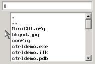
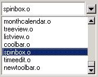
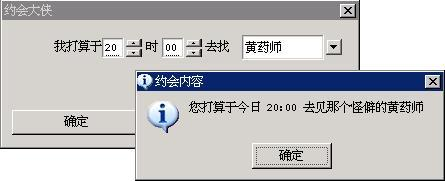

# 组合框

从本质上讲，通常的组合框就是编辑框和列表框的组合。用户可以直接在编辑框中键入文本，也可以从列表框列出的可选项中选择一个已有的条目。MiniGUI 中的组合框可以划分为三种类型：简单组合框、下拉式组合框、旋钮组合框和旋钮数字框。使用下拉式组合框还有一个好处，即能够减少因为使用列表框而带来的对窗口的空间占用。

以 `CTRL_COMBOBOX` 为控件类名调用 `CreateWindow` 函数，即可创建组合框控件。

## 1.1 组合框的类型和风格

### 1.1.1 简单组合框、下拉式组合框以及旋钮组合框

将组合框的风格设置为 `CBS_SIMPLE`，即可创建一个简单组合框。简单组合框中的列表框会一直显示在编辑框下面。当用户在列表框中选择某个条目时，就会用该条目的文本填充编辑框，如__图 1.1__ 所示。


__图 1.1__ 简单组合框


使用组合框风格 `CBS_DROPDOWNLIST`，可创建下拉式组合框。下拉式组合框与简单组合框不同的是，常态下，组合框只在矩形区域内显示一个条目，在条目内容的右边有一个指向下方的图标，当鼠标点击该图标时，会弹出一个列表框来显示更多的内容。__图 1.2__ 给出了下拉式组合框在常态下的效果和下拉之后的效果。


__图 1.2__ 下拉式组合框

在调用 `CreateWindow` 函数创建简单组合框和下拉组合框时，应通过 `CreateWindow` 函数的 `dwAddData` 参数传递列表框的高度值，如下所示：

```c
hwnd4 = CreateWindow (CTRL_COMBOBOX,
"0",
WS_VISIBLE | CBS_SIMPLE | CBS_SORT | WS_TABSTOP,
IDC_BOX4,
10, 100, 180, 24,
parent, 100);  /* 指定 dwAddData 为 100，指定简单组合框的列表框高度为 100 */
```

旋钮组合框的行为和上面两类组合框有点较大的差别，但本质上仍然是编辑框和列表框的组合，只是旋钮组合框的列表框永远是隐藏的，我们可通过编辑框旁边的两个箭头按钮来选择列表框中的条目。使用 `CBS_SPINLIST` 类型风格就可以创建旋钮组合框，其效果见__图 1.3__。


__图 1.3__ 旋钮组合框

旋钮组合框还具有两种特殊的显示风格（如__图 1.4__ 所示）：

![旋钮组合框的特殊风格(figures/Part4Chapter05-1.4.jpeg)
__图 1.4__ 旋钮组合框的特殊风格

- `CBS_SPINARROW_TOPBOTTOM`： 箭头在内容的上下
- `CBS_SPINARROW_LEFTRIGHT`：箭头在内容的左右

因为上述这三种组合框在内部使用了 MiniGUI 预定义的编辑框和列表框，因此，组合框中也可以使用编辑框控件和列表框控件的类似风格：

- `CBS_READONLY`：使组合框的输入域成为只读区域，对应编辑框的 `ES_READONLY` 风格；
- `CBS_UPPERCASE`：对应编辑框的 `ES_UPPERCASE` 风格，使键入编辑框中的文本自动变成大写。
- `CBS_LOWERCASE`：对应编辑框的 `ES_LOWERCASE` 风格，使键入编辑框中的文本自动变成小写。
- `CBS_EDITBASELINE`：对应编辑框的 `ES_BASELINE` 风格，使编辑框带有文本基线。
- `CBS_SORT`：对应列表框的 `LBS_SORT` 风格。使用该风格的组合框将自动对插入的条目进行排序。

>【注意】尽管列表框还可以有其他高级类型，但组合框中的列表框仅仅是一个普通的单选列表框。

除上述风格之外，组合框还定义了如下两个风格，可用于所有的组合框类型：

- `CBS_EDITNOBORDER`：使编辑框不带 `WS_BORDER` 风格，使得输入域不带边框。
- `CBS_AUTOFOCUS`：组合框在获得输入焦点之后，编辑框将自动获得输入焦点。

### 1.1.2 旋钮数字框

旋钮数字框在外观上和旋钮组合框类似，但其中显示的是数字而不是列表框中的条目。这种类型的组合框可在许多场合使用。但因为所操作的是数字而不是任意的文本，因此其内部没有使用列表框。使用组合框的风格类型 `CBS_AUTOSPIN` 风格就可以创建旋钮数字框，如__图 1.5__ 所示。


__图 1.5__ 旋钮数字框

旋钮数字框只有一个风格，即 `CBS_AUTOLOOP`。使用该风格后，框中的数字将自动循环显示。也就是说，用户在单击向上箭头达到最大值之后，再次单击向上箭头，编辑框中的数字将变成最小值。旋钮数字框默认的最小值和最大值为 0 和 100，每次点击右侧的旋钮，数值的默认增减幅度为 1。

默认的最小值和最大值是 0 和 100，每次点击右侧的按钮数值的默认增减幅度为 1，点击 `pagedown` 或 `pageup` 默认的增减幅度为 5。

## 1.2 组合框消息

### 1.2.1 简单组合框、下拉式组合框以及旋钮组合框的消息

因为这三种组合框均含有列表框，因此，用于这三种组合框的消息基本上和列表框消息一一对应：

- `CB_ADDSTRING`：对应 `LB_ADDSTRING`，用来向内部列表框中添加条目。
- `CB_INSERTSTRING`：对应 `LB_INSERTSTRING`，用来向内部列表框中插入条目。
- `CB_DELETESTRING`：对应 `LB_DELETESTRING`，用来从内部列表框中删除条目。
- `CB_FINDSTRING`：对应 `LB_FINDSTRING`，用于模糊匹配列表框中的条目。
- `CB_FINDSTRINGEXACT`：对应 `LB_FINDSTRINGEXACT`，用于精确匹配列表框中的条目。
- `CB_GETCOUNT`：对应 `LB_GETCOUNT`，用于获取内部列表框中的条目个数。
- `CB_GETCURSEL`：对应 `LB_GETCURSEL`，用于获取内部列表框的当前选中项。
- `CB_SETCURSEL`：对应 `LB_SETCURSEL`，用于设置内部列表框的选中项。
- `CB_RESETCONTENT`：对应 `LB_RESETCONTENT`，用于清空内部列表框。
- `CB_GETITEMADDDATA`：对应 `LB_GETITEMADDDATA`，用于获取内部列表框条目的附加数据。
- `CB_SETITEMADDDATA`：对应 `LB_SETITEMADDDATA`，用于设置内部列表框条目的附加数据。
- `CB_GETITEMHEIGHT`：对应 `LB_GETITEMHEIGHT`，用于获取内部列表框条目的高度。
- `CB_SETITEMHEIGHT`：对应 `LB_SETITEMHEIGHT`，用于设置内部列表框条目的高度。
- `CB_SETSTRCMPFUNC`：对应 `LB_SETSTRCMPFUNC`，用于设置内部列表框排序用的字符串对比函数。
- `CB_GETLBTEXT`：对应 `LB_GETTEXT`，用于获取内部列表框条目的文本内容。
- `CB_GETLBTEXTLEN`：对应 `LB_GETTEXTLEN`，用于获得内部列表框条目的文本长度。
- `CB_GETCHILDREN`：获得组合框的子控件，`wParam` 返回编辑框控件指针，`lParam` 返回列表框控件指针。

组合框也提供了用于内部编辑框的消息：

- `CB_LIMITTEXT`：对应 `EM_LIMITTEXT` 消息，用于限制内部编辑框的文本长度。
- `CB_SETEDITSEL`：对应 `EM_SETSEL`，用来设置编辑框选中的文本。
- `CB_GETEDITSEL`：对应 `EM_GETSEL`，用来获取编辑框选中的文本。

关于上述这些消息的具体用法，读者可参阅第 21 章和第 22 章中对列表框消息及编辑框消息的描述。下面的两个消息可用于旋钮组合框：

- `CB_SPIN`：发送该消息将使旋钮框向前或向后步进，相当于用户单击编辑框旁边的向上或向下箭头（在编辑框中键入向上或向下箭头键，也可取得一样的效果）。`wParam` 控制步进方向，取 0 为向下，取 1 为向上。
- `CB_FASTSPIN`：发送该消息将使旋钮框快速向前步进，相当于用户在编辑框中键入` PageUp/PageDown` 键。`wParam` 控制步进方向，取 0 为向上，取 1 为向下。

下面两个消息可用于下拉式组合框：

- `CB_GETDROPPEDCONTROLRECT`：获得组合框的下拉列表对应矩形位置。
- `CB_GETDROPPEDSTATE`：检查组合框的下拉列表是否为显示状态。

### 1.2.2 旋钮数字框的消息

旋钮数字框可接受的消息如下：

- `CB_GETSPINRANGE`：获得可取的最大值和最小值，它们分别存储在 `wParam` 参数和 `lParam` 参数指向的地址中。
- `CB_SETSPINRANGE`：设定可取的最大值和最小值，分别取 `wParam` 参数和 `lParam` 参数的值。
- `CB_SETSPINVALUE`：参数设置编辑框的当前数值，通过 `wParam` 参数传递要设置的值。
- `CB_GETSPINVALUE`：该消息返回当前编辑框内的数值。
- `CB_SPIN`：发送该消息将使旋钮框向前或向后步进，相当于用户单击编辑框旁边的向上或向下箭头（在编辑框中键入向上或向下箭头键，也可取得一样的效果）。`wParam` 控制步进方向，取 1 为向上，取 0 为向下。步进值取决于 `CB_SETSPINPACE` 的设置值。
- `CB_FASTSPIN`：发送该消息将使旋钮框快速向前步进，相当于用户在编辑框中键入 `PageUp/PageDown` 键。`wParam` 控制步进方向，取 0 为向上，取 1 为向下。步进值取决于 `CB_SETSPINPACE` 的设置值。
- `CB_GETSPINPACE`：获得步进值（`wParam`）和快速步进值（`lParam`）。
- `CB_SETSPINPACE`：设置步进值（`wParam`）和快速步进值（`lParam`）。
- `CB_SETSPINFORMAT`：设定整数的格式化字符串。MiniGUI 在内部使用 `sprintf` 和 `sscanf` 函数在编辑框的文本字符串和整数值之间互相转换。设定格式化字符串之后，MiniGUI 在调用 `sprintf` 和 `sscanf` 函数时将使用这个格式化字符串，使之具有特定的显示格式。

## 1.3 组合框通知码

当组合框具有 `CBS_NOTIFY` 风格时，将可能产生通知消息。组合框通知消息的通知码基本上是列表框通知码和编辑框通知码的组合，如下所列：

- `CBN_ERRSPACE`：内存不足
- `CBN_SELCHANGE`：条目选择变化
- `CBN_EDITCHANGE`：方框区域的文本发生了变化
- `CBN_DBLCLK`：用户双击了组合框中的某个条目
- `CBN_CLICKED`：用户点击了组合框
- `CBN_SETFOCUS`：组合框获得了输入焦点。如果组合框具有 `CBS_AUTOFOCUS` 风格，则内部编辑框将同时获得输入焦点。
- `CBN_KILLFOCUS`：组合框失去了输入焦点。
- `CBN_DROPDOWN`：用户下拉列表框使之显示。当用户点击编辑框旁边的向下箭头按钮或者在编辑框中键入光标控制键，比如向下、向上箭头键，`PageDown` 或者 `PageUp` 等键时，也会下拉并显示列表框。
- `CBN_CLOSEUP`：下拉的列表框被隐藏（关闭）。
- `CBN_SELENDOK`：用户从下拉列表框中选择了某个条目。
- `CBN_SELENDCANCEL`：用户未选择任何条目而关闭下拉列表框。

## 1.4 编程实例

清单 1.1 的程序给出了组合框的一个编程实例。该程序用旋钮数字框组成了一个时间选择框，然后用下拉列表框提供了要约会的朋友列表。在按“确定”时，程序使用 `MessageBox` 显示用户所做的选择。该程序的完整源代码可见本指南示例程序包 `mg-samples` 中的 `combobox.c` 文件，运行效果见__图 1.6__。

__清单 1.1__ 组合框编程实例

```c
#include <stdio.h>

#include <minigui/common.h>
#include <minigui/minigui.h>
#include <minigui/gdi.h>
#include <minigui/window.h>
#include <minigui/control.h>

#define IDC_HOUR   100
#define IDC_MINUTE 110
#define IDC_SECOND 120
#define IDL_DAXIA  200

#define IDC_PROMPT 300

/* 定义对话框模板 */
static DLGTEMPLATE DlgMyDate =
{
        WS_BORDER | WS_CAPTION,
        WS_EX_NONE,
        100, 100, 304, 135,
        "约会大侠",
        0, 0,
        9, NULL,
        0
};

static CTRLDATA CtrlMyDate[] =
{ 
        {
                "static",
                WS_CHILD | SS_RIGHT | WS_VISIBLE,
                10, 20, 50, 20,
                IDC_STATIC,
                "我打算于",
                0
        },
        /* 用来显示小时的旋钮数字框 */
        {
                CTRL_COMBOBOX,
                WS_CHILD | WS_VISIBLE | 
                CBS_READONLY | CBS_AUTOSPIN | CBS_AUTOLOOP | CBS_EDITBASELINE,
                60, 18, 40, 20,
                IDC_HOUR, 
                "",
                0
        },
        {
                "static",
                WS_CHILD | SS_CENTER | WS_VISIBLE,
                100, 20, 20, 20,
                IDC_STATIC,
                "时",
                0
        },
        /* 用来显示分钟的旋钮数字框 */
        {
                CTRL_COMBOBOX,
                WS_CHILD | WS_VISIBLE | 
                CBS_READONLY | CBS_AUTOSPIN | CBS_AUTOLOOP | CBS_EDITBASELINE,
                120, 18, 40, 20,
                IDC_MINUTE,
                "",
                0
        },
        {
                "static",
                WS_CHILD | SS_CENTER | WS_VISIBLE,
                160, 20, 30, 20,
                IDC_STATIC,
                "去找",
                0
        },
        /* 列各位大侠的大名 */
        {
                CTRL_COMBOBOX,
                WS_VISIBLE | CBS_DROPDOWNLIST | CBS_NOTIFY,
                190, 20, 100, 20,
                IDL_DAXIA,
                "",
                80
        },
        /* 显示大侠特点 */
        {
                "static",
                WS_CHILD | SS_RIGHT | WS_VISIBLE,
                10, 50, 280, 20,
                IDC_PROMPT,
                "This is",
                0
        },
        {
                CTRL_BUTTON,
                WS_VISIBLE | BS_DEFPUSHBUTTON | WS_TABSTOP | WS_GROUP,
                10, 70, 130, 25,
                IDOK, 
                "确定",
                0
        },
        {
                "button",
                WS_VISIBLE | BS_PUSHBUTTON | WS_TABSTOP,
                150, 70, 130, 25,
                IDCANCEL,
                "取消",
                0
        },
};

static const char* daxia [] =
{
        "黄药师",
        "欧阳锋",
        "段皇爷",
        "洪七公",
        "周伯通",
        "郭靖",
        "黄蓉",
};

static const char* daxia_char [] =
{
        "怪僻",
        "恶毒",
        "假慈悲",
        "一身正气",
        "调皮，不负责任",
        "傻乎乎",
        "乖巧",
};

static void daxia_notif_proc (HWND hwnd, int id, int nc, DWORD add_data)
{
        if (nc == CBN_SELCHANGE) {
                /* 根据当前选择的大侠，显示对应的性格特点 */
                int cur_sel = SendMessage (hwnd, CB_GETCURSEL, 0, 0);
                if (cur_sel >= 0) {
                        SetWindowText (GetDlgItem (GetParent(hwnd), IDC_PROMPT), daxia_char [cur_sel]);
                }
        }
}

static void prompt (HWND hDlg)
{
        char date [1024];
        
        /* 总结约会内容 */
        int hour = SendDlgItemMessage(hDlg, IDC_HOUR, CB_GETSPINVALUE, 0, 0);
        int min = SendDlgItemMessage(hDlg, IDC_MINUTE, CB_GETSPINVALUE, 0, 0);
        int sel = SendDlgItemMessage(hDlg, IDL_DAXIA, CB_GETCURSEL, 0, 0);
        
        sprintf (date, "你打算于今日 %02d:%02d 去见那个%s的%s", hour, min, 
        daxia_char [sel], daxia [sel]);
        
        MessageBox (hDlg, date, "约会内容", MB_OK | MB_ICONINFORMATION);
}

static int MyDateBoxProc (HWND hDlg, int message, WPARAM wParam, LPARAM lParam)
{
        int i;
        switch (message) {
                case MSG_INITDIALOG:
                /* 设定小时旋钮框的范围在 0~23，数字以 %02d 的格式显示 */
                SendDlgItemMessage(hDlg, IDC_HOUR, CB_SETSPINRANGE, 0, 23);
                SendDlgItemMessage(hDlg, IDC_HOUR, CB_SETSPINFORMAT, 0, (LPARAM)"%02d");
                /* 设定当前值为 20 */
                SendDlgItemMessage(hDlg, IDC_HOUR, CB_SETSPINVALUE, 20, 0);
                /* 设定步进值和快速步进值均为 1 */
                SendDlgItemMessage(hDlg, IDC_HOUR, CB_SETSPINPACE, 1, 1);
                
                /* 设定小时旋钮框的范围在 0~59，数字以 %02d 的格式显示 */
                SendDlgItemMessage(hDlg, IDC_MINUTE, CB_SETSPINRANGE, 0, 59);
                SendDlgItemMessage(hDlg, IDC_MINUTE, CB_SETSPINFORMAT, 0, (LPARAM)"%02d");
                /* 设定当前值为 0 */
                SendDlgItemMessage(hDlg, IDC_MINUTE, CB_SETSPINVALUE, 0, 0);
                /* 设定步进值为 1，快速步进值为 2 */
                SendDlgItemMessage(hDlg, IDC_MINUTE, CB_SETSPINPACE, 1, 2);
                
                /* 加入各位大侠的名字 */
                for (i = 0; i < 7; i++) {
                        SendDlgItemMessage(hDlg, IDL_DAXIA, CB_ADDSTRING, 0, (LPARAM)daxia [i]);
                }
                
                /* 设定通知回调函数 */
                SetNotificationCallback (GetDlgItem (hDlg, IDL_DAXIA), daxia_notif_proc);
                /* 设定大侠名字和性格特点的初始值 */
                SendDlgItemMessage(hDlg, IDL_DAXIA, CB_SETCURSEL, 0, 0);
                SetWindowText (GetDlgItem (hDlg, IDC_PROMPT), daxia_char [0]);
                return 1;
                
                case MSG_COMMAND:
                switch (wParam) {
                        case IDOK:
                        /* 显示当前选择 */
                        prompt (hDlg);
                        case IDCANCEL:
                        EndDialog (hDlg, wParam);
                        break;
                }
                break;
                
        }
        
        return DefaultDialogProc (hDlg, message, wParam, lParam);
}

int MiniGUIMain (int argc, const char* argv[])
{
        #ifdef _ MGRM_PROCESSES
        JoinLayer(NAME_DEF_LAYER , "combobox" , 0 , 0);
        #endif
        
        DlgMyDate.controls = CtrlMyDate;
        
        DialogBoxIndirectParam (&DlgMyDate, HWND_DESKTOP, MyDateBoxProc, 0L);
        
        return 0;
}

#ifndef _ MGRM_PROCESSES
#include <minigui/dti.c>
#endif
```


__图 1.6__ 组合框示例程序的运行效果
