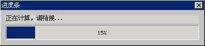

# 25 进度条

进度条通常用来为用户提示某项任务的完成进度，经常用于文件复制、软件安装等程序中。以 `CTRL_PROGRESSBAR` 为控件类名调用 `CreateWindow` 函数，即可创建进度条。__图 1.1__ 是进度条的典型运行效果。


__图 1.1__  进度条控件

## 1.1 进度条风格

进度条的可用风格不多，只有如下两个：

- `PBS_NOTIFY`：使用该风格的进度条控件会产生通知消息。
- `PBS_VERTICAL`：竖直显示进度条，如__图 1.2__ 所示。


__图 1.2__  竖直进度条

进度条控件常用的风格组合是：

```c
WS_CHILD | WS_VISIBLE | PBS_NOTIFY
```

## 1.2 进度条消息

### 1.2.1 设置进度条的范围

默认情况下的进度条范围是 0 到 100，应用程序也可以设定自己的进度条范围，这时可调用 `PBM_SETRANGE` 消息：

```c
SendMessage (hwndEdit, PBM_SETRANGE, min, max) ;
```

>【提示】进度条的范围可以设置为负值。

### 1.2.2 设置步进长度

我们可以为进度条设置步进长度，然后在每完成一个阶段性任务时，使进度条步进。默认的进度条步进值是 10，发送 `PBM_SETSTEP` 可改变默认值。如下所示：

```c
SendMessage (hwndEdit, PBM_SETSTEP, 5, 0) ;
```

上面的消息调用把进度条步进值修改为 5。

>【提示】进度条的步进值可以设置为负值。

当进度条的步进值为负值时，需要设置进度条的位置为进度条范围的最大值。这样进度条在显示时才是从进度条范围的最大值减小到进度条范围的最小值。

### 1.2.3 设置进度条位置

我们也可以随意设置进度条的当前进度——使用 `PBM_SETPOS` 消息：

```c
SendMessage (hwndEdit, PBM_SETPOS, 50, 0) ;
```

上面的消息调用把进度条的当前进度设定为 50。

### 1.2.4 在当前进度基础上偏移

我们也可以设定新进度在当前进度基础上的偏移量，从而改变进度值：

```c
SendMessage (hwndEdit, PBM_DELTAPOS, 10, 0) ;
```

上面的消息调用将使新进度在当前进度的基础上加 10，即新进度等于当前进度加 10。

>【提示】偏移量可以设置为负值。

### 1.2.5 使进度条前进一个步进值

可发送 `PBM_STEPIT` 使进度步进，新的进度将等于当前进度加步进值的结果。

```c
SendMessage (hwndEdit, PBM_STEPIT, 0, 0) ;
```

>【注意】当前的进度条控件未提供任何获取当前进度、当前步进值、当前进度范围的消息。

## 1.3 进度条通知码

如果进度条具有 `PBS_NOTIFY` 风格，则可能产生如下通知消息：
- `PBN_REACHMAX`：已到达最大进度位置。
- `PBN_REACHMIN`：已到达最小进度位置。

## 1.4 编程实例

__清单 1.1__ 给出了使用进度条控件的实例。该程序提供了两个函数，调用 `createProgressWin` 函数将创建一个含有进度条的主窗口并返回，我们可以在自己的程序中对这个主窗口中的进度条进行控制，并在完成任务之后调用 `destroyProgressWin` 函数销毁进度主窗口。这两个函数实际来自 MiniGUI 的 `MiniGUIExt` 库。__清单 1.1__ 给出了这两个函数的实现以及调用示例，其运行效果见__图 1.3__。该程序的完整源代码见本指南示例程序包 `mg-samples` 中的 `progressbar.c`。

__清单 1.1__  使用进度条控件的实例

```c
#include <stdio.h>
#include <stdlib.h>
#include <stdarg.h>
#include <string.h>
#include <sys/stat.h>
#include <sys/time.h>
#include <sys/types.h>
#include <unistd.h>
#include <errno.h>

#include <minigui/common.h>
#include <minigui/minigui.h>
#include <minigui/gdi.h>
#include <minigui/window.h>
#include <minigui/control.h>

static HWND createProgressWin (HWND hParentWnd, char * title, char * label,
int id, int range)
{
        HWND hwnd;
        MAINWINCREATE CreateInfo;
        int ww, wh;
        HWND hStatic, hProgBar;
        
        /* 根据窗口客户区宽度计算窗口宽度 */
        ww = ClientWidthToWindowWidth (WS_CAPTION | WS_BORDER, 400);
        /* 根据窗口客户区高度计算窗口高度 */
        wh = ClientHeightToWindowHeight (WS_CAPTION | WS_BORDER, 
        (range > 0) ? 70 : 35, FALSE);
        
        /* 创建主窗口 */
        CreateInfo.dwStyle = WS_ABSSCRPOS | WS_CAPTION | WS_BORDER | WS_VISIBLE;
        CreateInfo.dwExStyle = WS_EX_NONE;
        CreateInfo.spCaption = title;
        CreateInfo.hMenu = 0;
        CreateInfo.hCursor = GetSystemCursor(IDC_WAIT);
        CreateInfo.hIcon = 0;
        /* 该主窗口的窗口过程取默认的主窗口过程 */
        CreateInfo.MainWindowProc = DefaultMainWinProc;
        #ifndef _LITE_VERSION
        CreateInfo.lx = (GetGDCapability (HDC_SCREEN, GDCAP_MAXX) - ww) >> 1;
        CreateInfo.ty = (GetGDCapability (HDC_SCREEN, GDCAP_MAXY) - wh) >> 1;
        #else
        CreateInfo.lx = g_rcExcluded.left + (RECTW(g_rcExcluded) - ww) >> 1;
        CreateInfo.ty = g_rcExcluded.top + (RECTH(g_rcExcluded) - wh) >> 1;
        #endif
        CreateInfo.rx = CreateInfo.lx + ww;
        CreateInfo.by = CreateInfo.ty + wh;
        CreateInfo.iBkColor = COLOR_lightgray;
        CreateInfo.dwAddData = 0L;
        CreateInfo.hHosting = hParentWnd;
        
        hwnd = CreateMainWindow (&CreateInfo);
        if (hwnd == HWND_INVALID)
        return hwnd;
        
        /* 在主窗口中创建提示用静态框控件 */
        hStatic = CreateWindowEx ("static", 
        label, 
        WS_VISIBLE | SS_SIMPLE, 
        WS_EX_USEPARENTCURSOR,
        IDC_STATIC, 
        10, 10, 380, 16, hwnd, 0);
        
        /* 在主窗口中创建进度条控件 */
        if (range > 0) {
                hProgBar = CreateWindowEx ("progressbar", 
                NULL, 
                WS_VISIBLE,
                WS_EX_USEPARENTCURSOR,
                id,
                10, 30, 380, 30, hwnd, 0);
                SendDlgItemMessage (hwnd, id, PBM_SETRANGE, 0, range);
        }
        else
        hProgBar = HWND_INVALID;
        
        /* 更新控件 */
        UpdateWindow (hwnd, TRUE);
        
        /* 返回主窗口句柄 */
        return hwnd;
}

static void destroyProgressWin (HWND hwnd)
{
        /* 销毁控件以及主窗口 */
        DestroyAllControls (hwnd);
        DestroyMainWindow (hwnd);
        ThrowAwayMessages (hwnd);
        MainWindowThreadCleanup (hwnd);
}

int MiniGUIMain (int argc, const char* argv[])
{
        int i, sum;
        HCURSOR hOldCursor;
        HWND hwnd;
        
        #ifdef _MGRM_PROCESSES
        JoinLayer(NAME_DEF_LAYER , "progressbar" , 0 , 0);
        #endif
        
        /* 设置“沙漏”鼠标，以表示系统正忙 */
        hOldCursor = SetDefaultCursor (GetSystemCursor (IDC_WAIT));
        
        /* 创建进度条窗口，指定进度条控件的标识符和范围值 */
        hwnd = createProgressWin (HWND_DESKTOP, "进度条",
        "正在计算，请稍候...", 100, 2000);
        
        while (HavePendingMessage (hwnd)) {
                MSG msg;
                GetMessage (&msg, hwnd);
                DispatchMessage (&msg);
        }
        
        /* 进入长时计算过程，完成大循环时更新进度条控件的位置 */
        for (i = 0; i < 2000; i++) {
                unsigned long j;
                
                if (i % 100 == 0) {
                        SendDlgItemMessage (hwnd, 100, PBM_SETPOS, i, 0L);
                        while (HavePendingMessage (hwnd)) {
                                MSG msg;
                                GetMessage (&msg, hwnd);
                                DispatchMessage (&msg);
                        }
                }
                
                sum = i*5000;
                for (j = 0; j < 500000; j++)
                sum *= j;
                sum += sum;
        }
        
        /* 销毁进度条窗口 */
        destroyProgressWin (hwnd);
        /* 恢复原有鼠标 */
        SetDefaultCursor (hOldCursor);
        
        return 0;
}

#ifndef _MGRM_PROCESSES
#include <minigui/dti.c>
#endif
```


__图 1.3__  进度条控件示例程序
