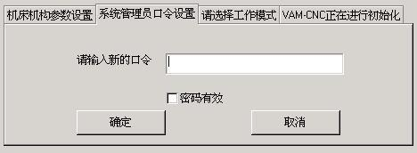
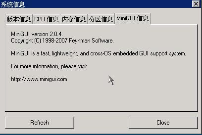

# 28 属性表


属性表最常见的用途就是将本该属于不同对话框的交互内容分门别类放在同一对话框中，一方面节省了对话框空间，另一方面也使得交互界面更加容易使用。__图 1.1__ 就是 MiniGUI 属性表控件的一种典型用法。


__图 1.1__  属性页控件

属性表由一个个的属性页组成，每个属性页有一个凸舌，我们可以单击凸舌，在不同的属性页之间切换。我们可以将属性页理解为一种容器控件，其中可以容纳其他的控件。从应用程序开发者的角度看，我们又可以将属性页理解为对话框中的对话框——每个属性页都有自己的窗口过程，我们通常使用类似建立对话框那样的方法，即定义对话框模板的方法向属性表中添加属性页。

在应用程序中，使用 `CTRL_PROPSHEET` 控件类名称调用 `CreateWindow` 函数，即可创建属性页。

## 1.1 属性表风格

目前属性表有以下四种风格，用来控制属性页凸舌的宽度和显示位置：

- `PSS_SIMPLE`：所有的属性页凸舌具有相同的宽度。
- `PSS_COMPACTTAB`：属性页凸舌的宽度取决于属性页标题文本的长度。
- `PSS_SCROLLABLE`：属性页凸舌的宽度取决于属性页标题文本的长度，当属性页凸舌的数目过多时，将自动出现左右箭头用来调节当前可见的属性页凸舌。
- `PSS_BOTTOM`：属性页凸舌显示在属性表的下方，可以和上面三种风格同时配合使用。

## 1.2 属性表消息

### 1.2.1 添加属性页

在创建了属性表控件之后，就可以发送 `PSM_ADDPAGE` 消息向属性表中添加属性页。该消息的 `wParam` 用来传递对话框模板，`lParam` 用来传递属性页的窗口过程函数。如下所示：

```c
HWND pshwnd = GetDlgItem (hDlg, IDC_PROPSHEET);

/* 准备对话框模板 */
DlgStructParams.controls = CtrlStructParams;

/* 添加属性页 */
SendMessage (pshwnd, PSM_ADDPAGE,
(WPARAM)&DlgStructParams, (LPARAM)PageProc1);
```

该消息的返回值是新添加的属性页的索引值，以零为基。

### 1.2.2 属性页过程函数

和对话框类似，每个属性页有自己的属性页过程函数，用来处理该属性页相关的消息。该过程函数的原型和普通的窗口过程函数一样，但有如下不同：

- 属性页的过程函数应该为需要进行默认处理的消息调用 `DefaultPageProc` 函数。
- 属性页过程函数需要处理两个属性页特有的消息：`MSG_INITPAGE` 和 `MSG_SHOWPAGE`。前者类似对话框的 `MSG_INITDIALOG` 消息；后者在属性页被隐藏和重新显示时发送到属性页过程中，`lParam` 参数分别取 `SW_HIDE` 和 `SW_SHOW`。在显示该属性页时，属性页过程函数返回 1 将置第一个具有 `WS_TABSTOP` 的控件具有输入焦点。
- 给属性表控件发送 `PSM_SHEETCMD` 消息时，属性表控件将向其拥有的所有属性页广播 `MSG_SHEETCMD` 消息。属性页可以在这时检查用户输入的有效性并保存有效输入，如果输入无效或出现其他问题，可以返回 –1 来终止该消息的继续传播。在收到任意一个属性页返回的非零值之后，属性表控件将使 `PSM_SHEETCMD` 消息返回非零值，该值是属性页索引值加一之后的值。这样，我们就可以在属性表所在对话框的处理中了解哪个属性页中含有无效输入，然后终止继续处理，并切换到该属性页。

__清单 1.1__ 给出了一个典型的属性页过程函数，以及属性表所在对话框的过程函数。当用户单击了属性表所在对话框的“确定”按钮之后，对话框向属性表控件发送 `PSM_SHEETCMD` 消息，并根据该消息的返回值来决定下一步正常关闭对话框还是切换到某个属性页修正无效输入。属性页的过程函数在收到 `MSG_SHEETCMD` 消息之后，会判断用户的输入是否有效，并相应返回 0 或者 –1。

__清单 1.1__  典型的属性页过程函数以及属性表所在对话框的过程函数

```c
static int PageProc1 (HWND hDlg, int message, WPARAM wParam, LPARAM lParam)
{
        switch (message) {
                case MSG_INITPAGE:
                break;
                
                case MSG_SHOWPAGE:
                return 1;
                
                case MSG_SHEETCMD:
                if (wParam == IDOK) {
                        char buffer [20];
                        GetDlgItemText (hDlg, IDC_EDIT1, buffer, 18);
                        buffer [18] = '\0';
                        
                        /* 在用户按下属性表所在对话框中的“确定”按钮时，判断用户输入是否有效 */
                        if (buffer [0] == '\0') {
                                MessageBox (hDlg, 
                                "Please input something in the first edit box.", 
                                "Warning!", 
                                MB_OK | MB_ICONEXCLAMATION | MB_BASEDONPARENT);
                                /* 用户输入无效，返回非零值 */
                                return -1;
                        }
                }
                return 0;
                
                case MSG_COMMAND:
                switch (wParam) {
                        case IDOK:
                        case IDCANCEL:
                        break;
                }
                break;
        }
        
        return DefaultPageProc (hDlg, message, wParam, lParam);
}

static int PropSheetProc (HWND hDlg, int message, WPARAM wParam, LPARAM lParam)
{
        switch (message) {
                case MSG_INITDIALOG:
                {
                        HWND pshwnd = GetDlgItem (hDlg, IDC_PROPSHEET);
                        
                        /* 向属性表控件中添加属性页 */
                        
                        DlgStructParams.controls = CtrlStructParams;
                        SendMessage (pshwnd, PSM_ADDPAGE,
                        (WPARAM)&DlgStructParams, (LPARAM)PageProc1);
                        
                        DlgPassword.controls = CtrlPassword;
                        SendMessage ( pshwnd, PSM_ADDPAGE, 
                        (WPARAM)&DlgPassword,(LPARAM) PageProc2);
                        
                        DlgStartupMode.controls = CtrlStartupMode;
                        SendMessage ( pshwnd, PSM_ADDPAGE, 
                        (WPARAM)&DlgStartupMode,(LPARAM)PageProc3);
                        
                        DlgInitProgress.controls = CtrlInitProgress;
                        SendMessage ( pshwnd, PSM_ADDPAGE, 
                        (WPARAM)&DlgInitProgress, (LPARAM) PageProc4);
                        
                        break;
                }
                
                case MSG_COMMAND:
                switch (wParam) 
                {
                        case IDC_APPLY:
                        break;
                        
                        case IDOK:
                        {
                                /* 向属性表控件发送 PSM_SHEETCMD 消息，通知它“确定”按钮被按下 */
                                int index = SendDlgItemMessage (hDlg, IDC_PROPSHEET, 
                                PSM_SHEETCMD, IDOK, 0);
                                if (index) {
                                        /* 某个属性页返回了非零值，切换到这个属性页提示继续输入 */
                                        SendDlgItemMessage (hDlg, IDC_PROPSHEET, 
                                        PSM_SETACTIVEINDEX, index - 1, 0);
                                }
                                else 
                                /* 一切正常，关闭对话框 */
                                EndDialog (hDlg, wParam);
                                
                                break;
                        }
                        case IDCANCEL:
                        EndDialog (hDlg, wParam);
                        break;
                }
                break;
        }
        
        return DefaultDialogProc (hDlg, message, wParam, lParam);
}
```

### 1.2.3 删除属性页

要删除某个属性页，只需向属性表控件发送 `PSM_REMOVEPAGE` 消息，并在 `wParam` 中传递要删除的属性页索引即可：

```c
SendDlgItemMessage (hDlg, IDC_PROPSHEET, PSM_REMOVEPAGE, 0, 0);
```

该消息调用将删除属性表中的第一个属性页。

>【注意】删除一个属性页可能会改变其他属性页的索引值。

### 1.2.4 属性页句柄和索引

属性页句柄实际就是属性页中控件父窗口的句柄，也就是属性页过程函数传入的窗口句柄，而这个窗口实质上是属性表控件的一个子窗口。向属性表控件发送 `PSM_GETPAGE` 消息可获得具有某个索引值的属性页的窗口句柄：

```c
hwnd = SendDlgItemMessage (hDlg, IDC_PROPSHEET, PSM_GETPAGE, index, 0);
```

该消息调用将返回索引值为 `index` 的属性页的窗口句柄。而下面的消息调用根据属性页句柄返回属性页索引值：

```c
index = SendDlgItemMessage (hDlg, IDC_PROPSHEET, PSM_GETPAGEINDEX, hwnd, 0);
```

获得属性页的窗口句柄之后，我们可以方便地调用 `CreateWindow` 等函数向其中添加新的控件。当然，在属性页的过程函数中也可以完成类似任务。

### 1.2.5 属性页的相关操作

MiniGUI 提供了如下消息可用来获得属性页相关信息：

- `PSM_GETPAGECOUNT`：返回属性页总个数。
- `PSM_GETTITLELENGTH`：根据 `wParam` 参数传入的属性页索引值获得该属性页标题的长度，类似窗口的 `MSG_GETTEXTLENGTH` 消息。
- `PSM_GETTITLE`：根据 `wParam` 参数传入的属性页索引值获得该属性页标题，并保存在 `lParam` 参数传递的缓冲区中，类似窗口的 `MSG_GETTEXT` 消息。
- `PSM_SETTITLE`：根据 `lParam` 参数传入的文本字符串设置由 `wParam` 指定的属性页标题，类似窗口的 `MSG_SETTEXT` 消息。

活动属性页是指显示在属性表中的那个属性页，每次只会有一个属性页显示在属性表中。MiniGUI 提供了如下消息用来操作活动属性页：

- `PSM_GETACTIVEPAGE`：返回活动属性页的窗口句柄。
- `PSM_GETACTIVEINDEX`：返回活动属性页的索引值。
- `PSM_SETACTIVEINDEX`：根据 `wParam` 传入的属性页索引值设置活动属性页。

## 1.3 属性表通知码

目前只有一个属性表控件的通知码：

- `PSN_ACTIVE_CHANGED`：当属性表中的活动属性页发生变化时，属性表控件将产生该通知消息。

## 1.4 编程实例

__清单 1.2__ 给出了属性表控件的编程实例。该程序显示了本机的一些系统信息，比如 CPU 类型、内存大小等等。该程序的运行效果见__图 1.2__，完成的源代码见本指南示例程序包 `mg-samples` 中的 `propsheet.c` 程序。

__清单 1.2__  属性表控件的编程实例

```c
#include <stdio.h>
#include <stdlib.h>
#include <string.h>

#include <minigui/common.h>
#include <minigui/minigui.h>
#include <minigui/gdi.h>
#include <minigui/window.h>
#include <minigui/control.h>

#define PAGE_VERSION    1
#define PAGE_CPU        2
#define PAGE_MEMINFO    3
#define PAGE_PARTITION  4
#define PAGE_MINIGUI    5

#define IDC_PROPSHEET   100

#define IDC_SYSINFO     100

/* 定义系统信息属性页的模板 */
static DLGTEMPLATE PageSysInfo =
{
        WS_NONE,
        WS_EX_NONE,
        0, 0, 0, 0,
        "",
        0, 0,
        1, NULL,
        0
};

/*系统信息属性页中只有一个用来显示信息的静态控件 */
static CTRLDATA CtrlSysInfo [] =
{ 
        {
                CTRL_STATIC,
                WS_VISIBLE | SS_LEFT, 
                10, 10, 370, 160,
                IDC_SYSINFO,
                "测试\n测试\n测试\n测试\n测试\n测试\n",
                0
        }
};

/* 从指定文件中读取系统信息 */
static size_t read_sysinfo (const char* file, char* buff, size_t buf_len)
{
        size_t size;
        FILE* fp = fopen (file, "r");
        
        if (fp == NULL) return 0;
        
        size = fread (buff, 1, buf_len, fp);
        
        fclose (fp);
        return size;
}

#define BUF_LEN 10240

/*
* 初始化和刷新时调用该函数刷新对应的窗口。
* 注意，这个函数被所有的属性页调用。
*/
static void get_systeminfo (HWND hDlg)
{
        int type;
        HWND hwnd;
        char buff [BUF_LEN + 1];
        size_t size = 0;
        
        /* 根据 type 判断是哪个属性页 */
        type = (int)GetWindowAdditionalData (hDlg);
        
        /* 获取属性页中静态框的句柄 */
        hwnd = GetDlgItem (hDlg, IDC_SYSINFO);
        
        buff [BUF_LEN] = 0;
        switch (type) {
                case PAGE_VERSION:
                size = read_sysinfo ("/proc/version", buff, BUF_LEN);
                buff [size] = 0;
                break;
                
                case PAGE_CPU:
                size = read_sysinfo ("/proc/cpuinfo", buff, BUF_LEN);
                buff [size] = 0;
                break;
                
                case PAGE_MEMINFO:
                size = read_sysinfo ("/proc/meminfo", buff, BUF_LEN);
                buff [size] = 0;
                break;
                
                case PAGE_PARTITION:
                size = read_sysinfo ("/proc/partitions", buff, BUF_LEN);
                buff [size] = 0;
                break;
                
                case PAGE_MINIGUI:
                size = snprintf (buff, BUF_LEN,
                "MiniGUI version %d.%d.%d.\n"
                "Copyright (C) 1998-2003 Feynman Software and others.\n\n"
                "MiniGUI is free software, covered by the GNU General Public License, "
                "and you are welcome to change it and/or distribute copies of it “
                “under certain conditions. "
                "Please visit\n\n"
                "http://www.minigui.org\n\n"
                "to know the details.\n\n"
                "There is absolutely no warranty for MiniGUI.",
                MINIGUI_MAJOR_VERSION, MINIGUI_MINOR_VERSION, MINIGUI_MICRO_VERSION);
                break;
        }
        
        if (size) {
                SetWindowText (hwnd, buff);
        }
}

/* 所有的属性页使用同一个窗口过程函数 */
static int SysInfoPageProc (HWND hDlg, int message, WPARAM wParam, LPARAM lParam)
{
        switch (message) {
                case MSG_INITPAGE:
                /* 获取属性页中静态框的句柄 */
                get_systeminfo (hDlg);
                break;
                
                case MSG_SHOWPAGE:
                return 1;
                
                case MSG_SHEETCMD:
                if (wParam == IDOK) 
                /* 用户单击对话框中的“刷新”按钮时，将调用该函数刷新 */
                get_systeminfo (hDlg);
                return 0;
        }
        
        return DefaultPageProc (hDlg, message, wParam, lParam);
}

static int PropSheetProc (HWND hDlg, int message, WPARAM wParam, LPARAM lParam)
{
        switch (message) {
                case MSG_INITDIALOG:
                {
                        HWND pshwnd = GetDlgItem (hDlg, IDC_PROPSHEET);
                        
                        PageSysInfo.controls = CtrlSysInfo;
                        
                        /* 添加属性页，注意每个属性页具有不同的附加数据 */
                        
                        PageSysInfo.caption = "版本信息";
                        PageSysInfo.dwAddData = PAGE_VERSION;
                        SendMessage (pshwnd, PSM_ADDPAGE, (WPARAM)&PageSysInfo, (LPARAM)SysInfoPageProc);
                        PageSysInfo.caption = "CPU 信息";
                        PageSysInfo.dwAddData = PAGE_CPU;
                        SendMessage (pshwnd, PSM_ADDPAGE, (WPARAM)&PageSysInfo, (LPARAM)SysInfoPageProc);
                        
                        PageSysInfo.caption = "内存信息";
                        PageSysInfo.dwAddData = PAGE_MEMINFO;
                        SendMessage (pshwnd, PSM_ADDPAGE, (WPARAM)&PageSysInfo, (LPARAM)SysInfoPageProc);
                        
                        PageSysInfo.caption = "分区信息";
                        PageSysInfo.dwAddData = PAGE_PARTITION;
                        SendMessage (pshwnd, PSM_ADDPAGE, (WPARAM)&PageSysInfo, (LPARAM)SysInfoPageProc);
                        
                        PageSysInfo.caption = "MiniGUI 信息";
                        PageSysInfo.dwAddData = PAGE_MINIGUI;
                        SendMessage (pshwnd, PSM_ADDPAGE, (WPARAM)&PageSysInfo, (LPARAM)SysInfoPageProc);
                        break;
                }
                
                case MSG_COMMAND:
                switch (wParam) {
                        case IDOK:
                        /* 用户按“刷新”按钮时，向所有属性表控件发送 PSM_SHEETCMD 消息 */
                        SendDlgItemMessage (hDlg, IDC_PROPSHEET, PSM_SHEETCMD, IDOK, 0);
                        break;
                        
                        case IDCANCEL:
                        EndDialog (hDlg, wParam);
                        break;
                }
                break;
        }
        
        return DefaultDialogProc (hDlg, message, wParam, lParam);
}

/* 主对话框的模板 */
static DLGTEMPLATE DlgPropSheet =
{
        WS_BORDER | WS_CAPTION,
        WS_EX_NONE,
        0, 0, 410, 275,
        "系统信息",
        0, 0,
        3, NULL,
        0
};

/* 该对话框只有三个控件：属性表、“刷新”按钮和“关闭”按钮 */
static CTRLDATA CtrlPropSheet[] =
{ 
        {
                CTRL_PROPSHEET,
                WS_VISIBLE | PSS_COMPACTTAB, 
                10, 10, 390, 200,
                IDC_PROPSHEET,
                "",
                0
        },
        {
                CTRL_BUTTON,
                WS_VISIBLE | BS_DEFPUSHBUTTON | WS_TABSTOP | WS_GROUP,
                10, 220, 140, 25,
                IDOK, 
                "刷新",
                0
        },
        {
                CTRL_BUTTON,
                WS_VISIBLE | BS_PUSHBUTTON | WS_TABSTOP,
                260, 220, 140, 25,
                IDCANCEL,
                "关闭",
                0
        },
};

int MiniGUIMain (int argc, const char* argv[])
{
        #ifdef _MGRM_PROCESSES
        JoinLayer(NAME_DEF_LAYER , "propsheet" , 0 , 0);
        #endif
        
        DlgPropSheet.controls = CtrlPropSheet;
        
        DialogBoxIndirectParam (&DlgPropSheet, HWND_DESKTOP, PropSheetProc, 0L);
        
        return 0;
}

#ifndef _MGRM_PROCESSES
#include <minigui/dti.c>
#endif
```


__图 1.2__ 属性表控件的使用
