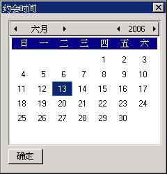

# 月历控件

月历控件（monthcalendar）提供一个类似日历的用户界面，使用户可以方便的选择和设置日期。应用程序可以通过向月历控件发送消息来获取和设置日期。

你可以通过调用`CreateWindow`函数，使用控件类名称 `CTRL_MONTHCALENDAR`，来创建一个月历控件。

## 1.1 月历控件风格

月历控件可以用中文或英文等多种格式显示星期和月份等日期信息，这可以通过指定控件的风格为 `MCS_CHN`、`MCS_ENG_L` 或 `MCS_ENG_S` 来完成。如果月历控件风格中包括 `MCS_CHN` 的话，控件以中文显示日期信息；如果包括 `MCS_ENG_L`，以英文显示日期信息；如果包括 `MCS_ENG_S` 的话，将以简写的英文格式显示。

如果风格中包括 `MCS_NOTIFY` 的话，月历控件将在响应用户操作时等情况下产生相应的通知消息。

## 1.2 月历控件消息

### 1.2.1 获取日期

`MCM_GETCURDAY` 消息用来获取当前选择的日期中是当月中的第几天：

```c
int day;
day = SendMessage (hwndMonthcal, MCM_GETCURDAY, 0, 0) ;
```

`SendMessage` 函数返回值就是当前的天数。

`MCM_GETCURMONTH` 消息用来获取当前选择的日期中的月份值：

```c
int month;
month = SendMessage (hwndMonthcal, MCM_GETCURMONTH, 0, 0) ;
```

`SendMessage` 函数返回值就是当前的月份。

`MCM_GETCURYEAR` 消息用来获取当前选择日期中的年份：

```c
int year;
year = SendMessage (hwndMonthcal, MCM_GETCURYEAR, 0, 0) ;
```

`SendMessage` 函数返回值就是当前的年份。

`MCM_GETCURMONLEN` 消息用来获取当前月份的长度（该月有几天）：

```c
int monthlen;
monthlen = SendMessage (hwndMonthcal, MCM_GETCURMONLEN, 0, 0) ;
```

`SendMessage` 函数返回值就是当前月份的长度。

`MCM_GETFIRSTWEEKDAY` 消息用来确定当前月份中的第一天是星期几：

```c
int weekday;
weekday = SendMessage (hwndMonthcal, MCM_GETFIRSTWEEKDAY, 0, 0) ;
```

`SendMessage` 函数返回值就是当前月份第一天的星期号，从 0 到 6，0 表示星期天。

`MCM_GETCURDATE` 消息获取月历控件中当前选择的日期：

```c
SYSTEMTIME systime;
SendMessage (hwndMonthcal, MCM_GETCURDATE, 0, (LPARAM)&systime) ;
```

`systime` 是一个 `SYSTEMTIME` 类型的结构，存放获取的年、月、日和星期几等日期信息。该结构还用于 `MCM_GETTODAY` 等消息，其结构定义如下：

```c
typedef struct _SYSTEMTIME
{
        /* 年 */
        int year;
        /* 月 */
        int month;
        /* 日 */
        int day;
        /* 星期几 */
        int weekday;
} SYSTEMTIME;
typedef SYSTEMTIME *PSYSTEMTIME;
```

`MCM_GETTODAY` 消息获取“今天”的日期：

```c
SYSTEMTIME systime;
SendMessage (hwndMonthcal, MCM_GETTODAY, 0, (LPARAM)&systime) ;
```

`systime` 也是一个 `SYSTEMTIME` 类型的结构。

### 1.2.2 设置日期

需要注意的是，在 Linux 系统中，设置日期可能需要特殊用户身份（如 root）。

`MCM_SETCURDAY` 消息设置当前选择的“天”，`MCM_SETCURMONTH` 消息设置当前的月，`MCM_SETCURYEAR` 消息设置当前的年：

```c
int day;
int month;
int year;
SendMessage (hwndMonthcal, MCM_SETCURDAY, day, 0) ;
SendMessage (hwndMonthcal, MCM_SETCURMONTH, month, 0) ;
SendMessage (hwndMonthcal, MCM_SETCURYEAR, year, 0) ;
```

`day`、`month` 和 `year` 分别指定新的天、月和年，如果这些值在合理的值范围之外，控件将采用最接近的一天、月或年。

`MCM_SETCURDATE` 消息设置当前选择的日期：

```c
SYSTEMTIME systime;
SendMessage (hwndMonthcal, MCM_SETCURDATE, 0, (LPARAM)&systime) ;
```

`MCM_SETTODAY` 把“今天”设为当前选择的日期：

```c
SendMessage (hwndMonthcal, MCM_SETTODAY, 0, 0) ;
```

### 1.2.3  调整颜色

应用程序可以通过 `MCM_GETCOLOR` 和 `MCM_SETCOLOR` 消息来获取和改变月历控件中各部分的颜色设置：

```c
MCCOLORINFO color;
SendMessage (hwndMonthcal, MCM_GETCOLOR, 0, (LPARAM)&color) ;
SendMessage (hwndMonthcal, MCM_SETCOLOR, 0, (LPARAM)&color) ;
```

`color` 是一个 `MCCOLORINFO` 类型的结构，用于保存颜色信息。

```c
typedef struct _MCCOLORINFO
{
        /* 标题的背景色 */
        int clr_titlebk;
        /* 标题的文字颜色 */
        int clr_titletext;
        /* 年和月箭头的颜色 */
        int clr_arrow;
        /* 箭头高亮时背景色 */
        int clr_arrowHibk;
        
        /* 星期标题背景色 */
        int clr_weekcaptbk;
        /* 星期标题文字颜色 */
        int clr_weekcapttext;
        
        /* 天数部分背景色 */
        int clr_daybk;
        /* 天数部分高亮时背景色 */
        int clr_dayHibk;
        /* 天数部分文字颜色 */
        int clr_daytext;
        /* 非当前月部分天数文字颜色 */
        int clr_trailingtext;
        /* 高亮的文字颜色 */
        int clr_dayHitext;
} MCCOLORINFO;
```

### 1.2.4 控件大小

为了能够正常显示其中的内容，月历控件有一个窗口最小限制值，`MCM_GETMINREQRECTW` 消息和 `MCM_GETMINREQRECTH` 消息分别用来获取最小宽度和最小高度值：

```c
int minw, minh;
minw = SendMessage (hwndMonthcal, MCM_GETMINREQRECTW, 0, 0) ;
minh = SendMessage (hwndMonthcal, MCM_GETMINREQRECTH, 0, 0) ;
```

`SendMessage` 函数的返回值就是最小宽度和高度值。

## 1.3 月历控件通知码

当用户点击月历控件并造成当前日期发生改变时，控件将产生 `MCN_DATECHANGE` 通知码。

## 1.4 编程实例

__清单 1.1__ 中的代码演示了月历控件的使用。该程序的完整源代码可见本指南示例程序包 `mg-samples` 中的 `monthcal.c` 程序。

__清单 1.1__  月历控件示例程序

```c
#define IDC_MC                100
#define IDC_OK                200

/* 对话框模板：只有两个控件：月历控件和“确定”按钮 */
static CTRLDATA CtrlTime[]=
{
        {
                "monthcalendar",
                WS_CHILD | WS_VISIBLE | MCS_NOTIFY | MCS_CHN,
                10, 10, 240, 180,
                IDC_MC,
                "",
                0
        },
        {
                "button",
                WS_CHILD | WS_VISIBLE | BS_PUSHBUTTON,
                260, 180, 50, 22,
                IDC_OK,
                "确定",
                0
        }
};

static DLGTEMPLATE DlgTime = 
{
        WS_VISIBLE | WS_CAPTION | WS_BORDER,
        WS_EX_NONE,
        0, 0, 320, 240,
        "约会时间",
        0, 0,
        2, CtrlTime,
        0
};

static int TimeWinProc(HWND hDlg, int message, WPARAM wParam, LPARAM lParam)
{
        switch (message) {
                case MSG_INITDIALOG:
                break;
                
                case MSG_COMMAND:
                {
                        int id = LOWORD(wParam);
                        if (id == IDC_OK) {
                                char info[100];
                                SYSTEMTIME date;
                                /* 获取月历控件中的当前日期 */
                                SendMessage (GetDlgItem(hDlg, IDC_MC), MCM_GETCURDATE, 0, (LPARAM)&date);
                                sprintf (info, "你定于%d年%d月%d日会见总统!", 
                                date.year, date.month, date.day);
                                MessageBox (hDlg, info, "约会", MB_OK | MB_ICONINFORMATION);
                                EndDialog (hDlg, 0);
                        }
                }
                break;
                
                case MSG_CLOSE:
                {
                        EndDialog (hDlg, 0);
                }
                return 0;
        }
        
        return DefaultDialogProc (hDlg, message, wParam, lParam);
}
```


__图 1.1__  月历控件的使用
