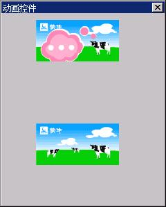

# 动画控件

动画控件（animation）是一个可以显示动画的控件；它很简单，易于使用。

你可以通过调用 `CreateWindow` 函数，使用控件类名称 `CTRL_ANIMATION` 来创建一个动画控件。

## 1.1 `ANIMATION` 对象

在创建动画控件之前，你必须首先创建一个 `ANIMATION` 对象。该对象其实是一个链表结构，链表的每个节点表示动画对象的一帧图象。ANIMATION 对象由下面两个结构表示：

```c
/** Animation frame structure. */
typedef struct _ANIMATIONFRAME
{
        /** The disposal method (from GIF89a specification):
        *  Indicates the way in which the graphic is to be treated after being displayed.
        *  - 0\n No disposal specified. The decoder is not required to take any action.
        *  - 1\n Do not dispose. The graphic is to be left in place. 
        *  - 2\n Restore to background color. The area used by the frame must be restored to 
        *        the background color.
        *  - 3\n Restore to previous. The decoder is required to restore the area overwritten by 
        *        the frmae with what was there prior to rendering the frame.
        */
        int disposal;
        /** The x-coordinate of top-left corner of the frame in whole animation screen. */
        int off_x;
        /** The y-coordinate of top-left corner of the frame in whole animation screen. */
        int off_y;
        /** The width of the frame. */
        unsigned int width;
        /** The height of the frame. */
        unsigned int height;
        
        /** The time of the frame will be display, in the unit of animation time_unit. */
        unsigned int delay_time;
        #ifdef _USE_NEWGAL
        /** The memdc compatible with the gif image. */
        HDC mem_dc;
        /** The bits of the mem_dc, should be freed after deleting the mem_dc. */
        Uint8* bits;
        #else
        /** The bitmap of the frame. */
        BITMAP bmp;
        #endif
        
        /** The next frame */
        struct _ANIMATIONFRAME* next;
        /** The previous frame */
        struct _ANIMATIONFRAME* prev;
} ANIMATIONFRAME;

/** Animation structure */
typedef struct _ANIMATION
{
        /** The width of the animation. */
        unsigned int width;
        /** The height of the animation. */
        unsigned int height;
        
        /** The background color */
        RGB bk;
        
        /** The number of all frames. */
        int nr_frames;
        /**
        * The unit of the time will be used count the delay time of every frame.
        * The default is 1, equal to 10ms.
        */
        int time_unit;
        /** Pointer to the animation frame.*/
        ANIMATIONFRAME* frames;
} ANIMATION;
```

`ANIMATION` 结构描述的是动画对象的全局属性，包括动画的宽度和高度，动画帧的个数，用来表示延迟的时间单位（取 1 时表示 10ms），以及指向动画帧链表的头指针。

`ANIMATIONFRAME` 结构表示单个的动画帧，包括有如下信息：

- 当前动画帧在全局动画中的偏移量及帧的宽度及高度。因为一幅动画帧相对于上一帧可能只会修改部分图象信息，因此，在帧结构中仅包含需要修改的部分将大大降低帧的数据量。
- 当前帧的延迟时间。以 `ANIMATION` 对象中的 `time_unit` 为单位计算的当前帧播放时间。
- 当前帧的图象信息。当使用 `NEWGAL` 接口时，该图象用内存 `DC` 表示；否则用 `BITMAP` 对象表示。

应用程序可以自行构建 `ANIMATION` 对象，亦可调用下面的函数直接从 `GIF98a` 的图象文件中创建 `ANIMATION` 对象：

```c
ANIMATION* CreateAnimationFromGIF89a (HDC hdc, MG_RWops* area);
ANIMATION* CreateAnimationFromGIF89aFile (HDC hdc, const char* file);
ANIMATION* CreateAnimationFromGIF89aMem (HDC hdc, const void* mem, int size);
```

上述函数将表示 `GIF89a` 数据的数据源（`area`）中读取动画 `GIF` 的图象信息，然后创建一个 `ANIMATION `对象。

应用程序创建了 `ANIMATION` 对象之后，既可以自行显示，亦可创建动画控件显示动画。在调用 `CreateWindow` 函数创建动画控件时，可将创建好的 `ANIMATION` 对象传递给动画控件，动画控件将使用该 `ANIMATION` 对象自动播放动画。下面的代码段从一个 `gif` 文件中创建了 `ANIMATION` 对象，然后利用该对象建立了动画控件：

```c
ANIMATION* anim = CreateAnimationFromGIF89aFile (HDC_SCREEN, "banner.gif");
if (anim == NULL)
return 1;

CreateWindow (CTRL_ANIMATION, 
"", 
WS_VISIBLE | ANS_AUTOLOOP, 
100, 
10, 10, 300, 200, hWnd, (DWORD)anim);
```

注意在调用 `CreateWindow` 函数时，可将 `ANIMATION` 对象指针通过 `dwAddData` 参数传入动画控件。

## 1.2 动画控件风格

目前，动画控件的风格有如下三个：

- `ANS_AUTOLOOP`：使用该风格之后，动画控件将自动重复播放动画。
- `ANS_SCALED`：根据控件大小缩放动画对象。
- `ANS_FITTOANI`：根据动画对象大小调整控件尺寸。

## 1.3 动画控件消息

动画控件的消息也非常简单，目前有如下几个消息，可用来控制动画控件的播放行为：

- `ANM_SETANIMATION`：设置 `ANIMATION` 对象。
- `ANM_GETANIMATION`：获取当前的 `ANIMATION` 对象。
- `ANM_STARTPLAY`：开始播放。在发送 `ANM_STARTPLAY` 消息给动画控件之前，动画控件将仅仅显示 `ANIMATION` 对象的第一帧图象；只有发送了 `ANM_STARTPLAY` 消息之后，动画控件才会按 `ANIMATION` 对象中的信息播放动画。
- `ANM_PAUSE_RESUME`：暂停/继续播放。用来暂停动画的播放（正在播放时），或者用来继续动画的播放（已被暂停时）。
- `ANM_STOPPLAY`：停止动画的播放。动画控件将返回到 `ANIMATION` 的第一帧图象。

## 1.4 编程实例

__清单 1.1__ 中的代码演示了动画控件的使用。该程序的完整源代码可见本指南示例程序包 `mg-samples` 中的 `animation.c` 程序。

__清单 1.1__  动画控件的使用

```c
static int AnimationWinProc(HWND hWnd, int message, WPARAM wParam, LPARAM lParam)
{
        switch (message) {
                case MSG_CREATE:
                {
                        ANIMATION* anim = CreateAnimationFromGIF89aFile (HDC_SCREEN, "banner.gif");
                        if (anim == NULL)
                        return 1;
                        
                        SetWindowAdditionalData (hWnd, (DWORD) anim);
                        CreateWindow (CTRL_ANIMATION, 
                        "", 
                        WS_VISIBLE | ANS_AUTOLOOP, 
                        100, 
                        10, 10, 300, 200, hWnd, (DWORD)anim);
                        SendMessage (GetDlgItem (hWnd, 100), ANM_STARTPLAY, 0, 0);
                        
                        CreateWindow (CTRL_ANIMATION, 
                        "", 
                        WS_VISIBLE | ANS_AUTOLOOP, 
                        200, 
                        10, 210, 300, 200, hWnd, (DWORD)anim);
                        break;
                }
                
                case MSG_LBUTTONDOWN:
                SendMessage (GetDlgItem (hWnd, 200), ANM_STARTPLAY, 0, 0);
                break;
                
                case MSG_DESTROY:
                DestroyAnimation ((ANIMATION*)GetWindowAdditionalData (hWnd), TRUE);
                DestroyAllControls (hWnd);
                return 0;
                
                case MSG_CLOSE:
                DestroyMainWindow (hWnd);
                PostQuitMessage (hWnd);
                return 0;
        }
        
        return DefaultMainWinProc(hWnd, message, wParam, lParam);
}

/* 以下创建主窗口的代码省略 */
```


__图 1.1__  动画控件的使用

__清单 1.1__ 中的程序在创建主窗口时装载了当前目录下的 `banner.gif` 文件，并创建了对应的 `ANIMATION` 对象。之后，创建了两个动画控件。第一个动画控件在创建后立即开始播放，第二个动画控件只在用户单击窗口时开始播放。__图 1.1__ 是该示例程序的运行效果图。其中，第一个动画控件显示的是 `banner.gif` 文件的第二帧，第二个动画控件显示的第一帧。
