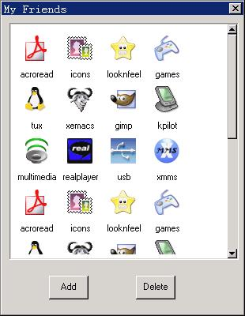

# 图标型控件

图标型（IconView）控件提供一个以图标加标签文字的方式供用户浏览条目的界面。这些图标项显示在可滚动的子窗口中，用户可通过键盘及鼠标操作来选中某一项或者多个项，选中的图标项通常高亮显示。图标型控件的典型用法是作为桌面图标的容器和目录下文件的显示。

使用 `CTRL_ICONVIEW` 作为控件类名称，可以通过 `CreateWindow` 函数调用创建图标型控件。

我们在创建图标型控件之后，可以通过发送相应的消息来添加、删除、设置图标尺寸（必须在添加该图标之前）和获取图标标签文字等。

## 1.1 图标型控件风格

默认状态下，图标型控件窗口只显示图标和其标签文字，显示区域的周围没有边界。你可以在以 `CreateWindow` 函数创建控件时使用窗口风格标识号 `WS_BORDER` 来为图标型控件加上边界。另外，还可以使用窗口风格 `WS_VSCROLL` 和 `WS_HSCROLL` 来增加垂直和水平滚动条，以便用鼠标来滚动显示列表型控件中的各项内容。

图标型控件是基于 `ScrollView`（滚动型）控件开发的，它保留了 `ScrollView` 控件的风格。

## 1.2 图标型控件消息

### 1.2.1 图标项的操作

在创建一个图标型控件之后，下一步通常需要往该控件中添加图标项，这是由应用程序向控件发送 `IVM_ADDITEM` 消息来完成的。

```c
IVITEMINFO ivii;
SendMessage (hIconView, IVM_ADDITEM, 0, (LPARAM)&ivii) ;
```

其中，`ivii` 是一个 `IVITEMINFO` 结构，用来表示所要设置的图标项的信息。`IVITEMINFO` 结构的定义以及各项意义如下：

```c
typedef struct _IVITEMINFO
{
        /* 图标项的索引值 */
        int nItem;
        /* 图标项的图标 */
        PBITMAP bmp;
        /* 图标项的标签文字 */
        const char *label;
        /* 图标项的附加信息 */
        DWORD addData;
        /* 保留 */
        DWORD dwFlags;
} IVITEMINFO;
```

图标项的索引值表示了该项在父窗口的位置。添加成功后返回该图标项的句柄，否则返回 0。

在添加图标项之前可以指定图标项的宽度和高度，所有的图标项都将以这个宽高度来显示。这是由 `IVM_SETITEMSIZE` 来完成的：

```c
int width;
int height;
SendMessage (hIconView, IVM_SETITEMSIZE, width, height) ;
```

其中，`width` 是要设置的宽度，`height` 是要设置的高度。

因为图标型控件是基于 `ScrollView` 控件的，因此，图标型控件的其余各消息基本上和 `ScrollView` 的消息一一对应：

- `IVM_RESETCONTENT`：对应 `SVM_RESETCONTENT`，用于清空图标型控件中的图标项。
- `IVM_DELITEM`：对应 `SVM_DELITEM`，用于删除图标型控件中的图标项。
- `IVM_SETITEMDRAW`：对应 `SVM_SETITEMDRAW`，用于设置图标项的绘制函数。
- `IVM_SETCONTWIDTH`：对应 `SVM_SETCONTWIDTH`，用于设置滚动窗口的宽度。
- `IVM_SETCONTHEIGHT`：对应 `SVM_SETCONTHEIGHT`，用于设置滚动窗口的高度。
- `IVM_SETITEMOPS`：对应 `SVM_ SETITEMOPS`，用于设置图标项相关操作的一些回调函数。
- `IVM_GETMARGINS`：对应 `SVM_GETMARGINS`，用于获取图标型控件的边缘范围值。
- `IVM_SETMARGINS`：对应 `SVM_SETMARGINS`，用于设置图标型控件的边缘范围值。
- `IVM_GETLEFTMARGIN`、`IVM_GETTOPMARGIN`、`IVM_GETRIGHTMARGIN` 和 `IVM_GETBOTTOMMARGIN` 分别对应 `SVM_GETLEFTMARGIN`、`SVM_GETTOPMARGIN`、`SVM_GETRIGHTMARGIN`、`SVM_GETBOTTOMMARGIN` 用于获取图标型控件中的左、上、右、下边缘值。
- `IVM_GETCONTWIDTH`、`IVM_GETCONTHEIGHT`、`IVM_GETVISIBLEWIDTH` 和 `IVM_GETVISIBLEHEIGHT` 分别对应 `SVM_GETCONTWIDTH`、
`SVM_GETCONTHEIGHT`、`SVM_GETVISIBLEWIDTH` 和 `SVM_GETVISIBLEHEIGHT`，用来获取内容区域的宽度和高度、可视区域的宽度和高度。
- `IVM_SETCONTRANGE`：对应 `SVM_SETCONTRANGE`，用于设置滚动窗口的内容区域的大小。
- `IVM_GETCONTENTX` 和 `IVM_GETCONTENTY` 分别对应 `SVM_GETCONTENTX` 和 `SVM_GETCONTENTY`，用于获取内容区域的当前位置值。
- `IVM_SETCONTPOS`：对应 `SVM_SETCONTPOS`，用于设置内容区域的当前位置值，也就是在可视区域中移动内容区域到某个指定位置。
- `IVM_GETCURSEL` 和 `IVM_SETCURSEL` 分别对应 `SVM_GETCURSEL` 和 `SVM_SETCURSEL`，用于获取和设置控件的当前高亮图标项。
- `IVM_SELECTITEM`：对应 `SVM_SELECTITEM`，用于选择一个列表项，被选中的项将高亮显示。
- `IVM_SHOWITEM`：对应 `SVM_SHOWITEM`，用于显示一个图标项。
- `IVM_CHOOSEITEM`：对应 `SVM_CHOOSEITEM`，是 `IVM_SELECTITEM` 和 `IVM_SHOWITEM` 消息的组合，用来选中一个图标项并使之可见。
- `IVM_SETITEMINIT`：对应 `SVM_SETITEMINIT`，用于设置图标项的初始操作。
- `IVM_SETITEMDESTROY`：对应 `SVM_SETITEMDESTROY`，用于设置图标项的销毁操作。
- `IVM_SETITEMCMP`：对应 `SVM_SETITEMCMP`，用于设置图标型控件图标项的比较函数。
- `IVM_MAKEPOSVISIBLE`：对应 `SVM_MAKEPOSVISIBLE`，用于使内容区域中的某个位置点成为可见。
- `IVM_GETHSCROLLVAL` 和 `IVM_GETVSCROLLVAL` 分别对应 `SVM_GETHSCROLLVAL` 和 `SVM_GETVSCROLLVAL`，用来获取滚动窗口的当前水平和垂直滚动值（点击滚动条箭头的滚动范围大小）。
- `IVM_GETHSCROLLPAGEVAL` 和 `IVM_GETVSCROLLPAGEVAL` 分别对应 `SVM_GETHSCROLLPAGEVAL` 和 `SVM_GETVSCROLLPAGEVAL`，用来获取滚动窗口的当前水平和垂直页滚动值（翻页操作时的滚动范围大小）。
- `IVM_SETSCROLLVAL`：对应 `SVM_SETSCROLLVAL`，用于设置滚动窗口的水平和（或者）垂直滚动值。
- `IVM_SETSCROLLPAGEVAL`：对应 `SVM_SETSCROLLPAGEVAL`，用于设置滚动窗口的水平和（或者）垂直页滚动值。
- `IVM_SORTITEMS`：对应 `SVM_SORTITEMS`，用于对图标项进行一次性的排序。
- `IVM_GETITEMCOUNT`：对应 `SVM_GETITEMCOUNT`，用于获取当前图标项的数量。
- `IVM_GETITEMADDDATA`：对应 `SVM_GETITEMADDDATA`，用于获取当前图标项的附加信息。
- `IVM_SETITEMADDDATA`：对应 `SVM_SETITEMADDDATA`，用于设置当前图标项的附加信息。
- `IVM_REFRESHITEM`：对应 `SVM_REFRESHITEM`，用于刷新一个图标项区域。
- `IVM_GETFIRSTVISIBLEITEM`：对应 `SVM_GETFIRSTVISIBLEITEM`，用于获取第一个可见的图标项。

## 1.3 控件通知码

图标型控件在响应用户点击等操作和发生某些状态改变时会产生通知消息，包括：

- `LVN_SELCHANGE`：对应 `SVN_SELCHANGE`，当前高亮图表项发生改变
- `LVN_CLICKED`：对应 `SVN_CLICKED`，用户点击图标项

应用程序需要使用 `SetNotificationCallback` 函数注册一个通知消息处理函数，在该函数中对收到的各个通知码进行应用程序所需的处理。

`LVN_CLICKED` 和 `LVN_SELCHANGE` 通知消息处理函数传递的附加数据为被点击或者当前高亮的图标项句柄。

## 1.4 编程实例

__清单 1.1__ 中的代码演示了使用图标型控件来构造一个简单的图标项浏览窗口。该程序的完整源代码可见本指南示例程序包 `mg-samples` 中的 `iconview.c` 程序。

__清单 1.1__  图标型控件示例程序

```c
#define IDC_ICONVIEW    100
#define IDC_BT          200
#define IDC_BT2         300
#define IDC_BT3         400
#define IDC_BT4         500

#define IDC_ADD         600
#define IDC_DELETE      601

static HWND hIconView;

static BITMAP myicons [12];

static const char* iconfiles[12] =
{
        "./res/acroread.png",
        "./res/icons.png",
        "./res/looknfeel.png",
        "./res/package_games.png",
        "./res/tux.png",
        "./res/xemacs.png",
        "./res/gimp.png",
        "./res/kpilot.png",
        "./res/multimedia.png",
        "./res/realplayer.png",
        "./res/usb.png",
        "./res/xmms.png"
};

static const char *iconlabels[12] =
{
        "acroread",
        "icons",
        "looknfeel",
        "games",
        "tux",
        "xemacs",
        "gimp",
        "kpilot",
        "multimedia",
        "realplayer",
        "usb",
        "xmms"
};

static void myDrawItem (HWND hWnd, GHANDLE hsvi, HDC hdc, RECT *rcDraw)
{
        const PBITMAP pbmp = (PBITMAP)iconview_get_item_bitmap (hsvi);
        const char *label = (const char*)iconview_get_item_label (hsvi);
        
        SetBkMode (hdc, BM_TRANSPARENT);
        SetTextColor (hdc, PIXEL_black);
        
        if (iconview_is_item_hilight(hWnd, hsvi)) {
                SetBrushColor (hdc, PIXEL_blue);
        }
        else {
                SetBrushColor (hdc, PIXEL_lightwhite);
        }
        FillBox (hdc, rcDraw->left, rcDraw->top, RECTWP(rcDraw), RECTHP(rcDraw));
        SetBkColor (hdc, PIXEL_blue);
        
        if (label) {
                RECT rcTxt = *rcDraw;
                rcTxt.top = rcTxt.bottom - GetWindowFont (hWnd)->size * 2;
                rcTxt.left = rcTxt.left - (GetWindowFont (hWnd)->size) + 2;
                
                DrawText (hdc, label, -1, &rcTxt, DT_SINGLELINE | DT_CENTER | DT_VCENTER);
        }
        FillBoxWithBitmap (hdc, rcDraw->left, rcDraw->top, 0, 0, pbmp);
}

static int
BookProc (HWND hDlg, int message, WPARAM wParam, LPARAM lParam)
{
        switch (message)
        {
                
                case MSG_INITDIALOG:
                {
                        IVITEMINFO ivii;
                        static int i = 0, j = 0;
                        
                        hIconView = GetDlgItem (hDlg, IDC_ICONVIEW);
                        SetWindowBkColor (hIconView, PIXEL_lightwhite);
                        //SendMessage (hIconView, IVM_SETITEMDRAW, 0, (LPARAM)myDrawItem);
                        SendMessage (hIconView, IVM_SETITEMSIZE, 55, 65);
                        //SendMessage (hIconView, IVM_SETITEMSIZE, 35, 35);
                        for (j = 0; j < 3; j ++) {
                                for (i = 0; i < TABLESIZE(myicons); i++) {
                                        memset (&ivii, 0, sizeof(IVITEMINFO));
                                        ivii.bmp = &myicons[i];
                                        ivii.nItem = 12 * j + i;
                                        ivii.label = iconlabels[i];
                                        ivii.addData = (DWORD)iconlabels[i];
                                        SendMessage (hIconView, IVM_ADDITEM, 0, (LPARAM)&ivii);
                                }
                        }
                        break;
                }
                
                case MSG_COMMAND:
                {
                        int id = LOWORD (wParam);
                        int code = HIWORD (wParam);
                        
                        switch (id) {
                                case IDC_ICONVIEW:
                                if (code == IVN_CLICKED) {
                                        int sel;
                                        sel = SendMessage (hIconView, IVM_GETCURSEL, 0, 0);
                                        printf ("clicking %d\n", sel);
                                }
                                break;
                                case IDC_ADD:
                                {
                                        IVITEMINFO ivii;
                                        char buff [10];
                                        int idx;
                                        int count = SendMessage (hIconView, IVM_GETITEMCOUNT, 0, 0);
                                        
                                        sprintf (buff, "NewIcon%i", count);
                                        memset (&ivii, 0, sizeof (IVITEMINFO));
                                        ivii.bmp = &myicons [0];
                                        ivii.nItem = count;
                                        ivii.label = buff;
                                        ivii.addData = (DWORD)"NewIcon";
                                        
                                        idx = SendMessage (hIconView, IVM_ADDITEM, 0, (LPARAM)&ivii);
                                        SendMessage (hIconView, IVM_SETCURSEL, idx, 1);
                                        break;
                                }
                                
                                case IDC_DELETE:
                                {
                                        int sel = SendMessage (hIconView, IVM_GETCURSEL, 0, 0);
                                        int count = SendMessage (hIconView, IVM_GETITEMCOUNT, 0, 0);
                                        char *label = NULL;
                                        
                                        if (sel >= 0){
                                                label = (char *) SendMessage (hIconView, IVM_GETITEMADDDATA, sel, 0); 
                                                if (label && strlen (label))
                                                printf ("delelete item:%s\n", label);
                                                SendMessage (hIconView, IVM_DELITEM, sel, 0);
                                                if (sel == count - 1)
                                                sel --;
                                                SendMessage (hIconView, IVM_SETCURSEL, sel, 1);
                                        }
                                        break;
                                }
                                
                        } /* end command switch */
                        break;
                }
                
                case MSG_KEYDOWN:
                if (wParam == SCANCODE_REMOVE) {
                        int cursel = SendMessage (hIconView, IVM_GETCURSEL, 0, 0);
                        
                        if (cursel >= 0){
                                SendMessage (hIconView, IVM_DELITEM, cursel, 0);
                                SendMessage (hIconView, IVM_SETCURSEL, cursel, 0);
                        }
                }
                break;
                
                case MSG_CLOSE:
                {
                        EndDialog (hDlg, 0);
                        return 0;
                }
                
        } /* end switch */
        
        return DefaultDialogProc (hDlg, message, wParam, lParam);
}

static CTRLDATA CtrlBook[] =
{
        {
                CTRL_ICONVIEW,
                WS_BORDER | WS_CHILD | WS_VISIBLE | WS_VSCROLL | WS_HSCROLL,
                10, 10, 290, 300,
                IDC_ICONVIEW,
                "",
                0
        },
        {
                CTRL_BUTTON,
                WS_CHILD | WS_VISIBLE | BS_DEFPUSHBUTTON | WS_TABSTOP,
                90, 330, 50, 30,
                IDC_ADD,
                "Add",
                0
        },
        {
                CTRL_BUTTON,
                WS_CHILD | WS_VISIBLE | WS_TABSTOP | BS_PUSHBUTTON,
                170, 330, 50, 30,
                IDC_DELETE,
                "Delete",
                0
        }
};

static DLGTEMPLATE DlgIcon =
{
        WS_BORDER | WS_CAPTION,
        WS_EX_NONE,
        0, 0, 310, 400,
        "My Friends",
        0, 0,
        TABLESIZE(CtrlBook), CtrlBook,
        0
};
```


__图 1.1__  图标型控件
