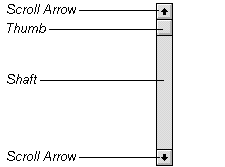
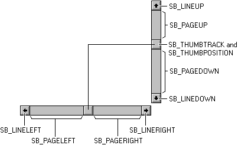
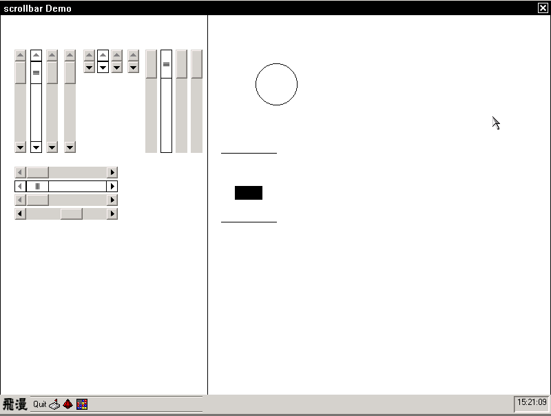

# 独立滚动条控件

## 1.1 滚动条的定义

- 滚动条控件的组成部分有箭头(arrow)、滚槽(shaft)、游标(thumb)三部分组成。有的滚动条没有箭头，有的没有滚槽和游标。如图: 

__图 1.1__ 滚动条结构图


- 滚动条是矩形的，当鼠标击中滚动条，滚动条发送消息给父窗口，父窗口显示更新的窗口内容并更新游标的位置。当鼠标点击箭头时，滚动条也会发消息给父窗口，更新父窗口的内容和游标的位置。

## 1.2  滚动条的形态

滚动条有两种形态：一种是以主窗口或者其他控件的一部分出现，通过风格 `WS_HSCROLL`、`WS_VSCROLL` 来指定是否拥有水平、垂直滚动条。主窗口或者控件可以同时拥有这两种风格；另一种是独立控件，控件类名是 `CTRL_SCROLLBAR`，应用程序在创建滚动条控件时，通过 `SBS_HORZ` 或者 `SBS_VERT` 来确定是创建水平滚动条还是垂直滚动条，这两种风格只能选择其一。前者不是本章要介绍的内容，但是毕竟二者有密切的联系，因此，此处作一下必要的介绍。

## 1.3 独立滚动条的风格

独立滚动条拥有如下的风格：

__表 1.1__ 独立滚动条风格

| 风格标识符             |  意义  |
|:---------------------|:-------|
|`SBS_HORZ`            | 创建一个水平滚动条。当没有指定 `SBS_BOTTOMALIGN` 或 `SBS_TOPALIGN`，滚动条的范围根据 `CreateWindowEx2` 参数 x,y,w,h 决定。 |
|`SBS_VERT`            | 创建一个垂直滚动条。当没有指定 `SBS_LEFTALIGN` 或 `SBS_RIGHTALIGN`，滚动条的范围根据 `CreateWindowEx2` 参数 x,y,w,h 决定。 |
|`SBS_BOTTOMALIGN`     | 与 `SBS_HORZ` 一起使用。放置水平滚动条在  `CreateWindowEx2` 指定范围的底部。|
|`SBS_TOPALIGN`        | 与 `SBS_HORZ` 一起使用。放置水平滚动条在  `CreateWindowEx2` 指定范围的顶部。 |
|`SBS_LEFTALIGN`       | 与 `SBS_VERT` 一起使用。放置垂直滚动条在  `CreateWindowEx2` 指定范围的左边。|
|`SBS_RIGHTALIGN`      | 与 `SBS_VERT` 一起使用，放置垂直滚动条在  `CreateWindowEx2` 指定范围的右边。|
|`SBS_NOARROWS`        | 没有箭头，不能与 `SBS_NOSHAFT` 一起使用 |
|`SBS_NOSHAFT`         | 没有 `shaft`，不能与 `SBS_NOARROWS` 一起使用 |
|`SBS_FIXEDBARLEN`     | 水平滚动条的 `thumb` 长度固定，或者垂直滚动条的 `thumb` 长度固定 |
|`SBS_NOTNOTIFYPARENT` | 向父窗口的通知发送方式不是发送通知码，而是发送消息；默认发送通知码 |

## 1.4 独立滚动条的消息

应用程序可以向滚动条控件发送下面的消息来进行相应的处理：

- 获取/设置滚动条的数据信息：`SBM_GETSCROLLINFO`、`SBM_SETSCROLLINFO`
- 获取/设置当前 `thumb` 的位置： `SBM_GETPOS` 、 `SBM_SETPOS`
- 获取/设置滚动范围 `range`： `SBM_GETRANGE` 、 `SBM_SETRANGE`
- 设置滚动范围 `range` 并且立即重绘： `SBM_SETRANGEREDRAW` 
- 启用/禁止箭头 `arrow`: `SBM_ENABLE_ARROW`

### 1.4.1 获取滚动条信息

应用程序向滚动条发送 `wParam` 参数为 `SCROLLINFO` *指针的 `SBM_GETSCROLLINFO` 消息获取滚动条控件的最大值、最小值、滚动条所含的页数、当前位置这些信息。所获取到的信息将存放在 `wParam` 所指向的内存里面返回。`SCROLLINFO` 结构体如下：

```c
/*
* Scroll bar information structure.
*/
typedef struct _SCROLLINFO
{
        /** Size of the structrue in bytes */
        UINT    cbSize;
        /**  
        * A flag indicates which fields contain valid values, 
        * can be OR'ed value of the following values:
        *      - SIF_RANGE\n
        *        Retrives or sets the range of the scroll bar.
        *      - SIF_PAGE\n
        *        Retrives or sets the page size of the scroll bar.
        *      - SIF_POS\n
        *        Retrives or sets the position of the scroll bar.
        *      - SIF_DISABLENOSCROLL\n
        *        Hides the scroll when disabled, not implemented so far.
        */
        UINT    fMask;
        /** The minimum position value of the scroll bar */
        int     nMin;
        /** The maximum position value of the scroll bar */
        int     nMax;
        /** The page size of the scroll bar */
        UINT    nPage;
        /** The position value of the scroll bar */
        int     nPos;
} SCROLLINFO, *PSCROLLINFO;
```

通过 `SBM_GETSCROLLINFO` 消息所能获得的信息是由 `SBM_GETSCROLLINFO` 结构体的fMask 来指定的，`fMas` 可取如下表的值：

__表 1.2__ 滚动条信息列表

| 信息标识符   | 意义  |
|:-----------|:------|
|`SIF_RANGE` | 获取滚动条的取值范围|
|`SIF_PAGE`  | 获取滚动条的页数|
|`SIF_POS`   | 获取滚动条的当前位置|
|`SIF_ALL`   | 获取上面所有的信息|

下面的示例是获取滚动条控件的所有信息

```c
SCROLLINFO scinfo = {0};
scinfo.fMask = SIF_ALL;
SendMessage (hwnd_scrollbar, SBM_GETSCROLLINFO, (wParam)&scinfo,  0);
```

### 1.4.2 设置滚动条信息

向滚动条控件发送 `SBM_SETSCROLLINFO` 消息进行滚动条信息设置。参数 `wParam` 为 `SCROLLINFO` 结构体指针，存放有需要设置的滚动条信息。参数 `lParam` 用来确定是否立即重绘，`FALSE` 为不重绘, `TRUE` 则立即重绘。

下面的示例是对滚动条的信息进行设置，并且不立即进行重绘：

```c
SCROLLINFO scinfo = {0};
scinfo.fMask = SIF_ALL;
scinfo.nMin = 0;
scinfo.nMax = 10;
scinfo.nPage = 2;
scinfo.nPos = 0;
BOOL redraw = FALSE;
SendMessage (hwnd_scrollbar, SBM_SETCROLLINFO, (wParam)&scinfo,  redraw);
```

### 1.4.3 获取当前游标的位置

向滚动条发送 `SBM_GETPOS` 消息，就可以获取当前游标所在位置。下面是示例代码：

```c
int pos = SendMessage (hwnd_scrollbar, SBM_GETPOS, 0, 0);
```

### 1.4.4 设置当前游标的位置

向滚动条发送 `SBM_SETPOS` 消息，设置滚动条游标当前的位置。目的位置放在参数 `wParam` 中， `lParam` 表示是否立即重绘，`TRUE` 立即重绘，`FALSE` 不重绘。

```c
int pos = 10;
SendMessage (hwnd_scrollbar, SBM_SETPOS, pos, TRUE);
```

### 1.4.5 获取滚动条滚动范围

通过 `SBM_GETRANGE` 消息可以获取滚动条的滚动范围。参数 `wParam` 得到最小范围，`lParam` 得到最大范围。

```c
int min, max;
SendMessage (hwnd_scrollbar, SBM_GETRANGE, &min, &max);
```

### 1.4.6 设置滚动条滚动范围

通过 `SBM_SETRANGE` 消息可以设置滚动条的滚动范围。参数 `wParam` 是设置的最小范围，`lParam` 是设置的最大范围，此消息不会引起滚动条立即重绘。

下面的代码设置滚动条的滚动范围在 0 至 100 之间，但是需要在别的消息或者事件引起界面重绘时，你才能看到滚动条的变化。

```c
SendMessage (hwnd_scrollbar, SBM_SETRANGE, 0, 100);
```

### 1.4.7 设置滚动条滚动范围，并立即重绘

如果需要设置滚动条滚动范围并且要立即重绘的话，则需要向它发送 `SBM_SETRANGEREDRAW` 消息。参数 `wParam` 是设置的最小范围，`lParam` 是设置的最大范围。

下面的代码设置滚动条的滚动范围在 0 至 100 之间，并且立即重绘。

```c
SendMessage (hwnd_scrollbar, SBM_SETRANGEREDRAW, 0, 100);
```

### 1.4.8  启用或者禁用滚动条箭头

通过 `SBM_ENABLE_ARROW` 消息可以启用或者禁止滚动条箭头。所谓禁止就是不能向箭头指向的方向滚动。参数 `wParam` 可以取值如下，`lParam` 为 `TRUE` 表示启用，`FALSE` 表示禁用。

__表 1.3__ 箭头标识表

| 箭头标识符       | 意义  |
|:---------------|:------|
|`SB_ARROW_LTUP` | 代表水平滚动条的左方向键或者垂直滚动条的上方向键 |
|`SB_ARROW_BTDN` | 代表水平滚动条的右方向键或者垂直滚动条的下方向键 |
|`SB_ARROW_BOTH` | 所有方向键 |


下面的代码将禁用滚动条所有的箭头

```c
SendMessage (hwnd_scrollbar, SBM_ENABLE_ARROW, SB_ARROW_BOTH, FALSE);
```

## 1.5  滚动条可配置的属性

滚动条有如下的属性可以通过 `GetWindowElementAttr`、`SetWindowElementAttr`、`GetWindowElementPixelEx`、`SetWindowElementPixelEx` 这些函数来获取与设置。下表是可配置的属性列表及说明：

__表 1.4__ 通知码列表

| 属性标识符              | 说明 | 
|:----------------------|:-----|
|`WE_MAINC_THREED_BODY` | 绘制滚动条滚槽的颜色以及游标的颜色 |
|`WE_FGC_THREED_BODY`   | 绘制箭头的颜色 |
|`WE_FGC_DISABLED_ITEM` | 绘制无效箭头的颜色 |
|`WE_METRICS_SCROLLBAR` | 滚动条的尺寸，即水平滚动条的高度、垂直滚动条的宽度 |


下面的代码演示了对上面属性的操作：

```c
DWORD color_3d, fgc_3d, fgc_dis;
gal_pixel old_brush_color;

//获取绘制滚动条各个部分的颜色属性值
color_3d = GetWindowElementAttr(hWnd, WE_MAINC_THREED_BODY);
fgc_3d = GetWindowElementAttr(hWnd, WE_FGC_THREED_BODY);
fgc_dis = GetWindowElementAttr(hWnd, WE_FGC_DISABLED_ITEM);

//绘制滚动条滚槽
old_brush_color = SetBrushColor(hdc,
RGBA2Pixel(hdc,GetRValue(color_3d),
GetGValue(color_3d), GetBValue(color_3d),
GetAValue(color_3d)));
FillBox(hdc, rect.left, rect.top, RECTW(rect), RECTH(rect));
SetBrushColor(hdc, old_brush_color);

//绘制滚动条箭头
draw_3dbox(hdc, &rect, color_3d,
bn_status | LFRDR_3DBOX_THICKFRAME | LFRDR_3DBOX_FILLED);

if(sb_status & SBS_DISABLED_LTUP || sb_status & SBS_DISABLED)
draw_arrow(hWnd, hdc, &rect, fgc_dis, LFRDR_ARROW_LEFT);
else
draw_arrow(hWnd, hdc, &rect, fgc_3d, LFRDR_ARROW_LEFT);
```

## 1.6 滚动条通知码

滚动条所拥有的通知码如下表：

__表 1.5__ 通知码列表

| 通知码标识符        | 意义 |
|:------------------|:----|
|`SB_LINEUP`        | 垂直滚动条向上滚一行 |
|`SB_LINEDOWN`      | 垂直滚动条向下滚一行 |
|`SB_PAGEUP`        | 垂直滚动条向上滚一页 |
|`SB_PAGEDOWN`      | 垂直滚动条向下滚一页 |
|`SB_LINELEFT`      | 水平滚动条向左滚一列 |
|`SB_LINERIGHT`     | 水平滚动条向右滚一列 |
|`SB_PAGELEFT`      | 水平滚动条向左滚一列页 |
|`SB_PAGERIGHT`     | 水平滚动条向右滚一页 |
|`SB_THUMBPOSITION` | 当游标被鼠标左键按住拖动，然后释放，此时的游标位置将由此通知码传给父窗口 |
|`SB_THUMBTRACK`    | 当游标被鼠标左键按住，在拖动游标的过程中，游标的位置将由此通知码不断的传给父窗口 |
|`SB_TOP`           | 游标到了水平滚动条的最左边或者是垂直滚动条的最上边，即到了滚动条的最小值 |
|`SB_BOTTOM`        | 游标到了水平滚动条的最右边或者是垂直滚动条的最下边，即到了滚动条的最大值|

- 当滚动条指定了风格 `SBS_NOTNOTIFYPARENT` 时，水平滚动条的父窗口将会收到 `MSG_HSCROLL` 消息，垂直滚动条的父窗口将会收到 `MSG_VSCROLL` 消息， 参数 `wParam` 为通知码 `id`， 当 `id` 为 `SB_THUMBPOSITION`,`SB_THUMBTRACK` 时，`lParam` 为游标的当前位置 `curPos`，其他情况下 `lParam` 没有意义。
- 当滚动条没有指定风格 `SBS_NOTNOTIFYPARENT` 时，滚动条的父窗口将会收到通知码，参数 `wParam` 包含控件 `ID` 和通知码。当通知码为 `SB_THUMBPOSITION`,`SB_THUMBTRACK` 时，父窗口可以通过发送 `SBM_GETPOS` 来获取游标的当前位置 `curPos`。当然，如果你调用 `SetNotificationCallback` 函数设定了滚动条控件的通知回调函数，则控件不会向父窗口发送 `MSG_COMMAND `通知消息，而是会直接调用设定的通知回调函数。

### 1.6.1 通知消息的触发

滚动条可以接收鼠标和键盘事件，并根据不同的情况触发不同的通知消息。

- 当鼠标点击滚动条不同部位时，会触发不同的通知消息。另外，要注意的是，用鼠标左键拖动游标的过程中，滚动条会不断发送 `SB_THUMBTRACK` 通知消息，鼠标左键释放后会发送 `SB_THUMBPOSITIO` 消息。滚动条各个部位所触发的消息，请见下图：

__图 1.2__ 鼠标触发的通知消息


- 键盘按键会触发相应的通知消息，具体如下表所示：

__表 1.6__ 通知码列表

| 按键         | 通知码 |
|:-------------|:------|
|`PAGEUP` 键   | 水平滚动条发送 `SB_PAGELEFT` ；垂直滚动条发送 `SB_PAGEUP` |
|`PAGEDOWN` 键 | 水平滚动条发送 `SB_PAGERIGHT` ；垂直滚动条发送 `SB_PAGEDOWN` |
|上方向键       | 垂直滚动条发送 `SB_LINEUP` |
|左方向键       | 水平滚动条发送 `SB_LINELEFT` |
|下方向键       | 垂直滚动条发送 `SB_LINEDOWN` |
|右方向键       | 水平滚动条发送 `SB_LINERIGHT` |
|`HOME` 键     | `SB_TOP` |
|`END` 键      | `SB_BOTTOM` |

## 1.7 编程示例

下面的代码给出了各种样式的滚动条的创建示例。通过鼠标或者按键，你可以对滚动条进行点击、拖动等操作。为了使演示更生动，本示例还在界面的右边放置了一个圆圈和方块，随着你控制滚动条上下或者左右滚动，圆圈会变大变小，方块会上下移动。示例的效果如__图 1.3__ 所示，代码摘自示例程序包 `mg-samples` 中的 `scrollbar_ctrl.c` 文件，完整代码请见此文件。

__清单 1.1__ 滚动条示例代码

```c
#include <stdio.h>
#include <string.h>

#include <minigui/common.h>
#include <minigui/minigui.h>
#include <minigui/gdi.h>
#include <minigui/window.h>
#include <minigui/control.h>

#ifdef _LANG_ZHCN
#include "scrollbar_ctrl_res_cn.h"
#elif defined _LANG_ZHTW
#include "scrollbar_ctrl_res_tw.h"
#else
#include "scrollbar_ctrl_res_en.h"
#endif

/** define scrollbar data */
#define SB_MAX 20
#define SB_MIN 0
#define SB_PAGE 6

/** define circle data */
#define CC_CENTER_X    400
#define CC_CENTER_Y    100
#define CC_RADIUS_MAX   50
#define CC_RADIUS_MIN   0

/** define box data */
#define BOX_WIDTH   40
#define BOX_HEIGHT  20
#define BOX_Y_MAX   300
#define BOX_Y_MIN   200

/** x position of separator */
#define SEP   300

/** radius of circle */
int _radius;

/** y position of box */
int _box_pos_y;

/** invalidate rect */
RECT _rect_invalid;

static int ScrollbarProc(HWND hwnd, int message, WPARAM wParam, LPARAM lParam)
{
        /** IDC of SCROLLBAR control */
        static int _my_scroll_idc = 100;
        
        /** scrollbar handle of main window  */
        static HWND hwnd_sb_main;
        
        /** scrollbar handle of control */
        HWND hwnd_sb_ctrl;
        
        switch (message)
        {
                case MSG_CREATE:
                {
                        _rect_invalid.left   = SEP;
                        _rect_invalid.top    = 0;
                        _rect_invalid.right  = g_rcScr.right;
                        _rect_invalid.bottom = g_rcScr.bottom;
                        
                        SCROLLINFO scinfo = {0};
                        scinfo.fMask = SIF_ALL;
                        scinfo.nMin = SB_MIN;
                        scinfo.nMax = SB_MAX;
                        scinfo.nPage = SB_PAGE;
                        scinfo.nPos = SB_MIN;
                        
                        calc_circle_pos (scinfo.nPos);
                        calc_box_pos (scinfo.nPos);
                        
                        /** classic VSCROLL with SBS_NOTNOTIFYPARENT */
                        
                        hwnd_sb_main = CreateWindowEx2 (CTRL_SCROLLBAR, "",
                        WS_VISIBLE |
                        SBS_VERT | SBS_LEFTALIGN
                        | SBS_NOTNOTIFYPARENT
                        ,
                        0,
                        ++_my_scroll_idc,
                        20, 50, 20, 150, hwnd, 
                        "classic", 0,
                        0);
                        
                        SendMessage (hwnd_sb_main, SBM_SETSCROLLINFO, (WPARAM)&scinfo, TRUE);
                        SendMessage (hwnd_sb_main, MSG_SETFOCUS, 0, 0);
                        
                        /** flat VSCROLL */
                        
                        hwnd_sb_ctrl = CreateWindowEx2 (CTRL_SCROLLBAR, "",
                        WS_VISIBLE |
                        SBS_VERT | SBS_LEFTALIGN
                        ,
                        0,
                        ++_my_scroll_idc,
                        43, 50, 20, 150, hwnd, 
                        "flat", 0,
                        0);
                        
                        SendMessage (hwnd_sb_ctrl, SBM_SETSCROLLINFO, (WPARAM)&scinfo, TRUE);
                        SendMessage (hwnd_sb_ctrl, MSG_SETFOCUS, 0, 0);
                        
                        /** fashion VSCROLL */
                        
                        hwnd_sb_ctrl = CreateWindowEx2 (CTRL_SCROLLBAR, "",
                        WS_VISIBLE |
                        SBS_VERT | SBS_LEFTALIGN
                        ,
                        0,
                        ++_my_scroll_idc,
                        66, 50, 20, 150, hwnd, 
                        "fashion", 0,
                        0);
                        
                        SendMessage (hwnd_sb_ctrl, SBM_SETSCROLLINFO, (WPARAM)&scinfo, TRUE);
                        SendMessage (hwnd_sb_ctrl, MSG_SETFOCUS, 0, 0);
                        
                        /** tiny VSCROLL */
                        
                        hwnd_sb_ctrl = CreateWindowEx2 (CTRL_SCROLLBAR, "",
                        WS_VISIBLE |
                        SBS_VERT | SBS_LEFTALIGN
                        ,
                        0,
                        ++_my_scroll_idc,
                        92, 50, 20, 150, hwnd, 
                        "tiny", 0,
                        0);
                        
                        SendMessage (hwnd_sb_ctrl, SBM_SETSCROLLINFO, (WPARAM)&scinfo, TRUE);
                        SendMessage (hwnd_sb_ctrl, MSG_SETFOCUS, 0, 0);
                        
                        /** classic NOSHAFT VSCROLL */
                        
                        hwnd_sb_ctrl = CreateWindowEx2 (CTRL_SCROLLBAR, "",
                        WS_VISIBLE | SBS_VERT | SBS_NOSHAFT | SBS_LEFTALIGN 
                        ,
                        0,
                        ++_my_scroll_idc,
                        120, 50, 20, 34, hwnd, 
                        "classic", 0,
                        0);
                        
                        SendMessage (hwnd_sb_ctrl, SBM_SETSCROLLINFO, (WPARAM)&scinfo, TRUE);
                        SendMessage (hwnd_sb_ctrl, MSG_SETFOCUS, 0, 0);
                        
                        /** flat NOSHAFT VSCROLL */
                        
                        hwnd_sb_ctrl = CreateWindowEx2 (CTRL_SCROLLBAR, "",
                        WS_VISIBLE | SBS_VERT | SBS_NOSHAFT | SBS_LEFTALIGN 
                        ,
                        0,
                        ++_my_scroll_idc,
                        140, 50, 20, 34, hwnd, 
                        "flat", 0,
                        0);
                        
                        SendMessage (hwnd_sb_ctrl, SBM_SETSCROLLINFO, (WPARAM)&scinfo, TRUE);
                        SendMessage (hwnd_sb_ctrl, MSG_SETFOCUS, 0, 0);
                        
                        /** fashion NOSHAFT VSCROLL */
                        
                        hwnd_sb_ctrl = CreateWindowEx2 (CTRL_SCROLLBAR, "",
                        WS_VISIBLE | SBS_VERT | SBS_NOSHAFT | SBS_LEFTALIGN 
                        ,
                        0,
                        ++_my_scroll_idc,
                        160, 50, 20, 34, hwnd, 
                        "fashion", 0,
                        0);
                        
                        SendMessage (hwnd_sb_ctrl, SBM_SETSCROLLINFO, (WPARAM)&scinfo, TRUE);
                        SendMessage (hwnd_sb_ctrl, MSG_SETFOCUS, 0, 0);
                        
                        /** tiny NOSHAFT VSCROLL */
                        
                        hwnd_sb_ctrl = CreateWindowEx2 (CTRL_SCROLLBAR, "",
                        WS_VISIBLE | SBS_VERT | SBS_NOSHAFT | SBS_LEFTALIGN 
                        ,
                        0,
                        ++_my_scroll_idc,
                        184, 50, 20, 34, hwnd, 
                        "tiny", 0,
                        0);
                        
                        SendMessage (hwnd_sb_ctrl, SBM_SETSCROLLINFO, (WPARAM)&scinfo, TRUE);
                        SendMessage (hwnd_sb_ctrl, MSG_SETFOCUS, 0, 0);
                        
                        /** classic NOARROW VSCROLL */
                        
                        hwnd_sb_ctrl = CreateWindowEx2 (CTRL_SCROLLBAR, "",
                        WS_VISIBLE | SBS_VERT | SBS_NOARROW | SBS_LEFTALIGN 
                        ,
                        0,
                        ++_my_scroll_idc,
                        210, 50, 20, 150, hwnd, 
                        "classic", 0,
                        0);
                        
                        SendMessage (hwnd_sb_ctrl, SBM_SETSCROLLINFO, (WPARAM)&scinfo, TRUE);
                        SendMessage (hwnd_sb_ctrl, MSG_SETFOCUS, 0, 0);
                        
                        /** flat NOARROW VSCROLL */
                        
                        hwnd_sb_ctrl = CreateWindowEx2 (CTRL_SCROLLBAR, "",
                        WS_VISIBLE | SBS_VERT | SBS_NOARROW | SBS_LEFTALIGN 
                        ,
                        0,
                        ++_my_scroll_idc,
                        232, 50, 20, 150, hwnd, 
                        "flat", 0,
                        0);
                        
                        SendMessage (hwnd_sb_ctrl, SBM_SETSCROLLINFO, (WPARAM)&scinfo, TRUE);
                        SendMessage (hwnd_sb_ctrl, MSG_SETFOCUS, 0, 0);
                        
                        /** fashion NOARROW VSCROLL */
                        
                        hwnd_sb_ctrl = CreateWindowEx2 (CTRL_SCROLLBAR, "",
                        WS_VISIBLE | SBS_VERT | SBS_NOARROW | SBS_LEFTALIGN 
                        ,
                        0,
                        ++_my_scroll_idc,
                        254, 50, 20, 150, hwnd, 
                        "fashion", 0,
                        0);
                        
                        SendMessage (hwnd_sb_ctrl, SBM_SETSCROLLINFO, (WPARAM)&scinfo, TRUE);
                        SendMessage (hwnd_sb_ctrl, MSG_SETFOCUS, 0, 0);
                        
                        /** tiny NOARROW VSCROLL */
                        
                        hwnd_sb_ctrl = CreateWindowEx2 (CTRL_SCROLLBAR, "",
                        WS_VISIBLE | SBS_VERT | SBS_NOARROW | SBS_LEFTALIGN 
                        ,
                        0,
                        ++_my_scroll_idc,
                        276, 50, 20, 150, hwnd, 
                        "tiny", 0,
                        0);
                        
                        SendMessage (hwnd_sb_ctrl, SBM_SETSCROLLINFO, (WPARAM)&scinfo, TRUE);
                        SendMessage (hwnd_sb_ctrl, MSG_SETFOCUS, 0, 0);
                        
                        /** classic HSCROLL */
                        
                        hwnd_sb_ctrl = CreateWindowEx2 (CTRL_SCROLLBAR, "",
                        WS_VISIBLE | SBS_HORZ 
                        | SBS_TOPALIGN
                        ,
                        0,
                        ++_my_scroll_idc,
                        20, 220, 150, 20, hwnd, 
                        "classic", 0,
                        0);
                        
                        SendMessage (hwnd_sb_ctrl, SBM_SETSCROLLINFO, (WPARAM)&scinfo, TRUE);
                        SendMessage (hwnd_sb_ctrl, MSG_SETFOCUS, 0, 0);
                        
                        /** flat HSCROLL */
                        
                        hwnd_sb_ctrl = CreateWindowEx2 (CTRL_SCROLLBAR, "",
                        WS_VISIBLE | SBS_HORZ 
                        | SBS_TOPALIGN
                        ,
                        0,
                        ++_my_scroll_idc,
                        20, 240, 150, 20, hwnd, 
                        "flat", 0,
                        0);
                        
                        SendMessage (hwnd_sb_ctrl, SBM_SETSCROLLINFO, (WPARAM)&scinfo, TRUE);
                        SendMessage (hwnd_sb_ctrl, MSG_SETFOCUS, 0, 0);
                        
                        /** fashion HSCROLL */
                        
                        hwnd_sb_ctrl = CreateWindowEx2 (CTRL_SCROLLBAR, "",
                        WS_VISIBLE | SBS_HORZ 
                        | SBS_TOPALIGN
                        ,
                        0,
                        ++_my_scroll_idc,
                        20, 260, 150, 20, hwnd, 
                        "fashion", 0,
                        0);
                        
                        SendMessage (hwnd_sb_ctrl, SBM_SETSCROLLINFO, (WPARAM)&scinfo, TRUE);
                        SendMessage (hwnd_sb_ctrl, MSG_SETFOCUS, 0, 0);
                        
                        /** tiny HSCROLL */
                        
                        hwnd_sb_ctrl = CreateWindowEx2 (CTRL_SCROLLBAR, "",
                        WS_VISIBLE | SBS_HORZ 
                        | SBS_TOPALIGN
                        ,
                        0,
                        ++_my_scroll_idc,
                        20, 280, 150, 20, hwnd, 
                        "tiny", 0,
                        0);
                        
                        SendMessage (hwnd_sb_ctrl, SBM_SETSCROLLINFO, (WPARAM)&scinfo, TRUE);
                        SendMessage (hwnd_sb_ctrl, MSG_SETFOCUS, 0, 0);
                }
                break;
                
                case MSG_COMMAND:
                {
                        int code = HIWORD(wParam);
                        HWND scroll = (HWND)lParam;
                        int pos = 0;
                        
                        switch (code) 
                        {
                                case SB_LINELEFT:
                                {
                                        pos = SendMessage (scroll, SBM_GETPOS, 0, 0);
                                        
                                        SendMessage (scroll, SBM_SETPOS, --pos, TRUE);
                                }
                                
                                break;
                                
                                case SB_LINERIGHT:
                                {
                                        pos = SendMessage (scroll, SBM_GETPOS, 0, 0);
                                        
                                        SendMessage (scroll, SBM_SETPOS, ++pos, TRUE);
                                }
                                break;
                                
                                case SB_PAGELEFT:
                                {
                                        pos = SendMessage (scroll, SBM_GETPOS, 0, 0);
                                        
                                        pos -= SB_PAGE;
                                        SendMessage (scroll, SBM_SETPOS, pos, TRUE);
                                }
                                break;
                                
                                case SB_PAGERIGHT:
                                {
                                        pos = SendMessage (scroll, SBM_GETPOS, 0, 0);
                                        
                                        pos += SB_PAGE;
                                        SendMessage (scroll, SBM_SETPOS, pos, TRUE);
                                }
                                break;
                                
                                case SB_LINEUP:
                                {
                                        pos = SendMessage (scroll, SBM_GETPOS, 0, 0);
                                        
                                        SendMessage (scroll, SBM_SETPOS, --pos, TRUE);
                                }
                                
                                break;
                                
                                case SB_LINEDOWN:
                                {
                                        pos = SendMessage (scroll, SBM_GETPOS, 0, 0);
                                        
                                        SendMessage (scroll, SBM_SETPOS, ++pos, TRUE);
                                }
                                break;
                                
                                case SB_PAGEUP:
                                {
                                        pos = SendMessage (scroll, SBM_GETPOS, 0, 0);
                                        
                                        pos -= SB_PAGE;
                                        SendMessage (scroll, SBM_SETPOS, pos, TRUE);
                                }
                                break;
                                
                                case SB_PAGEDOWN:
                                {
                                        pos = SendMessage (scroll, SBM_GETPOS, 0, 0);
                                        
                                        pos += SB_PAGE;
                                        SendMessage (scroll, SBM_SETPOS, pos, TRUE);
                                }
                                break;
                                
                                case SB_THUMBPOSITION:
                                {
                                        pos = SendMessage (scroll, SBM_GETPOS, 0, 0);
                                }
                                break;
                                
                                case SB_THUMBTRACK:
                                {
                                        pos = SendMessage (scroll, SBM_GETPOS, 0, 0);
                                }
                                break;
                                
                                case SB_TOP:
                                {
                                        pos = SB_MIN;
                                }
                                break;
                                
                                case SB_BOTTOM:
                                {
                                        pos = SB_MAX;
                                }
                                break;
                                
                                default:
                                break;
                        }
                        
                        draw_shape (hwnd, pos);
                }
                break;
                
                case MSG_HSCROLL:
                {
                        int pos = 0;
                        switch (wParam)
                        {
                                case SB_LINELEFT:
                                {
                                        pos = SendMessage (hwnd_sb_main, SBM_GETPOS, 0, 0);
                                        
                                        SendMessage (hwnd_sb_main, SBM_SETPOS, --pos, TRUE);
                                }
                                
                                break;
                                
                                case SB_LINERIGHT:
                                {
                                        pos = SendMessage (hwnd_sb_main, SBM_GETPOS, 0, 0);
                                        
                                        SendMessage (hwnd_sb_main, SBM_SETPOS, ++pos, TRUE);
                                }
                                break;
                                
                                case SB_PAGELEFT:
                                {
                                        pos = SendMessage (hwnd_sb_main, SBM_GETPOS, 0, 0);
                                        
                                        pos -= SB_PAGE;
                                        SendMessage (hwnd_sb_main, SBM_SETPOS, pos, TRUE);
                                }
                                break;
                                
                                case SB_PAGERIGHT:
                                {
                                        pos = SendMessage (hwnd_sb_main, SBM_GETPOS, 0, 0);
                                        
                                        pos += SB_PAGE;
                                        SendMessage (hwnd_sb_main, SBM_SETPOS, pos, TRUE);
                                }
                                break;
                                case SB_THUMBPOSITION:
                                {
                                        pos = (int)lParam;
                                }
                                break;
                                
                                case SB_THUMBTRACK:
                                {
                                        pos = (int)lParam;
                                }
                                break;
                                
                                case SB_TOP:
                                {
                                        pos = SB_MIN;
                                }
                                break;
                                
                                case SB_BOTTOM:
                                {
                                        pos = SB_MAX;
                                }
                                break;
                                
                                default:
                                break;
                        }
                        draw_shape (hwnd, pos);
                }
                break;
                
                case MSG_VSCROLL:
                {
                        int pos = 0;
                        switch (wParam)
                        {
                                case SB_LINEUP:
                                {
                                        pos = SendMessage (hwnd_sb_main, SBM_GETPOS, 0, 0);
                                        
                                        SendMessage (hwnd_sb_main, SBM_SETPOS, --pos, TRUE);
                                        
                                }
                                
                                break;
                                
                                case SB_LINEDOWN:
                                {
                                        pos = SendMessage (hwnd_sb_main, SBM_GETPOS, 0, 0);
                                        
                                        SendMessage (hwnd_sb_main, SBM_SETPOS, ++pos, TRUE);
                                }
                                break;
                                
                                case SB_PAGEUP:
                                {
                                        pos = SendMessage (hwnd_sb_main, SBM_GETPOS, 0, 0);
                                        
                                        pos -= SB_PAGE;
                                        SendMessage (hwnd_sb_main, SBM_SETPOS, pos, TRUE);
                                }
                                break;
                                
                                case SB_PAGEDOWN:
                                {
                                        pos = SendMessage (hwnd_sb_main, SBM_GETPOS, 0, 0);
                                        
                                        pos += SB_PAGE;
                                        SendMessage (hwnd_sb_main, SBM_SETPOS, pos, TRUE);
                                }
                                break;
                                case SB_THUMBPOSITION:
                                {
                                        pos = (int)lParam;
                                }
                                break;
                                
                                case SB_THUMBTRACK:
                                {
                                        pos = (int)lParam;
                                }
                                break;
                                
                                case SB_TOP:
                                {
                                        pos = SB_MIN;
                                }
                                break;
                                
                                case SB_BOTTOM:
                                {
                                        pos = SB_MAX;
                                }
                                break;
                                default:
                                break;
                        }
                        draw_shape (hwnd, pos);
                }
                break;
                
                case MSG_PAINT:
                {
                        HDC hdc = BeginPaint(hwnd); 
                        
                        /** separator */
                        MoveTo (hdc, SEP, 0);
                        LineTo (hdc, SEP, g_rcScr.bottom);
                        
                        /** circle */
                        Circle (hdc, CC_CENTER_X, CC_CENTER_Y, _radius);
                        
                        /** top and bottom line of box */
                        MoveTo (hdc, SEP + 20, BOX_Y_MIN);
                        LineTo (hdc, SEP + 20 + BOX_WIDTH + 40, BOX_Y_MIN);
                        
                        MoveTo (hdc, SEP + 20, BOX_Y_MAX);
                        LineTo (hdc, SEP + 20 + BOX_WIDTH + 40, BOX_Y_MAX);
                        
                        /** box */
                        SetBrushColor (hdc, PIXEL_black);
                        FillBox (hdc, SEP + 40, _box_pos_y, BOX_WIDTH, BOX_HEIGHT);
                        
                        EndPaint (hwnd, hdc);
                }
                break;
                
                case MSG_CLOSE:
                {
                        DestroyMainWindow (hwnd);
                        PostQuitMessage (hwnd);
                        return 0;
                }
        }
        
        return DefaultMainWinProc(hwnd, message, wParam, lParam);
}

int MiniGUIMain (int argc, const char* argv[])
{
        MSG Msg;
        HWND hMainWnd;
        MAINWINCREATE CreateInfo;
        
        #ifdef _MGRM_PROCESSES
        JoinLayer(NAME_DEF_LAYER , "scrollbar" , 0 , 0);
        #endif
        
        CreateInfo.dwStyle = WS_VISIBLE | WS_BORDER | WS_CAPTION;
        CreateInfo.dwExStyle = WS_EX_NONE;
        CreateInfo.spCaption = SCB_ST_CAP;
        CreateInfo.hMenu = 0;
        CreateInfo.hCursor = GetSystemCursor(0);
        CreateInfo.hIcon = 0;
        CreateInfo.MainWindowProc = ScrollbarProc;
        CreateInfo.lx = 0;
        CreateInfo.ty = 0;
        CreateInfo.rx = g_rcScr.right;
        CreateInfo.by = g_rcScr.bottom;
        CreateInfo.iBkColor = COLOR_lightwhite;
        CreateInfo.dwAddData = 0;
        CreateInfo.hHosting = HWND_DESKTOP;
        
        hMainWnd = CreateMainWindowEx (&CreateInfo, "flat", 0, 0, 0);
        
        if (hMainWnd == HWND_INVALID)
        {
                return -1;
        }
        
        ShowWindow(hMainWnd, SW_SHOWNORMAL);
        
        while (GetMessage(&Msg, hMainWnd)) {
                TranslateMessage(&Msg);
                DispatchMessage(&Msg);
        }
        
        MainWindowThreadCleanup (hMainWnd);
        
        return 0;
}

#ifdef _MGRM_THREADS
#include <minigui/dti.c>
#endif
```

__图 1.3__ 滚动条控件
 
