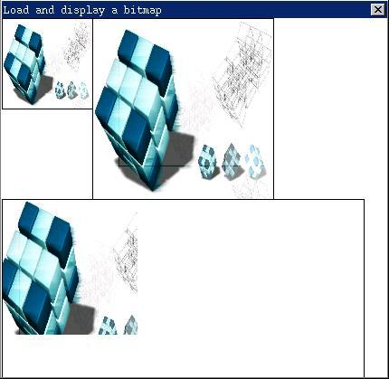

# 进程间通讯及异步事件处理

本章讲述在 MiniGUI-Processes 中应用程序如何处理异步事件，并在 MiniGUI 提供的接口之上完成进程间的通讯任务。

## 1 异步事件处理

一般而言，GUI 系统的应用程序编程接口主要集中于窗口、消息队列、图形设备等相关方面。但因为 GUI 系统在处理系统事件时通常会提供自己的机制，而这些机制往往会和操作系统本身提供的机制不相兼容。比如，MiniGUI 提供了消息循环机制，与此相应，应用程序的结构一般是消息驱动的；也就是说，应用程序通过被动接收消息来工作。但很多情况下，应用程序需要主动监视某个系统事件，比如在 UNIX 操作系统中，可以通过 select 系统调用监听某个文件描述符上是否有可读数据。这样，需要把 MiniGUI 的消息队列机制和现有操作系统的其他机制融合在一起，为应用程序提供一个一致的机制。本文将讲述几种解决这一问题的方法。

我们知道，在 MiniGUI-Processes 之上运行的应用程序只有一个消息队列。应用程序在初始化之后，会建立一个消息循环，然后不停地从这个消息队列当中获得消息并处理，直到接收到 `MSG_QUIT` 消息为止。应用程序的窗口过程在处理消息时，要在处理完消息之后立即返回，以便有机会获得其他的消息并处理。现在，如果应用程序在处理某个消息时监听某个文件描述符而调用 select 系统调用，就有可能会出现问题――因为 select 系统调用可能会长时间阻塞，而由 MiniGUI-Processes 服务器发送给客户的事件得不到及时处理。这样，消息驱动的方式和 select 系统调用就难于很好地融合。在 MiniGUI-Threads 中，因为每个线程都有自己相应的消息队列，而系统消息队列是由单独运行的 desktop 线程管理的，所以，任何一个应用程序建立的线程都可以长时间阻塞，从而可以调用类似 select 的系统调用。但在 MiniGUI-Processes 当中，如果要监听某个应用程序自己的文件描述符事件，必须进行恰当的处理，以避免长时间阻塞。

在 MiniGUI-Processes 当中，有几种解决这一问题的办法：

- 在调用 select 系统调用时，传递超时值，保证 select 系统调用不会长时间阻塞。
- 设置定时器，定时器到时，利用 select 系统调用查看被监听的文件描述符。如果没有相应的事件发生，则立即返回，否则进行读写操作。
- 利用 MiniGUI-Processes 提供的 `RegisterListenFD` 函数在系统中注册监听文件描述符，并在被监听的文件描述符上发生指定的事件时，向某个窗口发送 `MSG_FDEVENT` 消息。

由于前两种解决方法比较简单，这里我们重点讲述第三种解决办法。MiniGUI-Processes 为应用程序提供了如下两个函数及一个宏：

```c
#define MAX_NR_LISTEN_FD   5

/* Return TRUE if all OK, and FALSE on error. */
BOOL GUIAPI RegisterListenFD (int fd, int type, HWND hwnd, void* context);

/* Return TRUE if all OK, and FALSE on error. */
BOOL GUIAPI UnregisterListenFD (int fd);
```

- `MAX_NR_LISTEN_FD` 宏定义了系统能够监听的最多文件描述符数，默认定义为 5。
- `RegisterListenFD` 函数在系统当中注册一个需要监听的文件描述符，并指定监听的事件类型（`type` 参数，可取 `POLLIN`、`POLLOUT` 或者 `POLLERR`），接收 `MSG_FDEVENT` 消息的窗口句柄以及一个上下文信息。
- `UnregisterListenFD` 函数注销一个被注册的监听文件描述符。

在应用程序使用 `RegisterListenFD` 函数注册了被监听的文件描述符之后，当指定的事件发生在该文件描述符上时，系统会将 `MSG_FDEVENT` 消息发送到指定的窗口，应用程序可在窗口过程中接收该消息并处理。MiniGUI 中的 `libvcongui` 就利用了上述函数监听来自主控伪终端上的可读事件，如下面的程序段所示（`vcongui/vcongui.c`）：

```c
...

/* 注册主控伪终端伪监听文件描述符 */
RegisterListenFD (pConInfo->masterPty, POLLIN, hMainWnd, 0);

/* 进入消息循环 */
while (!pConInfo->terminate && GetMessage (&Msg, hMainWnd)) {
        DispatchMessage (&Msg);
}
/* 注销监听文件描述符 */
UnregisterListenFD (pConInfo->masterPty);

...

/* 虚拟控制台的窗口过程 */
static int VCOnGUIMainWinProc (HWND hWnd, int message, WPARAM wParam, LPARAM lParam)
{
        PCONINFO pConInfo;
        
        pConInfo = (PCONINFO)GetWindowAdditionalData (hWnd);
        switch (message) {
                
                ...
                
                /* 接收到 MSG_FDEVENT 消息，则处理主控伪终端上的输入数据 */
                case MSG_FDEVENT:
                ReadMasterPty (pConInfo);
                break;
                
                ...
        }
        
        /* 调用默认窗口过程 */
        if (pConInfo->DefWinProc)
        return (*pConInfo->DefWinProc)(hWnd, message, wParam, lParam);
        else
        return DefaultMainWinProc (hWnd, message, wParam, lParam);
}
```

在下一部分当中，我们还可以看到 `RegisterListenFD` 函数的使用。显然，通过这种简单的注册监听文件描述符的接口，MiniGUI-Processes 程序能够方便地利用底层的消息机制完成对异步事件的处理。

## 2 MiniGUI-Processes 与进程间通讯

我们知道，MiniGUI-Processes 采用 UNIX Domain Socket 实现客户程序和服务器程序之间的交互。应用程序也可以利用这一机制，完成自己的通讯任务――客户向服务器提交请求，而服务器完成对客户的请求处理并应答。一方面，在 MiniGUI-Processes 的服务器程序中，你可以扩展这一机制，注册自己的请求处理函数，完成定制的请求/响应通讯任务。另一方面，MiniGUI-Processes 当中也提供了若干用来创建和操作 UNIX Domain Socket 的函数，任何 MiniGUI-Processes 的应用程序都可以建立 UNIX Domain Socket，并完成和其他 MiniGUI-Processes 应用程序之间的数据交换。本文将举例讲述如何利用 MiniGUI-Processes 提供的函数完成此类通讯任务。在讲述具体接口之前，我们先看看 MiniGUI 的多进程模型以及服务器与客户间的通讯方式。

### 2.1 MiniGUI-Processes 的多进程模型

Processes 版本是支持客户服务器（C/S）方式的多进程系统，在运行过程中有且仅有一个服务器程序在运行，它的全局变量 `mgServer` 被设为 `TRUE`，其余的 MiniGUI 应用程序为客户，`mgServer` 变量被设为 `FALSE`。各个应用程序分别运行于各自不同的进程空间，如__图 1__ 所示。


__图 1__  多进程模型

目前的程序结构使每个加载的进程拥有一个自已的桌面模型及其消息队列，进程间的通信依靠以下所提到的进程通信模型来完成。

### 2.2 简单请求/应答处理

我们知道，MiniGUI-Processes 利用了 UNIX Domain Socket 实现服务器和客户程序之间的通讯。为了实现客户和服务器之间的简单方便的通讯，MiniGUI-Processes 中定义了一种简单的请求/响应结构。客户程序通过指定的结构将请求发送到服务器，服务器处理请求并应答。在客户端，一个请求定义如下（`minigui/minigui.h`）：

```c
typedef struct _REQUEST {
    int id;
    const void* data;
    size_t len_data;
} REQUEST;
typedef REQUEST* PREQUEST;
```
其中，id 是用来标识请求类型的整型数，data 是发送给该请求的关联数据，`len_data` 则是数据的长度。客户在初始化 `REQUEST` 结构之后，就可以调用 `ClientRequest1` 向服务器发送请求，并等待服务器的应答。该函数的原型如下。

```c
/* send a request to server and wait reply */
int ClientRequest (PREQUEST request, void* result, int len_rslt);
```

服务器程序（即 mginit）会在自己的消息循环当中获得来自客户的请求，并进行处理，最终会将处理结果发送给客户。服务器能够调用 `ServerSendReply1` 将结果发送给客户。

```c
int GUIAPI ServerSendReply (int clifd, const void* reply, int len);
```

在上述这种简单的客户/服务器通讯中，客户和服务器必须就每个请求类型达成一致，也就是说，客户和服务器必须了解每种类型请求的数据含义并进行恰当的处理。

MiniGUI-Processes 利用上述这种简单的通讯方法，实现了若干系统级的通讯任务：

- 鼠标光标的管理。鼠标光标是一个全局资源，当客户需要创建或者销毁鼠标光标，改变鼠标光标的形状、位置，显示或者隐藏鼠标时，就发送请求到服务器，服务器程序完成相应任务并将结果发送给客户。
- 层管理。当客户查询层的信息，新建层，加入某个已有层，或者删除层时，通过该接口发送请求到服务器。
- 窗口管理。当客户创建、销毁或者移动主窗口时，通过该接口发送请求到服务器。
- 其他一些系统级的任务。比如在新的 `GDI` 接口中，服务器程序统一管理显示卡中可能用来建立内存 `DC` 的显示内存，当客户要申请建立在显示内存中的内存 `DC` 时，就会发送请求到服务器。

为了让应用程序也能够通过这种简单的方式实现客户和服务器之间的通讯，服务器程序可以注册一些定制的请求处理函数，然后客户就可以向服务器发送这些请求。为此，MiniGUI-Processes 提供了如下接口：

```c
#define MAX_SYS_REQID           0x0014
#define MAX_REQID               0x0020

/* 
* Register user defined request handlers for server
* Note that user defined request id should larger than MAX_SYS_REQID
*/
typedef int (* REQ_HANDLER) (int cli, int clifd, void* buff, size_t len);
BOOL GUIAPI RegisterRequestHandler (int req_id, REQ_HANDLER your_handler);
REQ_HANDLER GUIAPI GetRequestHandler (int req_id);
```

服务器可以通过调用 `RegisterRequestHandler` 函数注册一些请求处理函数。注意请求处理函数的原型由 `REQ_HANDLER` 定义。还要注意系统定义了 `MAX_SYS_REQID` 和 `MAX_REQID` 这两个宏。`MAX_REQID` 是能够注册的最大请求 ID 号，而 `MAX_SYS_REQID` 是系统内部使用的最大的请求 ID 号，也就是说，通过 `RegisterRequestHandler` 注册的请求 ID 号，必须大于 `MAX_SYS_REQID` 而小于或等于 `MAX_REQID`。

作为示例，我们假设服务器替客户计算两个整数的和。客户发送两个整数给服务器，而服务器将两个整数的和发送给客户。下面的程序段在服务器程序中运行，在系统中注册了一个请求处理函数：

```c
typedef struct TEST_REQ
{
        int a, b;
} TEST_REQ;


static int test_request (int cli, int clifd, void* buff, size_t len)
{
        int ret_value = 0;
        TEST_REQ* test_req = (TEST_REQ*)buff;
        
        ret_value = test_req.a + test_req.b;
        
        return ServerSendReply (clifd, &ret_value, sizeof (int));
}

...
RegisterRequestHandler (MAX_SYS_REQID + 1, test_request);
...
```

而客户程序可以通过如下的程序段向客户发送一个请求获得两个整数的和：

```c
REQUEST req;
TEST_REQ test_req = {5, 10};
int ret_value;

req.id = MAX_SYS_REQID + 1;
req.data = &rest_req;
req.len_data = sizeof (TEST_REQ);

ClientRequest (&req, &ret_value, sizeof (int));
printf (“the returned value: %d\n”, ret_value);    /* ret_value 的值应该是 15 */
```

读者已经看到，通过这种简单的请求/应答技术，MiniGUI-Processes 客户程序和服务器程序之间可以建立一种非常方便的进程间通讯机制。但这种技术也有一些缺点，比如受到 `MAX_REQID` 大小的影响，通讯机制并不是非常灵活，而且请求只能发送给 MiniGUI-Processes 的服务器程序（即 mginit）处理等等。

### 2.3 UNIX Domain Socket 封装

为了解决上述简单请求/应答机制的不足，MiniGUI-Processes 也提供了经过封装的 UNIX Domain Socket 处理函数。这些函数的接口原型如下（`minigui/minigui.h`）：

```c
/* Used by server to create a listen socket.
* Name is the name of listen socket.
* Please located the socket in /var/tmp directory. */

/* Returns fd if all OK, -1 on error. */
int serv_listen (const char* name);

/* Wait for a client connection to arrive, and accept it.
* We also obtain the client's pid and user ID from the pathname
* that it must bind before calling us. */

/* returns new fd if all OK, < 0 on error */
int serv_accept (int listenfd, pid_t *pidptr, uid_t *uidptr);

/* Used by clients to connect to a server.
* Name is the name of the listen socket.
* The created socket will located at the directory /var/tmp,
* and with name of '/var/tmp/xxxxx-c', where 'xxxxx' is the pid of client.
* and 'c' is a character to distinguish diferent projects.
* MiniGUI use 'a' as the project character.
*/

/* Returns fd if all OK, -1 on error. */
int cli_conn (const char* name, char project);

#define SOCKERR_IO          -1
#define SOCKERR_CLOSED      -2
#define SOCKERR_INVARG      -3
#define SOCKERR_OK          0

/* UNIX domain socket I/O functions. */

/* Returns SOCKERR_OK if all OK, < 0 on error.*/
int sock_write_t (int fd, const void* buff, int count, unsigned int timeout);
int sock_read_t (int fd, void* buff, int count, unsigned int timeout);

#define sock_write(fd, buff, count) sock_write_t(fd, buff, count, 0)
#define sock_read(fd, buff, count) sock_read_t(fd, buff, count, 0)
```

上述函数是 MiniGUI-Processes 用来建立系统内部使用的 UNIX Domain Socket 并进行数据传递的函数，是对基本套接字系统调用的封装。这些函数的功能描述如下：

- `serv_listen`：服务器调用该函数建立一个监听套接字，并返回套接字文件描述符。建议将服务器监听套接字建立在 `/var/tmp/` 目录下。
- `serv_accept`：服务器调用该函数接受来自客户的连接请求。
- `cli_conn`：客户调用该函数连接到服务器，其中 `name` 是客户的监听套接字。该函数为客户建立的套接字将保存在 `/var/tmp/` 目录中，并且以 `<pid>-c` 的方式命名，其中 `c` 是用来区别不同套接字通讯用途的字母，由 `project` 参数指定。MiniGUI-Processes 内部使用了 ‘a’，所以由应用程序建立的套接字，应该使用除 ‘a’ 之外的字母。
- `sock_write_t`：在建立并连接之后，客户和服务器之间就可以使用 `sock_write_t` 函数和 `sock_read_t` 函数进行数据交换。`sock_write_t` 的参数和系统调用 `write` 类似，但可以传递进入一个超时参数，注意该参数以 10ms 为单位，为零时超时设置失效，且超时设置只在 `mginit` 程序中有效。
- `sock_read_t`：`sock_read_t` 的参数和系统调用 `read` 类似，但可以传递进入一个超时参数，注意该参数以 10ms 为单位，为零时超时设置失效，且超时设置只在 `mginit` 程序中有效。

下面的代码演示了作为服务器的程序如何利用上述函数建立一个监听套接字：

```c
#define LISTEN_SOCKET    “/var/tmp/mysocket”

static int listen_fd;

BOOL listen_socket (HWND hwnd)
{
        if ((listen_fd = serv_listen (LISTEN_SOCKET)) < 0)
        return FALSE;
        return RegisterListenFD (fd, POLL_IN, hwnd, NULL);
}
```

当服务器接收到来自客户的连接请求时，服务器的 `hwnd` 窗口将接收到 `MSG_FDEVENT` 消息，这时，服务器可接受该连接请求：

```c
int MyWndProc (HWND hwnd, int message, WPARAM wParam, LPARAM lParam)
{
        switch (message) {
                
                ...
                
                case MSG_FDEVENT:
                if (LOWORD (wParam) == listen_fd) { /* 来自监听套接字 */
                        pid_t pid;
                        uid_t uid;
                        int conn_fd;
                        conn_fd = serv_accept (listen_fd, &pid, &uid);
                        if (conn_fd >= 0) {
                                RegisterListenFD (conn_fd, POLL_IN, hwnd, NULL);
                        }
                }
                else { /* 来自已连接套接字 */
                        int fd = LOWORD(wParam);
                        /* 处理来自客户的数据 */
                        sock_read_t (fd, ...);
                        sock_write_t (fd, ....);
                }
                break;
                
                ...
                
        }
}
```

上面的代码中，服务器将连接得到的新文件描述符也注册为监听描述符，因此，在 `MSG_FDEVENT` 消息的处理中，应该判断导致 `MSG_FDEVENT` 消息的文件描述符类型，并做适当的处理。

在客户端，当需要连接到服务器时，可通过如下代码：

```c
int conn_fd;

if ((conn_fd  = cli_conn (LISTEN_SOCKET, ‘b’)) >= 0) {
        /* 向服务器发送请求 */
        sock_write_t (fd, ....);
        /* 获取来自服务器的处理结果 */
        sock_read_t (fd, ....);
}
```
