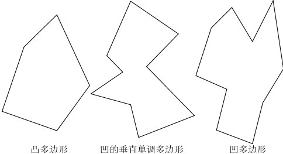
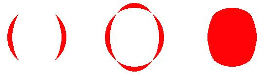
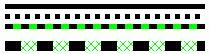
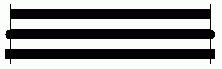
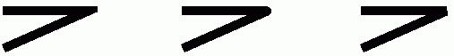
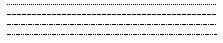
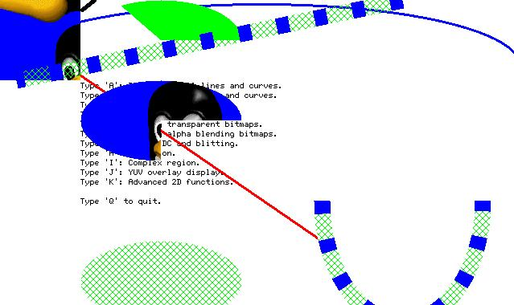

# 基于 NEWGAL 的高级 GDI 函数

在第 13 章中，我们曾提到在 MiniGUI 1.1.0 版本的开发中，重点对 `GAL` 和 `GDI` 进行了大规模的改良，几乎重新编写了所有代码。这些新的接口和功能，大大增强了 MiniGUI 的图形能力。本章将详细介绍新 `GDI` 的相关概念和接口。

## 1.1 新的区域算法

新的 `GDI` 采用了新的区域算法，即在 X Window 和其他 GUI 系统当中广泛使用的区域算法。这种区域称作“x-y-banned”区域，并且具有如下特点：

<<<<<<< HEAD:programming-guide-zh/MiniGUIProgGuidePart3Chapter03-zh.md
- 区域由互不相交的非空矩形组成。
- 区域又可以划分为若干互不相交的水平条带，每个水平条带中的矩形是等高，而且是上对齐的；或者说，这些矩形具有相同的高度，而且所有矩形的左上角 y 坐标相等。
- 区域中矩形的排列，首先是在 x 方向（在一个条带中）从左到右排列，然后按照 y 坐标从上到下排列。
=======
## 1 `Shadow` 图形引擎
>>>>>>> b010f5169ff89c84c1c0fde5ed38651bb12e1208:programming-guide-zh/MiniGUIProgGuidePart5Chapter03-zh.md

在 `GDI` 函数进行绘图输出时，可以利用 x-y-banned 区域的特殊性质进行绘图的优化。在将来版本中添加的绘图函数，将充分利用这一特性进行绘图输出上的优化。

新的 `GDI` 增加了如下接口，可用于剪切区域的运算（`minigui/gdi.h`）：

```c
BOOL GUIAPI PtInRegion (PCLIPRGN region, int x, int y);
BOOL GUIAPI RectInRegion (PCLIPRGN region, const RECT* rect);

void GUIAPI OffsetRegionEx (PCLIPRGN region, const RECT *rcClient, const RECT *rcScroll, int x, int y);
void GUIAPI OffsetRegion (PCLIPRGN region, int x, int y);

BOOL GUIAPI IntersectRegion (CLIPRGN *dst, const CLIPRGN *src1, const CLIPRGN *src2);
BOOL GUIAPI UnionRegion (PCLIPRGN dst, const CLIPRGN* src1, const CLIPRGN* src2);
BOOL GUIAPI SubtractRegion (CLIPRGN* rgnD, const CLIPRGN* rgnM, const CLIPRGN* rgnS);
BOOL GUIAPI XorRegion (CLIPRGN *dst, const CLIPRGN *src1, const CLIPRGN *src2);
```

- `PtInRegion` 函数可用来检查给定点是否位于给定的区域中。
- `RectInRegion` 函数可用来检查给定矩形是否和给定区域相交。
- `OffsetRegionEx`  该函数将剪切域处于两个矩形区域的重叠区的剪切矩形进行位移，位移之后，对进行了位移的剪切矩形再次判断，去掉了不在重叠区的剪切矩形部分。进行重叠运算的两个矩形区域，一个是剪切域所在矩形区域，另一个是剪切域位移后所在的矩形区域。
- `OffsetRegion`  该函数对剪切域简单的进行位移。
- `IntersectRegion` 函数对两个给定区域进行求交运算。
- `UnionRegion` 函数可合并两个不同的区域，合并后的区域仍然是 x-y-banned 的区域。
- `SubstractRegion` 函数从一个区域中减去另外一个区域。
- `XorRegion` 函数对两个区域进行异或运算，其结果相当于 `src1` 减 `src2` 的结果 A 与 `src2` 减 `src1` 的结果 B 之间的交。

除上述区域运算函数之外，MiniGUI 还提供了从多边形、椭圆等封闭曲线中生成区域的 `GDI` 函数，这样，就可以实现将 `GDI` 输出限制在特殊封闭曲线的效果。这些函数将在本章后面的小节中讲述。

## 1.2 光栅操作

光栅操作是指在进行绘图输出时，如何将要输出的象素点和屏幕上已有的象素点进行运算。最典型的运算是下面要讲到的 Alpha 混合。这里的光栅操作特指二进制的位操作，包括与、或、异或和直接的设置（覆盖）等等。应用程序可以利用 `SetRasterOperation` 和 `GetRasterOperation` 函数设置或者获取当前的光栅操作。这两个函数的原型如下（`minigui/gdi.h`）：

```c
#define ROP_SET         0
#define ROP_AND         1
#define ROP_OR          2
#define ROP_XOR         3

int GUIAPI GetRasterOperation (HDC hdc);
int GUIAPI SetRasterOperation (HDC hdc, int rop);
```

其中 `rop` 是指光栅操作方式，可选的参数有 `ROP_SET`（直接设置），`ROP_AND`（与），`POP_OR`（或）及 `POP_XOR`（异或）。

在设置了新的光栅操作之后，其后的一般图形输出将受到设定的光栅操作的影响，这些图形输出包括：`SetPixel`、`LineTo`、`Circle`、`Rectangle` 和 `FillCircle` 等等。需要注意的是，新的 `GDI` 函数引入了一个新的矩形填充函数――`FillBox`。`FillBox` 函数是不受当前的光栅操作影响的。这是因为 `FillBox` 函数会利用硬件加速功能实现矩形填充，并且该函数的填充速度非常快。

## 1.3 内存 `DC` 和 `BitBlt`

新的 `GDI` 函数增强了内存 `DC` 操作函数。`GDI` 函数在建立内存 `DC` 时，将调用 `GAL` 的相应接口。如前所述，`GAL` 将尽量把内存 `DC` 建立在显示卡的显示内存当中。这样，可以充分利用显示卡的硬件加速功能，实现显示内存中两个不同区域之间位块的快速移动、复制等等，包括透明处理和 Alpha 混合。应用程序可以建立一个具有逐点 Alpha 特性的内存 `DC`（每个点具有不同的 Alpha 值），也可以通过 `SetMemDCAlpha` 设置内存 `DC` 所有象素的 Alpha 值（或者称为“Alpha 通道”），然后利用 `BitBlt` 和 `StretchBlt` 函数实现 `DC` 之间的位块传送。应用程序还可以通过 `SetMemDCColorKey` 函数设置源 `DC` 的透明色，从而在进行 `BitBlt` 时跳过这些透明色。

有关内存 `DC` 的 `GDI` 函数有（`minigui/gdi.h`）：

```c
#define MEMDC_FLAG_NONE         0x00000000          /* None. */
#define MEMDC_FLAG_SWSURFACE    0x00000000          /* DC is in system memory */
#define MEMDC_FLAG_HWSURFACE    0x00000001          /* DC is in video memory */
#define MEMDC_FLAG_SRCCOLORKEY  0x00001000          /* Blit uses a source color key */
#define MEMDC_FLAG_SRCALPHA     0x00010000          /* Blit uses source alpha blending */
#define MEMDC_FLAG_RLEACCEL     0x00004000          /* Surface is RLE encoded */

HDC GUIAPI CreateCompatibleDC (HDC hdc);
HDC GUIAPI CreateMemDC (int width, int height, int depth, DWORD flags,
Uint32 Rmask, Uint32 Gmask, Uint32 Bmask, Uint32 Amask);
BOOL GUIAPI ConvertMemDC (HDC mem_dc, HDC ref_dc, DWORD flags);
BOOL GUIAPI SetMemDCAlpha (HDC mem_dc, DWORD flags, Uint8 alpha);
BOOL GUIAPI SetMemDCColorKey (HDC mem_dc, DWORD flags, Uint32 color_key);
HDC GUIAPI CreateMemDCFromBitmap (HDC hdc, BITMAP *bmp);
HDC GUIAPI CreateMemDCFromMyBitmap (const MYBITMAP *my_bmp, RGB *pal);
void GUIAPI DeleteMemDC (HDC mem_dc);
```

`CreateCompatibleDC` 函数创建一个和给定 `DC` 兼容的内存 `DC`。兼容的含义是指，新创建的内存 `DC` 的象素格式、宽度和高度与给定 `DC` 是相同的。利用这种方式建立的内存 `DC` 可以快速 `Blit` 到与之兼容的 `DC` 上。

这里需要对象素格式做进一步解释。象素格式包含了颜色深度（即每象素点的二进制位数）、调色板或者象素点中 `RGBA`（红、绿、蓝、Alpha）四个分量的组成方式。其中的 Alpha 分量，可以理解为一个象素点的透明度，0 表示完全透明，255 表示完全不透明。在 MiniGUI 中，如果颜色深度低于 8，则 `GAL` 会默认创建一个调色板，并且可以调用 `SetPalette` 函数修改调色板。如果颜色深度高于 8，则通过四个变量分别指定象素点中 `RGBA` 分量所占的位。如果是建立兼容 `DC`，则兼容内存 `DC` 和给定 `DC` 具有一样的颜色深度，同时具有一样的调色板或者一样的 `RGBA` 分量组成方式。

如果调用 `CreateMemDC` 函数，则可以指定新建内存 `DC` 的高度、宽度、颜色深度，以及必要的 `RGBA` 组成方式。在 MiniGUI 中，是通过各自在象素点中所占用的位掩码来表示 `RGBA` 四个分量的组成方式的。比如，如果要创建一个包含逐点 Alpha 信息的16 位内存 `DC`，则可以用每分量四个二进制位的方式分配 16 位的象素值，这样，`RGBA` 四个分量的掩码分别为：0x0000F000, 0x00000F00, 0x000000F0, 0x0000000F。

`ConvertMemDC` 函数用来将一个任意的内存 `DC` 对象，根据给定的参考 `DC` 的象素格式进行转换，使得结果 `DC` 具有和参考 `DC` 一样的象素格式。这样，转换后的 `DC` 就能够快速 `Blit` 到与之兼容的 `DC` 上。

<<<<<<< HEAD:programming-guide-zh/MiniGUIProgGuidePart3Chapter03-zh.md
`SetMemDCAlpha` 函数用来设定或者取消整个内存 `DC` 对象的 Alpha 通道值。我们还可以通过 `MEMDC_FLAG_RLEACCEL` 标志指定内存 `DC` 采用或者取消 `RLE` 编码方式。Alpha 通道值将作用在 `DC` 的所有象素点上。
=======
## 2 `MLShadow` 图形引擎
>>>>>>> b010f5169ff89c84c1c0fde5ed38651bb12e1208:programming-guide-zh/MiniGUIProgGuidePart5Chapter03-zh.md

`SetMemDCColorKey` 函数用来设定或者取消整个内存 `DC` 对象的 `ColorKey`，即透明象素值。我们还可以通过 `MEMDC_FLAG_RLEACCEL` 标志指定内存 `DC` 采用或者取消 `RLE` 编码方式。

`CreateMemDCFromBitmap` 函数可以创建一个指向设备相关位图并和指定 `DC` 兼容的内存 `DC`，这样可以实现快速的设备位图到屏幕的各种转换绘制。

`CreateMemDCFromMyBitmap` 函数创建指向设备无关位图的内存 `DC`。
`
内存 `DC` 和其他 `DC` 一样，也可以调用 `GDI` 的绘图函数向内存 `DC` 中进行任意的绘图输出，然后再 `BitBlt` 到其他 `DC` 中。__清单 1.1__ 中的程序来自 `mg-sample` 的 `graphic` 程序，它演示了如何使用内存 `DC` 向窗口 `DC` 进行透明和 Alpha 混合的 `Blitting` 操作。

__清单 1.1__  增强的 `BITMAP` 操作

```c
/* 逐点 Alpha 操作 */
mem_dc = CreateMemDC (400, 100, 16, MEMDC_FLAG_HWSURFACE | MEMDC_FLAG_SRCALPHA,
0x0000F000, 0x00000F00, 0x000000F0, 0x0000000F);

/* 设置一个不透明的刷子并填充矩形 */
SetBrushColor (mem_dc, RGBA2Pixel (mem_dc, 0xFF, 0xFF, 0x00, 0xFF));
FillBox (mem_dc, 0, 0, 200, 50);

/* 设置一个 25%  透明的刷子并填充矩形 */
SetBrushColor (mem_dc, RGBA2Pixel (mem_dc, 0xFF, 0xFF, 0x00, 0x40));
FillBox (mem_dc, 200, 0, 200, 50);

/* 设置一个半透明的刷子并填充矩形 */
SetBrushColor (mem_dc, RGBA2Pixel (mem_dc, 0xFF, 0xFF, 0x00, 0x80));
FillBox (mem_dc, 0, 50, 200, 50);

/* 设置一个 75% 透明的刷子并填充矩形 */
SetBrushColor (mem_dc, RGBA2Pixel (mem_dc, 0xFF, 0xFF, 0x00, 0xC0));
FillBox (mem_dc, 200, 50, 200, 50);
SetBkMode (mem_dc, BM_TRANSPARENT);

/* 以半透明的象素点输出文字 */
SetTextColor (mem_dc, RGBA2Pixel (mem_dc, 0x00, 0x00, 0x00, 0x80));
TabbedTextOut (mem_dc, 0, 0, "Memory DC with alpha.\n"
"The source DC have alpha per-pixel.");

/* Blit 到窗口 DC 上 */
start_tick = GetTickCount ();
count = 100;
while (count--) {
        BitBlt (mem_dc, 0, 0, 400, 100, hdc, rand () % 800, rand () % 800);
}
end_tick = GetTickCount ();
TellSpeed (hwnd, start_tick, end_tick, "Alpha Blit", 100);

/* 删除内存 DC */
DeleteMemDC (mem_dc);

/* 具有 Alpha 通道 的内存 DC：32 位，RGB 各占 8 位，无 Alpha 分量 */
mem_dc = CreateMemDC (400, 100, 32, MEMDC_FLAG_HWSURFACE | MEMDC_FLAG_SRCALPHA | MEMDC_FLAG_SRCCOLORKEY,
0x00FF0000, 0x0000FF00, 0x000000FF, 0x00000000);

/* 输出填充矩形和文本到内存 DC 上 */
SetBrushColor (mem_dc, RGB2Pixel (mem_dc, 0xFF, 0xFF, 0x00));
FillBox (mem_dc, 0, 0, 400, 100);
SetBkMode (mem_dc, BM_TRANSPARENT);
SetTextColor (mem_dc, RGB2Pixel (mem_dc, 0x00, 0x00, 0xFF));
TabbedTextOut (mem_dc, 0, 0, "Memory DC with alpha.\n"
"The source DC have alpha per-surface.");

/* Blit 到窗口 DC 上 */
start_tick = GetTickCount ();
count = 100;
while (count--) {
        /* 设置内存 DC 的 Alpha 通道 */
        SetMemDCAlpha (mem_dc, MEMDC_FLAG_SRCALPHA | MEMDC_FLAG_RLEACCEL, rand () % 256);
        BitBlt (mem_dc, 0, 0, 400, 100, hdc, rand () % 800, rand () % 800);
}
end_tick = GetTickCount ();
TellSpeed (hwnd, start_tick, end_tick, "Alpha Blit", 100);

/* 填充矩形区域， 并输出文字 */
FillBox (mem_dc, 0, 0, 400, 100);
SetBrushColor (mem_dc, RGB2Pixel (mem_dc, 0xFF, 0x00, 0xFF));
TabbedTextOut (mem_dc, 0, 0, "Memory DC with alpha and colorkey.\n"
"The source DC have alpha per-surface.\n"
"And the source DC have a colorkey, \n"
"and RLE accelerated.");

/* 设置内存 DC 的透明象素值 */
SetMemDCColorKey (mem_dc, MEMDC_FLAG_SRCCOLORKEY | MEMDC_FLAG_RLEACCEL, 
RGB2Pixel (mem_dc, 0xFF, 0xFF, 0x00));
/* Blit 到窗口 DC 上 */
start_tick = GetTickCount ();
count = 100;
while (count--) {
        BitBlt (mem_dc, 0, 0, 400, 100, hdc, rand () % 800, rand () % 800);
        CHECK_MSG;
}
end_tick = GetTickCount ();
TellSpeed (hwnd, start_tick, end_tick, "Alpha and colorkey Blit", 100);

/* 删除内存 DC 对象 */
DeleteMemDC (mem_dc);
```

## 1.4 增强的 `BITMAP` 操作

新的 `GDI` 函数增强了 `BITMAP` 结构，添加了对透明和 Alpha 通道的支持。通过设置 `bmType`、`bmAlpha`、`bmColorkey` 等成员，就可以使得 `BITMAP` 对象具有某些属性。然后可以利用 `FillBoxWithBitmap/Part` 函数将 `BITMAP` 对象绘制到某个 `DC` 上。你可以将 `BITMAP` 对象看成是在系统内存中建立的内存 `DC` 对象，只是不能向这种内存 `DC` 对象进行绘图输出。__清单 1.2__ 中的程序从图象文件中装载一个位图对象，然后设置透明和 Alpha 通道值，最后使用 `FillBoxWithBitmap` 函数输出到窗口 `DC` 上。该程序来自 `mg-sample` 的 `graphic` 演示程序。

__清单 1.2__ 增强的 `BITMAP` 操作

```c
int tox = 800, toy = 800;
int count;
BITMAP bitmap;
unsigned int start_tick, end_tick;

if (LoadBitmap (hdc, &bitmap, "res/icon.bmp"))
return;

bitmap.bmType = BMP_TYPE_ALPHACHANNEL;

/* 位图的 Alpha 混合 */
start_tick = GetTickCount ();
count = 1000;
while (count--) {
        tox = rand() % 800;
        toy = rand() % 800;
        
        /* 设置随机 Alpha 通道值 */
        bitmap.bmAlpha = rand() % 256;
        /* 显示到窗口 DC 上 */
        FillBoxWithBitmap (hdc, tox, toy, 0, 0, &bitmap);
}
end_tick = GetTickCount ();
TellSpeed (hwnd, start_tick, end_tick, "Alpha Blended Bitmap", 1000);

bitmap.bmType = BMP_TYPE_ALPHACHANNEL | BMP_TYPE_COLORKEY;
/*  取第一个象素点值，并设置为透明象素值 */
bitmap.bmColorKey = GetPixelInBitmap (&bitmap, 0, 0);

/* 透明及 Alpha 混合 */
start_tick = GetTickCount ();
count = 1000;
while (count--) {
        tox = rand() % 800;
        toy = rand() % 800;
        
        /*  设置一个随机 Alpha 通道值 */
        bitmap.bmAlpha = rand() % 256;
        /* 显示到窗口 DC 上 */
        FillBoxWithBitmap (hdc, tox, toy, 0, 0, &bitmap);
}
end_tick = GetTickCount ();
TellSpeed (hwnd, start_tick, end_tick, "Alpha Blended Transparent Bitmap", 1000);

UnloadBitmap (&bitmap);
```

你也可以通过 `CreateMemDCFromBitmap` 函数将某个 `BITMAP` 对象转换成内存 `DC` 对象。该函数的原型如下（`minigui/gdi.h`）：

```c
HDC GUIAPI CreateMemDCFromBitmap (HDC hdc, BITMAP* bmp);
```

需要注意的是，从 `BITMAP` 对象创建的内存 `DC` 直接使用 `BITMAP` 对象中的 `bmBits` 所指向的内存，该内存存在于系统内存，而不是显示内存中。

和 `BITMAP` 相关的 MY`BITMAP` 结构，新的 `GDI` 也做了一些增强。`MYBITMAP` 可以看成是设备无关的位图结构，你也可以利用 `CreateMemDCFromMyBitmap` 函数将一个 `MYBITMAP` 对象转换成内存 `DC`。该函数的原型如下（`minigui/gdi.h`）：

```c
HDC GUIAPI CreateMemDCFromMyBitmap (HDC hdc, MYBITMAP* mybmp);
```

<<<<<<< HEAD:programming-guide-zh/MiniGUIProgGuidePart3Chapter03-zh.md
需要注意的是，许多 `GAL` 引擎不能对系统内存到显示内存的 `BitBlt` 操作提供硬件加速，所以，`FillBoxWithBitmap` 函数，以及从 `BITMAP` 对象或者 `MYBITMAP` 对象创建的内存 `DC` 无法通过硬件加速功能快速 `BitBlt` 到其他 `DC` 上。如果希望达到这样的效果，可以通过预先创建的建立于显示内存中的 `DC` 进行快速的 `BitBlt` 运算。

## 1.5 新的 `GDI` 绘图函数

除了光栅操作以外，还添加了一些有用的 GDI 绘图函数，包括 `FillBox`、`FillCircle` 等等。已有的 `GDI` 函数有：
=======
## 3  `pc_xvfb` 图形引擎
>>>>>>> b010f5169ff89c84c1c0fde5ed38651bb12e1208:programming-guide-zh/MiniGUIProgGuidePart5Chapter03-zh.md

```c
void GUIAPI FillBox (HDC hdc, int x, int y, int w, int h);
void GUIAPI FillCircle (HDC hdc, int sx, int sy, int r);

BOOL GUIAPI ScaleBitmap (BITMAP* dst, const BITMAP* src);

BOOL GUIAPI GetBitmapFromDC (HDC hdc, int x, int y, int w, int h, BITMAP* bmp);

gal_pixel GUIAPI GetPixelInBitmap (const BITMAP* bmp, int x, int y);
BOOL GUIAPI SetPixelInBitmap (const BITMAP* bmp, int x, int y, gal_pixel pixel);
```

- `FillBox` 函数填充指定矩形，不受当前光栅操作影响。
- `FillCircle` 函数填充指定的圆，受当前光栅操作影响。
- `ScaleBitmap` 函数将源 `BITMAP` 对象进行伸缩处理。
- `GetBitmapFromDC` 函数将指定矩形范围内的象素复制到 `BITMAP` 对象中。
- `GetPixelInBitmap` 函数获得 `BITMAP` 对象中指定位置的象素值。
- `SetPixelInBitmap` 函数设置 `BITMAP` 对象中指定位置的象素值。

## 1.6 高级 `GDI` 绘图函数

### 1.6.1 图片缩放函数

MiniGUI 提供以下函数用于图片的缩放显示。

```c
int GUIAPI StretchPaintImageFromFile (HDC hdc, int x, int y, int w, int h, const char* spFileName);
int GUIAPI StretchPaintImageFromMem (HDC hdc, int x, int y, int w, int h, const void* mem, int size, const char* ext);
int GUIAPI StretchPaintImageEx (HDC hdc, int x, int y, int w, int h, MG_RWops* area, const char* ext);
```

- `StretchPaintImageFromFile` 用于从文件读入图片信息并进行缩放处理。`hdc` 为绘图的图形设备上下文句柄，x 和 y 表示处理后的图片在图形设备上的绘制位置，w 和 h 表示图像被缩放后的宽度和高度，`spFileName` 为图片文件名的指针。
- `StretchPaintImageFromMem` 用于从内存中读取图片信息并进行缩放处理。`hdc` 表示绘图的图形设备上下文句柄，x 和 y 表示处理后的图片在图形设备上的绘制位置，w 和 h 表示图像被缩放后的宽度和高度，`mem` 指向内存中保存图片信息的数据块，`size`	表示 `mem` 指向的数据块的大小，`ext` 为图片的文件类型，即文件扩展名。
- `StretchPaintImageEx` 用于从数据源中读取图片信息并同时进行缩放处理。`hdc` 表示绘图的图形设备上下文句柄，x 和 y 表示处理后的图片在图形设备上的绘制位置，w 和 h 表示图像被缩放后的宽度和高度，`area` 表示数据源，`ext` 为图片的文件类型，即文件扩展名。

<<<<<<< HEAD:programming-guide-zh/MiniGUIProgGuidePart3Chapter03-zh.md
### 1.6.2 图片旋转函数
=======
## 4  `rtos_xvfb` 图形引擎
>>>>>>> b010f5169ff89c84c1c0fde5ed38651bb12e1208:programming-guide-zh/MiniGUIProgGuidePart5Chapter03-zh.md

MiniGUI 提供以下函数用于支持图片的旋转，并在旋转的同时支持缩放。

```c
void GUIAPI PivotScaledBitmapFlip (HDC hdc, const BITMAP *bmp, fixed x, fixed y, fixed cx, fixed cy, int angle, fixed scale_x, fixed scale_y, BOOL h_flip, BOOL v_flip);
void GUIAPI RotateBitmap (HDC hdc, const BITMAP* bmp, int lx, int ty, int angle);
void GUIAPI PivotBitmap (HDC hdc, const BITMAP *bmp, int x, int y, int cx, int cy, int angle);
void GUIAPI RotateScaledBitmap (HDC hdc, const BITMAP *bmp, int lx, int ty, int angle, int w, int h);
void GUIAPI RotateBitmapVFlip (HDC hdc, const BITMAP *bmp, int lx, int ty, int angle); 
void GUIAPI RotateBitmapHFlip (HDC hdc, const BITMAP *bmp, int lx, int ty, int angle);
void GUIAPI RotateScaledBitmapVFlip (HDC hdc, const BITMAP *bmp, int lx, int ty, int angle, int w, int h);
void GUIAPI RotateScaledBitmapHFlip (HDC hdc, const BITMAP *bmp, int lx, int ty, int angle, int w, int h);
```

- `PivotScaledBitmapFlip` 用于将位图进行垂直或水平翻转，并且可以缩放至指定宽度、高度，同时绕指定点旋转一指定的角度 angle 并将它画在 `DC` 的指定位置。在该函数中，旋转角度以 1 度的 1/64 为单位。其中，`hdc` 为绘图的图形设备上下文句柄，`bmp` 是指向 `BIPMAP` 对象的指针，x 和 y 是对位图进行旋转操作时旋转中心点在 `DC` 中的坐标，cx 和 cy 是被旋转图片的旋转中心点，这个点是相对于被旋转图片的，即相对于被旋转图片（0，0）点的偏移。x，y，cx 和 cy 四个参数使用的是 MiniGUI 的 `fixed` 数据类型（定点数），angle 表示旋转的角度，`scale_x` 和 `scale_y` 表示对图片进行缩放时 x 轴和 y 轴的缩放比例，采用定点数表示。`h_flip` 和 `v_flip` 是对图片进行水平与垂直翻转的标识，`TRUE` 为翻转，`FALSE` 反之。
- `RotateBitmap` 函数可对位图进行绕中心旋转。`hdc` 为绘图的图形设备上下文句柄，`bmp` 是指向被旋转的 `BIPMAP` 对象的指针，lx 和 ty 是位图左上角点在 `DC` 上的坐标，angle 表示旋转角度，单位是 1 度的 1/64。
- `PivotBitmap` 函数可对位图进行绕指定旋转中心进行旋转。`hdc` 为绘图的图形设备上下文句柄，`bmp` 是指向被旋转的 `BIPMAP` 对象的指针，x 和 y 为旋转中心点在 `DC` 上的坐标，cx 和 cy 是旋转中心在位图上的坐标，angle 是旋转的角度，单位为 1 度的 1/64。
- `RotateScaledBitmap` 函数用于将位图缩放至指定的宽度和高度并绕中心旋转指定的角度。`hdc` 为绘图的图形设备上下文句柄，`bmp` 是指向被处理的 `BIPMAP` 对象的指针，lx 和 ty 是位图左上角点在 `DC` 上的坐标，angle 表示旋转角度，单位是 1 度的 1/64。w 和 h 表示位图缩放后的宽度和高度。
- `RotateBitmapVFlip` 函数用于将位图垂直翻转并绕中心旋转，`hdc` 为绘图的图形设备上下文句柄，`bmp` 是指向被处理的 `BIPMAP` 对象的指针，lx 和 ty 是位图左上角点在 `DC` 上的坐标，angle 表示旋转角度，单位是 1 度的 1/64。
- `RotateBitmapHFlip` 函数用于将位图水平翻转并绕中心旋转，该函数参数含义与 `RotateBitmapVFlip` 相同。
- `RotateScaledBitmapVFlip` 函数用于将位图垂直翻转，缩放到指定的宽度和高度并绕中心旋转。`hdc` 为绘图的图形设备上下文句柄，`bmp` 是指向被处理的 `BIPMAP` 对象的指针，lx 和 ty 是位图左上角点在 `DC` 上的坐标，angle 表示旋转角度，单位是 1 度的 1/64。w 和 h 表示位图缩放后的宽度和高度。
- `RotateScaledBitmapHFlip` 函数用于将位图水平翻转，缩放到指定的宽度和高度并绕中心旋转。该函数参数含义与 `RotateScaledBitmapVFlip` 相同。

### 1.6.3 圆角矩形

MiniGUI 中提供函数 `RoundRect` 用于绘制圆角矩形。

```c
BOOL GUIAPI RoundRect (HDC hdc, int x0, int y0, int x1, int y1, int rw, int rh);
```

`hdc` 表示绘图用到的图形设备上下文句柄，x0 和 y0 表示矩形的左上角座标，x1 和 y1 表示矩形右下角的坐标。rw 表示圆角的 x 轴方向的长轴（或短轴）的 1/2 长度，rh 表示圆角的 y 轴方向的长轴（或短轴）的 1/2 长度。

## 1.7 曲线和填充生成器

在一般的图形系统中，通常给用户提供若干用于进行直线或者复杂曲线，比如圆弧、椭圆和样条曲线的绘图函数。用户可以通过这些函数进行绘图，但不能利用这些系统中已有的曲线生成算法完成其他的工作。在 MiniGUI 新的 `GDI` 接口设计当中，我们采用了一种特殊的设计方法来实现曲线和封闭曲线的填充，这种方法非常灵活，而且给用户提供了直接使用系统内部算法的机会：

- 系统中定义了若干用来生成直线和曲线的函数，我们称之为“曲线生成器”。
- 用户在调用生成器之前，需要定义一个回调函数，并将函数地址传递给曲线生成器，曲线生成器在生成了一个曲线上的点或者封闭曲线中的一条水平填充线时，将调用这个回调函数。
- 用户可以在回调函数当中完成针对新的点或者新的水平填充线的操作。对 MiniGUI 绘图函数来说，就是完成绘图工作。
- 因为回调函数在生成器的运行过程中不断调用，为了保持一致的上下文环境，系统允许用户在调用曲线生成器时传递一个表示上下文的指针，生成器将把该指针传递给回调函数。

下面将分小节讲述目前的 MiniGUI 版本所提供的曲线和填充生成器。

### 1.7.1 直线剪切器和直线生成器

直线剪切器和生成器的原型如下：

```c
/* Line clipper */
BOOL GUIAPI LineClipper (const RECT* cliprc, int *_x0, int *_y0, int *_x1, int *_y1);

/* Line generators */
typedef void (* CB_LINE) (void* context, int stepx, int stepy);
void GUIAPI LineGenerator (void* context, int x1, int y1, int x2, int y2, CB_LINE cb);
```

直线剪切器并不是生成器，它用于对给定的直线进行剪切操作。`cliprc` 是给定的直线，而 `_x0`、`_y0`、`_x1` 和 `_y1` 传递要剪切的直线起始端点，并通过这些指针返回剪切之后的直线起始端点。MiniGUI 内部使用了 `Cohen-Sutherland` 算法。

`LineGenerator` 是采用 `Breshenham` 算法的生成器。该生成器从给定直线的起始端点开始，每生成一个点调用一次 `cb` 回调函数，并传递上下文 `context`、以及新的点相对于上一个点的步进值或者差量。比如，传递 `stepx =1`，`stepy = 0` 表示新的点比上一个点在 X 轴上前进一步，而在 Y 轴上保持不变。回调函数可以在步进值基础上实现某种程度上的优化。

### 1.7.2 圆生成器

MiniGUI 定义的圆生成器原型如下：

```c
/* Circle generator */
typedef void (* CB_CIRCLE) (void* context, int x1, int x2, int y);
void GUIAPI CircleGenerator (void* context, int sx, int sy, int r, CB_CIRCLE cb);
```

首先要指定圆心坐标以及半径，并传递上下文信息以及回调函数，每生成一个点，生成器将调用一次 `cb` 回调函数，并传递三个值：x1、x2 和 y。这三个值实际表示了圆上的两个点：(x1, y) 和 (x2, y)。因为圆的对称性，生成器只要计算圆上的四分之一圆弧点即可得出圆上所有的点。

### 1.7.3 椭圆生成器

椭圆生成器和圆生成器类似，原型如下：

```c
/* Ellipse generator */
typedef void (* CB_ELLIPSE) (void* context, int x1, int x2, int y);
void GUIAPI EllipseGenerator (void* context, int sx, int sy, int rx, int ry, CB_ELLIPSE cb);
```

首先要指定椭圆心坐标以及 X 轴和 Y 轴半径，并传递上下文信息以及回调函数，每生成一个点，生成器将调用一次 `cb` 回调函数，并传递三个值：x1、x2 和 y。这三个值实际表示了椭圆上的两个点：(x1, y) 和 (x2, y)。因为椭圆的对称性，生成器只要计算椭圆上的二分之一圆弧点即可得出椭圆上所有的点。

### 1.7.4 圆弧生成器

MiniGUI 定义的圆弧生成器如下所示：

```c
/* Arc generator */
typedef void (* CB_ARC) (void* context, int x, int y);
void GUIAPI CircleArcGenerator (void* context, int sx, int sy, int r, int ang1, int ang2, CB_ARC cb);
```

<<<<<<< HEAD:programming-guide-zh/MiniGUIProgGuidePart3Chapter03-zh.md
首先要指定圆弧的圆心、半径、起始角度和终止角度。需要注意的是，起始角度和终止角度是以 1/64 度为单位表示的，而不是浮点数。然后传递 `cb` 回调函数。每生成一个圆弧上的点，该函数将调用回调函数，并传递新点的坐标值 (x, y)。
=======
## 5 `CommLCD` 引擎
>>>>>>> b010f5169ff89c84c1c0fde5ed38651bb12e1208:programming-guide-zh/MiniGUIProgGuidePart5Chapter03-zh.md

### 1.7.5 垂直单调多边形生成器

通常而言，多边形有凸多边形和凹多边形之分。这里的垂直单调多边形，是为了优化多边形填充算法而针对计算机图形特点而提出的一种特殊多边形，这种多边形的定义如下：垂直单调多边形是指，多边形的边和计算机屏幕上的所有水平扫描线，只能有一个或者两个交点，不会有更多交点。__图 1.1__ 给出了凸多边形、凹多边形和垂直单调多边形的几个示例。


__图 1.1__ 各种多边形

需要注意的是，凸多边形一定是垂直单调多边形，但垂直单调多边形可以是凹多边形。显然，普通的多边形填充算法需要判断多边形边和每条屏幕扫描线之间的交点个数，而垂直单调多边形则可以免去这一判断，所以可以大大提高多边形填充的速度。

MiniGUI 所定义的垂直单调多边形相关函数原型如下：

```c
/* To determine whether the specified Polygon is Monotone Vertical Polygon */
BOOL GUIAPI PolygonIsMonotoneVertical (const POINT* pts, int vertices);

/* Monotone vertical polygon generator */
typedef void (* CB_POLYGON) (void* context, int x1, int x2, int y);
BOOL GUIAPI MonotoneVerticalPolygonGenerator (void* context, const POINT* pts, int vertices, CB_POLYGON cb);
```

`PolygonIsMonotoneVertical` 用来判断给定的多边形是否是垂直单调多边形，而 `MonotoneVerticalPolygonGenerator` 函数是垂直多边形生成器。在 MiniGUI 当中，多边形是由组成多边形的顶点来表示的。`pts` 表示顶点数组，而 `vertices` 表示顶点个数。生成器生成的实际是填充多边形的每一条水平线，端点为 (x1, y) 和 (x2, y)。

### 1.7.6 一般多边形生成器

MiniGUI 还提供了一般的多边形生成器，该生成器可以处理凸多边形，也可以处理凹多边形。原型如下：

```c
/* General polygon generator */
typedef void (* CB_POLYGON) (void* context, int x1, int x2, int y);
BOOL GUIAPI PolygonGenerator (void* context, const POINT* pts, int vertices, CB_POLYGON cb);
```

和垂直单调多边形生成器一样，该函数生成的是填充多边形的每一条水平扫描线：x1 是水平线的起始X坐标；x2 是水平线的终止 X 坐标；y 是水平线的 Y 坐标值。

### 1.7.7 填注生成器

填注（flood filling）生成器比较复杂。这个函数在 MiniGUI 内部用于 `FloodFill` 函数。我们知道，`FloodFill` 函数从给定的起始位置开始，以给定的颜色向四面八方填充某个区域（像水一样蔓延，因此叫 Flood Filling），一直到遇到与给定起始位置的象素值不同的点为止。因此，在这一过程中，我们需要两个回调函数，一个回调函数用来判断蔓延过程中遇到的点的象素值是否和起始点相同，另外一个回调函数用来生成填充该区域的水平扫描线。在进行绘图时，该函数比较的是象素值，但实际上，该函数也可以比较任何其他值，从而完成特有的蔓延动作。这就是将填注生成器单独出来的初衷。
MiniGUI 如下定义填注生成器：

```c
/* General Flood Filling generator */
typedef BOOL (* CB_EQUAL_PIXEL) (void* context, int x, int y);
typedef void (* CB_FLOOD_FILL) (void* context, int x1, int x2, int y);
BOOL GUIAPI FloodFillGenerator (void* context, const RECT* src_rc, int x, int y, 
CB_EQUAL_PIXEL cb_equal_pixel, CB_FLOOD_FILL cb_flood_fill);
```

`cb_equal_pixel` 被调用，以便判断目标点的象素值是否和起始点一样，起始点的象素值可以通过 `context` 来传递。`cb_flood_fill` 函数用来填充一条扫描线，传递的是水平扫描线的端点，即(x1, y) 和 (x2, y)。

### 1.7.8 曲线和填充生成器的用法

曲线和填充生成器的用法非常简单。为了对曲线和填充生成器有个更好的了解，我们首先看 MiniGUI 内部是如何使用曲线和填充生成器的。

下面的程序段来自 MiniGUI 的 `FloodFill` 函数（`src/newgdi/flood.c`）：

```c
static void _flood_fill_draw_hline (void* context, int x1, int x2, int y)
{
        PDC pdc = (PDC)context;
        RECT rcOutput = {MIN (x1, x2), y, MAX (x1, x2) + 1, y + 1};
        
        ENTER_DRAWING (pdc, rcOutput);
        _dc_draw_hline_clip (context, x1, x2, y);
        LEAVE_DRAWING (pdc, rcOutput);
}

static BOOL equal_pixel (void* context, int x, int y)
{
        gal_pixel pixel = _dc_get_pixel_cursor ((PDC)context, x, y);
        
        return ((PDC)context)->skip_pixel == pixel;
}

/* FloodFill
* Fills an enclosed area (starting at point x, y).
*/ 
BOOL GUIAPI FloodFill (HDC hdc, int x, int y)
{
        PDC pdc;
        BOOL ret = TRUE;
        
        if (!(pdc = check_ecrgn (hdc)))
        return TRUE;
        
        /* hide cursor tempororily */
        ShowCursor (FALSE);
        
        coor_LP2SP (pdc, &x, &y);
        
        pdc->cur_pixel = pdc->brushcolor;
        pdc->cur_ban = NULL;
        
        pdc->skip_pixel = _dc_get_pixel_cursor (pdc, x, y);
        
        /* does the start point have a equal value? */
        if (pdc->skip_pixel == pdc->brushcolor)
        goto equal_pixel;
        
        ret = FloodFillGenerator (pdc, &pdc->DevRC, x, y, equal_pixel, _flood_fill_draw_hline);
        
        equal_pixel:
        UNLOCK_GCRINFO (pdc);
        
        /* Show cursor */
        ShowCursor (TRUE);
        
        return ret;
}

```

该函数在经过一些必要的初始化工作之后，调用 `FloodFillGenerator` 函数，并传递了上下文 `pdc` （`pdc` 是 MiniGUI 内部表示 `DC` 的数据结构）和两个回调函数地址：`equal_pixel` 和 `_flood_fill_draw_hline` 函数。在这之前，该函数获得了起始点的象素值，并保存在了 `pdc->skip_pixel` 当中。`equal_pixel` 函数获得给定点的象素值，然后返回与 `pdc->skip_pixel` 相比较之后的值；`_flood_fill_draw_hline` 函数调用内部函数进行水平线的绘制。

读者可以看到，这种简单的生成器实现方式，能够大大降低代码复杂度，提高代码的重用能力。有兴趣的读者可以比较 MiniGUI 新老 `GDI` 接口的 `LineTo` 函数实现，相信能够得出一样的结论。
当然设计生成器的目的主要还是为方便用户使用。比如，你可以利用 MiniGUI 内部的曲线生成器完成自己的工作。下面的示例假定你使用圆生成器绘制一个线宽为 4 象素的圆：

```c
static void draw_circle_pixel (void* context, int x1, int x2, int y)
{
        HDC hdc = (HDC) context;
        
        /* 以圆上的每个点为圆心，填充半径为 2 的圆。*/
        FillCircle (hdc, x1, y, 2);
        FillCircle (hdc, x2, y, 2);
}

void DrawMyCircle (HDC hdc, int x, int y, int r, gal_pixel pixel)
{
        gal_pixel old_brush;
        
        old_bursh = SetBrushColor (hdc, pixle);
        
        /* 调用圆生成器 */
        CircleGenerator ((void*)hdc, x, y, r, draw_circle_pixel);
        
        /* 恢复旧的画刷颜色 */
        SetBrushColor (hdc, old_brush);
}
```

<<<<<<< HEAD:programming-guide-zh/MiniGUIProgGuidePart3Chapter03-zh.md
从上面的例子可以看出，曲线和填充生成器的用法极其简单，而且结构清晰明了。读者在自己的开发过程中，也可以学习这种方法。
=======
## 6 `Comm IAL` 引擎
>>>>>>> b010f5169ff89c84c1c0fde5ed38651bb12e1208:programming-guide-zh/MiniGUIProgGuidePart5Chapter03-zh.md

## 1.8 绘制复杂曲线

基于 1.7 中描述的曲线生成器，MiniGUI 提供了如下基本的曲线绘制函数：

```c
void GUIAPI MoveTo (HDC hdc, int x, int y);
void GUIAPI LineTo (HDC hdc, int x, int y);
void GUIAPI Rectangle (HDC hdc, int x0, int y0, int x1, int y1);
void GUIAPI PollyLineTo (HDC hdc, const POINT* pts, int vertices);
void GUIAPI SplineTo (HDC hdc, const POINT* pts);
void GUIAPI Circle (HDC hdc, int sx, int sy, int r);
void GUIAPI Ellipse (HDC hdc, int sx, int sy, int rx, int ry);
void GUIAPI CircleArc (HDC hdc, int sx, int sy, int r, int ang1, int ang2);
```

- `MoveTo` 将当前画笔的起始点移动到给定点（x, y），以逻辑坐标指定。
- `LineTo` 从当前画笔点画直线到给定点（x, y），以逻辑坐标指定。
- `Rectangle` 函数画顶点为（x0, y0）和（x1, y0）的矩形。
- `PollyLineTo` 函数利用 `LineTo` 函数画折线。`pts` 指定了折线的各个端点，`vertices` 指定了折线端点个数。
- `SplineTo` 函数利用 `LineTo` 函数画三次样条曲线。需要注意的是，必须传递四个点才能惟一确定一条样条曲线，也就是说，`pts` 是一个指向包含 4 个 `POINT` 结构数组的指针。
- `Circle` 函数绘制圆，圆心为 (sx, sy)，半径为 r，以逻辑坐标指定。
- `Ellipse` 函数绘制椭圆，椭圆心为（sx, sy），X 轴半径为 rx，Y 轴半径为 ry。
- `CircleArc` 函数绘制圆弧，（sx, sy） 指定了圆心，r 指定半径，ang1 和 ang2 指定圆弧的起始角度和终止角度。需要注意的是，ang1 和 ang2 是以 1/64 度为单位表示的。

作为示例，我们看 `Circle` 和 `Ellipse` 函数的用法。假定给定了两个点，pts[0] 和 pts[1]，其中 pts[0] 是圆心或者椭圆心，而 pts[1] 是圆或者椭圆外切矩形的一个顶点。下面的程序段绘制由这两个点给定的圆或者椭圆：

<<<<<<< HEAD:programming-guide-zh/MiniGUIProgGuidePart3Chapter03-zh.md
```c
int rx = ABS (pts[1].x - pts[0].x);
int ry = ABS (pts[1].y - pts[0].y);
=======
## 7 `Custom IAL` 引擎
>>>>>>> b010f5169ff89c84c1c0fde5ed38651bb12e1208:programming-guide-zh/MiniGUIProgGuidePart5Chapter03-zh.md

if (rx == ry)
Circle (hdc, pts[0].x, pts[0].y, rx);
else
Ellipse (hdc, pts[0].x, pts[0].y, rx, ry);
```

## 1.9 封闭曲线填充

MiniGUI 目前提供了如下的封闭曲线填充函数：

```c
void GUIAPI FillBox (HDC hdc, int x, int y, int w, int h);
void GUIAPI FillCircle (HDC hdc, int sx, int sy, int r);
void GUIAPI FillEllipse (HDC hdc, int sx, int sy, int rx, int ry);
BOOL GUIAPI FillPolygon (HDC hdc, const POINT* pts, int vertices);
BOOL GUIAPI FloodFill (HDC hdc, int x, int y);
```

- `FillBox` 函数填充指定的矩形。该矩形左上角顶点为（x, y），宽度为 w，高度为 h，以逻辑坐标指定。
- `FillCircle` 函数填充指定的圆。圆心为（sx, xy），半径为 r，以逻辑坐标指定。
- `FillEllips` 函数填充指定的椭圆。椭圆心为（sx, sy），X 轴半径为 rx，Y 轴半径为 ry。
- `FillPolygon` 函数填充多边形。`pts` 表示多边形各个顶点，`vertices` 表示多边形顶点个数。
- `FloodFill` 从指定点（x, y）开始填注。

需要注意的是，所有填充函数使用当前画刷属性（颜色），并且受当前光栅操作的影响。

下面的例子说明了如何使用 `FillCircle` 和 `FillEllipse` 函数填充圆或者椭圆。假定给定了两个点，pts[0] 和 pts[1]，其中 pts[0] 是圆心或者椭圆心，而 pts[1] 是圆或者椭圆外切矩形的一个顶点。

```c
<<<<<<< HEAD:programming-guide-zh/MiniGUIProgGuidePart3Chapter03-zh.md
int rx = ABS (pts[1].x - pts[0].x);
int ry = ABS (pts[1].y - pts[0].y);

if (rx == ry)
FillCircle (hdc, pts[0].x, pts[0].y, rx);
else
FillEllipse (hdc, pts[0].x, pts[0].y, rx, ry);
```

## 1.10 建立复杂区域

除了利用填充生成器进行填充绘制以外，我们还可以使用填充生成器建立由封闭曲线包围的复杂区域。我们知道，MiniGUI 当中的区域是由互不相交的矩形组成的，并且满足 x-y-banned 的分布规则。利用上述的多边形或者封闭曲线生成器，可以将每条扫描线看成是组成区域的高度为 1 的一个矩形，这样，我们可以利用这些生成器建立复杂区域。MiniGUI 利用现有的封闭曲线生成器，实现了如下的复杂区域生成函数：

```c
BOOL GUIAPI InitCircleRegion (PCLIPRGN dst, int x, int y, int r);
BOOL GUIAPI InitEllipseRegion (PCLIPRGN dst, int x, int y, int rx, int ry);
BOOL GUIAPI InitPolygonRegion (PCLIPRGN dst, const POINT* pts, int vertices);
```

利用这些函数，我们可以将某个区域分别初始化为圆、椭圆和多边形区域。然后，可以利用这些区域进行点击测试（`PtInRegion` 和 `RectInRegion`），或者选择到 `DC` 当中作为剪切域，从而获得特殊显示效果。__图 1.2__ 给出的就是 mg-sample 中 graphic 程序给出的特殊区域效果。创建__图 1.2__ 所示特殊区域的代码如__清单 1.3__ 所示。

__清单 1.3__ 创建特殊区域

```c
static BLOCKHEAP my_cliprc_heap;

static void GDIDemo_Region (HWND hWnd, HDC hdc)
=======
typedef struct tagINPUT
{
        char*   id;
        
        // Initialization and termination
        BOOL (*init_input) (struct tagINPUT *input, const char* mdev, const char* mtype);
        void (*term_input) (void);
        
        // Mouse operations
        int  (*update_mouse) (void);
        void (*get_mouse_xy) (int* x, int* y);
        void (*set_mouse_xy) (int x, int y);
        int  (*get_mouse_button) (void);
        void (*set_mouse_range) (int minx, int miny, int maxx, int maxy);
        void (*suspend_mouse) (void);
        int (*resume_mouse) (void);
        
        // Keyboard operations
        int  (*update_keyboard) (void);
        const char* (*get_keyboard_state) (void);
        void (*suspend_keyboard) (void);
        int (*resume_keyboard) (void);
        void (*set_leds) (unsigned int leds);
        
        // Event
        int (*wait_event) (int which, int maxfd, fd_set *in, fd_set *out, 
        fd_set *except, struct timeval *timeout);
        
        char mdev [MAX_PATH + 1];
}INPUT;
```

这些成员的功能如下：

- `update_mouse` 通知底层引擎更新鼠标信息
- `get_mouse_xy` 上层调用该函数可获得最新的鼠标 x,y 坐标值
- `set_mouse_xy` 上层调用该函数可以设置鼠标位置到新的坐标值。对不支持这一功能的引擎，该成员可为空
- `get_mouse_button` 获取鼠标按钮状态。返回值可以是 `IAL_MOUSE_LEFTBUTTON`、 `IAL_MOUSE_MIDDLEBUTTON`、`IAL_MOUSE_RIGHTBUTTON` 等值“或”的结果。 分别表示鼠标左键、中键、右键的按下状态
- `set_mouse_range` 设置鼠标的活动范围。对不支持这一功能的引擎，可设置该成员为空
- `update_keyboard` 通知底层引擎更新键盘信息
- `get_keyboard_state` 获取键盘状态，返回一个字符数组，其中包含以扫描码索引的键盘按键状态， 按下为 1，释放为 0
- `suspend_keyboard` 暂停键盘设备读取，用于虚拟控制台切换。对嵌入式设备来讲，通常可设置为空
- `resume_keyboard` 继续键盘设备读取，用于虚拟控制台切换。对嵌入式设备来讲，通常可设置为空
- `set_leds` 设置键盘的锁定 `LED`，用于设置大写锁定、数字小键盘锁定、滚动锁定等
- `wait_event` 上层调用该函数等待底层引擎上发生输入事件； 需要注意的是，该函数对 MiniGUI-Threads 和 MiniGUI-Processes 版本具有不同的接口，并且一定要利用 `select` 或者等价的 `poll` 系统调用实现这个函数

## 8 `Custom IAL` 引擎实例

其实开发一个新的 `IAL` 引擎并不困难。用户可通过 `customial.h` 定义的接口 来定制 `custom IAL` 输入引擎。下面以 `iPAQ` 为例，说明如何定制用户输入引擎（custom IAL）。

COMPAQ 公司生产的 `iPAQ` 是基于 `StrongARM` 的一款高端手持终端产品，它含有触摸屏以及几个控制键。触摸屏类似 PC 上的鼠标，但只能区分左键。对按键，我们可以将其模拟为 PC 键盘的某几个控制键，比如光标键、`ENTER` 键、功能键等等。该引擎的源代码见清单 1。

__清单 1__  以 `iPAQ` 为例的定制输入引擎（custom IAL）

```c
#include <stdio.h>
#include <stdlib.h>
#include <string.h>
#include <unistd.h>
#include <sys/ioctl.h>
#include <sys/poll.h>
#include <linux/kd.h>
#include <sys/types.h>
#include <sys/stat.h>
#include <fcntl.h>

#include <minigui/mgconfig.h>
#include <minigui/common.h>
#include <minigui/customial.h>
#ifdef _MGIAL_CUSTOM


/* for data reading from /dev/hs3600_ts */
typedef struct {
        unsigned short b;
        unsigned short x;
        unsigned short y;
        unsigned short pad;
} POS;

static unsigned char state [NR_KEYS];
static int ts = -1;
static int btn_fd = -1;
static unsigned char btn_state=0;
static int mousex = 0;
static int mousey = 0;
static POS pos;

#undef _DEBUG

/************************  Low Level Input Operations **********************/
/*
* Mouse operations -- Event
*/
static int mouse_update(void)
>>>>>>> b010f5169ff89c84c1c0fde5ed38651bb12e1208:programming-guide-zh/MiniGUIProgGuidePart5Chapter03-zh.md
{
        CLIPRGN my_cliprgn1;
        CLIPRGN my_cliprgn2;
        
        /* 为区域创建剪切矩形的私有堆 */
        InitFreeClipRectList (&my_cliprc_heap, 100);
        
        /* 初始化区域，并指定区域使用已创建的私有堆 */
        InitClipRgn (&my_cliprgn1, &my_cliprc_heap);
        InitClipRgn (&my_cliprgn2, &my_cliprc_heap);
        
        /* 将两个区域分别初始化为圆形和椭圆区域 */
        InitCircleRegion (&my_cliprgn1, 100, 100, 60);
        InitEllipseRegion (&my_cliprgn2, 100, 100, 50, 70);
        
        /* 以蓝色刷子擦除背景 */
        SetBrushColor (hdc, PIXEL_blue);
        FillBox (hdc, 0, 0, DEFAULT_WIDTH, 200);
        
        /* 从区域1中减去区域2，并将结果选中到 DC 中 */
        SubtractRegion (&my_cliprgn1, &my_cliprgn1, &my_cliprgn2);
        SelectClipRegion (hdc, &my_cliprgn1);
        
        /* 以红色刷子填充到区域1中 */
        SetBrushColor (hdc, PIXEL_red);
        FillBox (hdc, 0, 0, 180, 200);
        
        /* 将区域1重新初始化为圆形区域，并将区域2向右偏移 200 个象素 */
        InitCircleRegion (&my_cliprgn1, 300, 100, 60);
        OffsetRegion (&my_cliprgn2, 200, 0);
        
        /* 将两个区域做“异或”操作，并将结果选中到 DC 中 */
        XorRegion (&my_cliprgn1, &my_cliprgn1, &my_cliprgn2);
        SelectClipRegion (hdc, &my_cliprgn1);
        
        /* 以红色刷子填充区域 */
        FillBox (hdc, 200, 0, 180, 200);
        
        /* 将区域1重新初始化为圆形区域，并将区域2向右偏移 200 个象素 */
        InitCircleRegion (&my_cliprgn1, 500, 100, 60);
        OffsetRegion (&my_cliprgn2, 200, 0);
        
        /* 将两个区域做“相交”操作，并将结果选中到 DC 中 */
        IntersectRegion (&my_cliprgn1, &my_cliprgn1, &my_cliprgn2);
        SelectClipRegion (hdc, &my_cliprgn1);
        
        /* 以红色刷子填充区域 */
        FillBox (hdc, 400, 0, 180, 200);
        
        /* 清空区域，释放所专用的剪切矩形 */
        EmptyClipRgn (&my_cliprgn1);
        EmptyClipRgn (&my_cliprgn2);
        
        /* 销毁剪切矩形私有堆 */
        DestroyFreeClipRectList (&my_cliprc_heap);
}
```


__图 1.2__  特殊区域输出效果

## 1.11 直接访问显示缓冲区

在新的 `GDI` 接口中，我们添加了用来直接访问显示缓冲区的函数，原型如下：

```c
Uint8* GUIAPI LockDC (HDC hdc, const RECT* rw_rc, int* width, int* height, int* pitch);
void GUIAPI UnlockDC (HDC hdc);
```

- `LockDC` 函数锁定给定 `HDC` 的指定矩形区域（由矩形 `rw_rc` 指定，设备坐标），然后返回缓冲区头指针。当 `width`、`height`、`pitch` 三个指针不为空时，该函数将返回锁定之后的矩形有效宽度、有效高度和每扫描线所占的字节数。
- `UnlockDC` 函数解开已锁定的 `HDC`。

锁定一个 `HDC` 意味着 MiniGUI 进入以互斥方式访问显示缓冲区的状态。如果被锁定的 `HDC` 是一个屏幕 `DC`（即非内存 `DC`），则该函数将在必要时隐藏鼠标光标，并锁定 `HDC` 对应的全局剪切域。在锁定一个 `HDC` 之后，程序可通过该函数返回的指针对锁定区域进行访问。需要注意的是，不能长时间锁定一个 `HDC`，也不应该在锁定一个 `HDC` 时进行其他额外的系统调用。

假定以锁定矩形左上角为原点建立坐标系，X 轴水平向右，Y 轴垂直向下，则可以通过如下的公式计算该坐标系中（x, y）点对应的缓冲区地址（假定该函数返回的指针值为 `frame_buffer`）：

```c
Uint8* pixel_add = frame_buffer + y * (*pitch) + x * GetGDCapability (hdc, GDCAP_BPP);
```

根据该 `HDC` 的颜色深度，就可以对该象素进行读写操作。作为示例，下面的程序段随机填充锁定区域：

```c
int i, width, height, pitch;
RECT rc = {0, 0, 200, 200};
int bpp = GetGDCapability (hdc, GDCAP_BPP);
Uint8* frame_buffer = LockDC (hdc, &rc, &width, &height, &pitch);
Uint8* row = frame_buffer;

for (i = 0; i < *height; i++) {
        memset (row, rand ()%0x100, *width * bpp);
        row += *pitch;
}

UnlockDC (hdc);
```

## 1.12 高级二维绘图函数

我们在 MiniGUI 1.6.x 中增加了高级二维绘图函数，以支持高级图形应用程序的开发。通过这些高级的二维绘图函数，我们可以设置线宽、线型以及填充模式等的高级绘图属性。本节将讲述这些高级二维绘图函数的使用。

### 1.12.1 画笔及其属性

画笔是 MiniGUI 用来描述线段绘制方式的一种逻辑对象。我们通过设置画笔的属性来确定线段的绘制行为，这些属性包括：

- 画笔类型。画笔类型分为如下几种（图 1.3 给出了几种画笔类型的效果）：
   - `PT_SOLID`：表示实画笔。
   - `PT_ON_OFF_DASH`：开/关虚线。虚实线段中的偶数段会被绘制，而奇数段不会被绘制。每个虚实线段的长度由 `SetPenDashes` 函数指定。
   - `PT_DOUBLE_DASH`：双虚线。虚实线段中的偶数段会被绘制，而奇数段会根据画刷的设置进行绘制。当画刷类型为 `BT_SOLID` 时，奇数段会以画刷颜色绘制，当画刷类型为 `BT_STIPPLED` 时，奇数段会以点刻方式绘制。



__图 1.3__ 画笔类型

- 画笔宽度。画笔的宽度控制所绘制线段的宽度。画笔的宽度以象素为单位设置。默认的画笔宽度为零，我们通常将零宽度的实画笔称为“零画笔”。MiniGUI 的普通二维绘制函数均是以零画笔绘制的。
- 画笔端点风格。画笔的端点风格确定了线段端点的形状，我们可以通过分为如下几种（图 1.4 给出了不同画笔端点风格绘制的线段）：
   - `PT_CAP_BUTT`：线段的端点被绘制为矩形，并且扩展到端点的坐标处。这种端点又称为“平端点”。
   - `PT_CAP_ROUND`：线段的端点被绘制为半圆形，端点是圆弧的圆心，直径是线段的宽度。这种端点又称为“圆端点”。
   - `PT_CAP_PROJECTING`：线段的端点被绘制为矩形，并超出端点坐标，超出的部分为线段宽度的一半。这种端点又称为“方端点”。



__图 1.4__  画笔的端点风格

- 画笔接合风格。画笔的接合风格确定了相连两条线段之间的连接方式，分为如下几种（图 1.5 给出了不同画笔接合风格绘制的相连线段）：
   - `PT_JOIN_MITER`：相连两条线段的边被扩展为一个斜角，又称“斜接合”。
   - `PT_JOIN_ROUND`：相连两条线段的边被扩展为圆弧，又称“圆接合”。
   - `PT_JOIN_BEVEL`：相连两条线段的接合形成了一个斜面，又称“斜面接合”。


__图 1.5__  画笔的接合风格

__表 1-1__ 给出了画笔属性的操作函数。

__表 1-1__  画笔属性的操作函数

| 函数 | 说明 |
|:----|:-----|
|`GetPenType/SetPenType`           |获取/设置画笔类型|
|`GetPenWidth/SetPenWidth`         |获取/设置画笔宽度,以象素为单位|
|`GetPenCapStyle/SetPenCapStyle`   |获取/设置画笔端点风格|
|`GetPenJoinStyle/SetPenJoinStyle `|获取/设置画笔接合风格|


在使用虚画笔之前，我们通常要通过 `SetPenDashes` 函数设定画笔的虚实方法。该函数的原型如下：

```c
void GUIAPI SetPenDashes (HDC hdc, int dash_offset, const unsigned char *dash_list, int n);
```

该函数通过无符号字符数组中的值来交替表示虚实段的长度。比如，当 `dash_list = “\1\1”` 时，表示实线段（要绘制的）的长度为 1 个象素宽，而虚线段（不绘制的）的长度也为 1 个象素宽，这就是通常的“点线”；如果取 `dash_list=”\4\1”`，则就是通常的“划线”；如果取 `dash_list=”\4\1\1\1”`，则就所谓的“划-点线”；如果取 `dash_list=”\4\1\1\1\1\1”`，就是“划-点-点线”。以上几种虚线模式可见__图 1.6__。需要注意的是，实线段的绘制本身也要受到画笔其它属性的影响，比如画笔端点风格等。


__图 1.6__ 各种虚线

`etPenDashes` 函数的 `dash_offset` 参数表示虚实线段在实际线条中的起始位置，通常取 0，参数 n 表示 `dash_list` 无符号字符数组的长度。

### 1.12.2 画刷及其属性

画刷是 MiniGUI 用来描述填充方式的一种逻辑对象。画刷的属性相比画笔要简单的多，MiniGUI 提供如下几种画刷类型：

- `BT_SOLID`：实画刷。以当前的画刷颜色填充。
- `BT_TILED`：位图画刷。以当前设定的位图进行平铺式填充。
- `BT_STIPPLED`：透明点刻画刷。使用当前设定的点刻位图填充，点刻位图中被设置的位将以画刷颜色填充，而未被设置的位将不做绘制（即保留背景）。
- `BT_OPAQUE_STIPPLED`：不透明点刻画刷。使用当前设定的点刻位图填充，点刻位图中被设置的位将以画刷颜色填充，而未被设置的位将用背景色填充。

画笔类型的获取和设置可通过 `GetBrushType/SetBrushType` 函数完成。

如果画刷类型不是实画刷，则我们需要通过 `SetBrushInfo` 函数设定画刷所使用的位图或者点刻位图。该函数的原型如下：

```c
void GUIAPI SetBrushInfo (HDC hdc, const BITMAP *tile, const STIPPLE *stipple);
```

平铺位图就是 MiniGUI 中的 `BITMAP` 对象，而点刻位图则由 `STIPPLE` 结构表示。

我们可以将点刻位图看成是单色位图，其中每个位表示一个象素点。当该位取1时，表示以画刷颜色绘制，取0时以背景颜色绘制（画刷类型为 `BT_OPAQUE_STIPPLED`）或者保留（画刷类型为 `BT_STIPPLED`）。`STIPPLE` 结构定义如下：

```c
typedef struct _STIPPLE
{
    int width;
    int height;
    int pitch;
    size_t size;
    const unsigned char* bits;
} STIPPLE;
```
下面的点刻位图可用来表示斜的网格：

```c
const unsigned char stipple_bits [] = "\x81\x42\x24\x18\x18\x24\x42\x81";

static STIPPLE my_stipple =
{
    8, 8, 1, 8,
    stipple_bits
};
```

在使用画刷时，还有一个重要的概念，即画刷原点。画刷原点确定了画刷位图的起始填充位置，平铺或点刻位图的左上角将和该原点对齐。默认时，位图画刷在 `DC` 设备的原点处。有时，应用程序要重新设定画刷原点，这时就要调用 `SetBrushOrigin` 函数。

### 1.12.3 高级二维绘图函数

在配置 MiniGUI 时，我们可以通过 `--enable-adv2dapi` 参数来打开 MiniGUI 中的高级二维绘图函数接口。当 MiniGUI 中包含高级二维绘图函数接口时，前面提到的所有填充类函数将受到当前画刷属性的影响，这些函数包括 `FillBox`、`FillCircle`、`FillEllipse`、`FillPolygon`、`FloodFill` 等等，但基本的线段绘制函数却不会受画笔属性的影响，这些函数包括 `MoveTo/LineTo`、`Rectangle`、`PolyLineTo`、`SplineTo`、`Circle`、`Ellipse`、`CircleArc` 等函数。这些基本的线段绘制函数仍将以零画笔绘制。

针对逻辑画笔类型，我们引入了一些高级二维绘图函数，这些函数的行为将受到画笔和画刷属性的影响：

```c
void GUIAPI LineEx (HDC hdc, int x1, int y1, int x2, int y2);
void GUIAPI ArcEx (HDC hdc, int sx, int sy, int width, int height, int ang1, int ang2);
void GUIAPI FillArcEx (HDC hdc, int x, int y, int width, int height, int ang1, int ang2);
void GUIAPI PolyLineEx (HDC hdc, const POINT *pts, int nr_pts);
void GUIAPI PolyArcEx (HDC hdc, const ARC *arcs, int nr_arcs);
void GUIAPI PolyFillArcEx (HDC hdc, const ARC *arcs, int nr_arcs);
```

- `LineEx` 函数将按照当前的画笔属性绘制一条直线段，从 (x1, y1) 到 (x2,y2)。
- `ArcEx` 函数将按照当前的画笔属性绘制一条圆弧线段，该圆弧的圆心为 (x, y)，所在圆或椭圆的最小外接矩形宽为 width，高为 height；圆弧的起始角度为 ang1，以 1/64 度为单位表示，ang2 指的是圆弧终止角度相对起始角度的度数，以 1/64 度为单位表示；ang2 为正，表示逆时针方向，为负表示顺时针方向。当 ang2 大于等于 360x64 时，表示要绘制的不是圆弧而是一个完整的圆弧或者椭圆。
- `FillArcEx` 函数将按照当前的画刷属性填充一个圆弧扇形。参数意义和 `ArcEx` 相同。
- `PolyLinEx` 函数按照当前的画笔属性绘制多条线段，如果有相连线段，则会根据画笔的属性进行接合处理。
- `PolyArcEx` 函数按照当前的画笔属性绘制多条圆弧，如果有相连圆弧，则会根据画笔的属性进行接合处理。该函数将每个圆弧的参数利用 ARC 结构描述，该结构定义如下：

```c
typedef struct _ARC
{
    /** the x coordinate of the left edge of the bounding rectangle. */
    int x;
    /** the y coordinate of the left edge of the bounding rectangle. */
    int y;
    /** the width of the bounding box of the arc. */
    int width;
    /** the height of the bounding box of the arc. */
    int height;
    /**
  - The start angle of the arc, relative to the 3 o'clock position, 
  - counter-clockwise, in 1/64ths of a degree.
     */
    int angle1;
    /** 
  - The end angle of the arc, relative to angle1, in 1/64ths of a degree.
     */
    int angle2;
} ARC;
```

`PolyFillArcEx` 函数填充多个圆弧。该函数将每个圆弧的参数利用 `ARC` 结构描述。

### 1.12.4 高级二维绘图函数的使用

__清单 1-5__ 中的代码利用上述高级二维绘图函数绘制了一些图形对象，__图 1.7__ 给出了该代码的输出效果。

__清单 1.5__ 高级二维绘图函数的使用

```c
#ifdef _ADV_2DAPI

/* 定义网格点刻位图 */
const unsigned char stipple_bits [] = "\x81\x42\x24\x18\x18\x24\x42\x81";
static STIPPLE my_stipple =
{
        8, 8, 1, 8,
        stipple_bits
};

/* 高级二维绘图函数示例代码 */
void GDIDemo_Adv2DAPI (HWND hWnd, HDC hdc)
{
        POINT pt [10];
        BITMAP bitmap;
        
        /* 装载一个位图作为画刷的平铺位图 */
        if (LoadBitmap (hdc, &bitmap, "res/sample.bmp"))
        return;
        
        /* 设定画笔类型、虚线风格及画笔宽度 */
        SetPenType (hdc, PT_SOLID);
        SetPenDashes (hdc, 0, "\1\1", 2);
        SetPenWidth (hdc, 5);
        
        /* 设定画笔的端点风格为“圆端点” */
        SetPenCapStyle (hdc, PT_CAP_ROUND);
        
        /* 绘制一条直线段 */
        LineEx (hdc, 10, 10, 50, 50);
        
        /* 设定画笔的接合风格为“斜面接合” */
        SetPenJoinStyle (hdc, PT_JOIN_BEVEL);
        
        /* 绘制折线段 */
        pt [0].x = 20;    pt [0].y = 20;
        pt [1].x = 80;    pt [1].y = 20;
        pt [2].x = 80;    pt [2].y = 80;
        pt [3].x = 20;    pt [3].y = 80;
        pt [4].x = 20;    pt [4].y = 20;
        PolyLineEx (hdc, pt, 5);
        
        /* 设定画笔宽度为 20，画笔颜色为红色，画笔端点风格为“圆端点” */
        SetPenWidth (hdc, 20);
        SetPenColor (hdc, PIXEL_red);
        SetPenCapStyle (hdc, PT_CAP_ROUND);
        
        /* 绘制一条直线段 */
        LineEx (hdc, 80, 80, 400, 300);
        
        /* 设定画笔颜色为蓝色 */
        SetPenColor (hdc, PIXEL_blue);
        
        /* 绘制一条跨第三、四象限的圆弧 */
        ArcEx (hdc, 100, 100, 200, 300, 180*64, 180*64);
        
        /* 设定画刷类型为实画刷 */
        SetBrushType (hdc, BT_SOLID);
        /* 设定画刷颜色为绿色 */
        SetBrushColor (hdc, PIXEL_green);
        
        /* 填充 0 到 120 度的圆弧 */
        FillArcEx (hdc, 100, 0, 200, 100, 0, 120*64);
        
        /* 设定平铺画刷 */
        SetBrushType (hdc, BT_TILED);
        SetBrushInfo (hdc, &bitmap, &my_stipple);
        
        /* 设定画刷的原点 */
        SetBrushOrigin (hdc, 100, 100);
        /* 用平铺画刷填充0 ~270度圆弧 */
        FillArcEx (hdc, 100, 100, 200, 100, 0, 270*64);
        
        /* 设定透明点刻画刷，将用网格填充 */
        SetBrushType (hdc, BT_STIPPLED);
        /* 用透明点刻画刷填充0 ~360度圆弧 */
        FillArcEx (hdc, 100, 300, 200, 100, 0, 360*64);
        
        /* 设定画笔类型为双虚线，将以点刻画刷填充虚线段 */
        SetPenType (hdc, PT_DOUBLE_DASH);
        /* 设定画笔的虚实长度 */
        SetPenDashes (hdc, 0, "\20\40", 2);
        /* 设定画笔端点为“平端点” */
        SetPenCapStyle (hdc, PT_CAP_BUTT);
        /* 设定画笔宽度为 20 */
        SetPenWidth (hdc, 20);
        
        /* 绘制直线段 */
        LineEx (hdc, 500, 0, 20, 100);
        
        /* 设置画笔类型为不透明点刻位图 */
        SetBrushType (hdc, BT_OPAQUE_STIPPLED);
        /* 用不透明点刻位图填充跨越第三、第四象限的圆弧 */
        ArcEx (hdc, 400, 100, 200, 300, 180*64, 180*64);
        
        /* 卸载位图 */
        UnloadBitmap (&bitmap);
}
#endif /* _ADV_2DAPI */
```


__图 1.7__ 高级二维绘图函数的输出

## 1.13 双屏显示
考虑到手持设备普遍支持双屏功能，MiniGUI 提供一组接口可以实现对副屏的支持。MiniGUI 目前实现的副屏仅用来显示信息，不能处理用户的输入。MiniGUI 将副屏抽象成一 `DC` 对象，因此可以使用 `GDI` 绘图函数在副屏上绘制信息。

### 1.13.1 创建副屏

MiniGUI 使用以下函数来打开副屏：

```c
HDC GUIAPI InitSlaveScreen (const char *name, cnost char *mode);
```

`InitSlaveScreen` 函数可以根据指定的引擎和显示模式构造打开双屏并返回一个图形设备上下文句柄。`name` 指定副屏使用何种图形引擎，`mode` 指定副屏的分辨率和颜色深度。例如下列代码用来打开一个副屏：

```c
HDC hdc;
const char *engine = "qvfb";
const char *mode = "640x480-16bpp";
hdc = InitSlaveScreen (engine, mode);
```

根据 `InitSlaveScreen` 函数返回的图形设备上下文句柄可以调用 MiniGUI 的 `GDI` 函数在副屏设备上进行绘图，这个过程与使用普通的DC对象进行绘图没有任何分别。

### 1.13.2 销毁副屏

副屏绘图完毕后，应该调用以下函数销毁副屏对象并释放资源。

```c
void GUIAPI TerminateSlaveScreen(HDC hdc);
```

其中，`hdc`参数是 `InitSlaveScreen` 函数返回的表示副屏的图形设备上下文句柄。
