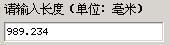
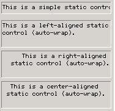
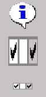
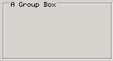
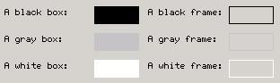
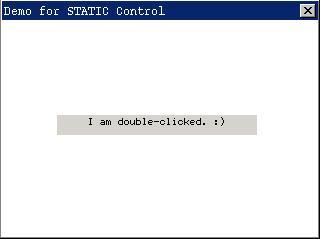

# 静态框


静态框用来在窗口的特定位置显示文字、数字等信息，还可以用来显示一些静态的图片信息，比如公司徽标、产品商标等等。就像其名称暗示的那样，静态框的行为不能对用户的输入进行动态的响应，它的存在基本上就是为了展示一些信息，而不会接收任何键盘或鼠标输入。__图 1.1__ 给出了静态框控件的典型用途：在对话框中作为其他控件的标签。
 


__图 1.1__  静态框控件的典型用途


以 `CTRL_STATIC` 为控件类名调用 `CreateWindow` 函数，即可创建静态框控件。

## 1.1 静态框的类型和风格

静态框的风格由静态框种类和一些标志位组成。我们可将静态框控件按功能划分为标准型（只显示文本）、位图型（显示图标或图片），以及特殊类型分组框。下面我们将分别介绍上述不同类型的静态框。

### 1.1.1 标准型

将静态框控件的风格设定为 `SS_SIMPLE、SS_LEFT`、`SS_CENTER、SS_RIGHT`，以及 `SS_LEFTNOWORDWRAP` 之一，将创建用来显示文字的静态框，其所显示的内容在 `CreateWindow` 函数的 `caption` 参数中进行指定，并且在以后可以用 `SetWindowText` 来改变。

通过 `SS_SIMPLE` 风格创建的控件只用来显示单行文本，也就是说，控件文本不会自动换行显示，并且文本永远是左对齐的。

通过 `SS_LEFT、SS_CENTER` 或 `SS_RIGHT` 风格创建的静态框可用来显示多行文本，并分别以左对齐、中对齐和右对齐方式显示文本。

通过 `SS_LEFTNOWORDWRAP` 风格创建的静态框会扩展文本中的 `TAB` 符，但不做自动换行处理。

下面的程序段创建了上述几种类型的静态框：

```c
CreateWindow (CTRL_STATIC,
"This is a simple static control.",
WS_CHILD | SS_NOTIFY | SS_SIMPLE | WS_VISIBLE | WS_BORDER,
IDC_STATIC1,
10, 10, 180, 20, hWnd, 0);
CreateWindow (CTRL_STATIC,
"This is a left-aligned static control (auto-wrap).",
WS_CHILD | SS_NOTIFY | SS_LEFT | WS_VISIBLE | WS_BORDER,
IDC_STATIC2,
10, 40, 100, 45, hWnd, 0);
CreateWindow (CTRL_STATIC,
"This is a right-aligned static control (auto-wrap).",
WS_CHILD | SS_NOTIFY | SS_RIGHT | WS_VISIBLE | WS_BORDER,
IDC_STATIC3,
10, 90, 100, 45, hWnd, 0);
CreateWindow (CTRL_STATIC,
"This is a center-aligned static control (auto-wrap).",
WS_CHILD | SS_NOTIFY | SS_CENTER | WS_VISIBLE | WS_BORDER,
IDC_STATIC4,
10, 140, 100, 45, hWnd, 0);
CreateWindow (CTRL_STATIC, 
"SS_LEFTNOWORDWRAP: "
"\tTabs are expanded, but words are not wrapped. "
"Text that extends past the end of a line is clipped.",
WS_CHILD | SS_LEFTNOWORDWRAP | WS_VISIBLE | WS_BORDER,
IDC_STATIC, 
10, 290, 540, 20, hWnd, 0);
```

上述几个控件的显示效果见__图 1.2__。为了能够清楚地看到对齐效果，这些静态框均含有边框。


__图 1.2__  文本型静态框


### 1.1.2 位图型

风格设定为 `SS_BITMAP` 或者 `SS_ICON`，这种静态框会显示一幅位图或者图标。对这两类静态框，需要在创建静态框时通过 `dwAddData` 参数设定要显示的位图对象指针或者图标对象句柄。和这两类静态框相关联的风格有 `SS_CENTERIMAGE` 和 `SS_REALSIZEIMAGE`，这两个风格用来控制位图或者图标在控件中的位置。默认情况下，位图和图标要经过适当的缩放充满整个静态框，但使用 `SS_REALSIZEIMAGE` 风格将取消缩放操作，并显示在静态框的左上方，如果在使用 `SS_REALSIZEIMAGE` 的同时使用 `SS_CENTERIMAGE` 风格，则会在控件中部显示位图或图标。

下面的程序段创建了一个位图静态框和一个图标静态框，并使用 `SS_REALSIZEIMAGE` 和 `SS_CENTERIMAGE` 风格创建了一个居中显示的位图静态框：

```c
CreateWindow (CTRL_STATIC,
"",
WS_CHILD | SS_BITMAP | WS_VISIBLE,
IDC_STATIC,
280, 80, 50, 50, hWnd, (DWORD)GetSystemBitmap (SYSBMP_CHECKMARK));

CreateWindow (CTRL_STATIC,
"",
WS_CHILD | SS_ICON | WS_VISIBLE,
IDC_STATIC,
280, 20, 50, 50, hWnd, (DWORD)GetLargeSystemIcon (IDI_INFORMATION));

CreateWindow (CTRL_STATIC,
"",
WS_CHILD | SS_BITMAP | SS_REALSIZEIMAGE | SS_CENTERIMAGE | WS_VISIBLE,
IDC_STATIC,
280, 140, 50, 50, hWnd, (DWORD)GetSystemBitmap (SYSBMP_CHECKMARK));
```

【注意】许多预定义控件会通过 `CreateWindowEx` 函数的 `dwAddData` 参数传递一些控件的初始化参数，这时，窗口第一附加值在创建控件的过程中用于传递这些参数，但在控件创建之后，应用程序仍可以使用窗口第一附加值来保存私有数据。

上述程序段创建的静态框效果见__图 1.3__。


图 1.3  位图型静态框


### 1.1.3 分组框

将风格设定为 `SS_GROUPBOX` 的静态框为分组框，它是静态框中的特例。分组框是一个矩形框，分组框标题在其顶部显示，分组方块常用来包含其他的控件。分组框内可以创建的控件有：静态框、按钮、简单编辑框、单行编辑框、多行编辑框、列表框、滑块和菜单按钮。

下面的程序段创建了一个分组框，其效果见__图 1.4__。

```c
CreateWindow (CTRL_STATIC,
"A Group Box",
WS_CHILD | SS_GROUPBOX | WS_VISIBLE,
IDC_STATIC,
350, 10, 200, 100, hWnd, 0);
```


__图 1.4__  分组静态框

### 1.1.4 其他静态框类型

除上述静态框类型之外，还有如下几种不常见的静态框类型：

- `SS_WHITERECT`：以白色填充静态框矩形。
- `SS_GRAYRECT`：以灰色填充静态框矩形。
- `SS_BLACKRECT`：以黑色填充静态框矩形。
- `SS_GRAYFRAME`：灰色边框。
- `SS_WHITEFRAME`：白色边框。
- `SS_BLACKFRAME`：黑色边框。

使用这些风格的静态框效果见__图 1.5__。


__图 1.5__ 其他静态框类型

## 1.2 静态框消息

当静态框类型为位图型时，可通过如下消息获得或者修改静态框的位图：

- `STM_GETIMAGE`：该消息返回位图的指针或者图标句柄。
- `STM_SETIMAGE`：通过 `wParam` 参数重新设置位图指针或者图标句柄，并且返回原来的指针。

## 1.3 静态框通知码

当静态框风格中包含 `SS_NOTIFY` 时，静态框会产生如下两个通知消息：

- `STN_DBLCLK`：表示用户在静态框内双击了鼠标左键。
- `STN_CLICKED`：表示用户在静态框内单击了鼠标左键。

## 1.4 编程实例

__清单 1.1__ 所示的程序代码，创建了一个位图型静态框，并在用户双击该静态框时修改其自身的文本。该程序的完整源代码可见本指南示例程序包 `mg-samples` 中的 `static.c` 文件。__图 1.6__ 是该程序的运行效果。

__清单 1.1__  静态框示例程序

```c
#include <stdio.h>

#include <minigui/common.h>
#include <minigui/minigui.h>
#include <minigui/gdi.h>
#include <minigui/window.h>
#include <minigui/control.h>

static void my_notif_proc (HWND hwnd, int id, int nc, DWORD add_data)
{
        /* 当用户双击静态框时，调用 SetWindowText 函数改变文本内容 */
        if (nc == STN_DBLCLK)
        SetWindowText (hwnd, "I am double-clicked. :)");
}

static int StaticDemoWinProc(HWND hWnd, int message, WPARAM wParam, LPARAM lParam)
{
        HWND hwnd;
        
        switch (message) {
                case MSG_CREATE:
                /* 创建静态框并设置其通知回调函数 */
                hwnd = CreateWindow (CTRL_STATIC, "Double-click me!", 
                WS_VISIBLE | SS_CENTER | SS_NOTIFY, 
                50, 80, 100, 200, 20, hWnd, 0);
                SetNotificationCallback (hwnd, my_notif_proc);
                return 0;
                
                case MSG_DESTROY:
                DestroyAllControls (hWnd);
                return 0;
                
                case MSG_CLOSE:
                DestroyMainWindow (hWnd);
                PostQuitMessage (hWnd);
                return 0;
        }
        
        return DefaultMainWinProc(hWnd, message, wParam, lParam);
}

/* 以下创建主窗口的代码从略 */
```


__图 1.6__ 静态框示例
