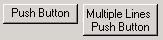
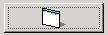
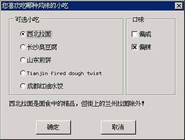

# 按钮


按钮是除静态框之外使用最为频繁的一种控件。按钮通常用来为用户提供开关选择。MiniGUI 的按钮可划分为普通按钮、复选框和单选钮等几种类型。用户可以通过键盘或者鼠标来选择或者切换按钮的状态。用户的输入将使按钮产生通知消息，应用程序也可以向按钮发送消息以改变按钮的状态。

以 `CTRL_BUTTON` 为控件类名调用 `CreateWindow` 函数，即可创建按钮控件。

## 1.1 按钮的类型和风格

### 1.1.1 普通按钮

普通按钮是一个矩形，其中显示了通过 `CreateWindow` 传递的窗口标题。该矩形占用了在 `CreateWindow` 调用中给出的全部高度和宽度，而文字位于矩形的中心。

按钮控件主要用来触发一个立即回应的动作，并且不会长久保持开关信息。这种形态的按钮控件有两种窗口风格，分别叫做 `BS_PUSHBUTTON` 和 `BS_DEFPUSHBUTTON`。`BS_DEFPUSHBUTTON` 中的 “DEF” 代表 “默认”。当用来设计对话框时，`BS_PUSHBUTTON` 风格和 `BS_DEFPUSHBUTTON` 风格的作用不同，具有 `BS_DEFPUSHBUTTON` 的按钮将是默认接收 `ENTER` 键输入的按钮，而不管当前的输入焦点处于哪个控件上。但是当用作普通主窗口的控件时，两种型态的按钮作用相同，只是具有 `BS_DEFPUSHBUTTON` 风格的按钮的边框要粗一些。

当鼠标光标处在按钮中时，按下鼠标左键将使按钮用三维阴影重画自己，就好像真的被按下一样。放开鼠标按键时，就恢复按钮的原貌，并产生 `BN_CLICKED` 通知，当按钮拥有输入焦点时，在文字的周围就有虚线，按下及释放空格键与按下及释放鼠标按键具有相同的效果。

>【提示】本指南对控件行为和表象的描述以默认的经典风格为准。

通常情况下，按钮文本会以单行的形式在垂直和水平方向居中显示，不会自动换行。不过，应用程序也可以通过指定 `BS_MULTLINE` 风格来指定显示多行文本。下面的程序段创建了两个普通按钮：

```c
CreateWindow (CTRL_BUTTON,
"Push Button",
WS_CHILD | BS_PUSHBUTTON | BS_CHECKED | WS_VISIBLE,
IDC_BUTTON,
10, 10, 80, 30, hWnd, 0);

CreateWindow (CTRL_BUTTON,
"Multiple Lines Push Button",
WS_CHILD | BS_PUSHBUTTON | BS_MULTLINE | WS_VISIBLE,
IDC_BUTTON + 1,
100, 10, 80, 40, hWnd, 0);
```

上述代码段建立的普通按钮的显示效果如__图 1.1__ 所示。注意在使用 `BS_MULTILINE` 风格之后，文本将垂直向上对齐。


__图 1.1__ 普通按钮


另外，也可以在普通按钮上显示位图或图标，这时要使用 `BS_BITMAP` 或者 `BS_ICON` 风格，并通过 `CreateWindow` 函数的 `dwAddData` 参数传递位图对象的指针或图标句柄。默认情况下位图或图标会缩放显示以充满整个按钮窗口范围，使用 `BS_REALSIZEIMAGE` 风格将使位图或图标显示在控件中部，不作任何缩放。下面的代码段建立了一个带位图的按钮，其效果见__图 1.2__。

```c
hwnd = CreateWindow (CTRL_BUTTON,
"Close",
WS_CHILD | BS_PUSHBUTTON | BS_BITMAP |BS_REALSIZEIMAGE | BS_NOTIFY | WS_VISIBLE,
IDC_BUTTON + 4,
10, 300, 60, 30, hWnd, (DWORD) GetSystemBitmap (IDI_APPLICATION));
```


__图 1.2__ 位图按钮


### 1.1.2 复选框

复选框是一个文字方块，文字通常出现在复选框的右边（如果你在建立按钮时指定了 `BS_LEFTTEXT` 风格，那么文字会出现在左边）。复选框通常用于允许用户对选项进行选择的应用程序中。复选框的常用功能如同一个开关：单击一次将显示选中标记，再次单击则会清除选中标记。

复选框最常用的两种风格是 `BS_CHECKBOX` 和 `BS_AUTOCHECKBOX`。在使用 `BS_CHECKBOX` 时，应用程序需要自己向该控件发送消息来设定选中标记；而使用 `BS_AUTOCHECKBOX` 风格时，控件会自动在选中和非选中状态之间切换。

其余两种复选框风格是 `BS_3STATE` 和 `BS_AUTO3STATE`，正如它们名字所暗示的，这两种风格能显示第三种状态——复选框内是灰色的，这种状态表明该复选框不能被选择或者禁止使用。

`BS_3STATE` 和 `BS_AUTO3STATE` 风格之间的区别和上面一样：前者需要应用程序来操作其状态，而后者由控件负责状态的自动切换。

默认情况下，复选框沿矩形的左边框对齐，并位于控件窗口范围的顶边和底边之间（垂直居中），在该矩形内的任何地方按下鼠标都会产生通知消息。使用 `BS_LEFTTEXT` 风格将使复选框靠右对齐，并将文本置于复选框的左边。用于文本对齐的风格 `BS_LEFT`、`BS_CENTER`、`BS_RIGHT`、`BS_TOP`、`BS_VCENTER`、`BS_BOTTOM` 等可用于复选框。

另外，使用 `BS_PUSHLIKE` 风格将使复选框以普通按钮的形式显示：选中时显示为按下状态，未选中时显示为正常状态。

下面的程序段创建了两个复选框，其效果在__图 1.3__ 中。

```c
CreateWindow (CTRL_BUTTON,
"Auto 3-state check box",
WS_CHILD | BS_AUTO3STATE | WS_VISIBLE,
IDC_CHECKBOX,
10, 60, 150, 30, hWnd, 0);

CreateWindow (CTRL_BUTTON,
"Auto check box on left",
WS_CHILD | BS_AUTOCHECKBOX | BS_LEFTTEXT | BS_RIGHT | WS_VISIBLE,
IDC_CHECKBOX + 1,
170, 60, 150, 30, hWnd, 0);
```


__图 1.3__ 复选框按钮


### 1.1.3 单选钮

单选按钮就像收音机上选台按钮一样，每一个按钮都对应一个频道，而且一次只能有一个按钮被按下。在对话框中，单选按钮组常常用来表示相互排斥的选项。与复选框不同，单选按钮的工作方式不同于开关，也就是说，当第二次按单选按钮时，它的状态会保持不变。

单选按钮的形状是一个圆圈，而不是方框，除此之外，它的行为很像复选框。圆圈内的加重圆点表示该单选按钮已经被选中。单选按钮有风格 `BS_RADIOBUTTON` 或 `BS_AUTORADIOBUTTON` 两种，后者会自动显示用户的选择情况，而前者不会。

默认情况下，单选按钮沿控件窗口的左边框对齐，并位于控件窗口范围的顶边和底边之间（垂直居中），在该矩形内的任何地方按下鼠标都产生通知消息。使用 `BS_LEFTTEXT` 风格将使单选按钮靠右对齐，并将文本置于按钮的左边。用于文本对齐的风格 `BS_LEFT`、`BS_CENTER`、`BS_RIGHT`、`BS_TOP`、`BS_VCENTER`、`BS_BOTTOM` 等可用于单选按钮。

另外，使用 `BS_PUSHLIKE` 风格将使单选按钮以普通按钮的形式显示：选中时显示为按下状态，未选中时显示为正常状态。下面的程序段创建了两个单选按钮，其效果见__图 1.4__。

```c
CreateWindow (CTRL_BUTTON,
"Auto Radio Button 2",
WS_CHILD | BS_AUTORADIOBUTTON | WS_VISIBLE,
IDC_RADIOBUTTON + 1,
20, 160, 130, 30, hWnd, 0);

CreateWindow (CTRL_BUTTON,
"Auto Radio Button 2",
WS_CHILD | BS_AUTORADIOBUTTON | BS_LEFTTEXT | BS_RIGHT | WS_VISIBLE,
IDC_RADIOBUTTON + 4,
180, 160, 140, 30, hWnd, 0);
```


__图 1.4__ 单选按钮


单选按钮通常成组使用，同一组单选按钮每一刻只能有一个被选中。在创建一组单选按钮时，我们需要设定它们的状态是互斥的，因此，要在创建第一个单选按钮时使用 `WS_GROUP` 风格，以将其设置为该组单选按钮的“打头按钮”。

## 1.2 按钮消息

应用程序通过给按钮发送消息来实现如下目的：

- 查询/设置复选框或者单选钮的选中状态：`BM_GETCHECK`、`BM_SETCHECK`
- 查询/设置普通按钮或者复选框的按下或释放状态：`BM_GETSTATE`、`BM_SETSTATE`
- 获取/设置位图按钮上的位图或者图标：`BM_GETIMAGE`、`BM_SETIMAGE`
- 发送 `BM_CLICK` 模拟用户鼠标的单击操作

应用程序向复选框或者单选钮发送 `wParam` 等于 `BST_CHECKED` 的 `BM_SETCHECK` 消息来显示其处于选中状态：

```c
SendMessage (hwndButton, BM_SETCHECK, BST_CHECKED, 0);
```

其实 `wParam` 可取的值一共有三个，见__表 1.1__。这些值也是通过 `BM_GETCHECK` 消息返回的选中状态值。

__表 1.1__ 复选框和单选钮的选中状态

| 状态标识符              | 含义    |
|:----------------------|:-------|
|`BST_UNCHECKED`(0)     |未选中   |
|`BST_CHECKED`(1)       |已选中   |
|`BST_INDETERMINATE`(2) |不可用状态|


我们可以通过给窗口发送 `BM_SETSTATE` 消息来模拟按钮闪动。以下的操作将导致按钮被按下：

```c
SendMessage (hwndButton, BM_SETSTATE, BST_PUSHED, 0) ;
```

下面的调用使按钮恢复正常：

```c
SendMessage (hwndButton, BM_SETSTATE, 0, 0) ;
```

对位图按钮，可使用 `BM_GETIMAGE` 和 `BM_SETIMAGE` 消息获取或设置位图对象或图标句柄：

```c
int image_type;
PBITMAP btn_bmp;
HICON btn_icon;

int ret_val = SendMessage (hwndButton, BM_GETIMAGE, (WPARAM)&image_type, 0) ;

if (image_type == BM_IMAGE_BITMAP) {
        /* 该按钮使用的是位图对象 */
        btn_bmp = (PBITMAP) ret_val;
}
else {
        /* 该按钮使用的是图标对象 */
        btn_icon = (HICON) ret_val;
}

/* 将按钮图象设置为位图对象 */
SendMessage (hwndButton, BM_SETIMAGE, BM_IMAGE_BITMAP, btn_bmp) ;

/* 将按钮图象设置为图标对象 */
SendMessage (hwndButton, BM_SETIMAGE, BM_IMAGE_ICON, btn_icon) ;
```

另外，我们在应用程序中也可以通过向按钮发送 `BM_CLICK` 消息来模拟用户在按钮上的单击操作。

## 1.3 按钮通知码

具有 `BS_NOTIFY` 风格的按钮可产生的通知码主要有：

- `BN_CLICKED`：表明用户单击此按钮。该通知码的值为 0，因此，如果要在按钮的父窗口中处理该按钮发送过来的 `BN_CLICKED` 通知消息，只需判断 `MSG_COMMAND` 消息的 `wParam` 参数是否等于按钮的标识符即可。该通知的产生是默认的，将忽略按钮控件的 `BS_NOTIFY` 风格。
- `BN_PUSHED`：表明用户将此按钮按下。
- `BN_UNPUSHED`：表明用户将此按钮释放。
- `BN_DBLCLK`：表明用户在此按钮上进行了鼠标左键的双击操作。
- `BN_SETFOCUS`：表明按钮获得了输入焦点。
- `BN_KILLFOCUS`：表明按钮失去了输入焦点。

## 1.4 编程实例

通常，应用程序只需处理 `BN_CLICKED` 通知码，对复选框和单选钮，一般设置为自动状态，并在需要时发送 `BM_GETCHECK` 消息来获得选中状态。在对话框中，应用程序还可以使用__表 1.2__ 中的函数来快速获得按钮控件的状态信息。

__表 1.2__  对话框为处理按钮控件而提供的便利函数

| 函数名               | 用途                              | 备注      |
|:--------------------|:---------------------------------|:----------|
|`CheckDlgButton`     |通过按钮标识符来改变按钮的选中状态      |           |
|`CheckRadioButton`   |通过按钮标识符来改变一组单选钮的选中状态 |确保互斥选中 |
|`IsDlgButtonChecked `|通过标识符判断按钮是否选中             |          |


__清单 1.1__ 所示的程序代码，给出了一个按钮控件的综合性使用范例。该程序使用一个对话框来询问用户的口味，通过分组单选框来选择喜欢的小吃类型，并通过复选框来选择用户的一些特殊口味。该程序的完整源代码请见本指南示例程序包 `mg-samples` 中的 `button.c` 文件，其运行效果见__图 1.5__。

__清单 1.1__ 按钮控件的使用范例

```c
#include <stdio.h>
#include <stdlib.h>

#include <minigui/common.h>
#include <minigui/minigui.h>
#include <minigui/gdi.h>
#include <minigui/window.h>
#include <minigui/control.h>

#define IDC_LAMIAN              101
#define IDC_CHOUDOUFU           102
#define IDC_JIANBING            103
#define IDC_MAHUA               104
#define IDC_SHUIJIAO            105

#define IDC_XIAN                110
#define IDC_LA                  111

#define IDC_PROMPT              200

static DLGTEMPLATE DlgYourTaste =
{
        WS_BORDER | WS_CAPTION,
        WS_EX_NONE,
        120, 100, 300, 280,
        "你喜欢吃哪种风味的小吃",
        0, 0,
        12, NULL,
        0
};

static CTRLDATA CtrlYourTaste[] =
{ 
        {
                "static",
                WS_VISIBLE | SS_GROUPBOX, 
                16, 10, 130, 160,
                IDC_STATIC,
                "可选小吃",
                0
        },
        {
                "button",
                /* 使用 BS_CHECKED，初始时使其选中 */
                WS_VISIBLE | BS_AUTORADIOBUTTON | BS_CHECKED | WS_TABSTOP | WS_GROUP,
                36, 38, 88, 20,
                IDC_LAMIAN,
                "西北拉面",
                0
        },
        {
                "button",
                WS_VISIBLE | BS_AUTORADIOBUTTON, 
                36, 64, 88, 20, 
                IDC_CHOUDOUFU, 
                "长沙臭豆腐",
                0
        },
        {
                "button",
                WS_VISIBLE | BS_AUTORADIOBUTTON,
                36, 90, 88, 20,
                IDC_JIANBING,
                "山东煎饼",
                0
        },
        {
                "button",
                WS_VISIBLE | BS_AUTORADIOBUTTON,
                36, 116, 88, 20,
                IDC_MAHUA,
                "天津麻花",
                0
        },
        {
                "button",
                WS_VISIBLE | BS_AUTORADIOBUTTON,
                36, 142, 100, 20,
                IDC_SHUIJIAO,
                "成都红油水饺",
                0
        },
        {
                "static",
                WS_VISIBLE | SS_GROUPBOX | WS_GROUP, 
                160, 10, 124, 160,
                IDC_STATIC,
                "口味",
                0
        },
        {
                "button",
                WS_VISIBLE | BS_AUTOCHECKBOX,
                170, 38, 88, 20,
                IDC_XIAN,
                "偏咸",
                0
        },
        {
                "button",
                /* 使用 BS_CHECKED，初始时使其选中 */
                WS_VISIBLE | BS_AUTOCHECKBOX | BS_CHECKED, 
                170, 64, 88, 20, 
                IDC_LA, 
                "偏辣",
                0
        },
        {
                "static",
                WS_VISIBLE | SS_LEFT | WS_GROUP,
                16, 180, 360, 20,
                IDC_PROMPT,
                "西北拉面是面食中的精品，但街上的兰州拉面除外！",
                0
        },
        {
                "button",
                WS_VISIBLE | BS_DEFPUSHBUTTON | WS_TABSTOP | WS_GROUP,
                80, 220, 95, 28,
                IDOK, 
                "确定",
                0
        },
        {
                "button",
                WS_VISIBLE | BS_PUSHBUTTON | WS_TABSTOP,
                185, 220, 95, 28,
                IDCANCEL,
                "取消",
                0
        },
};

static char* prompts [] = {
        "西北拉面是面食中的精品，但街上的兰州拉面除外！",
        "长沙臭豆腐口味很独特，一般人适应不了。",
        "山东煎饼很难嚼 :(",
        "天津麻花很脆，很香！",
        "成都的红油水饺可真好吃啊！想起来就流口水。",
};

static void my_notif_proc (HWND hwnd, int id, int nc, DWORD add_data)
{
        /* 用户选择不同的小吃时，在下面的静态框中显示针对这种小吃的提示信息 */
        if (nc == BN_CLICKED) {
                SetWindowText (GetDlgItem (GetParent (hwnd), IDC_PROMPT), prompts [id - IDC_LAMIAN]);
        }
}

static int DialogBoxProc2 (HWND hDlg, int message, WPARAM wParam, LPARAM lParam)
{
        switch (message) {
                case MSG_INITDIALOG:
                {
                        int i;
                        /* 为小吃单选钮设定通知回调函数 */
                        for (i = IDC_LAMIAN; i <= IDC_SHUIJIAO; i++)
                        SetNotificationCallback (GetDlgItem (hDlg, i), my_notif_proc);
                }
                return 1;
                
                case MSG_COMMAND:
                switch (wParam) {
                        case IDOK:
                        case IDCANCEL:
                        EndDialog (hDlg, wParam);
                        break;
                }
                break;
                
        }
        
        return DefaultDialogProc (hDlg, message, wParam, lParam);
}

int MiniGUIMain (int argc, const char* argv[])
{
        #ifdef _MGRM_PROCESSES
        JoinLayer(NAME_DEF_LAYER , "button" , 0 , 0);
        #endif
        
        DlgYourTaste.controls = CtrlYourTaste;
        
        DialogBoxIndirectParam (&DlgYourTaste, HWND_DESKTOP, DialogBoxProc2, 0L);
        
        return 0;
}

#ifndef _MGRM_PROCESSES
#include <minigui/dti.c>
#endif
```


__图 1.5__ 按钮控件的使用范例
