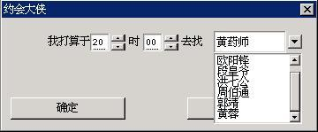

# 24 菜单按钮

菜单按钮的功能和普通下拉式组合框的功能基本一样，实质上，在 MiniGUI 早期版本中，菜单按钮就是以组合框的替代品出现的。当然，菜单按钮有很大的限制，比如不能够编辑、不提供列表条目的滚动等等。

在外观上，菜单按钮类似一个普通按钮，不同的是在按钮矩形区域的右侧有一个向下的箭头。当用户点击该控件时，就会弹出一个菜单，而用户使用鼠标点击菜单中某一条目时，按钮的内容就变为该条目的内容。如__图 1.1__ 所示。

 &mbi);
```

其中，`hMbtnWnd` 是菜单按钮控件的句柄。`Pos` 得到新添加的菜单条目的索引值，当内存空间不足时，则返回 `MB_ERR_SPACE`。

### 1.2.2 从菜单按钮控件删除条目

从菜单按钮中删除条目，可使用 `MBM_DELITEM` 消息，并指定要删除的菜单项索引号。如下所示：

```c
SendMessage (hMbtnWnd, MBM_DELITEM, index, 0);
```

其中，`index` 为条目的索引值。

### 1.2.3 删除菜单中的所有条目

和列表框一样，菜单按钮也提供了删除所有条目的消息，即 `MBM_RESETCTRL` 消息。如下所示：

```c
SendMessage (hMbtnWnd, MBM_RESETCTRL, 0, 0);
```

### 1.2.4 设置当前选定条目

类似地，用 `MBM_SETCURITEM` 消息设置选中条目，被选中的条目文本将显示在菜单按钮上。如下所示：

```c
SendMessage (hMbtnWnd, MBM_SETCURITEM, index, 0);
```

其中，`index` 为要设定的条目索引值。

### 1.2.5 得到当前选定条目

用 `MBM_GETCURITEM` 消息可获得当前选中条目的索引号。如下所示：

```c
index = SendMessage (hMbtnWnd, MBM_GETCURITEM, 0, 0);
```

该消息返回当前选定条目的索引值。

### 1.2.6 获取或设置菜单项条目数据

使用 `MBM_GETITEMDATA` 和 `MBM_SETITEMDATA` 消息可获取或设置菜单项条目的数据。使用这个两个消息时，`wParam` 参数传递要获取或设置的菜单项索引值，`lParam` 参数传递一个指向 `MENUBUTTONITEM` 的结构指针，其中包括菜单项的文本、位图对象以及附加数据。

需要注意的是，`MENUBUTTONITEM` 结构中含有一个 `which` 成员，该成员指定了要获取或设置菜单项的哪个数据（文本、位图对象或者附加数据中的一个或多个），通常是下列值的组合：

- `MB_WHICH_TEXT`：表明要获取或设置菜单项的文本，这时，该结构的 `text` 成员必须指向有效缓冲区。
- `MB_WHICH_BMP`：表明要获取或设置菜单项的位图对象。
- `MB_WHICH_ATTDATA`：表明要获取或设置菜单项的附加数据。

示例如下：

```c
MENUBUTTONITEM mbi;

mbi.which = MB_WHICH_TEXT | MB_WHICH_ATTDATA;
mbi.text = “newtext”;
mbi.data = 1;
SendMessage (menubtn, MBM_SETITEMDATA, 0, (LPARAM) &mbi);
```

其中，`menubtn` 是某个菜单按钮的句柄。

### 1.2.7 其他消息

在使用 `MBS_SORT` 风格时，因为涉及到条目的排序，所以 MiniGUI 也为应用程序提供了 `MBM_SETSTRCMPFUNC` 消息，用来设定一个定制的排序函数。一般而言，应用程序要在添加条目之前使用该消息设定新的字符串比较函数。

该消息的用法可参照列表框消息 `LB_SETSTRCMPFUNC` 消息。

## 1.3 菜单按钮的通知消息

菜单按钮没有 `MBS_NOTIFY` 风格，因此，任意一个菜单按钮控件均可能产生如下的通知消息：

- `MBN_ERRSPACE`：内存分配失败，存储空间不足。
- `MBN_SELECTED`：对菜单按钮控件进行了选择。不管前后选择的菜单项是否改变，均会产生该通知消息。
- `MBN_CHANGED`：菜单按钮控件的选择项发生了变化。
- `MBN_STARTMENU`：用户激活了菜单按钮的弹出式菜单。
- `MBN_ENDMENU`：弹出式菜单关闭。

## 1.4 编程实例

__清单 1.1__ 给出了菜单按钮的使用实例。该程序段是对__清单 1.1__ 程序的一个小改动，即将__清单 1.1__ 程序中的下拉式组合框改成了菜单按钮来实现。该程序的完整源代码可见本指南示例程序包 `mg-samples` 中的 `menubutton.c` 文件，其运行效果见__图 1.2__。

__清单 1.1__ 菜单按钮的使用实例

```c
/* 定义对话框模板 */
static DLGTEMPLATE DlgMyDate =
{
        WS_BORDER | WS_CAPTION,
        WS_EX_NONE,
        100, 100, 304, 135,
        "约会大侠",
        0, 0,
        9, NULL,
        0
};

static CTRLDATA CtrlMyDate[] =
{ 
        
        ...
        
        /* 将用于显示大侠名单的组合框换成按钮菜单来实现 */
        {
                CTRL_MENUBUTTON,
                WS_CHILD | WS_VISIBLE,
                190, 20, 100, 20,
                IDL_DAXIA,
                "",
                0
        },
        
        ...
        
};

...

static void daxia_notif_proc (HWND hwnd, int id, int nc, DWORD add_data)
{
        if (nc == CBN_SELCHANGE) {
                /* 获得选定的大侠，并显示其性格特点 */
                int cur_sel = SendMessage (hwnd, MBM_GETCURITEM, 0, 0);
                if (cur_sel >= 0) {
                        SetWindowText (GetDlgItem (GetParent(hwnd), IDC_PROMPT), daxia_char [cur_sel]);
                }
        }
}

static void prompt (HWND hDlg)
{
        char date [1024];
        
        int hour = SendDlgItemMessage(hDlg, IDC_HOUR, CB_GETSPINVALUE, 0, 0);
        int min = SendDlgItemMessage(hDlg, IDC_MINUTE, CB_GETSPINVALUE, 0, 0);
        int sel = SendDlgItemMessage(hDlg, IDL_DAXIA, MBM_GETCURITEM, 0, 0);
        
        sprintf (date, "你打算于今日 %02d:%02d 去见那个%s的%s", hour, min, 
        daxia_char [sel], daxia [sel]);
        
        MessageBox (hDlg, date, "约会内容", MB_OK | MB_ICONINFORMATION);
}

static int MyDateBoxProc (HWND hDlg, int message, WPARAM wParam, LPARAM lParam)
{
        int i;
        switch (message) {
                case MSG_INITDIALOG:
                SendDlgItemMessage(hDlg, IDC_HOUR, CB_SETSPINFORMAT, 0, (LPARAM)"%02d");
                SendDlgItemMessage(hDlg, IDC_HOUR, CB_SETSPINRANGE, 0, 23);
                SendDlgItemMessage(hDlg, IDC_HOUR, CB_SETSPINVALUE, 20, 0);
                SendDlgItemMessage(hDlg, IDC_HOUR, CB_SETSPINPACE, 1, 1);
                
                SendDlgItemMessage(hDlg, IDC_MINUTE, CB_SETSPINFORMAT, 0, (LPARAM)"%02d");
                SendDlgItemMessage(hDlg, IDC_MINUTE, CB_SETSPINRANGE, 0, 59);
                SendDlgItemMessage(hDlg, IDC_MINUTE, CB_SETSPINVALUE, 0, 0);
                SendDlgItemMessage(hDlg, IDC_MINUTE, CB_SETSPINPACE, 1, 2);
                
                /* 向菜单按钮中加入各位大侠的名字 */
                for (i = 0; i < 7; i++) {
                        MENUBUTTONITEM mbi;
                        mbi.text = daxia[i];
                        mbi.bmp = NULL;
                        mbi.data = 0;
                        SendDlgItemMessage(hDlg, IDL_DAXIA, MBM_ADDITEM, -1, (LPARAM)&mbi);
                }
                
                /* 设定菜单按钮的通知回调函数 */
                SetNotificationCallback (GetDlgItem (hDlg, IDL_DAXIA), daxia_notif_proc);
                SendDlgItemMessage(hDlg, IDL_DAXIA, MBM_SETCURITEM, 0, 0);
                SetWindowText (GetDlgItem (hDlg, IDC_PROMPT), daxia_char [0]);
                return 1;
                
                case MSG_COMMAND:
                switch (wParam) {
                        case IDOK:
                        prompt (hDlg);
                        case IDCANCEL:
                        EndDialog (hDlg, wParam);
                        break;
                }
                break;
                
        }
        
        return DefaultDialogProc (hDlg, message, wParam, lParam);
}/* 定义对话框模板 */
static DLGTEMPLATE DlgMyDate =
{
        WS_BORDER | WS_CAPTION,
        WS_EX_NONE,
        100, 100, 304, 135,
        "约会大侠",
        0, 0,
        9, NULL,
        0
};

static CTRLDATA CtrlMyDate[] =
{ 
        
        ...
        
        /* 将用于显示大侠名单的组合框换成按钮菜单来实现 */
        {
                CTRL_MENUBUTTON,
                WS_CHILD | WS_VISIBLE,
                190, 20, 100, 20,
                IDL_DAXIA,
                "",
                0
        },
        
        ...
        
};

...

static void daxia_notif_proc (HWND hwnd, int id, int nc, DWORD add_data)
{
        if (nc == CBN_SELCHANGE) {
                /* 获得选定的大侠，并显示其性格特点 */
                int cur_sel = SendMessage (hwnd, MBM_GETCURITEM, 0, 0);
                if (cur_sel >= 0) {
                        SetWindowText (GetDlgItem (GetParent(hwnd), IDC_PROMPT), daxia_char [cur_sel]);
                }
        }
}

static void prompt (HWND hDlg)
{
        char date [1024];
        
        int hour = SendDlgItemMessage(hDlg, IDC_HOUR, CB_GETSPINVALUE, 0, 0);
        int min = SendDlgItemMessage(hDlg, IDC_MINUTE, CB_GETSPINVALUE, 0, 0);
        int sel = SendDlgItemMessage(hDlg, IDL_DAXIA, MBM_GETCURITEM, 0, 0);
        
        sprintf (date, "你打算于今日 %02d:%02d 去见那个%s的%s", hour, min, 
        daxia_char [sel], daxia [sel]);
        
        MessageBox (hDlg, date, "约会内容", MB_OK | MB_ICONINFORMATION);
}

static int MyDateBoxProc (HWND hDlg, int message, WPARAM wParam, LPARAM lParam)
{
        int i;
        switch (message) {
                case MSG_INITDIALOG:
                SendDlgItemMessage(hDlg, IDC_HOUR, CB_SETSPINFORMAT, 0, (LPARAM)"%02d");
                SendDlgItemMessage(hDlg, IDC_HOUR, CB_SETSPINRANGE, 0, 23);
                SendDlgItemMessage(hDlg, IDC_HOUR, CB_SETSPINVALUE, 20, 0);
                SendDlgItemMessage(hDlg, IDC_HOUR, CB_SETSPINPACE, 1, 1);
                
                SendDlgItemMessage(hDlg, IDC_MINUTE, CB_SETSPINFORMAT, 0, (LPARAM)"%02d");
                SendDlgItemMessage(hDlg, IDC_MINUTE, CB_SETSPINRANGE, 0, 59);
                SendDlgItemMessage(hDlg, IDC_MINUTE, CB_SETSPINVALUE, 0, 0);
                SendDlgItemMessage(hDlg, IDC_MINUTE, CB_SETSPINPACE, 1, 2);
                
                /* 向菜单按钮中加入各位大侠的名字 */
                for (i = 0; i < 7; i++) {
                        MENUBUTTONITEM mbi;
                        mbi.text = daxia[i];
                        mbi.bmp = NULL;
                        mbi.data = 0;
                        SendDlgItemMessage(hDlg, IDL_DAXIA, MBM_ADDITEM, -1, (LPARAM)&mbi);
                }
                
                /* 设定菜单按钮的通知回调函数 */
                SetNotificationCallback (GetDlgItem (hDlg, IDL_DAXIA), daxia_notif_proc);
                SendDlgItemMessage(hDlg, IDL_DAXIA, MBM_SETCURITEM, 0, 0);
                SetWindowText (GetDlgItem (hDlg, IDC_PROMPT), daxia_char [0]);
                return 1;
                
                case MSG_COMMAND:
                
                int MiniGUIMain (int argc, const char* argv[])
                {
                        #ifdef _MGRM_PROCESSES
                        JoinLayer(NAME_DEF_LAYER , "menubutton" , 0 , 0);
                        #endif
                        
                        DlgMyDate.controls = CtrlMyDate;
                        
                        DialogBoxIndirectParam (&DlgMyDate, HWND_DESKTOP, MyDateBoxProc, 0L);
                        
                        return 0;
                }
                
                ...
```


__图 1.2__ 使用菜单按钮
