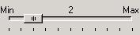
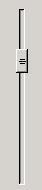
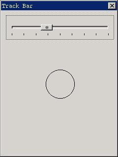

# 滑块

滑块通常用于调节亮度、音量等场合。在需要对某一范围的量值进行调节时，就可以使用滑块控件。以 `CTRL_TRACKBAR` 为控件类名调用 `CreateWindow` 函数，即可创建滑块。__图 1.1__ 是滑块控件的典型运行效果。


__图 1.1__  滑块控件

## 1.1 滑块风格

滑块控件的常用风格组合为：

```c
WS_CHILD | WS_VISIBLE | TBS_NOTIFY
```

指定 `TBS_NOTIFY` 风格，可让滑块产生通知消息。

默认情况下，滑块是水平的。如果想要创建竖直的滑块，可指定 `TBS_VERTICAL` 风格。__图 1.2__ 中的滑块就是竖直滑块：


__图 1.2__  竖直滑块

滑块的另外几个风格说明如下：

- `TBS_TIP`：在滑块两端显示文字说明（如__图 1.1__ 中的“Min”和“Max”那样）。具有这一风格时，滑块控件还将在控件的中部显示当前刻度值。
- `TBS_NOTICK`：不显示刻度。
- `TBS_BORDER` 风格可使滑块带有边框，该风格不常用。

## 1.2 滑块消息

滑块的消息相对简单，总结如下：

- `TBM_SETRANGE`：通过 `wParam` 和 `lParam` 参数分别设置滑块的最小值和最大值。默认的范围是 0~10。
- `TBM_GETMIN`：获得滑块的最小值。
- `TBM_GETMAX`：获得滑块的最大值。
- `TBM_SETMIN`：设置滑块的最小值。
- `TBM_SETMAX`：设置滑块的最大值。
- `TBM_SETLINESIZE`：通过 `wParam` 参数设置滑块的步进值。当用户在滑块拥有输入焦点时按下向上或向下光标键，将使滑块向上或向下移动该步进值。默认的步进值是 1。
- `TBM_GETLINESIZE`：获得滑块的步进值。
- `TBM_SETPAGESIZE`：通过 `wParam` 参数设置滑块的快速步进值。当用户在滑块拥有输入焦点时按下 `PageUp` 和 `PageDown` 键，将使滑块分别向上或向下移动该快速步进值。默认的快速步进值是 5。
- `TBM_GETPAGESIZE`：获得滑块的快速步进值。
- `TBM_SETPOS`：设置滑块的位置。
- `TBM_GETPOS`：获得滑块的位置。
- `TBM_SETTICKFREQ`：设置刻度间距，默认间距是 1。
- `TBM_GETTICKFREQ`：获得刻度间距。
- `TBM_SETTIP`：设置最小值及最大值处的文字说明。
- `TBM_GETTIP`：获取最小值及最大值处的文字说明。

## 1.3 滑块通知码

当滑块控件具有 `TBS_NOTIFY` 风格时，可能产生如下通知消息：

- `TBN_CHANGE`：滑块的位置发生了变化。
- `TBN_REACHMAX`：已到达了上限。
- `TBN_REACHMIN`：已到达了下限。

## 1.4 编程实例

__清单 1.1__ 给出了滑块控件的一个示例程序。该程序根据当前滑块的位置在窗口中画对应大小的圆。当用户改变滑块的位置时，圆也会接着更新。该程序的运行效果见__图 1.3__，程序的完整源代码见本指南示例程序包 `mg-samples` 中的 `trackbar.c` 文件。

__清单 1.1__  滑块控件的使用

```c
#include <stdio.h>
#include <stdlib.h>
#include <string.h>

#include <minigui/common.h>
#include <minigui/minigui.h>
#include <minigui/gdi.h>
#include <minigui/window.h>
#include <minigui/control.h>

static int radius = 10;
static RECT rcCircle = {0, 60, 300, 300};

static void my_notif_proc (HWND hwnd, int id, int nc, DWORD add_data)
{
        if (nc == TBN_CHANGE) {
                
                /* 当滑块的的位置发生变化时，记录当前值，并通知主窗口重绘 */
                radius = SendMessage (hwnd, TBM_GETPOS, 0, 0);
                InvalidateRect (GetParent (hwnd), &rcCircle, TRUE);
        }
}

static int TrackBarWinProc(HWND hWnd, int message, WPARAM wParam, LPARAM lParam)
{
        HWND hwnd;
        switch (message) {
                case MSG_CREATE:
                /* 创建滑块 */
                hwnd = CreateWindow (CTRL_TRACKBAR, 
                "", 
                WS_VISIBLE | TBS_NOTIFY, 
                100, 
                10, 10, 280, 50, hWnd, 0);
                
                /* 设置滑块的范围、步进值以及刻度间隔，当前位置等 */
                SendMessage (hwnd, TBM_SETRANGE, 0, 100);
                SendMessage (hwnd, TBM_SETLINESIZE, 1, 0);
                SendMessage (hwnd, TBM_SETPAGESIZE, 10, 0);
                SendMessage (hwnd, TBM_SETTICKFREQ, 10, 0);
                SendMessage (hwnd, TBM_SETPOS, radius, 0);
                
                /* 设置滑块的通知回调函数 */
                SetNotificationCallback (hwnd, my_notif_proc);
                break;
                
                case MSG_PAINT:
                {
                        HDC hdc = BeginPaint (hWnd);
                        
                        /* 以当前滑块位置值为半径绘制圆 */
                        ClipRectIntersect (hdc, &rcCircle);
                        Circle (hdc, 140, 120, radius);
                        
                        EndPaint (hWnd, hdc);
                        return 0;
                }
                
                case MSG_DESTROY:
                DestroyAllControls (hWnd);
                return 0;
                
                case MSG_CLOSE:
                DestroyMainWindow (hWnd);
                PostQuitMessage (hWnd);
                return 0;
        }
        
        return DefaultMainWinProc(hWnd, message, wParam, lParam);
}

/* 以下创建主窗口的代码从略 */
```


__图 1.3__  滑块控件的使用
