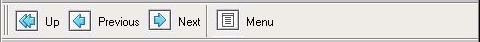
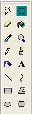
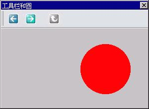

# 工具栏

在现代 GUI 应用程序中，工具栏的使用随处可见。MiniGUI 也为应用程序准备了工具栏预定义控件类。实际上，MiniGUI 提供了三种不同的预定义工具栏控件类，分别是 `CTRL_TOOLBAR`、`CTRL_NEWTOOLBAR` 以及 `CTRL_COOLBAR` 控件类。

`CTRL_TOOLBAR` 是早期的工具栏控件类，该控件类已废弃，并被 `CTRL_NEWTOOLBAR` 控件类替代。将 `CTRL_TOOLBAR` 控件类包含在 MiniGUI 中，只是为了提供兼容性，新的应用程序不应使用该控件类。本章将介绍 `CTRL_NEWTOOLBAR` 控件类，第 36 章介绍 `CTRL_COOLBAR` 控件类。

使用 `CTRL_NEWTOOLBAR` 作为控件类名调用 `CreateWindow` 函数，即可创建工具栏控件，该控件的运行效果见__图 1.1__。


__图 1.1__  工具栏控件

## 1.1 创建工具栏控件

在创建工具栏控件之前，我们首先要填充一个 `NTBINFO` 结构，并将该结构的指针通过 `CreateWindow` 函数的 `dwAddData` 参数传递给控件类的窗口过程。`NTBINFO` 结构主要用来定义工具栏所用位图的信息，具体如__表 1.1__ 所示。

____表 1.1__  `NTBINFO` 结构

| 结构成员   | 含义         | 备注 |
|:----------|:------------|:-----|
|`image`    | 用来显示工具栏各按钮的位图 | |
|`nr_cells` | 该位图中含有的位图单元个数，也就是说，一共有多少行 | |
|`nr_cols`  | 该位图含有多少列，也就是说，每个位图单元含有多少状态  | 取 1 表示只有正常状态；<br>取2 表示只有正常和高亮状态<br>；取 3 表示没有灰化状态；<br>取 4 或者 0 表示含所有 4 个可能状态。|
|`w_cell`   | 位图单元的宽度 | 置零时,将以“位图宽度/nr_cols”为公式计算 |
|`h_cell`   | 位图单元的高度 | 置零时,将以“位图高度/nr_cells”为公式计算 |

我们必须将工具栏上各按钮显示的位图（我们称为位图单元）组织在单个位图对象中，而且应组织成类似__图 1.2__ 那样的结构。其中第一列表示的是工具栏按钮可能用到的所有位图单元的正常状态；第二列表示的是工具栏按钮可能用到的所有位图的高亮状态；第三列表示的是按下的状态；第四列表示的是禁止（灰化）的状态。位图的每一行表示单个按钮位图单元的所有状态。


__图 1.2__  用于工具栏的位图对象

工具栏控件将根据工具栏上各个按钮的状态在位图对象中选择适当的位图单元来显示按钮。

## 1.2 工具栏风格

工具栏控件类支持如下几种风格：

- `NTBS_HORIZONTAL`：水平显示工具栏。这是默认风格。
- `NTBS_VERTICAL`：垂直显示工具栏。如__图 1.3__ 所示。
- `NTBS_MULTLINE`：工具栏可多行显示。当工具项类型为 `NTBIF_NEWLINE` 时，将另起一行显示其后添加的工具项。如__图 1.3__ 所示。
- `NTBS_WITHTEXT`：将在按钮下方或者按钮右边显示文本，默认显示在按钮位图的下方。这时，应用程序必须在添加按钮时指定按钮对应的文本。当文字在图标下方显示且按钮处于被激活状态时，按钮图片将突出显示。
- `NTBS_TEXTRIGHT`：配合 `NTBS_WITHTEXT` 风格使用时，该风格指定将文本显示在按钮位图的右边。__图 1.1__ 中的工具栏就具有 `NTBS_TEXTRIGHT` 风格。当文字在图标右侧且按钮处于被激活状态时，按钮图片和文字都将突出显示。
- `NTBS_DRAWSTATES`：不使用按钮的高亮、按下以及灰化状态的位图单元，而改用三维风格的边框来表示这些状态。
- `NTBS_DRAWSEPARATOR`：绘制分隔条。默认情况下，工具栏上用来分隔按钮的分隔条是不会被绘制的，而只会加大两个按钮之间的间距。具有该风格之后，将绘制窄的分隔条。


__图 1.3__  垂直分行显示的工具栏控件

## 1.3 工具栏消息

### 1.3.1 添加工具项

向工具栏控件发送 `NTBM_ADDITEM` 消息并传递 `NTBITEMINFO` 结构，可向工具栏中添加一个工具项。__表 1.2__ 给出了 `NTBITEMINFO` 结构各成员的含义。

____表 1.2__  `NTBITEMINFO` 结构

| 结构成员       | 含义      | 备注 |
|:--------------|:---------|:----|
|`which`        | 用于 `NTBM_GETITEM` 和 `NTBM_SETITEM` 消息。| |
|`flags`        | 该成员用来指定工具项的类型及状态。类型有:<br>1. `NTBIF_PUSHBUTTON`：普通的按钮；<br>2. `NTBIF_CHECKBUTTON`：检查框按钮；<br>3. `NTBIF_HOTSPOTBUTTON`：定义有热点区域的按钮；<br>4. `NTBIF_NEWLINE`：在具有` NTBS_MULTILINE` 风格时，表示另起一行显示其它工具项；<br>5. `NTBIF_SEPARATOR`：分隔条。工具项的状态只有一个，即 `NTBIF_DISABLED`，表示该项被灰化。| 该成员的值应该是类型标志之一与状态标志的或。|
|`id`           | 按钮的标识符 。当用户单击某个按钮时,该标识符将作为工具栏通知消息的通知码发送到父窗口或者传递到通知回调函数。| |
|`text`         | 当工具栏具有 `NTBS_WITHTEXT` 风格时,该成员用来传递按钮的文本字符串。| |
|`tip`          | 目前保留未用。| |
|`bmp_cell`     | 指定该按钮使用位图对象中的哪个位图单元，第一个取零。|该按钮将使用第 `bmp_cell` 行的位图单元显示按钮的各个状态。|
|`hotspot_proc` | 如果该按钮是一个定义有热点区域的按钮，则该成员定义用户单击热点时的回调函数。| |
|`rc_hotspot`   | 如果该按钮是一个定义有热点区域的按钮，则该成员定义按钮的热点区域矩形，相对于按钮左上角。               | 当用户单击的是该矩形区域时，则看成是激活热点。|
|`add_data`     | 工具项的附加数据。| |

在添加工具项时，将忽略 `which` 成员。下面的代码段说明了如何向工具栏添加普通按钮、初始灰化的按钮、分隔条以及定义有热点区域的按钮：

```c
HWND ntb1;
NTBINFO ntb_info;
NTBITEMINFO ntbii;
RECT hotspot = {16, 16, 32, 32};

/* 填充 NTBINFO 结构 */
ntb_info.nr_cells = 4;
ntb_info.w_cell  = 0;
ntb_info.h_cell  = 0;
ntb_info.nr_cols = 0;
ntb_info.image = &bitmap1;

/* 创建工具栏控件 */
ntb1 = CreateWindow (CTRL_NEWTOOLBAR,
"",
WS_CHILD | WS_VISIBLE,
IDC_CTRL_NEWTOOLBAR_1,
0, 10, 1024, 0,
hWnd,
(DWORD) &ntb_info);

/* 添加普通按钮 */
ntbii.flags = NTBIF_PUSHBUTTON;
ntbii.id = IDC_NTB_TWO;
ntbii.bmp_cell = 1;
SendMessage(ntb1, TBM_ADDITEM, 0, (LPARAM)&ntbii);

/* 添加灰化的普通按钮 */
ntbii.flags = NTBIF_PUSHBUTTON | NTBIF_DISABLED;
ntbii.id = IDC_NTB_THREE;
ntbii.bmp_cell = 2;
SendMessage (ntb1, TBM_ADDITEM, 0, (LPARAM)&ntbii);

/* 添加分隔条 */
ntbii.flags = NTBIF_SEPARATOR;
ntbii.id = 0;
ntbii.bmp_cell = 0;
ntbii.text = NULL;
SendMessage (ntb1, TBM_ADDITEM, 0, (LPARAM)&ntbii);

/* 添加定义有热点区域的按钮 */
ntbii.flags = NTBIF_HOTSPOTBUTTON;
ntbii.id = IDC_NTB_FOUR;
ntbii.bmp_cell = 3;
ntbii.rc_hotspot = hotspot;
ntbii.hotspot_proc = my_hotspot_proc;
SendMessage (ntb1, TBM_ADDITEM, 0, (LPARAM)&ntbii);
```

### 1.3.2 获取或设置工具项信息

使用 `NTBM_GETITEM` 和 `NTBM_SETITEM` 消息可以获取或设置具有指定标识符的工具项信息。这两个消息的用法和 `NTBM_ADDITEM` 类似，区别是 `wParam` 中保存的是 `item` 的 ID，`lParam` 中保存的是指向一个 `NTBITEMINFO` 结构的指针，其中的 `which` 成员指定了要获取或设置的工具项信息内容。`which` 可以是如下值“或”的结果：
- `MTB_WHICH_FLAGS`：获取或设置工具项的标志，即 `NTBITEMINFO` 结构中的 `flags` 成员。
- `MTB_WHICH_ID`：获取或设置工具项的标识符。
- `MTB_WHICH_TEXT`：获取或设置工具项的文本。注意在获取时，必须确保通过 `text` 成员传递足够大的缓冲区。安全起见，应保证该缓冲区的大小为“NTB_TEXT_LEN+1”。
- `MTB_WHICH_CELL`：获取或设置工具项所使用的位图单元值。
- `MTB_WHICH_HOTSPOT`：获取或设置工具项的热点矩形。
- `MTB_WHICH_ADDDATA`：获取或设置工具项的附加数据。

为方便起见，MiniGUI 还提供了 `NTBM_ENABLEITEM` 消息，用来使能或者禁止某个具有指定标识符的工具项。如下所示：

```c
SendMessage (ntb1, NTBM_ENABLEITEM, 100, FALSE);
```

上述代码禁止（灰化）了 `ntb1` 工具栏控件中标识符为 100 的工具项。

### 1.3.3 设置新的工具项位图

应用程序可发送 `NTBM_SETBITMAP` 消息给工具栏控件，以便改变工具栏上的按钮位图。发送该消息时，使用 `lParam` 参数传递一个新的 `NTBINFO` 结构，其中定义了新的工具栏按钮位图。如下代码所示：

```c
NTBINFO ntbi;
...
SendMessage (ntb, NTBM_SETBITMAP, 0, (LPARAM)&ntbi);
```

## 1.4 工具栏通知码

工具栏只会在用户单击某个按钮时产生通知消息，工具栏的通知码就是用户单击的按钮的标识符。当用户单击定义有热点区域的按钮时，工具栏控件将直接调用该按钮对应的热点区域回调函数，而不会产生通知消息。

## 1.5 编程实例

__清单 1.1__ 给出了工具栏控件的编程实例。该程序建立了一个具有三个按钮的工具栏，我们可通过按向左和向右的按钮来控制窗口中圆的位置；另一个按钮仅仅用来演示，不具有任何功能，初始时是灰化的。该程序的运行效果见__图 1.4__，完整源代码可见本指南示例程序包 `mg-samples` 中的 `newtoolbar.c`。

__清单 1.1__  工具栏控件的编程实例

```c
#include <stdio.h>
#include <stdlib.h>
#include <string.h>

#include <minigui/common.h>
#include <minigui/minigui.h>
#include <minigui/gdi.h>
#include <minigui/window.h>
#include <minigui/control.h>

#define IDC_NTB_LEFT  100
#define IDC_NTB_RIGHT 110
#define IDC_NTB_UP    120

static int offset = 0;
static RECT rcCircle = {0, 40, 300, 300};

static void my_notif_proc (HWND hwnd, int id, int nc, DWORD add_data)
{
        /* 用户按向左和向右按钮时，使窗口中的圆也相应向左和向右移动 */
        if (nc == IDC_NTB_LEFT) {
                offset -= 10;
                InvalidateRect (GetParent (hwnd), &rcCircle, TRUE);
        }
        else if (nc == IDC_NTB_RIGHT) {
                offset += 10;
                InvalidateRect (GetParent (hwnd), &rcCircle, TRUE);
        }
}

static BITMAP ntb_bmp;

static void create_new_toolbar (HWND hWnd)
{
        HWND ntb;
        NTBINFO ntb_info;
        NTBITEMINFO ntbii;
        gal_pixel pixel;
        
        ntb_info.nr_cells = 4;
        ntb_info.w_cell  = 0;
        ntb_info.h_cell  = 0;
        ntb_info.nr_cols = 0;
        ntb_info.image = &ntb_bmp;
        
        /* 创建工具栏控件 */
        ntb = CreateWindow (CTRL_NEWTOOLBAR,
        "",
        WS_CHILD | WS_VISIBLE, 
        100,
        0, 0, 1024, 0,
        hWnd,
        (DWORD) &ntb_info);
        
        /* 设置通知回调函数 */
        SetNotificationCallback (ntb, my_notif_proc);
        
        /* 设置工具栏控件的背景色，使之和按钮位图背景一致 */
        pixel = GetPixelInBitmap (&ntb_bmp, 0, 0);
        SetWindowBkColor (ntb, pixel);
        InvalidateRect (ntb, NULL, TRUE);
        
        /* 添加两个普通按钮 */
        memset (&ntbii, 0, sizeof (ntbii));
        ntbii.flags = NTBIF_PUSHBUTTON;
        ntbii.id = IDC_NTB_LEFT;
        ntbii.bmp_cell = 1;
        SendMessage(ntb, TBM_ADDITEM, 0, (LPARAM)&ntbii);
        
        ntbii.flags = NTBIF_PUSHBUTTON;
        ntbii.id = IDC_NTB_RIGHT;
        ntbii.bmp_cell = 2;
        SendMessage (ntb, TBM_ADDITEM, 0, (LPARAM)&ntbii);
        
        /* 添加分隔条 */
        ntbii.flags = NTBIF_SEPARATOR;
        ntbii.id = 0;
        ntbii.bmp_cell = 0;
        ntbii.text = NULL;
        SendMessage (ntb, TBM_ADDITEM, 0, (LPARAM)&ntbii);
        
        /* 添加一个初始禁止的按钮 */
        ntbii.flags = NTBIF_PUSHBUTTON | NTBIF_DISABLED;
        ntbii.id = IDC_NTB_UP;
        ntbii.bmp_cell = 0;
        SendMessage (ntb, TBM_ADDITEM, 0, (LPARAM)&ntbii);
}

static int ToolBarWinProc(HWND hWnd, int message, WPARAM wParam, LPARAM lParam)
{
        switch (message) {
                case MSG_CREATE:
                /* 装载工具栏使用的位图对象 */
                if (LoadBitmap (HDC_SCREEN, &ntb_bmp, "new2.jpg"))
                return -1;
                
                create_new_toolbar (hWnd);
                break;
                
                case MSG_PAINT:
                {
                        HDC hdc = BeginPaint (hWnd);
                        
                        ClipRectIntersect (hdc, &rcCircle);
                        
                        /* 绘制红色的圆 */
                        SetBrushColor (hdc, PIXEL_red);
                        FillCircle (hdc, 140 + offset, 120, 50);
                        
                        EndPaint (hWnd, hdc);
                        return 0;
                }
                
                case MSG_DESTROY:
                UnloadBitmap (&ntb_bmp);
                DestroyAllControls (hWnd);
                return 0;
                
                case MSG_CLOSE:
                DestroyMainWindow (hWnd);
                PostQuitMessage (hWnd);
                return 0;
        }
        
        return DefaultMainWinProc(hWnd, message, wParam, lParam);
}

/* 以下创建主窗口的代码从略 */
```


__图 1.4__  工具栏控件的使用
