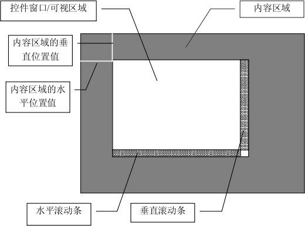
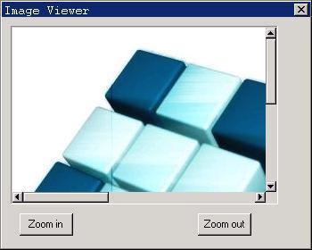

# 滚动窗口控件

滚动窗口（ScrollWnd）控件是一个使用滚动条对内容进行滚动浏览的容器控件，它的基本用途是用来放置别的控件，使用户能够在一个窗口内通过滚动的方法来查看和操作许多控件。当然，滚动窗口还可以用来做很多其它的事情，它的可定制性是很强的。在本章的最后，我们将看到一个用滚动窗口控件作为图片查看器的例子。

在应用程序中，使用 `CTRL_SCROLLWND` 控件类名称调用 `CreateWindow` 函数，即可创建滚动窗口控件。

## 1.1 可以滚动的窗口

滚动窗口控件和下一章讲述的 `ScrollView` 控件都是可以滚动的窗口控件，它们有很多相似之处。一个可以滚动的窗口有一个带滚动条的控件窗口（可视区域）和内容区域构成，如__图 1.1__ 所示。使用滚动条滚动显示内容区域时，内容区域的水平位置值或者垂直位置值将发生变化。内容区域的大小可以由应用程序控制，不过内容区域最小不能小于可视区域。


__图 1.1__  可以滚动的窗口

## 1.2 通用的滚动窗口消息

滚动窗口和 `ScrollView` 控件都响应一些通用的滚动窗口消息，包括获取和设置滚动窗口的内容范围、设置滚动条的滚动值、获取和设置内容区域的当前位置、获取和设置可视区域的大小等。

### 1.2.1 获取和设置内容区域和可视区域的范围

`SVM_SETCONTRANGE` 消息用来设置滚动窗口的内容区域的大小。

```c
int cont_w, cont_h;
SendMessage (hScrWnd, SVM_SETCONTRANGE, cont_w, cont_h);
```

`cont_w` 和 `cont_h` 分别所要设置的内容区域宽度和高度。如果 `cont_w` 或 `cont_h` 为负值，内容区域的宽度或高度将不发生改变；如果所要设置的内容区域宽度或高度值小于可视区域的宽度/高度，设置后的内容区域宽度或高度将等于可视区域的宽度或高度。

`SVM_SETCONTWIDTH` 消息和 `SVM_SETCONTHEIGHT` 消息分别设置滚动窗口的宽度和高度。

```c
int cont_w, cont_h;
SendMessage (hScrWnd, SVM_SETCONTWIDTH, cont_w, 0);
SendMessage (hScrWnd, SVM_SETCONTHEIGHT, cont_h, 0);
```

`SVM_GETCONTWIDTH`、`SVM_GETCONTHEIGHT`、`SVM_GETVISIBLEWIDTH` 和 `SVM_GETVISIBLEHEIGHT` 消息分别用来获取内容区域的宽度和高度、可视区域的宽度和高度。

### 1.2.2 获取位置信息和设置当前位置

`SVM_GETCONTENTX和SVM_GETCONTENTY` 消息用来获取内容区域的当前位置值。

```c
int pos_x = SendMessage (hScrWnd, SVM_GETCONTENTX, 0, 0);
int pos_y = SendMessage (hScrWnd, SVM_GETCONTENTY, 0, 0);
```

`SVM_SETCONTPOS` 消息用来设置内容区域的当前位置值，也就是在可视区域中移动内容区域到某个指定位置。

```c
int pos_x, pos_y;
SendMessage (hScrWnd, SVM_SETCONTPOS, pos_x, pos_y);
```

`SVM_MAKEPOSVISIBLE` 消息用来使内容区域中的某个位置点成为可见。

```c
SendMessage (hScrWnd, SVM_MAKEPOSVISIBLE, pos_x, pos_y);
```

如果该位置点原来是不可见的，使用 `SVM_MAKEPOSVISIBLE` 消息使之成为可见之后，该位置点将位于可视区域的上边缘（原位置点在可视区域之上）或者下边缘（原位置点在可视区域之下）。

### 1.2.3 获取和设置滚动属性

`SVM_GETHSCROLLVAL` 和 `SVM_GETVSCROLLVAL` 消息分别用来获取滚动窗口的当前水平和垂直滚动值（点击滚动条箭头的滚动范围值）；`SVM_GETHSCROLLPAGEVAL` 和 `SVM_GETVSCROLLPAGEVAL` 消息分别用来获取滚动窗口的当前水平和垂直页滚动值（翻页操作时的滚动范围值）。

```c
int val = SendMessage (hScrWnd, SVM_GETHSCROLLVAL, 0, 0);
int val = SendMessage (hScrWnd, SVM_GETVSCROLLVAL, 0, 0);
int val = SendMessage (hScrWnd, SVM_GETHSCROLLPAGEVAL, 0, 0);
int val = SendMessage (hScrWnd, SVM_GETVSCROLLPAGEVAL, 0, 0);
```

`SVM_SETSCROLLVAL` 消息用来设置滚动窗口的水平和（或者）垂直滚动值。`wParam` 参数为水平滚动值，`lParam` 为垂直滚动值；如果水平/垂直滚动值为0或者负值的话，滚动窗口的当前的水平/垂直滚动值将不发生变化。

```c
int h_val, v_val;
SendMessage (hScrWnd, SVM_SETSCROLLVAL, h_val, v_val);
```

`SVM_SETSCROLLPAGEVAL` 消息用来设置滚动窗口的水平和（或者）垂直页滚动值。`wParam` 参数为水平页滚动值，`lParam` 为垂直页滚动值；如果水平/垂直页滚动值为0或者负值的话，滚动窗口的当前的水平/垂直页滚动值将不发生变化。

```c
int h_val, v_val;
SendMessage (hScrWnd, SVM_SETSCROLLPAGEVAL, h_val, v_val);
```

## 1.3 滚动窗口控件消息

### 1.3.1 添加子控件

在创建了滚动窗口控件之后，就可以发送 `SVM_ADDCTRLS` 消息往其中添加子控件。该消息的 `wParam` 用来传递控件的个数，`lParam` 用来传递控件数组的指针。

```c
CTRLDATA controls[ctrl_nr];
SendMessage (hScrWnd, SVM_ADDCTRLS, (WPARAM)ctrl_nr, (LPARAM)controls);
```

需要注意的是：往滚动窗口控件中添加控件并不会改变滚动窗口内容区域的范围，如果子控件的位置超出了内容区域的当前范围，在内容区域中就看不到该控件。所以，一般在添加子控件之前需要使用 `SVM_SETCONTRANGE` 消息先设置内容区域的范围，使之适合所要添加的控件的显示。

除了创建完滚动窗口控件之后发送 `SVM_ADDCTRLS` 消息添加子控件之外，应用程序还可以在使用 `CreateWindow` 函数创建控件时，通过在附加数据项中传递一个 `CONTAINERINFO` 类型的结构指针来使滚动窗口控件创建后自动添加该结构指定的子控件。

```c
typedef struct _CONTAINERINFO
{
        WNDPROC     user_proc;            /** user-defined window procedure of the container */
        
        int         controlnr;            /** number of controls */
        PCTRLDATA   controls;             /** pointer to control array */
        
        DWORD       dwAddData;            /** additional data */
} CONTAINERINFO;
typedef CONTAINERINFO* PCONTAINERINFO;
```

`controlnr` 项为控件的个数，`controls` 指向一个 `CTRLDATA` 控件数组；位置被占用的控件的附加数据项通过 `CONTAINERINFO` 结构中的 `dwAddData` 项来传递。

`SVM_RESETCONTENT` 消息用来重置滚动窗口控件，包括清空其中的子控件和设置内容区域的范围和位置值为默认值。

```c
SendMessage (hScrWnd, SVM_RESETCONTENT, 0, 0);
```

### 1.3.2 获取子控件的句柄

`SVM_GETCTRL` 可以用来获取滚动窗口控件中的子控件的句柄。

```c
int id;
HWND hCtrl;
HCtrl = SendMessage (hScrWnd, SVM_GETCTRL, id, 0);
```

`SVM_GETFOCUSCHILD` 消息用来获取滚动窗口控件中具有键盘焦点的子控件。

```c
HWND hFocusCtrl;
HFocusCtrl = SendMessage (hScrWnd, SVM_GETFOCUSCHILD, 0, 0);
```

### 1.3.3 容器（内容）窗口过程

滚动窗口中放置子控件的窗口称为容器窗口，也就是内容窗口（区域）。应用程序可以使用 `SVM_SETCONTAINERPROC` 消息来设置新的容器窗口过程，从而达到定制滚动窗口的目的。

```c
WNDPROC myproc;
SendMessage (hScrWnd, SVM_SETCONTAINERPROC, 0, (LPARAM)myproc);
```

`lParam` 参数为应用程序自定义的容器窗口过程，该窗口过程默认情况下应该返回滚动窗口的缺省容器窗口过程函数 `DefaultContainerProc`。

```c
int GUIAPI DefaultContainerProc (HWND hWnd, int message, WPARAM wParam, LPARAM lParam);
```

此外，应用程序还可以通过前面提到的 `CONTAINERINFO` 结构的 `user_proc` 项来指定自定义的容器窗口过程。

## 1.4 编程实例

__清单 1.1__ 中的代码演示了使用滚动窗口控件来构造一个简单的图片查看器的方法。该程序的完整源代码可见本指南示例程序包 `mg-samples` 中的 `scrollwnd.c` 程序。

__清单 1.1__  滚动窗口控件示例程序

```c
#define IDC_SCROLLWND          100
#define ID_ZOOMIN              200
#define ID_ZOOMOUT             300

static HWND hScrollWnd;
static BITMAP bmp_bkgnd;
static float current_scale = 1;

static int pic_container_proc (HWND hWnd, int message, WPARAM wParam, LPARAM lParam)
{
        switch (message) {
                
                case MSG_PAINT:
                {
                        HDC hdc = BeginPaint (hWnd);
                        FillBoxWithBitmap (hdc, 0, 0, current_scale * bmp_bkgnd.bmWidth, 
                        current_scale * bmp_bkgnd.bmHeight, &bmp_bkgnd);
                        EndPaint (hWnd, hdc);
                        return 0;
                }
                
        }
        
        return DefaultContainerProc (hWnd, message, wParam, lParam);
}

static int
ImageViewerProc (HWND hDlg, int message, WPARAM wParam, LPARAM lParam)
{
        
        switch (message)
        {
                
                case MSG_INITDIALOG:
                {
                        hScrollWnd = GetDlgItem (hDlg, IDC_SCROLLWND);
                        SendMessage (hScrollWnd, SVM_SETCONTAINERPROC, 0, (LPARAM)pic_container_proc);
                        SendMessage (hScrollWnd, SVM_SETCONTRANGE, bmp_bkgnd.bmWidth, bmp_bkgnd.bmHeight);
                        
                        break;
                }
                
                case MSG_COMMAND:
                {
                        int id = LOWORD(wParam);
                        
                        if (id == ID_ZOOMIN || id == ID_ZOOMOUT) {
                                current_scale += (id == ID_ZOOMIN) ? 0.2 : -0.2;
                                if (current_scale < 0.1)
                                current_scale = 0.1;
                                
                                SendMessage (hScrollWnd, SVM_SETCONTRANGE, 
                                current_scale * bmp_bkgnd.bmWidth, 
                                current_scale * bmp_bkgnd.bmHeight);
                                InvalidateRect (hScrollWnd, NULL, TRUE);
                        }
                        
                        break;
                }
                
                case MSG_CLOSE:
                EndDialog (hDlg, 0);
                return 0;
                
        }
        
        return DefaultDialogProc (hDlg, message, wParam, lParam);
}

static CTRLDATA CtrlViewer[] =
{
        {
                "ScrollWnd",
                WS_BORDER | WS_CHILD | WS_VISIBLE | WS_VSCROLL | WS_HSCROLL,
                10, 10, 300, 200,
                IDC_SCROLLWND,
                "image viewer",
                0
        },
        {
                CTRL_BUTTON,
                WS_TABSTOP | WS_VISIBLE | BS_DEFPUSHBUTTON, 
                20, 220, 60, 25,
                ID_ZOOMIN, 
                "Zoom in",
                0
        },
        {
                CTRL_BUTTON,
                WS_TABSTOP | WS_VISIBLE | BS_PUSHBUTTON, 
                220, 220, 60, 25,
                ID_ZOOMOUT, 
                "Zoom out",
                0
        }
};

static DLGTEMPLATE DlgViewer =
{
        WS_BORDER | WS_CAPTION,
        WS_EX_NONE,
        0, 0, 350, 280,
        "Image Viewer",
        0, 0,
        TABLESIZE(CtrlViewer), CtrlViewer,
        0
};

int MiniGUIMain (int argc, const char* argv[])
{
        #ifdef _MGRM_PROCESSES
        JoinLayer(NAME_DEF_LAYER , "scrollwnd" , 0 , 0);
        #endif
        
        if (LoadBitmap (HDC_SCREEN, &bmp_bkgnd, "bkgnd.jpg"))
        return 1;
        
        DialogBoxIndirectParam (&DlgViewer, HWND_DESKTOP, ImageViewerProc, 0L);
        
        UnloadBitmap (&bmp_bkgnd);
        return 0;
}

#ifndef _ MGRM_PROCESSES
#include <minigui/dti.c>
#endif
```

这个简单的图片查看器可以通过滚动条来滚动查看图片，还可以进行放大和缩小。图片查看器通过 `SVM_SETCONTAINERPROC` 消息设置了新的容器窗口过程函数，并在 `MSG_PAINT` 消息中绘制图片。程序的运行效果如__图 1.2__ 所示。


__图 1.2__  一个简单的图片查看器
