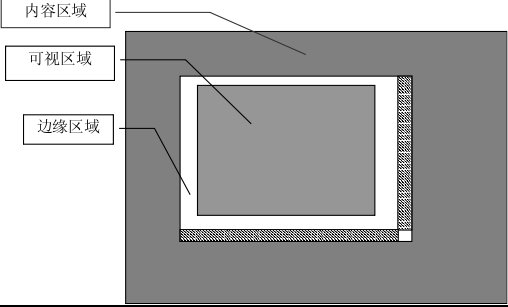
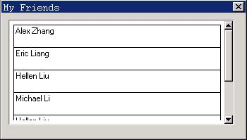

# 滚动型控件

滚动型（ScrollView）控件也是一个滚动窗口控件，和 `ScrollWnd` 控件的不同之处是滚动型控件中滚动显示的是列表项而不是控件。

滚动型的主要用途是显示和处理列表项，这点和 `Listbox` 及 `Listview` 控件类似。不过，滚动型中列表项的高度是可以由用户指定的，不同列表项可以有不同的高度。最重要的是，滚动型中列表项的内容绘制完全是由应用程序自己确定的。总的来说，滚动型是一个可定制性很强的控件，给予了应用程序很大的自由，使用滚动型可以完成许多 `Listbox` 和 `Listview` 控件不能胜任的工作。

## 1.1 控件风格

具有 `SVS_AUTOSORT` 风格的滚动型控件将对列表项进行自动排序，前提是已经使用 `SVM_SETITEMCMP` 消息设置了滚动型控件的列表项比较函数。

```c
SVM_SETITEMCMP myItemCmp;
SendMessage (hScrWnd, SVM_SETITEMCMP, 0, (LPARAM)myItemCmp);
```

`myItemCmp` 为应用程序指定的列表项比较函数。

滚动型控件的列表项比较函数是一个 `SVM_SETITEMCMP` 类型的函数，原型如下：

```c
typedef int (*SVITEM_CMP) (HSVITEM hsvi1, HSVITEM hsvi2);
```

`hsvi1` 和 `hsvi2` 为所要比较的两个列表项的句柄。如果比较函数返回负值，`hsvi` 代表的列表项将被排序在 `hsvi2` 代表的列表项之前。

此外，还可以对不具有 `SVS_AUTOSORT` 风格的滚动型控件使用 `SVM_SORTITEMS` 消息来对列表项进行一次性的排序。

```c
SVM_SETITEMCMP myItemCmp;
SendMessage (hScrWnd, SVM_SORTITEMS, 0, (LPARAM)myItemCmp);
```

`myItemCmp` 为应用程序指定的排序时使用的列表项比较函数。

## 1.2 滚动型控件消息

除了和 `ScrollWnd` 控件一样响应一些通用的滚动窗口消息之外，滚动型控件的相关消息主要用于列表项的添加、删除和访问等方面。

### 1.2.1 列表项的内容显示

滚动型控件的列表项内容显示完全是由应用程序自己确定的，所以，在使用列表项之前，必须首先指定列表项内容的显示方法。`SVM_SETITEMDRAW` 消息用来设置列表项的绘制函数。

```c
SVITEM_DRAWFUNC myDrawItem;
SendMessage (hScrWnd, SVM_SETITEMDRAW, 0, (LPARAM)myDrawItem);
```

列表项内容绘制函数是一个 `SVITEM_DRAWFUNC` 类型的函数，原型如下：

```c
typedef void (*SVITEM_DRAWFUNC) (HWND hWnd, HSVITEM hsvi, HDC hdc, RECT *rcDraw);
```

传给绘制函数的参数分别为滚动型控件窗口句柄 `hWnd`、列表项句柄 `hsvi`、图形设备上下文 `hdc` 和列表项绘制矩形区域。

列表项绘制函数可以根据滚动型控件的实际用途在指定的矩形区域中绘制自定义的内容，可以是文本，也可以是图片，一切均由应用程序自己决定。

### 1.2.2 列表项操作函数的设置

`SVM_SETITEMOPS` 消息可以用来设置列表项相关操作的一些回调函数，包括初始化、绘制和结束函数。

```c
SVITEMOPS myops;
SendMessage (hScrWnd, SVM_SETITEMOPS, 0, (LPARAM)&myops);
```

myops为一个SVITEMOPS类型的结构，指定了滚动型控件针对列表项的相关操作函数。如下：

```c
typedef struct _svitem_operations
{
        SVITEM_INITFUNC     initItem;     /** called when an ScrollView item is created */
        SVITEM_DESTROYFUNC  destroyItem;  /** called when an item is destroied */
        SVITEM_DRAWFUNC     drawItem;     /** call this to draw an item */
} SVITEMOPS;
```

`initItem` 是创建列表项时调用的初始化函数，原型如下：

```c
typedef int  (*SVITEM_INITFUNC)    (HWND hWnd, HSVITEM hsvi);
```

传递的参数为控件窗口的句柄hWnd和所创建的列表项的句柄。可以使用该函数在创建列表项时进行一些相关的初始化工作。

`destroyItem` 是销毁列表项时调用的销毁函数，原型如下：

```c
typedef void (*SVITEM_DESTROYFUNC) (HWND hWnd, HSVITEM hsvi);
```

传递的参数为控件窗口的句柄 `hWnd` 和所创建的列表项的句柄。可以使用该函数在销毁列表项时进行一些相关的清理工作，例如释放相关的资源。

`drawItem` 指定列表项的绘制函数，它的作用和使用 `SVM_SETITEMDRAW` 消息设置绘制函数是完全一样的。

### 1.2.3 列表项的操作

`SVM_ADDITEM和SVM_DELITEM` 消息分别用来添加和删除一个列表项。

```c
int idx;
HSVITEM hsvi;
SVITEMINFO svii;
Idx = SendMessage (hScrWnd, SVM_ADDITEM, (WPARAM)&hsvi, (LPARAM)&svii);
```

`svii` 是一个 `SVITEMINFO` 类型的结构，如下：

```c
typedef struct _SCROLLVIEWITEMINFO
{
        int        nItem;           /** index of item */
        int        nItemHeight;     /** height of an item */
        DWORD      addData;         /** item additional data */
} SVITEMINFO;
```

`nItem` 项为列表项的添加位置，如果 `nItem` 为负值，列表项将被添加到末尾。`nItemHeight` 为列表项的高度，`addData` 为列表项的附加数据值。

`hsvi` 用来存放所添加的列表项的句柄值，该句柄可以用来访问列表项。`SVM_ADDITEM` 消息返回所添加列表项的实际索引值。

`SVM_DELITEM` 消息用来删除一个列表项。

```c
int idx;
HSVITEM hsvi;
SendMessage (hScrWnd, SVM_DELITEM, idx, hsvi);
```

`hsvi` 指定所要删除的列表项的句柄。如果 `hsvi` 为 0，`idx` 指定所要删除的列表项的索引值。

`SVM_REFRESHITEM` 消息用来刷新一个列表项区域。

```c
int idx;
HSVITEM hsvi;
SendMessage (hScrWnd, SVM_REFRESHITEM, idx, hsvi);
```

`hsvi` 指定所要刷新的列表项的句柄。如果 `hsvi` 为 0，`idx` 指定所要刷新的列表项的索引值。

`SVM_GETITEMADDDATA` 消息用来获取列表项的附加数据。

```c
SendMessage (hScrWnd, SVM_GETITEMADDDATA, idx, hsvi);
```

`hsvi` 指定所要访问的列表项的句柄。如果 `hsvi` 为 0，`idx` 指定所要访问的列表项的索引值。

`SVM_SETITEMADDDATA` 消息用来设置列表项的附加数据。

```c
int idx;
DWORD addData;
SendMessage (hScrWnd, SVM_SETITEMADDDATA, idx, addData);
```

`idx` 指定所要访问的列表项的索引值，`addData` 为所要设置的附加数据。

`SVM_GETITEMCOUNT` 消息用来获取当前列表项的数量。

```c
int count = SendMessage (hScrWnd, SVM_GETITEMCOUNT, 0, 0);
```

`SVM_RESETCONTENT` 消息用来删除掉控件中所有的列表项。

```c
SendMessage (hScrWnd, SVM_RESETCONTENT, 0, 0);
```

### 1.2.4 获取和设置当前高亮项

滚动型控件具有一个高亮列表项属性，也就是说，列表项中仅有（如果有的话）一个列表项是当前高亮的列表项。应用程序可以设置和获取当前高亮的列表项。

需要注意的是：高亮只是滚动型控件的一个属性，某个列表项是当前的高亮项并不代表该列表项在显示上一定有什么特殊之处（如高亮显示），这完全是由应用程序来自己决定的。

`SVM_SETCURSEL` 消息用来设置控件的高亮列表项。

```c
SendMessage (hScrWnd, SVM_SETCURSEL, idx, bVisible);
```

`idx` 指定所要设置为高亮的列表项的索引值，`bVisible` 如果为 `TRUE`，该列表项将成为可见项。

`SVM_GETCURSEL` 消息用来获取控件的当前高亮列表项。

```c
int hilighted_idx = SendMessage (hScrWnd, SVM_GETCURSEL, 0, 0);
```

`SVM_GETCURSEL` 消息的返回值为当前高亮列表项的索引值。

### 1.2.5 列表项的选择和显示

滚动型控件的列表项除了有高亮属性之外，还有选中属性。高亮是唯一的，选中不是唯一的，也就是说，滚动型控件的列表项可以被多选。应用程序可以设置列表项的选中状态。

和高亮属性一样，我们同样要注意：选中只是列表项的一个状态，某个列表项是选中的项并不代表该列表项在显示上一定有什么特殊之处（如高亮显示），这也完全是由应用程序来决定的。

```c
SendMessage (hScrWnd, SVM_SELECTITEM, idx, bSel);
```

`idx` 指定所要设置的列表项的索引值。`bSel` 如果为 `TRUE`，该列表项将被设置为选中；反之为非选中。

`SVM_SHOWITEM` 消息用来显示一个列表项。

```c
SendMessage (hScrWnd, SVM_SHOWITEM, idx, hsvi);
```

`hsvi` 为所要显示的列表项的句柄。`idx` 指定所要显示的列表项的索引值，`idx` 只有在 `hsvi` 为 0 时起作用。

`SVM_CHOOSEITEM` 消息是 `SVM_SELECTITEM` 和 `SVM_SHOWITEM` 消息的组合，用来选中一个列表项并使之可见。

```c
SendMessage (hScrWnd, SVM_CHOOSEITEM, idx, hsvi);
```

`hsvi` 为所要选择和显示的列表项的句柄。`idx` 指定所要选择和显示的列表项的索引值，`idx` 只有在 `hsvi` 为 0 时起作用。

### 1.2.6 显示的优化

在使用 `SVM_ADDITEM` 消息或者 `SVM_DELITEM` 消息一次性增加或者删除很多列表项时，可以使用 `MSG_FREEZE` 消息进行一定的优化。用法是在操作之前冻结控件，操作之后解冻。

`MSG_FREEZE` 消息的 `wParam` 参数如果为 `TRUE` 则是冻结，反之为解冻。

### 1.2.7 设置可见区域的范围

滚动型控件的窗口并不全是可视区域，还包括边缘（margin）区域，如__图 1.1__ 所示


__图 1.1__  滚动型的可视区域

`SVM_SETMARGINS` 消息可以对滚动型控件的边缘范围进行设置。

```c
RECT rcMargin;
SendMessage (hScrWnd, SVM_SETMARGINS, 0, (LPARAM)&rcMargin);
```

`rcMargin` 中的 `left`、`top`、`right` 和 `bottom` 项分别为所要设置的左、上、右和下边缘的大小，如果设置的某个边缘值为负值，对应的设置将不起作用。

`SVM_GETMARGIN` S消息可以获取滚动型控件的边缘范围值。

```c
RECT rcMargin;
SendMessage (hScrWnd, SVM_GETMARGINS, 0, (LPARAM)&rcMargin);
```

`SVM_GETLEFTMARGIN`、`SVM_GETTOPMARGIN`、`SVM_GETRIGHTMARGIN` 和 `SVM_GETBOTTOMMARGIN` 消息分别用来获取左、上、右和下边缘值。

## 1.3 控件通知码

滚动型控件在响应用户点击等操作和发生某些状态改变时会产生通知消息，包括：

- `SVN_SELCHANGED`：当前高亮列表项发生改变
- `SVN_CLICKED`：用户点击列表项
- `SVN_SELCHANGING`：当前高亮列表项正发生改变

应用程序需要使用 `SetNotificationCallback` 函数注册一个通知消息处理函数，在该函数中对收到的各个通知码进行应用程序所需的处理。

`SVN_CLICKED` 和 `SVN_SELCHANGED` 通知消息处理函数传递的附加数据为被点击或者当前高亮的列表项句柄。

`SVN_SELCHANGING` 通知消息处理函数传递的附加数据为先前高亮的列表项句柄。

## 1.4 编程实例

__清单 1.1__ 中的代码演示了使用滚动型控件来构造一个简单的联系人列表程序的方法。该程序的完整源代码可见本指南示例程序包 `mg-samples` 中的 `scrollview.c` 程序。

__清单 1.1__  滚动型控件示例程序

```c
#define IDC_SCROLLVIEW    100
#define IDC_BT          200
#define IDC_BT2         300
#define IDC_BT3         400
#define IDC_BT4         500

static HWND hScrollView;

static const char *people[] =
{
        "Peter Wang",
        "Michael Li",
        "Eric Liang",
        "Hellen Zhang",
        "Tomas Zhao",
        "William Sun",
        "Alex Zhang"
};

static void myDrawItem (HWND hWnd, HSVITEM hsvi, HDC hdc, RECT *rcDraw)
{
        const char *name = (const char*)ScrollView_get_item_adddata (hsvi);
        
        SetBkMode (hdc, BM_TRANSPARENT);
        SetTextColor (hdc, PIXEL_black);
        
        if (ScrollView_is_item_hilight(hWnd, hsvi)) {
                SetBrushColor (hdc, PIXEL_blue);
                FillBox (hdc, rcDraw->left+1, rcDraw->top+1, RECTWP(rcDraw)-2, RECTHP(rcDraw)-1);
                SetBkColor (hdc, PIXEL_blue);
                SetTextColor (hdc, PIXEL_lightwhite);
        }
        
        Rectangle (hdc, rcDraw->left, rcDraw->top, rcDraw->right - 1, rcDraw->bottom);
        TextOut (hdc, rcDraw->left + 3, rcDraw->top + 2, name);
}

static int myCmpItem (HSVITEM hsvi1, HSVITEM hsvi2)
{
        const char *name1 = (const char*)ScrollView_get_item_adddata (hsvi1);
        const char *name2 = (const char*)ScrollView_get_item_adddata (hsvi2);
        
        return strcmp (name1, name2);
}

static int
BookProc (HWND hDlg, int message, WPARAM wParam, LPARAM lParam)
{
        
        switch (message)
        {
                
                case MSG_INITDIALOG:
                {
                        SVITEMINFO svii;
                        static int i = 0;
                        
                        hScrollView = GetDlgItem (hDlg, IDC_SCROLLVIEW);
                        SetWindowBkColor (hScrollView, PIXEL_lightwhite);
                        
                        SendMessage (hScrollView, SVM_SETITEMCMP, 0, (LPARAM)myCmpItem);
                        SendMessage (hScrollView, SVM_SETITEMDRAW, 0, (LPARAM)myDrawItem);
                        
                        for (i = 0; i < TABLESIZE(people); i++) {
                                svii.nItemHeight = 32;
                                svii.addData = (DWORD)people[i];
                                svii.nItem = i;
                                SendMessage (hScrollView, SVM_ADDITEM, 0, (LPARAM)&svii);
                        }
                        break;
                }
                
                case MSG_COMMAND:
                {
                        int id = LOWORD (wParam);
                        int code = HIWORD (wParam);
                        
                        switch (id) {
                                case IDC_SCROLLVIEW:
                                if (code == SVN_CLICKED) {
                                        int sel;
                                        sel = SendMessage (hScrollView, SVM_GETCURSEL, 0, 0);
                                        InvalidateRect (hScrollView, NULL, TRUE);
                                }
                                break;
                                
                        }
                        break;
                }
                
                case MSG_CLOSE:
                {
                        EndDialog (hDlg, 0);
                        return 0;
                }
                
        }
        
        return DefaultDialogProc (hDlg, message, wParam, lParam);
}

static CTRLDATA CtrlBook[] =
{
        {
                "ScrollView",
                WS_BORDER | WS_CHILD | WS_VISIBLE | WS_VSCROLL | WS_HSCROLL |
                SVS_AUTOSORT,
                10, 10, 320, 150,
                IDC_SCROLLVIEW,
                "",
                0
        },
};

static DLGTEMPLATE DlgBook =
{
        WS_BORDER | WS_CAPTION,
        WS_EX_NONE,
        0, 0, 350, 200,
        "My Friends",
        0, 0,
        TABLESIZE(CtrlBook), NULL,
        0
};
```

该程序把联系人以列表的形式显示出来，并且按名字进行了排序。


__图 1.2__  联系人列表
