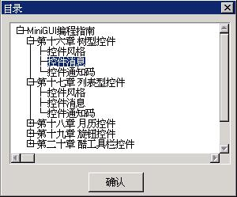

# 31 树型控件

树型控件（treeview）以树型的方式显示一系列的分层次的项，每个项（子项）可以包括一个或多个子项。每项或子项包括文字标题和可选的图标，用户可以通过点击该项来展开或折叠该项中的子项。树型控件比较适合用来表示具有从属关系的对象，例如，文件、目录结构，或者某一机构的组织情况。

使用 `CTRL_TREEVIEW` 作为控件类名称，可以通过 `CreateWindow` 函数调用创建树型控件。

我们在创建树型控件之后，可以通过发送相应的消息来添加、删除、设置、获取和查找节点项。

## 1.1 树型控件风格

树型控件的风格控制控件的外观。你可以在创建控件时指定最初的控件风格，还可以在之后使用 `GetWindowStyle` 获取其风格和用 `SetWindowStyle` 设置新的风格。

带有 `TVS_WITHICON` 风格的树型控件使用图标来显示每项的折叠和展开状态，相应的图标可以在创建节点项时指定。如果没有为某个节点项指定特定的图标的话，树型控件将使用 MiniGUI 配置文件 `MiniGUI.cfg` 中指定的 “treefold” 和 “treeunfold” 图标。没有 `TVS_WITHICON` 风格的树型控件使用一个带方框的 “+” 号来表示一个折叠的节点项，用带方框的 “-” 号来表示展开的节点项。

`TVS_SORT` 风格的树型控件将对节点项进行自动排序。

带有 `TVS_NOTIFY` 风格的树型控件将在响应用户操作时产生相应的通知消息和通知码。

>【注意】在 MiniGUI 3.0 中，`TreeView` 控件的 `TVS_ICONFORSELECT` 风格被取消；使用此风格对 `TreeView` 控件无任何影响。

## 1.2 树型控件消息

### 1.2.1 节点项的创建和删除

树型控件由根节点和一系列的子节点构成。我们可以在使用 `CreateWindow` 函数创建树型控件时，通过该函数的 `dwAddData` 参数把一个 `TVITEMINFO` 类型的结构指针传递给树型控件来指定根节点的属性。具体例子可参见 31.4 中的编程实例。`TVITEMINFO` 结构中包含了（根）节点的属性信息。

```c
typedef struct _TVITEMINFO
{
        /* 该项的文字标题 */
        char *text;
        
        /* 该项的状态标志 */
        DWORD dwFlags;
        
        /* 折叠项的图标句柄 */
        HICON hIconFold;
        /* 展开项的图标句柄 */
        HICON hIconUnfold;
        
        /* 该项的附加数据 */
        DWORD dwAddData;
} TVITEMINFO;

```

`text` 为节点的标题，如果创建树型控件时不指定根节点的属性，根节点的标题将为“root”。

`dwFlags` 为节点项的状态标志，`TVIF_SELECTED` 表明该节点是被选择的项，`TVIF_FOLD` 表明该节点项初始是折叠的。在添加节点时，只有 `TVIF_FOLD` 标志是可用的。

`hIconFold` 和 `hIconUnfold` 分别是节点折叠和展开时所使用的用户自定义图标句柄。使用这两项只有在树型控件为 `TVS_WITHICON` 风格时才是有意义的。

`TVM_ADDITEM`（`TVM_INSERTITEM`）消息往树型控件中插入一个节点项：

```c
TVITEMINFO tvItemInfo;
GHANDLE item;
item = SendMessage (hTrvWnd, TVM_ADDITEM, 0, (LPARAM) &tvItemInfo);
```

`item` 为 `SendMessage` 函数返回的代表所添加节点的句柄值，之后我们需要使用该句柄来操作该节点项。

`TVM_DELTREE` 消息删除一个节点及其所有子项（包括子项的子项）：

```c
SendMessage (hTrvWnd, TVM_DELTREE, (WPARAM)item, 0);
```

`item` 是一个 `GHANDLE` 类型的句柄值，该值应该是使用 `TVM_ADDITEM` 消息添加该节点时 `SendMessage` 函数返回的句柄值。

### 1.2.2 节点项属性的设置和获取

`TVM_GETITEMINFO` 消息用来获取某个节点项的属性信息：

```c
TVITEMINFO tvii;
GHANDLE item;
SendMessage (hTrvWnd, TVM_GETITEMINFO, (WPARAM)item, (LPARAM)&tvii);
```

`item` 是所要获取信息的节点项的句柄，`tvii` 结构用来存放所获取的节点项属性信息。使用时我们要注意，`tvii` 结构中的 `text` 所指向的字符缓冲区应该足够大。

`TVM_SETITEMINFO` 消息用来设置某个节点项的属性：

```c
TVITEMINFO tvii;
GHANDLE item;
SendMessage (hTrvWnd, TVM_SETITEMINFO, (WPARAM)item, (LPARAM)&tvii);
```

`item` 是所要设置的节点项的句柄，`tvii` 结构用包含了所要设置的节点项属性信息。

`TVM_GETITEMTEXT` 消息获取某个节点项的文字标题：

```c
char *buffer;
SendMessage (hTrvWnd, TVM_GETITEMTEXT, (WPARAM)item, (LPARAM)buffer);
```

`buffer` 字符缓冲区应该足够大以存放节点项的文字标题。

节点项的文字标题的长度可以用 `TVM_GETITEMTEXTLEN` 消息来获取：

```c
int len;
len = SendMessage (hTrvWnd, TVM_GETITEMTEXTLEN, (WPARAM)item, 0);
```

### 1.2.3 选择和查找节点项

`TVM_SETSELITEM` 消息用来选择某个节点项：

```c
GHANDLE item;
SendMessage (hTrvWnd, TVM_SETSELITEM, (WPARAM)item, 0);
```

`item` 为所要选择的节点项句柄。

`TVM_GETSELITEM` 消息获取当前被选择的节点项：

```c
GHANDLE item;
item = SendMessage (hTrvWnd, TVM_GETSELITEM, 0, 0);
```

`item` 为当前被选择的节点项的句柄。

`TVM_GETROOT` 消息用来获取树型控件的根节点：

```c
GHANDLE rootItem;
rootItem = SendMessage (hTrvWnd, TVM_GETROOT,  0, 0);
```

`TVM_GETRELATEDITEM` 消息用来获取指定节点的相关节点项：

```c
GHANDLE item;
int related;
GHANDLE relItem;
relItem = SendMessage (hTrvWnd, TVM_GETRELATEDITEM,  related, (LPARAM)item);
```

`item` 为指定的节点，`related` 可以是如下值：

- `TVIR_PARENT`：获取 `item` 节点的父节点
- `TVIR_FIRSTCHILD`：获取 `item` 节点的第一个子节点
- `TVIR_NEXTSIBLING`：获取 `item` 节点的下一个兄弟节点
- `TVIR_PREVSIBLING`：获取 `item` 节点的前一个兄弟节点

`SendMessage` 函数返回所获取的节点项的句柄值。

`TVM_SEARCHITEM` 消息用来查找某个特定的节点项：

```c
GHANDLE itemRoot;
const char *text;
GHANDLE found;
found = SendMessage (hTrvWnd, TVM_SEARCHITEM, (WPARAM) itemRoot, (LPARAM) text);
```

`itemRoot` 所指定的节点树就是查找的范围，`text` 所指的字符串就是查找的内容。如果查找成功，`SendMessage` 函数将返回查找到的节点项的句柄。如果失败则返回0。

`TVM_FINDCHILD` 消息用来查找节点项的特定子节点：

```c
GHANDLE itemParent;
const char *text;
GHANDLE found;
found = SendMessage (hTrvWnd, TVM_FINDCHILD, (WPARAM) itemParent, (LPARAM) text);
```

`itemParent` 所指定的节点的子节点是所要查找的节点范围，`text` 所指的字符串就是查找的内容。如果查找成功，`SendMessage` 函数将返回查找到的节点项的句柄。如果失败则返回0。

`TVM_FINDCHILD` 和 `TVM_SEARCHITEM` 消息的不同之处在于：`TVM_FINDCHILD` 只在子节点中查找，而 `TVM_SEARCHITEM` 在整个节点树中查找。

### 1.2.4 比较和排序

`TVS_SORT` 风格的树型控件对节点项进行自动排序。应用程序在使用 `TVM_ADDITEM` 消息添加节点项时，如果控件没有 `TVS_SORT` 风格，各项按添加的先后顺序排列；如果有 `TVS_SORT` 风格，各项按字符串比较次序排列。

字符串的排列次序由树型控件的字符串比较函数确定。初始的字符串比较函数为 `strncmp`，应用程序可以通过 `TVM_SETSTRCMPFUNC` 消息来设置新的树型控件字符串比较函数：

```c
SendMessage (hTrvWnd, TVM_SETSTRCMPFUNC, 0, (LPARAM)str_cmp);
```

`str_cmp` 为 `STRCMP` 类型的函数指针：

```c
typedef int (*STRCMP) (const char* s1, const char* s2, size_t n);
```

该字符串比较函数比较字符串 s1 和 s2 的最多 n 个字符，并根据比较结果返回一个小于 0、等于 0 或大于 0 的整数。

## 1.3 树型控件的通知码

树型控件在响应用户点击等操作和发生某些状态改变时会产生通知消息，包括：

- `TVN_SELCHANGE`：当前选择的节点项发生改变
- `TVN_DBLCLK`：用户双击节点项
- `TVN_SETFOCUS`：树型控件获得焦点
- `TVN_KILLFOCUS`：树型控件失去焦点
- `TVN_CLICKED`：用户单击节点项
- `TVN_ENTER`：用户按下回车键
- `TVN_FOLDED`：节点项被折叠
- `TVN_UNFOLDED`：节点项被展开

如果应用程序需要了解树型控件产生的通知码的话，需要使用 `SetNotificationCallback` 函数注册一个通知消息处理函数，在该函数中对收到的各个通知码进行应用程序所需的处理。

## 1.4 编程实例

__清单 1.1__ 中的代码演示了树型控件的使用。该程序的完整源代码可见本指南示例程序包 `mg-samples` 中的 `treeview.c` 程序。

__清单 1.1__  树型控件示例程序

```c
#define IDC_TREEVIEW  100

#define CHAPTER_NUM    5

/* 定义树型控件条目使用的文本 */
static const char *chapter[] = 
{
        "第十六章 树型控件",
        "第十七章 列表型控件",
        "第十八章 月历控件",
        "第十九章 旋钮控件",
        "第二十章 酷工具栏控件",
};

/* 定义树型控件条目使用的文本 */
static const char *section[] =
{
        "控件风格",
        "控件消息",
        "控件通知码"
};

static int BookProc(HWND hDlg, int message, WPARAM wParam, LPARAM lParam)
{
        switch (message) {
                case MSG_INITDIALOG:
                {
                        TVITEMINFO tvItemInfo;
                        int item;
                        int i, j;
                        
                        /* 向树型控件中添加条目 */
                        for (i = 0; i < CHAPTER_NUM; i++) {
                                tvItemInfo.text = (char*)chapter[i];
                                item = SendMessage (GetDlgItem(hDlg, IDC_TREEVIEW), TVM_ADDITEM, 
                                0, (LPARAM)&tvItemInfo);
                                /* 向每个条目中添加子条目 */
                                for (j = 0; j < 3; j++) {
                                        tvItemInfo.text = (char*)section[j];
                                        SendMessage (GetDlgItem(hDlg, IDC_TREEVIEW), TVM_ADDITEM, 
                                        item, (LPARAM)&tvItemInfo);
                                }
                        }
                }
                break;
                
                case MSG_CLOSE:
                EndDialog (hDlg, 0);
                return 0;
        }
        
        return DefaultDialogProc (hDlg, message, wParam, lParam);
}

static TVITEMINFO bookInfo =
{
        "MiniGUI编程指南"
};

/* 对话框模板 */
static DLGTEMPLATE DlgBook =
{
        WS_BORDER | WS_CAPTION,
        WS_EX_NONE,
        100, 100, 320, 240,
        #ifdef _LANG_ZHCN
        "目录",
        #else
        "Book Content",
        #endif
        0, 0,
        1, NULL,
        0
};

/* 这个对话框中只有一个控件：树型控件 */
static CTRLDATA CtrlBook[] =
{
        {
                CTRL_TREEVIEW,
                WS_BORDER | WS_CHILD | WS_VISIBLE | 
                WS_VSCROLL | WS_HSCROLL,
                10, 10, 280, 180,
                IDC_TREEVIEW,
                "treeview control",
                (DWORD)&bookInfo
        }
};
```


__图 1.1__  书目录的树型显示

`treeview.c` 程序用树型控件来显示书目录结构。程序在用对话框模版创建对话框时指定树型控件数据结构 `CTRLDATA的dwAddData` 项为 `&bookInfo`，`bookInfo` 是一个 `TVITEMINFO` 类型的结构，其中给出了节点的标题为“MiniGUI编程指南”，因此所创建的树型控件的根节点标题就是“MiniGUI编程指南”。
