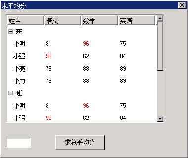

# 列表型控件

列表型控件（listview）以列表的方式显示一系列的数据项（列表项），每个列表项的内容可以由一个或多个子项构成，不同列表项的相同类型子项以列的方式组织，列表型控件的表头（header）内容通常反映了列表项不同子项的意义。外观上，列表型控件就是一个包括表头部分和列表项部分的矩形框。可以通过拖动表头来调整列表型控件中各个子项的列宽，列表中显示不下的内容可以通过滚动条来滚动显示。

对于包括多个属性的数据项而言，列表型控件是一种方便和有效的数据项排列和展示工具。例如，列表型控件经常用来作为文件浏览框，它可以在一个区域内显示包括文件名、文件类型、大小和修改日期在内的诸多文件属性。

你可以通过调用 `CreateWindow` 函数，使用控件类名称 `CTRL_LISTVIEW`，来创建一个列表型控件。应用程序通常通过向一个列表型控件发送消息来增加、删除、排列和操作列表项。和别的控件一样，列表型控件在响应用户点击等操作时会产生通知消息。

## 1.1 列表型控件风格

默认状态下，列表型控件窗口只显示表头和列表项，显示区域的周围没有边界。你可以在以 `CreateWindow` 函数创建控件时使用窗口风格标识号 `WS_BORDER` 来给列表型控件加上边界。另外，还可以使用窗口风格 `WS_VSCROLL` 和 `WS_HSCROLL` 来增加垂直和水平滚动条，以便用鼠标来滚动显示列表型控件中的各项内容。

`LVS_TREEVIEW` 风格的列表型控件支持以树型的方式来显示列表项，也就是说，该风格的列表型控件合并了普通列表型控件和树型控件的功能。

`LVS_UPNOTIFY` 风格指定列表型控件的在响应用户鼠标点击操作时的响应方式。默认情况下，如果没有指定 `LVS_UPNOTIFY` 风格，列表型控件将在鼠标按下时发出通知消息；如果指定了该风格，控件将在鼠标抬起时发出通知消息。

## 1.2 列表型控件消息

### 1.2.1 列的操作

在创建一个列表型控件之后，下一步通常需要往该控件中添加一列或依次添加多列，这是由应用程序向控件发送 `LVM_ADDCOLUMN` 消息来完成的：

```c
LVCOLUMN p;
SendMessage (hwndListView, LVM_ADDCOLUMN, 0, (LPARAM)&p) ;
```

其中，`p` 是一个 `LVCOLUMN` 结构，其中包含了列表型控件中新增的列的相关信息。`LVCOLUMN` 结构定义以及各项意义如下：

```c
typedef struct _LVCOLUMN
{
        /* 新增列的位置 */
        int nCols;
        /* 列宽 */
        int width;
        /* 列的标题 */
        char *pszHeadText;
        /* 列标题的最大长度 */
        int nTextMax;
        /* 列表头的图象 */
        DWORD image; 
        /* 用于列排序的比较函数 */
        PFNLVCOMPARE pfnCompare;
        /* 列标志 */
        DWORD colFlags;
} LVCOLUMN;
typedef LVCOLUMN *PLVCOLUMN;
```

`LVCOLUMN` 结构用于创建或操作列表型控件的列，和 `LVM_ADDCOLUMN`、`LVM_GETCOLUMN`、`LVM_SETCOLUMN` 及 `LVM_MODIFYHEAD` 等消息一块使用。

在使用于 `LVM_ADDCOLUMN` 消息时，`LVCOLUMN` 结构中需要至少给出 `pszHeadText` 项的值，也就是列的标题，其它项可以置为 0，这时列表型控件将采用这些项的缺省值。

`nCols` 项是一个整数值，指明新增列是第几列，列次序从 1 开始。如果 `nCols` 值为 0 或超出列次序的范围，新增的列将添加为列表型控件的最后一列。`width` 项为新增列的列宽度，如果不指定该值或为 0，新增列的宽度将采用缺省值。`nTextMax` 项在用于添加列时可以忽略。

`image` 项是一个位图或图标句柄，如果指定该项值的话，所指的图像将显示在列的头部。该项目前还没有起作用。

`pfnCompare` 指向一个 `PFNLVCOMPARE` 类型的函数，该函数就是新增列所附的比较函数。当用户点击该列的标题时，列表型控件将根据该比较函数来确定各个列表项的次序。如果不指定列的比较函数的话，列表型控件将采用默认的字符串比较函数。

```c
typedef int (*PFNLVCOMPARE) (int nItem1, int nItem2, PLVSORTDATA sortData);
```

`nItem1` 和 `nItem2` 为整数值，是所比较的两个列表项的索引值。`sortData` 项目前没有意义。比较函数根据传递给它的两个列表项索引值来确定比较结果，比较的依据通常和比较函数所附的列的含义相关，而该含义是由应用程序定义的。比较时很可能还需要除列表项索引值之外的其它数据，一种常用和可行的做法是：在添加列表项时添上对比较函数有用的附加数据项，然后在比较函数中获取该项，进行处理。

`colFlags` 项为列的标志，目前有标题对齐标志：`LVCF_LEFTALIGN`、`LVCF_RIGHTALIGN` 和 `LVCF_CENTERALIGN`，分别表示列中文字左对齐、右对齐和居中对齐。

在创建列之后，还可以通过 `LVM_SETCOLUMN` 消息来设置和修改列的各项属性：

```c
LVCOLUMN p;
SendMessage (hwndListView, LVM_SETCOLUMN, 0, (LPARAM)&p);
```

`p` 也是一个 `LVCOLUMN` 结构，各项意义及要求和 `LVM_ADDCOLUMN` 消息中的参数 `p` 相同。

LVM_MODIFYHEAD 消息是 LVM_SETCOLUMN 的简化，可以用来设置列表头的标题：

```c
LVCOLUMN p;
SendMessage (hwndListView, LVM_MODIFYHEAD, 0, (LPARAM)&p) ;
```

`p` 同样是一个 `LVCOLUMN` 结构，不过只需给出 `nCols` 和 `pszHeadText` 项的值。

`LVM_GETCOLUMN` 消息用来获取列表型控件中某一列的属性：

```c
LVCOLUMN p;
int nCols;
SendMessage (hwndListView, LVM_GETCOLUMN, nCols, (LPARAM)&p) ;
```

`nCols` 是所要获取信息的列的整数索引值，`p` 是一个 `LVCOLUMN` 结构，该结构用来存放所获取的列相关属性。

`LVM_GETCOLUMNWIDTH` 消息用来获取某列的宽度：

```c
int width;
int nCols;
width = SendMessage (hwndListView, LVM_GETCOLUMNWIDTH, nCols, 0) ;
```

`nCols` 是所要获取信息的列的整数索引值，`SendMessage` 函数的返回值就是列的宽度，出错的话则返回 -1。

`LVM_GETCOLUMNCOUNT` 消息用来获取列表型控件中列的数量：

```c
int count;
count = SendMessage (hwndListView, LVM_GETCOLUMNCOUNT, 0, 0) ;
```

`SendMessage` 函数的返回值就是列的数量。

`LVM_DELCOLUMN` 消息用来删除列表型控件中的一列：

```c
int nCols;
SendMessage (hwndListView, LVM_DELCOLUMN, nCols, 0) ;
```

`nCols` 为所要删除的列的索引值。

`LVM_SETHEADHEIGHT` 用来设置列表头的高度：

```c
int newHeight;
SendMessage (hwndListView, LVM_SETHEADHEIGHT, newHeight, 0) ;
```

`newHeight` 为新的表头高度值。

### 1.2.2 列表项操作

列表型控件由许多纵向排列的列表项组成，每个列表项由列分为多个子项，列表项可以包含特定的应用程序定义的附加数据。应用程序可以通过发送相应的消息来添加、修改和设置、删除列表项或获取列表项的属性信息。

在使用 `CreateWindow` 函数创建一个列表型控件之后，控件中还没有任何条目，需要通过 `LVM_ADDITEM` 消息来往列表型控件中添加列表项：

```c
HLVITEM hItem;
HLVITEM hParent;
LVITEM lvItem;
hItem = SendMessage (hwndListView, LVM_ADDITEM, hParent, (LPARAM)&lvItem) ;
```

`hParent` 指定了新增列表项的父节点，`hParent` 为 0 表示把该节点添加到根节点下（最顶层）。如果该控件是普通的列表型控件，`hParent` 为 0 即可。

`lvItem` 是一个 `LVITEM` 类型的结构，其中包含了列表型控件中新增的列表项的相关信息。`LVITEM` 结构定义以及各项意义如下：

```c
typedef struct _LVCOLUMN
{
        /* 新增列的位置 */
        int nCols;
        /* 列宽 */
        int width;
        /* 列的标题 */
        char *pszHeadText;
        /* 列标题的最大长度 */
        int nTextMax;
        /* 列表头的图象 */
        DWORD image; 
        /* 用于列排序的比较函数 */
        PFNLVCOMPARE pfnCompare;
        /* 列标志 */
        DWORD colFlags;
} LVCOLUMN;
typedef LVCOLUMN *PLVCOLUMN;
```

`nItem` 为新增列表项的位置值，如果该值超出索引值范围的话，新增的项将被添加到列表的最后。如果 `LVM_ADDITEM` 消息的 `wParam` 参数指定了新添节点的父节点，`nItem` 项所表示的位置值指的是新添节点在父节点中的位置。`itemData` 项用于保存列表项的附加数据，该数据的含义由应用程序定义。

`LVM_ADDITEM` 消息的返回值为新增列表项的句柄，该句柄可以在其它访问列表型的消息中使用。

通过 `LVM_ADDITEM` 消息新增的列表项中还没有内容，需要用 `LVM_FILLSUBITEM` 或 `LVM_SETSUBITEM` 消息来设置列表项中各个子项的内容。

`LVM_GETITEM` 消息用来获取一个列表项的信息：

```c
LVITEM lvItem;
HLVITEM hItem;
SendMessage (hwndListView, LVM_GETITEM, hItem, (LPARAM)&lvItem) ;
```

`hItem` 为目标列表型的句柄。`lvItem` 是 `LVITEM` 类型的结构，该结构用来保存所获取的列表项信息；如果 `hItem` 为 0，`lvItem` 结构的 `nItem` 域应该预设为所要获取的列表项的索引值。

`LVM_GETITEMCOUNT` 消息用来获取列表型控件的列表项数量：

```c
int count;
count = SendMessage (hwndListView, LVM_GETITEMCOUNT, 0, 0) ;
```

`SendMessage` 函数的返回值就是列表型控件的列表项数量。

`LVM_GETITEMADDDATA` 消息用来获取列表项的附加数据：

```c
DWORD addData;
int nItem;
HLVITEM hItem;
addData = SendMessage (hwndListView, LVM_GETITEMADDDATA, nItem, hItem) ;
```

`hItem` 为所要获取的列表项的句柄；如果 `hItem` 为 0，`nItem` 指定所要获取的列表项的索引值。`SendMessage` 函数返回列表项的附加数据。

`LVM_SETITEMADDDATA` 消息设置列表项的附加数据：

```c
HLVITEM hItem;
DWORD addData;
SendMessage (hwndListView, LVM_GETITEMADDDATA, hItem, (LPARAM)addData) ;
```

`hItem` 为所要设置的列表项的句柄。`addData` 为附加数据。如果设置成功，`SendMessage` 返回 `LV_OKAY`，否则返回 `LV_ERR`。

`LVM_SETITEMHEIGHT` 消息可以用来设置一个列表型控件的列表项高度。如果不设置的话，列表型控件的列表项高度将采用缺省值。

```c
HLVITEM hItem;
int newHeight;
SendMessage (hwndListView, LVM_SETITEMHEIGHT, hItem, newHeight) ;
```

`hItem` 为所要设置的列表项的句柄。`newHeight` 为列表项新的高度值。如果设置成功，`SendMessage` 函数返回 `TRUE`，否则返回 `FALSE`。

`LVM_DELITEM` 消息用来在列表型控件中删除一个列表项，`LVM_DELALLITEM` 消息删除所有的列表项：

```c
HLVITEM hItem;
int nItem;
SendMessage (hwndListView, LVM_DELITEM, nItem, hItem) ;
SendMessage (hwndListView, LVM_DELALLITEM, 0, 0) ;
```

`hItem` 为所要删除的列表项的句柄；如果 `hItem` 为 0，`nItem` 指定所要删除的列表项的索引值。

每个列表项包括一个或多个子项，子项的数目和列表型控件的列数相同。一个子项中包括字符串和图像，可以使用 `LVM_SETSUBITEM`、`LVM_SETSUBITEMTEXT` 和 `LVM_SETSUBITEMCOLOR` 和 `LVM_GETSUBITEMTEXT` 等消息来获取和设置子项的属性。

`LVM_SETSUBITEM`（`LVM_FILLSUBITEM`）消息用来设置子项的各项属性：

```c
LVSUBITEM subItem;
HLVITEM hItem;
SendMessage (hwndListView, LVM_SETSUBITEM, hItem, (LPARAM)&subItem) ;
```

`hItem` 为所要设置的列表项的句柄。`subItem` 是 `LVSUBITEM` 类型的结构，其中包含了创建一个子项所需的相关信息。

```c
typedef struct _LVSUBITEM
{
        /* 子项的标志 */
        DWORD flags;
        /* 子项的垂直索引值 */
        int nItem;
        /* 子项的水平索引值 */
        int subItem;
        /* 子项的文字内容 */
        char *pszText;
        /* 子项的文字长度 */
        int nTextMax;
        /* 子项的文字颜色 */
        int nTextColor;
        /* 子项的图像 */
        DWORD image; 
} LVSUBITEM;
typedef LVSUBITEM *PLVSUBITEM;
```

`flags` 为子项的标志值，目前包括：`LVFLAG_BITMAP` 和 `LVFLAG_ICON`，如果子项中要显示位图或图标的话，应该把相应的标志置上，如：`flags |= LVFLAG_BITMAP`。

`nItem` 和 `subItem` 分别为所设置子项的垂直索引值和水平索引值，也就是行和列的位置；如果 `LVM_SETSUBITEM` 消息的 `wParam` 参数指定了目标列表项的句柄的话，`nItem` 将被忽略。`pszText` 为子项中所要显示的文字内容。`nTextMax` 为子项的最大文字长度，用于 `LVM_SETSUBITEM` 消息时可以忽略。`LVSUBITEM` 结构用于获取子项信息时，`pszText` 指向存放文字内容的缓存区，`nTextMax` 指明该缓冲区的大小。

`nTextColor` 指定子项的文字颜色，我们也可以另外使用 `LVM_SETSUBITEMCOLOR` 消息来设置子项的文字颜色。`image` 指定要在子项中显示的位图或图标，该值只有在 `flags` 项置上 `LVFLAG_BITMAP` 或 `LVFLAG_ICON` 标志时才起作用。

`LVM_GETSUBITEMTEXT` 和 `LVM_SETSUBITEMTEXT` 消息分别用来获取和设置子项的文字内容，`LVM_GETSUBITEMLEN` 消息获取子项字符串的长度：

```c
LVSUBITEM subItem;
HLVITEM hItem;
int len;

SendMessage (hwndListView, LVM_GETSUBITEMTEXT, hItem, (LPARAM)&subItem) ;
SendMessage (hwndListView, LVM_SETSUBITEMTEXT, hItem, (LPARAM)&subItem) ;
len = SendMessage (hwndListView, LVM_GETSUBITEMLEN, hItem, (LPARAM)&subItem) ;
```

### 1.2.3 选择、显示和查找列表项

`LVM_SELECTITEM` 消息用来选择一个列表项，被选中的项将高亮显示。需要注意的是，被选中的项并不一定是可见的。

```c
int nItem;
HLVITEM hItem;

SendMessage (hwndListView, LVM_SELECTITEM, nItem, hItem) ;
```

`hItem` 为所要选择的列表项的句柄；如果 `hItem` 为 0，`nItem` 指定所要选择的列表项的索引值。

`LVM_GETSELECTEDITEM` 消息用来确定当前被选中的列表项：

```c
HLVITEM hItemSelected;
hItemSelected = SendMessage (hwndListView, LVM_GETSELECTEDITEM, 0, 0) ;
```

`SendMessage` 函数返回列表型控件当前被选中的列表项的句柄。如果没有被选中的项，则返回0。

`LVM_SHOWITEM` 消息使一个列表项在列表型控件中成为可见的条目。使一个列表项可见并不会使之被选中。

```c
HLVITEM hItem;
int nItem;
SendMessage (hwndListView, LVM_SHOWITEM, nItem, hItem) ;
```

`hItem` 为所要显示的列表项的句柄。如果 `hItem` 为 0，`nItem` 指定所要显示的列表项的索引值。如果所要显示的条目原来是不可见的或不完全可见的，那么在使用 `LVM_SHOWITEM` 消息之后，它将成为可见区域中的第一个或最后一个可见条目，而且是完全可见的。

`LVM_CHOOSEITEM` 是 `LVM_SELECTIEM` 和 `LVM_SHOWITEM` 功能的组合，它使一个列表项被选中而且成为可见的项。

```c
int nItem;
HHLVITEM hItem;
SendMessage (hwndListView, LVM_CHOOSEITEM, nItem, hItem) ;
```

`hItem` 为所要选择和显示的列表项的句柄；如果 `hItem` 为 0，`nItem` 指定所要选择和显示的列表项的索引值。

`LVM_FINDITEM` 消息用于在列表型控件中查找一个特定的列表项。如果查找成功的话，`SendMessage` 返回查找到的列表项的句柄。

```c
HLVITEM hFound;
HLVITEM hParent;
LVFINDINFO findInfo;
hFound = SendMessage (hwndListView, LVM_FINDITEM, hParent, (LPARAM)&findInfo) ;
```

`hParent` 指定查找的目标节点树的根节点。`findInfo` 是 `LVFINDINFO` 类型的结构，其中包含了查找时所需要的信息。

```c
typedef struct _LVFINDINFO
{
        /* 查找标志 */
        DWORD flags;
        /* 查找的开始索引 */
        int iStart;
        /* pszInfo项包含几列的文字内容 */
        int nCols;
        /* 查找的多个子项文字内容 */
        char **pszInfo;
        /* 列表项附加数据 */
        DWORD addData;
        
        /** The found item's row, reserved */
        int nItem;
        /** The found subitem's column, reserved */
        int nSubitem;
        
} LVFINDINFO;
typedef LVFINDINFO *PLVFINDINFO;

```

`flags` 项为查找标志，可以是 `LVFF_TEXT` 和（或）`LVFF_ADDDATA`，表示根据列表项的子项文字和（或）附加数据查找。如果 `LVM_FINDITEM` 消息的 `wParam` 参数指定的查找根节点 `hParent` 为 0，`iStart` 为查找的开始索引值，如果是 0 的话就从头查找。

`pszInfo` 指向所要查找的多个字符串，`nCols` 的值表示匹配的列表项中前 `nCols` 列子项的文字内容要和 `pszInfo` 中的字符串一致。如果根据附加数据查找的话，`addData` 项应包含所要查找的附加数据。

### 1.2.4 比较和排序

普通列表型控件具有比较和排序功能。列表型控件在使用 `LVM_ADDITEM` 消息添加列表项之后，各项是按添加的先后顺序和添加时指定的索引排列的。在用户点击列表型控件的表头也就是列标题时，控件将根据该列所附的比较函数确定列表项的次序，并进行排序。我们在前面已经说过，在使用 `LVM_ADDCOLUMN` 消息添加列时，可以指定所添加列的比较函数；此后还可以通过 `LVM_SETCOLUMN` 函数来设置新的比较函数。

我们还可以通过向列表型控件发送 `LVM_SORTIEMS` 消息来使之对列表项进行排序：

```c
SendMessage (hwndListView, LVM_SORTITEMS, 0, (LPARAM)pfnCompare) ;
```

`pfnCompare` 指向一个 `PFNLVCOMPARE` 类型的函数，该函数就是列表项排序此时所依据的比较函数，由应用程序定义。

此外，我们还可以通过发送 `LVM_COLSORT` 消息来使列表型控件依据某列来进行比较排序：

```c
int nCol;
SendMessage (hwndListView, LVM_COLSORT, nCol, 0) ;
```

`nCol` 参数是指定排序时所依据的列索引，列表型控件将依据该参数所指定的列所附的比较函数进行比较和排序。

在没有指定比较函数时，列表型控件使用默认字符串比较函数进行排序。初始的字符串比较函数为 `strcasecmp`，我们可以通过 `LVM_SETSTRCMPFUNC` 消息来设置自定义的字符串比较函数。

```c
SendMessage (hwndListView, LVM_SETSTRCMPFUNC, 0, (LPARAM)pfnStrCmp) ;
```

`pfnStrCmp` 为 `STRCMP` 类型的函数指针：

```c
typedef int (*STRCMP) (const char* s1, const char* s2, size_t n);
```

该字符串比较函数比较字符串 s1 和 s2 的最多 n 个字符，并根据比较结果返回一个小于 0、等于 0 或大于 0 的整数。

### 1.2.5 树型节点的操作

我们可以对具有 `LVS_TREEVIEW` 风格的列表型控件进行一些树型节点的操作，包括获取相关节点和折叠一个节点。

`LVM_GETRELATEDITEM` 消息用来获取一个节点的相关树型节点，如父节点，兄弟节点和第一个子节点等。

```c
int related;
HLVITEM hItem;
HLVITEM hRelatedItem;
hRelatedItem = SendMessage (hwndListView, LVM_GETRELATEDITEM, related, hItem) ;
```

`related` 指定相关节点和目标节点的关系，包括：

- `LVIR_PARENT`：获取父节点
- `LVIR_FIRSTCHILD`：获取第一个子节点
- `LVIR_NEXTSIBLING`：获取下一个兄弟节点
- `LVIR_PREVSIBLING`：获取前一个兄弟节点

`hItem` 为目标节点的句柄。`LVM_GETRELATEDITEM` 消息返回所获取到的相关节点的句柄。

`LVM_FOLDITEM` 消息用来折叠或者展开一个包含子节点的节点项。

```c
HLVITEM hItem;
BOOL bFold;
SendMessage (hwndListView, LVM_FOLDITEM, bFold, hItem) ;
```

`bFold` 为 `TRUE` 的话折叠节点项，否则展开节点项。`hItem` 为目标节点的句柄。

## 1.3 其它消息的处理

当用户按上下箭头键时，当前被选中的列表项将发生变化，前移或后移一项，而且新的选中项将变为可见（如果它原来不可见的话）。当用户按上下翻页键时，列表项将进行翻页，幅度和点击滚动条翻页是一样的，前一页的最后一项成为后一页的第一项。如果按下 `HOME` 键，第一个列表项将被选中且变为可见；如果按下 `END` 键，最后一个列表项将被选中且成为可见。

## 1.4 列表型控件通知码

列表型控件在响应用户点击等操作和发生一些状态改变时会产生通知消息，包括：

- `LVN_ITEMRDOWN`：用户鼠标右键在列表项上按下
- `LVN_ITEMRUP`：用户鼠标右键在列表项上抬起
- `LVN_HEADRDOWN`：用户鼠标右键在表头上按下
- `LVN_HEADRUP`：用户鼠标右键在表头上抬起
- `LVN_KEYDOWN`：键按下
- `LVN_ITEMDBCLK`：用户双击某个列表项
- `LVN_ITEMCLK`：用户单击某个列表项（保留）
- `LVN_SELCHANGE`：当前选择的列表项改变
- `LVN_FOLDED`：用户鼠标点击某个列表项，使之折叠
- `LVN_UNFOLDED`：用户鼠标点击某个列表项，使之展开

当用户鼠标右键在列表项上按下时，该项将被选中，并且产生 `LVN_SELCHANGE` 和 `LVN_ITEMRDOWN` 两个通知码。

如果应用程序需要了解列表型控件产生的通知码的话，需要使用 `SetNotificationCallback` 函数注册一个通知消息处理函数，在该函数中对收到的各个通知码进行应用程序所需的处理。

## 1.5 编程实例

__清单 1.1__ 中的代码演示了列表型控件的使用。该程序的完整源代码可见本指南示例程序包 `mg-samples` 中的 `listview.c` 程序。

__清单 1.1__  列表型控件示例程序

```c
#define IDC_LISTVIEW    10
#define IDC_CTRL1       20
#define IDC_CTRL2       30


#define SUB_NUM      3

static char * caption [] =
{
        "姓名", "语文", "数学", "英语"
};

#define COL_NR       TABLESIZE(caption)

static char *classes [] =
{
        "1班", "2班", "3班"
};

typedef struct _SCORE
{
        char *name;
        int scr[SUB_NUM];
} SCORE;

static SCORE scores[] =
{
        {"小明", {81, 96, 75}},
        {"小强", {98, 62, 84}},
        {"小亮", {79, 88, 89}},
        {"小力", {79, 88, 89}},
};
#define SCORE_NUM    TABLESIZE(scores)

static GHANDLE add_class_item (HWND hlist, PLVITEM lvItem, GHANDLE classent)
{
        LVSUBITEM subdata;
        GHANDLE item = SendMessage (hlist, LVM_ADDITEM, classent, (LPARAM)lvItem);
        
        subdata.nItem = lvItem->nItem;
        subdata.subItem = 0;
        subdata.pszText = classes[lvItem->nItem];;
        subdata.nTextColor = 0;
        subdata.flags = 0;
        subdata.image = 0;
        SendMessage (hlist, LVM_SETSUBITEM, item, (LPARAM) & subdata);
        
        return item;
}

static GHANDLE add_score_item (HWND hlist, PLVITEM lvItem, GHANDLE classent)
{
        char buff[20];
        LVSUBITEM subdata;
        GHANDLE item = SendMessage (hlist, LVM_ADDITEM, classent, (LPARAM)lvItem);
        int i = lvItem->nItem;
        int j;
        
        subdata.flags = 0;
        subdata.image = 0;
        subdata.nItem = lvItem->nItem;
        
        for (j = 0; j < 4; j ++) {
                
                subdata.subItem = j;
                if (j == 0) {
                        subdata.pszText = scores[i].name;
                        subdata.nTextColor = 0;
                }
                else {
                        sprintf (buff, "%d", scores[i].scr[j-1]);
                        subdata.pszText = buff;
                        if (scores[i].scr[j-1] > 90)
                        subdata.nTextColor = PIXEL_red;
                        else
                        subdata.nTextColor = 0;
                }
                SendMessage (hlist, LVM_SETSUBITEM, item, (LPARAM) & subdata);
                
        }
        
        return item;
}

static int
ScoreProc (HWND hDlg, int message, WPARAM wParam, LPARAM lParam)
{
        HWND hListView;
        hListView = GetDlgItem (hDlg, IDC_LISTVIEW);
        
        switch (message)
        {
                
                case MSG_INITDIALOG:
                {
                        int i, j;
                        LVITEM item;
                        LVCOLUMN lvcol;
                        GHANDLE hitem;
                        
                        for (i = 0; i < COL_NR; i++) {
                                lvcol.nCols = i;
                                lvcol.pszHeadText = caption[i];
                                lvcol.width = 120;
                                lvcol.pfnCompare = NULL;
                                lvcol.colFlags = 0;
                                SendMessage (hListView, LVM_ADDCOLUMN, 0, (LPARAM) &lvcol);
                        }
                        
                        item.nItemHeight = 25;
                        
                        SendMessage (hListView, MSG_FREEZECTRL, TRUE, 0);
                        hitem = 0;
                        for (i = 0; i < 3; i++) {
                                item.nItem = i;
                                hitem = add_class_item (hListView, &item, 0);
                                
                                for (j = 0; j < SCORE_NUM; j++) {
                                        item.nItem = j;
                                        add_score_item (hListView, &item, hitem);
                                }
                                
                        }
                        
                        SendMessage (hListView, MSG_FREEZECTRL, FALSE, 0);
                        break;
                }
                
                case MSG_COMMAND:
                {
                        int id = LOWORD (wParam);
                        int i, j;
                        
                        if (id == IDC_CTRL2) {
                                float average = 0;
                                char buff[20];
                                for (i = 0; i < SCORE_NUM; i++) {
                                        for (j = 0; j < SUB_NUM; j++) {
                                                average += scores[i].scr[j];
                                        }
                                }
                                average = average / (SCORE_NUM * SUB_NUM);
                                
                                sprintf (buff, "%4.1f", average);
                                SendDlgItemMessage (hDlg, IDC_CTRL1, MSG_SETTEXT, 0, (LPARAM)buff);
                        }
                        break;
                }
                
                case MSG_CLOSE:
                {
                        EndDialog (hDlg, 0);
                        break;
                }
                
        }
        
        return DefaultDialogProc (hDlg, message, wParam, lParam);
}

static CTRLDATA CtrlScore[] =
{
        {
                "button",
                WS_CHILD | WS_VISIBLE | BS_PUSHBUTTON,
                80, 260, 80, 20,
                IDC_CTRL2,
                "求总平均分",
                0
        },
        {
                "edit",
                WS_CHILD | WS_VISIBLE | WS_BORDER,
                10, 260, 50, 20,
                IDC_CTRL1,
                "",
                0
        },
        {
                "listview",
                WS_BORDER | WS_CHILD | WS_VISIBLE | WS_VSCROLL | WS_HSCROLL | LVS_TREEVIEW,
                10, 10, 320, 220,
                IDC_LISTVIEW,
                "score table",
                0
        },
};

static DLGTEMPLATE DlgScore =
{
        WS_BORDER | WS_CAPTION,
        WS_EX_NONE,
        0, 0, 480, 340,
        "求平均分",
        0, 0,
        0, NULL,
        0
};
```


__图 1.1__  列表型控件的使用

`listview.c` 程序在对话框中创建一个列表型控件用于显示学生的各门功课分数，点击下面的按钮可以求学生各门功课的总平均分。
