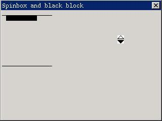

# 旋钮控件

本章描述的旋钮控件（spinbox）使用户可以从一组预定义的值中进行选择。旋钮控件的界面包括上下两个箭头，用户通过点击箭头进行滚动选择。

你可以通过调用 `CreateWindow` 函数，使用控件类名称 `CTRL_SPINBOX` 来创建一个旋钮控件。

需要注意的是，旋钮控件的窗口大小尺寸是固定的，也就是说，你在使用 `CreateWindow` 函数时传递的窗口宽度和高度参数将不起作用。

## 1.1 旋钮控件风格

旋钮控件目前具有的唯一风格是 `SPS_AUTOSCROLL`。该风格的旋钮控件可以自动判断旋钮控件目前的滚动状态，在滚动到最大值和最小值时分别把向上和向下箭头禁止掉（变灰）。没有该风格的旋钮控件的滚动状态由应用程序掌握。

## 1.2 旋钮控件消息

### 1.2.1 设置和获取位置属性

我们通常在创建旋钮控件之后，通过向它发送 `SPM_SETINFO` 消息来设置控件的属性和状态。当然在使用过程中，我们还可以使用该消息来重新设置控件的属性。

```c
SPININFO spinfo;
SendMessage (hwndSpinBox, SPM_SETINFO, 0, (LPARAM)&spinfo) ;
```

上述代码中，`spinfo` 是一个 `SPININFO` 类型的结构，其定义如下：

```c
typedef struct _SPININFO
{
        /* 最大位置值 */
        int max;
        /* 最小位置值 */
        int min;
        /* 当前位置值 */
        int cur;
} SPININFO;
typedef SPININFO *PSPININFO;
```

`SPININFO` 结构中的各项分别给出了旋钮控件的最大位置值、最小位置值和当前位置值。对于具有 `SPS_AUTOSCROLL` 风格的旋钮控件而言，必须满足如下条件：最大位置值 >= 当前位置值 >= 最小位置值。

`SPM_GETINFO` 消息用来获取旋钮控件的属性。

```c
SPININFO spinfo;
SendMessage (hwndSpinBox, SPM_GETINFO, 0, (LPARAM)&spinfo) ;
```

`spinfo` 结构用来存放所获取的属性值。

`SPM_SETCUR` 消息用来设置旋钮控件的当前位置值。

```c
int cur;
SendMessage (hwndSpinBox, SPM_SETCUR, cur, 0) ;
```

`cur` 值就是所要设置的旋钮控件当前位置值。具有 `SPS_AUTOSCROLL` 风格的旋钮控件 `cur` 值应在最大值和最小值之间，否则将设置失败，`SendMessage` 返回 -1。

`SPM_GETCUR` 消息获取当前的位置值。

```c
int cur;
cur = SendMessage (hwndSpinBox, SPM_GETCUR, 0, 0) ;
```

### 1.2.2 禁止和恢复

`SPM_DISABLEDOWN`、`SPM_ENABLEDOWN`、`SPM_DISABLEUP` 和 `SPM_ENABLEUP` 分别用来禁止和恢复上下箭头的滚动能力，而不管这时旋钮控件的当前位置值是否达到最大或最小。这几个消息仅对没有 `SPS_AUTOSCROLL` 风格的旋钮控件有效，具有 `SPS_AUTOSCROLL` 风格的旋钮控件的箭头的滚动能力和状态是由控件自己控制的。

```c
SendMessage (hwndSpinBox, SPM_DISABLEDOWN, 0, 0) ;
SendMessage (hwndSpinBox, SPM_ENABLEDOWN, 0, 0) ;
SendMessage (hwndSpinBox, SPM_DISABLEUP, 0, 0) ;
SendMessage (hwndSpinBox, SPM_ENABLEUP, 0, 0) ;
```

### 1.2.3 目标窗口

`SPM_SETTARGET` 消息设置旋钮控件的目标窗口。

```c
HWND hTarget;
SendMessage (hwndSpinBox, SPM_SETTARGET, 0, (LPARAM)hTarget) ;
```

用户点击旋钮控件的上下箭头时，旋钮控件将向它的目标窗口发送 `MSG_KEYDOWN` 和 `MSG_KEYUP` 消息，`wParam` 参数为 `SCANCODE_CURSORBLOCKUP`（点击上箭头时）或 `SCANCODE_CURSORBLOCKDOWN`（点击下箭头时），`lParam` 参数将设置 `KS_SPINPOST` 标志位，指明该消息来自旋钮控件。

`SPM_GETTARGET` 消息获取旋钮控件的目标窗口。

```c
HWND hTarget;
hTarget = SendMessage (hwndSpinBox, SPM_SETTARGET, 0, 0) ;
```

## 1.3 旋钮控件通知码

旋钮控件在大于等于最大位置时将产生 `SPN_REACHMAX`，小于等于最小位置时将产生 `SPN_REACHMIN` 通知码。

## 1.4 编程实例

__清单 1.1__ 中的代码演示了旋钮控件的使用。该程序的完整源代码可见本指南示例程序包 `mg-samples` 中的 `spinbox.c` 程序。

__清单 1.1__  旋钮控件示例程序

```c
#define IDC_SPIN        10
#define IDC_CTRL1       20
#define IDC_CTRL2       30
#define IDC_CTRL3       40
#define IDC_CTRL4       50

static int
SpinProc (HWND hDlg, int message, WPARAM wParam, LPARAM lParam)
{
        SPININFO spinfo;
        HWND hSpin = GetDlgItem (hDlg, IDC_SPIN);
        
        switch (message) {
                case MSG_INITDIALOG:
                {
                        /* 设定旋钮控件范围和当前值 */
                        spinfo.min = 1;
                        spinfo.max = 10;
                        spinfo.cur = 1;
                        SendMessage (hSpin, SPM_SETTARGET, 0, (LPARAM)hDlg);
                        SendMessage (hSpin, SPM_SETINFO, 0, (LPARAM)&spinfo);
                }
                break;
                
                case MSG_KEYDOWN:
                {
                        /* 处理按键消息，包括来自按钮控件的模拟按键消息 */
                        if (wParam == SCANCODE_CURSORBLOCKUP || 
                        wParam == SCANCODE_CURSORBLOCKDOWN) {
                                if (!(lParam & KS_SPINPOST)) {
                                        int cur;
                                        cur = SendMessage (hSpin, SPM_GETCUR, 0, 0);
                                        if (wParam == SCANCODE_CURSORBLOCKUP)
                                        cur --;
                                        else
                                        cur ++;
                                        SendMessage (hSpin, SPM_SETCUR, cur, 0);
                                }
                                /* 重绘窗口 */
                                InvalidateRect (hDlg, NULL, TRUE);
                        }
                }
                break;
                
                case MSG_PAINT:
                {
                        HDC hdc;
                        int x, y, w, h;
                        int cur;
                        
                        cur = SendMessage (hSpin, SPM_GETCUR, 0, (LPARAM)&spinfo);
                        x = 10;
                        y = cur*10;
                        w = 60;
                        h = 10;
                        if (y < 10)
                        y = 10;
                        else if (y > 100)
                        y = 100;
                        
                        /* 绘制窗口，反映当前的旋钮控件位置 */
                        hdc = BeginPaint (hDlg);
                        MoveTo (hdc, 2, 10);
                        LineTo (hdc, 100, 10);
                        Rectangle (hdc, x, y, x+w, y+h);
                        SetBrushColor (hdc, PIXEL_black);
                        FillBox (hdc, x, y, w, h);
                        MoveTo (hdc, 2, 110);
                        LineTo (hdc, 100, 110);
                        EndPaint (hDlg, hdc);
                }
                break;
                
                case MSG_CLOSE:
                {
                        EndDialog (hDlg, 0);
                }
                break;
                
        }
        
        return DefaultDialogProc (hDlg, message, wParam, lParam);
}

/* 对话框模板 */
static DLGTEMPLATE DlgSpin =
{
        WS_BORDER | WS_CAPTION,
        WS_EX_NONE,
        100, 100, 320, 240,
        "spinbox and black block",
        0, 0,
        1, NULL,
        0
};

/* 该对话框只有一个控件：旋钮控件 */
static CTRLDATA CtrlSpin[] =
{
        {
                CTRL_SPINBOX,
                SPS_AUTOSCROLL | WS_BORDER | WS_CHILD | WS_VISIBLE,
                200, 120, 0, 0,
                IDC_SPIN,
                "",
                0
        }
};
```


__图 1.1__  旋钮控件的使用

`spinbox.c` 程序在对话框中创建了一个具有 `SPS_AUTOSCROLL` 风格的旋钮控件，用户可以通过点击该旋钮控件的上下箭头来操纵左上方的黑方块在上下两根黑线间移动。
