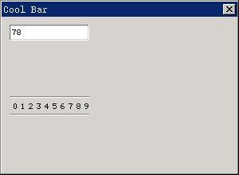

# 酷工具栏

酷工具栏（coolbar）是一个可以显示一排文字或图标按钮的工具栏。它很简单，易于使用。

你可以通过调用 `CreateWindow` 函数，使用控件类名称 CTRL_COOLBAR 来创建一个酷工具栏控件。

## 1.1 酷工具栏风格

`CBS_BMP_16X16` 和 `CBS_BMP_32X32` 风格的酷工具栏的按钮项分别显示 16x16 和 32x32 的位图；`CBS_BMP_CUSTOM` 风格的酷工具栏的按钮项使用自定义大小的位图，对于这个风格的控件，使用 `CreateWindow` 创建时需要通过 `dwAddData` 参数把位图的高度和宽度传递给控件，如下：

```c
CreateWindowEx (CTRL_COOLBAR, ..., MAKELONG (item_width, item_height)));
```

`CBS_USEBKBMP` 风格的酷工具栏有背景位图，创建控件时需要把位图文件的路径通过 `CreateWindow` 函数的 `spCaption` 参数传递给控件。

```c
CreateWindowEx (CTRL_COOLBAR, “res/bk.bmp”, ...);
```

建立酷工具栏不接受指定的高度值。

## 1.2 酷工具栏消息

在创建酷工具栏之后，我们需要使用 `CBM_ADDITEM` 消息来往工具栏中添加按钮项。

```c
COOLBARITEMINFO itemInfo;
SendMessage (hwndCoolBar, CBM_ADDITEM, 0, (LPARAM)&itemInfo) ;
```

`itemInfo` 是一个 `COOLBARITEMINFO` 类型的结构。

```c
typedef struct _COOLBARITEMINFO
{
        /* 保留 */
        int insPos;
        /* 按钮项id */
        int id;
        /* 按钮项类型 */
        int ItemType;
        /* 按钮使用的位图 */
        PBITMAP Bmp;
        /* 按钮提示文字 */
        const char *ItemHint;
        /* 按钮标题 */
        const char *Caption;
        /* 按钮项的附加数据 */
        DWORD dwAddData;
} COOLBARITEMINFO;
```

`id` 项为工具栏中各按钮项的 `id` 值。用户点击按钮项时，酷工具栏将产生通知消息，`wParam` 参数的高字节部分（`HIWORD`）就是相应按钮项的 `id` 值，`wParam` 的低字节部分（`LOWORD`）为工具栏控件本身的控件标识符。

`ItemType` 指定按钮项的类型，值可以是 `TYPE_BARITEM`、`TYPE_BMPITEM` 和 `TYPE_TEXTITEM`。`TYPE_BARITEM` 类型的按钮项为垂直分隔线；`TYPE_BMPITEM` 类型的按钮项为位图按钮；`TYPE_TEXTITEM` 类型的按钮项为文字按钮。

如果按钮项的类型为 `TYPE_BMPITEM `的话，`Bmp` 位图句柄指定该按钮项所使用的位图。`ItemHint` 为鼠标移动到按钮项之上时所显示的提示文字；按钮项的类型为 `TPYE_TEXTITEM` 时，`Caption` 中应该存放按钮项所显示的文字字符串。

`dwAddData` 为按钮项的附加数据。

`CBM_ENABLE` 消息禁止或恢复某个按钮项。

```c
int id;
BOOL beEnabled;
SendMessage (hwndCoolBar, CBM_ENABLE, id, beEnabled) ;
```

`id` 为所要设置的按钮项的标示符值，`beEnabled` 为 `TRUE` 时恢复，为 `FALSE` 时禁止。

## 1.3 编程实例

__清单 1.1__ 中的代码演示了酷工具栏控件的使用。该程序的完整源代码可见本指南示例程序包 `mg-samples` 中的 `coolbar.c` 程序。

__清单 1.1__  酷工具栏示例程序

```c
#define ITEM_NUM    10

/* 要在酷工具栏上显示的文本 */
static const char* caption[] =
{
        "0", "1", "2", "3", "4", "5","6", "7", "8", "9"
};

/* 提示窗口中的文本 */
static const char* hint[] =
{
        "数字 0", "数字 1", "数字 2", "数字 3", "数字 4", 
        "数字 5", "数字 6", "数字 7", "数字 8", "数字 9"
};

/* 创建酷工具栏，并添加工具项 */
static void create_coolbar (HWND hWnd)
{
        HWND cb;
        COOLBARITEMINFO item;
        int i;
        
        cb = CreateWindow (CTRL_COOLBAR,
        "",
        WS_CHILD | WS_VISIBLE | WS_BORDER, 
        100,
        10, 100, 100, 20,
        hWnd,
        0);
        
        item.ItemType = TYPE_TEXTITEM;
        item.Bmp = NULL;
        item.dwAddData = 0;
        for (i = 0; i < ITEM_NUM; i++) {
                item.insPos = i;
                item.id = i;
                item.Caption = caption[i];
                item.ItemHint = hint[i];
                SendMessage (cb, CBM_ADDITEM, 0, (LPARAM)&item);
        }
}

static int CoolbarWinProc(HWND hWnd, int message, WPARAM wParam, LPARAM lParam)
{
        static HWND ed;
        
        switch (message) {
                case MSG_CREATE:
                /* 创建编辑框，用来反馈用户对酷工具栏的操作 */
                ed = CreateWindow (CTRL_EDIT,
                "",
                WS_CHILD | WS_VISIBLE | WS_BORDER, 
                200,
                10, 10, 100, 20,
                hWnd,
                0);
                
                create_coolbar (hWnd);
                break;
                
                case MSG_COMMAND:
                {
                        int id = LOWORD (wParam);
                        int code = HIWORD (wParam);
                        
                        if (id == 100) {
                                static char buffer[100];
                                char buf[2];
                                
                                /* 根据用户按下的工具项将适当的字符写入编辑框 */
                                sprintf (buf, "%d", code);
                                SendMessage (ed, MSG_GETTEXT, 90, (LPARAM)buffer);
                                strcat (buffer, buf);
                                SendMessage (ed, MSG_SETTEXT, 0, (LPARAM)buffer);
                        }
                }
                break;
                
                case MSG_DESTROY:
                DestroyAllControls (hWnd);
                return 0;
                
                case MSG_CLOSE:
                DestroyMainWindow (hWnd);
                PostQuitMessage (hWnd);
                return 0;
        }
        
        return DefaultMainWinProc(hWnd, message, wParam, lParam);
}

/* 以下创建主窗口的代码省略 */
```


__图 1.1__  酷工具栏控件的使用

`coolbar.c` 程序在对话框中创建了一个由“0－9”数字组成的酷工具栏，点击该工具栏的按钮时，对应的数字将输入到上面的编辑框中。
