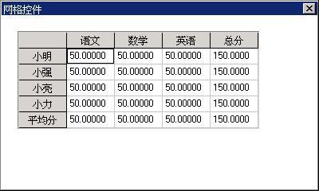

# 网格控件

网格控件（gridview）以表格的方式显示一系列的数据项（单元格），每个单元格的内容相互独立，网格控件的表头（header）（包括一列的头和一行的头）内容通常反映了表格一行或者一列的意义。外观上，网格控件就是一个包括表头部分的单元格部分的矩形框。可以通过拖动表头来调整网格控件中行的高度或者列的宽度，表格中显示不下的内容可以通过滚动条来滚动显示。

网格控件是一种方便和有效的数据项排列和展示工具。适合处理具有不同属性的大量数据，如实验数据或是账目表格等。

你可以通过调用 `CreateWindow` 函数，使用控件类名称 `CTRL_GRIDVIEW` 来创建一个网格控件。应用程序通常通过向一个网格控件发送消息来增加、删除和操作表格项。和别的控件一样，网格控件在响应用户点击等操作时会产生通知消息。

## 1.1 网格控件风格

默认状态下，网格控件窗口只显示表头和单元格，显示区域的周围没有边界。你可以在以 `CreateWindow` 函数创建控件时使用窗口风格 `WS_BORDER` 来给网格控件加上边界。另外，还可以使用窗口风格 `WS_VSCROLL` 和 `WS_HSCROLL` 来增加垂直和水平滚动条。以便用鼠标来滚动显示网格控件中的各项内容。

## 1.2 网格控件消息

在创建网格的时候，通过设置一个结构 `GRIDVIEWDATA`，并将这个结构作为参数传递进去。这个结构定义以及各项意义如下：

```c
typedef struct _GRIDVIEWDATA
{
        /** 网格控件的行数 */
        int nr_rows;
        /** 网格控件的列数 */
        int nr_cols;
        /** 网格控件中各行之间的高度*/
        int row_height;
        /** 网格控件中各列之间的宽度 */
        int col_width;
} GRIDVIEWDATA;
```

### 1.2.1 列的操作

在生成网格控件以后，如果需要更多的列， 需要往控件中增加列，增加一列由应用程序向控件发送 `GRIDM_ADDCOLUMN` 消息来完成。

```c
int index; 
GRIDCELLDATA celldata;
GRIDCELLDATAHEADER cellheader;
SendMessage(hWndGrid, GRIDM_ADDCOLUMN, index, &celldata);
```

上面的代码中，`celldata` 是一个 `GRIDCELLDATA` 结构，其中包含了网格控件中新增加的列的相关信息。`GRIDCELLDATA` 结构定义及各项意义如下：

```c
typedef struct _GRIDCELLDATA
{
        /** mask of properties, can be OR'ed with following values:
        * 设置/获取网格的类型(必需)
        * - GVITEM_STYLE\n
        * 设置/获取网格的前景色
        * - GVITEM_FGCOLOR\n
        * 设置/获取网格的背景
        * - GVITEM_BGCOLOR\n
        * 设置/获取网格的字体
        * - GVITEM_FONT\n
        * 设置/获取网格的icon
        * - GVITEM_IMAGE\n
        * 设置/获取网格的对齐方式
        * - GVITEM_ALLCONTENT\n
        * 设置/获取网格的主要内容
        * - GVITEM_MAINCONTENT\n
        * 设置/获取网格的全部内容
        * - GVITEM_ALLCONTENT\n
        */
        DWORD mask;
        /** 网格的类型 */
        DWORD style;
        /** 文本颜色 */
        gal_pixel color_fg;
        /** 背景色*/
        gal_pixel color_bg;
        /** 文本字体 */
        PLOGFONT font;
        /** 单元格上显示的icon */
        PBITMAP image;
        /** 根据不同类型，需要传入不同的内容 */
        void* content;
}GRIDCELLDATA;
```

上述结构中的 `content` 项是指向另外一个结构 `GRIDCELLDATAHEADER` 的地址。这个结构的定义以及各项意义如下：

```c
typedef struct _GRIDCELLDATAHEADER
{
        /** 列的宽度或行的高度   */
        int size;
        /** 行头或列头上的标题 */
        char* buff;
        /** 标题的长度 */
        int len_buff;
}GRIDCELLDATAHEADER;
```

增加一列的时候，设置 `GRIDCELLDATAHEADE` 结构成员 `size` 为新增加列的宽度，成员 `buff` 为列头的标题，成员 `len_buff` 为标题的长度。增加一行的操作与此类似，不同的是成员 `size` 为新增加行的高度。

`GRIDCELLDATA` 结构用于设置网格控件中行，列以及单元格的属性，许多消息都需要用到这个结构体。如 `GRIDM_SETCELLPROPERTY`、`GRIDM_GETCELLPROPERTY`、`GRIDM_ADDROW`，以及 `GRIDM_ADDCOLUMN` 等。

`style` 为单元格的类型，每次设置的时候需要指明是下列这几种类型中的一种：`GV_TYPE_HEADER`, `GV_TYPE_TEXT`，`GV_TYPE_NUMBER`，`GV_TYPE_SELECTION`，`GV_TYPE_CHECKBOX`。它还可以和单元格风格类型同时使用，比如 `GVS_READONLY` 等。

`content` 还可以指向其它结构，分别有 `GRIDCELLDATATEXT`（文字单元格）、`GRIDCELLDATANUMBER`（数字单元格）、`GRIDCELLDATASELECTION`（组合选择框单元格）、`GRIDCELLDATACHECKBOX`（选择框单元格）。这些结构的定义及各项意义如下：

```c
typedef struct _GRIDCELLDATATEXT
{
        /** 单元格上显示的文本 */
        char* buff;
        /** 文本的长度 */
        int len_buff;
}GRIDCELLDATATEXT;

typedef struct _GRIDCELLDATANUMBER
{
        /** 单元格上的数字*/
        double number;
        /** 数字的显示格式，如”%2f”等 */
        char* format;
        /** 显示格式字符串的长度 */
        int len_format;
}GRIDCELLDATANUMBER;

typedef struct _GRIDCELLDATASELECTION
{
        /** 当前选中的索引 */
        int cur_index;
        /** 需要显示的字符串，如"Yes\nNo"*/
        char* selections;
        /** 显示字符串的长度，如上面字符串的长度为7 */
        int len_sel;
}GRIDCELLDATASELECTION;

typedef struct _GRIDCELLDATACHECKBOX
{
        /** 选择框是否被选中 */
        BOOL checked;
        /** 选择框后面所跟文字 */
        char* text;
        /** 所跟文字的长度 */
        int len_text;
}GRIDCELLDATACHECKBOX;
```

`GRIDM_SETCOLWIDTH` 可以设置控件列的宽度：

```c
int index;
int width;
SendMessage (hwndGrid, GRIDM_SETCOLWIDTH, index, width) ;
```

其中，`index` 是要设置的列的整数索引值，`width` 是要设置的宽度。

`GRIDM_GETCOLWIDTH` 可以获取控件列的宽度：

```c
int width;
int index;
width = SendMessage (hwndGrid, GRIDM_GETCOLWIDTH, 0, index);
```

其中，`index` 是要获取的列的整数索引值，`SendMessage` 函数的返回值就是列的宽度。出错的话则返回 -1。

`GRIDM_ADDCOLUMN` 消息用来增加网格控件的一列：

```c
int index;
GRIDCELLDATA* celldata;
SendMessage (hwndGrid, GRIDM_ADDCOLUMN, index, celldata) ;
```

其中，`index` 是要增加的列的前一列的整数索引值，`celldata` 是一个 `GRIDCELLDATA` 结构的指针，用来设置新增列的初始值。

`GRIDM_DELCOLUMN` 消息用来删除网格控件中的一列：

```c
int index;
SendMessage (hwndGrid, GRIDM_DELCOLUMN, 0, index) ;
```

其中，`index` 为所要删除的列的索引值。

`GRIDM_GETCOLCOUNT` 消息用来获取网格控件中列的数量。

```c
int count;
count = SendMessage (hwndGrid, GRIDM_GETCOLCOUNT, 0, 0) ;
```

`SendMessage` 函数的返回值就是列的数量。出错则返回 -1。

### 1.2.2 行的操作

有关行的操作与列的操作相似。

`GRIDM_SETROWHEIGHT` 可以设置控件行的高度：

```c
int index;
int height;
SendMessage (hwndGrid, GRIDM_SETROWHEIGHT, index, height) ;
```

其中，`index` 是要设置的行的整数索引值，`height` 是要设置的高度。

`GRIDM_GETROWHEIGHT` 可以获取控件行的高度：

```c
int height;
int index;
height = SendMessage (hwndGrid, GRIDM_GETROWHEIGHT, 0, index);
```

其中，`index` 是要获取的行的整数索引值，`SendMessage` 函数的返回值就是行的高度。出错的话则返回 -1。

`GRIDM_ADDROW` 消息用来往网格控件中添加一行：

```c
int index;
GRIDCELLDATA* celldata;
SendMessage (hwndGrid, GRIDM_ADDROW, index, celldata) ;
```

其中，`index` 是要增加的行的前一行的整数索引值，`celldata` 是一个 `GRIDCELLDATA` 结构的指针，用来设置新增行的初始值。

`GRIDM_DELROW` 消息用来删除网格控件中的一行：

```c
int index;
SendMessage (hwndGrid, GRIDM_DELROW, 0, index) ;
```

其中，`index` 为所要删除的行的索引值。

`GRIDM_GETROWCOUNT` 消息用来获取网格控件中行的数量。

```c
int count;
count = SendMessage (hwndGrid, GRIDM_ GETROWCOUNT, 0, 0) ;
```

`SendMessage` 函数的返回值就是行的数量。

### 1.2.3 单元格的操作

`GRIDM_SETCELLPROPERTY` 消息用来设置一个或多个单元格。

```c
GRIDCELLS* cells;
GRIDCELLDATA* celldata;
SendMessage (hwndGrid, GRIDM_SETCELLPROPERTY, cells, celldata) ;
```

其中，`cells` 是一个指向 `GRIDCELLS` 结构的指针，用来表示所要设置的单元格的范围。`GRIDCELLS` 结构定义以及各项意义如下：

```c
typedef struct _GRIDCELLS
{
        /** 所选单元格的起始行 */
        int row;
        /** 所选单元格的起始列 */
        int column;
        /** 所选单元格范围所跨的列数 */
        int width;
        /** 所选单元格范围所跨的行数 */
        int height;
}GRIDCELLS;
```

`SendMessage` 函数成功设置好指定单元格中的内容后返回 `GRID_OKAY`，如果失败则返回 `GRID_ERR`。

`GRIDM_GETCELLPROPERTY` 消息用来获得单元格的属性。

```c
GRIDCELLS* cells;
GRIDCELLDATA* celldata;
SendMessage (hwndGrid, GRIDM_GETCELLPROPERTY, &cells, celldata) ;
```

其中，`cells` 为具体的某一个单元格，注意它不能是多个单元格。`SendMessage` 函数成功获取指定单元格中的内容后返回 `GRID_OKAY`，`celldata` 结构中含有所要获得的单元格的信息。如果失败则返回 `GRID_ERR`。

另外还有针对不同类型的单元格的消息，如 `GRIDM_SETNUMFORMAT` 消息用来设置数字单元格（`GRIDCELLDATANUMBER`）的数字格式。 

```c
GRIDCELLS* cells;
char* format = “%3.2f”;
SendMessage (hwndGrid, GRIDM_SETNUMFORMAT, cells, format);
```

其中，`cells` 表示所要设置的单元格，`format` 表示所有设置的数字格式。

对于所有类型的单元格，`GRIDM_SETSELECTED` 消息设置高亮的单元格：

```c
GRIDCELLS* cells;
SendMessage (hwndGrid, GRIDM_SETSELECTED, 0, cells);
```

其中，`cells` 表示所要设置高亮的单元格，`SendMessage` 函数成功设置高亮单元格后返回 `GRID_OKAY`，如果失败则返回 `GRID_ERR`。

`GRIDM_GETSELECTED` 消息用来得到所有高亮的单元格：

```c
GRIDCELLS* cells;
SendMessage (hwndGrid, GRIDM_GETSELECTED, 0, cells);
```

`SendMessage` 函数返回后 `cells` 包含所有高亮的单元格。

## 1.3 其它消息的处理

当用户按上下左右箭头键时， 当前被选中的单元格将发生变化，而且新的选中项将变为可见（如果它原来不可见的话）。当用户按上下翻页键（`PAGEUP`、`PAGEDOWN`）时，列表项将进行翻页，幅度和点击滚动条翻页是一样的，前一页的最后一项成为后一页的第一项。如果按下 `HOME` 键，列中的第一个单元格将被选中且变为可见。如果按下 `END` 键，最后一个单元格将被选中且成为可见。以上各键在 `SHIFT` 键同时按下时将执行高亮相关区域的操作。当单元格被双击时，或者在单元格选中状态下键入字符时可以编辑单元格中的内容。

网格控件还具有将某些单元格（源单元格）和另一些单元格（目标单元格）进行关联起来的操作，然后目标单元格将会在源单元格的数据改变时根据用户给定的数据操作函数更新其自身内容。进行该项工作的结构体如下：

```c
typedef struct _GRIDCELLDEPENDENCE
{
        /* 源单元格 */
        GRIDCELLS source;
        /* 目标单元格 */
        GRIDCELLS target;
        /* 数据操作函数 */
        GRIDCELLEVALCALLBACK callback;
        /* 附加信息 */
        DWORD dwAddData;
}GRIDCELLDEPENDENCE;

/* 数据操作函数的原型 */
typedef int (*GRIDCELLEVALCALLBACK)(GRIDCELLS* target, GRIDCELLS* source, DWORD dwAddData);
```

`GRIDM_ADDDEPENDENCE` 消息用来往网格控件中添加一个单元格关联（注意源单元格和目标单元格必须不相交，并且目标单元格和控件中已有的单元格关联中的其它目标单元格也必须不相关）。

```c
GRIDCELLDEPENDENCE* dependece;
SendMessage (hwndGrid, GRIDM_ADDDEPENDENCE, 0, dependence);
```

加入成功后返回该关联的索引，否则返回 `GRID_ERR`。

`GRIDM_DELDEPENDENCE` 消息用来删除网格控件中已有的一个单元格关联。

```c
int dependence_id;
SendMessage (hwndGrid, GRIDM_DELDEPENDENCE, 0, dependence_id);
```

其中，`dependence_id` 表示所要删除的单元格关联的索引值。删除成功后返回 `GRID_OKAY`，如果失败则返回 `GRID_ERR`。

## 1.4 网格控件通知码

网格控件在响应用户点击等操作和发生一些状态改变时产生通知码，包括：

- `GRIDN_HEADLDOWN`：用户鼠标左键在表头上按下
- `GRIDN_HEADLUP`：用户鼠标左键在表头上抬起
- `GRIDN_KEYDOWN`：键按下
- `GRIDN_CELLDBCLK`：用户双击某个单元格
- `GRIDN_CELLCLK`：用户单击某个单元格
- `GRIDN_FOCUSCHANGED`：当前选择的单元格改变
- `GRIDN_CELLTEXTCHANGED`：单元格内容改变

当用户鼠标左键在单元格上按下时，该格将被选中，并且产生 `GRIDN_FOCUSCHANGED` 和 `GRIDN_CELLCLK` 两个通知码。

如果应用程序需要了解网格控件产生的通知码的话，需要使用 `SetNotificationCallback` 函数注册一个通知消息处理函数，在该函数中对收到的各个通知码进行应用程序所需的处理。

## 1.5 编程实例

__清单 1.1__ 中的代码演示了网格控件的使用。该程序的完整源代码可见本指南示例程序包 `mg-samples` 中的 `gridview.c` 程序。

__清单 1.1__  网格控件示例程序

```c
int ww = 800;
int wh = 600;

enum {
        IDC_GRIDVIEW,
};

static HWND hGVWnd;

static char* colnames[] = {"语文", "数学", "英语", "总分"};
static char* scores[] = {"小明", "小强","小亮", "小力", "平均分"};

int total(GRIDCELLS* target, GRIDCELLS* source, DWORD dwAddData)
{
        int i, j;
        double value = 0;
        GRIDCELLDATA data;
        GRIDCELLS cells;
        GRIDCELLDATANUMBER num;
        memset(&data, 0, sizeof(data));
        memset(&num, 0, sizeof(num));
        data.mask = GVITEM_MAINCONTENT|GVITEM_STYLE;
        data.content = &num;
        data.style = GV_TYPE_NUMBER;
        cells.width = 1;
        cells.height = 1;
        for(i = 0; i<source->width; i++)
        {
                cells.column = source->column + i;
                for (j = 0; j<source->height; j++)
                {
                        cells.row = source->row + j;
                        SendMessage(hGVWnd, GRIDM_GETCELLPROPERTY, (WPARAM)&cells, (LPARAM)&data);
                        value += num.number;
                }
        }
        num.number = value;
        num.len_format = -1;
        cells.row = target->row;
        cells.column = target->column;
        SendMessage(hGVWnd, GRIDM_SETCELLPROPERTY, (WPARAM)&cells, (LPARAM)&data);
        
        return 0;
}

int averge(GRIDCELLS* target, GRIDCELLS* source, DWORD dwAddData)
{
        int i, j;
        int count = 0;
        double value = 0;
        GRIDCELLDATA data;
        GRIDCELLS cells;
        GRIDCELLDATANUMBER num;
        memset(&data, 0, sizeof(data));
        memset(&num, 0, sizeof(num));
        data.content = &num;
        data.style = GV_TYPE_NUMBER;
        cells.width = 1;
        cells.height = 1;
        for(i = 0; i<source->width; i++)
        {
                cells.column = source->column + i;
                for (j = 0; j<source->height; j++)
                {
                        data.content = &num;
                        data.style = GV_TYPE_NUMBER;
                        cells.row = source->row + j;
                        SendMessage(hGVWnd, GRIDM_GETCELLPROPERTY, (WPARAM)&cells, (LPARAM)&data);
                        value += num.number;
                        count++;
                }
        }
        data.mask = GVITEM_MAINCONTENT;
        num.number = value/count;
        cells.row = target->row;
        cells.column = target->column;
        SendMessage(hGVWnd, GRIDM_SETCELLPROPERTY, (WPARAM)&cells, (LPARAM)&data);
        
        return 0;
        return 0;
}

static int
ControlTestWinProc (HWND hWnd, int message, WPARAM wParam, LPARAM lParam)
{
        switch (message)
        {
                case MSG_CREATE:
                {
                        GRIDVIEWDATA gvdata;
                        gvdata.nr_rows = 10;
                        gvdata.nr_cols = 10;
                        gvdata.row_height = 30;
                        gvdata.col_width  = 60;
                        hGVWnd = CreateWindowEx (CTRL_GRIDVIEW, "Grid View",
                        WS_CHILD | WS_VISIBLE | WS_VSCROLL |
                        WS_HSCROLL | WS_BORDER, WS_EX_NONE, IDC_GRIDVIEW, 20, 20, 600,
                        300, hWnd, (DWORD)&gvdata);
                        int i;
                        GRIDCELLS cellsel;
                        GRIDCELLDEPENDENCE dep;
                        GRIDCELLDATA celldata;
                        GRIDCELLDATAHEADER header;
                        GRIDCELLDATANUMBER cellnum;
                        memset(&header, 0, sizeof(header));
                        memset(&celldata, 0, sizeof(celldata));
                        file://设置列表头的属性
                        for (i = 1; i<= 3; i++)
                        {
                                header.buff = colnames[i-1];
                                header.len_buff = -1;
                                celldata.content = &header;
                                celldata.mask = GVITEM_MAINCONTENT;
                                celldata.style = GV_TYPE_HEADER;
                                cellsel.row = 0;
                                cellsel.column = i;
                                cellsel.width = 1;
                                cellsel.height = 1;
                                SendMessage(hGVWnd, GRIDM_SETCELLPROPERTY, (WPARAM)&cellsel, (LPARAM)&celldata);
                                
                        }
                        
                        file://设置行表头的属性
                        memset(&header, 0, sizeof(header));
                        memset(&celldata, 0, sizeof(celldata));
                        for (i = 1; i<= 4; i++)
                        {
                                header.buff =  scores[i-1];
                                celldata.content = &header;
                                celldata.mask = GVITEM_MAINCONTENT;
                                celldata.style = GV_TYPE_HEADER;
                                cellsel.row = i;
                                cellsel.column = 0;
                                cellsel.width = 1;
                                cellsel.height = 1;
                                SendMessage(hGVWnd, GRIDM_SETCELLPROPERTY, (WPARAM)&cellsel, (LPARAM)&celldata);
                                
                        }
                        
                        file://设置单元格的属性
                        memset(&celldata, 0, sizeof(celldata));
                        memset(&cellnum, 0, sizeof(cellnum));
                        cellnum.number = 50;
                        cellnum.format = NULL;
                        celldata.content = &cellnum;
                        celldata.mask = GVITEM_MAINCONTENT;
                        celldata.style = GV_TYPE_NUMBER;
                        cellsel.row = 1;
                        cellsel.column = 1;
                        cellsel.width = 3;
                        cellsel.height = 4;
                        SendMessage(hGVWnd, GRIDM_SETCELLPROPERTY, (WPARAM)&cellsel, (LPARAM)&celldata);
                        
                        file://增加一列的操作
                        memset(&header, 0, sizeof(header));
                        memset(&celldata, 0, sizeof(celldata));
                        header.buff = "总分";
                        header.size = -1;
                        celldata.mask = GVITEM_MAINCONTENT;
                        celldata.content = &header;
                        celldata.style = GV_TYPE_HEADER;
                        SendMessage(hGVWnd, GRIDM_ADDCOLUMN, 3, (LPARAM)&celldata);
                        
                        file://增加一行的操作
                        memset(&header, 0, sizeof(header));
                        memset(&celldata, 0, sizeof(celldata));
                        header.buff = "平均分";
                        header.size = -1;
                        celldata.mask = GVITEM_MAINCONTENT;
                        celldata.content = &header;
                        celldata.style = GV_TYPE_HEADER;
                        SendMessage(hGVWnd, GRIDM_ADDROW, 4, (LPARAM)&celldata);
                        
                        memset(&celldata, 0, sizeof(celldata));
                        memset(&cellnum, 0, sizeof(cellnum));
                        cellnum.number = 0;
                        cellnum.format = NULL;
                        celldata.content = &cellnum;
                        celldata.mask = GVITEM_MAINCONTENT;
                        celldata.style = GV_TYPE_NUMBER;
                        cellsel.row = 1;
                        cellsel.column = 4;
                        cellsel.width = 1;
                        cellsel.height = 4;
                        SendMessage(hGVWnd, GRIDM_SETCELLPROPERTY, (WPARAM)&cellsel, (LPARAM)&celldata);
                        
                        cellsel.row = 5;
                        cellsel.column = 1;
                        cellsel.width = 4;
                        cellsel.height = 1;
                        SendMessage(hGVWnd, GRIDM_SETCELLPROPERTY, (WPARAM)&cellsel, (LPARAM)&celldata);
                        
                        
                        // 给这个单元格设置求和函数.
                        memset(&dep, 0, sizeof(dep));
                        dep.callback = total;
                        for (i = 1; i<= 4; i++)
                        {
                                dep.source.row = i;
                                dep.source.column = 1;
                                dep.source.width = 3;
                                dep.source.height = 1;
                                dep.target.row = i;
                                dep.target.column = 4;
                                dep.target.width = 1;
                                dep.target.height = 1;
                                SendMessage(hGVWnd, GRIDM_ADDDEPENDENCE, 0, (LPARAM)&dep);
                        }
                        
                        dep.callback = averge;
                        // 给这个单元格设置求平均值函数.
                        for (i = 1; i<= 4; i++)
                        {
                                dep.source.row = 1;
                                dep.source.column = i;
                                dep.source.width = 1;
                                dep.source.height = 4;
                                dep.target.row = 5;
                                dep.target.column = i;
                                dep.target.width = 1;
                                dep.target.height = 1;
                                SendMessage(hGVWnd, GRIDM_ADDDEPENDENCE, 0, (LPARAM)&dep);
                        }
                        
                        return 0;
                }
                case MSG_COMMAND:
                break;
                case MSG_CLOSE:
                DestroyMainWindow (hWnd);
                MainWindowCleanup (hWnd);
                return 0;
                
        }
        return DefaultMainWinProc (hWnd, message, wParam, lParam);
} 
```


__图 1.1__  网格控件的使用
