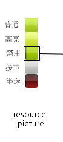
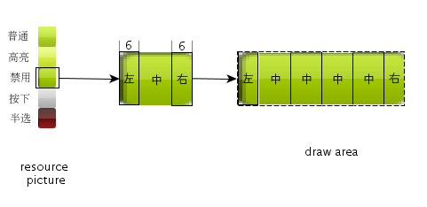

# Specification for the Image Resources Used by mGNCS Skin Renderer

- [Foreword](#foreword)
- [Property of the Public Image](#property-of-the-public-image)
- [`mButton`](#mbutton)
- [`mCheckbutton`](#mcheckbutton)
- [`mRadiobutton`](#mradiobutton)
- [`mListView`](#mlistview)
- [`mPropSheet`](#mpropsheet)
- [`mProgressBar`](#mprogressbar)
- [`mTrackbar`](#mtrackbar)

## Foreword

- *Types of all the elements of skin are file name, and the file name
corresponds to the image loaded to the system buffer pool (through
`LoadResource)`. The two must be consistent*
- renderer actually does not store file name, but only stores `RES_KEY`
generated by these file names, and then gets image through `GetResource`

- Many controls have the distinction of status of normal, press, highlight,
disable etc., for a control, each status is stored into an image, which is a
huge waste for the process of storing resources and loading images, therefore,
skin renderer in mGNCS continues to use the image use mode in MiniGUI, which is
mixing the associated images into one, and taking different parts to use when
drawing. For example, for button image, we design into combination image of
five parts, and when we want to draw button of certain status, we take child
image of this part to use.

There are two drawing modes for the images:

- Direct stretch fill drawing: This mode is not difficult to understand,
which is enlarging the resource image according to the size of the drawing
region with certain proportion to fill.
- Segment fill drawing: This mode will divide the image (or child image)
obtained into three segments according to the mode of `up middle, down or left,
middle right`, and then fill the two ends separately. For the middle part,
use the middle part in circulation to fill. We still take button as the
example, as shown in the figure

This mode can well reserve the border effect of "round corner" etc. When
using images filled in this mode to design, please not that:
1. For the boundary line of left, middle, right and up, middle, down
segments, the images are different, which will be explained `below_`.
2. Because the middle part will be used in circulation, note that transition
shall be `smooth_`

## Property of the Public Image

| *Property name* | *Type* | *Explanation* |
|-----------------|--------|---------------|
| `NCS_IMAGE_ARROWS` | File name | Arrow image |
| `NCS_IMAGE_ARROWSHELL` | File name | Arrow button image |

Specification of the image:
- arrow image is used for the drawing of arrows in the skin renderer, which is
composed of 16 parts of small images from up to down, and each small image is a
square. The internal corresponding relation is
* 0-3 : statuses of the upward arrows (0-common, 1-highlighted, 2-press down,
3-forbid)
* 4-7 : Statuses of the downward arrows (4-common, 5-highlighted, 2-press down,
3-forbid)）
* 8-11 : statuses of the arrows leftward (8-common, 9-highlighted, 10-press down,
11-forbid)
* 12-15 : statuses of the rightward arrows (12-common, 13-highlighted, 10-press
down, 11-forbid)
- In spin and scroll series of `arrow_shell,` effect used for realizing arrow
button is composed of four parts of small images from up to down. Each small
image is a square, and each part correspond to one status of the button:
* 0-common
* 1-highlighted
* 2-press down
* 3-forbid
- In addition, arrow image is generally used in cooperation with arrow-shell
image. When in use, it has the superimposition effect, so region around arrow
is generally made transparent.
- Direct stretch filling is adopted when using the image, and pay attention to
reasonable design of the image.

## `mButton`

| *Property name* | *Type* | *Explanation* |
|-----------------|--------|---------------|
| `NCS_IMAGE_PUSHBUTTON` | File name | Image of push button |

*Specification of image*
- For the drawing effect used for pushbutton in skin renderer, the image is
composed of five parts from up to down, and each part is a rectangular button,
corresponding to five statuses of pushbutton:
- 0 - common
- 1 - highlighted
- 2 - press down
- 3 - forbid
- 4 - “half selected” status in the three-status button
- When drawing, if image is used to carry out segmental filling, the left and
right ends are 6 pixels wide, and width of the middle segment is not limited.
Pay attention to reasonable design of the image.

## `mCheckbutton`

| *Property name* | *Type* | *Explanation* |
|-----------------|--------|---------------|
| `NCS_IMAGE_CHECKBUTTON` | File name | Image of check button |

Specification of image:

- For the drawing rendering used for check button of skin renderer, the image is
composed of eight parts from up to down. Each part is a rectangle,
corresponding to eight statuses of check button:
- 0~3: common, highlighted, press down and forbid status when not selected
- 4~7: common, highlighted, press down and forbid status when selected
- If the image is bigger than the drawing region, the image will be reduced to
draw, otherwise _image size is directly used to fill._, Pay attention to image
design
- Example

## `mRadiobutton`

| *Property name* | *Type* | *Explanation* |
|-----------------|--------|---------------|
| `NCS_IMAGE_RADIOBUTTON` | File name | Image of radio button |

Specification of the image is the same as `mCheckbutton`.

## `mListView`

| *Property name* | *Type* | *Explanation* |
|-----------------|--------|---------------|
| `NCS_IMAGE_TREE` | File name | Image of fold/unfold switch in the tree |
| `NCS_IMAGE_HEADER`| File name | Image of the header part |

Specification of the image:

- For the rendering effect used for realizing the fold and unfold button in the
tree control, the image is composed of equal up and down parts. The up part is
the fold effect, and the down part is unfold effect
- When in use, size of the image will be directly used to fill and it will not
be stretched. So pay attention to the size of image design, and it shall not be
too big or too small
- Example

## `mPropSheet`

| *Property name* | *Type* | *Explanation* |
|-----------------|--------|---------------|
| `NCS_IMAGE_TAB` | File name | Image of `PropSheet` Tab page |

Specification of image:

- For the tab effect used for rendering propsheet page, it is composed of four
parts from up to down. In mGNCS, only the first part and the third part are
used, representing:
- 0 - tab effect of inactive page
- 2 - tab effect of active page
- _Draw by segment, _ left, middle and right occupy 3, x and 4 pixel
respectively, and pay attention to the design of image
- Example

## `mProgressBar`

| *Property name* | *Type* | *Explanation* |
|-----------------|--------|---------------|
| `NCS_IMAGE_PB_HCHUNK` | File name | chunk image of horizontal `ProgressBar` |
| `NCS_IMAGE_PB_VCHUNK` | File name | chunk image of vertical `ProgressBar` |
| `NCS_IMAGE_PB_HSLIDER` | File name | trackbar image of horizontal `ProgressBar` |
| `NCS_IMAGE_PB_VSLIDER` | File name | trackbar image of vertical `ProgressBar` |

Specification of image:
- `h_chunk` Used for the progress display of horizontal progress bar. Use progressbar
block of up block style to stretch fill, and for smooth style, directly stretch
fill
- Horizontal gradual change is not suggested in image design
- Example

- `v_chunk`
- Used for progress display of vertical progress bar. Use progressbar of up
block style to stretch fill, and for smooth style, directly stretch fill
- Vertical gradual change is not suggested in image design
- Example

- `h_slider`: is not used.
- `h_slider`: is not used.

## `mTrackbar`

| *Property name* | *Type* | *Explanation* |
|-----------------|--------|---------------|
| `NCS_IMAGE_TB_HSLIDER` | File name | Slider image of horizontal Trackbar|
| `NCS_IMAGE_TB_VSLIDER` | File name | Slider image of vertical Trackbar|
| `NCS_IMAGE_TB_HTHUMB` | File name | Trackbar image of horizontal Trackbar|
| `NCS_IMAGE_TB_VTHUMB` | File name | Trackbar image of vertical Trackbar|

Specification of image:

- `h_slider`: Used for slide rail rendering of horizontal trackbar, and the image is used
as a whole,
- When in use, segmental fill processing is adopted. The left and right
segments are two pixels wide respectively, and the middle part is used in
circulation. Pay attention to image design.
- Example

- `v_slider`: Used for slide rail rendering of vertical trackbar, and the image is used as
a whole.  When in use, segmental fill processing is adopted. The left and right
segments are two pixels wide respectively, and the middle part is used in
circulation. Pay attention to image design.
- Example

- `h_thumb`: Slide block rendering used for horizontal trackbar. The image is composed of
four parts equally from up to down, corresponding to the use of common,
highlighted, press down and forbid statuses of the slide block
- When the image is used, directly stretch fill, and pay attention to image
design
- Example

- `v_thumb`: Used for slide rendering of vertical trackbar. The image is composed of four
parts equally from up to down, corresponding to the use of common, highlighted,
press down and forbid statuses of the slide block. When the image is used, directly
stretch fill, and pay attention to image design
- Example

----

[&lt;&lt; Code Style and Project Specification](MiniGUIProgGuideAppendixA.md) |
[Table of Contents](README.md) |
[Public Structures and Definitions of mGNCS &gt;&gt;](MiniGUIProgGuideAppendixC.md)

[Release Notes for MiniGUI 3.2]: /supplementary-docs/Release-Notes-for-MiniGUI-3.2.md
[Release Notes for MiniGUI 4.0]: /supplementary-docs/Release-Notes-for-MiniGUI-4.0.md
[Showing Text in Complex or Mixed Scripts]: /supplementary-docs/Showing-Text-in-Complex-or-Mixed-Scripts.md
[Supporting and Using Extra Input Messages]: /supplementary-docs/Supporting-and-Using-Extra-Input-Messages.md
[Using CommLCD NEWGAL Engine and Comm IAL Engine]: /supplementary-docs/Using-CommLCD-NEWGAL-Engine-and-Comm-IAL-Engine.md
[Using Enhanced Font Interfaces]: /supplementary-docs/Using-Enhanced-Font-Interfaces.md
[Using Images and Fonts on System without File System]: /supplementary-docs/Using-Images-and-Fonts-on-System-without-File-System.md
[Using SyncUpdateDC to Reduce Screen Flicker]: /supplementary-docs/Using-SyncUpdateDC-to-Reduce-Screen-Flicker.md
[Writing DRI Engine Driver for Your GPU]: /supplementary-docs/Writing-DRI-Engine-Driver-for-Your-GPU.md
[Writing MiniGUI Apps for 64-bit Platforms]: /supplementary-docs/Writing-MiniGUI-Apps-for-64-bit-Platforms.md

[Quick Start]: /user-manual/MiniGUIUserManualQuickStart.md
[Building MiniGUI]: /user-manual/MiniGUIUserManualBuildingMiniGUI.md
[Compile-time Configuration]: /user-manual/MiniGUIUserManualCompiletimeConfiguration.md
[Runtime Configuration]: /user-manual/MiniGUIUserManualRuntimeConfiguration.md
[Tools]: /user-manual/MiniGUIUserManualTools.md
[Feature List]: /user-manual/MiniGUIUserManualFeatureList.md

[MiniGUI Overview]: /MiniGUI-Overview.md
[MiniGUI User Manual]: /user-manual/README.md
[MiniGUI Programming Guide]: /programming-guide/README.md
[MiniGUI Porting Guide]: /porting-guide/README.md
[MiniGUI Supplementary Documents]: /supplementary-docs/README.md
[MiniGUI API Reference Manuals]: /api-reference/README.md

[MiniGUI Official Website]: http://www.minigui.com
[Beijing FMSoft Technologies Co., Ltd.]: https://www.fmsoft.cn
[FMSoft Technologies]: https://www.fmsoft.cn
[HarfBuzz]: https://www.freedesktop.org/wiki/Software/HarfBuzz/
