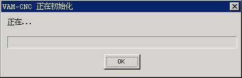

# Foundation of Dialog Box Programming

- [Main Window and Dialog Box](#main-window-and-dialog-box)
- [Dialog Box Template](#dialog-box-template)
- [Dialog Box Callback Function](#dialog-box-callback-function)
- [`MSG_INITDIALOG` Message](#msg-initdialog-message)
- [Modal and Modeless Dialog Box](#modal-and-modeless-dialog-box)
- [Control Styles and Operations Relevant to Dialog Box](#control-styles-and-operations-relevant-to-dialog-box)


The dialog box programming is a technique to construct a user interface
quickly. In general, when we write a simple user interface, we can directly
create all the needed child windows, i.e. the controls, by calling 
`CreateWindow` 
function. But when the user interface is complex, it is undesirable to call the
`CreateWindow` function each time a control is created, and pass many complex
arguments. One of the main reasons is that the program code is mixed with the
data for creating controls, which is not good for maintaining. Therefore, a
usual GUI system provides a mechanism, your can create corresponding main
windows and controls according to the specified template by using this
mechanism. MiniGUI also provides this method, and can create a modal or
modeless dialog box by using a dialog box template.

This chapter first describes the different between main window and dialog box,
and then describes the definition of the dialog box template, the dialog box
callback function, and usage of some important messages. At last, this chapter
illustrates the programming techniques of modal and modeless dialog boxes and
the difference between them.

## Main Window and Dialog Box

In MiniGUI, a dialog box is a special main window, which pays attention only to
the interaction with the user: it displays the output information and more
often receives the input from the user. The dialog box can be interpreted as a
subclassed main window class. It is specially designed for the specialty of the
dialog box (that is to interact with the user). For example, the user can use
`TAB` key to travel the controls and can use `ENTER` key to indicate the 
default 
input.

## Dialog Box Template

In MiniGUI, two structures are used to denote the dialog box template
(minigui/window.h), shown as follows:

```cpp
typedef struct _CTRLDATA
{
    /** Class name of the control */
    const char* class_name;
    /** Control style */
    DWORD       dwStyle;
    /** Control position in dialog */
    int         x, y, w, h;
    /** Control identifier */
    int         id;
    /** Control caption */
    const char* caption;
    /** Additional data */
    DWORD       dwAddData;
    /** Control extended style */
    DWORD       dwExStyle;

    /** window element renderer name */
    const char* werdr_name;

    /** table of we_attrs */
    const WINDOW_ELEMENT_ATTR* we_attrs;
} CTRLDATA;
typedef CTRLDATA* PCTRLDATA;

typedef struct _DLGTEMPLATE
{
    /** Dialog box style */
    DWORD       dwStyle;
    /** Dialog box extended style */
    DWORD       dwExStyle;
    /** Dialog box position */
    int         x, y, w, h;
    /** Dialog box caption */
    const char* caption;
    /** Dialog box icon */
    HICON       hIcon;
    /** Dialog box menu */
    HMENU       hMenu;
    /** Number of controls */
    int         controlnr;
    /** Poiter to control array */
    PCTRLDATA   controls;
    /** Addtional data, must be zero */
    DWORD       dwAddData;
} DLGTEMPLATE;
typedef DLGTEMPLATE* PDLGTEMPLATE;
```

The structure `CTRLDATA` is used to define controls, and `DLGTEMPLATE` is used
to 
define the dialog box itself. You should first use `CTRLDATA` to define all the
controls in the dialog box and express them with a structure array. The order
of controls in the array is the switch order when the user presses `TAB` key.
And 
then, you define the dialog box, specify the number of controls in the dialog
box, and let the member controls in `DLGTEMPLATE` structure point to the array
defining the controls, as shown in List 1.

__NOTE__ There are two new members, `werdr_name` and `we_attrs,` in `CTRLDATA`
structure in MiniGUI 3.0. These two members specify the renderer and window
element property. About the descriptions of renderer and window element
property, please refer to [Chapter 10](MiniGUIPGENV301Chapter10). They are the
last members in the structure, and they will be initialized to zero if the
structure is defined as static variable or global variable, it means to use
default renderer and window element property. The application based on MiniGUI
1.6/2.0 can be compiled in MiniGUI 3.0 directly, if its `CTRLDATA` structure is
defined as static variable or global variable.

__List 1__ Definition of dialog box template

```cpp
static DLGTEMPLATE DlgInitProgress =
{
    WS_BORDER | WS_CAPTION, 
    WS_EX_NONE,
    120, 150, 400, 130, 
    "VAM-CNC is initializing",
    0, 0,
    3, NULL,
    0
};

static CTRLDATA CtrlInitProgress [] =
{ 
    {
        "static",
        WS_VISIBLE | SS_SIMPLE,
        10, 10, 380, 16, 
        IDC_PROMPTINFO, 
        "Initializing...",
        0
    },
    {
        "progressbar",
        WS_VISIBLE,
        10, 40, 380, 20,
        IDC_PROGRESS,
        NULL,
        0
    },
    {
        "button",
        WS_TABSTOP | WS_VISIBLE | BS_DEFPUSHBUTTON, 
        170, 70, 60, 25,
        IDOK, 
        "OK",
        0
    }
};
```

__NOTE__ Data variables for defining the dialog box template in the program
should be defined as static data, so that the data definition is validate only
in its file, and it can be avoided causing potential compiling or linking
errors due to the pollution of the name space.

## Dialog Box Callback Function

You need define the callback function of the dialog box after defining its
template data, and call `DialogBoxIndirectParam` function to create a dialog
box, 
as shown in List 2. The running effect of the created dialog box is as shown
in Figure 1. Please refer to dialogbox.c of the sample program package
`mg-samples` for this guide to get the complete source code of this program.

__List 2__ Defining the callback function of a dialog box and creating the dialog box

```cpp
/* Define the dialog box callback function */
static int InitDialogBoxProc (HWND hDlg, int message, WPARAM wParam, LPARAM lParam)
{
   switch (message) {
   case MSG_INITDIALOG:
       return 1;
   case MSG_COMMAND:
       switch (wParam) {
       case IDOK:
       case IDCANCEL:
          EndDialog (hDlg, wParam);
          break;
       }
       break;
   }
   return DefaultDialogProc (hDlg, message, wParam, lParam);
}
static void InitDialogBox (HWND hWnd)
{
   /* Assoiciate the dialog with the control structure array */
   DlgInitProgress.controls = CtrlInitProgress;
   DialogBoxIndirectParam (&DlgInitProgress, hWnd, InitDialogBoxProc, 0L);
}
```


__Figure 1__ The dialog box created by program in List 2

The prototypes of `DialogBoxIndirectParam` and related functions are listed as
follow:

```cpp
int GUIAPI DialogBoxIndirectParamEx (PDLGTEMPLATE pDlgTemplate,
        HWND hOwner, WNDPROC DlgProc, LPARAM lParam,
        const char* werdr_name, WINDOW_ELEMENT_ATTR* we_attrs,
        const char* window_name, const char* layer_name);

static inline int GUIAPI DialogBoxIndirectParam (PDLGTEMPLATE pDlgTemplate,
        HWND hOwner, WNDPROC DlgProc, LPARAM lParam)
{
    return DialogBoxIndirectParamEx (pDlgTemplate, hOwner, DlgProc, lParam,
                                    NULL, NULL, NULL, NULL);
}

BOOL GUIAPI EndDialog (HWND hDlg, int endCode);
void GUIAPI DestroyAllControls (HWND hDlg);
```

When calling `DialogBoxIndirectParam`, you should specify the dialog box
template 
(pDlgTemplate), the handle of the hosting main window of the dialog box
(hOwner), the callback function address of the dialog box (DlgProc), and the
parameter value (lParam) to be passed to the dialog box callback procedure.
`EndDialog` is used to terminate the dialog box. `DestroyAllControls` is used 
to 
destroy all the child controls of the dialog box (This function can be used by
a main window).

In MiniGUI 3.0, `DialogBoxIndirectParam` is defined as an inline function, it
invokes `DialogBoxIndirectParamEx` to create dialog box. There are four new
arguments in `DialogBoxIndirectParamEx` function:

- `werdr_name:` the name of renderer
- `we_attrs:` the property sheet of window element
- `window_name:` the name of window string, reserved, shall pass `NULL`
- `layer_name:` the name of window's graph layer, reserved, shall pass `NULL`

The dialog box callback function does not perform any substantial work in List
2, and calls `EndDialog` function to return directly when the user click “OK”
button.

## `MSG_INITDIALOG` Message

The dialog box callback function is a special main window procedure function.
When you define your own dialog box callback function, `MSG_INITDIALOG` message
needs to be handled. This message is sent to the dialog box after MiniGUI
creates the dialog box and controls according to the dialog box template.
`LParam` parameter of this message includes the value that passed to the dialog
box callback function by the fourth argument of `DialogBoxIndirectParam`
function. The user can use this value to initialize the dialog box or save it
for future use. For example, the program in List 3 saves `lParam` parameter of
`MSG_INITDIALOG` message to the additional data of the dialog box window, so
that 
this data can be readily gotten from the additional data of the dialog box
window whenever needed.

__List 3__ Handling of `MSG_INITDIALOG` message

```cpp
static int DepInfoBoxProc (HWND hDlg, int message, WPARAM wParam, LPARAM lParam)
{
    struct _DepInfo *info;

    switch(message) {
    case MSG_INITDIALOG:
    {
        /* Get lParam parameter passed to this dialog box, and assign it 
         * to the first additional data assoiciated with the dialog box
         * for future use. */

        info = (struct _DepInfo*)lParam;

        /* Use the data in the info structure to initialize the dialog box */
        ......

        SetWindowAdditionalData (hDlg, (DWORD)lParam);
        break;
    }

    case MSG_COMMAND:
    {
        /* Get the parameter from the first additional data 
         * assoiciated with the dialog box */

        info = (struct _DepInfo*) GetWindowAdditionalData (hDlg);

        switch(wParam) {
        case IDOK:
            /* Use the data in the info structure. */
            ......

        case IDCANCEL:
            EndDialog(hDlg,wParam);
            break;
        }
    }
    }

    return DefaultDialogProc (hDlg, message, wParam, lParam);
}
```

Generally, the parameter passed to the dialog box callback function is a
pointer to a structure. The structure includes some data for initializing the
dialog box, and can also save the input data of the dialog box and pass it
outside of the dialog box for use.

If the dialog box callback function returns a nonzero value when handling
`MSG_INITDIALOG` message, MiniGUI will set the input focus to the first control
with `WS_TABSTOP` style.

## Modal and Modeless Dialog Box

At a word, the modal dialog box is a dialog box that the user cannot switch to
other main windows once this dialog box has been displayed. The user can only
use other main windows when closing the modal dialog box. In MiniGUI, the
dialog box created by `DialogBoxIndirectParam` function is a modal dialog. In
fact, the dialog box first creates a dialog box according to the template, then
disables its hosting main window and creates controls in `MSG_CREATE` message 
of 
the main window, and then sends `MSG_INITDIALOG` message to the callback
function, and lastly enters a new message loop until the program calls
`EndDialog` function.

In fact, we also can create a normal main window using the dialog box template
in MiniGUI, i.e. the modeless dialog box. Here we use 
`CreateMainWindowIndirect` 
function. The following is the prototypes of this function and its related
functions (minigui/window.h):

```cpp
MG_EXPORT HWND GUIAPI CreateMainWindowIndirectParamEx (PDLGTEMPLATE pDlgTemplate,
        HWND hOwner, WNDPROC WndProc, LPARAM lParam,
        const char* werdr_name, WINDOW_ELEMENT_ATTR* we_attrs,
        const char* window_name, const char* layer_name);

static inline HWND GUIAPI
CreateMainWindowIndirectParam (PDLGTEMPLATE pDlgTemplate,
        HWND hOwner, WNDPROC WndProc, LPARAM lParam)
{
    return CreateMainWindowIndirectParamEx (pDlgTemplate, hOwner,
            WndProc, lParam, NULL, NULL, NULL, NULL);
}

#define CreateMainWindowIndirect(pDlgTemplate, hOwner, WndProc) \
            CreateMainWindowIndirectParam(pDlgTemplate, hOwner, WndProc, 0)

BOOL GUIAPI DestroyMainWindowIndirect (HWND hMainWin);
```

In `MIniGUI` 3.0, `CreateMainWindowIndirect` and 
`CreateMainWindowIndirectParam` are
defined as inline functions, they invoke `CreateMainWindowIndirectParamEx` to
create dialog box. There are four new arguments in
`CreateMainWindowIndirectParamEx` function:

- `werdr_name:` the name of renderer
- `we_attrs:` the property sheet of window element
- `window_name:` the name of window string, reserved, shall pass `NULL`
- `layer_name:` the name of window's graph layer, reserved, shall pass `NULL`

The main window created by `CreateMainWindowIndirect` according to the dialog
template is not different from a normal main window at all. However,
`CreateMainWindowIndirect` is different from `DialogBoxIndirectParam` function
as 
follows:

- After creating the main window with the data in the dialog box template,
`CreateMainWindowIndirect` function will return immediately, while
`DialogBoxIndirectParam` will enters a new message loop.

The program in List 4 creates a main window with the dialog box template in
List 1

__List 4__ Creating a main window with a dialog box template

```cpp
/* Define the window callback function */
static int InitWindowProc (HWND hDlg, int message, WPARAM wParam, LPARAM lParam)
{
    switch (message) {
    case MSG_COMMAND:
        switch (wParam) {
        case IDOK:
        case IDCANCEL:
            DestroyMainWindowIndirect (hWnd);
            break;
        }
        break;

    }

    return DefaultWindowProc (hDlg, message, wParam, lParam);
}

    ...

{
    HWND hwnd;
    MSG  Msg;

    /* Assocate the dialog box template with control array */
    DlgInitProgress.controls = CtrlInitProgress;

    /* Create the main window */
    hwnd = CreateMianWindowIndirect (&DlgInitProgress, HWND_DESKTOP, InitWindowProc);

    if (hwnd == HWND_INVALID)
        return -1;

    while (GetMessage (&Msg, hwnd)) {
       TranslateMessage (&Msg);
       DispatchMessage (&Msg);
    }
}
```

The program in List 4 will create a main window, which is completely the same
with the dialog box in Figure 1.

## Control Styles and Operations Relevant to Dialog Box

Some general window styles are only valid for child controls in the dialog box;
Table 1 summarizes these styles. The default window procedure of the dialog
box will handle control with these styles.

__Table 1__ Some styles used only for the controls in a dialog box

| *Style Identifier* | *Purpose* | *Comment* |
| --------------------|-----------|-----------|
| `WS_GROUP` | Controls with this style will be the leader of the same group. | Controls from this control to the control before next control with `WS_GROUP` style, or to the control before the control with different class, belong to the same group |
| `WS_TABSTOP` | Have `TAB-stop` function | Indicates the user can set the input focus to the control by using Tab key |

MiniGUI provides some operation function for the dialog box, summarized as in
Table 2. It should be noted that, these functions are not limited to be used in
dialog boxes although their name having prefix of “Dlg”. For example,
`GetDlgItemText` function can be used to get the text of the child controls if
only the handle of parent window and the identifier of child controls are
known.

__Table 2__ Operation functions of the dialog box

| *Function* | *Purpose* | *Comment* |
| ------------|-----------|-----------|
| `DestroyAllControls` | Destroys all controls in a window | |
| `GetDlgCtrlID` | Gets the integer identifier of a control | |
| `GetDlgItem` | Retrieves the handle to a control in a dialog box | |
| `GetDlgItemInt` | Translates the text of a control in a dialog box into an integer value | |
| `SetDlgItemInt` | Sets the text of a control in a dialog box to the string representation of a specified integer value | |
| `GetDlgItemText` | Retrieves the title or text associated with a control in a dialog box | Function is same as `GetWindowText` |
| `GetDlgItemText2` | Retrieves the title or text associated with a control in a dialog box | Automatically allocate memory according to the text length, application is responsible for releasing these memory. |
| `SetDlgItemText` | Sets the title or text of a control in a dialog box | Function is same as `SetWindowText` |
| `GetNextDlgGroupItem` | Retrieves the handle to the first control in a group of controls that precedes (or follows) the specified control in a dialog box | Used for traveling the same group controls, please refer to `WS_GROUP` style |
| `GetNextDlgTabItem` | Retrieves the handle to the first control that has the `WS_TABSTOP` style that precedes (or follows) the specified control | Used for `TAB` key traveling controls, please refer to `WS_TABSTOP` style |
| `SendDlgItemMessage` | Sends a message to the specified control in a dialog box | Function is same as `SendMessage` |
| `CheckDlgButton` | Changes the check status of a button control | |
| `CheckRadioButton` | Adds a check mark to (checks) a specified radio button in a group and removes a check mark from (clears) all other radio buttons in the group | |
| `IsDlgButtonChecked` | Determines whether a button control has a check mark next to it or whether a three-state button control is grayed, checked, or neither | |
| `GetDlgDefPushButton` | Gets the default push button control in a window | |

----

[&lt;&lt; Window and Message](MiniGUIProgGuidePart1Chapter02.md) |
[Table of Contents](README.md) |
[Foundation of Control Programming &gt;&gt;](MiniGUIProgGuidePart1Chapter04.md)

[Release Notes for MiniGUI 3.2]: /supplementary-docs/Release-Notes-for-MiniGUI-3.2.md
[Release Notes for MiniGUI 4.0]: /supplementary-docs/Release-Notes-for-MiniGUI-4.0.md
[Showing Text in Complex or Mixed Scripts]: /supplementary-docs/Showing-Text-in-Complex-or-Mixed-Scripts.md
[Supporting and Using Extra Input Messages]: /supplementary-docs/Supporting-and-Using-Extra-Input-Messages.md
[Using CommLCD NEWGAL Engine and Comm IAL Engine]: /supplementary-docs/Using-CommLCD-NEWGAL-Engine-and-Comm-IAL-Engine.md
[Using Enhanced Font Interfaces]: /supplementary-docs/Using-Enhanced-Font-Interfaces.md
[Using Images and Fonts on System without File System]: /supplementary-docs/Using-Images-and-Fonts-on-System-without-File-System.md
[Using SyncUpdateDC to Reduce Screen Flicker]: /supplementary-docs/Using-SyncUpdateDC-to-Reduce-Screen-Flicker.md
[Writing DRI Engine Driver for Your GPU]: /supplementary-docs/Writing-DRI-Engine-Driver-for-Your-GPU.md
[Writing MiniGUI Apps for 64-bit Platforms]: /supplementary-docs/Writing-MiniGUI-Apps-for-64-bit-Platforms.md

[Quick Start]: /user-manual/MiniGUIUserManualQuickStart.md
[Building MiniGUI]: /user-manual/MiniGUIUserManualBuildingMiniGUI.md
[Compile-time Configuration]: /user-manual/MiniGUIUserManualCompiletimeConfiguration.md
[Runtime Configuration]: /user-manual/MiniGUIUserManualRuntimeConfiguration.md
[Tools]: /user-manual/MiniGUIUserManualTools.md
[Feature List]: /user-manual/MiniGUIUserManualFeatureList.md

[MiniGUI Overview]: /MiniGUI-Overview.md
[MiniGUI User Manual]: /user-manual/README.md
[MiniGUI Programming Guide]: /programming-guide/README.md
[MiniGUI Porting Guide]: /porting-guide/README.md
[MiniGUI Supplementary Documents]: /supplementary-docs/README.md
[MiniGUI API Reference Manuals]: /api-reference/README.md

[MiniGUI Official Website]: http://www.minigui.com
[Beijing FMSoft Technologies Co., Ltd.]: https://www.fmsoft.cn
[FMSoft Technologies]: https://www.fmsoft.cn
[HarfBuzz]: https://www.freedesktop.org/wiki/Software/HarfBuzz/
