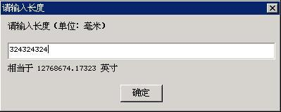

# Foundation of Control Programming

- [Control and Control Class](#control-and-control-class)
- [Creating Control Instance by Using Predefined Control Class](#creating-control-instance-by-using-predefined-control-class)
- [Topics Involved in Control Programming](#topics-involved-in-control-programming)
- [Operations Specific to Control](#operations-specific-to-control)


There are predefined controls in a relatively complex GUI system, and they are
the main elements for the human-machine interaction. This chapter will
illustrate what is the control and control class, and briefly introduce the
predefined control classes in MiniGUI.

## Control and Control Class

The concept of controls (or widgets) is well known. The control can be
interpreted as the child window in the main window. The behaviors of these
child windows, as well as that of the main window, both can accept the exterior
input such as the keyboard and the mouse, and can output in their own regions -
but all the actions are restricted within the main window. MiniGUI also
supports child windows, and can create nested child windows in the child
window. We refer to all the child windows in MiniGUI as controls.

In Window or X Window, the system will predefine some control classes. When you
use a certain control class to create controls, all the controls belonging to
this control class will have the same behaviors and appearances. With this
technique, the consistent human-machine interaction interface can be ensured,
and the program can construct the graphics user interface as building toy
bricks. MiniGUI uses the concept of control and control class, and can
conveniently overload the existed control to make it have some special effects.
For example, when an edit box which only allows digit to input in, you can
realize it by overloading the existed `EDIT` control class, instead of
developing 
a new control class.

If you have the experience of developing a Windows application, you should
remember that before creating a new window, you must assure that the
corresponding window class of this new window has existed in the system. In
Windows operating system, each window created by the program corresponds to a
certain window class. This concept is similar to the relationship between the
class and the object in the object-oriented programming. Referring to the terms
of object oriented, each window in Windows is an instance of a certain window
class. Similar concepts are present in the X Window programming; for example,
each widget created is actually an instance of a certain widget class.

Thus, if a program needs to create a window, it should first be sure to select
the correct window class, because each window class determines the appearances
and behaviors of the corresponding window instances. Herein the presentation
means the appearance of the window, such as the width of the window border,
whether or not the caption bar exists, etc. The behavior means the response of
the window to the user input. Each GUI system will predefine some window
classes. Examples of the common window classes include the button, list box,
scroll bar, edit box, etc. If the window to be created by the program is very
special, you can first register your own window class, and then create an
instance of this window class. Thus the code reusability is improved
substantially.

In MiniGUI, the main window is generally considered as a special window. Since
the reusability of the main window code is usually very low, it will cause
additional unnecessary memory space if we register a window class for each main
window in a usual way. So we do not provide window class support in the main
window, but all the child windows, i.e. controls, in the main window support
the concept of the window class (control class). MiniGUI provides the
predefined control classes commonly used, including button (including radio
button, check box), static control, list box, progress bar, track bar, edit
box, etc. A program can customize its own control class, register the control
class and then create the corresponding control instances. Table 1 lists the
predefined control classes and the corresponding class names in MiniGUI.

Table 1 Control class and corresponding class name predefined in MiniGUI

| *Control Class* | *Class Name* | *C Macro for Control Name* | *Note* |
| -----------------------|---------------------------|-------------------------------------------|--------|
| Static Text |"static" |CTRL_STATIC | refer to [Chapter 19](MiniGUIPGENV301Chapter18)|
| Button |"button" |CTRL_BUTTON | refer to [Chapter 20](MiniGUIPGENV301Chapter19)|
| List Box |"listbox" |CTRL_LISTBOX | refer to [Chapter 21](MiniGUIPGENV301Chapter20)|
| Single-Line Edit Box |"sledit" |CTRL_SLEDIT | refer to [Chapter 22](MiniGUIPGENV301Chapter21)|
| Multi-Line Edit Box |"mledit" |CTRL_MLEDIT | (same with `TRL_TEXTEDIT`) |
| Text Edit Box |“textedit” |CTRL_TEXTEDIT | refer to [Chapter 22](MiniGUIPGENV301Chapter21) |
| Combo Box |“combobox” |CTRL_COMBOBOX | refer to [Chapter 23](MiniGUIPGENV301Chapter22)|
| Menu Button |"menubutton" |CTRL_MENUBUTTON | refer to [Chapter 24](MiniGUIPGENV301Chapter23)|
| Progress Bar |"progressbar" |CTRL_PRORESSBAR | refer to [Chapter 25](MiniGUIPGENV301Chapter24)|
| Trackbar |"trackbar" |CTRL_TRACKBAR | refer to [Chapter 26](MiniGUIPGENV301Chapter25)|
| New Toolbar |"newtoolbar" |CTRL_NEWTOOLBAR | refer to [Chapter 27](MiniGUIPGENV301Chapter26)|
| Property Sheet |"propsheet" |CTRL_PROPSHEET | refer to [Chapter 28](MiniGUIPGENV301Chapter27)|
| Scrollable Window |"scrollwnd" |CTRL_SCROLLWND | refer to [Chapter 29](MiniGUIPGENV301Chapter28)|
| Scrollable View |"scrollview" |CTRL_SCROLLVIEW | refer to [Chapter 30](MiniGUIPGENV301Chapter29)|
| Tree View |"treeview" |CTRL_TREEVIEW | refer to [Chapter 31](MiniGUIPGENV301Chapter30)|
| List View |"listview" |CTRL_LISTVIEW | refer to [Chapter 32](MiniGUIPGENV301Chapter31)|
| Month Calendar |"monthcalendar" |CTRL_MONTHCALENDAR | refer to [Chapter 33](MiniGUIPGENV301Chapter32)|
| `SpinBox` |"spinbox" |CTRL_SPINBOX | refer to [Chapter 34](MiniGUIPGENV301Chapter33)|
| Cool Bar |"coolbar" |CTRL_COOLBAR | refer to [Chapter 35](MiniGUIPGENV301Chapter34)|
| Animation |"animation" |CTRL_ANIMATION | refer to [Chapter 36](MiniGUIPGENV301Chapter35)|
| Grid View |“gridview” |CTRL_GRIDVIEW | refer to [Chapter 37](MiniGUIPGENV301Chapter36)|
| Icon View |“iconview” |CTRL_ICONVIEW | refer to [Chapter 38](MiniGUIPGENV301Chapter37)|
| Scrollbar |"scrollbar" |CTRL_SCROLLBAR | refer to [Chapter 39](MiniGUIPGENV301Chapter38)|

## Creating Control Instance by Using Predefined Control Class

In MiniGUI, by calling the `CreateWindow` function (the `CreateWindow` is in
fact a
macro of the `CreateWindowEx` function) can create an instance of a certain
control class. The control class can be either the predefined MiniGUI control
classes in Table 1, or a user-defined control class. Following are the
prototypes of several functions related to `CreateWindow` function
(minigui/window.h):

```cpp
HWND GUIAPI CreateWindowEx2 (const char* spClassName,
        const char* spCaption, DWORD dwStyle, DWORD dwExStyle,
        int id, int x, int y, int w, int h, HWND hParentWnd,
        const char* werdr_name, const WINDOW_ELEMENT_ATTR* we_attrs,
        DWORD dwAddData);

static inline HWND GUIAPI CreateWindowEx (const char* spClassName,
        const char* spCaption, DWORD dwStyle, DWORD dwExStyle,
        int id, int x, int y, int w, int h, HWND hParentWnd,
        DWORD dwAddData)
{
    return CreateWindowEx2 (spClassName, spCaption, dwStyle, dwExStyle,
                id, x, y, w, h, hParentWnd, NULL, NULL, dwAddData);
}

#define CreateWindow(class_name, caption, style, id, x, y, w, h, parent, add_data) \
        CreateWindowEx(class_name, caption, style, 0, id, x, y, w, h, parent, add_data)

BOOL GUIAPI DestroyWindow (HWND hWnd);
```

The `CreateWindow` function creates a child window, i.e. a control. It 
specifies 
the control class (class_name), the control caption (caption), the control
style (style), the control identifier (id), and the initial position and size
of the control (x, y, w, h). This function also specifies the parent window
(parent) of the child window. The parameter `add_data` is used to pass a 
special 
data to the control, and the data structures pointed to by this pointer are
different for different control classes.

The affection of the `CreateWindowEx` function is same as `CreateWindow`
function; 
however, the `CreateWindowEx` can be used to specify the extended style
(dwExStyle) of the control.

`CreateWindowEx2` function is a new added function in MiniGUI 3.0. It is based
on 
`CreateWindowEx` and has two new arguments: `werdr_name` and `we_attrs,` they
specify 
the name and the property of renderer for control.

The `DestroyWindow` function is used to destroy the control or the child window
created by above two functions.

The program in List 1 creates several types of controls by using the predefined
control classes: static control, button and single-line edit box. Among them
`hStaticWnd1` is the static control created in the main window `hWnd`; 
`hButton1`, 
`hButton2`, `hEdit1`, and `hStaticWnd2` are several controls created in
`hStaicWnd1`, 
and existing as the child controls of `hStaticWnd1`; While `hEdit2` is the 
child 
control of `hStaicWnd2`, and is the grandchild control of `hStaticWnd1`.

__List 1__ Creating controls using the predefined control classes

```cpp
#define IDC_STATIC1     100
#define IDC_STATIC2     150
#define IDC_BUTTON1     110
#define IDC_BUTTON2     120
#define IDC_EDIT1       130
#define IDC_EDIT2       140

      /* Create a static control */
      hStaticWnd1 = CreateWindow (CTRL_STATIC, 
                    "This is a static control", 
                    WS_CHILD | SS_NOTIFY | SS_SIMPLE | WS_VISIBLE | WS_BORDER,
                    IDC_STATIC1, 
                    10, 10, 180, 300, hWnd, 0);

      /* Create two button controls in hStaticWnd1 */
      hButton1  = CreateWindow (CTRL_BUTTON,
                    "Button1", 
                    WS_CHILD | BS_PUSHBUTTON | WS_VISIBLE, 
                    IDC_BUTTON1, 
                    20, 20, 80, 20, hStaticWnd1, 0);
      hButton2  = CreateWindow (CTRL_BUTTON,
                    "Button2", 
                    WS_CHILD | BS_PUSHBUTTON | WS_VISIBLE, 
                    IDC_BUTTON2, 
                    20, 50, 80, 20, hStaticWnd1, 0);

      /* Create one edit control in hStaticWnd1 */
      hEdit1   = CreateWindow (CTRL_EDIT,
                    "Edit Box 1", 
                    WS_CHILD | WS_VISIBLE | WS_BORDER, 
                    IDC_EDIT1, 
                    20, 80, 100, 24, hStaticWnd1, 0);

      /* Create a static control in hStaticWnd1 */
      hStaticWnd2 = CreateWindow (CTRL_STATIC, 
                    "This is child static control", 
                    WS_CHILD | SS_NOTIFY | SS_SIMPLE | WS_VISIBLE | WS_BORDER,
                    IDC_STATIC1, 
                    20, 110, 100, 50, hStaticWnd1, 0);

      /* Create an edit box hEdit2 in hStaticWnd2, 
       * thus hEdit2 is the grandchild window of hStaticWnd1 */
      hEdit2   = CreateWindow (CTRL_EDIT,
                    "Edit Box 2", 
                    WS_CHILD | WS_VISIBLE | WS_BORDER, 
                    IDC_EDIT2, 
                    0, 20, 100, 24, hStaticWnd2, 0);
```

## Topics Involved in Control Programming

In control programming, besides creating and destroying of the control,
following subjects are usually involved:

- The control has its own window style definition. You need to specify the
needed style when creating the control. Different styles will result in
different appearance and behavior.
- Getting or setting the status and contents and so on of the control. In
general, sending some general or special messages to the control can complete
this. In addition, the general functions for windows are usually suitable for
the controls, such as `ShowWindow`, `MoveWindow`, `EnableWindow`, 
`SetWindowFont`, etc.
- Informing the parent window by notification messages when a certain event
happens in the control. Notification messages are generally sent by
`MSG_COMMAND` messages. `WParam` parameter of this message consists of the
window 
identifier and the notification code, and `lParam` includes the handle of the
control sending the notification messages. For example, when users change the
contents of an edit box, the edit box will send `EN_CHANGE` notification 
message 
to the parent window. If the window procedure of the parent window needs to
know this change, the notification message should be handled in the window
procedure of the parent window as follows:

```cpp
switch (message) {
        case MSG_COMMAND:
        {
            int id = LOWORD(wParam);
            int nc = HIWORD(wParam);
            if (id == ID_MYEDIT && nc == EN_CHANGE) {
                /* The user has changed the content of ID_MYEDIT edit box 
                * of the child window, and further handling is being done now. */
            }
        }
        break;
    }
```

- MiniGUI V1.2.6 introduces `SetNotificationCallback` function for the
notification message handling of control. This function can set a callback
function of the notification message for a control. When the control has a
notification message, it will call the callback function, instead of sending
the notification message to the parent window. New applications should use this
function as far as possible to handle notification messages of a control to get
a good program structure. All the sample programs for this guide use this
interface to handle notification messages of a control.

The function in List 2 creates a simple dialog box by using the predefined
control classes. When the user inputs data in unit of millimeter (mm) into the
edit box, the system will display the corresponding data in unit of inch in the
static control below the edit box, and return the data input by the user to the
function calling the dialog box when the user select “OK” button.

__List 2__ Realizing a simple input dialog box using the predefined controls

```cpp
#include <stdio.h>
#include <stdlib.h>

#include <minigui/common.h>
#include <minigui/minigui.h>
#include <minigui/gdi.h>
#include <minigui/window.h>
#include <minigui/control.h>

/* Define dialog box template */
static DLGTEMPLATE DlgBoxInputLen =
{
    WS_BORDER | WS_CAPTION, 
    WS_EX_NONE,
    120, 150, 400, 160, 
    "请输入长度",
    0, 0,
    4, NULL,
    0
};

#define IDC_SIZE_MM     100
#define IDC_SIZE_INCH   110

/* 
 * The dialog includes four controls in total, which are used to 
 * display prompt information, input value, display the 
 * transformed length value, and show a “OK” button to close the program
 */
static CTRLDATA CtrlInputLen [] =
{ 
    {
        CTRL_STATIC,
        WS_VISIBLE | SS_SIMPLE,
        10, 10, 380, 18, 
        IDC_STATIC, 
        "请输入长度（单位：毫米）",
        0
    },
    {
        CTRL_EDIT,
        WS_VISIBLE | WS_TABSTOP | WS_BORDER,
        10, 40, 380, 24,
        IDC_SIZE_MM,
        NULL,
        0
    },
    {
        CTRL_STATIC,
        WS_VISIBLE | SS_SIMPLE,
        10, 70, 380, 18, 
        IDC_SIZE_INCH, 
        "相当于 0.00 英寸",
        0
    },
    {
        CTRL_BUTTON,
        WS_TABSTOP | WS_VISIBLE | BS_DEFPUSHBUTTON, 
        170, 100, 60, 25,
        IDOK, 
        "确定",
        0
    }
};

/* This is the notification callback funciton of the input box. */
static void my_notif_proc (HWND hwnd, int id, int nc, DWORD add_data)
{
    /* When the value in the input box is changed, 
     * get the value, transform it into inch,and display it in the inch box
     */
    if (id == IDC_SIZE_MM && nc == EN_CHANGE) {
        char buff [60];
        double len;

        GetWindowText (hwnd, buff, 32);
        len = atof (buff);
        len = len / 25.4;

        sprintf (buff, "相当于 %.5f 英寸", len);
        SetDlgItemText (GetParent (hwnd), IDC_SIZE_INCH, buff);
    }
}

/* The dialog box callback function */
static int InputLenDialogBoxProc (HWND hDlg, int message, WPARAM wParam, LPARAM lParam)
{
    switch (message) {
    case MSG_INITDIALOG:
        /* 
         * Save the pointer passed by the last parameter of DialogBoxIndirectParam
         * in the form of window additonal data for future use.
         */
        SetWindowAdditionalData (hDlg, lParam);
        /* Set the notification callback function for the edit box.
         */
        SetNotificationCallback (GetDlgItem (hDlg, IDC_SIZE_MM), my_notif_proc);
        return 1;

    case MSG_COMMAND:
        switch (wParam) {
        case IDOK:
        {
            char buff [40];
            /* Get data from the input box, and save it in the pointer passed in.
             */
            double* length = (double*) GetWindowAdditionalData (hDlg);
            GetWindowText (GetDlgItem (hDlg, IDC_SIZE_MM), buff, 32);
            *length = atof (buff);
        }
        case IDCANCEL:
            EndDialog (hDlg, wParam);
            break;
        }
        break;
    }

    return DefaultDialogProc (hDlg, message, wParam, lParam);
}

static void InputLenDialogBox (HWND hWnd, double* length)
{
    DlgBoxInputLen.controls = CtrlInputLen;

    DialogBoxIndirectParam (&DlgBoxInputLen, hWnd, InputLenDialogBoxProc, (LPARAM)length);
}

int MiniGUIMain (int argc, const char* argv[])
{
    double length;

#ifdef _MGRM_PROCESSES
    JoinLayer(NAME_DEF_LAYER , "input" , 0 , 0);
#endif

    InputLenDialogBox (HWND_DESKTOP, &length);

    /* Print the value input by the user in the dialog box to the terminal
     */
    printf ("The length is %.5f mm.\n", length);

    return 0;
}

#ifndef _MGRM_PROCESSES
#include <minigui/dti.c>
#endif
```

The running effect of the program in List 2 is shown in Figure 1. Please refer
to the input.c file of the sample program package for this guide to get the
complete source code of the program.


Figure 1 A simple input dialog box

In the Part `IV`, we will introduce the predefined controls of MiniGUI. We will
describe all the predefined controls in three aspects: the purpose and usage of
the control, the styles, messages, and notification codes. We will also give
the sample code of the controls.

## Operations Specific to Control

MiniGUI provides some operation functions specific to control, as show in Table
2.

__Table 2__ Operation functions specific to control

| *Function* | *Purpose* | *Comment* |
| -------------------------|------------|-----------|
| `GetNotificationCallback` | Gets the notification callback procedure of a control | Appear in MiniGUI version 1.2.6 |
| `SetNotificationCallback` | Sets the notification callback procedure of a control | ^ |
| `NotifyParentEx` | Sends a notification message to the parent | |

----

[&lt;&lt; Foundation of Dialog Box Programming](MiniGUIProgGuidePart1Chapter02.md) |
[Table of Contents](README.md) |
[Advanced Programming of Control &gt;&gt;](MiniGUIProgGuidePart1Chapter05.md)

[Release Notes for MiniGUI 3.2]: /supplementary-docs/Release-Notes-for-MiniGUI-3.2.md
[Release Notes for MiniGUI 4.0]: /supplementary-docs/Release-Notes-for-MiniGUI-4.0.md
[Showing Text in Complex or Mixed Scripts]: /supplementary-docs/Showing-Text-in-Complex-or-Mixed-Scripts.md
[Supporting and Using Extra Input Messages]: /supplementary-docs/Supporting-and-Using-Extra-Input-Messages.md
[Using CommLCD NEWGAL Engine and Comm IAL Engine]: /supplementary-docs/Using-CommLCD-NEWGAL-Engine-and-Comm-IAL-Engine.md
[Using Enhanced Font Interfaces]: /supplementary-docs/Using-Enhanced-Font-Interfaces.md
[Using Images and Fonts on System without File System]: /supplementary-docs/Using-Images-and-Fonts-on-System-without-File-System.md
[Using SyncUpdateDC to Reduce Screen Flicker]: /supplementary-docs/Using-SyncUpdateDC-to-Reduce-Screen-Flicker.md
[Writing DRI Engine Driver for Your GPU]: /supplementary-docs/Writing-DRI-Engine-Driver-for-Your-GPU.md
[Writing MiniGUI Apps for 64-bit Platforms]: /supplementary-docs/Writing-MiniGUI-Apps-for-64-bit-Platforms.md

[Quick Start]: /user-manual/MiniGUIUserManualQuickStart.md
[Building MiniGUI]: /user-manual/MiniGUIUserManualBuildingMiniGUI.md
[Compile-time Configuration]: /user-manual/MiniGUIUserManualCompiletimeConfiguration.md
[Runtime Configuration]: /user-manual/MiniGUIUserManualRuntimeConfiguration.md
[Tools]: /user-manual/MiniGUIUserManualTools.md
[Feature List]: /user-manual/MiniGUIUserManualFeatureList.md

[MiniGUI Overview]: /MiniGUI-Overview.md
[MiniGUI User Manual]: /user-manual/README.md
[MiniGUI Programming Guide]: /programming-guide/README.md
[MiniGUI Porting Guide]: /porting-guide/README.md
[MiniGUI Supplementary Documents]: /supplementary-docs/README.md
[MiniGUI API Reference Manuals]: /api-reference/README.md

[MiniGUI Official Website]: http://www.minigui.com
[Beijing FMSoft Technologies Co., Ltd.]: https://www.fmsoft.cn
[FMSoft Technologies]: https://www.fmsoft.cn
[HarfBuzz]: https://www.freedesktop.org/wiki/Software/HarfBuzz/
