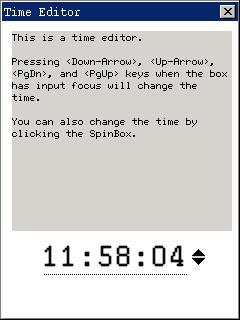

# Advanced Programming of Control

## User-Defined Control

You can also register your own control class by calling `RegisterWindowClass`
function, and create an instance of your control class. If the program will not
use a certain user-defined control class any more, it should use
`UnregisterWindowClass` function to unregister this user-defined control class.
Please refer to “control class” of section 3.2.4 of this guide for the usage of
the above two functions.

## Subclassing of Control

Using the framework of a control class and control instance can not only
improve the code reusability, but also extend the existing control class
conveniently. For example, when you need to create an edit box which only
allows inputting digits, you can realize by overriding the existing edit box
control class rather than write a new control class. In MiniGUI, this technique
is called subclassing or window derived. Methods of subclassing have three
types:

- The first one is to perform subclassing on the created control instance, and
the result of subclassing only affects this control instance.
- The second one is to perform subclassing on a certain control class, which
will affect all the control instances created later of this control class.
- The last one is to register a subclassing control class based on a certain
control class, which will not affect the original control class. In Windows,
this technique is also called super-subclassing.

In MiniGUI, the subclassing of a control is actually implemented by replacing
the existing window procedure. The codes in List 1 create two subclassing
edit boxes by subclassing: one only allows inputting digits, and the other only
allows inputting letters:


List 1 Subclassing of control

```cpp
#define IDC_CTRL1     100
#define IDC_CTRL2     110
#define IDC_CTRL3     120
#define IDC_CTRL4     130

#define MY_ES_DIGIT_ONLY    0x0001
#define MY_ES_ALPHA_ONLY    0x0002

static WNDPROC old_edit_proc;

static int RestrictedEditBox (HWND hwnd, int message, WPARAM wParam, LPARAM lParam)
{
    if (message == MSG_CHAR) {
        DWORD my_style = GetWindowAdditionalData (hwnd);
        /* Determine the key-pressed type being shielded */
        if ((my_style & MY_ES_DIGIT_ONLY) && (wParam < '0' || wParam > '9'))
            return 0;
        else if (my_style & MY_ES_ALPHA_ONLY)
            if (!((wParam >= 'A' && wParam <= 'Z') || (wParam >= 'a' && wParam <= 'z')))
                /* Receive the key-pressed message being shielded, and returns directly */
                return 0;
    }
    /* Handle the other messages by the old window procedure */
    return (*old_edit_proc) (hwnd, message, wParam, lParam);
}

static int ControlTestWinProc (HWND hWnd, int message, WPARAM wParam, LPARAM lParam)
{
    switch (message) {
    case MSG_CREATE:
    {
        HWND hWnd1, hWnd2, hWnd3;
        CreateWindow (CTRL_STATIC, "Digit-only box:", WS_CHILD | WS_VISIBLE | SS_RIGHT, 0, 
                    10, 10, 180, 24, hWnd, 0);
        hWnd1 = CreateWindow (CTRL_EDIT, "", WS_CHILD | WS_VISIBLE | WS_BORDER, IDC_CTRL1, 
                    200, 10, 180, 24, hWnd, MY_ES_DIGIT_ONLY);
        CreateWindow (CTRL_STATIC, "Alpha-only box:", WS_CHILD | WS_VISIBLE | SS_RIGHT, 0, 
                    10, 40, 180, 24, hWnd, 0);
        hWnd2 = CreateWindow (CTRL_EDIT, "", WS_CHILD | WS_BORDER | WS_VISIBLE, IDC_CTRL2, 
                    200, 40, 180, 24, hWnd, MY_ES_ALPHA_ONLY);
        CreateWindow (CTRL_STATIC, "Normal edit box:", WS_CHILD | WS_VISIBLE | SS_RIGHT, 0, 
                    10, 70, 180, 24, hWnd, 0);
        hWnd3 = CreateWindow (CTRL_EDIT, "", WS_CHILD | WS_BORDER | WS_VISIBLE, IDC_CTRL2, 
                    200, 70, 180, 24, hWnd, MY_ES_ALPHA_ONLY);
        CreateWindow ("button", "Close", WS_CHILD | BS_PUSHBUTTON | WS_VISIBLE, IDC_CTRL4, 
                    100, 100, 60, 24, hWnd, 0);
        /* Replace the window procedure of the edit box with the 
         * user-defined window procedure, and save the old window procedure. */
        old_edit_proc = SetWindowCallbackProc (hWnd1, RestrictedEditBox);
        SetWindowCallbackProc (hWnd2, RestrictedEditBox);
        break;
    }
    ......
    }
    return DefaultMainWinProc (hWnd, message, wParam, lParam);
}
```

## Combined Use of Controls

We can also combine two different controls together to achieve a certain
special effect. In fact, the predefined control class of the combo box is a
typical one of combining controls. When we combine different controls, we can
encapsulate and register the combined control to be a new control class, and
can also use it directly without encapsulation.

To illustrate the method to combine controls more clearly, we can assume that
we want to implement a time editor. This time editor displays the time in form
of “08:05:30”, and we need further add a method to edit the time neatly
according the user’s requirement. To meet this requirement, we combine the edit
box and the spin box together which implement the following functions,
respectively:
- The edit box displays the time in form of “HH:MM:SS”.
- When the input focus is in the edit box, the user can not edit the time
directly, but must control the time value where the caret is with the arrow
keys and `PageDown` and `PageUp` keys. So we must subclass this edit box to
catch 
the key-pressed in it and perform the appropriate handling.
- Place a spin box beside the edit box. The user can adjust the time element
where the caret is to increase or decrease by clicking the spin box. To
achieve this goal, we can use the function of the spin box, and set the handle
of the target window to be the edit box.

Thus, the time editor can work normally. Partial codes of this program are
listed in List 2, and please refer to timeeditor.c file of the sample program
package of this guide for the complete source code. Fig 6.1 shows the running
effect of the timeeditor.

__List 2__ Time Editor

```cpp
#include <stdio.h>
#include <stdlib.h>
#include <string.h>

#include <minigui/common.h>
#include <minigui/minigui.h>
#include <minigui/gdi.h>
#include <minigui/window.h>
#include <minigui/control.h>
#include <minigui/mgext.h>

#define IDC_EDIT    100
#define IDC_SPINBOX 110

/* font for edit control. Use TrueType font to get better effect *'/
static PLOGFONT timefont;

/* save old edit window procedure */
static WNDPROC old_edit_proc;

/* Change time value according to the position of current caret */
static void on_down_up (HWND hwnd, int offset)
{
    char time [10];
    int caretpos;
    int hour, minute, second;

    GetWindowText (hwnd, time, 8);
    caretpos = SendMessage (hwnd, EM_GETCARETPOS, 0, 0);

    hour = atoi (time);
    minute = atoi (time + 3);
    second = atoi (time + 6);

    if (caretpos > 5) { /* change second */
    /* second position */
        second += offset;
        if (second < 0)
            second = 59;
        if (second > 59)
            second = 0;
    }
    else if (caretpos > 2) { /* change minute */
    /* minute position */
        minute += offset;
        if (minute < 0)
            minute = 59;
        if (minute > 59)
            minute = 0;
    }
    else { /* change hour */
    /* hour position */
        hour += offset;
        if (hour < 0)
            hour = 23;
        if (hour > 23)
            hour = 0;
    }

    /* put changed time string in edit box */
    sprintf (time, "%02d:%02d:%02d", hour, minute, second);
    SetWindowText (hwnd, time);

    /* recover caret position */
    SendMessage (hwnd, EM_SETCARETPOS, 0, caretpos);
}

/* This is edit box's SubClassing window procedure function */
static int TimeEditBox (HWND hwnd, int message, WPARAM wParam, LPARAM lParam)
{
    /* Only handle button press message. When the following keys are pressed, 
     * call on _down_up function to modify time value */
    if (message == MSG_KEYDOWN) {
        switch (wParam) {
        case SCANCODE_CURSORBLOCKUP:
            on_down_up (hwnd, 1);
            return 0;
        case SCANCODE_CURSORBLOCKDOWN:
            on_down_up (hwnd, -1);
            return 0;
        case SCANCODE_PAGEUP:
            on_down_up (hwnd, 10);
            return 0;
        case SCANCODE_PAGEDOWN:
            on_down_up (hwnd, -10);
            return 0;

        case SCANCODE_CURSORBLOCKLEFT:
        case SCANCODE_CURSORBLOCKRIGHT:
                break;
        default:
                return 0;
        }
    }

    /* ignore the following two messages, user can only operate by using above keys */
    if (message == MSG_KEYUP || message == MSG_CHAR)
        return 0;

    return (*old_edit_proc) (hwnd, message, wParam, lParam);
}

static int TimeEditorWinProc (HWND hWnd, int message, WPARAM wParam, LPARAM lParam)
{
    switch (message) {
    case MSG_CREATE:
    {
        HWND hwnd;
        HDC hdc;
        HWND timeedit, spin;
        SIZE size;

        /* create descriptive static */
        hwnd = CreateWindow (CTRL_STATIC, 
                        "This is a time editor.\n\n"
                        "Pressing <Down-Arrow>, <Up-Arrow>, <PgDn>, and <PgUp> keys"
                        " when the box has input focus will change the time.\n\n"
                        "You can also change the time by clicking the SpinBox.\n",
                        WS_CHILD | WS_VISIBLE | SS_LEFT, 
                        IDC_STATIC, 
                        10, 10, 220, 200, hWnd, 0);

        /* create logic font for edit box */
        timefont = CreateLogFont (NULL, "Arial", "ISO8859-1", 
                        FONT_WEIGHT_BOOK, FONT_SLANT_ROMAN, FONT_FLIP_NIL,
                        FONT_OTHER_NIL, FONT_UNDERLINE_NONE, FONT_STRUCKOUT_NONE, 
                        30, 0);

        /* calculate the size and width of output time */
        hdc = GetClientDC (hWnd);
        SelectFont (hdc, timefont);
        GetTextExtent (hdc, "00:00:00", -1, &size);
        ReleaseDC (hdc);

        /* create edit box according to calculated value */
        timeedit = CreateWindow (CTRL_SLEDIT, 
                        "00:00:00", 
                        WS_CHILD | WS_VISIBLE | ES_BASELINE, 
                        IDC_EDIT, 
                        40, 220, size.cx + 4, size.cy + 4, hWnd, 0);

        /* set the font of edit box */
        SetWindowFont (timeedit, timefont);

        /* SubClassing edit box */
        old_edit_proc = SetWindowCallbackProc (timeedit, TimeEditBox);

        /* Create Spin Box */
        spin = CreateWindow (CTRL_SPINBOX, 
                        "", 
                        WS_CHILD | WS_VISIBLE, 
                        IDC_SPINBOX, 
                        40 + size.cx + 6, 220 + (size.cy - 14) / 2, 0, 0, hWnd, 0);

        /* Set the target window of spin box as edit box,
         * so when user clicks spin box, it will emulate and send 
         * MSG_KEYDOWN message to edit box */
        SendMessage (spin, SPM_SETTARGET, 0, timeedit);
        break;
    }

    case MSG_DESTROY:
        DestroyAllControls (hWnd);
        DestroyLogFont (timefont);
    return 0;

    case MSG_CLOSE:
        DestroyMainWindow (hWnd);
        PostQuitMessage (hWnd);
        return 0;
    }

    return DefaultMainWinProc (hWnd, message, wParam, lParam);
}

/* the codes for creating main window is omitted */
```



__Figure 1__ Running effect of time editor

----

[&lt;&lt; Foundation of Control Programming](MiniGUIProgGuidePart1Chapter03.md) |
[Table of Contents](README.md) |
[Menu &gt;&gt;](MiniGUIProgGuidePart1Chapter06.md)

[Release Notes for MiniGUI 3.2]: /supplementary-docs/Release-Notes-for-MiniGUI-3.2.md
[Release Notes for MiniGUI 4.0]: /supplementary-docs/Release-Notes-for-MiniGUI-4.0.md
[Showing Text in Complex or Mixed Scripts]: /supplementary-docs/Showing-Text-in-Complex-or-Mixed-Scripts.md
[Supporting and Using Extra Input Messages]: /supplementary-docs/Supporting-and-Using-Extra-Input-Messages.md
[Using CommLCD NEWGAL Engine and Comm IAL Engine]: /supplementary-docs/Using-CommLCD-NEWGAL-Engine-and-Comm-IAL-Engine.md
[Using Enhanced Font Interfaces]: /supplementary-docs/Using-Enhanced-Font-Interfaces.md
[Using Images and Fonts on System without File System]: /supplementary-docs/Using-Images-and-Fonts-on-System-without-File-System.md
[Using SyncUpdateDC to Reduce Screen Flicker]: /supplementary-docs/Using-SyncUpdateDC-to-Reduce-Screen-Flicker.md
[Writing DRI Engine Driver for Your GPU]: /supplementary-docs/Writing-DRI-Engine-Driver-for-Your-GPU.md
[Writing MiniGUI Apps for 64-bit Platforms]: /supplementary-docs/Writing-MiniGUI-Apps-for-64-bit-Platforms.md

[Quick Start]: /user-manual/MiniGUIUserManualQuickStart.md
[Building MiniGUI]: /user-manual/MiniGUIUserManualBuildingMiniGUI.md
[Compile-time Configuration]: /user-manual/MiniGUIUserManualCompiletimeConfiguration.md
[Runtime Configuration]: /user-manual/MiniGUIUserManualRuntimeConfiguration.md
[Tools]: /user-manual/MiniGUIUserManualTools.md
[Feature List]: /user-manual/MiniGUIUserManualFeatureList.md

[MiniGUI Overview]: /MiniGUI-Overview.md
[MiniGUI User Manual]: /user-manual/README.md
[MiniGUI Programming Guide]: /programming-guide/README.md
[MiniGUI Porting Guide]: /porting-guide/README.md
[MiniGUI Supplementary Documents]: /supplementary-docs/README.md
[MiniGUI API Reference Manuals]: /api-reference/README.md

[MiniGUI Official Website]: http://www.minigui.com
[Beijing FMSoft Technologies Co., Ltd.]: https://www.fmsoft.cn
[FMSoft Technologies]: https://www.fmsoft.cn
[HarfBuzz]: https://www.freedesktop.org/wiki/Software/HarfBuzz/
