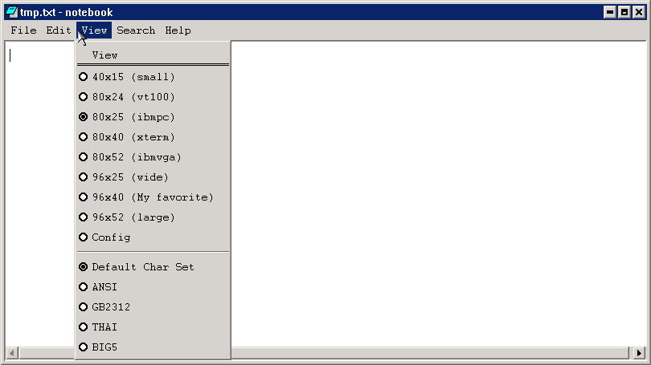
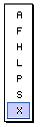

# Menu

## Concept of Menu

The menu is generally associated with a window (called normal menu), or
presented in independent, popup form (called popup menu). The menu mainly
provides the user a shortcut way to make a selection.

## Creating and Handling Menu

### Creating Normal Menu

In a program, we should first create a menu, and then pass the handle of the
menu to `CreateMainWindow` function, which creates a main window. When the main
window is shown, the created menu is shown under the caption bar. When the user
active and select a menu item using the mouse or the Alt key, the window with
which the menu associates will receive `MSG_COMMAND` message.

Two procedures are needed when creating a menu:

- Creating the menu bar.
- Creating the submenu of each menu in the menu bar.

First, we call `CreateMenu` to create an empty menu, and then call
`InsertMenuItem` 
function to add menu items to the empty menu, as shown in the following:

```cpp
    HMENU hmnu;
    MENUITEMINFO mii;

    hmnu = CreateMenu();
    memset (&mii, 0, sizeof(MENUITEMINFO));
    mii.type        = MFT_STRING ;
    mii.state       = 0;
    mii.id          = IDM_ABOUT_THIS;
    mii.typedata    = (DWORD);
    InsertMenuItem(hmnu, 0, TRUE, &mii);
```

If this menu item has its submenu, you can specify the submenu of this menu
item by setting hsubmenu variable of this menu item.

```cpp
    mii.hsubmenu    = create_file_menu();
```

The method to create a submenu is similar to the procedure to create a menu
bar, but you should call `CreatePopupMenu` function when creating an empty
submenu, as shown in the following:

```cpp
    HMENU hmnu;
    MENUITEMINFO mii;
    memset (&mii, 0, sizeof(MENUITEMINFO));
    mii.type        = MFT_STRING;
    mii.id          = 0;
    mii.typedata    = (DWORD)NB_STR_FILE;
    hmnu = CreatePopupMenu (&mii);

    memset (&mii, 0, sizeof(MENUITEMINFO));
    mii.type        = MFT_STRING;
    mii.state       = 0;
    mii.id          = IDM_NEW;
    mii.typedata    = (DWORD)NB_STR_NEW;
    InsertMenuItem(hmnu, 0, TRUE, &mii);
```

Hmnu handle in the above code can be used as the handle of the submenu of the
higher-level menu item.

### Creating Popup Menu

The use of a popup menu is different from a menu bar. The popup menu is usually
used to respond to the user’s clicking on the right mouse button, and generally
called “context menu”.

The method to create a popup menu is same as the method to create a submenu.
You need to call `CreatePopupMenu` function. To display this popup menu,
`TrackPopupMenu` function should be called:

```cpp
int GUIAPI TrackPopupMenu (HMENU hmnu, UINT uFlags, int x, int y, HWND hwnd);
```

X and y arguments are the screen coordinates of popup menu, its detail meaning
is related to `uFlags` argument. `UFlags` argument can take the following
values: 

- `TPM_LEFTALIGN`: Menu is horizontally left aligned based on (x, y) point, 
that 
is to say, x argument specifies the left position of menu.
- `TPM_CENTERALIGN`: horizontally center aligned.
- `TPM_RIGHTALIGN`: horizontally right aligned.
- `TPM_TOPALIGN`: vertically top aligned.
- `TPM_VCENTERALIGN`: vertically center aligned.
- `TPM_BOTTOMALIGN`: vertically bottom aligned.

If we want to pop up a normal menu, `uFlags` generally takes the value of
`TPM_LEFTALIGN` | `TPM_TOPALIGN`, if we want to popup a popup menu, `uFlags`
generally takes the value of `TPM_LEFTALIGN | `TPM_BOTTOMALIGN``.

The following code calls `CreatePopupMenu` function to create a popup menu. It
calls `StripPopupHead` function. This function is used to strip the head of the
popup menu of MiniGUI. The header of a popup menu is similar to the caption bar
of a main window, and the head information of a popup menu will be striped
after the function is called.

```cpp
    HMENU hNewMenu;
    MENUITEMINFO mii;
    HMENU hMenuFloat;
    memset (&mii, 0, sizeof(MENUITEMINFO));
    mii.type        = MFT_STRING;
    mii.id          = 0;
    mii.typedata    = (DWORD)"File";

    hNewMenu = CreatePopupMenu (&mii);

    hMenuFloat = StripPopupHead(hNewMenu);

    TrackPopupMenu (hMenuFloat, TPM_CENTERALIGN, 40, 151, hWnd);
```

### `MENUITEMINFO` Structure

`MENUITEMINFO` structure is the core data structure for operating a menu item,
and its definition is as follows:

```cpp
typedef struct _MENUITEMINFO {
     UINT                mask;
     UINT                type;
     UINT                state;
     int                 id;
     HMENU               hsubmenu;
     PBITMAP             uncheckedbmp;
     PBITMAP             checkedbmp;
     DWORD               itemdata; 
     DWORD               typedata;
     UINT                cch;
} MENUITEMINFO;
typedef MENUITEMINFO* PMENUITEMINFO;
```

Illustrations for these members are as follow:
- mask: used by `GetMenuItemInfo` and `SetMenuItemInfo` functions, can be 
`OR'ed` with the following values:
- `MIIM_STATE`: Get/Set the state of the menu item.
- `MIIM_ID`: Get/Set the identifier of the menu item.
- `MIIM_SUBMENU`: Get/Set the sub-menu of the menu item.
- `MIIM_CHECKMARKS`: Get/Set the check/uncheck bitmap.
- `MIIM_TYPE`: Get/Set the type and the type data of the menu item.
- `MIIM_DATA`: Get/Set the private data of the menu item.

These macros are used to define which items of the menu item `GetMenuItemInfo`
and `SetMenuItemInfo` functions operate on.
- type: type of menu items, which can be one of the following values:
- `MFT_STRING`: A normal text string menu item.
- `MFT_BITMAP`: A bitmap menu item.
- `MFT_BMPSTRING`: A bitmap menu item followed by a string.
- `MFT_SEPARATOR`: A separator in the menu.
- `MFT_RADIOCHECK`: A normal text string with a dot check mark.
- state: state of the menu item, which can be one of the following values:
- `MFS_GRAYED`: The menu item is disabled.
- `MFS_DISABLED`: The menu item is disabled.
- `MFS_CHECKED`: The menu item is checked. It could be displayed a hook when 
the type is `MFT_STRING` and displayed a dot when type is `MFT_RADIOCHECK`.
- `MFS_ENABLED`: The menu item is enabled.
- `MFS_UNCHECKED`: The menu item is unchecked.
- id: the integer identifier of the menu item
- hsubmenu: the handle of the sub-menu if this menu contains a sub menu.
- uncheckedbmp: the pointer to a `BITMAP` object used for unchecked bitmap menu
item. 
- checkedbmp: the pointer to a `BITMAP` object used for checked bitmap menu
item. 
- itemdata: the private data attached to the menu item
- typedata: the data of this menu item, used to pass the string of the menu
item. 
- cch: used by `GetMenuItemInfo` function to indicate the maximal length of the
string 

When the menu item is `MFT_BITMAP` type, the member typedata will be the 
pointer to the normal `BITMAP` object, the member uncheckedbmp will be the
pointer to the highlighted `BITMAP` object, and the member checkedbmp will be
the pointer to the checked `BITMAP` object. When the menu item is 
`MFT_BMPSTRING` type, the member typedata will be the pointer to the text
string, the member uncheckedbmp will be the pointer to the normal `BITMAP`
object, and the member checkedbmp will be the pointer to the checked `BITMAP`
object. 

### Operating on Menu Item

You can get the menu item properties of interest by `GetMenuItemInfo` function,
and can also set the menu item properties of interest by `SetMenuItemInfo`
function: 

```cpp
int GUIAPI GetMenuItemInfo (HMENU hmnu, int item, BOOL flag, PMENUITEMINFO pmii);
int GUIAPI SetMenuItemInfo (HMENU hmnu, int item, BOOL flag, PMENUITEMINFO pmii);
```

These two functions are used to get or set the properties of a menu item in 
hmnu menu. At this time, we need an approach to locate the menu item in the
menu. MiniGUI provides the following two ways:
- The argument flag is `MF_BYCOMMAND`: The position value item is based on the
command identifier. At this time, the item argument of the two functions above
is the command identifier of the item.
- The argument flag is `MF_` `BYPOSITION`: The position value item is based on
the position in the menu. At this time, the item argument of the two functions
above is the position index value of the menu item in the menu, and is zero for
the first menu item.

When set or get properties of menu, you should set the mask of `MENUITEMINFO`.
You can reference 7.2.3.

MiniGUI also provides some other functions to get or set the menu item
properties, and all these functions use the above methods to locate a menu 
item. These functions include `GetSubMenu`, `SetMenuItemBitmaps`, 
`GetMenuItemID`, `EnableMenuItem`, etc. Functions of all these can actually be
implemented by the above two functions, and we will not describe them once 
more. 

### Deleting and Destroying Menu or Menu Item

MiniGUI provides the following function to delete menu items from a menu or
destroy a menu:
- `RemoveMenu`: This function deletes a specified menu item from a menu. If the
menu item includes submenu, this function detaches the submenu from the
specified menu item, but does not delete the submenu.
- `DeleteMenu`: This function deletes a specified item from a menu. If the menu
item includes submenu, the function will destroy the submenu simultaneously.
- `DestroyMenu`: This function destroys the whole menu.

### `MSG_ACTIVEMENU` Message

When the user activates a popup menu in the menu bar, MiniGUI will send
`MSG_ACTIVEMENU` message to the window procedure in which the menu bar lies. 
The first parameter of this message is the position of the activated submenu,
and the second parameter is the handle of the activated submenu. The 
application can use this message to handle the menu, for example, change the
selection state of some menu items according to the running state of the
program. The following code is from libvcongui of MiniGUI, and it sets the
selection state of the menu item correspondingly according to the user’s
selections (the size of the virtual terminal and the character set):

```cpp
case MSG_ACTIVEMENU:
            if (wParam == 2) {
                CheckMenuRadioItem ((HMENU)lParam,
                    IDM_40X15, IDM_CUSTOMIZE,
                    pConInfo->termType, MF_BYCOMMAND);
                CheckMenuRadioItem ((HMENU)lParam, 
                    IDM_DEFAULT, IDM_BIG5,
                    pConInfo->termCharset, MF_BYCOMMAND);
            }
        break;
```

Note that in the above code, calling `CheckMenuRadioItem` function twice sets
the size of current terminal and the character set, respectively.

## Sample Program

List 1 is a fragment of code illustrating normal menu operations. This example
is a part of notebook in `MDE`. For the length consideration, here we only give
the part about the menu. The effect of the menu created by this program is 
shown in Figure 1

List 1 Sample of operating normal menu

```cpp
/* Create a “file” menu */
static HMENU createpmenufile (void)
{
    HMENU hmnu;
    MENUITEMINFO mii;
    memset (&mii, 0, sizeof(MENUITEMINFO));
    mii.type        = MFT_STRING;
    mii.id          = 100;
    mii.typedata    = (DWORD)NB_STR_FILE;
    mii.hsubmenu    = createpmenufile ();

    InsertMenuItem(hmnu, 0, TRUE, &mii);

    mii.type        = MFT_STRING;
    mii.id          = 110;
    mii.typedata    = (DWORD)NB_STR_EDIT;
    mii.hsubmenu    = createpmenuedit ();
    InsertMenuItem(hmnu, 1, TRUE, &mii);

    mii.type        = MFT_STRING;
    mii.id          = 120;
    mii.typedata    = (DWORD)NB_STR_VIEW;
    mii.hsubmenu    = createpmenuview ();
    InsertMenuItem(hmnu, 2, TRUE, &mii);

    mii.type        = MFT_STRING;
    mii.id          = 130;
    mii.typedata    = (DWORD)NB_STR_SEARCH;
    mii.hsubmenu    = createpmenusearch ();
    InsertMenuItem(hmnu, 3, TRUE, &mii);

    mii.type        = MFT_STRING;
    mii.id          = 140;
    mii.typedata    = (DWORD)NB_STR_HELP;
    mii.hsubmenu    = createpmenuabout ();
    InsertMenuItem(hmnu, 4, TRUE, &mii);

    return hmnu;
}

/* Create menu bar */
static HMENU createmenu (void)
{
    HMENU hmnu;
    MENUITEMINFO mii;

    hmnu = CreateMenu();

    memset (&mii, 0, sizeof(MENUITEMINFO));
    mii.type        = MFT_STRING;
    mii.id          = 100;
    mii.typedata    = (DWORD)NB_STR_FILE;
    mii.hsubmenu    = createpmenufile ();

    InsertMenuItem(hmnu, 0, TRUE, &mii);

    ...

    return hmnu;
}

    /* Handle MSG_ACTIVEMENU to ensure to set the selection state of menu items correctly */
    case MSG_ACTIVEMENU:
        if (wParam == 2) {
                /* Set the checked state of the menu items by CheckMenuRadioItem */
                CheckMenuRadioItem ((HMENU)lParam,
                    IDM_40X15, IDM_CUSTOMIZE,
                    pNoteInfo->winType, MF_BYCOMMAND);
                CheckMenuRadioItem ((HMENU)lParam,
                    IDM_DEFAULT, IDM_BIG5,
                    pNoteInfo->editCharset, MF_BYCOMMAND);
        }
        break;

    /* Handle MSG_COMMAND message to handle the commands of each menu item */
    case MSG_COMMAND:
        switch (wParam) {
        case IDM_NEW:
            break;

        case IDM_OPEN:
            break;

        case IDM_SAVE:
            break;

        case IDM_SAVEAS:
            break;
        };
```


__Figure 1__ Menu created by the notebook program

List 2 illustrates the sample program for the popup menu.

__List 2__ Sample program of popup menu</center>

```cpp
static HMENU CreateQuickMenu (void)
{
    int i;
    HMENU hNewMenu;
    MENUITEMINFO mii;
    HMENU hMenuFloat;

    char *msg[] = {
        "A",
        "F",
        "H",
        "L",
        "P",
        "S",
        "X"
    };

    memset (&mii, 0, sizeof(MENUITEMINFO));
    mii.type        = MFT_STRING;
    mii.id          = 0;
    mii.typedata    = (DWORD)"File";

    hNewMenu = CreatePopupMenu (&mii);

    for ( i = 0; i <7; i ++ ) {
        memset ( &mii, 0, sizeof (MENUITEMINFO) );
        mii.type = MFT_STRING;
        mii.id = 100+ i;
        mii.state = 0;
        mii.typedata= (DWORD) msg[i]; 
    InsertMenuItem ( hNewMenu, i, TRUE, &mii );
    }

    hMenuFloat = StripPopupHead(hNewMenu);

    TrackPopupMenu (hMenuFloat, TPM_CENTERALIGN | TPM_LEFTBUTTON , 40, 151, hWnd);
}
```

The pop up menu created by the program in List 2 is as shown in Figure 2.



__Figure 2__ Popup menu

----

[&lt;&lt; Advanced Programming of Control](MiniGUIProgGuidePart1Chapter04.md) |
[Table of Contents](README.md) |
[Scrollbar &gt;&gt;](MiniGUIProgGuidePart1Chapter07.md)

[Release Notes for MiniGUI 3.2]: /supplementary-docs/Release-Notes-for-MiniGUI-3.2.md
[Release Notes for MiniGUI 4.0]: /supplementary-docs/Release-Notes-for-MiniGUI-4.0.md
[Showing Text in Complex or Mixed Scripts]: /supplementary-docs/Showing-Text-in-Complex-or-Mixed-Scripts.md
[Supporting and Using Extra Input Messages]: /supplementary-docs/Supporting-and-Using-Extra-Input-Messages.md
[Using CommLCD NEWGAL Engine and Comm IAL Engine]: /supplementary-docs/Using-CommLCD-NEWGAL-Engine-and-Comm-IAL-Engine.md
[Using Enhanced Font Interfaces]: /supplementary-docs/Using-Enhanced-Font-Interfaces.md
[Using Images and Fonts on System without File System]: /supplementary-docs/Using-Images-and-Fonts-on-System-without-File-System.md
[Using SyncUpdateDC to Reduce Screen Flicker]: /supplementary-docs/Using-SyncUpdateDC-to-Reduce-Screen-Flicker.md
[Writing DRI Engine Driver for Your GPU]: /supplementary-docs/Writing-DRI-Engine-Driver-for-Your-GPU.md
[Writing MiniGUI Apps for 64-bit Platforms]: /supplementary-docs/Writing-MiniGUI-Apps-for-64-bit-Platforms.md

[Quick Start]: /user-manual/MiniGUIUserManualQuickStart.md
[Building MiniGUI]: /user-manual/MiniGUIUserManualBuildingMiniGUI.md
[Compile-time Configuration]: /user-manual/MiniGUIUserManualCompiletimeConfiguration.md
[Runtime Configuration]: /user-manual/MiniGUIUserManualRuntimeConfiguration.md
[Tools]: /user-manual/MiniGUIUserManualTools.md
[Feature List]: /user-manual/MiniGUIUserManualFeatureList.md

[MiniGUI Overview]: /MiniGUI-Overview.md
[MiniGUI User Manual]: /user-manual/README.md
[MiniGUI Programming Guide]: /programming-guide/README.md
[MiniGUI Porting Guide]: /porting-guide/README.md
[MiniGUI Supplementary Documents]: /supplementary-docs/README.md
[MiniGUI API Reference Manuals]: /api-reference/README.md

[MiniGUI Official Website]: http://www.minigui.com
[Beijing FMSoft Technologies Co., Ltd.]: https://www.fmsoft.cn
[FMSoft Technologies]: https://www.fmsoft.cn
[HarfBuzz]: https://www.freedesktop.org/wiki/Software/HarfBuzz/

