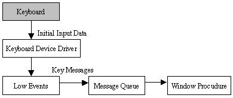
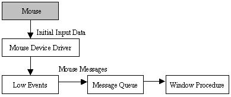
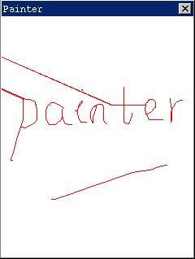

# Input Messages

- [Keyboard](#keyboard)
   + [Keyboard Input](#keyboard-input)
   + [Key Stroke Message](#key-stroke-message)
   + [Character Message](#character-message)
   + [Key Status](#key-status)
   + [Input Focus](#input-focus)
   + [Sample Program](#sample-program)
- [Mouse](#mouse)
   + [Mouse Input](#mouse-input)
   + [Mouse Message](#mouse-message)
   + [Capture of Mouse](#capture-of-mouse)
   + [Tracking Mouse Cursor](#tracking-mouse-cursor)
- [Event Hook](#event-hook)


The application receives the user’s input from keyboard and mouse (or other
pointing device, such as touch-screen). Application of MiniGUI receives
keyboard and mouse input by handling messages sent to window. We will describe
generation of keyboard and mouse message, and how application receives and
handles messages of keyboard and mouse in this chapter.

## Keyboard

### Keyboard Input

Figure 1 illustrates the process of handling keyboard input in MiniGUI.



__Figure 1__ Keyboard input in MiniGUI

MiniGUI receives original input event or data from keyboard through keyboard
device driver, and transforms it into MiniGUI abstract keyboard event and data.
Related handling procedures of bottom layer event transform these keyboard
events into key press/release messages of top layer and put them in the message
queue. Application gets these messages through message loop, and dispatches
them to window procedure for handling. MiniGUI can support 255 keys, and each
key corresponds to a unique “scan code”, scan code less than 129 is used to
define keys on `PC` keyboard. The following is the definition of some scan 
codes 
in `minigui/common.h`:

```cpp
#define MGUI_NR_KEYS                    255
#define NR_KEYS                         128
#define SCANCODE_USER                   (NR_KEYS + 1)

#define SCANCODE_ESCAPE                 1

#define SCANCODE_1                      2
#define SCANCODE_2                      3
#define SCANCODE_3                      4
#define SCANCODE_4                      5
#define SCANCODE_5                      6
#define SCANCODE_6                      7
#define SCANCODE_7                      8
#define SCANCODE_8                      9
#define SCANCODE_9                      10
#define SCANCODE_0                      11

#define SCANCODE_MINUS                  12
#define SCANCODE_EQUAL                  13

#define SCANCODE_BACKSPACE              14
#define SCANCODE_TAB                    15
...

```

### Key Stroke Message

When a key is pressed down, application will receive a message `MSG_KEYDOWN` or
`MGS_SYSKEYDOWN`; and releasing a key will generate a message `MSG_KEYUP` or
`MGS_SYSKEYUP`.

Pressing key and releasing key messages are usually appear in pairs; while the
user presses a key and does not release it, auto repeating characteristic of
the keyboard will be started up after a period of time, and the system will
generate a series of messages `MSG_KEYDOWN` or `MGS_SYSKEYDOWN`; and a message
`MSG_KEYUP` or `MSG_SYSKEYUP` will not be generated till the user releases this
key.

In MiniGUI, when the user presses one key as `ALT` being pressed down, system
keystroke messages `MSG_SYSKEYDOWN` and `MSG_SYSKEYUP` will be generated.
Non-system keystroke generates non-system keystroke messages `MSG_KEYDOWN` and
`MSG_KEYUP`. System keystroke messages are used to control the activation of
menu 
in MiniGUI, and non-system keystroke messages are mainly used in application.
If a system keystroke message is handled by application, this message should be
transferred to the function `DefaultMainWinProc` for handling furthermore.
Otherwise, system operation will be disabled.

Keystroke messages’ `wParam` parameter presents the scan code of the key, and
`lParam` parameter includes the status flags of special keys such as `SHIFT`,
`ALT`, 
`CTRL`, etc.

### Character Message

Usually, a typical window procedure does not handle directly the key stroke
messages of character keys, but handles character message `MSG_CHAR` of the
character key, and `wParam` parameter of message `MSG_CHAR` presents the encode
value of this character.

`MSG_CHAR` is usually generated by `TranslateMessage` function, which checks 
the 
scan code and the status of the corresponding key when receiving messages
`MSG_KEYDOWN` and `MSG_SYSKEYDOWN`. If it can be transformed to a character,
`MSG_CHAR` or `MSG_SYSCHAR` message of the corresponding character will be
generated, and will be sent to the target window of the keystroke message. The
application generally calls `TranslateMessage` function before 
`DispatchMessage` in
a message loop is as follows:

```cpp
    while (GetMessage(&Msg, hMainWnd)) {
        TranslateMessage(&Msg);
        DispatchMessage(&Msg);
    }
```

Because `TranslateMessage` function handles messages `MSG_KEYDOWN` and
`MSG_SYSKEYDOWN` before dispatching message, generates character message, and
transfers it directly to window procedure, window procedure will receive the
character message of character key first and then receive keystroke message.

Usually, parameter `wParam` of character message includes the `ISO8859-1` 
encode of
the character, and the content of parameter `lParam` is the same as the
parameter 
of keystroke message generating the character message.

The basic rule for handling key stroke message and character message is: You
can handle message `MSG_CHAR` if you want to get keyboard character input into
window; and you can handle message `MSG_KEYDOWN` when you want to get cursor
keys, function keys, Del, Ins, Shift, Ctrl and Alt key strokes.

### Key Status

Meanwhile handling keyboard messages, application need determine the current
status of special shift keys (Shift, Ctrl and Alt) or switch keys (CapsLock,
`NumLock`, and `ScrollLock`). Parameter `lParam` includes the status flags of
special 
keys, and application can determine the status of a certain key by using `AND`
operation of specific macro with this parameter. For example, if (lParam &
`KS_LEFTCTRL`) is `TRUE`, left `CTRL` key is pressed down. Key status macros
defined 
by MiniGUI include:

```
KS_CAPSLOCK          CapsLock key is locked
KS_NUMLOCK           NumLock key is locked
KS_SCROLLLOCK        ScrollLock key is locked
KS_LEFTCTRL          Left Ctrl key is pressed down
KS_RIGHTCTRL         Right Ctrl key is pressed down
KS_CTRL              One of Ctrl keys is pressed
KS_LEFTSHIFT         Left Shift key is pressed down
KS_RIGHTSHIFT        Right Shift key is pressed down
KS_SHIFT             One of Shift keys is pressed down
KS_IMEPOST           The message is posted by IME window
KS_LEFTBUTTON        Left mouse button is preesed down
KS_RIGHTBUTTON       Right mouse button is preesed down
KS_MIDDLBUTTON       Middle mouse button is preesed down
KS_CAPTURED          Mouse is captured by the target window
```

Except `KS_CAPTURED` can only be used for mouse message, other macros can be
used 
both for handling keystroke messages and mouse messages.

Application can get key status value through `GetShiftKeyStatus` function:

```cpp
DWORD GUIAPI GetShiftKeyStatus (void);\
```

The return value of this function includes the status of all above keys.
Application can determine a certain key status by using `AND` operation of
specific macro with the return value. For example, using `GetShiftKeyStatus(`) 
& 
`KS_CTRL` to determine whether the left or right Ctrl key is pressed, if it is
the value of expression above is `TRUE`.

Application can also get the status of a certain key on the keyboard through
`GetKeyStatus` function:

```cpp
BOOL GUIAPI GetKeyStatus (UINT uKey);
```

Parameter `uKey` presents the scan code of the key to be required. If this key
is 
pressed down, `GetKeyStatus` returns `TRUE`, otherwise returns `FALSE`.

### Input Focus

System sends keyboard messages to the message queue of the window currently
having input focus. Window with input focus can receive keyboard input, such
windows are usually active main window, child window of active main window or
grandchild window of active main window, etc. Child window usually indicates to
have input focus by displaying a blinking caret. Please refer to Chapter 10
“Icon, Cursor, and Caret” for information about caret.

Input focus is a property of window, and system can make keyboard shared to all
the windows displayed on the screen through changing the input focus among
these windows. The user can move input focus from one window to another. If
input focus is moved from one window to another, system sends message
`MSG_KILLFOCUS` to the window losing focus, and sends message `MSG_SETFOCUS` to
the 
window gaining focus.

Application can get the handle of the child window having input focus of a
certain window by calling `GetFocusChild` function:

```cpp
#define GetFocus GetFocusChild
HWND GUIAPI GetFocusChild (HWND hWnd);
```
Parent window can put input focus to any one of its child windows by calling
`SetFocusChild` function:

```cpp
#define SetFocus SetFocusChild
HWND GUIAPI SetFocusChild (HWND hWnd);
```
### Sample Program

The code in List 1 illustrates simple concept of keyboard input. The complete
code of this program is included in simplekey.c of sample program package
`mg-samples` for this guide.


List 1 simplekey.c

```cpp
#include <minigui/common.h>
#include <minigui/minigui.h>
#include <minigui/gdi.h>
#include <minigui/window.h>

static int SimplekeyWinProc(HWND hWnd, int message, WPARAM wParam, LPARAM lParam)
{
    switch (message) {
    case MSG_KEYDOWN:
        /* Print the scan code of the key pressed */
        printf ("MGS_KEYDOWN: key %d\n", LOWORD(wParam));
        break;

    case MSG_KEYUP:
        /* Print the scan code of the key released */
        printf ("MGS_KEYUP: key %d\n", LOWORD(wParam));
        break;

    case MSG_CHAR:
        /* Print the encode of the translated character */
        printf ("MGS_CHAR: char %d\n", wParam);
        break;

    case MSG_CLOSE:
        DestroyAllControls (hWnd);
        DestroyMainWindow (hWnd);
        PostQuitMessage (hWnd);
        return 0;
    }

    return DefaultMainWinProc(hWnd, message, wParam, lParam);
}

/* the below code for creating main window are omitted */
```

Window procedure of above program prints the parameter `wParam` of each message
`MSG_KEYDOWN`, `MSG_KEYUP`, and `MGS_CHAR` it received. The value of this
parameter may be scan code of the pressed/released key (MSG_KEYDOWN and
`MSG_KEYUP`), and may also be encode value of the character (MSG_CHAR).

## Mouse

### Mouse Input

The handling for mouse is similar to that for keyboard in MiniGUI, as shown in
Figure 2.




Figure 2 Mouse input in MiniGUI


MiniGUI receives original input event or data through mouse device driver, and
transforms it into MiniGUI abstract mouse event and data. Related bottom event
handling procedures transform these mouse events into mouse messages of top
layer and put them into the message queue. Application gets these messages
through message loop, and dispatches them to window procedure for handling.

When the user moves the mouse, system moves an icon called mouse cursor. Mouse
cursor includes a pixel point called hotspot, which is used by system to track
and identify the mouse position. If a mouse event occurs, the window under the
hotspot usually receives related mouse messages. Window, which can receive 
mouse messages, are not always active window or window-having keyboard input
focus. Please refer to Chapter 10 “Icon, Cursor, and Caret” for information
about mouse cursor.

### Mouse Message

As long as the user moves mouse, presses down or releases mouse button, a mouse
event will be generated. MiniGUI transforms mouse input events of bottom layer
into mouse messages and posts them into the message queen of corresponding
window. When mouse cursor is within a window, or a mouse event occurs when the
window captures the mouse, the window will receive mouse message, regardless
whether this window is active or has input focus.

Mouse messages can be divided into tow group: client area messages and
non-client area messages. Application usually treats only client area mouse
messages and ignores non-client area mouse messages.

If mouse cursor is in client area of the window when mouse event occurs, the
window will receive a client area mouse message. If the user moves mouse in
client area, system posts a message `MSG_MOUSEMOVE` to the window. When cursor
is in client area, the following message is sent if the user presses down or
releases a mouse button:

```cpp
MSG_LBUTTONDOWN         left mouse button is pressed down
MSG_LBUTTONUP           left mouse button is released
MSG_RBUTTONDOWN         right mouse button is pressed down
MSG_RBUTTONUP           right mouse button is released
MSG_LBUTTONDBLCLK       left mouse button is double clicked
MSG_RBUTTONDBLCLK       right mouse button is double clicked
```

Parameter `lParam` of mouse messages in client area indicates the position of
hotspot, the low word is the x-coordinate of the point and the high word is the
y-coordinate. These two positions are both given in client area coordinate,
i.e., coordinates relative to upper-left (0, 0) of client area of the window. 
It should be noted that the position coordinates of above messages are given in
screen coordinate when a window captures the mouse.

Parameter `lParam` is the key status value discussed in previous section, which
indicates the status of other buttons of mouse and shift keys of `CTRL` and
`SHIFT` etc., when mouse event occurs. You must check these flags when you need
to handle mouse messages according to other buttons or status of `CTRL` and
`SHIFT` keys. For example, if (lParam & `KS_SHIFT`) is `TRUE`, then a mouse
event takes place when `SHIFT` key is pressed down.

If mouse event occurs in the non-client area of the window, such as caption 
bar, menu and window scrollbar, the window will receive a mouse message of
non-client area, which includes:

```
MSG_NCLBUTTONDOWN         left mouse button is pressed down
MSG_NCLBUTTONUP           left mouse button is released
MSG_NCRBUTTONDOWN         right mouse button is pressed down
MSG_NCRBUTTONUP           right mouse button is released
MSG_NCLBUTTONDBLCLK       left mouse button is double clicked
MSG_NCRBUTTONDBLCLK       right mouse button is double clicked
```

Usually, application need not handle non-client area mouse messages, but leaves
them to system for default handling; thereby some system function can be
implemented. 

Parameter `lParam` of non-client area mouse message includes x-coordinate at 
low word and y-coordinate at high word, which are both window coordinate.
Parameter `wParam` of non-client area mouse message indicates the position of
non-client area when moving or clicking mouse button, which is one of the
identifiers beginning with `HT` defined in `minigui/window.h`:

```cpp
    #define HT_UNKNOWN            0x00
    #define HT_OUT                0x01
    #define HT_MENUBAR            0x02
    #define HT_TRANSPARENT        0x03
    #define HT_BORDER_TOP         0x04
    #define HT_BORDER_BOTTOM      0x05
    #define HT_BORDER_LEFT        0x06
    #define HT_BORDER_RIGHT       0x07
    #define HT_CORNER_TL          0x08
    #define HT_CORNER_TR          0x09
    #define HT_CORNER_BL          0x0A
    #define HT_CORNER_BR          0x0B
    #define HT_CLIENT             0x0C

    #define HT_NEEDCAPTURE        0x10
    #define HT_BORDER             0x11
    #define HT_NCLIENT            0x12
    #define HT_CAPTION            0x13
    #define HT_ICON               0x14
    #define HT_CLOSEBUTTON        0x15
    #define HT_MAXBUTTON          0x16
    #define HT_MINBUTTON          0x17
    #define HT_HSCROLL            0x18
    #define HT_VSCROLL            0x19
```

Above identifiers are called hit-testing code, and the hotspot position
identified includes caption bar, menu bar, and client area etc.

If a mouse event occurs, system will send a `MSG_HITTEST` (`MSG_NCHITTEST`)
message 
to the window having cursor hotspot or the window capturing the mouse, and
MiniGUI determines whether send the mouse message to the client area or
non-client area.

`WParam` parameter of `MSG_HITTEST` message is the x-coordinate of the cursor
hotspot, and `lParam` parameter is the y-coordinate of the cursor hotspot. The
default mouse message procedure in MiniGUI handles `MSG_HITTEST` message, 
checks 
the pair of coordinate and returns a hit-testing code of the cursor hotspot. If
the cursor hotspot is in the client area of the window, the hit-testing code of
`HT_CLIENT` is returned, and MiniGUI switched the screen coordinate into client
area coordinate, and then post client area mouse messages to corresponding
window process. If the cursor hotspot is in the non-client area of the window,
other hit-testing codes are returned, and MiniGUI post non-client area mouse
messages to window procedure, and place the hit-testing code into `wParam`
parameter, and place the cursor coordinate into `lParam` paramter.

### Capture of Mouse

The window procedure usually received mouse messages only when the mouse cursor
is in the client area or non-client area, i.e., the system only sends mouse
messages to a window under the cursor hotspot. While in some cases the
application may need to receive mouse messages, even if the cursor hotspot is
outside its window area. In this case, we can use `SetCapture` function to make
a 
certain window capture the mouse, so that this window will receive all mouse
messages before the application calls `ReleaseCapture` to recover normal mouse
handling mode:

The following are the function definitions about capture of mouse:

```cpp
HWND GUIAPI SetCapture(HWND hWnd);
void GUIAPI ReleaseCapture(void);
HWND GUIAPI GetCapture(void);
```

At a certain time, only one window can capture the mouse, and the application
can use `GetCapture` function to determine which window has captured the mouse
at 
present.

Generally speaking, the mouse is only captured when the mouse button is pressed
down in the client area, and releases the mouse capture when the mouse button
is released.

The code in List 2 creates a simple button-like control, and its response to
the mouse action is like a button and can demonstrate the necessity of the
mouse capture, although it can do nothing and does not look like a button very
much. The complete code is available in program capture.c in the example
program package `mg-samples` for this guide.

__List 2__ capture.c

```cpp
#include <minigui/common.h>
#include <minigui/minigui.h>
#include <minigui/gdi.h>
#include <minigui/window.h>
#include <minigui/control.h>

#define IDC_MYBUTTON    100

/* the callback function of the simple button control class  */
static int MybuttonWindowProc (HWND hWnd, int message, WPARAM wParam, LPARAM lParam)
{
    HDC hdc;
    /* 
     * used to save the button status.
     * Noet: you should not use a static variable to save
     * the information of a control instance.
     */
    static int status = 0;

    switch (message) {
    case MSG_LBUTTONDOWN:
        /* set the pressed status */
        status = 1;
        /* capture the mouse */
        SetCapture (hWnd);
        /* invalidate the control, causing to repaint the button */
        InvalidateRect (hWnd, NULL, TRUE);
    break;

    case MSG_LBUTTONUP:
        if (GetCapture() = hWnd)
            break;
        /* set the released status */
        status = 0;
        /* release the mouse */
        ReleaseCapture ();
        /* invalidate the control, causing to repaint the button */
        InvalidateRect (hWnd, NULL, TRUE);
    break;

    case MSG_PAINT:
        hdc = BeginPaint (hWnd);
        /* perform different repainting according to the pressed or released status */
        if (status) {
            SetBkMode(hdc, BM_TRANSPARENT);
            TextOut(hdc, 0, 0, "pressed");
        }
        EndPaint(hWnd, hdc);
        return 0;

    case MSG_DESTROY:
        return 0;
    }

    return DefaultControlProc (hWnd, message, wParam, lParam);
}

/* this function registers simple button control class */
BOOL RegisterMybutton (void)
{
    WNDCLASS WndClass;

    WndClass.spClassName = "mybutton";
    WndClass.dwStyle     = 0;
    WndClass.dwExStyle   = 0;
    WndClass.hCursor     = GetSystemCursor(0);
    WndClass.iBkColor    = PIXEL_lightgray;
    WndClass.WinProc     = MybuttonWindowProc;

    return RegisterWindowClass (&WndClass);
}

/* main windoww proc */
static int CaptureWinProc(HWND hWnd, int message, WPARAM wParam, LPARAM lParam)
{
    switch (message) {
    case MSG_CREATE:
        /* register the simple button control class */
        RegisterMybutton();
        /* creates an instance of the simple button cotrol class */
        CreateWindow ("mybutton", "", WS_VISIBLE | WS_CHILD, IDC_MYBUTTON, 
                30, 50, 60, 20, hWnd, 0);
        break;

    case MSG_CLOSE:
        /* destroys the control and the main window */
        DestroyAllControls (hWnd);
        DestroyMainWindow (hWnd);
        PostQuitMessage (hWnd);
        return 0;
    }

    return DefaultMainWinProc(hWnd, message, wParam, lParam);
}

/* the code below for creating the main window are omitted */
```

### Tracking Mouse Cursor

Tracking the position of the mouse cursor is one of the tasks the GUI
application usually needs to do. For example, the position of the mouse cursor
needs to be tracked when the painting program performs painting operation, so
that the user can paint in the client area of the window by dragging the mouse.

`MSG_LBUTTONDOWN`, `MSG_LBUTTONUP`, and `MSG_MOUSEMOVE` messages need to be
handled 
for tracking the mouse cursor. Generally, the window procedure begins to track
the mouse cursor when `MSG_LBUTTONDOWN` message occurs, determines the current
position of the cursor through handling `MSG_MOUSEMOVE` message, and ends
tracking the mouse cursor when `MSG_LBUTTONUP` occurs.

The code in List 3 is a simple painting program, which allows you to paint
arbitrarily in the client area of the window, and clear the screen when the
user clicks the right button. The complete code of this program is available in
program painter.c in the example program package `mg-samples` for this guide.

__List 3__ painter.c

```cpp
#include <minigui/common.h>
#include <minigui/minigui.h>
#include <minigui/gdi.h>
#include <minigui/window.h>
#include <minigui/control.h>

static int PainterWinProc(HWND hWnd, int message, WPARAM wParam, LPARAM lParam)
{
    HDC hdc;
    /* Use static variables to save the running status 
     * and the position where the mouse is pressed
     */
    static BOOL bdraw = FALSE;
    static int pre_x, pre_y;

    switch (message) {
    case MSG_LBUTTONDOWN:
       /* enter painting status; capture the mouse and write the position 
        * where the mouse is pressed
        */
        bdraw = TRUE;
        SetCapture(hWnd);
        pre_x = LOWORD (lParam);
        pre_y = HIWORD (lParam);
        break;

    case MSG_MOUSEMOVE:
    {
        int x = LOWORD (lParam);
        int y = HIWORD (lParam);

        if (bdraw) {
            /* if it is in painting status, the moused is indicated to be captured, 
             * and therefore the mouse coordinates need to be converted from 
             * screen coordinate to client coordinate
             */
            ScreenToClient(hWnd, &x, &y);

            /* get the graphics device context of the client area and begin to paint */
            hdc = GetClientDC(hWnd);
            SetPenColor(hdc, PIXEL_red);

            /* paint a straight line from the previous position
             * to the current mouse position
             */
            MoveTo(hdc, pre_x, pre_y);
            LineTo(hdc, x, y);
            ReleaseDC(hdc);
            /* update the previous position with the current mouse position */
            pre_x = x;
            pre_y = y;
        }
        break;
    }

    case MSG_LBUTTONUP:
        /* quit painting status and release the mouse */
        bdraw = FALSE;
        ReleaseCapture();
        break;

    case MSG_RBUTTONDOWN:
        /* click the right buttion of the mouse to clear the window */
        InvalidateRect(hWnd, NULL, TRUE);
        break;

    case MSG_CLOSE:
        DestroyAllControls (hWnd);
        DestroyMainWindow (hWnd);
        PostQuitMessage (hWnd);
        return 0;
    }

    return DefaultMainWinProc (hWnd, message, wParam, lParam);
}

/* the code below for creating main window are omitted */
```



__Figure 3__ A simple painting program

The painting flag is set to be `TRUE` when painter handles `MSG_LBUTTONDOWN`
message, so that the program can paint when receiving `MSG_MOUSEMOVE` message.
In 
order to prevent the mouse from being released in other window and prevent the
window procedure from receiving `MSG_LBUTTONUP` message, painter calls
`SetCapture` 
function to capture the mouse when `MSG_LBUTTONDOWN` message occurs.

The program performs painting in `MSG_MOUSEMOVE` message, ends painting when
receiving `MSG_LBUTTONUP`, and calls `ReleaseCapture` to release the mouse
capture. 

The program calls `InvalidateRect` function to clear the content in the client
region when receiving `MSG_RBUTTONDOWN`.

## Event Hook

In common cases, keyboard events and mouse events are transferred from the
bottom layer device to the application window procedure in a normal approach
for handling. MiniGUI provides a kind of mechanism so that we can capture these
events before they are transformed to corresponding message queue and
transferred to specific windows. Then there are two choices available: Let the
event transferred in the normal approach; or cancel the normal event handling
process. This is the hook mechanism. The hook is a callback function in nature,
and if the application registers a hook, the system will call this callback
function in the midway of transferring messages, and then determine whether to
continue to transfer the message according to the return value of the callback
function.

The prototype of the hook callback function defined for MiniGUI-Threads and
MiniGUI-Standalone is as follows:

```cpp
typedef int (* MSGHOOK)(void* context, HWND dst_wnd, int msg, WPARAM wparam, LPARAM lparam);
```

Wherein context is a context data passed in when registering the hook, which
may be a pointer; `dst_wnd` is the target main window of this message; msg is
the 
message identifier; wparam and lparam are the two parameters of the message.
The returned value of the hook function determines whether the system continues
to transfer the event: continues to transfer the event when returning
`HOOK_GOON`; and stops transferring the event when returning `HOOK_STOP`.

The application may call the following two functions to register the hook
function of the keyboard and the mouse events for MiniGUI-Threads and
MiniGUI-Standalone, respectively:

```cpp
MSGHOOK GUIAPI RegisterKeyMsgHook (void* context, MSGHOOK hook);
MSGHOOK GUIAPI RegisterMouseMsgHook (void* context, MSGHOOK hook);
```

You need only pass the context information and the pointer of the hook callback
function when calling these two functions. If you want to unregister the hook
function previously registered, you need only transfer `NULL` in, as described
below:

```cpp
int my_hook (void* context, HWND dst_wnd, int msg, WPARAM wParam, LPARAM lparam)
{
    if (...)
        return HOOK_GOON;
    else
        return HOOK_STOP;
}

MSGHOOK old_hook = RegisterKeyMsgHook (my_context, my_hook);

...

/* Restore old hook */
RegisterKeyMsgHook (0, old_hook);
```

Event hook mechanism is very import to some applications, for example, you can
use keyboard hook when the application needs to capture some global keys.

When you handle the event hook under MiniGUI-Threads, the following fact must
be noted:

__NOTE__ The hook callback function is called by the desktop thread, i.e., the
hook callback function is executed in the desktop thread, therefore, you can
not send messages to other threads through `SendMessage` in the hook callback
function, which may cause the occurrence of a possible deadlock.

Besides the hook mechanism for MiniGUI-Threads and MiniGUI-Standalone described
above, MiniGUI provides a different hook mechanism for MiniGUI-Processes.

For a client of MiniGUI-Processes, you can use the following functions to
register a hook window:

```cpp
HWND GUIAPI RegisterKeyHookWindow (HWND hwnd, DWORD flag);
HWND GUIAPI RegisterMouseHookWindow (HWND hwnd, DWORD flag);
```

Wherein hwnd is the handle to a window of a client, flag indicates whether stop
or continue handling the hooked messages: `HOOK_GOON` to continue and 
`HOOK_STOP` 
to stop.

After registering a key/mouse hook window, the server of MiniGUI-Processes will
post the key/mouse messages to the window of the client first. It will
determine whether stop handling the messages or continue the normal handling by
the flag of the hook.

MiniGUI provides another hook mechanism for the server of MiniGUI-Processes.
The event can be received in the sever process, captured before it is
transferred to its desktop window or a certain client for further handling. On
the event-transferring path, the position of this hook is earlier than that of
the hook mentioned above.

The prototype of the hook callback function prepared for the sever process of
MiniGUI-Processes is:

```cpp
typedef int (* SRVEVTHOOK) (PMSG pMsg);
```

Here, `pMsg` is the pointer to the message structure to be transferred. The
server can modify arbitrarily the value in the message structure, which this
pointer points to. The sever process will continue the normal handling of the
event when the callback function returns `HOOK_GOON`, and cancels the handling
when `HOOK_STOP` is returned.

`mginit` program can register hook function in the system through the following
function:

```cpp
SRVEVTHOOK GUIAPI SetServerEventHook (SRVEVTHOOK SrvEvtHook);
```

This function returns the old hook function.

By using the hook function, we can monitor the idle of the system, and start up
the screen saver when the system idle time is up to the specified value.

----

[&lt;&lt; Scrollbar](MiniGUIProgGuidePart1Chapter07.md) |
[Table of Contents](README.md) |
[Icon, Cursor, and Caret &gt;&gt;](MiniGUIProgGuidePart1Chapter09.md)

[Release Notes for MiniGUI 3.2]: /supplementary-docs/Release-Notes-for-MiniGUI-3.2.md
[Release Notes for MiniGUI 4.0]: /supplementary-docs/Release-Notes-for-MiniGUI-4.0.md
[Showing Text in Complex or Mixed Scripts]: /supplementary-docs/Showing-Text-in-Complex-or-Mixed-Scripts.md
[Supporting and Using Extra Input Messages]: /supplementary-docs/Supporting-and-Using-Extra-Input-Messages.md
[Using CommLCD NEWGAL Engine and Comm IAL Engine]: /supplementary-docs/Using-CommLCD-NEWGAL-Engine-and-Comm-IAL-Engine.md
[Using Enhanced Font Interfaces]: /supplementary-docs/Using-Enhanced-Font-Interfaces.md
[Using Images and Fonts on System without File System]: /supplementary-docs/Using-Images-and-Fonts-on-System-without-File-System.md
[Using SyncUpdateDC to Reduce Screen Flicker]: /supplementary-docs/Using-SyncUpdateDC-to-Reduce-Screen-Flicker.md
[Writing DRM Engine Driver for Your GPU]: /supplementary-docs/Writing-DRM-Engine-Driver-for-Your-GPU.md
[Writing MiniGUI Apps for 64-bit Platforms]: /supplementary-docs/Writing-MiniGUI-Apps-for-64-bit-Platforms.md

[Quick Start]: /user-manual/MiniGUIUserManualQuickStart.md
[Building MiniGUI]: /user-manual/MiniGUIUserManualBuildingMiniGUI.md
[Compile-time Configuration]: /user-manual/MiniGUIUserManualCompiletimeConfiguration.md
[Runtime Configuration]: /user-manual/MiniGUIUserManualRuntimeConfiguration.md
[Tools]: /user-manual/MiniGUIUserManualTools.md
[Feature List]: /user-manual/MiniGUIUserManualFeatureList.md

[MiniGUI Overview]: /MiniGUI-Overview.md
[MiniGUI User Manual]: /user-manual/README.md
[MiniGUI Programming Guide]: /programming-guide/README.md
[MiniGUI Porting Guide]: /porting-guide/README.md
[MiniGUI Supplementary Documents]: /supplementary-docs/README.md
[MiniGUI API Reference Manuals]: /api-reference/README.md

[MiniGUI Official Website]: http://www.minigui.com
[Beijing FMSoft Technologies Co., Ltd.]: https://www.fmsoft.cn
[FMSoft Technologies]: https://www.fmsoft.cn
[HarfBuzz]: https://www.freedesktop.org/wiki/Software/HarfBuzz/
